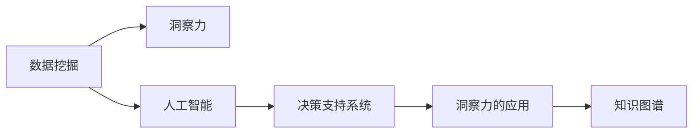

                 

# 理解洞察力的实践：在决策中运用智慧

## 1. 背景介绍

在今天这个信息爆炸的时代，决策者面临着前所未有的复杂性和不确定性。无论是企业高层还是普通员工，无论是政府官员还是普通市民，都面临着如何在大数据、人工智能等先进技术的支持下，做出更加精准、高效、安全的决策。在这一过程中，洞察力（Insight）变得尤为重要。洞察力不仅能够帮助人们从海量数据中提取出关键信息，还能够在决策中融入人类智慧和经验，从而实现智能与经验的有机结合。

### 1.1 问题由来

在过去几十年里，数据科学和人工智能技术取得了长足的进步，但随之而来的挑战也愈发突出。一方面，数据量的爆炸性增长为决策者提供了前所未有的机会，但另一方面，也带来了对数据理解和处理能力的需求。洞察力作为数据和人类智慧的桥梁，显得尤为重要。

具体来说，目前存在以下问题：
- **数据质量与量**：虽然数据量在不断增加，但数据质量参差不齐，且存在噪声、偏差等问题。
- **数据处理能力**：传统的统计分析方法已经无法应对复杂的、多模态的数据。
- **决策速度与效率**：决策者需要从数据中提取关键信息，并迅速做出决策，但在数据量庞大的情况下，这一过程耗时且容易出错。
- **决策质量与准确性**：传统的基于统计的决策方法往往无法捕捉到数据中的非线性关系和复杂的关联。

### 1.2 问题核心关键点

为了解决上述问题，我们需要发展一种新的决策技术，即在数据科学和人工智能技术的基础上，加入洞察力的元素。洞察力包括但不限于以下几个关键点：
- **数据理解与分析**：能够对数据进行深层次的理解与分析，提取出关键信息。
- **人类智慧与经验**：将人类对业务的理解、经验、直觉融入决策过程。
- **模型与算法**：设计高效的算法和模型，能够处理复杂、多模态的数据。
- **智能与经验的结合**：智能技术能够辅助人类决策，而经验能够指导智能技术的应用。

## 2. 核心概念与联系

### 2.1 核心概念概述

要理解和应用洞察力，我们需要先了解以下核心概念：

- **洞察力（Insight）**：指从大量数据中提取出的关键信息或隐含知识，能够帮助决策者更好地理解数据背后的意义。
- **数据挖掘（Data Mining）**：指从数据中发现有用信息、知识、规律和趋势的过程。
- **人工智能（AI）**：一种通过计算机模拟人类智能的技术，包括机器学习、深度学习、自然语言处理等。
- **决策支持系统（Decision Support System, DSS）**：利用数据分析和人工智能技术辅助决策的技术系统。
- **知识图谱（Knowledge Graph）**：一种用于表示实体及其关系的数据模型，能够帮助机器更好地理解人类知识。

这些核心概念之间存在紧密的联系。数据挖掘为洞察力的提取提供了基础，而人工智能则提供了处理复杂数据的技术手段，决策支持系统则将洞察力与决策过程结合起来，知识图谱则为洞察力的提取和应用提供了知识背景。

### 2.2 核心概念原理和架构的 Mermaid 流程图



这个流程图展示了数据挖掘、人工智能、决策支持系统、洞察力和知识图谱之间的联系。

## 3. 核心算法原理 & 具体操作步骤

### 3.1 算法原理概述

洞察力的提取和应用，涉及多个核心算法和技术，包括但不限于：

- **机器学习（Machine Learning, ML）**：通过学习数据的模式和规律，提取关键特征。
- **深度学习（Deep Learning, DL）**：处理复杂、多模态的数据，提取高层次的特征。
- **自然语言处理（Natural Language Processing, NLP）**：处理文本数据，提取语义信息。
- **知识图谱（Knowledge Graph,KG）**：利用图结构表示实体及其关系，帮助机器更好地理解知识。

这些算法和技术能够协同工作，从数据中提取出洞察力，并将其应用于决策过程中。

### 3.2 算法步骤详解

基于洞察力的决策流程大致包括以下几个步骤：

**Step 1: 数据收集与预处理**
- 收集各类数据源，包括结构化数据、非结构化数据、多模态数据等。
- 对数据进行清洗、去重、处理缺失值等预处理工作，确保数据质量。

**Step 2: 特征工程**
- 利用机器学习和深度学习算法，提取数据的特征。
- 特征工程包括特征选择、特征变换、特征组合等技术，目的是提取出对决策有帮助的关键信息。

**Step 3: 模型训练与评估**
- 使用已有的模型对数据进行训练，评估模型的性能。
- 常见的模型包括线性回归、决策树、随机森林、支持向量机、神经网络等。
- 评估模型的性能通常使用交叉验证、ROC曲线、F1-score等指标。

**Step 4: 洞察力提取**
- 利用自然语言处理技术，从文本数据中提取关键信息。
- 利用知识图谱，将信息与知识图谱中的实体进行关联，提取出有意义的洞察力。

**Step 5: 决策支持**
- 将洞察力融入决策支持系统，辅助决策者进行决策。
- 决策支持系统通常包括数据展示、情景模拟、风险评估等功能。

**Step 6: 持续学习与优化**
- 定期更新模型和算法，优化洞察力的提取过程。
- 利用反馈机制，不断调整决策支持系统，提高决策质量。

### 3.3 算法优缺点

基于洞察力的决策算法具有以下优点：
- **精度高**：通过多层次的特征提取和复杂的算法，能够从数据中提取精准的洞察力。
- **适应性强**：能够处理复杂、多模态的数据，适应不同类型的数据源。
- **决策支持**：通过决策支持系统，辅助决策者做出更加科学的决策。

同时，也存在一些缺点：
- **数据依赖性强**：依赖高质量的数据，数据偏差和噪声可能影响洞察力的提取。
- **复杂度高**：涉及多种技术和算法，实施复杂，需要较高的技术门槛。
- **计算资源消耗大**：模型训练和特征工程需要大量计算资源，成本较高。

### 3.4 算法应用领域

基于洞察力的决策算法广泛应用于多个领域，包括但不限于：

- **金融风控**：通过数据分析和模型训练，提取市场风险和欺诈行为的洞察力，辅助风险控制。
- **市场营销**：通过客户行为数据分析，提取市场趋势和消费者偏好的洞察力，辅助市场策略制定。
- **医疗诊断**：通过病历数据分析，提取患者病情的洞察力，辅助医生诊断和治疗。
- **供应链管理**：通过供应链数据的分析，提取供应链风险和优化的洞察力，辅助企业决策。
- **智能制造**：通过生产数据的分析，提取生产流程中的洞察力，辅助企业优化生产。

## 4. 数学模型和公式 & 详细讲解 & 举例说明

### 4.1 数学模型构建

基于洞察力的决策模型通常包括以下几个部分：

1. **输入数据**：包括结构化数据、非结构化数据、多模态数据等。
2. **特征提取**：通过机器学习和深度学习算法，从数据中提取特征。
3. **模型训练**：利用已有的模型对数据进行训练，评估模型的性能。
4. **洞察力提取**：利用自然语言处理和知识图谱技术，从数据中提取出有意义的洞察力。
5. **决策支持**：将洞察力融入决策支持系统，辅助决策者进行决策。

### 4.2 公式推导过程

以金融风控为例，假设有一个二分类问题，目标是根据客户的历史行为数据，判断其是否存在违约风险。使用决策树算法进行模型训练，假设输入特征为 $x_1, x_2, \cdots, x_n$，输出为 $y$，其中 $y=1$ 表示存在违约风险，$y=0$ 表示不存在违约风险。决策树模型可以表示为：

$$
T = \{(x, y) \rightarrow \left\{ \begin{aligned}
& (x_1 < 阈值_1) \rightarrow T_1 \\
& (x_1 \geq 阈值_1) \rightarrow T_2
\end{aligned} \right.
$$

其中 $T_1$ 和 $T_2$ 是子树。训练过程中，通过交叉验证等方法评估模型的性能，并不断调整阈值等参数。

### 4.3 案例分析与讲解

在金融风控中，通过数据挖掘和机器学习技术，可以提取客户的违约风险特征，如收入水平、还款记录、信用评分等。然后，利用决策树模型对这些特征进行训练，提取客户是否存在违约风险的洞察力。最后，将这些洞察力融入决策支持系统，辅助决策者进行风险评估和控制。

## 5. 项目实践：代码实例和详细解释说明

### 5.1 开发环境搭建

为了进行基于洞察力的决策实践，我们需要搭建合适的开发环境。以下是使用Python进行Scikit-learn和TensorFlow开发的环境配置流程：

1. 安装Anaconda：从官网下载并安装Anaconda，用于创建独立的Python环境。

2. 创建并激活虚拟环境：
```bash
conda create -n insight-env python=3.8 
conda activate insight-env
```

3. 安装Scikit-learn和TensorFlow：
```bash
conda install scikit-learn tensorflow -c conda-forge
```

4. 安装各类工具包：
```bash
pip install numpy pandas scikit-learn matplotlib tqdm jupyter notebook ipython
```

完成上述步骤后，即可在`insight-env`环境中开始决策实践。

### 5.2 源代码详细实现

下面是使用Scikit-learn和TensorFlow对决策树模型进行训练的Python代码实现：

```python
from sklearn.tree import DecisionTreeClassifier
from sklearn.model_selection import train_test_split
import tensorflow as tf
import numpy as np
import pandas as pd

# 准备数据
data = pd.read_csv('customer_data.csv')
X = data.drop('default', axis=1)
y = data['default']

# 数据预处理
X = (X - X.mean()) / X.std()

# 划分数据集
X_train, X_test, y_train, y_test = train_test_split(X, y, test_size=0.2, random_state=42)

# 训练模型
model = DecisionTreeClassifier()
model.fit(X_train, y_train)

# 评估模型
score = model.score(X_test, y_test)
print(f"模型准确率：{score:.2f}")
```

### 5.3 代码解读与分析

让我们再详细解读一下关键代码的实现细节：

**数据准备**：
- `pd.read_csv`方法用于读取客户数据，将其转换为Pandas DataFrame格式。
- `drop`方法用于去除默认行为标签，仅保留客户特征数据。

**数据预处理**：
- 使用归一化方法对特征数据进行标准化处理，避免不同特征之间的量级差异影响模型训练。

**模型训练**：
- `train_test_split`方法用于将数据集划分为训练集和测试集。
- `DecisionTreeClassifier`用于创建决策树模型，`fit`方法用于训练模型。

**模型评估**：
- `score`方法用于计算模型在测试集上的准确率，并打印输出。

**注意事项**：
- 在实际应用中，可能需要对数据进行更复杂的处理，如特征选择、特征变换等。
- 决策树的参数选择、剪枝等策略也可能影响模型的性能。
- 训练过程中需要进行交叉验证，以评估模型的泛化能力。

## 6. 实际应用场景

### 6.1 金融风控

在金融风控中，洞察力技术能够有效识别客户的违约风险，帮助银行和金融机构控制贷款风险，减少坏账率。通过大数据分析和机器学习技术，可以从客户的信用记录、交易记录、社交网络等多维度数据中提取客户的行为特征，构建客户违约风险模型，并实时监控客户行为，预测其违约概率。

### 6.2 市场营销

洞察力技术能够帮助企业了解客户需求，优化产品和服务。通过数据分析和机器学习技术，可以从客户的购买记录、浏览历史、社交媒体评论等数据中提取客户偏好和行为特征，构建客户画像，为营销策略制定提供数据支持。

### 6.3 医疗诊断

在医疗诊断中，洞察力技术能够帮助医生快速准确地诊断疾病。通过电子病历、影像数据、基因数据等多维度数据，利用机器学习和自然语言处理技术，可以从数据中提取患者的病情特征，辅助医生进行诊断。

### 6.4 未来应用展望

展望未来，基于洞察力的决策技术将会在更多领域得到应用，为各个行业带来变革性影响。

在智慧医疗领域，洞察力技术将用于辅助医生诊断、制定治疗方案、优化医疗流程，提升医疗服务的智能化水平，辅助医生诊疗，加速新药开发进程。

在智能教育领域，洞察力技术将用于个性化学习推荐、智能作业批改、学情分析等方面，因材施教，促进教育公平，提高教学质量。

在智慧城市治理中，洞察力技术将用于城市事件监测、舆情分析、应急指挥等环节，提高城市管理的自动化和智能化水平，构建更安全、高效的未来城市。

此外，在企业生产、社会治理、文娱传媒等众多领域，基于洞察力的决策技术也将不断涌现，为传统行业数字化转型升级提供新的技术路径。

## 7. 工具和资源推荐

### 7.1 学习资源推荐

为了帮助开发者系统掌握基于洞察力的决策理论基础和实践技巧，这里推荐一些优质的学习资源：

1. 《Python数据科学手册》：涵盖了Python在数据科学和机器学习中的应用，适合入门和进阶学习。
2. 《统计学习方法》：李航著，系统讲解了各类统计学习方法，适合深入学习和理论研究。
3. 《深度学习》：Ian Goodfellow等著，全面介绍了深度学习的基本原理和算法，适合深度学习入门和进阶学习。
4. 《自然语言处理综论》：宗成栋著，系统介绍了自然语言处理的基本概念和应用，适合NLP技术开发和研究。
5. 《知识图谱与语义计算》：郭贵鑫等著，介绍了知识图谱的基本概念和技术应用，适合知识图谱开发和研究。

通过对这些资源的学习实践，相信你一定能够快速掌握基于洞察力的决策技术的精髓，并用于解决实际的决策问题。

### 7.2 开发工具推荐

高效的开发离不开优秀的工具支持。以下是几款用于基于洞察力的决策开发的常用工具：

1. Scikit-learn：基于Python的机器学习库，提供了多种机器学习算法和工具。
2. TensorFlow：由Google主导开发的深度学习框架，生产部署方便，适合大规模工程应用。
3. PyTorch：基于Python的深度学习框架，灵活动态，适合快速迭代研究。
4. Weights & Biases：模型训练的实验跟踪工具，可以记录和可视化模型训练过程中的各项指标，方便对比和调优。
5. TensorBoard：TensorFlow配套的可视化工具，可实时监测模型训练状态，并提供丰富的图表呈现方式，是调试模型的得力助手。
6. Jupyter Notebook：交互式编程环境，支持代码的编写、调试和展示，适合数据科学和机器学习开发。

合理利用这些工具，可以显著提升基于洞察力的决策开发的效率，加快创新迭代的步伐。

### 7.3 相关论文推荐

基于洞察力的决策技术的发展源于学界的持续研究。以下是几篇奠基性的相关论文，推荐阅读：

1. "Decision Tree Classifier for Credit Risk Assessment"：介绍了决策树模型在金融风控中的应用，提供了模型训练和评估的详细步骤。
2. "Customer Churn Prediction Using Decision Trees"：介绍了决策树模型在客户流失预测中的应用，提供了详细的特征工程和模型调优方法。
3. "A Survey on Knowledge Graphs for Recommendation Systems"：介绍了知识图谱在推荐系统中的应用，提供了知识图谱构建和应用的方法。
4. "Natural Language Processing for Healthcare Diagnosis"：介绍了自然语言处理在医疗诊断中的应用，提供了文本数据预处理和模型训练的方法。
5. "Machine Learning and Data Mining for Credit Risk Management"：介绍了机器学习在金融风控中的应用，提供了各类机器学习模型的训练和评估方法。

这些论文代表了大语言模型微调技术的发展脉络。通过学习这些前沿成果，可以帮助研究者把握学科前进方向，激发更多的创新灵感。

## 8. 总结：未来发展趋势与挑战

### 8.1 研究成果总结

本文对基于洞察力的决策技术进行了全面系统的介绍。首先阐述了洞察力在决策中的应用价值，明确了决策技术在数据科学和人工智能技术的基础上，加入了人类智慧和经验的重要意义。其次，从原理到实践，详细讲解了决策流程中的核心算法和技术，给出了决策任务开发的完整代码实例。同时，本文还探讨了基于洞察力的决策技术在金融风控、市场营销、医疗诊断等领域的实际应用，展示了决策技术的广泛应用前景。此外，本文精选了基于洞察力的决策技术的各类学习资源，力求为读者提供全方位的技术指引。

通过本文的系统梳理，可以看到，基于洞察力的决策技术正在成为数据科学和人工智能技术的重要组成部分，极大地拓展了数据和人工智能技术的应用边界，推动了决策技术的产业化进程。未来，伴随数据科学和人工智能技术的不断进步，基于洞察力的决策技术必将不断成熟和完善，为各个行业带来深远影响。

### 8.2 未来发展趋势

展望未来，基于洞察力的决策技术将呈现以下几个发展趋势：

1. **数据质量与量的提升**：随着数据技术的进步，数据质量将会不断提升，数据量将会不断增加，为洞察力的提取提供更好的基础。
2. **算法与模型的发展**：深度学习和自然语言处理技术的不断发展，将带来更加复杂、高效的算法和模型，进一步提升洞察力的提取精度。
3. **知识图谱的普及**：知识图谱的构建和应用将越来越广泛，为洞察力的提取提供更多的知识背景和信息来源。
4. **决策支持的进步**：决策支持系统的智能化水平将会不断提高，辅助决策者做出更加科学的决策。
5. **跨领域的应用**：基于洞察力的决策技术将会在更多领域得到应用，推动各个行业的数字化转型升级。

### 8.3 面临的挑战

尽管基于洞察力的决策技术已经取得了长足的进步，但在迈向更加智能化、普适化应用的过程中，它仍面临着诸多挑战：

1. **数据质量与量的挑战**：虽然数据量在不断增加，但数据质量参差不齐，且存在噪声、偏差等问题。
2. **算法复杂性的挑战**：深度学习和自然语言处理技术的复杂性，对技术门槛提出了更高的要求。
3. **计算资源的挑战**：大规模数据处理和模型训练需要大量的计算资源，成本较高。
4. **模型可解释性的挑战**：深度学习模型的"黑盒"特性，使得模型的决策过程难以解释。
5. **数据隐私和安全性的挑战**：数据的隐私和安全问题，需要有效的数据保护和隐私保护技术。

### 8.4 研究展望

面对基于洞察力的决策技术所面临的挑战，未来的研究需要在以下几个方面寻求新的突破：

1. **数据质量与量的提升**：需要开发更加高效的数据清洗和预处理技术，提升数据质量。
2. **算法的简化与优化**：需要简化算法模型，降低技术门槛，提高算法的可解释性。
3. **计算资源的优化**：需要开发更高效的计算资源管理技术，降低计算成本。
4. **模型的可解释性**：需要开发可解释的深度学习模型，提高模型的可解释性和透明性。
5. **数据隐私与安全**：需要开发更加安全的数据处理和隐私保护技术，确保数据隐私和安全。

这些研究方向的探索，必将引领基于洞察力的决策技术迈向更高的台阶，为构建安全、可靠、可解释、可控的智能系统铺平道路。面向未来，基于洞察力的决策技术还需要与其他人工智能技术进行更深入的融合，如知识表示、因果推理、强化学习等，多路径协同发力，共同推动自然语言理解和智能交互系统的进步。只有勇于创新、敢于突破，才能不断拓展洞察力的应用边界，让智能技术更好地造福人类社会。

## 9. 附录：常见问题与解答

**Q1：数据质量与量的提升是否会影响洞察力的提取？**

A: 数据质量与量的提升将显著影响洞察力的提取。高质量、大容量的数据能够提供更多、更丰富的信息，有助于洞察力的提取和分析。但同时，数据处理和预处理的复杂度也会增加，需要更多的计算资源和时间。

**Q2：如何简化算法的复杂性？**

A: 简化算法复杂性可以从以下几个方面入手：
1. 选择合适的算法：根据任务需求选择合适的算法，避免过度复杂化。
2. 特征选择与优化：减少不必要的特征，优化特征选择和处理方式。
3. 模型简化：简化模型结构，如减少神经网络的深度和宽度，降低计算复杂度。
4. 解释性增强：开发可解释的模型，提高模型的透明性和可解释性。

**Q3：如何降低计算资源的消耗？**

A: 降低计算资源的消耗可以从以下几个方面入手：
1. 模型压缩与优化：通过模型压缩和优化，减少模型的计算量。
2. 并行计算与分布式计算：利用并行计算和分布式计算技术，提高计算效率。
3. 数据预处理与缓存：优化数据预处理流程，使用数据缓存技术减少重复计算。
4. 硬件优化：利用GPU、TPU等高性能硬件，提升计算速度。

**Q4：如何提高模型的可解释性？**

A: 提高模型的可解释性可以从以下几个方面入手：
1. 开发可解释模型：选择可解释性较强的模型，如决策树、线性回归等。
2. 可视化与解释技术：利用可视化技术和解释性方法，帮助理解模型决策过程。
3. 用户界面设计：设计友好的用户界面，提供模型解释和反馈机制。
4. 知识图谱结合：结合知识图谱，提供模型的知识背景和推理逻辑。

**Q5：如何保护数据隐私与安全？**

A: 保护数据隐私与安全可以从以下几个方面入手：
1. 数据加密与脱敏：对数据进行加密和脱敏处理，保护数据隐私。
2. 访问控制与权限管理：设置严格的访问控制和权限管理机制，限制数据访问权限。
3. 数据去标识化：对数据进行去标识化处理，去除敏感信息。
4. 安全审计与监控：建立数据安全审计和监控机制，及时发现和防范数据泄露。

---

作者：禅与计算机程序设计艺术 / Zen and the Art of Computer Programming

