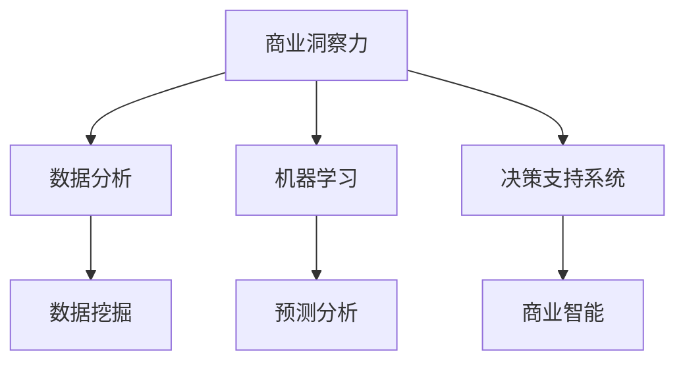

                 

# 理解洞察力的应用：在商业策略中的力量

> 关键词：商业洞察力, 数据分析, 机器学习, 人工智能, 预测分析, 决策支持系统, 数据挖掘, 商业智能

## 1. 背景介绍

### 1.1 问题由来
在商业环境中，洞察力被视为成功的关键因素之一。洞察力不仅能够揭示趋势和模式，还能够指导决策，驱动业务增长。随着大数据和人工智能技术的快速发展，商业洞察力的获取变得前所未有的容易和高效。然而，要真正有效地利用这些洞察力，并将之转化为实际的商业策略，仍然是一个复杂且充满挑战的过程。

### 1.2 问题核心关键点
商业洞察力应用的本质是利用数据挖掘、机器学习和人工智能技术，从海量数据中提取有价值的知识和信息，并基于这些洞察力进行商业决策。关键点包括：

- **数据质量**：高质量的数据是获取洞察力的基础，数据必须准确、完整、及时，并且能够反映业务实际。
- **分析模型**：选择合适的分析模型和方法，以提取有效的商业洞察力。
- **数据可视化**：将洞察力以直观、易懂的方式呈现给决策者，以便更好地理解和使用。
- **决策支持**：将洞察力整合进决策流程中，支持动态调整和优化。

### 1.3 问题研究意义
商业洞察力的应用对于提升企业的竞争力和盈利能力具有重要意义。通过高效的数据分析和洞察力提取，企业能够更好地理解市场动态、客户需求和运营瓶颈，从而制定更加精准和有效的商业策略。此外，洞察力还可以帮助企业提前预测趋势，降低风险，提高决策的科学性和准确性。

## 2. 核心概念与联系

### 2.1 核心概念概述

为更好地理解商业洞察力的应用，本节将介绍几个密切相关的核心概念：

- **商业洞察力(Commercial Insight)**：从数据中提取出来的，对企业运营、市场趋势、客户行为等有指导意义的知识。
- **数据分析(Analytical Data)**：通过对大量数据进行统计、计算和分析，挖掘数据中的有用信息。
- **机器学习(Machine Learning)**：一种通过数据训练模型，使模型能够对新数据进行预测和分类的技术。
- **人工智能(Artificial Intelligence)**：模拟人类智能行为，如学习、推理、感知等，以完成复杂任务的技术。
- **预测分析(Predictive Analytics)**：使用历史数据和机器学习模型，预测未来趋势和行为。
- **决策支持系统(Decision Support System, DSS)**：基于数据和洞察力的系统，辅助决策者进行信息评估和决策。
- **数据挖掘(Data Mining)**：从数据中自动发现有用的模式和知识的过程。
- **商业智能(Business Intelligence, BI)**：利用数据分析和洞察力，提升企业业务决策和运营效率的技术。

这些核心概念之间的逻辑关系可以通过以下Mermaid流程图来展示：



这个流程图展示了一系列核心概念及其之间的关系：

1. 商业洞察力通过数据分析和数据挖掘得到，同时也可以利用机器学习和预测分析进一步提升。
2. 决策支持系统基于商业洞察力提供信息支持，辅助决策。
3. 商业智能则是将数据分析、决策支持和商业洞察力整合，提升企业整体的决策和运营效率。

## 3. 核心算法原理 & 具体操作步骤
### 3.1 算法原理概述

商业洞察力的应用基于机器学习和数据挖掘算法，通过以下步骤从大量数据中提取有用信息：

1. **数据收集**：收集相关业务数据，包括销售数据、客户数据、市场数据等。
2. **数据预处理**：清洗数据，处理缺失值和异常值，进行数据标准化和归一化。
3. **特征工程**：选择和构建有意义的特征，提升模型预测能力。
4. **模型训练**：选择合适的机器学习模型，如回归、分类、聚类等，并使用历史数据训练模型。
5. **模型评估**：使用测试数据评估模型性能，选择合适的模型参数和超参数。
6. **洞察力提取**：将训练好的模型应用到新数据上，提取商业洞察力，如预测销售趋势、客户流失率、市场细分等。
7. **数据可视化**：将洞察力结果以图表、报告等形式呈现，帮助决策者理解和使用。

### 3.2 算法步骤详解

下面详细讲解每个步骤的实施方法：

**Step 1: 数据收集**
- 确定需要收集的数据类型和来源，如销售数据、客户行为数据、市场调研数据等。
- 选择合适的数据采集工具和技术，如ETL工具、API接口、爬虫等。
- 确保数据收集的合法性和合规性，遵守数据隐私和保护法规。

**Step 2: 数据预处理**
- 数据清洗：删除重复、错误、无关的数据。
- 数据缺失值处理：使用均值、中位数、插值等方法填补缺失值。
- 数据归一化：将数据转换为标准正态分布，提升模型训练效果。
- 特征选择：选择对目标变量有较大影响的特征，去除无关或冗余特征。

**Step 3: 特征工程**
- 特征提取：从原始数据中提取有用的特征，如时间特征、用户特征、交易特征等。
- 特征变换：对特征进行转换，如对数变换、归一化、编码等。
- 特征选择：使用统计分析、模型评估等方法，选择最优的特征子集。

**Step 4: 模型训练**
- 选择合适的机器学习模型：根据问题类型选择回归、分类、聚类等模型。
- 数据分割：将数据分为训练集和测试集，通常采用70:30的比例。
- 模型训练：使用训练集数据，调整模型参数和超参数，提升模型性能。
- 模型评估：使用测试集数据，评估模型性能，如准确率、召回率、F1分数等。

**Step 5: 洞察力提取**
- 模型应用：将训练好的模型应用到新数据上，提取商业洞察力。
- 结果解释：使用统计方法或解释模型，解释模型预测结果。
- 结果验证：通过专家评估或实际业务反馈，验证洞察力结果的准确性。

**Step 6: 数据可视化**
- 选择合适的可视化工具，如Tableau、PowerBI、Python的matplotlib等。
- 创建直观的图表，如柱状图、折线图、散点图等，展示洞察力结果。
- 编写报告，将洞察力结果整合到业务场景中，辅助决策。

### 3.3 算法优缺点

商业洞察力应用的机器学习算法具有以下优点：
- **准确性高**：通过大量的历史数据训练，模型能够精准预测未来趋势和行为。
- **自动化**：模型训练和应用过程自动化，减少了人工干预和出错的机会。
- **泛化性强**：训练好的模型可以应用于新的数据，提升决策的科学性。

然而，这些算法也存在一些缺点：
- **依赖数据**：数据质量对模型性能有直接影响，数据不足或质量差会影响洞察力提取。
- **复杂性高**：模型训练和调优过程复杂，需要专业知识和技术支持。
- **解释性差**：黑箱模型难以解释其内部工作机制和预测逻辑，不利于业务理解和决策。

尽管存在这些局限性，但就目前而言，机器学习和数据挖掘方法仍是商业洞察力获取的主流手段。未来相关研究的方向在于如何降低算法对数据质量和专业技能的需求，提高模型的可解释性和应用范围。

### 3.4 算法应用领域

商业洞察力应用的机器学习算法广泛应用于以下领域：

- **市场分析**：分析市场趋势、竞争对手行为、消费者偏好等，指导市场策略。
- **客户分析**：研究客户行为、满意度、忠诚度等，提升客户体验和价值。
- **销售预测**：预测销售额、销售趋势、库存水平等，优化库存管理和销售策略。
- **风险管理**：识别风险因素、评估风险等级、制定风险控制措施，降低运营风险。
- **运营优化**：优化生产流程、供应链管理、成本控制等，提高运营效率和盈利能力。
- **产品创新**：分析产品市场表现、用户反馈，指导新产品的设计和推广。

除了上述这些常见领域外，商业洞察力还被创新性地应用到更多场景中，如个性化推荐、广告投放、资源分配等，为企业的数字化转型和智能化升级提供了新的解决方案。

## 4. 数学模型和公式 & 详细讲解 & 举例说明

### 4.1 数学模型构建

本节将使用数学语言对商业洞察力应用的机器学习模型进行更加严格的刻画。

设商业洞察力问题为 $P$，输入数据为 $X$，目标变量为 $Y$。商业洞察力应用的数学模型为：

$$
M = f(X)
$$

其中 $f$ 表示模型函数，$M$ 表示模型的输出结果，即商业洞察力。

模型的训练目标是最小化预测误差，即：

$$
\min_{\theta} \frac{1}{N} \sum_{i=1}^N || M_{\theta}(X_i) - Y_i ||^2
$$

其中 $N$ 为样本数，$M_{\theta}(X_i)$ 表示模型在输入 $X_i$ 下的预测结果。

### 4.2 公式推导过程

以下我们以线性回归模型为例，推导其数学公式和梯度下降算法的更新规则。

假设 $X$ 为样本特征矩阵，$Y$ 为样本标签向量，模型参数为 $\theta$，则线性回归模型的预测结果为：

$$
M_{\theta}(X) = X\theta
$$

模型的损失函数为：

$$
\mathcal{L}(\theta) = \frac{1}{2N} \sum_{i=1}^N ||X_i\theta - Y_i||^2
$$

最小化损失函数的梯度下降算法更新规则为：

$$
\theta \leftarrow \theta - \eta \nabla_{\theta}\mathcal{L}(\theta)
$$

其中 $\nabla_{\theta}\mathcal{L}(\theta)$ 为损失函数对模型参数 $\theta$ 的梯度，$\eta$ 为学习率。

在得到梯度后，即可带入梯度下降算法，完成模型的迭代优化。重复上述过程直至收敛，最终得到最优的模型参数 $\theta^*$。

### 4.3 案例分析与讲解

考虑一个电商网站，希望通过客户购买数据预测客户的流失概率。

- **数据收集**：收集客户的购买历史、浏览历史、页面停留时间等数据。
- **数据预处理**：清洗数据，处理缺失值和异常值，进行数据标准化和归一化。
- **特征工程**：选择客户购买次数、平均订单金额、页面停留时间等特征，构建客户流失预测模型。
- **模型训练**：使用历史数据训练线性回归模型，调整模型参数和超参数。
- **洞察力提取**：将训练好的模型应用到新数据上，提取客户流失概率，并根据预测结果进行客户保留策略的调整。

通过以上步骤，电商平台能够实现基于客户行为的流失预测，从而采取针对性的客户保留措施，提高客户满意度和忠诚度。

## 5. 项目实践：代码实例和详细解释说明

### 5.1 开发环境搭建

在进行商业洞察力应用的项目实践前，我们需要准备好开发环境。以下是使用Python进行Scikit-learn开发的开发环境配置流程：

1. 安装Anaconda：从官网下载并安装Anaconda，用于创建独立的Python环境。

2. 创建并激活虚拟环境：
```bash
conda create -n insights-env python=3.8 
conda activate insights-env
```

3. 安装Scikit-learn：
```bash
conda install scikit-learn pandas numpy
```

4. 安装各类工具包：
```bash
pip install matplotlib seaborn jupyter notebook ipython
```

完成上述步骤后，即可在`insights-env`环境中开始项目实践。

### 5.2 源代码详细实现

下面我们以客户流失预测为例，给出使用Scikit-learn进行商业洞察力应用的PyTorch代码实现。

首先，定义数据处理函数：

```python
import pandas as pd
from sklearn.model_selection import train_test_split
from sklearn.preprocessing import StandardScaler

def load_data():
    # 加载数据
    df = pd.read_csv('customer_data.csv')
    # 数据清洗和处理
    df.dropna(inplace=True)
    # 特征选择
    features = ['purchase_frequency', 'average_order_value', 'page_duration']
    X = df[features]
    Y = df['churn']
    # 数据标准化
    scaler = StandardScaler()
    X = scaler.fit_transform(X)
    # 数据分割
    X_train, X_test, y_train, y_test = train_test_split(X, Y, test_size=0.2, random_state=42)
    return X_train, X_test, y_train, y_test
```

然后，定义模型和优化器：

```python
from sklearn.linear_model import LinearRegression
from sklearn.metrics import mean_squared_error, r2_score

model = LinearRegression()
```

接着，定义训练和评估函数：

```python
def train_model(model, X_train, y_train):
    model.fit(X_train, y_train)
    return model

def evaluate_model(model, X_test, y_test):
    y_pred = model.predict(X_test)
    mse = mean_squared_error(y_test, y_pred)
    r2 = r2_score(y_test, y_pred)
    return mse, r2
```

最后，启动训练流程并在测试集上评估：

```python
X_train, X_test, y_train, y_test = load_data()
model = train_model(model, X_train, y_train)
mse, r2 = evaluate_model(model, X_test, y_test)
print(f"MSE: {mse:.3f}, R^2: {r2:.3f}")
```

以上就是使用Scikit-learn进行客户流失预测的完整代码实现。可以看到，Scikit-learn提供了简单易用的接口，使得商业洞察力应用的机器学习模型开发变得非常高效。

### 5.3 代码解读与分析

让我们再详细解读一下关键代码的实现细节：

**load_data类**：
- `__init__`方法：初始化数据处理步骤，包括加载数据、清洗数据、选择特征、标准化数据和分割数据。

**train_model函数**：
- `fit`方法：使用训练集数据训练线性回归模型。

**evaluate_model函数**：
- `predict`方法：使用模型预测测试集数据。
- `mean_squared_error`和`r2_score`方法：计算模型预测结果的均方误差和决定系数，评估模型性能。

**训练流程**：
- 首先定义训练集和测试集。
- 使用训练集数据训练线性回归模型。
- 在测试集上评估模型性能，输出均方误差和决定系数。

可以看到，Scikit-learn使得商业洞察力应用的机器学习模型开发变得非常便捷，开发者可以将更多精力放在模型改进和业务应用上，而不必过多关注底层的实现细节。

当然，工业级的系统实现还需考虑更多因素，如模型保存和部署、超参数自动搜索、更灵活的任务适配层等。但核心的商业洞察力应用的基本流程与上述代码类似。

## 6. 实际应用场景
### 6.1 智能客服系统

商业洞察力在智能客服系统中的应用，能够有效提升客户服务体验和效率。通过分析客户的历史互动记录和行为数据，可以提取客户需求和偏好，优化客服流程，提高响应速度和满意度。

在技术实现上，可以收集客户服务记录、聊天记录、服务时长等数据，构建客户满意度预测模型。预测模型可以评估客服人员的业绩和质量，从而进行人员调度和培训，提升整体服务水平。

### 6.2 金融风险管理

金融行业面临的风险种类繁多，商业洞察力可以通过数据分析和预测模型，帮助金融机构识别和管理各类风险。

例如，通过分析历史交易数据和市场变化，可以预测贷款违约风险、信用评级变化等，从而制定相应的风险控制策略。同时，商业洞察力还可以用于监测市场趋势，预测股市波动，辅助投资决策。

### 6.3 市场营销分析

市场营销是企业运营中的重要环节，商业洞察力能够帮助企业更好地理解和优化市场营销策略。

例如，通过分析广告投放数据、市场反馈数据等，可以识别出有效的广告渠道和内容，优化广告预算分配。同时，商业洞察力还可以用于评估产品销售趋势和客户需求变化，指导产品创新和市场推广。

### 6.4 未来应用展望

随着商业洞察力应用的不断发展，其应用范围将进一步扩展到更多领域，为企业的数字化转型和智能化升级带来新的机遇。

在智慧医疗领域，商业洞察力可以帮助医疗机构分析病患数据，优化诊疗流程，提高医疗服务效率。在智能交通领域，商业洞察力可以分析交通流量数据，优化道路规划和交通管理。在能源领域，商业洞察力可以分析电力需求和供应数据，优化电力分配和调度。

未来，商业洞察力将在更多行业领域发挥作用，帮助企业提升决策效率和业务竞争力，推动经济社会的持续发展。

## 7. 工具和资源推荐
### 7.1 学习资源推荐

为了帮助开发者系统掌握商业洞察力的应用理论基础和实践技巧，这里推荐一些优质的学习资源：

1. 《Python数据分析实战》系列博文：由数据分析专家撰写，深入浅出地介绍了Python数据分析的基本概念和常用技术，是入门的不错选择。

2. 《机器学习实战》课程：Coursera上的经典课程，由斯坦福大学Andrew Ng教授主讲，详细讲解了机器学习的基本原理和应用方法。

3. 《数据科学实战》书籍：由Kaggle竞赛高手撰写，涵盖数据预处理、特征工程、模型评估等数据科学领域的实战技能。

4. Kaggle数据科学竞赛平台：全球最大的数据科学竞赛平台，提供了丰富的数据集和实战项目，助力你提升数据分析和商业洞察力应用的能力。

5. DataCamp在线学习平台：提供系统化的数据科学和机器学习课程，适合自学者和初学者。

通过对这些资源的学习实践，相信你一定能够快速掌握商业洞察力的应用精髓，并用于解决实际的商业问题。

### 7.2 开发工具推荐

高效的开发离不开优秀的工具支持。以下是几款用于商业洞察力应用开发的常用工具：

1. Python：因其灵活、易用、丰富的库和工具支持，成为了数据分析和机器学习的主流语言。

2. Jupyter Notebook：提供交互式编程环境，方便数据探索和模型验证。

3. Pandas：强大的数据处理库，支持数据清洗、处理、转换等操作。

4. NumPy：提供高效的多维数组操作和数学计算能力，是数据分析的核心工具之一。

5. Scikit-learn：提供各种机器学习算法和工具，易于使用的接口和丰富的文档支持。

6. TensorFlow和PyTorch：强大的深度学习框架，支持各种复杂模型的训练和应用。

7. Tableau和PowerBI：强大的数据可视化工具，支持复杂图表和仪表盘的创建。

合理利用这些工具，可以显著提升商业洞察力应用的开发效率，加快创新迭代的步伐。

### 7.3 相关论文推荐

商业洞察力应用的研究源于学界的持续研究。以下是几篇奠基性的相关论文，推荐阅读：

1. An Introduction to Statistical Learning：《统计学习基础》，提供了机器学习算法的基本概念和实现方法。

2. Predictive Analytics with Python：《Python数据科学手册》，详细讲解了Python在数据科学和商业洞察力应用中的应用。

3. Customer Churn Prediction Using Data Mining and Statistical Learning Techniques：一篇经典的研究论文，展示了使用数据挖掘和统计学习技术进行客户流失预测的方法。

4. Machine Learning in Marketing：《机器学习在营销中的应用》，详细介绍了机器学习在市场营销中的各种应用。

5. Predictive Analytics and Business Intelligence：《预测分析和商业智能》，讨论了预测分析和商业智能在企业决策支持中的应用。

这些论文代表了大数据和机器学习在商业洞察力应用领域的发展脉络。通过学习这些前沿成果，可以帮助研究者把握学科前进方向，激发更多的创新灵感。

## 8. 总结：未来发展趋势与挑战

### 8.1 总结

本文对商业洞察力的应用进行了全面系统的介绍。首先阐述了商业洞察力的重要性，明确了商业洞察力在商业决策和运营优化中的关键作用。其次，从原理到实践，详细讲解了商业洞察力应用的数学模型和关键步骤，给出了商业洞察力应用的完整代码实例。同时，本文还广泛探讨了商业洞察力在多个行业领域的应用前景，展示了商业洞察力应用的广阔前景。此外，本文精选了商业洞察力的各类学习资源，力求为读者提供全方位的技术指引。

通过本文的系统梳理，可以看到，商业洞察力应用对于提升企业的竞争力和盈利能力具有重要意义。通过高效的数据分析和洞察力提取，企业能够更好地理解市场动态、客户需求和运营瓶颈，从而制定更加精准和有效的商业策略。此外，洞察力还可以帮助企业提前预测趋势，降低风险，提高决策的科学性和准确性。

### 8.2 未来发展趋势

展望未来，商业洞察力应用的发展趋势包括：

1. **自动化水平提升**：通过自动化工具和平台，降低人工干预和出错的机会，提升分析效率。

2. **数据质量提升**：通过数据清洗和处理技术，提高数据的准确性和完整性，增强分析结果的可靠性。

3. **跨领域应用推广**：商业洞察力将在更多行业领域得到应用，推动企业数字化转型和智能化升级。

4. **实时分析能力**：通过流式数据处理和实时分析技术，提升商业洞察力应用的实时性和响应速度。

5. **人工智能融合**：将人工智能技术如深度学习、自然语言处理等，与商业洞察力应用结合，提升模型的预测能力和解释性。

6. **数据隐私保护**：随着数据隐私法规的完善，商业洞察力应用将更加重视数据隐私保护，确保数据使用的合法合规。

以上趋势凸显了商业洞察力应用的广阔前景。这些方向的探索发展，必将进一步提升企业的决策效率和业务竞争力，推动企业的数字化转型和智能化升级。

### 8.3 面临的挑战

尽管商业洞察力应用已经取得了瞩目成就，但在迈向更加智能化、普适化应用的过程中，它仍面临着诸多挑战：

1. **数据质量瓶颈**：高质量的数据是获取洞察力的基础，数据不足或质量差会影响分析结果的准确性。如何高效清洗和处理海量数据，仍是亟需解决的难题。

2. **模型复杂性**：商业洞察力应用的机器学习模型往往较为复杂，需要专业知识和技术支持。如何降低模型的复杂性，提升应用的普及性，是未来的研究方向。

3. **解释性不足**：机器学习模型往往难以解释其内部工作机制和预测逻辑，不利于业务理解和决策。如何提升模型的可解释性，是未来需要解决的重要问题。

4. **数据隐私问题**：商业洞察力应用需要大量数据，如何确保数据使用的合法合规，保护用户隐私，将是未来的重要课题。

5. **跨领域知识融合**：商业洞察力应用需要将多种数据源和知识库进行融合，提升信息整合能力。如何构建跨领域的知识图谱，实现更全面、准确的商业洞察力提取，是未来的研究方向。

6. **模型鲁棒性提升**：模型面对域外数据时，泛化性能往往大打折扣。如何提高模型的鲁棒性，避免灾难性遗忘，将是未来的研究重点。

这些挑战需要研究者、企业和政策制定者共同努力，通过技术创新和法规完善，不断克服障碍，推动商业洞察力应用的成熟与发展。

### 8.4 未来突破

面对商业洞察力应用所面临的种种挑战，未来的研究需要在以下几个方面寻求新的突破：

1. **无监督学习和半监督学习**：探索无监督和半监督学习方法，降低对标注数据的需求，提升数据处理的自动化和智能化水平。

2. **深度学习和大规模预训练**：利用深度学习和大规模预训练技术，提升模型的预测能力和泛化性，实现更加高效和精准的商业洞察力提取。

3. **增强学习与优化**：引入增强学习技术，优化模型的训练过程，提高模型的决策效率和性能。

4. **跨领域知识图谱**：构建跨领域的知识图谱，整合不同数据源和知识库，提升商业洞察力的信息整合能力。

5. **数据隐私保护**：引入数据隐私保护技术，确保数据使用的合法合规，保护用户隐私。

6. **模型可解释性**：引入可解释性技术，增强模型的透明性，提升业务理解和决策支持能力。

这些研究方向的探索，必将引领商业洞察力应用技术迈向更高的台阶，为构建更加智能、可靠、高效的商业决策系统提供有力支持。

## 9. 附录：常见问题与解答

**Q1：商业洞察力应用是否适用于所有企业？**

A: 商业洞察力应用对企业规模和行业有一定要求，但并非仅适用于大型企业或特定行业。小型企业也可以利用商业洞察力应用提升决策效率和运营优化，特别是在数据量较大、数据质量较高的情况下。

**Q2：如何选择合适的机器学习模型？**

A: 选择合适的机器学习模型需要考虑问题的类型、数据的特点、计算资源等因素。一般来说，分类问题适合使用决策树、SVM等模型；回归问题适合使用线性回归、随机森林等模型；聚类问题适合使用K-means、DBSCAN等模型。

**Q3：商业洞察力应用是否需要大量的数据？**

A: 商业洞察力应用对数据量有一定要求，通常需要收集和处理大量历史数据。但也可以通过无监督学习和半监督学习等方法，在数据量较少的情况下获得有用的商业洞察力。

**Q4：如何提高商业洞察力应用的自动化水平？**

A: 可以通过使用自动化工具和平台，如ETL工具、自动调参工具、可视化工具等，提高商业洞察力应用的自动化水平，降低人工干预和出错的机会。

**Q5：商业洞察力应用是否需要专业的技术支持？**

A: 商业洞察力应用需要一定的技术支持，包括数据清洗、特征工程、模型训练等。但对于技术能力较弱的企业，可以通过使用现成的商业智能工具和平台，降低技术门槛。

总之，商业洞察力应用需要企业在数据、技术、资源等多方面进行投入和优化，方能实现其价值。通过科学的数据分析和洞察力提取，企业能够更好地理解市场动态、客户需求和运营瓶颈，从而制定更加精准和有效的商业策略，提升整体竞争力和盈利能力。

---

作者：禅与计算机程序设计艺术 / Zen and the Art of Computer Programming

