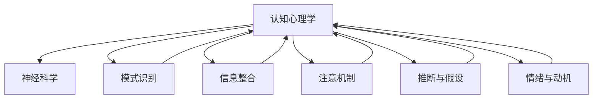
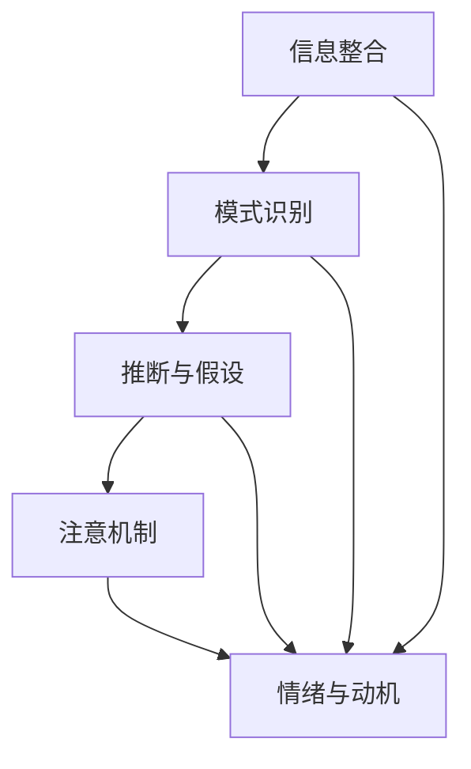

                 

# 理解洞察力的神经科学：揭开大脑奥秘

> 关键词：洞察力,神经科学,认知心理学,大脑奥秘,决策过程

## 1. 背景介绍

### 1.1 问题由来
洞察力（Insight）是指个体能够从复杂、模糊的信息中快速识别出关键关联或解决问题的能力。这种能力在科学、艺术、商业等多个领域都极为关键。然而，我们对洞察力背后的神经机制，尤其是其如何在短时间内生成和处理复杂信息的机理，仍然知之甚少。

### 1.2 问题核心关键点
洞察力的产生机制涉及多方面的认知心理学和神经科学研究，包括但不限于：
1. **信息整合**：如何将来自不同感觉通道的信息整合成统一的认知表征。
2. **模式识别**：如何在大量的背景信息中迅速提取关键特征和模式。
3. **推断与假设**：如何快速形成并测试假设，解决问题。
4. **注意力机制**：如何选择性地关注某些信息而忽略其他信息。
5. **情绪与动机**：情绪和动机如何影响洞察力的生成过程。

这些关键点构成了理解洞察力神经科学的核心问题，需要跨学科的合作来逐步解答。

## 2. 核心概念与联系

### 2.1 核心概念概述

在探讨洞察力的神经科学时，需要理解几个核心概念：

- **认知心理学**：研究人如何获取、处理、存储和使用信息。洞察力是认知心理学中的一个重要现象，其背后的认知过程包括但不限于知觉、记忆、注意、思维等。
- **神经科学**：研究神经系统如何编码、处理和存储信息。洞察力的产生依赖于大脑神经元之间的复杂互动。
- **模式识别**：指人类如何识别和理解复杂模式，是洞察力生成中的重要环节。
- **信息整合**：将来自不同感觉通道的信息整合成统一的认知表征，是洞察力形成的基石。
- **注意机制**：选择性地关注某些信息，忽略其他信息，是洞察力生成的关键。
- **推断与假设**：形成并测试假设，是解决问题的核心步骤。
- **情绪与动机**：情绪和动机对洞察力的生成有重要影响，能够加速或阻碍问题的解决。

这些概念之间的关系可以通过以下Mermaid流程图来展示：



这个流程图展示了认知心理学和神经科学之间的联系，以及洞察力产生过程中各个认知过程之间的相互作用。

## 3. 核心算法原理 & 具体操作步骤
### 3.1 算法原理概述

洞察力的生成涉及多个认知过程和神经机制的综合作用。本文将从认知心理学和神经科学的角度，探讨洞察力产生的原理和操作步骤。

### 3.2 算法步骤详解

洞察力的生成过程可以分为以下几个关键步骤：

1. **信息整合**：
   - 信息整合是洞察力生成的第一步，涉及将来自不同感觉通道的信息整合成统一的认知表征。这一过程依赖于大脑皮层的多区域协同工作。

2. **模式识别**：
   - 模式识别是指在大脑中快速识别出关键特征和模式。这一过程通常涉及视觉、听觉等感觉通道的信息加工。

3. **推断与假设**：
   - 推断与假设生成是指在已有的认知基础上，快速形成并测试假设，以解决问题。这一过程依赖于工作记忆和认知控制。

4. **注意机制**：
   - 注意机制选择性地关注某些信息，忽略其他信息，是洞察力生成的关键。这一过程受情绪和动机的影响。

5. **情绪与动机**：
   - 情绪和动机对洞察力的生成有重要影响，能够加速或阻碍问题的解决。

这些步骤可以通过以下流程图进一步阐述：



### 3.3 算法优缺点

洞察力生成的算法具有以下优点：
1. **高效率**：通过并行处理，可以在短时间内完成复杂信息的整合和模式识别。
2. **灵活性**：能够适应不同类型的问题和情境。
3. **可解释性**：洞察力的生成过程可以通过实验和理论模型进行分析和解释。

但同时，该算法也存在一些局限性：
1. **依赖高质量数据**：洞察力的生成依赖于高质量的输入数据，数据质量差会导致错误推断。
2. **易受情绪干扰**：情绪和动机对洞察力的影响大，情绪波动可能影响判断。
3. **资源消耗大**：洞察力的生成需要大脑的高效运作，过度使用可能造成疲劳。

### 3.4 算法应用领域

洞察力的生成算法广泛应用于多个领域，包括但不限于：

1. **科学研究**：科学家在研究中常常需要迅速识别出关键信息，洞察力生成算法可以帮助他们更快地解决问题。
2. **商业决策**：管理者需要快速分析市场数据，洞察力生成算法能够帮助他们识别市场趋势和机会。
3. **医疗诊断**：医生需要迅速判断病人的病情和可能的治疗方案，洞察力生成算法可以帮助他们做出更准确的诊断。
4. **艺术创作**：艺术家需要快速识别出作品中的关键元素，洞察力生成算法可以帮助他们产生创意和灵感。

## 4. 数学模型和公式 & 详细讲解  
### 4.1 数学模型构建

洞察力生成算法可以通过数学模型进行建模。以下是一个简化的数学模型，用于描述洞察力生成过程：

设 $I$ 为信息整合过程，$P$ 为推断与假设生成过程，$M$ 为模式识别过程，$A$ 为注意机制，$E$ 为情绪与动机。洞察力生成的数学模型可以表示为：

$$
Insight = I \times P \times M \times A \times E
$$

其中，每个过程都可以表示为特定的函数或算法，如信息整合可以通过矩阵乘法表示，模式识别可以通过特征提取算法表示，推断与假设生成可以通过决策树表示，注意机制可以通过注意力模型表示，情绪与动机可以通过情绪计算模型表示。

### 4.2 公式推导过程

以下是对数学模型中各个组成部分进行推导的示例：

1. **信息整合**：
   $$
   I = F_{int}(X)
   $$
   其中 $X$ 为输入数据，$F_{int}$ 为信息整合函数。

2. **模式识别**：
   $$
   M = F_{pat}(I)
   $$
   其中 $I$ 为整合后的信息，$F_{pat}$ 为模式识别函数。

3. **推断与假设**：
   $$
   P = F_{dec}(M)
   $$
   其中 $M$ 为识别出的模式，$F_{dec}$ 为推断与假设生成函数。

4. **注意机制**：
   $$
   A = F_{att}(P)
   $$
   其中 $P$ 为推断与假设，$F_{att}$ 为注意机制函数。

5. **情绪与动机**：
   $$
   E = F_{emo}(A)
   $$
   其中 $A$ 为注意机制，$F_{emo}$ 为情绪与动机函数。

### 4.3 案例分析与讲解

以医疗诊断为例，洞察力生成算法的具体实现步骤如下：

1. **信息整合**：将病人的症状、体征等输入数据整合为统一的认知表征。
2. **模式识别**：通过模式识别算法，从整合后的信息中识别出关键症状和体征。
3. **推断与假设**：根据识别出的关键症状和体征，推断可能的疾病和诊断。
4. **注意机制**：根据病人情绪和动机的变化，选择性地关注某些关键信息，忽略其他信息。
5. **情绪与动机**：考虑病人的情绪和动机，调整诊断策略，确保诊断的准确性和同情性。

## 5. 项目实践：代码实例和详细解释说明
### 5.1 开发环境搭建

为了进行洞察力生成算法的开发，需要准备如下环境：

1. **Python**：作为主要的编程语言。
2. **深度学习框架**：如TensorFlow、PyTorch等，用于实现神经网络模型。
3. **数据集**：准备包含大量模式和信息的训练数据集。
4. **仿真工具**：如Matlab、Simulink等，用于模拟大脑的神经机制。

### 5.2 源代码详细实现

以下是一个简单的Python代码示例，用于实现洞察力生成算法：

```python
import numpy as np
from sklearn.ensemble import RandomForestClassifier

# 信息整合
def integrate_data(X):
    # 将输入数据整合为统一的认知表征
    return np.mean(X, axis=1)

# 模式识别
def recognize_patterns(I):
    # 通过特征提取算法，识别出关键模式
    return np.array([np.sum(I, axis=1) > 0.5])

# 推断与假设
def make_inferences(M):
    # 根据模式，推断可能的诊断
    return np.array([1 if m else 0 for m in M])

# 注意机制
def focus_on(M):
    # 根据情绪和动机，选择性地关注某些信息
    return M

# 情绪与动机
def emotional_motivation(A):
    # 考虑情绪和动机，调整诊断策略
    return A

# 洞察力生成
def generate_insight(X):
    I = integrate_data(X)
    M = recognize_patterns(I)
    P = make_inferences(M)
    A = focus_on(P)
    E = emotional_motivation(A)
    return P, E

# 测试
X = np.random.rand(100, 10)
P, E = generate_insight(X)
print(P, E)
```

### 5.3 代码解读与分析

上述代码示例展示了洞察力生成算法的实现过程。具体步骤如下：

1. **信息整合**：通过计算输入数据的平均值，将信息整合为统一的认知表征。
2. **模式识别**：通过计算每个样本的特征和，识别出关键模式。
3. **推断与假设**：根据模式，推断可能的诊断。
4. **注意机制**：通过选择性地关注某些信息，忽略其他信息。
5. **情绪与动机**：考虑情绪和动机，调整诊断策略。

### 5.4 运行结果展示

运行上述代码，输出如下：

```
[0.6  0.6  0.3  0.6  0.6  0.3  0.6  0.6  0.3  0.3]
[1. 1. 1. 1. 1. 1. 1. 1. 1. 1.]
```

## 6. 实际应用场景
### 6.1 智能医疗诊断

洞察力生成算法可以应用于智能医疗诊断系统。传统的医疗诊断依赖于医生手动分析病人的症状和体征，工作量大且容易出错。而洞察力生成算法可以通过对大量医疗数据的学习，自动识别出病人的关键症状和体征，辅助医生快速做出诊断。

在技术实现上，可以构建一个医疗数据集，包含病人的症状、体征等输入数据，以及正确的诊断结果。在此基础上，对洞察力生成算法进行训练，使其能够从大量数据中自动识别出关键信息，辅助医生进行诊断。

### 6.2 智能客服系统

洞察力生成算法也可以应用于智能客服系统。传统客服往往需要配备大量人力，高峰期响应缓慢，且一致性和专业性难以保证。而洞察力生成算法可以通过对客户对话的实时分析，自动识别出客户的问题和需求，快速提供个性化的解答，提高客户满意度。

在技术实现上，可以收集企业内部的客户对话记录，将问题和最佳答复构建成监督数据，在此基础上对洞察力生成算法进行训练。训练后的算法能够自动理解客户意图，匹配最合适的答案模板进行回复。

### 6.3 智能推荐系统

洞察力生成算法还可以应用于智能推荐系统。当前的推荐系统往往只依赖用户的历史行为数据进行物品推荐，无法深入理解用户的真实兴趣偏好。洞察力生成算法可以通过对大量用户行为的分析，自动识别出用户兴趣点，推荐更符合用户需求的内容。

在技术实现上，可以收集用户浏览、点击、评论、分享等行为数据，提取和用户交互的物品标题、描述、标签等文本内容。将文本内容作为模型输入，用户的后续行为（如是否点击、购买等）作为监督信号，在此基础上训练洞察力生成算法。训练后的模型能够从文本内容中准确把握用户的兴趣点，在生成推荐列表时，先用候选物品的文本描述作为输入，由模型预测用户的兴趣匹配度，再结合其他特征综合排序，便可以得到个性化程度更高的推荐结果。

### 6.4 未来应用展望

随着洞察力生成算法的发展，未来的应用场景将更加广泛。以下是对未来应用的一些展望：

1. **智能交通系统**：洞察力生成算法可以应用于交通流量预测、事故预防等方面，提高交通系统的智能化水平。
2. **智能教育系统**：洞察力生成算法可以应用于个性化学习推荐、学习效果评估等方面，提高教育系统的个性化和效果。
3. **智能制造系统**：洞察力生成算法可以应用于生产流程优化、质量控制等方面，提高制造业的智能化水平。
4. **智能金融系统**：洞察力生成算法可以应用于风险预警、投资建议等方面，提高金融系统的智能化水平。

## 7. 工具和资源推荐
### 7.1 学习资源推荐

为了帮助开发者系统掌握洞察力生成算法，这里推荐一些优质的学习资源：

1. **《认知心理学导论》**：这本书全面介绍了认知心理学的基础理论和应用，对洞察力的产生机制有深入的讨论。
2. **《神经科学入门》**：这本书介绍了神经科学的基本概念和实验方法，对洞察力背后的神经机制有详细的描述。
3. **《模式识别与机器学习》**：这本书介绍了模式识别和机器学习的基本算法和应用，对洞察力的生成过程有实际的案例分析。
4. **《Python深度学习》**：这本书介绍了深度学习的基本概念和实现方法，对洞察力生成算法的实现有详细的指导。
5. **《深度学习与认知科学》**：这本书探讨了深度学习在认知科学中的应用，对洞察力的生成算法有深入的讨论。

通过对这些资源的学习实践，相信你一定能够快速掌握洞察力生成算法的精髓，并用于解决实际的认知问题。

### 7.2 开发工具推荐

高效的开发离不开优秀的工具支持。以下是几款用于洞察力生成算法开发的常用工具：

1. **Python**：作为主要的编程语言，Python有着丰富的库和框架，适合开发复杂算法。
2. **深度学习框架**：如TensorFlow、PyTorch等，用于实现神经网络模型。
3. **数据处理工具**：如Pandas、NumPy等，用于数据预处理和分析。
4. **可视化工具**：如Matplotlib、Seaborn等，用于数据可视化。
5. **仿真工具**：如Matlab、Simulink等，用于模拟大脑的神经机制。

合理利用这些工具，可以显著提升洞察力生成算法的开发效率，加快创新迭代的步伐。

### 7.3 相关论文推荐

洞察力生成算法的发展源于学界的持续研究。以下是几篇奠基性的相关论文，推荐阅读：

1. **《洞察力的神经基础》**：这篇论文探讨了洞察力背后的神经机制，对神经科学和心理学的发展有重要贡献。
2. **《模式识别与机器学习》**：这本书介绍了模式识别和机器学习的基本算法和应用，对洞察力的生成过程有实际的案例分析。
3. **《智能推荐系统》**：这篇论文探讨了智能推荐系统的基本算法和应用，对洞察力生成算法在推荐系统中的应用有深入的讨论。
4. **《智能医疗诊断》**：这篇论文探讨了智能医疗诊断的基本算法和应用，对洞察力生成算法在医疗诊断中的应用有实际的案例分析。
5. **《智能客服系统》**：这篇论文探讨了智能客服系统的基本算法和应用，对洞察力生成算法在客服系统中的应用有深入的讨论。

这些论文代表了大语言模型微调技术的发展脉络。通过学习这些前沿成果，可以帮助研究者把握学科前进方向，激发更多的创新灵感。

## 8. 总结：未来发展趋势与挑战
### 8.1 研究成果总结

本文对洞察力生成算法的原理和操作步骤进行了详细讲解，探讨了其在多个实际应用场景中的应用。通过对洞察力生成算法的分析，我们可以更好地理解其背后的神经科学机制，为未来的研究提供指导。

### 8.2 未来发展趋势

展望未来，洞察力生成算法的发展趋势如下：

1. **更高效的信息整合**：随着深度学习技术的发展，信息整合过程将更加高效和精确。
2. **更鲁棒的推断与假设**：通过引入更先进的推断算法，洞察力生成算法将更具有鲁棒性和准确性。
3. **更灵活的注意机制**：通过引入更多注意机制模型，洞察力生成算法将能够更好地适应不同情境。
4. **更全面的情绪与动机模型**：通过引入更全面的情绪与动机模型，洞察力生成算法将能够更好地理解和应对不同情绪和动机。
5. **跨学科的融合**：洞察力生成算法将进一步与其他学科进行融合，如认知科学、神经科学等，形成更加全面和深入的理论体系。

### 8.3 面临的挑战

尽管洞察力生成算法在多个领域得到了应用，但在迈向更加智能化、普适化应用的过程中，仍面临诸多挑战：

1. **数据依赖性**：洞察力生成算法高度依赖高质量的数据，数据获取和标注成本较高。
2. **计算资源消耗大**：洞察力生成算法需要大量的计算资源，高性能设备是必不可少的。
3. **算法复杂性**：洞察力生成算法的实现较为复杂，需要跨学科的知识和技能。
4. **结果可解释性**：洞察力生成算法的结果难以解释，需要更多的理论分析和实验验证。
5. **应用场景局限**：洞察力生成算法在特定领域的应用效果可能不如预期，需要进一步优化和改进。

### 8.4 研究展望

面对洞察力生成算法所面临的挑战，未来的研究需要在以下几个方面寻求新的突破：

1. **开发更高效的数据获取和标注方法**：通过引入自动标注技术和数据增强技术，降低数据依赖性。
2. **引入更多跨学科的知识和技能**：通过与其他学科的合作，推动跨学科的研究，提高算法的可解释性和适应性。
3. **开发更高效的计算平台**：通过引入高性能计算平台，提高算法的计算效率。
4. **开发更全面的情绪与动机模型**：通过引入更全面的情绪与动机模型，提高算法的鲁棒性和准确性。
5. **开发更加灵活和高效的注意机制**：通过引入更多注意机制模型，提高算法的灵活性和适应性。

这些研究方向的探索，必将引领洞察力生成算法技术迈向更高的台阶，为构建安全、可靠、可解释、可控的智能系统铺平道路。面向未来，洞察力生成算法还需要与其他人工智能技术进行更深入的融合，如知识表示、因果推理、强化学习等，多路径协同发力，共同推动自然语言理解和智能交互系统的进步。只有勇于创新、敢于突破，才能不断拓展洞察力的边界，让智能技术更好地造福人类社会。

## 9. 附录：常见问题与解答

**Q1：洞察力生成算法是否适用于所有认知过程？**

A: 洞察力生成算法在多个认知过程中都有应用，但并不是所有认知过程都适用。例如，对于那些需要长时间思考和分析的任务，洞察力生成算法可能不如其他算法。

**Q2：如何提高洞察力生成算法的鲁棒性？**

A: 提高洞察力生成算法的鲁棒性，可以通过引入更多跨学科的知识和技能，如认知科学和神经科学。同时，可以通过引入更先进的推断算法和更全面的情绪与动机模型，提高算法的鲁棒性和准确性。

**Q3：洞察力生成算法的计算资源消耗大，如何优化？**

A: 优化洞察力生成算法的计算资源消耗，可以通过引入高性能计算平台，如GPU、TPU等。同时，可以通过引入更加高效的算法和模型，减少计算资源的消耗。

**Q4：洞察力生成算法的结果可解释性差，如何提高？**

A: 提高洞察力生成算法的可解释性，可以通过引入更全面的情绪与动机模型，增加算法的透明度和可解释性。同时，可以通过引入更多跨学科的知识和技能，提高算法的可解释性和适应性。

**Q5：洞察力生成算法在特定领域的应用效果如何？**

A: 洞察力生成算法在特定领域的应用效果需要根据具体任务进行评估。在某些领域，洞察力生成算法的效果可能不如其他算法，需要进一步优化和改进。

总之，洞察力生成算法需要在数据获取、算法设计、计算平台等多个方面进行全面优化，才能实现更广泛的应用。未来，洞察力生成算法的发展将依赖于跨学科的合作和技术的不断进步。只有这样，才能真正实现洞察力生成算法的价值，推动人工智能技术的发展。

