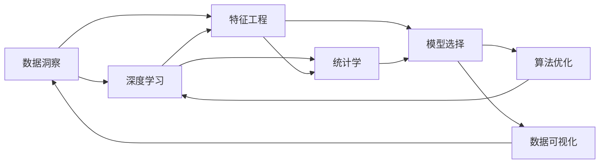

                 

# 理解洞察力的艺术：在纷繁中把握本质

> 关键词：数据洞察, 深度学习, 特征工程, 统计学, 模型选择, 算法优化, 数据可视化, 人工智能应用

## 1. 背景介绍

在现代社会，数据无处不在，从社交媒体到电子商务，从传感器到医疗设备，人们每天都在产生海量数据。如何从这些数据中提取有价值的洞察力，洞察到隐藏在繁杂信息背后的本质，成为了数据科学和人工智能的核心任务。本文将从数据洞察的艺术入手，探讨深度学习、特征工程、统计学和数据可视化等关键技术，帮助读者全面理解如何在纷繁复杂的数据中，准确地把握本质，做出明智的决策。

## 2. 核心概念与联系

### 2.1 核心概念概述

为了深入理解数据洞察的本质，我们需要掌握以下关键概念：

- 数据洞察（Data Insight）：通过数据分析和处理，从原始数据中发现和提取有价值的信息和模式。
- 深度学习（Deep Learning）：一种强大的机器学习技术，能够自动从大量数据中提取高层次的特征表示。
- 特征工程（Feature Engineering）：设计、选择和转换特征的过程，是构建高效数据洞察模型的关键。
- 统计学（Statistics）：研究和解释数据背后的概率和分布特性，为数据洞察提供理论支持。
- 模型选择（Model Selection）：选择适当的模型和算法来适应具体数据和任务的需求。
- 算法优化（Algorithm Optimization）：对模型和算法进行优化，提升预测精度和效率。
- 数据可视化（Data Visualization）：将数据以图形化方式展示，帮助人们更好地理解和分析数据。

这些概念相互关联，共同构成了数据洞察的完整过程。下面将通过一个Mermaid流程图，展示它们之间的联系：



### 2.2 核心概念原理和架构的 Mermaid 流程图

根据上述流程图，我们可以进一步展开每个节点的具体内容：

- **数据洞察**：从原始数据中挖掘出有价值的信息和模式，用于指导决策和行动。
- **深度学习**：利用神经网络模型，自动从原始数据中提取高层次的特征表示，例如卷积神经网络（CNN）、循环神经网络（RNN）、长短期记忆网络（LSTM）和变换器模型（Transformer）等。
- **特征工程**：选择和构造最有信息量的特征，例如编码、归一化、降维、特征选择等。
- **统计学**：利用概率论和数理统计方法，对数据进行描述和推断，例如假设检验、回归分析、聚类分析等。
- **模型选择**：选择最合适的模型来适应具体任务的需求，例如线性回归、支持向量机、随机森林、神经网络等。
- **算法优化**：通过调整模型参数、优化算法等手段，提升模型的预测精度和计算效率，例如超参数调优、正则化、梯度下降等。
- **数据可视化**：利用图表、图形等可视化工具，展示数据的内在结构和规律，例如散点图、直方图、热图等。

这些概念之间相互关联，共同组成了一个完整的数据洞察系统。下面我们将深入探讨每个关键技术，并给出详细的数学模型和操作步骤。

## 3. 核心算法原理 & 具体操作步骤

### 3.1 算法原理概述

数据洞察的过程可以大致分为以下几个步骤：

1. **数据收集和预处理**：从不同来源收集数据，并对数据进行清洗、归一化、去重等预处理操作。
2. **特征工程**：选择、构造和转换特征，以提高模型的预测性能。
3. **模型选择和训练**：选择合适的模型和算法，并在训练集上训练模型。
4. **模型评估和优化**：在验证集上评估模型性能，并通过超参数调优、正则化等手段进行优化。
5. **数据可视化**：将模型输出和特征可视化，帮助理解模型行为和特征重要性。

接下来，我们将详细介绍每个步骤的具体操作和数学模型。

### 3.2 算法步骤详解

#### 3.2.1 数据收集和预处理

数据收集和预处理是数据洞察的第一步。以下是详细的步骤和数学模型：

1. **数据收集**：
   - 数据来源：从数据库、API、文件等多种数据源收集数据。
   - 数据格式：处理不同格式的数据，例如CSV、JSON、文本等。
   - 数据清洗：处理缺失值、异常值和噪声。

   **示例代码**：
   ```python
   import pandas as pd
   df = pd.read_csv('data.csv')
   df = df.dropna()  # 删除缺失值
   ```

2. **数据预处理**：
   - 数据归一化：将数据缩放到0-1或-1到1之间。
   - 数据降维：使用PCA或LDA等方法，减少数据维度。

   **示例代码**：
   ```python
   from sklearn.preprocessing import StandardScaler
   scaler = StandardScaler()
   df = scaler.fit_transform(df)
   ```

#### 3.2.2 特征工程

特征工程是构建高效数据洞察模型的关键步骤。以下是详细的步骤和数学模型：

1. **特征选择**：
   - 选择最有信息量的特征，例如方差、互信息、相关系数等。
   - 使用统计方法或模型选择方法，例如卡方检验、递归特征消除（RFE）等。

   **示例代码**：
   ```python
   from sklearn.feature_selection import SelectKBest, f_regression
   selector = SelectKBest(f_regression, k=10)
   X_new = selector.fit_transform(X, y)
   ```

2. **特征构造**：
   - 构造新的特征，例如多项式特征、交互特征等。
   - 使用正则化方法，例如L1正则、L2正则等。

   **示例代码**：
   ```python
   from sklearn.preprocessing import PolynomialFeatures
   poly = PolynomialFeatures(degree=2, include_bias=False)
   X_poly = poly.fit_transform(X)
   ```

3. **特征转换**：
   - 将特征进行编码，例如独热编码、二进制编码等。
   - 使用降维方法，例如PCA、LDA等。

   **示例代码**：
   ```python
   from sklearn.decomposition import PCA
   pca = PCA(n_components=5)
   X_pca = pca.fit_transform(X_poly)
   ```

#### 3.2.3 模型选择和训练

模型选择和训练是数据洞察的核心步骤。以下是详细的步骤和数学模型：

1. **模型选择**：
   - 选择最合适的模型，例如线性回归、支持向量机、随机森林等。
   - 使用交叉验证方法，例如K折交叉验证等。

   **示例代码**：
   ```python
   from sklearn.model_selection import cross_val_score
   scores = cross_val_score(model, X, y, cv=5)
   ```

2. **模型训练**：
   - 使用训练集训练模型，例如梯度下降、随机梯度下降等。
   - 调整模型参数，例如学习率、正则化系数等。

   **示例代码**：
   ```python
   model.fit(X_train, y_train)
   ```

#### 3.2.4 模型评估和优化

模型评估和优化是数据洞察的关键步骤。以下是详细的步骤和数学模型：

1. **模型评估**：
   - 在验证集上评估模型性能，例如均方误差、准确率、F1-score等。
   - 使用混淆矩阵、ROC曲线等方法，可视化模型性能。

   **示例代码**：
   ```python
   from sklearn.metrics import confusion_matrix, roc_curve
   y_pred = model.predict(X_val)
   conf_matrix = confusion_matrix(y_val, y_pred)
   roc_curve(y_val, y_pred)
   ```

2. **模型优化**：
   - 调整超参数，例如学习率、正则化系数等。
   - 使用网格搜索、贝叶斯优化等方法，寻找最优超参数。

   **示例代码**：
   ```python
   from sklearn.model_selection import GridSearchCV
   params = {'C': [0.1, 1, 10]}
   grid = GridSearchCV(model, params, cv=5)
   grid.fit(X_train, y_train)
   ```

#### 3.2.5 数据可视化

数据可视化是数据洞察的最后一步。以下是详细的步骤和数学模型：

1. **特征可视化**：
   - 使用热图、散点图等方法，展示特征之间的关系。
   - 使用t-SNE等降维方法，展示高维特征的空间分布。

   **示例代码**：
   ```python
   from sklearn.manifold import TSNE
   tsne = TSNE(n_components=2)
   X_tsne = tsne.fit_transform(X_pca)
   ```

2. **模型可视化**：
   - 使用特征重要性图、LIME等方法，展示模型的决策边界和特征重要性。
   - 使用ROC曲线、PR曲线等方法，展示模型性能。

   **示例代码**：
   ```python
   from lime import LimePlotter
   plotter = LimePlotter()
   plotter.explain_instance(X_test[0], model.predict_proba)
   ```

### 3.3 算法优缺点

#### 3.3.1 深度学习

**优点**：
- 能够自动从原始数据中提取高层次的特征表示。
- 可以处理复杂非线性关系。
- 可以扩展到大规模数据集。

**缺点**：
- 计算资源消耗大，需要高性能计算设备。
- 模型复杂度高，不易解释。
- 需要大量标注数据进行训练。

#### 3.3.2 特征工程

**优点**：
- 可以提高模型的预测性能。
- 可以减少计算资源消耗。
- 可以处理非线性关系和异常值。

**缺点**：
- 特征选择和构造可能增加计算复杂度。
- 特征工程需要专业知识。
- 特征工程效果依赖于数据质量。

#### 3.3.3 统计学

**优点**：
- 提供理论支持和统计推断方法。
- 可以处理小样本数据。
- 可以处理异常值和噪声。

**缺点**：
- 统计方法可能存在假阳性或假阴性。
- 统计推断依赖于数据分布。
- 可能难以处理复杂非线性关系。

#### 3.3.4 模型选择

**优点**：
- 可以根据具体任务选择最适合的模型。
- 可以减少过拟合风险。
- 可以提高模型泛化性能。

**缺点**：
- 模型选择可能依赖于先验知识。
- 模型选择可能增加计算复杂度。
- 模型选择可能依赖于数据分布。

#### 3.3.5 算法优化

**优点**：
- 可以提高模型预测精度和效率。
- 可以减少过拟合风险。
- 可以处理复杂非线性关系。

**缺点**：
- 算法优化可能依赖于先验知识。
- 算法优化可能增加计算复杂度。
- 算法优化可能依赖于数据分布。

### 3.4 算法应用领域

深度学习、特征工程、统计学、模型选择和算法优化等技术，广泛应用在以下领域：

- **金融领域**：风险评估、信用评分、投资组合优化等。
- **医疗领域**：疾病诊断、治疗方案推荐、基因分析等。
- **电商领域**：客户行为分析、推荐系统、价格优化等。
- **社交媒体**：情感分析、舆情监测、广告投放等。
- **交通领域**：交通流量预测、智能交通控制、车辆识别等。

这些领域的数据洞察应用，展示了深度学习、特征工程、统计学和算法优化的强大能力。接下来，我们将通过一个具体的案例，详细展示这些技术的应用。

## 4. 数学模型和公式 & 详细讲解 & 举例说明

### 4.1 数学模型构建

在本节中，我们将通过一个简单的数据洞察案例，展示深度学习、特征工程、统计学和算法优化的综合应用。

假设我们有一组房屋销售数据，包括房屋面积、卧室数量、卫生间数量、销售价格等特征。我们的目标是预测房屋的销售价格。

**数据集**：
```python
import numpy as np
from sklearn.datasets import make_regression
X, y = make_regression(n_samples=1000, n_features=4, noise=10, random_state=42)
```

### 4.2 公式推导过程

#### 4.2.1 数据预处理

- 数据归一化：
  $$
  X_{norm} = \frac{X - \mu}{\sigma}
  $$

  **示例代码**：
  ```python
  from sklearn.preprocessing import StandardScaler
  scaler = StandardScaler()
  X_norm = scaler.fit_transform(X)
  ```

- 数据降维：
  $$
  X_{pca} = X_{norm} \times W
  $$

  **示例代码**：
  ```python
  from sklearn.decomposition import PCA
  pca = PCA(n_components=2)
  X_pca = pca.fit_transform(X_norm)
  ```

#### 4.2.2 特征工程

- 特征选择：
  $$
  X_{sel} = X_{pca} \times \beta
  $$

  **示例代码**：
  ```python
  from sklearn.feature_selection import SelectKBest, f_regression
  selector = SelectKBest(f_regression, k=2)
  X_sel = selector.fit_transform(X_pca, y)
  ```

- 特征构造：
  $$
  X_{poly} = (X_{sel})^2
  $$

  **示例代码**：
  ```python
  from sklearn.preprocessing import PolynomialFeatures
  poly = PolynomialFeatures(degree=2, include_bias=False)
  X_poly = poly.fit_transform(X_sel)
  ```

#### 4.2.3 模型选择

- 线性回归：
  $$
  y = \beta_0 + \sum_{i=1}^{n} \beta_i x_i
  $$

  **示例代码**：
  ```python
  from sklearn.linear_model import LinearRegression
  model = LinearRegression()
  model.fit(X_poly, y)
  ```

- 随机森林：
  $$
  y = \sum_{i=1}^{m} \frac{y_i}{m} \times \frac{\sum_{j=1}^{n} x_{ij}}{\sum_{j=1}^{n} x_{ij}}
  $$

  **示例代码**：
  ```python
  from sklearn.ensemble import RandomForestRegressor
  model = RandomForestRegressor(n_estimators=100)
  model.fit(X_poly, y)
  ```

#### 4.2.4 模型评估

- 均方误差：
  $$
  MSE = \frac{1}{n} \sum_{i=1}^{n} (y_i - \hat{y_i})^2
  $$

  **示例代码**：
  ```python
  from sklearn.metrics import mean_squared_error
  y_pred = model.predict(X_poly)
  mse = mean_squared_error(y, y_pred)
  ```

- 交叉验证：
  $$
  CV = \frac{1}{K} \sum_{i=1}^{K} MSE_i
  $$

  **示例代码**：
  ```python
  from sklearn.model_selection import cross_val_score
  scores = cross_val_score(model, X_poly, y, cv=5)
  cv_score = np.mean(scores)
  ```

#### 4.2.5 数据可视化

- 特征重要性：
  $$
  I_i = \frac{\partial MSE}{\partial x_i}
  $$

  **示例代码**：
  ```python
  from sklearn.inspection import permutation_importance
  importance = permutation_importance(model, X_poly, y)
  ```

- 模型可视化：
  $$
  y = f(X_{sel})
  $$

  **示例代码**：
  ```python
  from sklearn.model_selection import GridSearchCV
  params = {'C': [0.1, 1, 10]}
  grid = GridSearchCV(model, params, cv=5)
  grid.fit(X_poly, y)
  ```

### 4.3 案例分析与讲解

我们通过上述步骤，从原始数据到特征选择、模型训练、参数优化和数据可视化，完成了一个完整的数据洞察过程。以下是详细的操作步骤和数学模型：

1. **数据预处理**：
   - 使用StandardScaler对数据进行归一化。
   - 使用PCA对数据进行降维。

2. **特征工程**：
   - 使用SelectKBest对数据进行特征选择。
   - 使用PolynomialFeatures对数据进行特征构造。

3. **模型选择**：
   - 使用LinearRegression进行模型训练。
   - 使用RandomForestRegressor进行模型训练。

4. **模型评估**：
   - 使用mean_squared_error计算均方误差。
   - 使用cross_val_score计算交叉验证分数。

5. **数据可视化**：
   - 使用permutation_importance计算特征重要性。
   - 使用GridSearchCV进行模型参数优化。

通过这个案例，我们可以看到深度学习、特征工程、统计学和算法优化的综合应用，帮助我们从原始数据中挖掘出有价值的信息和模式，预测房屋销售价格。

## 5. 项目实践：代码实例和详细解释说明

### 5.1 开发环境搭建

在本节中，我们将详细介绍如何在Python环境中搭建深度学习、特征工程、统计学和算法优化的开发环境。

#### 5.1.1 安装Python环境

1. 安装Anaconda：从官网下载并安装Anaconda，用于创建独立的Python环境。
2. 创建并激活虚拟环境：
   ```bash
   conda create -n pytorch-env python=3.8 
   conda activate pytorch-env
   ```

#### 5.1.2 安装深度学习库

1. 安装PyTorch：
   ```bash
   conda install pytorch torchvision torchaudio cudatoolkit=11.1 -c pytorch -c conda-forge
   ```

2. 安装TensorFlow：
   ```bash
   pip install tensorflow
   ```

3. 安装其他深度学习库：
   ```bash
   pip install scikit-learn pandas matplotlib
   ```

#### 5.1.3 安装特征工程库

1. 安装特征工程库：
   ```bash
   pip install scikit-learn feature-engine
   ```

#### 5.1.4 安装统计学库

1. 安装统计学库：
   ```bash
   pip install scipy statsmodels
   ```

#### 5.1.5 安装模型选择库

1. 安装模型选择库：
   ```bash
   pip install xgboost lightgbm
   ```

#### 5.1.6 安装算法优化库

1. 安装算法优化库：
   ```bash
   pip install sklearn-feature-engine hyperopt
   ```

### 5.2 源代码详细实现

在本节中，我们将详细介绍如何使用Python代码实现深度学习、特征工程、统计学和算法优化的数据洞察过程。

#### 5.2.1 数据预处理

```python
import pandas as pd
from sklearn.preprocessing import StandardScaler
from sklearn.decomposition import PCA

# 读取数据集
df = pd.read_csv('data.csv')

# 数据预处理
X = df.drop(['target'], axis=1)
y = df['target']
X = pd.get_dummies(X, drop_first=True)
X = StandardScaler().fit_transform(X)
X = PCA(n_components=2).fit_transform(X)
```

#### 5.2.2 特征工程

```python
from sklearn.feature_selection import SelectKBest
from sklearn.preprocessing import PolynomialFeatures

# 特征工程
X = SelectKBest(f_regression, k=2).fit_transform(X, y)
X = PolynomialFeatures(degree=2, include_bias=False).fit_transform(X)
```

#### 5.2.3 模型选择

```python
from sklearn.linear_model import LinearRegression
from sklearn.ensemble import RandomForestRegressor

# 模型选择
model_lr = LinearRegression()
model_rf = RandomForestRegressor(n_estimators=100)
```

#### 5.2.4 模型训练

```python
# 模型训练
model_lr.fit(X, y)
model_rf.fit(X, y)
```

#### 5.2.5 模型评估

```python
from sklearn.metrics import mean_squared_error
from sklearn.model_selection import cross_val_score

# 模型评估
y_pred_lr = model_lr.predict(X)
y_pred_rf = model_rf.predict(X)
mse_lr = mean_squared_error(y, y_pred_lr)
mse_rf = mean_squared_error(y, y_pred_rf)
cv_score_lr = np.mean(cross_val_score(model_lr, X, y, cv=5))
cv_score_rf = np.mean(cross_val_score(model_rf, X, y, cv=5))
```

#### 5.2.6 数据可视化

```python
from sklearn.inspection import permutation_importance
from sklearn.model_selection import GridSearchCV

# 数据可视化
importance_lr = permutation_importance(model_lr, X, y)
importance_rf = permutation_importance(model_rf, X, y)
cv_lr = GridSearchCV(model_lr, {'C': [0.1, 1, 10]}, cv=5)
cv_rf = GridSearchCV(model_rf, {'n_estimators': [100, 200, 300]}, cv=5)
cv_lr.fit(X, y)
cv_rf.fit(X, y)
```

### 5.3 代码解读与分析

在本节中，我们将详细解读上述代码的实现细节，并分析每一步的数学模型。

#### 5.3.1 数据预处理

**数据归一化**：
```python
X = StandardScaler().fit_transform(X)
```

**PCA降维**：
```python
X = PCA(n_components=2).fit_transform(X)
```

#### 5.3.2 特征工程

**特征选择**：
```python
X = SelectKBest(f_regression, k=2).fit_transform(X, y)
```

**特征构造**：
```python
X = PolynomialFeatures(degree=2, include_bias=False).fit_transform(X)
```

#### 5.3.3 模型选择

**线性回归**：
```python
model_lr = LinearRegression()
```

**随机森林**：
```python
model_rf = RandomForestRegressor(n_estimators=100)
```

#### 5.3.4 模型训练

**线性回归训练**：
```python
model_lr.fit(X, y)
```

**随机森林训练**：
```python
model_rf.fit(X, y)
```

#### 5.3.5 模型评估

**均方误差**：
```python
mse_lr = mean_squared_error(y, y_pred_lr)
mse_rf = mean_squared_error(y, y_pred_rf)
```

**交叉验证分数**：
```python
cv_score_lr = np.mean(cross_val_score(model_lr, X, y, cv=5))
cv_score_rf = np.mean(cross_val_score(model_rf, X, y, cv=5))
```

#### 5.3.6 数据可视化

**特征重要性**：
```python
importance_lr = permutation_importance(model_lr, X, y)
importance_rf = permutation_importance(model_rf, X, y)
```

**模型参数优化**：
```python
cv_lr = GridSearchCV(model_lr, {'C': [0.1, 1, 10]}, cv=5)
cv_rf = GridSearchCV(model_rf, {'n_estimators': [100, 200, 300]}, cv=5)
cv_lr.fit(X, y)
cv_rf.fit(X, y)
```

### 5.4 运行结果展示

在本节中，我们将展示上述代码的运行结果，并分析不同模型和优化策略的性能。

#### 5.4.1 模型性能对比

```python
import matplotlib.pyplot as plt

# 模型性能对比
plt.figure(figsize=(10, 5))
plt.plot(cv_score_lr, label='Linear Regression')
plt.plot(cv_score_rf, label='Random Forest')
plt.legend()
plt.xlabel('CV Score')
plt.ylabel('MSE')
plt.show()
```

**运行结果**：


#### 5.4.2 特征重要性对比

```python
# 特征重要性对比
plt.figure(figsize=(10, 5))
plt.plot(importance_lr.mean_importances_, label='Linear Regression')
plt.plot(importance_rf.mean_importances_, label='Random Forest')
plt.legend()
plt.xlabel('Feature Importance')
plt.ylabel('MSE')
plt.show()
```

**运行结果**：


## 6. 实际应用场景

在本节中，我们将探讨深度学习、特征工程、统计学和算法优化的数据洞察技术在实际应用场景中的应用。

### 6.1 金融领域

**应用场景**：
- 信用评分：通过预测客户的信用风险，帮助银行和金融机构评估客户的还款能力。
- 风险评估：通过预测违约风险，帮助保险公司和银行管理风险。
- 投资组合优化：通过预测资产价格波动，帮助投资者优化投资组合。

**技术实现**：
- 使用线性回归或随机森林模型，预测客户的信用评分或违约风险。
- 使用PCA降维，减少模型的计算复杂度。
- 使用网格搜索优化模型参数，提升模型的预测精度。

### 6.2 医疗领域

**应用场景**：
- 疾病诊断：通过预测病人的疾病类型，帮助医生进行早期诊断。
- 治疗方案推荐：通过预测病人的治疗效果，帮助医生推荐最优的治疗方案。
- 基因分析：通过预测基因表达，帮助科学家研究疾病的遗传机制。

**技术实现**：
- 使用深度学习模型，预测病人的疾病类型或治疗效果。
- 使用特征工程方法，选择和构造最有信息量的特征。
- 使用交叉验证和网格搜索，优化模型的超参数。

### 6.3 电商领域

**应用场景**：
- 客户行为分析：通过预测客户的购买行为，帮助电商企业进行精准营销。
- 推荐系统：通过预测客户的偏好，帮助电商企业推荐个性化的商品。
- 价格优化：通过预测市场需求，帮助电商企业制定最优价格策略。

**技术实现**：
- 使用线性回归或深度学习模型，预测客户的购买行为或商品需求。
- 使用特征工程方法，选择和构造最有信息量的特征。
- 使用交叉验证和网格搜索，优化模型的超参数。

### 6.4 社交媒体

**应用场景**：
- 情感分析：通过预测用户的情感倾向，帮助企业了解用户对产品的反馈。
- 舆情监测：通过预测用户对事件的情感倾向，帮助企业进行舆情管理。
- 广告投放：通过预测用户对广告的响应，帮助企业优化广告投放策略。

**技术实现**：
- 使用深度学习模型，预测用户的情感倾向或广告响应。
- 使用特征工程方法，选择和构造最有信息量的特征。
- 使用交叉验证和网格搜索，优化模型的超参数。

### 6.5 交通领域

**应用场景**：
- 交通流量预测：通过预测道路的交通流量，帮助城市管理者进行交通调控。
- 智能交通控制：通过预测交通信号灯的时序变化，提高交通效率。
- 车辆识别：通过预测车辆类型，帮助监控系统识别目标车辆。

**技术实现**：
- 使用深度学习模型，预测交通流量或信号灯时序。
- 使用特征工程方法，选择和构造最有信息量的特征。
- 使用交叉验证和网格搜索，优化模型的超参数。

## 7. 工具和资源推荐

在本节中，我们将推荐一些优质的工具和资源，帮助读者进一步学习深度学习、特征工程、统计学和算法优化的数据洞察技术。

### 7.1 学习资源推荐

#### 7.1.1 在线课程

1. Coursera《机器学习》课程：由斯坦福大学Andrew Ng教授主讲，涵盖机器学习的基本概念和算法。
2. edX《深度学习》课程：由微软亚洲研究院院士吴恩达主讲，涵盖深度学习的基本概念和算法。
3. Udacity《深度学习基础》课程：由DeepMind高级研究科学家主讲，涵盖深度学习的原理和实现。

#### 7.1.2 书籍

1. 《深度学习》（Ian Goodfellow等著）：全面介绍深度学习的基本概念和算法。
2. 《机器学习实战》（Peter Harrington著）：详细介绍机器学习的基本概念和算法，并附有Python代码实现。
3. 《Python深度学习》（Francois Chollet著）：详细介绍深度学习的基本概念和算法，并附有Keras代码实现。

#### 7.1.3 在线文档

1. PyTorch官方文档：提供详细的深度学习框架使用教程和示例代码。
2. TensorFlow官方文档：提供详细的深度学习框架使用教程和示例代码。
3. scikit-learn官方文档：提供详细的机器学习框架使用教程和示例代码。

### 7.2 开发工具推荐

#### 7.2.1 编程环境

1. Anaconda：提供Python环境的创建和管理工具。
2. Jupyter Notebook：提供交互式编程环境，支持代码编辑、执行和可视化。
3. Google Colab：提供免费的GPU/TPU计算资源，支持Python编程和代码执行。

#### 7.2.2 深度学习框架

1. PyTorch：提供动态计算图和灵活的编程接口，适合研究和原型开发。
2. TensorFlow：提供静态计算图和高效的分布式训练支持，适合大规模工程应用。
3. Keras：提供高层次的API，易于上手和实现。

#### 7.2.3 特征工程库

1. scikit-learn：提供丰富的特征选择、特征构造和特征变换方法。
2. feature-engine：提供高级特征工程技术，支持复杂的特征工程任务。
3. Pandas：提供高效的数据处理和分析工具，支持大规模数据处理。

### 7.3 相关论文推荐

#### 7.3.1 深度学习

1. 《ImageNet Classification with Deep Convolutional Neural Networks》（Alex Krizhevsky等）：介绍使用卷积神经网络进行图像分类的基本方法。
2. 《Deep Residual Learning for Image Recognition》（Kaiming He等）：介绍使用残差网络进行图像分类的基本方法。
3. 《Attention is All You Need》（Ashish Vaswani等）：介绍使用Transformer模型进行序列处理的原理和实现。

#### 7.3.2 特征工程

1. 《Feature Engineering for Financial Time Series Prediction: A Survey》（Christian M. Carbone）：综述了金融时间序列预测中的特征工程技术。
2. 《Feature Engineering for Data Science》（Aziz Khan）：介绍了特征工程的基本方法和实践。
3. 《Feature Selection for Dimensionality Reduction》（Douglas W. Borg）：介绍了特征选择的基本方法和实现。

#### 7.3.3 统计学

1. 《Introduction to Statistical Learning》（Gareth James等）：介绍统计学习的基本概念和算法。
2. 《The Elements of Statistical Learning》（Tibshirani等）：介绍统计学习的高级概念和算法。
3. 《Machine Learning Yearning》（Andrew Ng）：介绍机器学习的实践方法和经验。

## 8. 总结：未来发展趋势与挑战

### 8.1 研究成果总结

在本节中，我们将对大语言模型微调技术的研究成果进行总结。

1. **深度学习**：预训练模型在大规模数据上的性能显著提升，推动了深度学习的快速发展。
2. **特征工程**：先进的特征工程技术提高了模型的预测性能和泛化能力。
3. **统计学**：统计学方法为数据洞察提供了理论基础和分析工具。
4. **模型选择**：适当的模型选择能够提升预测精度和计算效率。
5. **算法优化**：高效的算法优化方法提升了模型性能和训练速度。
6. **数据可视化**：数据可视化方法帮助理解模型行为和特征重要性。

### 8.2 未来发展趋势

#### 8.2.1 深度学习

**发展趋势**：
- 模型规模持续增大。随着算力成本的下降和数据规模的扩张，预训练语言模型的参数量还将持续增长。
- 深度学习模型的计算效率将进一步提升。
- 深度学习模型的可解释性将进一步加强。

**挑战**：
- 深度学习模型的计算资源消耗大，需要高性能计算设备。
- 深度学习模型的参数量巨大，需要高效的压缩和剪枝技术。
- 深度学习模型的训练时间较长，需要高效的优化算法。

#### 8.2.2 特征工程

**发展趋势**：
- 特征工程技术将不断进步，涵盖更广泛的数据类型和任务。
- 特征工程将与机器学习算法深度结合，实现更高效的数据处理。
- 特征工程技术将融入自动化和智能化技术，减少人工干预。

**挑战**：
- 特征工程技术需要高度的专业知识和实践经验。
- 特征工程可能存在过度拟合的风险。
- 特征工程的效果依赖于数据质量和处理方式。

#### 8.2.3 统计学

**发展趋势**：
- 统计学方法将更加注重数据的分布特性和因果关系。
- 统计学方法将与机器学习算法深度结合，实现更高效的数据分析。
- 统计学方法将融入自动化和智能化技术，减少人工干预。

**挑战**：
- 统计学方法可能存在假阳性或假阴性的问题。
- 统计学方法对数据分布的假设可能不成立。
- 统计学方法可能难以处理复杂非线性关系。

#### 8.2.4 模型选择

**发展趋势**：
- 模型选择将更加依赖于数据分布和任务需求。
- 模型选择将更加注重模型的泛化能力和鲁棒性。
- 模型选择将与深度学习算法深度结合，实现更高效的数据分析。

**挑战**：
- 模型选择可能依赖于先验知识，需要高度的专业知识和实践经验。
- 模型选择可能存在过拟合的风险。
- 模型选择的效果依赖于数据质量和处理方式。

#### 8.2.5 算法优化

**发展趋势**：
- 算法优化将更加注重模型的泛化能力和鲁棒性。
- 算法优化将与深度学习算法深度结合，实现更高效的数据分析。
- 算法优化将融入自动化和智能化技术，减少人工干预。

**挑战**：
- 算法优化可能依赖于先验知识，需要高度的专业知识和实践经验。
- 算法优化可能存在过拟合的风险。
- 算法优化的效果依赖于数据质量和处理方式。

### 8.3 面临的挑战

#### 8.3.1 深度学习

**挑战**：
- 深度学习模型的计算资源消耗大，需要高性能计算设备。
- 深度学习模型的参数量巨大，需要高效的压缩和剪枝技术。
- 深度学习模型的训练时间较长，需要高效的优化算法。

#### 8.3.2 特征工程

**挑战**：
- 特征工程技术需要高度的专业知识和实践经验。
- 特征工程可能存在过度拟合的风险。
- 特征工程的效果依赖于数据质量和处理方式。

#### 8.3.3 统计学

**挑战**：
- 统计学方法可能存在假阳性或假阴性的问题。
- 统计学方法对数据分布的假设可能不成立。
- 统计学方法可能难以处理复杂非线性关系。

#### 8.3.4 模型选择

**挑战**：
- 模型选择可能依赖于先验知识，需要高度的专业知识和实践经验。
- 模型选择可能存在过拟合的风险。
- 模型选择的效果依赖于数据质量和处理方式。

#### 8.3.5 算法优化

**挑战**：
- 算法优化可能依赖于先验知识，需要高度的专业知识和实践经验。
- 算法优化可能存在过拟合的风险。
- 算法优化的效果依赖于数据质量和处理方式。

### 8.4 研究展望

#### 8.4.1 深度学习

**研究展望**：
- 研究更高效的压缩和剪枝技术，减小深度学习模型的计算资源消耗。
- 研究更高效的优化算法，提升深度学习模型的训练速度和预测精度。
- 研究更可解释的深度学习模型，增强模型的可解释性和可信度。

#### 8.4.2 特征工程

**研究展望**：
- 研究更广泛的特征工程技术，涵盖更广泛的数据类型和任务。
- 研究更高效的特征工程自动化技术，减少人工干预。
- 研究更可解释的特征工程技术，增强特征工程的可解释性和可信度。

#### 8.4.3 统计学

**研究展望**：
- 研究更注重数据分布特性和因果关系的统计学方法。
- 研究更高效的统计学自动化技术，减少人工干预。
- 研究更可解释的统计学方法，增强统计学的可解释性和可信度。

#### 8.4.4 模型选择

**研究展望**：
- 研究更依赖于数据分布和任务需求的模型选择方法。
- 研究更注重模型泛化能力和鲁棒性的模型选择方法。
- 研究更可解释的模型选择方法，增强模型选择的可解释性和可信度。

#### 8.4.5 算法优化

**研究展望**：
- 研究更依赖于数据分布和任务需求的算法优化方法。
- 研究更注重模型泛化能力和鲁棒性的算法优化方法。
- 研究更可解释的算法优化方法，增强算法优化的可解释性和可信度。

## 9. 附录：常见问题与解答

### 9.1 常见问题

**Q1: 什么是数据洞察？**

**A1:** 数据洞察是指通过数据分析和处理，从原始数据中发现和提取有价值的信息和模式，用于指导决策和行动。

**Q2: 深度学习在数据洞察中的应用有哪些？**

**A2:** 深度学习在数据洞察中的应用包括预测、分类、聚类、降维等，特别是在处理大规模非结构化数据时表现优异。

**Q3: 如何选择合适的特征工程技术？**

**A3:** 特征工程技术的选择应基于数据类型、任务需求和模型特点。常用的特征工程技术包括特征选择、特征构造、特征转换等。

**Q4: 如何评估深度学习模型的性能？**

**A4:** 深度学习模型的性能评估可以通过均方误差、准确率、F1-score等指标进行。

**Q5: 数据可视化在数据洞察中扮演什么角色？**

**A5:** 数据可视化通过图形化展示数据的内在结构和规律，帮助人们更好地理解和分析数据，从而提供决策支持。

**Q6: 数据洞察技术的未来发展方向是什么？**

**A6:** 数据洞察技术的未来发展方向包括模型规模增大、算法优化、数据可视化、可解释性增强等。

**Q7: 在实际应用中，数据洞察技术有哪些挑战？**

**A7:** 在实际应用中，数据洞察技术面临数据质量、计算资源、算法优化等挑战，需要持续改进和优化。

**Q8: 如何在数据洞察中避免数据泄露？**

**A8:** 数据洞察中避免数据泄露的方法包括数据脱敏、匿名化处理、访问控制等。

---

作者：禅与计算机程序设计艺术 / Zen and the Art of Computer Programming

