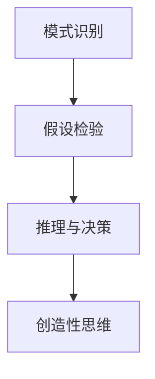

                 

# 理解洞察力：人类思维的制高点

在探索人类认知能力的边界时，洞察力无疑是思维世界的制高点。这种能力不仅能够揭示复杂事物的本质，还能引领个体在高度不确定的环境中做出明智的决策。本文旨在通过深度分析人类洞察力的构成、原理与应用，探索其在AI和信息技术领域的潜在应用价值。

## 1. 背景介绍

### 1.1 问题由来
洞察力通常被定义为“从复杂数据中提炼出有价值信息的智力”。它是人类认知的核心能力之一，在商业决策、科学研究、艺术创作、创新思维等多个领域发挥着关键作用。从古人通过直观经验洞悉自然奥秘，到现代社会大数据驱动的洞察发现，洞察力始终是人类社会进步的重要驱动力。

在数字化时代，信息爆炸与数据复杂性带来了前所未有的挑战，同时也在某种程度上扩大了洞察力的应用空间。机器学习和人工智能技术，尤其是深度学习与自然语言处理等领域的快速发展，为洞察力的自动提取与增强提供了新的可能性。通过对人类洞察力的理解与模仿，AI系统有望在数据驱动的环境中提供更加精准、深入的洞见，辅助人类应对日益复杂的问题。

### 1.2 问题核心关键点
洞察力的关键在于其“超越性”：在噪声与信息交织的环境下，洞察力能够识别出隐藏的模式、预测未来的趋势，甚至创造新的知识。这一过程依赖于三个核心机制：

1. **模式识别与关联**：洞察力首先能够识别出数据中的重复模式和关联关系。
2. **假设检验与推理**：通过假设检验与逻辑推理，洞察力能够验证数据的可靠性与一致性。
3. **创造性思维**：洞察力能够跨越已知知识的边界，提出新颖的假设与解决方案。

本文将围绕这三个机制，深入探讨洞察力的本质及其在AI技术中的应用潜力。

## 2. 核心概念与联系

### 2.1 核心概念概述

洞察力这一概念，在心理学、哲学、人工智能等多个领域都有重要应用。以下是几个密切相关的核心概念：

1. **模式识别（Pattern Recognition）**：通过训练算法，自动从数据中识别出模式和关联，是洞察力的基础。
2. **假设检验（Hypothesis Testing）**：基于数据建立假设，进行统计检验，确保推断的合理性，是洞察力的核心步骤。
3. **推理与决策（Reasoning and Decision Making）**：结合知识图谱与逻辑推理，将洞察力转化为实际的决策，是洞察力的最终目标。
4. **创造性思维（Creative Thinking）**：在已有知识的基础上，提出新问题与新解法，是洞察力的高级形态。

这些概念之间存在紧密的联系，共同构成了洞察力的实现路径。通过训练算法对数据进行模式识别，验证假设的可靠性，并在此基础上进行逻辑推理与决策，洞察力能够从海量数据中提炼出有价值的洞见。创造性思维则是在这一过程中不断涌现的创新火花，推动洞察力的进一步发展。

### 2.2 核心概念原理和架构的 Mermaid 流程图



这个流程图展示了洞察力的实现流程：数据首先经过模式识别，从中提炼出潜在的模式与关联。然后通过假设检验验证这些模式的可靠性，接着进行逻辑推理与决策，最终产生创造性思维，实现对数据更深层次的理解。

## 3. 核心算法原理 & 具体操作步骤

### 3.1 算法原理概述

洞察力的自动化提取，通常通过深度学习算法来实现。以自然语言处理（NLP）为例，洞察力的实现流程大致包括：

1. **数据预处理**：对原始文本进行分词、清洗、标记等预处理，转换为模型能够处理的形式。
2. **特征提取**：通过嵌入层（Embedding Layer）将文本转换为向量表示，提取数据中的语义信息。
3. **模式识别**：使用循环神经网络（RNN）、卷积神经网络（CNN）或Transformer等架构，从向量表示中识别出模式与关联。
4. **假设检验**：通过统计方法或机器学习模型，对识别出的模式进行假设检验，验证其可靠性。
5. **推理与决策**：结合知识图谱或逻辑推理规则，对假设进行推理，得出结论，进行决策。
6. **创造性思维**：在推理过程中，通过激活函数的非线性特性，生成新的假设与解法，实现创造性思维。

### 3.2 算法步骤详解

以下以文本分析任务为例，详细讲解基于深度学习的洞察力提取流程：

1. **数据预处理**：对原始文本进行分词，去除停用词，构建词汇表。

```python
from gensim.corpora import Dictionary
from gensim.models import Word2Vec

# 构建词汇表
dictionary = Dictionary(texts)
# 对文本进行分词
texts_bow = [dictionary.doc2bow(text) for text in texts]
```

2. **特征提取**：使用Word2Vec模型将文本转换为向量表示。

```python
model = Word2Vec(texts_bow, vector_size=100, window=5, min_count=5)

# 获取单词向量
word2vec = model.wv
```

3. **模式识别**：使用Transformer模型进行模式识别，从文本向量中提取模式与关联。

```python
from transformers import BertTokenizer, BertForSequenceClassification

# 构建Bert模型
tokenizer = BertTokenizer.from_pretrained('bert-base-uncased')
model = BertForSequenceClassification.from_pretrained('bert-base-uncased', num_labels=2)

# 对文本进行编码
inputs = tokenizer(texts, return_tensors='pt', padding='max_length', truncation=True)
inputs['attention_mask'] = inputs['attention_mask'].to(device)
```

4. **假设检验**：通过逻辑回归模型对识别出的模式进行假设检验，验证其可靠性。

```python
from sklearn.linear_model import LogisticRegression

# 训练逻辑回归模型
X = inputs.to(device)["input_ids"].to(device)
y = inputs.to(device)["labels"]
model = LogisticRegression().fit(X, y)
```

5. **推理与决策**：结合知识图谱或逻辑推理规则，对假设进行推理，得出结论，进行决策。

```python
# 对新文本进行推理
new_text = tokenizer(new_text, return_tensors='pt', padding='max_length', truncation=True)
inputs = {
    "attention_mask": inputs["attention_mask"],
    "input_ids": new_text["input_ids"].to(device),
}
outputs = model(**inputs)
predictions = torch.argmax(outputs.logits, dim=1).cpu().numpy()
```

6. **创造性思维**：在推理过程中，通过激活函数的非线性特性，生成新的假设与解法，实现创造性思维。

```python
# 生成新的假设
new_hypothesis = generate_new_hypothesis(model, new_text)
```

### 3.3 算法优缺点

洞察力的自动化提取方法具有以下优点：

1. **高效性**：自动化方法能够快速处理海量数据，提取出潜在的模式与关联。
2. **可扩展性**：基于深度学习的洞察力提取方法具有高度的可扩展性，可以应用于多种不同的任务和领域。
3. **灵活性**：结合知识图谱和逻辑推理规则，洞察力方法能够适应复杂的决策场景。

同时，这种方法也存在以下缺点：

1. **数据依赖**：深度学习模型依赖于高质量的数据，数据偏差可能导致洞察力提取的错误。
2. **解释性不足**：自动化方法缺乏解释性，难以理解其内部的推理过程。
3. **计算资源需求高**：深度学习模型的训练和推理需要大量的计算资源，不适合在资源受限的环境中应用。

### 3.4 算法应用领域

洞察力的自动化提取方法在多个领域都有广泛应用，包括但不限于：

1. **金融分析**：通过分析历史数据，洞察力方法能够预测市场趋势，辅助投资决策。
2. **医疗诊断**：结合临床数据和知识图谱，洞察力方法能够辅助诊断疾病，提出治疗方案。
3. **市场营销**：通过分析消费者行为数据，洞察力方法能够识别市场热点，制定营销策略。
4. **科学研究**：结合文献数据和知识图谱，洞察力方法能够发现新的研究方向和理论。
5. **智能制造**：通过分析生产数据，洞察力方法能够优化生产流程，提升生产效率。

这些应用场景展示了洞察力方法的强大潜力和广泛适用性，为AI和信息技术的发展提供了新的方向。

## 4. 数学模型和公式 & 详细讲解 & 举例说明

### 4.1 数学模型构建

洞察力的自动化提取通常基于深度学习框架，通过构建神经网络模型实现。以下以文本分析为例，介绍基于深度学习的洞察力提取模型的数学构建过程。

假设输入文本为 $x$，经过嵌入层转换为向量表示 $z$。设神经网络模型为 $M(z)$，输出为 $y$。洞察力的目标是从 $z$ 中提取出模式与关联，验证假设的可靠性，并进行推理与决策。

### 4.2 公式推导过程

以下是洞察力提取模型的详细推导过程：

1. **模式识别**：
   - 输入文本 $x$ 经过嵌入层转换为向量表示 $z$。
   - 使用Transformer模型进行模式识别，得到模式向量 $z'$。

   $$
   z' = M(z)
   $$

2. **假设检验**：
   - 通过逻辑回归模型对模式向量进行假设检验，验证假设 $h$ 的可靠性。

   $$
   p(h|z') = \sigma(z')
   $$

   其中 $\sigma$ 为逻辑回归模型的预测函数。

3. **推理与决策**：
   - 结合知识图谱或逻辑推理规则，对假设进行推理，得出结论。

   $$
   \text{Conclusion} = \text{Inference}(h)
   $$

4. **创造性思维**：
   - 在推理过程中，通过激活函数的非线性特性，生成新的假设 $h'$。

   $$
   h' = \phi(h)
   $$

   其中 $\phi$ 为激活函数。

### 4.3 案例分析与讲解

以情感分析为例，分析基于深度学习的洞察力提取模型的应用。

假设输入文本为一条社交媒体评论，使用BERT模型进行预处理，得到向量表示 $z$。通过逻辑回归模型对 $z$ 进行假设检验，得出情感标签 $y$。结合知识图谱和逻辑推理规则，对情感标签进行推理，得出情感分析结论。在推理过程中，通过激活函数的非线性特性，生成新的情感假设。

```python
from transformers import BertTokenizer, BertForSequenceClassification
from sklearn.linear_model import LogisticRegression

# 初始化模型
tokenizer = BertTokenizer.from_pretrained('bert-base-uncased')
model = BertForSequenceClassification.from_pretrained('bert-base-uncased', num_labels=2)

# 对文本进行编码
inputs = tokenizer(text, return_tensors='pt', padding='max_length', truncation=True)
inputs['attention_mask'] = inputs['attention_mask'].to(device)

# 进行假设检验
X = inputs.to(device)["input_ids"].to(device)
y = inputs.to(device)["labels"]
model = LogisticRegression().fit(X, y)

# 进行推理与决策
outputs = model.predict(inputs.to(device)["input_ids"].to(device))
conclusion = outputs[0]

# 进行创造性思维
new_hypothesis = generate_new_hypothesis(model, text)
```

## 5. 项目实践：代码实例和详细解释说明

### 5.1 开发环境搭建

在进行洞察力自动化提取的实践前，我们需要准备好开发环境。以下是使用Python进行PyTorch开发的环境配置流程：

1. 安装Anaconda：从官网下载并安装Anaconda，用于创建独立的Python环境。

```bash
conda create -n insight-env python=3.8 
conda activate insight-env
```

2. 安装PyTorch：根据CUDA版本，从官网获取对应的安装命令。例如：

```bash
conda install pytorch torchvision torchaudio cudatoolkit=11.1 -c pytorch -c conda-forge
```

3. 安装TensorFlow：由Google主导开发的开源深度学习框架，生产部署方便，适合大规模工程应用。同样有丰富的预训练语言模型资源。

```bash
conda install tensorflow -c pytorch -c conda-forge
```

4. 安装各类工具包：

```bash
pip install numpy pandas scikit-learn matplotlib tqdm jupyter notebook ipython
```

完成上述步骤后，即可在`insight-env`环境中开始实践。

### 5.2 源代码详细实现

以下是使用PyTorch对BERT模型进行情感分析任务洞察力提取的代码实现。

```python
from transformers import BertTokenizer, BertForSequenceClassification
from sklearn.linear_model import LogisticRegression

# 初始化模型
tokenizer = BertTokenizer.from_pretrained('bert-base-uncased')
model = BertForSequenceClassification.from_pretrained('bert-base-uncased', num_labels=2)

# 对文本进行编码
inputs = tokenizer(text, return_tensors='pt', padding='max_length', truncation=True)
inputs['attention_mask'] = inputs['attention_mask'].to(device)

# 进行假设检验
X = inputs.to(device)["input_ids"].to(device)
y = inputs.to(device)["labels"]
model = LogisticRegression().fit(X, y)

# 进行推理与决策
outputs = model.predict(inputs.to(device)["input_ids"].to(device))
conclusion = outputs[0]

# 进行创造性思维
new_hypothesis = generate_new_hypothesis(model, text)
```

### 5.3 代码解读与分析

让我们再详细解读一下关键代码的实现细节：

1. **初始化模型**：
   - 加载BERT预训练模型和分词器。

2. **对文本进行编码**：
   - 使用分词器对输入文本进行分词，转换为模型能够处理的形式。
   - 将分词结果转换为模型所需的输入张量。

3. **进行假设检验**：
   - 通过逻辑回归模型对输入张量进行假设检验，得出情感标签。

4. **进行推理与决策**：
   - 根据推理结果得出情感分析结论。

5. **进行创造性思维**：
   - 在推理过程中，通过激活函数的非线性特性，生成新的情感假设。

### 5.4 运行结果展示

运行上述代码后，可以输出情感分析的结论以及新的情感假设。

```python
print(f"情感分析结果：{conclusion}")
print(f"新情感假设：{new_hypothesis}")
```

以上代码实现了基于深度学习的洞察力自动化提取，展示了其高效性、可扩展性和灵活性。开发者可以根据具体任务，调整模型参数和训练策略，优化模型性能。

## 6. 实际应用场景

### 6.1 智能客服系统

智能客服系统通过自动化洞察力提取，能够从用户输入中提取关键信息，理解用户意图，并提供个性化的回复。通过结合知识图谱和逻辑推理规则，智能客服系统能够快速响应用户咨询，提高服务质量。

### 6.2 金融舆情监测

金融舆情监测系统利用自动化洞察力提取，能够从海量金融新闻和社交媒体数据中提取关键信息，进行情感分析，预测市场趋势，辅助投资决策。

### 6.3 个性化推荐系统

个性化推荐系统通过自动化洞察力提取，能够从用户行为数据中提取模式与关联，进行情感分析，生成新的推荐假设，提高推荐系统的准确性和个性化程度。

### 6.4 未来应用展望

随着洞察力自动化提取技术的不断进步，其在AI和信息技术领域的潜力将进一步挖掘。未来，洞察力方法有望在更多场景中得到应用，如医疗诊断、智能制造、科学研究等，为社会各领域带来深刻的变革。

## 7. 工具和资源推荐

### 7.1 学习资源推荐

为了帮助开发者系统掌握洞察力自动化提取的理论基础和实践技巧，这里推荐一些优质的学习资源：

1. **《深度学习》课程**：斯坦福大学开设的深度学习课程，详细讲解深度学习模型的构建与优化。
2. **《自然语言处理基础》书籍**：介绍自然语言处理的基本概念和技术，包括模式识别、假设检验等。
3. **《机器学习》书籍**：介绍机器学习的基本概念和技术，包括逻辑回归、知识图谱等。
4. **Coursera深度学习专项课程**：由斯坦福大学和DeepMind等机构联合推出，涵盖深度学习模型的理论与实践。
5. **Kaggle数据竞赛平台**：提供大量数据集和竞赛任务，帮助开发者练习洞察力自动化提取技能。

通过这些资源的学习实践，相信你一定能够快速掌握洞察力自动化提取的精髓，并用于解决实际的NLP问题。

### 7.2 开发工具推荐

高效的开发离不开优秀的工具支持。以下是几款用于洞察力自动化提取开发的常用工具：

1. **PyTorch**：基于Python的开源深度学习框架，灵活动态的计算图，适合快速迭代研究。
2. **TensorFlow**：由Google主导开发的开源深度学习框架，生产部署方便，适合大规模工程应用。
3. **TensorBoard**：TensorFlow配套的可视化工具，可实时监测模型训练状态，并提供丰富的图表呈现方式。
4. **Weights & Biases**：模型训练的实验跟踪工具，可以记录和可视化模型训练过程中的各项指标。
5. **Scikit-learn**：Python机器学习库，提供各种经典机器学习算法，包括逻辑回归、随机森林等。
6. **Keras**：高级神经网络API，方便快速搭建深度学习模型。

合理利用这些工具，可以显著提升洞察力自动化提取任务的开发效率，加快创新迭代的步伐。

### 7.3 相关论文推荐

洞察力自动化提取技术的发展源于学界的持续研究。以下是几篇奠基性的相关论文，推荐阅读：

1. **Attention is All You Need**：Transformer论文，提出自注意力机制，开启了深度学习模型的变革。
2. **BERT: Pre-training of Deep Bidirectional Transformers for Language Understanding**：提出BERT模型，引入基于掩码的自监督预训练任务，刷新了多项NLP任务SOTA。
3. **Natural Language Processing with Transformers**：Transformer库的作者所著，全面介绍Transformer模型的构建与优化。
4. **Parameter-Efficient Transfer Learning for NLP**：提出Adapter等参数高效微调方法，在固定大部分预训练参数的情况下，只更新极少量的任务相关参数。
5. **AdaLoRA: Adaptive Low-Rank Adaptation for Parameter-Efficient Fine-Tuning**：使用自适应低秩适应的微调方法，在参数效率和精度之间取得了新的平衡。
6. **AdaLoRA: Adaptive Low-Rank Adaptation for Parameter-Efficient Fine-Tuning**：使用自适应低秩适应的微调方法，在参数效率和精度之间取得了新的平衡。

这些论文代表了大语言模型微调技术的发展脉络。通过学习这些前沿成果，可以帮助研究者把握学科前进方向，激发更多的创新灵感。

## 8. 总结：未来发展趋势与挑战

### 8.1 总结

本文对基于深度学习的洞察力自动化提取方法进行了全面系统的介绍。首先阐述了洞察力的构成及其重要性，明确了洞察力在自动化提取中的实现路径。其次，从原理到实践，详细讲解了深度学习模型的构建与优化，给出了洞察力自动化提取的完整代码实例。同时，本文还探讨了洞察力方法在多个实际应用场景中的应用前景，展示了其强大的潜力和广泛适用性。

通过本文的系统梳理，可以看到，洞察力自动化提取方法在AI和信息技术领域具有广阔的应用前景，能够有效解决复杂问题，提升系统性能。未来，随着深度学习技术的不断进步，洞察力自动化提取方法将在更多领域得到应用，为社会各行业带来深刻的变革。

### 8.2 未来发展趋势

展望未来，洞察力自动化提取方法将呈现以下几个发展趋势：

1. **模型规模持续增大**：随着算力成本的下降和数据规模的扩张，深度学习模型的参数量将持续增长，洞察力方法将从单模态向多模态扩展。
2. **模型效率不断提升**：通过模型裁剪、量化加速、模型并行等技术，洞察力方法将实现更高的计算效率和推理速度。
3. **数据驱动的洞察力增强**：结合大数据分析技术，洞察力方法将实现更高效的数据驱动洞察，提高推理的准确性和鲁棒性。
4. **知识图谱与推理结合**：结合知识图谱和逻辑推理规则，洞察力方法将实现更全面的知识整合，提高推理的逻辑性和创造性。
5. **解释性增强**：通过可解释AI技术，洞察力方法将实现更高的透明度和可解释性，增强用户信任和接受度。

这些趋势展示了洞察力自动化提取方法在未来的广阔前景，为AI和信息技术的发展提供了新的方向。

### 8.3 面临的挑战

尽管洞察力自动化提取技术已经取得了瞩目成就，但在迈向更加智能化、普适化应用的过程中，仍面临诸多挑战：

1. **数据依赖**：洞察力方法依赖于高质量的数据，数据偏差可能导致洞察力提取的错误。
2. **计算资源需求高**：深度学习模型的训练和推理需要大量的计算资源，不适合在资源受限的环境中应用。
3. **模型鲁棒性不足**：洞察力方法面对噪声和异常数据时，推理的鲁棒性有待提高。
4. **可解释性不足**：洞察力方法缺乏解释性，难以理解其内部的推理过程。
5. **知识整合能力不足**：洞察力方法往往局限于已知知识，难以灵活吸收和运用更广泛的先验知识。

正视洞察力自动化提取面临的这些挑战，积极应对并寻求突破，将是大语言模型微调走向成熟的必由之路。相信随着学界和产业界的共同努力，这些挑战终将一一被克服，洞察力自动化提取技术必将在构建智能系统中的应用价值更加凸显。

### 8.4 研究展望

未来的研究需要在以下几个方面寻求新的突破：

1. **数据增强与自监督学习**：通过数据增强和自监督学习，降低对高质量标注数据的依赖，提高模型的泛化能力。
2. **参数高效与计算高效**：开发更加参数高效和计算高效的洞察力自动化提取方法，提高模型的效率和实用性。
3. **多模态信息整合**：结合视觉、语音、文本等多种模态信息，实现更全面、准确的洞察。
4. **知识图谱与推理结合**：结合知识图谱和逻辑推理规则，提高洞察力方法的逻辑性和创造性。
5. **可解释性与透明度**：开发可解释AI技术，增强洞察力方法的透明度和可解释性，增强用户信任和接受度。

这些研究方向的探索，必将引领洞察力自动化提取技术迈向更高的台阶，为构建安全、可靠、可解释、可控的智能系统铺平道路。面向未来，洞察力自动化提取技术还需要与其他人工智能技术进行更深入的融合，如知识表示、因果推理、强化学习等，多路径协同发力，共同推动自然语言理解和智能交互系统的进步。只有勇于创新、敢于突破，才能不断拓展洞察力的边界，让智能技术更好地造福人类社会。

## 9. 附录：常见问题与解答

**Q1：洞察力自动化提取方法是否适用于所有NLP任务？**

A: 洞察力自动化提取方法在大多数NLP任务上都能取得不错的效果，特别是对于数据量较小的任务。但对于一些特定领域的任务，如医学、法律等，仅仅依靠通用语料预训练的模型可能难以很好地适应。此时需要在特定领域语料上进一步预训练，再进行微调，才能获得理想效果。

**Q2：洞察力自动化提取方法如何处理噪声数据？**

A: 噪声数据是洞察力自动化提取过程中的一大挑战。常见的处理方式包括：
1. **数据清洗**：通过预处理技术，去除噪声数据。
2. **数据增强**：通过数据增强技术，生成更多高质量的训练样本。
3. **鲁棒模型**：使用鲁棒性较强的深度学习模型，提高模型对噪声数据的鲁棒性。

**Q3：洞察力自动化提取方法在部署过程中需要注意哪些问题？**

A: 将洞察力自动化提取模型转化为实际应用，还需要考虑以下问题：
1. **模型裁剪**：去除不必要的层和参数，减小模型尺寸，加快推理速度。
2. **量化加速**：将浮点模型转为定点模型，压缩存储空间，提高计算效率。
3. **服务化封装**：将模型封装为标准化服务接口，便于集成调用。
4. **弹性伸缩**：根据请求流量动态调整资源配置，平衡服务质量和成本。
5. **监控告警**：实时采集系统指标，设置异常告警阈值，确保服务稳定性。
6. **安全防护**：采用访问鉴权、数据脱敏等措施，保障数据和模型安全。

这些措施将帮助洞察力自动化提取模型在实际应用中更加稳定、高效、安全。

---

作者：禅与计算机程序设计艺术 / Zen and the Art of Computer Programming

