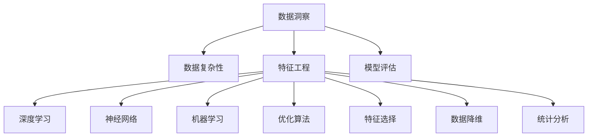

                 

# 理解洞察力：在纷杂中寻找本质

> 关键词：数据洞察, 复杂性管理, 特征工程, 模型评估, 深度学习, 神经网络, 机器学习, 优化算法, 特征选择, 数据降维, 统计分析, 大数据

## 1. 背景介绍

在当今数据驱动的时代，洞察力成为了企业决策的黄金钥匙。无论是金融、零售、医疗，还是科技、教育、物流等各个行业，洞察力都在帮助我们理解过去，预测未来，优化决策。然而，随着数据量的爆炸式增长，数据的多样性和复杂性也日益增加，如何从海量数据中提取有价值的洞察力，成为了技术人面临的巨大挑战。本文将从数据洞察的原理、方法、工具和未来发展趋势等方面，探讨如何在纷杂的数据世界中寻找本质，创造真正有价值的数据洞察力。

## 2. 核心概念与联系

### 2.1 核心概念概述

为了更好地理解数据洞察的构建过程，本节将介绍几个关键的概念及其相互联系：

- 数据洞察：通过数据收集、清洗、分析和解释，从数据中提取出的具有商业价值或决策指导意义的结论或发现。
- 数据复杂性：指数据在形式、结构、属性等方面的复杂程度，包括数据的多样性、异构性、噪声等。
- 特征工程：指在数据预处理阶段，通过特征提取、特征选择、特征转换等方法，将原始数据转化为模型可以理解的特征表示。
- 模型评估：指在模型训练和测试阶段，通过各种评价指标和方法，衡量模型性能和泛化能力的过程。
- 深度学习：基于神经网络的机器学习技术，通过多层神经网络对数据进行复杂映射和特征提取。
- 神经网络：一种由大量节点组成的网络结构，用于处理复杂的非线性映射问题，广泛应用于图像识别、自然语言处理等领域。
- 机器学习：通过数据训练，使模型自动学习并优化，从而实现数据分析和预测的功能。
- 优化算法：在模型训练中，用于最小化损失函数，优化模型参数的算法，包括梯度下降、Adam、Adagrad等。
- 特征选择：指在数据集中选择最具代表性或最有信息量的特征，去除无关或冗余特征，提高模型性能。
- 数据降维：指在数据集中将高维数据映射到低维空间，以降低计算复杂度和数据复杂性。
- 统计分析：指通过统计方法对数据进行描述、推断和测试，以发现数据分布、关联和趋势等特征。

这些概念之间的逻辑关系可以通过以下Mermaid流程图来展示：



这个流程图展示了数据洞察的构建过程及其与相关概念之间的联系。

## 3. 核心算法原理 & 具体操作步骤

### 3.1 算法原理概述

数据洞察的构建过程主要包括以下几个步骤：

1. **数据收集与清洗**：获取数据源，对数据进行预处理，包括去重、缺失值处理、异常值检测等。
2. **特征提取与选择**：通过特征工程方法，将原始数据转化为模型可以理解的特征表示。
3. **模型训练与评估**：使用机器学习或深度学习模型对特征进行训练，并通过评估指标衡量模型性能。
4. **结果解释与应用**：对模型输出进行解释，并应用到实际业务场景中，提供决策支持。

每个步骤都依赖于算法和技术的支撑，我们将逐一介绍。

### 3.2 算法步骤详解

#### 数据收集与清洗

数据收集是数据洞察的第一步。收集的数据可能来自不同的渠道，包括企业内部系统、公开数据集、API接口等。为了确保数据的质量和一致性，需要进行数据清洗，包括去重、缺失值处理、异常值检测等。

```python
import pandas as pd
from pandas import DataFrame
import numpy as np

# 数据读取
df = pd.read_csv('data.csv')

# 数据清洗
df.drop_duplicates(inplace=True)
df.fillna(method='ffill', inplace=True)
df = df[(df['value'] > 0)]
```

#### 特征提取与选择

特征提取是数据洞察的核心步骤之一。通过特征工程方法，将原始数据转化为模型可以理解的特征表示。常用的特征提取方法包括：

- **数据归一化**：将数据缩放到0到1之间的范围，以避免模型训练过程中数值差异过大。
- **数据编码**：将分类数据编码为数值型数据，以便于模型处理。
- **特征选择**：通过特征选择方法，选择最具代表性或最有信息量的特征，去除无关或冗余特征。

```python
from sklearn.preprocessing import StandardScaler, OneHotEncoder
from sklearn.feature_selection import SelectKBest, f_classif

# 数据归一化
scaler = StandardScaler()
df[['feature1', 'feature2']] = scaler.fit_transform(df[['feature1', 'feature2']])

# 数据编码
encoder = OneHotEncoder(sparse=False)
df_encoded = encoder.fit_transform(df[['category']])

# 特征选择
selector = SelectKBest(f_classif, k=5)
selector.fit(df, df['label'])
selected_features = selector.get_support().nonzero()[1]
df_selected = df[selected_features]
```

#### 模型训练与评估

模型训练与评估是数据洞察的关键步骤。通过选择合适的机器学习或深度学习模型，对特征进行训练，并通过评估指标衡量模型性能。常用的模型包括：

- **线性回归**：适用于连续型数据的预测问题。
- **逻辑回归**：适用于二分类问题的分类问题。
- **随机森林**：适用于多分类和回归问题，具有较好的泛化能力。
- **卷积神经网络**：适用于图像识别、文本分类等任务。

```python
from sklearn.linear_model import LinearRegression
from sklearn.ensemble import RandomForestClassifier
from sklearn.metrics import mean_squared_error, accuracy_score

# 线性回归
model = LinearRegression()
model.fit(X_train, y_train)
y_pred = model.predict(X_test)
mse = mean_squared_error(y_test, y_pred)

# 逻辑回归
model = RandomForestClassifier()
model.fit(X_train, y_train)
y_pred = model.predict(X_test)
acc = accuracy_score(y_test, y_pred)
```

#### 结果解释与应用

数据洞察的最终目的是为了提供决策支持。对模型输出进行解释，并应用到实际业务场景中，是数据洞察的重要环节。常用的解释方法包括：

- **特征重要性**：通过特征重要性排序，找出对模型预测贡献最大的特征。
- **局部可解释模型**：如LIME、SHAP等，通过局部扰动数据，解释模型在单个样本上的预测结果。
- **可视化工具**：如散点图、热力图、决策树等，帮助直观理解模型预测结果。

```python
import lime
import shap

# 特征重要性
importance = model.coef_
print('特征重要性：', importance)

# 局部可解释模型
explainer = lime.explain.LocalExplainer(model)
explanations = explainer.explain_instance(x_test, model.predict_proba)

# 可视化工具
import matplotlib.pyplot as plt
plt.scatter(X_test[:, 0], y_test)
plt.colorbar(y_pred)
```

### 3.3 算法优缺点

数据洞察的构建过程具有以下优点：

1. **全面性**：通过多角度、多层次的数据分析，能够全面理解数据特征和趋势。
2. **精确性**：通过选择和训练合适的模型，能够精确预测未来趋势和行为。
3. **可操作性**：数据洞察结果可以直接应用于实际业务决策，提高决策效率和质量。

同时，该过程也存在一些缺点：

1. **数据质量依赖性高**：数据清洗和特征工程对数据质量要求较高，数据质量问题可能导致洞察力失真。
2. **模型选择复杂性**：选择合适的模型和算法需要丰富的经验和专业知识，可能导致选择偏差。
3. **解释性不足**：复杂模型如深度学习等，难以提供透明和可解释的洞察力。
4. **计算资源消耗大**：数据洞察的构建过程需要大量的计算资源，可能对系统性能和成本带来压力。

### 3.4 算法应用领域

数据洞察的应用领域非常广泛，涵盖各个行业和领域，包括但不限于：

- **金融**：信用评分、风险评估、市场预测等。
- **零售**：客户细分、产品推荐、销售预测等。
- **医疗**：疾病诊断、患者风险评估、治疗效果预测等。
- **制造**：生产效率优化、设备故障预测、供应链管理等。
- **物流**：路线优化、运输成本控制、配送时间预测等。
- **教育**：学生评估、课程推荐、教学效果分析等。
- **科技**：产品推荐、广告投放、用户行为分析等。

## 4. 数学模型和公式 & 详细讲解 & 举例说明

### 4.1 数学模型构建

数据洞察的构建过程可以通过数学模型来表示。假设我们有一个包含 $n$ 个样本的数据集 $\mathcal{D}=\{(x_i, y_i)\}_{i=1}^n$，其中 $x_i$ 为特征向量，$y_i$ 为标签。构建数据洞察的过程可以表示为：

$$
\begin{aligned}
& \min_{\theta} \frac{1}{N}\sum_{i=1}^N \ell(y_i, \hat{y}_i) \\
& \hat{y}_i = f_\theta(x_i)
\end{aligned}
$$

其中 $f_\theta(x)$ 为模型函数，$\ell$ 为损失函数，$\theta$ 为模型参数。

### 4.2 公式推导过程

以线性回归模型为例，推导其数学公式：

假设数据集 $\mathcal{D}=\{(x_i, y_i)\}_{i=1}^n$，模型函数为 $f_\theta(x) = \theta_0 + \sum_{i=1}^p \theta_i x_{ij}$，损失函数为均方误差损失 $\ell(y_i, \hat{y}_i) = (y_i - \hat{y}_i)^2$。则线性回归模型的优化目标为：

$$
\min_{\theta} \frac{1}{N}\sum_{i=1}^N (y_i - f_\theta(x_i))^2
$$

通过梯度下降算法求解，可以得到模型参数 $\theta$：

$$
\theta_{j} = \frac{1}{N}\sum_{i=1}^N (x_{ij}(y_i - \hat{y}_i)) / \sum_{i=1}^N (x_{ij}^2)
$$

### 4.3 案例分析与讲解

假设我们有一个房价预测任务，数据集包含特征 $x_1, x_2, x_3, x_4$，标签为 $y$。我们构建线性回归模型，并使用梯度下降算法求解模型参数。

```python
from sklearn.linear_model import LinearRegression

# 数据集
X = np.array([[1, 2, 3, 4], [5, 6, 7, 8], [9, 10, 11, 12]])
y = np.array([50, 100, 150])

# 构建模型
model = LinearRegression()
model.fit(X, y)

# 预测新样本
X_new = np.array([[13, 14, 15, 16]])
y_pred = model.predict(X_new)
print('预测房价为：', y_pred)
```

## 5. 项目实践：代码实例和详细解释说明

### 5.1 开发环境搭建

在进行数据洞察的开发实践中，我们需要准备好开发环境。以下是使用Python进行数据洞察开发的常见环境配置流程：

1. 安装Anaconda：从官网下载并安装Anaconda，用于创建独立的Python环境。

2. 创建并激活虚拟环境：
```bash
conda create -n insight-env python=3.8 
conda activate insight-env
```

3. 安装相关库：
```bash
conda install numpy pandas scikit-learn matplotlib seaborn jupyter notebook
```

4. 安装可视化工具：
```bash
conda install matplotlib seaborn jupyterlab
```

完成上述步骤后，即可在`insight-env`环境中开始数据洞察实践。

### 5.2 源代码详细实现

下面我们以房价预测任务为例，给出使用Scikit-learn进行数据洞察的PyTorch代码实现。

```python
import numpy as np
from sklearn.linear_model import LinearRegression
from sklearn.metrics import mean_squared_error

# 数据集
X = np.array([[1, 2, 3, 4], [5, 6, 7, 8], [9, 10, 11, 12]])
y = np.array([50, 100, 150])

# 构建模型
model = LinearRegression()
model.fit(X, y)

# 预测新样本
X_new = np.array([[13, 14, 15, 16]])
y_pred = model.predict(X_new)

# 计算均方误差
mse = mean_squared_error(y, y_pred)
print('均方误差：', mse)
```

### 5.3 代码解读与分析

让我们再详细解读一下关键代码的实现细节：

**数据集构建**：
- 通过NumPy库创建数据集 `X` 和标签 `y`，用于模型训练和预测。

**模型训练**：
- 使用Scikit-learn库中的 `LinearRegression` 类，构建线性回归模型。
- 使用 `fit` 方法对模型进行训练，输入训练数据 `X` 和标签 `y`。

**预测新样本**：
- 使用 `predict` 方法对新样本进行预测，输入新特征 `X_new`。

**评估模型**：
- 使用 `mean_squared_error` 方法计算预测值和真实值之间的均方误差。

## 6. 实际应用场景

### 6.1 金融领域

在金融领域，洞察力在风险评估、信用评分、市场预测等方面发挥了重要作用。通过分析历史交易数据、财务报表等，可以发现潜在的风险因素和市场趋势，从而优化资产配置和投资策略。

**案例分析**：
假设我们有一家银行，希望通过客户的历史交易记录，预测其信用评分。我们可以收集客户的交易数据，包括交易金额、交易频率、交易类型等，构建特征向量。然后，使用逻辑回归模型对特征进行训练和预测，得到每个客户的信用评分。

```python
import pandas as pd
from sklearn.linear_model import LogisticRegression
from sklearn.metrics import accuracy_score

# 数据集
df = pd.read_csv('customer_data.csv')

# 数据清洗
df = df.dropna()
df = df[df['amount'] > 0]

# 特征工程
features = ['amount', 'frequency', 'type']
X = df[features]
y = df['rating']

# 模型训练
model = LogisticRegression()
model.fit(X, y)

# 预测信用评分
y_pred = model.predict(X)
acc = accuracy_score(y, y_pred)
print('预测准确率：', acc)
```

### 6.2 零售领域

在零售领域，洞察力在客户细分、产品推荐、销售预测等方面具有重要作用。通过分析客户的购买历史、浏览行为、评价反馈等数据，可以发现客户偏好和市场趋势，从而优化营销策略和库存管理。

**案例分析**：
假设我们有一家电商公司，希望通过客户的历史购买记录，推荐相关产品。我们可以收集客户的购买数据，包括购买时间、购买金额、购买类型等，构建特征向量。然后，使用随机森林模型对特征进行训练和预测，得到每个客户的相关产品推荐。

```python
import pandas as pd
from sklearn.ensemble import RandomForestClassifier
from sklearn.metrics import precision_score

# 数据集
df = pd.read_csv('purchase_data.csv')

# 数据清洗
df = df.dropna()
df = df[df['amount'] > 0]

# 特征工程
features = ['date', 'amount', 'type']
X = df[features]
y = df['category']

# 模型训练
model = RandomForestClassifier()
model.fit(X, y)

# 预测产品推荐
y_pred = model.predict(X)
precision = precision_score(y, y_pred)
print('推荐准确率：', precision)
```

### 6.3 医疗领域

在医疗领域，洞察力在疾病诊断、患者风险评估、治疗效果预测等方面具有重要作用。通过分析患者的病历数据、治疗记录、基因信息等，可以发现疾病的风险因素和疗效趋势，从而优化诊疗方案和医疗资源分配。

**案例分析**：
假设我们有一家医院，希望通过患者的病历数据，预测其住院时长和费用。我们可以收集患者的病历数据，包括年龄、性别、病情、治疗记录等，构建特征向量。然后，使用支持向量机模型对特征进行训练和预测，得到每个患者的住院时长和费用。

```python
import pandas as pd
from sklearn.svm import SVC
from sklearn.metrics import mean_squared_error

# 数据集
df = pd.read_csv('patient_data.csv')

# 数据清洗
df = df.dropna()
df = df[df['age'] > 0]

# 特征工程
features = ['age', 'gender', 'disease', 'treatment']
X = df[features]
y = df['length']

# 模型训练
model = SVC()
model.fit(X, y)

# 预测住院时长和费用
y_pred = model.predict(X)
mse = mean_squared_error(y, y_pred)
print('均方误差：', mse)
```

### 6.4 未来应用展望

随着数据洞察技术的不断发展和应用，未来的数据洞察将更加智能化、自动化和个性化。以下是几个未来应用展望：

1. **实时洞察**：通过实时数据流处理技术，实现数据洞察的实时化，快速响应用户需求和市场变化。
2. **自动化洞察**：通过自动化机器学习平台，实现数据洞察的自动化，降低人工干预和误判。
3. **多模态洞察**：通过多模态数据融合技术，实现跨领域的联合分析，提高数据洞察的全面性和准确性。
4. **个性化洞察**：通过个性化推荐算法，实现针对不同用户和场景的定制化洞察，提升用户体验。
5. **深度学习洞察**：通过深度学习模型，实现复杂数据洞察，提高模型的预测能力和泛化能力。
6. **因果推断洞察**：通过因果推断技术，实现对数据间因果关系的分析，提高洞察的可靠性和解释性。

## 7. 工具和资源推荐

### 7.1 学习资源推荐

为了帮助开发者系统掌握数据洞察的构建过程，以下是一些优质的学习资源：

1. **《数据科学导论》**：由J.D. McNeil和A. Bock等专家编写，涵盖了数据洞察的基本概念和实践技巧。
2. **《机器学习实战》**：由Peter Harrington编写，提供了丰富的Python代码示例和机器学习项目实战经验。
3. **《统计学习基础》**：由Gareth James等专家编写，全面介绍了统计学习的基本原理和应用方法。
4. **Coursera《数据科学基础》**：由Duke大学提供，涵盖数据预处理、特征工程、模型评估等核心内容。
5. **Kaggle竞赛**：通过参与Kaggle数据竞赛，实战演练数据洞察的构建过程，积累实战经验。

通过对这些资源的学习实践，相信你一定能够快速掌握数据洞察的构建方法，并用于解决实际的数据分析问题。

### 7.2 开发工具推荐

高效的数据洞察开发离不开优秀的工具支持。以下是几款用于数据洞察开发的常用工具：

1. **Python**：作为数据科学的核心语言，Python拥有丰富的数据分析和机器学习库，如Pandas、NumPy、Scikit-learn等。
2. **Jupyter Notebook**：提供交互式编程环境，方便数据探索和模型调试。
3. **TensorFlow**：由Google开发的深度学习框架，支持复杂模型训练和推理。
4. **Keras**：基于TensorFlow的高级API，简单易用，适合快速原型开发。
5. **SciPy**：提供科学计算和数据分析功能，支持快速原型开发和可视化。
6. **Matplotlib**：用于绘制各种类型的图表和可视化工具。

合理利用这些工具，可以显著提升数据洞察任务的开发效率，加快创新迭代的步伐。

### 7.3 相关论文推荐

数据洞察技术的发展离不开学界的持续研究。以下是几篇奠基性的相关论文，推荐阅读：

1. **《A Survey on Data Mining Techniques》**：由Han等专家编写，全面介绍了数据挖掘和数据洞察的基本方法和技术。
2. **《Data Insights: An Overview》**：由Kharoufeh等专家编写，涵盖数据洞察的原理和应用实例。
3. **《Data Mining and Statistical Learning》**：由Hastie等专家编写，详细介绍了数据挖掘和统计学习的基本原理和应用。
4. **《Feature Selection Techniques》**：由Deng等专家编写，介绍了特征选择的基本方法和技术。
5. **《Machine Learning》**：由Tom Mitchell编写，全面介绍了机器学习的基本原理和应用。

这些论文代表了大数据洞察技术的发展脉络。通过学习这些前沿成果，可以帮助研究者把握学科前进方向，激发更多的创新灵感。

## 8. 总结：未来发展趋势与挑战

### 8.1 研究成果总结

本文对数据洞察的构建过程进行了全面系统的介绍。从数据收集与清洗、特征工程、模型训练与评估、结果解释与应用等方面，详细讲解了数据洞察的原理和操作方法。通过实例演示和案例分析，展示了数据洞察在金融、零售、医疗等领域的实际应用。同时，推荐了相关的学习资源和开发工具，为读者提供了系统的学习路径和实践指南。

### 8.2 未来发展趋势

展望未来，数据洞察技术将呈现以下几个发展趋势：

1. **智能化**：通过自动化机器学习平台和深度学习模型，实现数据洞察的智能化和自动化，提高效率和准确性。
2. **多模态**：通过多模态数据融合技术，实现跨领域的联合分析，提高数据洞察的全面性和准确性。
3. **实时化**：通过实时数据流处理技术，实现数据洞察的实时化和自动化，快速响应用户需求和市场变化。
4. **个性化**：通过个性化推荐算法和用户行为分析，实现针对不同用户和场景的定制化洞察，提升用户体验。
5. **因果推断**：通过因果推断技术，实现对数据间因果关系的分析，提高洞察的可靠性和解释性。
6. **解释性**：通过可解释性算法和可视化工具，提高模型和算法的可解释性，增强用户信任和决策透明度。

### 8.3 面临的挑战

尽管数据洞察技术已经取得了显著进展，但在实际应用过程中仍面临诸多挑战：

1. **数据质量问题**：数据采集和清洗过程可能存在噪音和偏差，影响洞察结果的准确性。
2. **计算资源消耗大**：数据洞察构建过程需要大量的计算资源，可能对系统性能和成本带来压力。
3. **模型选择复杂性**：选择合适的模型和算法需要丰富的经验和专业知识，可能导致选择偏差。
4. **可解释性不足**：复杂模型如深度学习等，难以提供透明和可解释的洞察力。
5. **用户隐私保护**：在数据洞察过程中，可能涉及到用户隐私和数据安全问题，需要采取相应的保护措施。

### 8.4 研究展望

面对数据洞察技术面临的挑战，未来的研究需要在以下几个方面寻求新的突破：

1. **数据治理**：建立完善的数据治理体系，确保数据的质量和一致性。
2. **自动化技术**：开发自动化机器学习平台，提高数据洞察的效率和准确性。
3. **多模态数据融合**：研究多模态数据融合技术，实现跨领域的联合分析。
4. **实时化技术**：开发实时数据流处理技术，实现数据洞察的实时化和自动化。
5. **可解释性算法**：研究可解释性算法，提高模型的透明性和可解释性。
6. **隐私保护技术**：研究隐私保护技术，确保数据使用的安全性。

这些研究方向的探索，必将引领数据洞察技术迈向更高的台阶，为构建安全、可靠、可解释、可控的智能系统铺平道路。面向未来，数据洞察技术还需要与其他人工智能技术进行更深入的融合，如知识表示、因果推理、强化学习等，多路径协同发力，共同推动数据洞察技术的进步。只有勇于创新、敢于突破，才能不断拓展数据洞察的边界，让数据洞察技术更好地造福人类社会。

## 9. 附录：常见问题与解答

**Q1：如何有效地进行特征工程？**

A: 特征工程是数据洞察构建的重要环节。以下是一些有效的特征工程方法：

1. **数据归一化**：将数据缩放到0到1之间的范围，以避免模型训练过程中数值差异过大。
2. **数据编码**：将分类数据编码为数值型数据，以便于模型处理。
3. **特征选择**：通过特征选择方法，选择最具代表性或最有信息量的特征，去除无关或冗余特征。
4. **特征转换**：通过特征转换方法，如PCA、SVD等，降低特征维度，提高模型性能。

**Q2：如何选择合适的机器学习模型？**

A: 选择合适的机器学习模型需要考虑多个因素，包括数据类型、问题类型、模型复杂度等。以下是一些常见的选择方法：

1. **线性模型**：适用于连续型数据的预测问题，如线性回归、逻辑回归等。
2. **树模型**：适用于分类和回归问题，如随机森林、决策树等。
3. **神经网络**：适用于复杂的非线性映射问题，如卷积神经网络、循环神经网络等。
4. **支持向量机**：适用于小样本、高维数据的问题，如支持向量机、核支持向量机等。

**Q3：如何提高模型的泛化能力？**

A: 提高模型的泛化能力需要从多个方面入手，包括数据预处理、模型选择、正则化等。以下是一些有效的方法：

1. **数据清洗**：通过数据清洗，去除异常值和噪声，提高数据质量。
2. **特征选择**：通过特征选择，选择最具代表性或最有信息量的特征，去除无关或冗余特征。
3. **模型正则化**：通过正则化技术，如L2正则、Dropout等，防止模型过拟合。
4. **模型集成**：通过模型集成，如Bagging、Boosting等，提高模型的泛化能力和稳定性。

**Q4：如何进行模型评估？**

A: 模型评估是数据洞察构建的重要环节。以下是一些常见的模型评估方法：

1. **均方误差**：适用于回归问题，衡量模型预测值和真实值之间的差异。
2. **交叉验证**：通过交叉验证，评估模型在独立数据集上的性能。
3. **准确率、精确率、召回率**：适用于分类问题，衡量模型对正负样本的分类效果。
4. **F1分数**：综合考虑准确率和召回率，适用于不平衡数据的分类问题。

**Q5：如何提高模型的可解释性？**

A: 提高模型的可解释性需要从多个方面入手，包括模型选择、特征选择、可视化工具等。以下是一些有效的方法：

1. **选择可解释性模型**：选择可解释性较高的模型，如线性模型、决策树等。
2. **特征重要性**：通过特征重要性排序，找出对模型预测贡献最大的特征。
3. **可视化工具**：通过可视化工具，如散点图、热力图、决策树等，帮助直观理解模型预测结果。

通过以上问题与解答，相信你对数据洞察的构建过程有了更深入的了解，能够更好地应用于实际业务场景中。

---

作者：禅与计算机程序设计艺术 / Zen and the Art of Computer Programming

