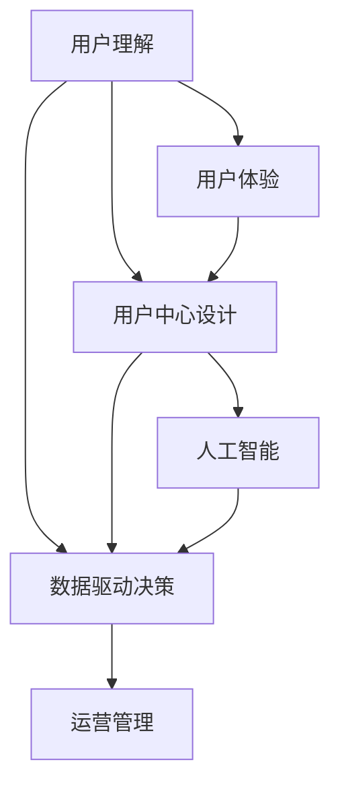

                 

# 理解用户：建立以用户为中心的文化

> 关键词：用户理解, 用户中心设计, 用户体验, 数据分析, 人工智能, 机器学习, 数据驱动决策

## 1. 背景介绍

### 1.1 问题由来
随着技术的迅猛发展和数字化转型的加速，企业和组织在运营和管理上逐渐意识到，理解用户、满足用户需求已经成为提升竞争力、实现可持续发展的关键。传统的数据统计、问卷调查等方法已经无法满足日益复杂的用户需求。如何通过先进的数据分析和人工智能技术，深入理解用户行为和心理，成为当前技术界和企业界亟需解决的问题。

### 1.2 问题核心关键点
建立一个以用户为中心的运营文化，其核心在于：

- **理解用户需求**：通过深入的数据分析、机器学习等技术，洞察用户行为和心理，识别出用户的真实需求。
- **设计用户友好的产品和服务**：基于对用户需求的深入理解，设计出满足用户期望的产品和服务，提高用户满意度和忠诚度。
- **持续优化用户体验**：通过收集用户反馈和行为数据，不断迭代和优化产品，提升用户体验和业务价值。

### 1.3 问题研究意义
深入理解用户并建立以用户为中心的运营文化，对于提升企业竞争力和用户体验具有重要意义：

1. **提升用户满意度**：通过精准的产品设计和优化，满足用户多样化、个性化的需求，提升用户的满意度和忠诚度。
2. **提高业务效率**：通过数据驱动的决策，优化运营流程，降低运营成本，提高整体业务效率。
3. **增强市场竞争力**：通过对用户需求的深刻洞察，推出更具竞争力的产品和服务，抢占市场先机。
4. **促进创新**：基于用户反馈的持续优化，不断推出创新的产品和服务，保持企业的创新活力。
5. **构建品牌忠诚度**：通过卓越的用户体验，树立品牌形象，建立用户对品牌的长期忠诚度。

## 2. 核心概念与联系

### 2.1 核心概念概述

为更好地理解以用户为中心的运营文化，本节将介绍几个密切相关的核心概念：

- **用户理解(User Understanding)**：通过数据分析、机器学习等技术手段，深入洞察用户行为和心理，识别出用户的真实需求。
- **用户体验(User Experience, UX)**：衡量产品或服务在满足用户需求方面的整体表现，包括可用性、易用性、可靠性、效率等多个方面。
- **用户中心设计(User-Centered Design, UCD)**：以用户需求为核心，通过一系列用户研究和设计活动，开发出满足用户期望的产品和服务。
- **数据驱动决策(Data-Driven Decision Making)**：利用数据分析和机器学习技术，辅助决策过程，提升决策的科学性和准确性。
- **人工智能(AI)**：通过模仿人类的认知和行为，实现自主学习、推理、决策等能力，辅助用户理解、设计优化和运营管理。
- **机器学习(Machine Learning, ML)**：让计算机通过数据学习，自主改进算法，提升数据分析和决策能力。

这些核心概念之间的逻辑关系可以通过以下Mermaid流程图来展示：



这个流程图展示了这个体系的核心理念：

1. 用户理解是基础，通过深入的数据分析，洞察用户需求。
2. 用户体验是目标，通过设计优化，满足用户期望。
3. 用户中心设计是手段，以用户需求为核心，设计产品和服务。
4. 数据驱动决策是方法，通过数据分析和机器学习，辅助决策过程。
5. 人工智能是工具，提升数据分析和决策的智能化水平。
6. 运营管理是实践，通过科学决策和智能化运营，实现业务价值。

## 3. 核心算法原理 & 具体操作步骤
### 3.1 算法原理概述

构建以用户为中心的运营文化，主要依赖于数据分析和机器学习技术，通过以下几个步骤实现：

1. **数据采集和预处理**：从各个渠道收集用户行为和反馈数据，进行数据清洗和预处理。
2. **用户建模**：利用机器学习技术，构建用户行为和心理模型，识别用户需求和偏好。
3. **用户分析**：基于用户模型，分析用户行为特征，洞察用户需求和痛点。
4. **设计优化**：根据用户分析结果，优化产品和服务设计，提升用户体验。
5. **运营优化**：通过数据分析和机器学习，不断迭代和优化运营策略，提升业务效率和用户满意度。

### 3.2 算法步骤详解

以下详细介绍构建以用户为中心的运营文化的核心步骤：

#### 数据采集和预处理

1. **数据来源**：用户行为数据、用户反馈数据、市场调研数据、社交媒体数据等。
2. **数据清洗**：去除噪声、填补缺失、处理异常值等。
3. **特征工程**：提取有意义的特征，如点击率、浏览时间、购买金额等。
4. **数据集成**：将来自不同渠道的数据进行整合，形成统一的视图。

#### 用户建模

1. **用户画像构建**：通过K-means、层次聚类等算法，构建用户画像，识别不同用户群体的特征。
2. **用户行为预测**：使用回归、分类等机器学习算法，预测用户行为，识别高价值用户和潜在流失用户。
3. **用户意图分析**：使用序列模型、注意力机制等技术，分析用户意图，识别用户需求和痛点。

#### 用户分析

1. **行为特征分析**：通过统计分析、数据挖掘等方法，识别用户行为模式和趋势。
2. **需求和痛点识别**：通过情感分析、主题建模等技术，洞察用户需求和痛点。
3. **用户群体划分**：基于用户行为和心理特征，划分不同的用户群体，制定针对性的运营策略。

#### 设计优化

1. **产品和服务设计**：根据用户需求和痛点，设计满足用户期望的产品和服务，如界面设计、功能优化等。
2. **用户体验评估**：通过A/B测试、用户调研等方法，评估产品和服务的设计效果，进行持续改进。
3. **反馈循环**：收集用户反馈，进行迭代优化，形成闭环反馈机制。

#### 运营优化

1. **运营策略制定**：基于用户行为和需求分析结果，制定针对性的运营策略，如个性化推荐、营销活动等。
2. **运营效果监控**：利用数据分析和机器学习技术，实时监控运营效果，评估策略效果。
3. **策略迭代优化**：根据运营效果，不断迭代和优化运营策略，提升运营效率和用户满意度。

### 3.3 算法优缺点

构建以用户为中心的运营文化的算法具有以下优点：

1. **数据驱动决策**：通过数据分析和机器学习技术，辅助决策过程，提升决策的科学性和准确性。
2. **个性化推荐**：基于用户行为和心理特征，提供个性化推荐，提升用户体验。
3. **动态优化**：通过实时数据分析和机器学习，持续优化运营策略，提升业务效率。
4. **用户满意度提升**：通过精准的产品设计和优化，提升用户满意度和忠诚度。

同时，该算法也存在一些局限性：

1. **数据质量依赖**：算法的准确性和有效性很大程度上依赖于数据质量，数据缺失、噪声、不准确等问题会影响模型效果。
2. **用户隐私保护**：在数据采集和处理过程中，如何保护用户隐私，避免数据泄露，是一个重要挑战。
3. **算法复杂度较高**：构建复杂的用户模型和分析模型，计算复杂度较高，需要较高的计算资源和专业知识。
4. **模型解释性不足**：机器学习模型往往是"黑盒"系统，难以解释其内部工作机制和决策逻辑。

尽管存在这些局限性，但就目前而言，构建以用户为中心的运营文化的算法仍是大数据驱动运营管理的重要范式。未来相关研究的重点在于如何进一步降低算法对数据质量的依赖，提高模型的解释性，以及更好地保护用户隐私等方向。

### 3.4 算法应用领域

构建以用户为中心的运营文化，已经在诸多领域得到了应用，包括但不限于：

- **电子商务**：通过用户行为分析和个性化推荐，提升用户购买率和满意度。
- **金融服务**：通过用户需求分析和风险控制，优化客户服务流程，提升用户体验。
- **健康医疗**：通过用户健康数据和行为分析，提供个性化医疗服务，提升用户健康水平。
- **教育培训**：通过用户学习行为和心理特征分析，提供个性化学习内容，提升学习效果。
- **旅游服务**：通过用户旅游行为和偏好分析，提供个性化旅游推荐，提升用户旅行体验。
- **智能家居**：通过用户行为和偏好分析，提供个性化家居控制和服务，提升用户生活质量。

这些领域的应用实例，展示了以用户为中心的运营文化在各行各业中的广泛应用，为提升用户体验和业务价值提供了新的思路和方法。

## 4. 数学模型和公式 & 详细讲解 & 举例说明

### 4.1 数学模型构建

构建以用户为中心的运营文化，需要构建多个数学模型，以下是几个核心模型：

1. **用户画像模型**：通过K-means聚类算法，构建用户画像，识别不同用户群体的特征。
2. **用户行为预测模型**：使用线性回归、逻辑回归等算法，预测用户行为，识别高价值用户和潜在流失用户。
3. **用户意图分析模型**：使用序列模型、注意力机制等技术，分析用户意图，识别用户需求和痛点。
4. **个性化推荐模型**：使用协同过滤、内容推荐等技术，提供个性化推荐，提升用户体验。

### 4.2 公式推导过程

以用户行为预测模型为例，推导线性回归模型的公式。

假设用户行为 $y$ 可以通过特征 $x_1, x_2, ..., x_n$ 线性预测，线性回归模型的公式为：

$$
y = \theta_0 + \theta_1 x_1 + \theta_2 x_2 + ... + \theta_n x_n + \epsilon
$$

其中，$\theta_0, \theta_1, ..., \theta_n$ 为模型参数，$\epsilon$ 为误差项。

通过最小二乘法求解最优参数 $\theta$，最小化预测误差，得：

$$
\hat{\theta} = (X^TX)^{-1}X^Ty
$$

其中 $X$ 为特征矩阵，$y$ 为标签向量。

### 4.3 案例分析与讲解

假设某电子商务网站需要预测用户购买行为，构建用户行为预测模型。假设用户行为 $y$ 可以通过用户行为特征 $x_1, x_2, ..., x_n$ 线性预测，其中 $x_1$ 为浏览时间，$x_2$ 为浏览页面数，$x_3$ 为点击率。

构建特征矩阵 $X$ 和标签向量 $y$，进行最小二乘法求解，得到最优参数 $\hat{\theta}$。

将测试集输入模型，计算预测值 $\hat{y}$，与实际购买行为 $y$ 进行比较，计算误差 $e = y - \hat{y}$，并不断迭代优化模型参数，直至误差最小。

## 5. 项目实践：代码实例和详细解释说明

### 5.1 开发环境搭建

在进行用户行为预测项目实践前，我们需要准备好开发环境。以下是使用Python进行Scikit-learn开发的环境配置流程：

1. 安装Anaconda：从官网下载并安装Anaconda，用于创建独立的Python环境。

2. 创建并激活虚拟环境：
```bash
conda create -n user-behavior-env python=3.8 
conda activate user-behavior-env
```

3. 安装Scikit-learn：
```bash
pip install scikit-learn
```

4. 安装各类工具包：
```bash
pip install numpy pandas matplotlib jupyter notebook
```

完成上述步骤后，即可在`user-behavior-env`环境中开始项目实践。

### 5.2 源代码详细实现

以下给出用户行为预测的代码实现，假设用户行为数据存储在`data.csv`文件中，每行数据包含用户ID、浏览时间、浏览页面数、点击率、购买行为等特征和标签。

```python
import pandas as pd
from sklearn.model_selection import train_test_split
from sklearn.linear_model import LinearRegression

# 加载数据
data = pd.read_csv('data.csv')

# 数据预处理
X = data[['浏览时间', '浏览页面数', '点击率']]
y = data['购买行为']

# 划分训练集和测试集
X_train, X_test, y_train, y_test = train_test_split(X, y, test_size=0.2, random_state=42)

# 训练模型
model = LinearRegression()
model.fit(X_train, y_train)

# 预测和评估
y_pred = model.predict(X_test)
print('测试集上预测准确率为：', model.score(X_test, y_test))
```

### 5.3 代码解读与分析

**用户行为数据处理**：

1. 使用`pandas`库加载数据，并进行初步数据清洗和特征工程。
2. 通过`train_test_split`方法将数据集划分为训练集和测试集。

**模型训练**：

1. 使用`LinearRegression`类创建线性回归模型。
2. 调用`fit`方法对训练集数据进行模型拟合。

**预测和评估**：

1. 调用`predict`方法对测试集进行预测，并使用`score`方法计算模型在测试集上的预测准确率。

通过上述代码，可以简单地实现用户行为预测模型的构建和评估。

## 6. 实际应用场景

### 6.1 电子商务个性化推荐

在电子商务领域，用户行为预测和个性化推荐是提高用户满意度和购买率的重要手段。通过用户行为分析，可以预测用户购买意向，提供个性化的商品推荐，提升用户体验和转化率。

具体实现中，可以收集用户浏览、点击、购买等行为数据，构建用户画像和行为预测模型，预测用户是否会购买某商品。基于预测结果，利用推荐算法，如协同过滤、内容推荐等，提供个性化的商品推荐，提升用户购买意愿和满意度。

### 6.2 金融服务智能风控

在金融服务领域，用户行为分析可以帮助识别高风险用户，防止欺诈行为，提高金融安全性。通过用户行为数据，构建用户画像和行为预测模型，识别异常交易行为，预测用户是否存在欺诈风险。基于预测结果，采取相应的风控措施，如冻结账户、增加验证等，降低金融风险。

### 6.3 教育培训个性化学习

在教育培训领域，用户行为分析可以帮助个性化推荐学习内容，提升学习效果。通过收集学生的学习行为数据，如学习时间、课程成绩、练习题完成情况等，构建学生画像和行为预测模型，预测学生的学习需求和困难点。基于预测结果，推荐个性化的学习内容和练习题，提升学生的学习效果和兴趣。

### 6.4 未来应用展望

随着技术的发展，构建以用户为中心的运营文化将得到更广泛的应用，为各行各业带来新的机遇和挑战：

1. **数据驱动决策**：基于用户行为和心理特征，提供数据驱动的决策支持，提升决策的科学性和准确性。
2. **个性化服务**：通过用户行为和需求分析，提供个性化的产品和服务，提升用户体验和满意度。
3. **实时优化**：通过实时数据分析和机器学习，动态优化运营策略，提升业务效率和用户满意度。
4. **智能化运营**：引入人工智能技术，提升运营管理的智能化水平，实现自动化的决策和优化。
5. **跨领域应用**：在医疗、教育、智能家居等多个领域，构建以用户为中心的运营文化，提升各行业的运营效率和用户体验。

## 7. 工具和资源推荐

### 7.1 学习资源推荐

为了帮助开发者系统掌握构建以用户为中心的运营文化的理论基础和实践技巧，这里推荐一些优质的学习资源：

1. 《用户中心设计：打造以用户为中心的产品》书籍：详细介绍了用户中心设计的核心原则和方法，帮助你深入理解用户需求和设计优化。
2. 《数据分析实战》课程：通过实战案例，系统讲解数据分析和机器学习技术，帮助你掌握数据驱动决策的方法。
3. 《人工智能基础》课程：全面介绍人工智能的原理和应用，帮助你了解AI在用户理解、设计优化中的作用。
4. 《Python数据分析与机器学习实战》书籍：通过实战项目，详细讲解数据预处理、特征工程、模型构建等技术，帮助你深入理解数据驱动运营。
5. HuggingFace官方文档：提供丰富的预训练语言模型和机器学习工具，帮助你快速实现用户行为预测和分析。

通过对这些资源的学习实践，相信你一定能够快速掌握构建以用户为中心的运营文化的精髓，并用于解决实际的运营问题。

### 7.2 开发工具推荐

高效的开发离不开优秀的工具支持。以下是几款用于用户行为分析和运营优化的常用工具：

1. Python：广泛使用的编程语言，具备丰富的数据科学和机器学习库，如NumPy、Pandas、Scikit-learn等。
2. R：适用于数据分析和统计建模的工具，支持大规模数据处理和复杂统计模型。
3. Tableau：数据可视化工具，帮助理解数据特征和趋势，辅助决策过程。
4. Jupyter Notebook：交互式编程环境，支持Python、R等语言，方便实时调试和验证代码。
5. SQL：用于数据库管理和查询的语言，支持复杂数据处理和统计分析。

合理利用这些工具，可以显著提升用户行为分析和运营优化的开发效率，加快创新迭代的步伐。

### 7.3 相关论文推荐

用户行为分析和以用户为中心的运营文化的发展源于学界的持续研究。以下是几篇奠基性的相关论文，推荐阅读：

1. "The Science of User Experience"论文：详细介绍了用户体验的核心概念和方法，为构建以用户为中心的运营文化提供了理论基础。
2. "Personalization at Scale"论文：描述了大规模个性化推荐系统的构建和优化方法，展示了个性化技术在电子商务中的应用效果。
3. "User Modeling in Recommendation Engines"论文：介绍了用户建模的方法和应用，展示了机器学习在推荐系统中的应用。
4. "Machine Learning for Personalized Medicine"论文：展示了机器学习在个性化医疗中的应用，为构建以用户为中心的医疗运营文化提供了新的思路。
5. "Intelligent Customer Service with Deep Learning"论文：展示了深度学习在智能客服中的应用，为构建以用户为中心的客户服务系统提供了新的方法。

这些论文代表了大用户行为分析和运营文化的发展脉络。通过学习这些前沿成果，可以帮助研究者把握学科前进方向，激发更多的创新灵感。

## 8. 总结：未来发展趋势与挑战

### 8.1 总结

本文对构建以用户为中心的运营文化的数学模型和实现步骤进行了全面系统的介绍。首先阐述了用户理解、用户体验、用户中心设计、数据驱动决策、人工智能等核心概念及其联系，明确了以用户为中心的运营文化在提升用户体验和业务价值方面的重要性。其次，从原理到实践，详细讲解了用户行为分析和运营优化的数学模型和算法步骤，给出了用户行为预测项目的完整代码实例。同时，本文还广泛探讨了用户行为分析和运营优化在电子商务、金融服务、教育培训等多个领域的应用前景，展示了以用户为中心的运营文化在各行各业中的广泛应用。

通过本文的系统梳理，可以看到，构建以用户为中心的运营文化在提升用户体验和业务价值方面具有重要意义。随着数据分析和机器学习技术的不断进步，基于用户数据的运营管理将得到更广泛的应用，带来新的发展机遇和挑战。

### 8.2 未来发展趋势

展望未来，构建以用户为中心的运营文化将呈现以下几个发展趋势：

1. **数据驱动决策**：数据驱动决策将进一步普及，广泛应用于各行各业，提升决策的科学性和准确性。
2. **个性化推荐**：个性化推荐技术将更加智能化和多样化，提升用户体验和业务价值。
3. **实时优化**：通过实时数据分析和机器学习，动态优化运营策略，提升业务效率和用户满意度。
4. **跨领域应用**：在医疗、教育、智能家居等多个领域，构建以用户为中心的运营文化，提升各行业的运营效率和用户体验。
5. **智能化运营**：引入人工智能技术，提升运营管理的智能化水平，实现自动化的决策和优化。
6. **用户隐私保护**：在数据采集和处理过程中，如何保护用户隐私，避免数据泄露，是一个重要挑战。

以上趋势凸显了构建以用户为中心的运营文化的广阔前景。这些方向的探索发展，必将进一步提升用户体验和业务价值，推动各行业的数字化转型。

### 8.3 面临的挑战

尽管构建以用户为中心的运营文化已经取得了显著成效，但在迈向更加智能化、普适化应用的过程中，它仍面临着诸多挑战：

1. **数据质量问题**：算法的准确性和有效性很大程度上依赖于数据质量，数据缺失、噪声、不准确等问题会影响模型效果。
2. **用户隐私保护**：在数据采集和处理过程中，如何保护用户隐私，避免数据泄露，是一个重要挑战。
3. **算法复杂度较高**：构建复杂的用户模型和分析模型，计算复杂度较高，需要较高的计算资源和专业知识。
4. **模型解释性不足**：机器学习模型往往是"黑盒"系统，难以解释其内部工作机制和决策逻辑。
5. **跨领域应用困难**：不同领域的数据特征和业务需求差异较大，构建统一的运营文化面临挑战。
6. **资源优化困难**：大规模数据和复杂模型的处理，需要优化计算资源和系统架构。

尽管存在这些挑战，但就目前而言，构建以用户为中心的运营文化的算法仍是大数据驱动运营管理的重要范式。未来相关研究的重点在于如何进一步降低算法对数据质量的依赖，提高模型的解释性，以及更好地保护用户隐私等方向。

### 8.4 研究展望

面对构建以用户为中心的运营文化所面临的挑战，未来的研究需要在以下几个方面寻求新的突破：

1. **数据增强技术**：通过数据增强技术，生成更多的训练样本，提升模型的泛化能力。
2. **用户行为建模**：结合符号化的先验知识，构建更加全面、准确的用户行为模型。
3. **跨领域应用**：通过跨领域知识图谱、规则库等，提升跨领域的用户行为分析能力。
4. **实时决策优化**：引入实时决策优化算法，提升运营策略的动态优化能力。
5. **用户隐私保护**：开发隐私保护算法，确保用户数据的安全性和匿名性。
6. **资源优化技术**：引入高效的计算资源管理和模型压缩技术，提升数据处理和模型训练效率。

这些研究方向的探索，必将引领构建以用户为中心的运营文化的技术进步，推动各行业的数字化转型。

## 9. 附录：常见问题与解答

**Q1：构建以用户为中心的运营文化是否适用于所有行业？**

A: 构建以用户为中心的运营文化适用于大多数行业，特别是那些依赖用户数据驱动决策的行业，如电子商务、金融服务、医疗、教育等。但对于某些行业，如制造业、农业等，数据采集和处理相对复杂，可能需要结合领域知识进行优化。

**Q2：如何确保用户隐私保护？**

A: 确保用户隐私保护的关键在于数据匿名化和加密技术。在数据采集和处理过程中，采用数据脱敏、差分隐私等技术，确保用户数据不被泄露。同时，建立严格的数据访问权限控制，避免数据泄露。

**Q3：数据质量对算法效果的影响有多大？**

A: 数据质量对算法效果有直接影响。数据缺失、噪声、不准确等问题会导致模型过拟合或欠拟合，影响预测效果。因此，在数据采集和处理过程中，需要严格的数据清洗和预处理，确保数据质量。

**Q4：如何提升模型的解释性？**

A: 提升模型解释性的方法包括：
1. 使用可解释的模型，如线性模型、决策树等。
2. 引入特征可视化技术，如特征重要性分析、SHAP值等，解释模型决策过程。
3. 开发可解释的机器学习算法，如可解释的神经网络、可解释的推荐系统等。

通过以上方法，可以有效提升模型的可解释性，增强用户对模型决策的信任度。

**Q5：如何应对大规模数据和复杂模型的计算挑战？**

A: 应对大规模数据和复杂模型的计算挑战，可以采用以下方法：
1. 分布式计算技术，如Spark、Hadoop等，实现大规模数据处理。
2. 模型压缩技术，如剪枝、量化、蒸馏等，减小模型规模，提升计算效率。
3. 高效的模型训练算法，如随机梯度下降、Adam等，加速模型训练过程。
4. 异构计算平台，如GPU、TPU等，提升计算速度和处理能力。

通过以上方法，可以有效应对大规模数据和复杂模型的计算挑战，提升系统性能和用户体验。

