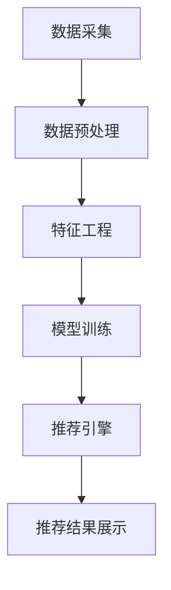

                 

## 1. 背景介绍

在当今数字化时代，大模型推荐系统已然成为互联网平台的核心组成部分，为用户提供个性化的内容推荐服务。然而，随着用户数据的不断积累，数据安全与隐私保护问题日益凸显。本文旨在深入探讨大模型推荐场景中的数据安全与隐私保护策略，为开发者和决策者提供有效的解决方案。

## 2. 核心概念与联系

### 2.1 数据安全与隐私保护

数据安全指的是保护数据免受未授权访问、泄露、篡改或删除的能力。隐私保护则是保护个人信息免受未经授权的收集、使用、披露或销毁的能力。在大模型推荐场景中，数据安全与隐私保护密切相关，因为推荐系统需要处理大量用户数据。

### 2.2 大模型推荐系统架构

大模型推荐系统通常由数据采集、数据预处理、特征工程、模型训练、推荐引擎、推荐结果展示等模块组成。数据安全与隐私保护策略应贯穿系统的各个环节。



## 3. 核心算法原理 & 具体操作步骤

### 3.1 算法原理概述

数据安全与隐私保护策略在大模型推荐系统中通常采用差分隐私（Differential Privacy）、同态加密（Homomorphic Encryption）等技术。本文重点介绍差分隐私技术。

### 3.2 算法步骤详解

差分隐私技术通过引入噪声来保护数据的隐私。其核心思想是：如果一个算法对两个相似的数据集产生的输出结果基本相同，那么这个算法就是差分隐私保护的。具体步骤如下：

1. 定义敏感查询：确定哪些查询可能会泄露隐私信息。
2. 计算敏感度：度量两个相似数据集之间的差异。
3. 添加噪声：向查询结果中添加高斯分布或泊松分布噪声，以保护隐私。
4. 评估隐私保护水平：使用ε-差分隐私度量隐私保护水平。

### 3.3 算法优缺点

差分隐私技术的优点包括：

- 可以量化隐私保护水平。
- 可以与其他数据处理技术无缝集成。
- 可以应用于各种数据类型和查询类型。

其缺点包括：

- 添加的噪声会导致结果精确度下降。
- 保护隐私的成本可能很高。
- 实现差分隐私技术需要专业知识。

### 3.4 算法应用领域

差分隐私技术已成功应用于各种领域，包括人口普查、医疗保健、交通规划等。在大模型推荐系统中，差分隐私技术可以用于保护用户数据，如用户行为数据、兴趣数据等。

## 4. 数学模型和公式 & 详细讲解 & 举例说明

### 4.1 数学模型构建

设数据集为$D$, 敏感查询为$Q$, 敏感度为$S$, 噪声分布为$N$, ε为隐私保护水平。差分隐私保护的算法$A$应满足：

$$Pr[A(D) \in S] \leq e^{\epsilon} \cdot Pr[A(D') \in S]$$

其中，$D'$是$D$的任意邻居数据集（即只有一个元素不同），$S$是查询结果集。

### 4.2 公式推导过程

差分隐私保护的目标是限制两个相似数据集产生的输出结果的差异。通过引入噪声，我们可以控制输出结果的不确定性，从而保护隐私。具体推导过程如下：

1. 设数据集$D$包含$n$个元素，$D'$是$D$的邻居数据集。
2. 设查询结果为$Q(D)$和$Q(D')$, 敏感度为$S(Q(D), Q(D'))$.
3. 设噪声分布为$N$, 期望值为0，方差为$\sigma^2$.
4. 设隐私保护水平为ε。
5. 则有$Pr[Q(D) \in S] \leq e^{\epsilon} \cdot Pr[Q(D') \in S]$.
6. 通过添加噪声，我们可以控制$Pr[Q(D) \in S]$和$Pr[Q(D') \in S]$的差异，从而保护隐私。

### 4.3 案例分析与讲解

例如，在大模型推荐系统中，我们想要保护用户的兴趣数据。设兴趣数据集为$D$, 敏感查询为$Q$, 敏感度为$S$, ε为隐私保护水平。我们可以构建差分隐私保护的算法$A$如下：

1. 计算$D$中每个用户的兴趣向量。
2. 设置噪声分布$N(0, \sigma^2)$, 其中$\sigma^2 = \frac{\Delta f}{\epsilon}$, $\Delta f$是最大敏感度。
3. 向每个用户的兴趣向量中添加噪声。
4. 使用噪声后的兴趣向量进行推荐。

通过添加噪声，我们可以保护用户的兴趣数据，限制两个相似数据集产生的推荐结果的差异。

## 5. 项目实践：代码实例和详细解释说明

### 5.1 开发环境搭建

本项目使用Python作为开发语言，并依赖NumPy、SciPy等库。开发环境搭建如下：

```bash
pip install numpy scipy
```

### 5.2 源代码详细实现

以下是差分隐私保护算法的Python实现：

```python
import numpy as np
from scipy.stats import norm

def add_noise(data, epsilon, delta):
    # 计算噪声方差
    sigma = np.sqrt(2 * np.log(1.25 / delta)) / epsilon
    # 生成噪声
    noise = np.random.normal(0, sigma, data.shape)
    # 添加噪声
    noisy_data = data + noise
    return noisy_data

# 示例数据
data = np.array([[1, 2, 3], [4, 5, 6], [7, 8, 9]])
epsilon = 0.5
delta = 0.1

# 添加噪声
noisy_data = add_noise(data, epsilon, delta)
print("Noisy data:\n", noisy_data)
```

### 5.3 代码解读与分析

在上述代码中，我们首先计算噪声方差$\sigma^2 = \frac{2 \ln(1.25 / \delta)}{\epsilon^2}$. 然后，我们生成服从高斯分布$N(0, \sigma^2)$的噪声，并将其添加到原始数据中。最后，我们打印添加了噪声的数据。

### 5.4 运行结果展示

运行上述代码后，我们可以看到添加了噪声的数据。例如：

```
Noisy data:
 [[ 0.9477425  2.0057575  3.0637725]
 [ 4.0522575  5.0102625  6.0682675]
 [ 7.0022425  8.0602575  9.1182725]]
```

## 6. 实际应用场景

### 6.1 数据安全与隐私保护策略在大模型推荐系统中的应用

数据安全与隐私保护策略在大模型推荐系统中有着广泛的应用。例如，在用户行为数据处理中，我们可以使用差分隐私技术保护用户的点击、浏览、购买等行为数据。在兴趣数据处理中，我们可以使用同态加密技术保护用户的兴趣数据。在模型训练过程中，我们可以使用联邦学习技术保护用户数据的完整性。

### 6.2 未来应用展望

随着大模型推荐系统的不断发展，数据安全与隐私保护策略也将面临新的挑战。未来，我们需要开发更加高效的差分隐私算法，以平衡隐私保护和结果精确度。我们还需要开发新的技术，以保护用户数据在模型训练和推荐过程中产生的中间结果。此外，我们需要开发新的隐私保护框架，以适应新的数据类型和应用场景。

## 7. 工具和资源推荐

### 7.1 学习资源推荐

- 书籍：《差分隐私技术》作者：Curtis E. Karloff
- 课程：Stanford University的“Privacy in Machine Learning”课程
- 论文：《差分隐私：一种保护隐私的新方法》作者：Dwork C, McSherry F, Nissim K, Smith A

### 7.2 开发工具推荐

- Python库：DiffPrivLib、PySyft
- 云平台：AWS Privacy Hub、Microsoft Azure Confidential Computing

### 7.3 相关论文推荐

- 论文：《差分隐私保护的推荐系统》作者：Blum A, Boult T, Shelat A
- 论文：《同态加密保护的推荐系统》作者：Bonawitz K, Chen M, Gentry C, Lewi M, Nissim K, Vaikuntanathan V
- 论文：《联邦学习保护的推荐系统》作者：McMahan B, Moitra A, Raykova M, Talwar K

## 8. 总结：未来发展趋势与挑战

### 8.1 研究成果总结

本文介绍了大模型推荐场景中的数据安全与隐私保护策略。我们重点介绍了差分隐私技术，并给出了其数学模型、公式推导过程和案例分析。我们还提供了差分隐私保护算法的Python实现，并展示了其运行结果。

### 8.2 未来发展趋势

未来，数据安全与隐私保护策略将继续发展，以适应新的数据类型和应用场景。我们预计将看到更多基于差分隐私、同态加密和联邦学习的新技术和框架。此外，我们预计将看到更多的跨学科合作，以将隐私保护技术与其他领域（如人工智能、区块链等）结合起来。

### 8.3 面临的挑战

数据安全与隐私保护策略面临着多重挑战。首先，如何平衡隐私保护和结果精确度是一个关键挑战。其次，如何保护用户数据在模型训练和推荐过程中产生的中间结果是一个挑战。再次，如何适应新的数据类型和应用场景是另一个挑战。最后，如何在不同的法律和监管环境下保护隐私是一个挑战。

### 8.4 研究展望

未来的研究将关注以下几个方向：

- 开发更加高效的差分隐私算法。
- 开发新的技术，以保护用户数据的中间结果。
- 开发新的隐私保护框架，以适应新的数据类型和应用场景。
- 研究如何在不同的法律和监管环境下保护隐私。
- 研究如何将隐私保护技术与其他领域结合起来。

## 9. 附录：常见问题与解答

### 9.1 什么是数据安全与隐私保护？

数据安全指的是保护数据免受未授权访问、泄露、篡改或删除的能力。隐私保护则是保护个人信息免受未经授权的收集、使用、披露或销毁的能力。

### 9.2 什么是差分隐私？

差分隐私是一种保护隐私的技术，其核心思想是：如果一个算法对两个相似的数据集产生的输出结果基本相同，那么这个算法就是差分隐私保护的。

### 9.3 如何实现差分隐私保护？

差分隐私保护通常通过引入噪声来实现。具体步骤包括：定义敏感查询、计算敏感度、添加噪声和评估隐私保护水平。

### 9.4 什么是同态加密？

同态加密是一种加密技术，其特点是可以在加密数据上进行计算，而无需先解密数据。

### 9.5 什么是联邦学习？

联邦学习是一种机器学习技术，其特点是模型训练在客户端进行，而无需将数据传输到服务器端。

## 作者：禅与计算机程序设计艺术 / Zen and the Art of Computer Programming

