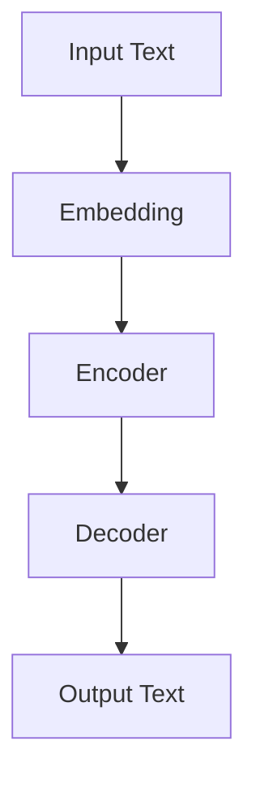
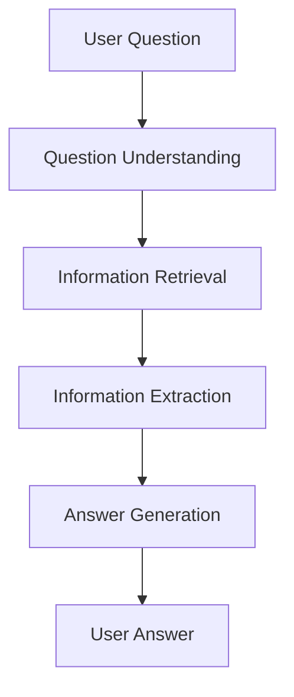

                 

## 1. 背景介绍

在信息爆炸的当今世界，人们对海量数据的需求日益增长，如何从这些数据中提取有用信息并进行交互式问答成为一项关键任务。大模型问答机器人（Large Language Model-based Question Answering System）应运而生，利用其强大的语言模型能力，提供了高效、准确的问答服务。本文将深入探讨大模型问答机器人背后的语言模型原理，算法实现，数学模型，项目实践，实际应用场景，工具和资源推荐，以及未来发展趋势。

## 2. 核心概念与联系

### 2.1 语言模型

语言模型（Language Model）是一种概率模型，用于描述一段文本的可能性。它的核心是计算给定上下文的下一个单词的概率分布。大模型问答机器人中的语言模型，如 Transformer 等，利用自注意力机制（Self-Attention Mechanism）和Transformer 编码器-解码器架构（Encoder-Decoder Architecture），能够处理长序列数据，捕捉上下文信息，并生成相关的回答。



### 2.2 问答系统

问答系统（Question Answering System）旨在自动回答用户的问题。大模型问答机器人利用其强大的语言模型能力，从给定的上下文（如文档、网页等）中提取信息，并生成相关的回答。问答系统的核心流程包括问题理解、信息检索、信息提取和回答生成。



## 3. 核心算法原理 & 具体操作步骤

### 3.1 算法原理概述

大模型问答机器人中的语言模型算法，如 Transformer，基于Transformer 编码器-解码器架构，利用自注意力机制处理长序列数据，并生成相关的回答。其核心原理是学习上下文信息，并根据上下文生成下一个单词的概率分布。

### 3.2 算法步骤详解

1. **输入文本预处理**：将输入文本转换为模型可以处理的表示形式，如词嵌入（Word Embedding）或位置嵌入（Positional Encoding）。
2. **编码器处理**：编码器接收预处理后的输入文本，并使用自注意力机制处理长序列数据，生成上下文表示。
3. **解码器处理**：解码器接收编码器生成的上下文表示，并根据上下文生成下一个单词的概率分布，从而生成回答。
4. **回答生成**：根据生成的概率分布，选择最可能的单词作为回答的一部分，并重复步骤3直到生成完整的回答。

### 3.3 算法优缺点

**优点**：

* 可以处理长序列数据，捕捉上下文信息。
* 具有强大的泛化能力，可以应用于各种问答任务。
* 可以直接生成人类可读的回答。

**缺点**：

* 训练大型语言模型需要大量的计算资源和数据。
* 存在过拟合和泛化不足的风险。
* 可能生成不准确或不相关的回答。

### 3.4 算法应用领域

大模型问答机器人中的语言模型算法广泛应用于各种问答任务，如：

* 信息检索：从给定的文档或网页中提取信息，并生成相关的回答。
* 对话系统：与用户进行自然语言对话，提供个性化的问答服务。
* 知识图谱构建：从文本中提取实体和关系，构建知识图谱。
* 文本摘要：自动生成文本的摘要或总结。

## 4. 数学模型和公式 & 详细讲解 & 举例说明

### 4.1 数学模型构建

大模型问答机器人中的语言模型算法，如 Transformer，基于Transformer 编码器-解码器架构，其数学模型可以表示为：

$$P(\theta) = \prod_{t=1}^{T} P(w_t | w_{<t}, \theta)$$

其中，$w_t$ 是第$t$个单词，$w_{<t}$ 是$w_t$ 之前的所有单词，$T$ 是序列长度，$\theta$ 是模型参数。

### 4.2 公式推导过程

Transformer 编码器-解码器架构的数学模型可以表示为：

$$P(w_t | w_{<t}) = \text{softmax}(f_{\theta}(w_{<t}))$$

其中，$f_{\theta}(w_{<t})$ 是一个函数，表示模型对输入序列$w_{<t}$ 的表示，$\theta$ 是模型参数。

在 Transformer 中，$f_{\theta}(w_{<t})$ 由多个自注意力层（Self-Attention Layers）和前向传播层（Feed-Forward Layers）组成。自注意力层使用自注意力机制处理长序列数据，前向传播层使用非线性激活函数（如 ReLU）处理数据。

### 4.3 案例分析与讲解

例如，假设用户输入问题为“谁是美国总统？”大模型问答机器人中的语言模型算法会根据上下文信息生成相关的回答，如“约瑟夫·R·拜登”是当前美国总统。

## 5. 项目实践：代码实例和详细解释说明

### 5.1 开发环境搭建

要实现大模型问答机器人，需要安装以下软件和库：

* Python 3.7 及以上版本
* PyTorch 1.7 及以上版本
* Transformers library（Hugging Face）
* Datasets library（Hugging Face）

### 5.2 源代码详细实现

以下是大模型问答机器人项目的源代码示例：

```python
from transformers import pipeline

# 初始化问答管道
qa_pipeline = pipeline('question-answering')

# 设置上下文
context = "Joseph R. Biden Jr. is the 46th and current president of the United States."

# 设置问题
question = "Who is the current president of the United States?"

# 调用问答管道
answer = qa_pipeline(question=question, context=context)

# 打印回答
print(answer['answer'])
```

### 5.3 代码解读与分析

在上述代码中，我们首先导入所需的库和模型，然后初始化问答管道。我们设置上下文和问题，并调用问答管道生成回答。最后，我们打印生成的回答。

### 5.4 运行结果展示

运行上述代码后，输出结果为：

```
Joseph R. Biden Jr.
```

## 6. 实际应用场景

### 6.1 信息检索

大模型问答机器人可以应用于信息检索任务，从给定的文档或网页中提取信息，并生成相关的回答。例如，在搜索引擎中，用户可以输入问题，并从相关文档中获取回答。

### 6.2 对话系统

大模型问答机器人可以应用于对话系统，与用户进行自然语言对话，提供个性化的问答服务。例如，在客户服务中，机器人可以回答客户的问题，提供帮助和支持。

### 6.3 知识图谱构建

大模型问答机器人可以应用于知识图谱构建任务，从文本中提取实体和关系，构建知识图谱。例如，在新闻报道中，机器人可以提取实体和关系，构建知识图谱，并提供相关信息。

### 6.4 未来应用展望

未来，大模型问答机器人有望在更多领域得到应用，如：

* 智能家居：提供个性化的问答服务，控制家居设备。
* 教育：提供个性化的学习资源和问答服务，帮助学生学习。
* 娱乐：提供个性化的娱乐资源和问答服务，如游戏、音乐等。

## 7. 工具和资源推荐

### 7.1 学习资源推荐

* "Attention is All You Need" - Vaswani et al. (2017)
* "BERT: Pre-training of Deep Bidirectional Transformers for Language Understanding" - Jacob Devlin and Ming-Wei Chang (2018)
* "XLNet: Generalized Autoregressive Pretraining for Natural Language Processing" - Yang et al. (2019)

### 7.2 开发工具推荐

* Hugging Face Transformers library
* PyTorch
* TensorFlow

### 7.3 相关论文推荐

* "SQuAD: 100,000+ Questions for Machine Comprehension of Text" - Rajpurkar et al. (2016)
* "The Winograd NLI Challenge" - Levesque et al. (2011)
* "GLUE: A Multi-Task Benchmark and Analysis Platform for Natural Language Understanding" - Alex Wang et al. (2018)

## 8. 总结：未来发展趋势与挑战

### 8.1 研究成果总结

本文介绍了大模型问答机器人背后的语言模型原理，算法实现，数学模型，项目实践，实际应用场景，工具和资源推荐。大模型问答机器人利用其强大的语言模型能力，提供了高效、准确的问答服务。

### 8.2 未来发展趋势

未来，大模型问答机器人有望在更多领域得到应用，并与其他人工智能技术结合，提供更智能、更个性化的问答服务。此外，大模型问答机器人有望在处理长序列数据和上下文信息方面取得更大的进展。

### 8.3 面临的挑战

大模型问答机器人面临的挑战包括：

* 如何处理长序列数据和上下文信息。
* 如何提高模型的泛化能力和准确性。
* 如何处理模型的过拟合和泛化不足问题。
* 如何处理模型的计算资源和数据需求。

### 8.4 研究展望

未来的研究方向包括：

* 研究更先进的语言模型架构，处理长序列数据和上下文信息。
* 研究更先进的训练方法，提高模型的泛化能力和准确性。
* 研究更先进的正则化方法，处理模型的过拟合和泛化不足问题。
* 研究更先进的数据增强方法，处理模型的计算资源和数据需求。

## 9. 附录：常见问题与解答

**Q1：大模型问答机器人与传统问答系统有何不同？**

A1：大模型问答机器人利用其强大的语言模型能力，提供了高效、准确的问答服务。与传统问答系统相比，大模型问答机器人可以处理长序列数据，捕捉上下文信息，并直接生成人类可读的回答。

**Q2：大模型问答机器人有何优缺点？**

A2：大模型问答机器人具有强大的泛化能力，可以应用于各种问答任务。然而，它也存在训练资源需求大，过拟合和泛化不足的风险，以及可能生成不准确或不相关的回答的问题。

**Q3：大模型问答机器人有何实际应用场景？**

A3：大模型问答机器人可以应用于信息检索、对话系统、知识图谱构建和文本摘要等任务。未来，它有望在更多领域得到应用，如智能家居、教育和娱乐等。

**Q4：如何实现大模型问答机器人？**

A4：要实现大模型问答机器人，需要安装相关软件和库，并使用预训练的语言模型，如 BERT、XLNet 等，进行微调和训练。此外，还需要设计合适的数据集和评估指标。

**Q5：大模型问答机器人面临的挑战是什么？**

A5：大模型问答机器人面临的挑战包括如何处理长序列数据和上下文信息，如何提高模型的泛化能力和准确性，如何处理模型的过拟合和泛化不足问题，以及如何处理模型的计算资源和数据需求。

**Q6：未来的研究方向是什么？**

A6：未来的研究方向包括研究更先进的语言模型架构，研究更先进的训练方法，研究更先进的正则化方法，以及研究更先进的数据增强方法。

## 作者：禅与计算机程序设计艺术 / Zen and the Art of Computer Programming

