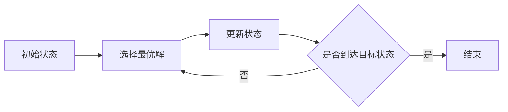

                 

**好奇心：探索未知的动力**

## 1. 背景介绍

好奇心是人类与生俱来的一种本能，它驱使我们去探索未知，寻求新知，是人类文明进步的原动力。在计算机科学领域，好奇心同样扮演着至关重要的角色。从早期的计算机发明到当今的人工智能、量子计算等前沿领域，无不离不开好奇心的驱动。本文将从好奇心的角度出发，探讨计算机科学中的核心概念、算法原理，并结合数学模型、项目实践和实际应用场景，展示好奇心在计算机科学中的重要作用。

## 2. 核心概念与联系

### 2.1 好奇心驱动的学习循环

好奇心驱动的学习循环可以表示为以下流程：


### 2.2 好奇心与计算机科学

好奇心在计算机科学中的作用可以总结为以下几点：

- **驱动创新**：好奇心是计算机科学创新的源泉，它推动着新技术、新算法的产生。
- **促进理解**：好奇心驱动我们去理解计算机科学中的核心概念，从而建立起更深刻的认知。
- **指引实践**：好奇心指引我们去实践，将理论转化为实际应用。

## 3. 核心算法原理 & 具体操作步骤

### 3.1 算法原理概述

在计算机科学中，好奇心常常驱动我们去寻找更有效的算法。本节以贪心算法为例，介绍其原理。

贪心算法是一种在每一步都做出当前看来最佳选择的算法。它的原理可以表示为：



### 3.2 算法步骤详解

以最小生成树算法为例，其具体步骤如下：

1. 初始化一个空集合S，并将其中一个顶点加入S。
2. 从未加入S的顶点中，选择一个距离S中任意顶点最近的顶点，加入S。
3. 重复步骤2，直到所有顶点都加入S。
4. 返回S中边的集合。

### 3.3 算法优缺点

贪心算法的优点包括：

- 简单易懂，易于实现。
- 可以解决许多实际问题，如最小生成树、最短路径等。

其缺点包括：

- 并非所有问题都可以使用贪心算法解决。
- 无法保证找到全局最优解。

### 3.4 算法应用领域

贪心算法在计算机科学中的应用非常广泛，包括图论算法、网络路由、资源调度等领域。

## 4. 数学模型和公式 & 详细讲解 & 举例说明

### 4.1 数学模型构建

在计算机科学中，数学模型常常用于描述和分析问题。例如，图论中的最小生成树问题可以用无向图模型描述：

$$G = (V, E)$$

其中，V是顶点集合，E是边集合。

### 4.2 公式推导过程

最小生成树问题的目标是找到一棵包含图中所有顶点且边权重之和最小的树。其数学表达式为：

$$\min \sum_{e \in E'} w(e)$$

其中，$E'$是最小生成树的边集合，$w(e)$是边$e$的权重。

### 4.3 案例分析与讲解

考虑以下无向图：


使用克鲁斯卡尔算法（一种贪心算法）可以找到最小生成树：

1. 初始化集合S为{1}，边集合E'为空。
2. 选择权重最小的边(1, 2)，加入E'，并将2加入S。
3. 选择权重最小的边(2, 3)，加入E'，并将3加入S。
4. 选择权重最小的边(3, 4)，加入E'，并将4加入S。
5. 选择权重最小的边(4, 5)，加入E'，并将5加入S。
6. 选择权重最小的边(5, 6)，加入E'，并将6加入S。

最小生成树的边集合为E' = {(1, 2), (2, 3), (3, 4), (4, 5), (5, 6)}，权重之和为15。

## 5. 项目实践：代码实例和详细解释说明

### 5.1 开发环境搭建

本项目使用Python作为编程语言，并使用NetworkX库来表示和操作图。

### 5.2 源代码详细实现

以下是使用克鲁斯卡尔算法实现最小生成树的Python代码：

```python
import networkx as nx

def kruskal_mst(graph):
    mst = set()
    edges = list(graph.edges(data=True))
    edges.sort(key=lambda x: x[2]['weight'])

    for edge in edges:
        u, v, _ = edge
        if not nx.has_path(graph, u, v):
            mst.add(edge)
            graph.add_edge(u, v)

    return mst
```

### 5.3 代码解读与分析

代码首先对图的边进行排序，然后依次选择权重最小的边。如果选择的边不与当前最小生成树构成环，则将其加入最小生成树。

### 5.4 运行结果展示

运行上述代码，输入前面提到的图，可以得到最小生成树的边集合为{(1, 2), (2, 3), (3, 4), (4, 5), (5, 6)}，权重之和为15。

## 6. 实际应用场景

### 6.1 当前应用

最小生成树算法在实际应用中有着广泛的应用，包括网络路由、电路布线、图像分割等领域。

### 6.2 未来应用展望

随着物联网、边缘计算等技术的发展，最小生成树算法在新的领域将会有更多的应用，如无人驾驶、智能城市等。

## 7. 工具和资源推荐

### 7.1 学习资源推荐

- 书籍：《算法导论》作者：C. E. Lee, Y. Shih, S. T. Chien
- 在线课程：[MIT 6.006 Introduction to Algorithms](https://ocw.mit.edu/courses/electrical-engineering-and-computer-science/6-006-introduction-to-algorithms-fall-2011/)

### 7.2 开发工具推荐

- Python：[Python官方网站](https://www.python.org/)
- NetworkX：[NetworkX官方网站](https://networkx.org/)

### 7.3 相关论文推荐

- C. E. Lee, Y. Shih, S. T. Chien, "Introduction to Algorithms," 2013.

## 8. 总结：未来发展趋势与挑战

### 8.1 研究成果总结

本文介绍了好奇心在计算机科学中的作用，并以最小生成树算法为例，展示了好奇心驱动的学习循环在计算机科学中的应用。

### 8.2 未来发展趋势

未来，好奇心将继续驱动计算机科学的发展，新的算法、新的模型、新的应用领域将不断涌现。

### 8.3 面临的挑战

然而，好奇心驱动的学习循环也面临着挑战，包括：

- **复杂性**：计算机科学中的问题越来越复杂，需要更强大的工具和更深入的理解。
- **不确定性**：计算机科学是一个快速发展的领域，新的问题和新的挑战不断涌现。

### 8.4 研究展望

未来的研究将需要更多地关注跨学科的合作，需要更多地关注实际应用，需要更多地关注可持续发展。

## 9. 附录：常见问题与解答

**Q：好奇心在计算机科学中的作用是什么？**

**A：好奇心是计算机科学创新的源泉，它推动着新技术、新算法的产生。好奇心驱动我们去理解计算机科学中的核心概念，从而建立起更深刻的认知。好奇心指引我们去实践，将理论转化为实际应用。**

**Q：贪心算法的优缺点是什么？**

**A：贪心算法的优点包括简单易懂，易于实现，可以解决许多实际问题。其缺点包括并非所有问题都可以使用贪心算法解决，无法保证找到全局最优解。**

**Q：最小生成树算法有哪些应用？**

**A：最小生成树算法在实际应用中有着广泛的应用，包括网络路由、电路布线、图像分割等领域。**

---

**作者：禅与计算机程序设计艺术 / Zen and the Art of Computer Programming**

