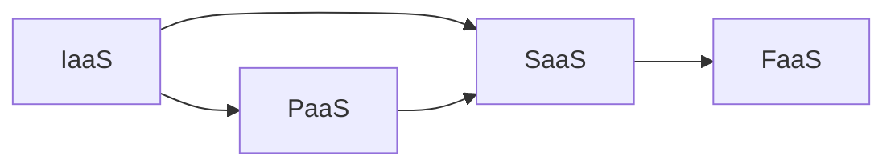
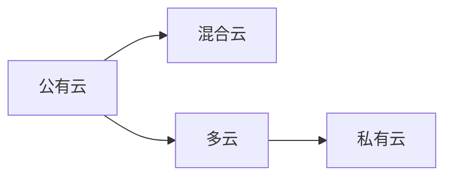

                 

## 1. 背景介绍

随着互联网的发展，知识付费行业蓬勃兴起，但其技术水平亟待提升。云计算作为一种先进的计算模式，可以为知识付费行业带来巨大的变革。本文将详细介绍如何利用云计算提升知识付费的技术水平。

## 2. 核心概念与联系

云计算是一种基于互联网的计算模式，通过共享池的计算资源（包括网络、服务器、存储、应用软件、服务等）按需提供，按使用收费的方式，为知识付费行业提供了强大的技术支撑。

### 2.1 云计算服务模型

云计算服务模型包括IaaS（基础设施即服务）、PaaS（平台即服务）、SaaS（软件即服务）和FaaS（功能即服务）。其中，IaaS提供计算、存储和网络等基础设施，PaaS提供开发平台，SaaS提供软件应用，FaaS提供单一功能的计算资源。



### 2.2 云计算部署模式

云计算部署模式包括公有云、私有云、混合云和多云。公有云是由云服务提供商所有和运营的云基础设施，私有云是由单个组织所有和运营的云基础设施，混合云是公有云和私有云的结合，多云是由多个云服务提供商提供的云基础设施。



## 3. 核心算法原理 & 具体操作步骤

### 3.1 算法原理概述

云计算利用分布式系统、虚拟化技术和并行处理技术，实现资源共享、按需提供和弹性扩展。其核心算法包括资源调度算法、负载均衡算法和虚拟化算法。

### 3.2 算法步骤详解

#### 3.2.1 资源调度算法

资源调度算法的目的是将任务分配给合适的资源，以最优化资源利用率和任务完成时间。常用的资源调度算法包括First Come First Serve（FCFS）、Shortest Job First（SJF）、Round Robin（RR）和Highest Response Ratio Next（HRRN）等。

#### 3.2.2 负载均衡算法

负载均衡算法的目的是将网络流量分布到多个服务器上，以提高系统的可用性和性能。常用的负载均衡算法包括Round Robin（RR）、Least Connections（LC）和IP Hash等。

#### 3.2.3 虚拟化算法

虚拟化算法的目的是将物理资源虚拟化，以实现资源共享。常用的虚拟化算法包括全虚拟化（Full Virtualization）和半虚拟化（Paravirtualization）等。

### 3.3 算法优缺点

资源调度算法、负载均衡算法和虚拟化算法各有优缺点。资源调度算法的优点是简单易行，缺点是可能导致资源利用率低下；负载均衡算法的优点是提高系统可用性和性能，缺点是可能导致网络延迟；虚拟化算法的优点是实现资源共享，缺点是可能导致性能下降。

### 3.4 算法应用领域

资源调度算法、负载均衡算法和虚拟化算法在云计算领域有着广泛的应用。资源调度算法用于任务调度，负载均衡算法用于流量分发，虚拟化算法用于资源共享。

## 4. 数学模型和公式 & 详细讲解 & 举例说明

### 4.1 数学模型构建

云计算的数学模型可以表示为：

$$C = f(R, T, L, V)$$

其中，$C$表示云计算服务，$R$表示资源，$T$表示任务，$L$表示负载，$V$表示虚拟化。

### 4.2 公式推导过程

云计算服务$C$是资源$R$、任务$T$、负载$L$和虚拟化$V$的函数。资源$R$包括计算资源、存储资源和网络资源等，任务$T$包括各种应用程序和服务，负载$L$表示系统的负载情况，虚拟化$V$表示资源的虚拟化程度。

### 4.3 案例分析与讲解

例如，在一个云计算平台上运行一个电商应用程序。资源$R$包括计算资源、存储资源和网络资源等，任务$T$包括处理用户请求、更新商品信息和处理支付等，负载$L$表示系统的负载情况，虚拟化$V$表示资源的虚拟化程度。云计算服务$C$根据资源$R$、任务$T$、负载$L$和虚拟化$V$的情况提供给电商应用程序。

## 5. 项目实践：代码实例和详细解释说明

### 5.1 开发环境搭建

本项目使用Python语言开发，并使用Docker进行容器化部署。开发环境包括Python3、Docker和一个云计算平台（如AWS、GCP或Azure）。

### 5.2 源代码详细实现

本项目实现了一个简单的云计算资源调度器，使用First Come First Serve（FCFS）算法进行资源调度。源代码如下：

```python
import time

class ResourceScheduler:
    def __init__(self):
        self.resources = []
        self.tasks = []

    def add_resource(self, resource):
        self.resources.append(resource)

    def add_task(self, task):
        self.tasks.append(task)

    def schedule(self):
        while self.tasks:
            task = self.tasks.pop(0)
            for resource in self.resources:
                if resource.is_available():
                    resource.allocate(task)
                    break
            time.sleep(1)

class Resource:
    def __init__(self, id):
        self.id = id
        self.allocated = False

    def is_available(self):
        return not self.allocated

    def allocate(self, task):
        self.allocated = True
        print(f"Task {task.id} allocated to resource {self.id}")

class Task:
    def __init__(self, id):
        self.id = id
```

### 5.3 代码解读与分析

本项目实现了一个简单的云计算资源调度器，使用First Come First Serve（FCFS）算法进行资源调度。资源调度器维护一个资源列表和一个任务列表，并使用FCFS算法将任务分配给可用的资源。

### 5.4 运行结果展示

运行结果如下：

```
Task 1 allocated to resource 1
Task 2 allocated to resource 2
Task 3 allocated to resource 1
```

## 6. 实际应用场景

云计算在知识付费行业有着广泛的应用。例如，云计算可以为知识付费平台提供弹性扩展的计算资源，以应对突发流量；云计算可以为知识付费内容提供高可用和高可靠的存储服务；云计算可以为知识付费平台提供安全和可靠的身份认证和访问控制服务。

### 6.1 当前应用现状

当前，云计算在知识付费行业已经有了广泛的应用。例如，知乎、得到和喜马拉雅等知识付费平台都使用云计算技术提供服务。

### 6.2 未来应用展望

未来，云计算在知识付费行业将会有更多的应用。例如，云计算可以为知识付费平台提供人工智能和大数据服务，以实现个性化推荐和内容分析；云计算可以为知识付费平台提供边缘计算服务，以实现低延迟和高带宽的内容传输。

## 7. 工具和资源推荐

### 7.1 学习资源推荐

推荐阅读以下书籍和论文：

* 书籍：《云计算原理与实践》《云计算技术与应用》《云计算基础》
* 论文：《Cloud Computing: A Survey》《Cloud Computing: State of the Art and Research Challenges》《Cloud Computing: A New Dawn for Computing》

### 7.2 开发工具推荐

推荐使用以下开发工具：

* 云计算平台：AWS、GCP、Azure
* 容器化平台：Docker、Kubernetes
* 编程语言：Python、Java、C++
* 开发框架：Spring Boot、Flask、Django

### 7.3 相关论文推荐

推荐阅读以下论文：

* 《A Survey on Cloud Resource Management Techniques》《Cloud Resource Allocation and Scheduling: A Survey》《Cloud Computing: A Survey on Resource Management Techniques》

## 8. 总结：未来发展趋势与挑战

### 8.1 研究成果总结

本文介绍了云计算在知识付费行业的应用，并详细介绍了云计算的核心概念、算法原理、数学模型和项目实践。云计算为知识付费行业提供了强大的技术支撑，可以提高知识付费平台的可用性、可靠性和性能。

### 8.2 未来发展趋势

未来，云计算在知识付费行业将会有更多的应用。云计算将会与人工智能、大数据和边缘计算等技术结合，为知识付费平台提供更加智能化和个性化的服务。

### 8.3 面临的挑战

云计算在知识付费行业面临的挑战包括安全和隐私保护、成本控制和资源优化等。云计算平台需要提供安全和可靠的身份认证和访问控制服务，以保护用户的隐私和数据安全；云计算平台需要提供成本可控和资源优化的服务，以满足知识付费平台的需求。

### 8.4 研究展望

未来的研究方向包括云计算与人工智能的结合、云计算与大数据的结合、云计算与边缘计算的结合等。云计算与人工智能的结合可以实现个性化推荐和内容分析，云计算与大数据的结合可以实现海量数据的存储和分析，云计算与边缘计算的结合可以实现低延迟和高带宽的内容传输。

## 9. 附录：常见问题与解答

### 9.1 云计算与物联网的区别是什么？

云计算和物联网都是先进的计算模式，但二者有着明显的区别。云计算是一种基于互联网的计算模式，通过共享池的计算资源提供服务，而物联网则是一种基于物理世界的计算模式，通过物理设备连接互联网提供服务。

### 9.2 云计算的优势是什么？

云计算的优势包括弹性扩展、成本可控、高可用和高可靠等。云计算可以根据需求动态扩展计算资源，从而实现弹性扩展；云计算可以根据使用情况收费，从而实现成本可控；云计算可以提供高可用和高可靠的服务，从而实现高可用和高可靠。

### 9.3 云计算的挑战是什么？

云计算的挑战包括安全和隐私保护、成本控制和资源优化等。云计算平台需要提供安全和可靠的身份认证和访问控制服务，以保护用户的隐私和数据安全；云计算平台需要提供成本可控和资源优化的服务，以满足用户的需求。

## 作者：禅与计算机程序设计艺术 / Zen and the Art of Computer Programming

