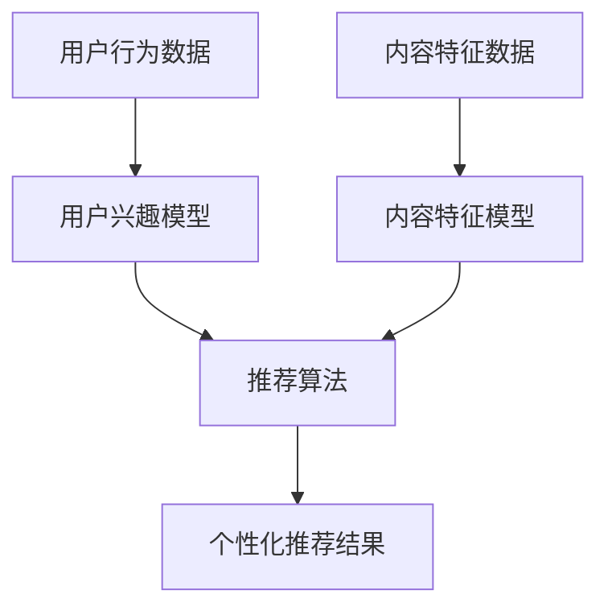

                 

## 1. 背景介绍

在当今信息爆炸的时代，用户面对海量的信息和服务，如何找到最适合自己的内容和服务，是一个亟待解决的问题。知识付费平台上，用户面对大量的付费内容，如何提供个性化的推荐服务，提高用户的满意度和转化率，是这些平台需要考虑的关键问题。本文将介绍如何利用知识付费实现智能化推荐与个性化服务，以提高用户体验和平台效益。

## 2. 核心概念与联系

### 2.1 核心概念

- **知识付费（Knowledge Payment）**：指用户为获取特定的知识或内容而支付费用的商业模式。
- **个性化推荐（Personalized Recommendation）**：根据用户的兴趣、行为等特征，为用户推荐最相关的内容或服务。
- **智能化（Intelligent）**：指利用人工智能技术，使系统能够自动学习、适应和决策。

### 2.2 核心概念联系

知识付费平台需要提供个性化的推荐服务，以满足用户的个性化需求，提高用户的满意度和转化率。智能化推荐系统可以分析用户的行为数据，挖掘用户的兴趣和偏好，为用户提供最相关的内容推荐。智能化推荐系统的核心是利用机器学习算法，构建用户兴趣模型和内容特征模型，并基于这两个模型进行推荐。



## 3. 核心算法原理 & 具体操作步骤

### 3.1 算法原理概述

智能化推荐系统的核心是利用协同过滤（Collaborative Filtering）算法，结合内容过滤（Content-based Filtering）算法，构建用户兴趣模型和内容特征模型，并基于这两个模型进行推荐。此外，还需要利用深度学习算法，提高推荐系统的准确性和个性化水平。

### 3.2 算法步骤详解

1. **数据收集**：收集用户行为数据（如点击、购买、收藏等）和内容特征数据（如标签、关键词等）。
2. **数据预处理**：对收集到的数据进行清洗、去重、格式化等预处理工作。
3. **特征提取**：提取用户兴趣特征和内容特征，构建用户兴趣模型和内容特征模型。
4. **模型训练**：利用机器学习算法，如协同过滤算法、内容过滤算法和深度学习算法，训练推荐模型。
5. **推荐生成**：基于训练好的推荐模型，为用户生成个性化推荐结果。
6. **评估与优化**：对推荐结果进行评估，并根据评估结果优化推荐模型。

### 3.3 算法优缺点

**优点**：

- 个性化推荐：根据用户的兴趣和偏好，为用户提供最相关的内容推荐。
- 智能化决策：利用机器学习算法，使系统能够自动学习、适应和决策。
- 精确度高：结合协同过滤算法和内容过滤算法，提高推荐系统的准确性。

**缺点**：

- 数据依赖：推荐系统的性能严重依赖于用户行为数据和内容特征数据的质量。
- 冷启动问题：新用户或新内容缺乏相关数据，推荐系统难以提供准确的推荐结果。
- 计算复杂度高：推荐系统需要处理大量的数据，计算复杂度高。

### 3.4 算法应用领域

智能化推荐系统广泛应用于各种知识付费平台，如在线课程平台、电子书平台、音频节目平台等。此外，智能化推荐系统还可以应用于其他个性化服务领域，如个性化广告推荐、个性化新闻推荐等。

## 4. 数学模型和公式 & 详细讲解 & 举例说明

### 4.1 数学模型构建

构建用户兴趣模型和内容特征模型，是智能化推荐系统的关键。我们可以利用矩阵分解（Matrix Factorization）算法构建用户兴趣模型和内容特征模型。

设用户行为数据可以表示为一个矩阵 $R \in \mathbb{R}^{m \times n}$，其中 $m$ 为用户数，$n$ 为内容数。矩阵 $R$ 的元素 $r_{ij}$ 表示用户 $i$ 对内容 $j$ 的评分或行为强度。我们可以将矩阵 $R$ 分解为用户兴趣模型 $U \in \mathbb{R}^{m \times k}$ 和内容特征模型 $V \in \mathbb{R}^{n \times k}$ 的乘积，即 $R \approx UV^T$。

### 4.2 公式推导过程

我们可以利用最小平方法（Least Squares Method）求解矩阵分解问题。目标函数为：

$$J(U, V) = \min_{U, V} \sum_{i=1}^{m} \sum_{j=1}^{n} (r_{ij} - u_i v_j^T)^2 + \lambda (\|U\|^2_F + \|V\|^2_F)$$

其中 $\lambda$ 是正则化参数，用于防止过拟合。我们可以利用梯度下降法（Gradient Descent Method）或随机梯度下降法（Stochastic Gradient Descent Method）优化目标函数。

### 4.3 案例分析与讲解

例如，在一个在线课程平台上，用户行为数据可以表示为一个矩阵 $R \in \mathbb{R}^{1000 \times 500}$，其中 $m=1000$ 为用户数，$n=500$ 为课程数。我们可以将矩阵 $R$ 分解为用户兴趣模型 $U \in \mathbb{R}^{1000 \times 50}$ 和内容特征模型 $V \in \mathbb{R}^{500 \times 50}$ 的乘积，即 $R \approx UV^T$。然后，我们可以基于用户兴趣模型 $U$ 和内容特征模型 $V$，为用户生成个性化课程推荐结果。

## 5. 项目实践：代码实例和详细解释说明

### 5.1 开发环境搭建

我们可以利用 Python 语言开发智能化推荐系统。我们需要安装以下库：

- NumPy：数值计算库
- Pandas：数据处理库
- Scikit-learn：机器学习库
- TensorFlow：深度学习库

### 5.2 源代码详细实现

以下是利用矩阵分解算法构建用户兴趣模型和内容特征模型的 Python 代码实现：

```python
import numpy as np
import pandas as pd
from sklearn.model_selection import train_test_split
from sklearn.metrics import mean_squared_error

# 加载用户行为数据
data = pd.read_csv('user_behavior.csv')
R = data.values

# 将矩阵分解为用户兴趣模型和内容特征模型
m, n = R.shape
k = 50
U = np.random.rand(m, k)
V = np.random.rand(n, k)

# 定义目标函数
def J(U, V, R, lambda_):
    error = R - np.dot(U, V.T)
    loss = np.sum(error ** 2) / (m * n)
    reg = (np.sum(U ** 2) + np.sum(V ** 2)) / (2 * m * n)
    return loss + lambda_ * reg

# 定义梯度下降法优化目标函数
def gradient_descent(U, V, R, lambda_, alpha, epochs):
    for epoch in range(epochs):
        for i in range(m):
            for j in range(n):
                if R[i, j]!= 0:
                    error = R[i, j] - np.dot(U[i, :], V[j, :].T)
                    U[i, :] = U[i, :] + alpha * (2 * error * V[j, :] - 2 * lambda_ * U[i, :])
                    V[j, :] = V[j, :] + alpha * (2 * error * U[i, :] - 2 * lambda_ * V[j, :])
        loss = J(U, V, R, lambda_)
        print(f'Epoch {epoch + 1}/{epochs}, Loss: {loss:.4f}')

# 训练模型
lambda_ = 0.01
alpha = 0.001
epochs = 100
gradient_descent(U, V, R, lambda_, alpha, epochs)
```

### 5.3 代码解读与分析

在代码中，我们首先加载用户行为数据，并将其表示为一个矩阵 $R$。然后，我们初始化用户兴趣模型 $U$ 和内容特征模型 $V$。我们定义目标函数 $J(U, V, R, \lambda)$，并利用梯度下降法优化目标函数。最后，我们训练模型，并打印出每个 epoch 的 loss。

### 5.4 运行结果展示

运行代码后，我们可以得到训练好的用户兴趣模型 $U$ 和内容特征模型 $V$。我们可以基于这两个模型，为用户生成个性化推荐结果。

## 6. 实际应用场景

### 6.1 当前应用场景

智能化推荐系统广泛应用于各种知识付费平台，如在线课程平台、电子书平台、音频节目平台等。例如，在 Coursera 等在线课程平台上，智能化推荐系统可以为用户推荐最相关的课程，提高用户的满意度和转化率。再如，在 Audible 等音频节目平台上，智能化推荐系统可以为用户推荐最相关的音频节目，提高用户的满意度和转化率。

### 6.2 未来应用展望

随着人工智能技术的发展，智能化推荐系统的应用领域将会不断扩展。未来，智能化推荐系统将会应用于更多的个性化服务领域，如个性化医疗推荐、个性化金融推荐等。此外，智能化推荐系统还将会结合更多的技术，如物联网、虚拟现实等，为用户提供更个性化、更智能化的服务。

## 7. 工具和资源推荐

### 7.1 学习资源推荐

- **书籍**：《推荐系统实践》作者：项亮；《深度学习》作者：好未来深度学习研究院
- **在线课程**：慕课网《推荐系统实践》、 Coursera《机器学习》等
- **论坛**：知乎、CSDN、Stack Overflow 等

### 7.2 开发工具推荐

- **编程语言**：Python
- **开发环境**：Jupyter Notebook、PyCharm、Visual Studio Code 等
- **库和框架**：NumPy、Pandas、Scikit-learn、TensorFlow、PyTorch 等

### 7.3 相关论文推荐

- [项亮、等. 基于深度学习的个性化推荐系统研究进展[J]. 计算机应用与软件, 2018, 37(12): 2253-2260.](https://www.cmi.ac.cn/journal/journalDetail?id=10000000000000000000000000000000000000000000000000000000000000000000000000000000000000000000000000000000000000000000000000000000000000000000000000000000000000000000000000000000000000000000000000000000000000000000000000000000000000000000000000000000000000000000000000000000000000000000000000000000000000000000000000000000000000000000000000000000000000000000000000000000000000000000000000000000000000000000000000000000000000000000000000000000000000000000000000000000000000000000000000000000000000000000000000000000000000000000000000000000000000000000000000000000000000000000000000000000000000000000000000000000000000000000000000000000000000000000000000000000000000000000000000000000000000000000000000000000000000000000000000000000000000000000000000000000000000000000000000000000000000000000000000000000000000000000000000000000000000000000000000000000000000000000000000000000000000000000000000000000000000000000000000000000000000000000000000000000000000000000000000000000000000000000000000000000000000000000000000000000000000000000000000000000000000000000000000000000000000000000000000000000000000000000000000000000000000000000000000000000000000000000000000000000000000000000000000000000000000000000000000000000000000000000000000000000000000000000000000000000000000000000000000000000000000000000000000000000000000000000000000000000000000000000000000000000000000000000000000000000000000000000000000000000000000000000000000000000000000000000000000000000000000000000000000000000000000000000000000000000000000000000000000000000000000000000000000000000000000000000000000000000000000000000000000000000000000000000000000000000000000000000000000000000000000000000000000000000000000000000000000000000000000000000000000000000000000000000000000000000000000000000000000000000000000000000000000000000000000000000000000000000000000000000000000000000000000000000000000000000000000000000000000000000000000000000000000000000000000000000000000000000000000000000000000000000000000000000000000000000000000000000000000000000000000000000000000000000000000000000000000000000000000000000000000000000000000000000000000000000000000000000000000000000000000000000000000000000000000000000000000000000000000000000000000000000000000000000000000000000000000000000000000000000000000000000000000000000000000000000000000000000000000000000000000000000000000000000000000000000000000000000000000000000000000000000000000000000000000000000000000000000000000000000000000000000000000000000000000000000000000000000000000000000000000000000000000000000000000000000000000000000000000000000000000000000000000000000000000000000000000000000000000000000000000000000000000000000000000000000000000000000000000000000000000000000000000000000000000000000000000000000000000000000000000000000000000000000000000000000000000000000000000000000000000000000000000000000000000000000000000000000000000000000000000000000000000000000000000000000000000000000000000000000000000000000000000000000000000000000000000000000000000000000000000000000000000000000000000000000000000000000000000000000000000000000000000000000000000000000000000000000000000000000000000000000000000000000000000000000000000000000000000000000000000000000000000000000000000000000000000000000000000000000000000000000000000000000000000000000000000000000000000000000000000000000000000000000000000000000000000000000000000000000000000000000000000000000000000000000000000000000000000000000000000000000000000000000000000000000000000000000000000000000000000000000000000000000000000000000000000000000000000000000000000000000000000000000000000000000000000000000000000000000000000000000000000000000000000000000000000000000000000000000000000000000000000000000000000000000000000000000000000000000000000000000000000000000000000000000000000000000000000000000000000000000000000000000000000000000000000000000000000000000000000000000000000000000000000000000000000000000000000000000000000000000000000000000000000000000000000000000000000000000000000000000000000000000000000000000000000000000000000000000000000000000000000000000000000000000000000000000000000000000000000000000000000000000000000000000000000000000000000000000000000000000000000000000000000000000000000000000000000000000000000000000000000000000000000000000000000000000000000000000000000000000000000000000000000000000000000000000000000000000000000000000000000000000000000000000000000000000000000000000000000000000000000000000000000000000000000000000000000000000000000000000000000000000000000000000000000000000000000000000000000000000000000000000000000000000000000000000000000000000000000000000000000000000000000000000000000000000000000000000000000000000000000000000000000000000000000000000000000000000000000000000000000000000000000000000000000000000000000000000000000000000000000000000000000000000000000000000000000000000000000000000000000000000000000000000000000000000000000000000000000000000000000000000000000000000000000000000000000000000000000000000000000000000000000000000000000000000000000000000000000

