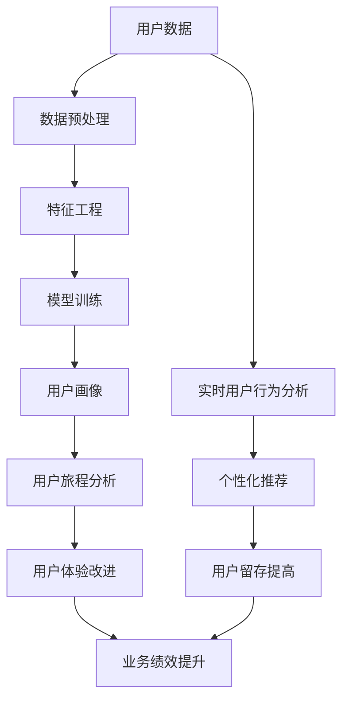

                 

## 1. 背景介绍

在当今数字化时代，用户行为数据是一座蕴藏丰富信息的矿藏。有效地挖掘和分析这些数据，可以帮助企业更好地理解用户需求，改进产品和服务，提高用户体验，并最终提升业务绩效。本文将深入探讨如何进行有效的用户行为洞察，帮助读者掌握必要的技能和工具，从海量用户行为数据中提取有价值的见解。

## 2. 核心概念与联系

### 2.1 用户行为洞察的定义

用户行为洞察（User Behavior Insights）是指通过分析用户在数字平台上的交互数据，理解用户的需求、动机、偏好和行为模式的过程。它结合了数据分析、人工智能、心理学和商业战略等领域的知识。

### 2.2 核心概念

- **用户数据（User Data）**：记录用户在数字平台上的交互活动的数据，如点击、滚动、搜索、购买等。
- **用户画像（User Persona）**：基于用户数据构建的用户特征和行为模式的概括。
- **用户旅程（User Journey）**：用户在数字平台上完成特定任务或目标的路径。
- **用户体验（User Experience）**：用户在与数字平台交互时的感知和情感反应。

### 2.3 核心概念联系 Mermaid 流程图



## 3. 核心算法原理 & 具体操作步骤

### 3.1 算法原理概述

用户行为洞察涉及多种算法，包括但不限于：数据预处理算法、特征工程算法、机器学习算法（如聚类、分类、回归）、推荐算法等。本节将重点介绍聚类算法在构建用户画像中的应用。

### 3.2 算法步骤详解

1. **数据预处理**：清洗、缺失值填充、异常值处理、特征选择等。
2. **特征工程**：提取用户行为数据中的有意义特征，如点击频率、停留时间、购买频率等。
3. **聚类算法**：将用户根据行为特征分成不同的群组。常用的聚类算法包括K-Means、DBSCAN、Hierarchical Clustering等。
4. **评估聚类结果**：使用轮廓系数、Silhouette Score等指标评估聚类结果的质量。
5. **分析用户画像**：对每个用户群进行深入分析，挖掘其共同特征和行为模式。

### 3.3 算法优缺点

- **优点**：聚类算法可以帮助发现用户的隐藏模式和群体结构，为个性化营销和产品改进提供依据。
- **缺点**：聚类结果的质量依赖于特征选择和聚类算法的参数设置，可能需要多次迭代调优。此外，聚类结果的解释性可能有限，需要结合业务知识进行解读。

### 3.4 算法应用领域

用户画像在个性化营销、产品设计、用户旅程优化等领域有广泛应用。例如，电商平台可以根据用户画像提供个性化推荐，提高转化率；金融机构可以根据用户画像提供定制化金融服务，提高客户满意度。

## 4. 数学模型和公式 & 详细讲解 & 举例说明

### 4.1 数学模型构建

用户行为洞察的数学模型通常基于概率统计和机器学习理论构建。本节将介绍K-Means聚类算法的数学模型。

### 4.2 公式推导过程

K-Means算法的目标是最小化样本到其所在聚类中心的距离平方和，数学公式如下：

$$J = \sum_{j=1}^{k} \sum_{x \in S_j} ||x - \mu_j||^2$$

其中，$k$是聚类的数目，$S_j$是第$j$个聚类包含的样本集，$x$是样本，$μ_j$是第$j$个聚类的聚类中心。

### 4.3 案例分析与讲解

假设我们要对电商平台的用户进行聚类，以构建用户画像。我们选取的特征包括：年龄、性别、购买频率、平均订单金额等。我们选择K-Means算法，并设置聚类数$k=4$.

通过运行K-Means算法，我们得到四个用户群：

1. **高频购买、高消费用户**：年龄偏大，购买频率高，平均订单金额大。
2. **中频购买、中消费用户**：年龄偏中，购买频率中等，平均订单金额中等。
3. **低频购买、低消费用户**：年龄偏小，购买频率低，平均订单金额小。
4. **新用户**：购买频率很低，平均订单金额小。

## 5. 项目实践：代码实例和详细解释说明

### 5.1 开发环境搭建

本项目使用Python作为编程语言，并依赖于以下库：

- Pandas：数据处理
- Scikit-learn：机器学习算法
- Matplotlib：数据可视化

### 5.2 源代码详细实现

```python
import pandas as pd
from sklearn.cluster import KMeans
from sklearn.preprocessing import StandardScaler
import matplotlib.pyplot as plt

# 加载数据
data = pd.read_csv('user_data.csv')

# 数据预处理
data = data.dropna()
X = data[['age', 'purchase_freq', 'avg_order_amount']]

# 特征标准化
scaler = StandardScaler()
X_scaled = scaler.fit_transform(X)

# K-Means聚类
kmeans = KMeans(n_clusters=4, random_state=42)
kmeans.fit(X_scaled)

# 添加聚类结果到数据集
data['cluster'] = kmeans.labels_

# 可视化聚类结果
plt.scatter(data['age'], data['avg_order_amount'], c=data['cluster'])
plt.xlabel('Age')
plt.ylabel('Average Order Amount')
plt.title('User Clusters')
plt.show()
```

### 5.3 代码解读与分析

代码首先加载用户数据，并进行简单的数据预处理。然后，它使用`StandardScaler`对特征进行标准化，以便于聚类算法的应用。之后，它使用K-Means算法对用户进行聚类，并将聚类结果添加回数据集。最后，它使用Matplotlib绘制聚类结果的可视化图表。

### 5.4 运行结果展示

运行结果是一个二维散点图，横轴为年龄，纵轴为平均订单金额，每个点的颜色表示其所属的用户群。图表可以帮助我们直观地理解用户的分布和群体结构。

## 6. 实际应用场景

### 6.1 用户画像驱动的个性化营销

企业可以根据用户画像提供个性化推荐，定向推送广告，或设计定制化促销活动，从而提高营销效果。

### 6.2 用户旅程优化

通过分析用户在数字平台上的行为路径，企业可以识别用户面临的障碍和机遇，并优化用户旅程，提高转化率。

### 6.3 未来应用展望

随着技术的发展，用户行为洞察将越来越多地结合实时数据、自然语言处理、计算机视觉等技术，为企业提供更全面、更及时的用户洞察。

## 7. 工具和资源推荐

### 7.1 学习资源推荐

- **书籍**："Web Analytics: An Hour a Day" by Avinash Kaushik
- **在线课程**：Coursera的"Data Science Specialization"和"Digital Marketing Specialization"课程

### 7.2 开发工具推荐

- **数据分析**：Python（Pandas, NumPy, Matplotlib）、R
- **可视化**：Tableau, Power BI
- **机器学习**：Scikit-learn, TensorFlow, PyTorch

### 7.3 相关论文推荐

- "User Behavior Modeling and Analysis: A Survey" by X. Wang et al.
- "Customer Segmentation Using Clustering Algorithms: A Review" by M. Kumar and S. P. B. Gupta

## 8. 总结：未来发展趋势与挑战

### 8.1 研究成果总结

本文介绍了用户行为洞察的核心概念、算法原理、数学模型和实践应用。通过实例分析，我们展示了如何使用K-Means聚类算法构建用户画像，并讨论了其在个性化营销和用户旅程优化中的应用。

### 8.2 未来发展趋势

未来，用户行为洞察将越来越多地结合实时数据、人工智能和大数据技术，为企业提供更全面、更及时的用户洞察。此外，隐私保护和数据安全将成为关注的重点。

### 8.3 面临的挑战

用户行为洞察面临的挑战包括数据质量问题、算法可解释性、隐私保护等。企业需要不断改进数据收集和处理方法，并开发更先进的算法和模型，以克服这些挑战。

### 8.4 研究展望

未来的研究将关注以下领域：

- **实时用户行为分析**：结合实时数据流，提供即时用户洞察。
- **跨渠道用户行为分析**：整合多渠道数据，提供全面的用户画像。
- **隐私保护技术**：开发新的技术和方法，保护用户隐私。

## 9. 附录：常见问题与解答

**Q：用户行为洞察和市场调查有什么区别？**

**A**：市场调查通常基于有限的样本数据，通过问卷调查或访谈收集用户意见。相比之下，用户行为洞察则基于用户在数字平台上的实际交互数据，提供更客观、更全面的用户洞察。

**Q：如何评估聚类结果的质量？**

**A**：常用的指标包括轮廓系数（Silhouette Score）、Calinski-Harabasz指数（CH Index）和Davies-Bouldin指数（DB Index）。这些指标可以帮助我们评估聚类结果的紧密度和分离度。

**Q：如何处理用户行为数据中的缺失值？**

**A**：常用的方法包括删除缺失值、使用中值或均值填充缺失值、使用回归或预测模型填充缺失值等。选择哪种方法取决于数据的特性和业务需求。

## 作者：禅与计算机程序设计艺术 / Zen and the Art of Computer Programming

