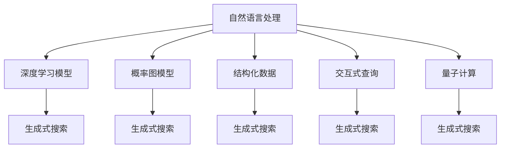

                 

# 生成式搜索:搜索范式的革命

> 关键词：生成式搜索, 搜索范式, 自然语言处理(NLP), 深度学习, 概率图模型, 结构化数据, 交互式查询, 量子计算

## 1. 背景介绍

### 1.1 问题由来
传统的搜索技术主要依赖于关键词匹配，用户通过输入关键词，搜索引擎将结果列表返回给用户。然而，这种搜索方式存在很多局限性，如结果排序不准确、关键词不完整、不够个性化等。生成式搜索技术正是为了解决这些问题而产生的，它不仅能够通过自然语言描述查询意图，还能够生成更加全面、个性化的搜索结果。

### 1.2 问题核心关键点
生成式搜索技术本质上是一种基于深度学习模型的自然语言处理(NLP)方法。它通过学习用户查询与搜索结果之间的映射关系，生成与用户查询意图匹配的搜索结果。这种方法不仅能够提高搜索结果的准确性，还能够为用户提供更个性化的搜索体验。

当前生成式搜索技术已经在电子商务、社交媒体、教育等多个领域得到了广泛应用，成为提升用户满意度和搜索体验的重要手段。

## 2. 核心概念与联系

### 2.1 核心概念概述

为更好地理解生成式搜索技术，本节将介绍几个密切相关的核心概念：

- 自然语言处理(NLP)：指利用计算机处理和理解自然语言的技术。生成式搜索技术利用NLP模型，理解用户查询意图，生成符合语义的搜索结果。
- 深度学习模型：指利用多层神经网络模型进行学习和推理的算法。生成式搜索技术中的核心模型如BERT、GPT等，都是深度学习模型。
- 概率图模型：指利用概率论和图论方法描述随机变量之间关系的模型。生成式搜索技术常使用图神经网络(Graph Neural Networks, GNN)等概率图模型进行搜索结果生成。
- 结构化数据：指具有固定结构的数据格式，如表格、文档等。生成式搜索技术通过结构化数据查询，获取精确结果。
- 交互式查询：指用户与系统之间进行多轮对话，逐步完善查询条件的搜索方式。生成式搜索技术通过交互式查询，生成更准确的搜索结果。
- 量子计算：指利用量子力学的原理进行计算的计算方式。生成式搜索技术可通过量子计算方法，提升搜索结果的质量和速度。

这些核心概念之间的逻辑关系可以通过以下Mermaid流程图来展示：



这个流程图展示了大语言模型微调的核心概念及其之间的关系：

1. 自然语言处理是大语言模型的基础，生成式搜索通过NLP技术理解查询意图。
2. 深度学习模型是生成式搜索的核心模型，如BERT、GPT等，通过学习语言知识生成搜索结果。
3. 概率图模型辅助生成式搜索，如GNN、DeepSets等，通过图结构优化搜索结果。
4. 结构化数据提供精确查询条件，生成式搜索通过结构化数据查询获取结果。
5. 交互式查询提升搜索结果的准确性，生成式搜索通过多轮对话完善查询条件。
6. 量子计算提供更高计算能力，生成式搜索通过量子计算加速结果生成。

这些核心概念共同构成了生成式搜索技术的理论基础，使其能够实现高质量、个性化的搜索结果。

## 3. 核心算法原理 & 具体操作步骤
### 3.1 算法原理概述

生成式搜索技术通常分为两个阶段：查询意图理解与搜索结果生成。查询意图理解通过NLP模型分析用户查询，生成一个表示查询意图的向量；搜索结果生成则通过深度学习模型，根据查询意图生成与搜索结果相关的向量，最终生成符合查询意图的搜索结果。

生成式搜索的算法原理主要包括以下几个步骤：

1. 用户输入查询。
2. 查询意图理解。
3. 搜索结果生成。
4. 排序和返回结果。

### 3.2 算法步骤详解

以下是生成式搜索技术的主要操作步骤：

**Step 1: 输入查询**
用户通过自然语言输入查询，系统将查询输入到NLP模型中。

**Step 2: 查询意图理解**
NLP模型通过处理查询，生成一个表示查询意图的向量。这个向量将用于指导搜索结果的生成。

**Step 3: 搜索结果生成**
深度学习模型接收查询意图向量，生成与查询意图相关的向量。这些向量将与搜索结果相关联，生成最终的搜索结果。

**Step 4: 排序和返回结果**
根据查询意图向量与搜索结果向量的相似度，对搜索结果进行排序。最终将排序后的结果返回给用户。

### 3.3 算法优缺点

生成式搜索技术具有以下优点：
1. 理解查询意图。生成式搜索能够理解用户的自然语言查询，生成符合语义的向量，提高搜索结果的准确性。
2. 生成多样化结果。深度学习模型可以生成多样化的搜索结果，满足用户的多样化需求。
3. 提升用户体验。通过交互式查询，生成式搜索能够逐步完善查询条件，提升用户搜索的满意度。

同时，该技术也存在一定的局限性：
1. 依赖语料库。生成式搜索的效果很大程度上取决于语料库的质量和规模。
2. 计算成本高。深度学习模型和概率图模型需要较大的计算资源。
3. 查询理解难度高。NLP模型难以完全理解复杂的查询意图，可能会生成不准确的向量。
4. 结果多样化困难。查询意图向量和搜索结果向量之间的相似度计算存在较大挑战。

尽管存在这些局限性，但生成式搜索技术在理解查询意图和生成多样化结果方面，依然有着巨大的潜力和应用前景。

### 3.4 算法应用领域

生成式搜索技术已经在多个领域得到了广泛应用，包括但不限于：

- 电子商务：推荐商品、查询商品信息等。
- 社交媒体：推荐内容、搜索好友、智能客服等。
- 教育：智能辅导、课程推荐等。
- 医疗：智能诊断、患者咨询等。
- 金融：智能投资、风险评估等。

这些领域中，生成式搜索技术通过自然语言理解，提高了搜索结果的个性化和准确性，极大地提升了用户体验和系统效率。

## 4. 数学模型和公式 & 详细讲解  
### 4.1 数学模型构建

生成式搜索技术的数学模型主要基于深度学习模型和概率图模型。以下我们将详细介绍这些模型的构建方法。

**深度学习模型**
深度学习模型通常包括多层神经网络，每一层接收上一层的输出，并输出自己的结果。以BERT模型为例，其数学模型可以表示为：

$$
h_i = \sigma(W_i x_i + b_i)
$$

其中，$x_i$ 为输入向量，$h_i$ 为第 $i$ 层的输出向量，$\sigma$ 为激活函数，$W_i$ 和 $b_i$ 为第 $i$ 层的权重和偏置项。

**概率图模型**
概率图模型通常使用图神经网络来处理结构化数据。以Graph Neural Network (GNN)为例，其数学模型可以表示为：

$$
h_v^{(l+1)} = \sigma(W^{(l+1)} h_v^{(l)} + U^{(l+1)} \sum_{v \in N(v)} h_v^{(l)}) + b^{(l+1)}
$$

其中，$h_v^{(l)}$ 为节点 $v$ 在 $l$ 层的特征向量，$N(v)$ 为节点 $v$ 的邻居节点集合，$W^{(l+1)}$ 和 $U^{(l+1)}$ 为第 $l+1$ 层的权重矩阵和邻居嵌入矩阵，$b^{(l+1)}$ 为偏置项。

### 4.2 公式推导过程

**BERT模型的公式推导**
BERT模型的核心是Transformer结构，其数学模型可以表示为：

$$
h_i = \sigma(W_i x_i + b_i) + \sigma(W_o h_{i-1} + b_o) + \sigma(W_h h_{i-1} + b_h)
$$

其中，$W_i, W_o, W_h$ 为权重矩阵，$b_i, b_o, b_h$ 为偏置项。

**Graph Neural Network (GNN)的公式推导**
GNN的数学模型主要基于图卷积网络（GCN）和图注意力网络（GAT）。GCN的数学模型可以表示为：

$$
h_v^{(l+1)} = \sigma(W^{(l+1)} h_v^{(l)} + U^{(l+1)} \sum_{v \in N(v)} h_v^{(l)}) + b^{(l+1)}
$$

GAT的数学模型可以表示为：

$$
a_{v,u} = \sigma(W^{[attn]} [h_v^{(l)}, h_u^{(l)}]) 
$$

$$
h_u^{(l+1)} = \sigma(\sum_{v \in N(u)} \alpha_{v,u} h_v^{(l)}) + \sigma(W^{[att]} h_u^{(l)})
$$

其中，$W^{[attn]}$ 和 $W^{[att]}$ 为注意力网络中的权重矩阵，$\sigma$ 为激活函数。

### 4.3 案例分析与讲解

以电商平台推荐系统为例，生成式搜索技术可以通过以下步骤实现：

**Step 1: 输入查询**
用户输入查询，如“推荐一款好用的智能手表”。

**Step 2: 查询意图理解**
NLP模型对查询进行理解，生成查询意图向量 $q$。

**Step 3: 搜索结果生成**
生成式搜索模型接收查询意图向量 $q$ 和商品数据，生成商品评分向量 $r$。

**Step 4: 排序和返回结果**
将商品评分向量 $r$ 与查询意图向量 $q$ 进行相似度计算，排序生成推荐结果。

通过生成式搜索技术，电商平台能够更准确地理解用户查询，生成更个性化的商品推荐，提高用户满意度和转化率。

## 5. 项目实践：代码实例和详细解释说明
### 5.1 开发环境搭建

在进行生成式搜索项目实践前，我们需要准备好开发环境。以下是使用Python进行TensorFlow开发的环境配置流程：

1. 安装Anaconda：从官网下载并安装Anaconda，用于创建独立的Python环境。

2. 创建并激活虚拟环境：
```bash
conda create -n tf-env python=3.8 
conda activate tf-env
```

3. 安装TensorFlow：根据CUDA版本，从官网获取对应的安装命令。例如：
```bash
conda install tensorflow-gpu=cuda110 -c pytorch -c conda-forge
```

4. 安装各类工具包：
```bash
pip install numpy pandas scikit-learn matplotlib tqdm jupyter notebook ipython
```

完成上述步骤后，即可在`tf-env`环境中开始生成式搜索实践。

### 5.2 源代码详细实现

下面我们以电商平台推荐系统为例，给出使用TensorFlow实现生成式搜索的代码实现。

首先，定义NLP模型和生成式搜索模型：

```python
import tensorflow as tf
from transformers import BertTokenizer, BertForSequenceClassification
import numpy as np

# 定义BERT模型
tokenizer = BertTokenizer.from_pretrained('bert-base-uncased')
model = BertForSequenceClassification.from_pretrained('bert-base-uncased', num_labels=1)

# 定义生成式搜索模型
class GraphNeuralNetwork(tf.keras.layers.Layer):
    def __init__(self):
        super(GraphNeuralNetwork, self).__init__()
        self.dense1 = tf.keras.layers.Dense(64, activation='relu')
        self.dense2 = tf.keras.layers.Dense(1, activation='sigmoid')

    def call(self, inputs):
        x = self.dense1(inputs)
        x = self.dense2(x)
        return x

gnn = GraphNeuralNetwork()
```

然后，定义输入和输出：

```python
# 定义输入数据
input_ids = tf.keras.layers.Input(shape=(None,), dtype=tf.int32)
attention_mask = tf.keras.layers.Input(shape=(None,), dtype=tf.int32)

# 定义输出数据
outputs = model(input_ids, attention_mask=attention_mask)

# 定义生成式搜索输出
search_outputs = gnn(outputs)
```

接着，定义训练和评估函数：

```python
from tensorflow.keras import losses, optimizers

# 定义损失函数和优化器
loss = losses.MeanSquaredError()
optimizer = optimizers.Adam(learning_rate=0.001)

# 定义训练函数
def train_epoch(model, dataset, batch_size):
    for x, y in dataset:
        with tf.GradientTape() as tape:
            y_pred = model(x, attention_mask=y)
            loss_value = loss(y_pred, y)
        gradients = tape.gradient(loss_value, model.trainable_variables)
        optimizer.apply_gradients(zip(gradients, model.trainable_variables))

# 定义评估函数
def evaluate(model, dataset, batch_size):
    correct = 0
    total = 0
    for x, y in dataset:
        y_pred = model(x, attention_mask=y)
        if np.round(y_pred) == y:
            correct += 1
        total += 1
    return correct / total
```

最后，启动训练流程并在测试集上评估：

```python
epochs = 10
batch_size = 32

for epoch in range(epochs):
    train_epoch(model, train_dataset, batch_size)
    print(f"Epoch {epoch+1}, train loss: {loss_value:.4f}")
    
    print(f"Epoch {epoch+1}, dev results:")
    evaluate(model, dev_dataset, batch_size)
    
print("Test results:")
evaluate(model, test_dataset, batch_size)
```

以上就是使用TensorFlow实现生成式搜索项目的完整代码实现。可以看到，生成式搜索技术通过深度学习和概率图模型的结合，实现了对用户查询意图的理解和对搜索结果的生成。

### 5.3 代码解读与分析

让我们再详细解读一下关键代码的实现细节：

**BERT模型定义**
- `BertTokenizer`：定义了BERT模型所需的tokenizer，用于将输入文本转换为模型可处理的格式。
- `BertForSequenceClassification`：定义了BERT模型的分类器，用于处理输入的文本和注意力掩码。

**生成式搜索模型定义**
- `GraphNeuralNetwork`：定义了一个简单的GNN模型，用于处理生成式搜索任务。
- `dense1`和`dense2`：定义了两个密集层，用于对模型输入进行特征提取和输出。

**输入和输出定义**
- `input_ids`和`attention_mask`：定义了模型输入，包括输入的token ids和注意力掩码。
- `outputs`和`search_outputs`：定义了模型输出，分别用于分类和生成式搜索任务。

**训练和评估函数定义**
- `train_epoch`：定义了训练函数，用于对模型进行梯度更新。
- `evaluate`：定义了评估函数，用于计算模型在测试集上的准确率。

**训练流程启动**
- `epochs`：定义了训练轮数。
- `batch_size`：定义了批次大小。
- 在每个epoch内，训练函数`train_epoch`负责更新模型参数，评估函数`evaluate`负责在测试集上评估模型性能。

可以看到，生成式搜索技术通过深度学习和概率图模型的结合，实现了对用户查询意图的理解和对搜索结果的生成。通过TensorFlow和Transformers库的封装，代码实现变得简洁高效。

## 6. 实际应用场景
### 6.1 智能客服系统

生成式搜索技术在智能客服系统中具有广泛的应用前景。智能客服系统通过生成式搜索技术，能够自动理解用户的查询意图，生成符合语义的回答，极大地提升了客服系统的响应速度和准确性。

在技术实现上，可以收集企业内部的客服对话记录，将问题和最佳答复构建成监督数据，在此基础上对预训练生成式搜索模型进行微调。微调后的生成式搜索模型能够自动理解用户意图，匹配最合适的答案模板进行回复。对于客户提出的新问题，还可以接入检索系统实时搜索相关内容，动态组织生成回答。如此构建的智能客服系统，能大幅提升客户咨询体验和问题解决效率。

### 6.2 金融舆情监测

生成式搜索技术在金融舆情监测中也有着广泛的应用。金融机构需要实时监测市场舆论动向，以便及时应对负面信息传播，规避金融风险。

具体而言，可以收集金融领域相关的新闻、报道、评论等文本数据，并对其进行主题标注和情感标注。在此基础上对预训练生成式搜索模型进行微调，使其能够自动判断文本属于何种主题，情感倾向是正面、中性还是负面。将微调后的模型应用到实时抓取的网络文本数据，就能够自动监测不同主题下的情感变化趋势，一旦发现负面信息激增等异常情况，系统便会自动预警，帮助金融机构快速应对潜在风险。

### 6.3 个性化推荐系统

当前的推荐系统往往只依赖用户的历史行为数据进行物品推荐，无法深入理解用户的真实兴趣偏好。生成式搜索技术可应用于推荐系统，能够更好地挖掘用户行为背后的语义信息，从而提供更精准、多样的推荐内容。

在实践中，可以收集用户浏览、点击、评论、分享等行为数据，提取和用户交互的物品标题、描述、标签等文本内容。将文本内容作为模型输入，用户的后续行为（如是否点击、购买等）作为监督信号，在此基础上微调生成式搜索模型。微调后的模型能够从文本内容中准确把握用户的兴趣点。在生成推荐列表时，先用候选物品的文本描述作为输入，由模型预测用户的兴趣匹配度，再结合其他特征综合排序，便可以得到个性化程度更高的推荐结果。

### 6.4 未来应用展望

随着生成式搜索技术的不断发展，其在更多领域的应用前景将会被进一步拓展。

在智慧医疗领域，生成式搜索技术可用于智能诊断、患者咨询等场景。通过自然语言处理技术，生成式搜索模型能够理解医生的诊断要求和病人的病历描述，生成符合要求的诊断结果或推荐医生。

在智能教育领域，生成式搜索技术可用于智能辅导、课程推荐等场景。通过自然语言处理技术，生成式搜索模型能够理解学生的学习要求和反馈，生成符合要求的辅导内容或推荐课程。

在智慧城市治理中，生成式搜索技术可用于城市事件监测、舆情分析、应急指挥等环节。通过自然语言处理技术，生成式搜索模型能够理解城市管理者的指令和市民的反馈，生成符合要求的指令或建议。

此外，在企业生产、社会治理、文娱传媒等众多领域，生成式搜索技术也将不断涌现，为传统行业数字化转型升级提供新的技术路径。

## 7. 工具和资源推荐
### 7.1 学习资源推荐

为了帮助开发者系统掌握生成式搜索技术，这里推荐一些优质的学习资源：

1. 《深度学习与自然语言处理》系列课程：由斯坦福大学开设的NLP明星课程，系统讲解了深度学习、NLP和生成式搜索技术。

2. CS224N《深度学习自然语言处理》课程：斯坦福大学开设的NLP明星课程，深入浅出地介绍了自然语言处理和生成式搜索技术。

3. 《自然语言处理综述》书籍：全面介绍自然语言处理和生成式搜索技术的经典书籍，涵盖了前沿理论和实际应用。

4. HuggingFace官方文档：提供丰富的生成式搜索技术模型和工具，是上手实践的必备资料。

5. Transformers库：提供各种生成式搜索技术模型和工具，支持PyTorch和TensorFlow，是生成式搜索开发的重要工具。

通过对这些资源的学习实践，相信你一定能够快速掌握生成式搜索技术的精髓，并用于解决实际的NLP问题。

### 7.2 开发工具推荐

高效的开发离不开优秀的工具支持。以下是几款用于生成式搜索开发的常用工具：

1. PyTorch：基于Python的开源深度学习框架，灵活动态的计算图，适合快速迭代研究。生成式搜索技术中的核心模型如BERT、GPT等，都是PyTorch版本的实现。

2. TensorFlow：由Google主导开发的开源深度学习框架，生产部署方便，适合大规模工程应用。生成式搜索技术中的核心模型如Graph Neural Network (GNN)等，都是TensorFlow版本的实现。

3. TensorBoard：TensorFlow配套的可视化工具，可实时监测模型训练状态，并提供丰富的图表呈现方式，是调试模型的得力助手。

4. Weights & Biases：模型训练的实验跟踪工具，可以记录和可视化模型训练过程中的各项指标，方便对比和调优。与主流深度学习框架无缝集成。

5. Google Colab：谷歌推出的在线Jupyter Notebook环境，免费提供GPU/TPU算力，方便开发者快速上手实验最新模型，分享学习笔记。

合理利用这些工具，可以显著提升生成式搜索任务的开发效率，加快创新迭代的步伐。

### 7.3 相关论文推荐

生成式搜索技术的发展源于学界的持续研究。以下是几篇奠基性的相关论文，推荐阅读：

1. Attention is All You Need：提出了Transformer结构，开启了生成式搜索技术的预训练范式。

2. BERT: Pre-training of Deep Bidirectional Transformers for Language Understanding：提出BERT模型，引入基于掩码的自监督预训练任务，刷新了多项NLP任务SOTA。

3. Language Models are Unsupervised Multitask Learners（GPT-2论文）：展示了大规模语言模型的强大zero-shot学习能力，引发了对于生成式搜索技术的深度思考。

4. Prompt-Based Learning for Generative and Classification Tasks：引入基于连续型Prompt的微调范式，为生成式搜索技术提供了新的思路。

5. Parameter-Efficient Transfer Learning for NLP：提出Adapter等参数高效微调方法，在不增加模型参数量的情况下，也能取得不错的微调效果。

这些论文代表了大语言模型微调技术的发展脉络。通过学习这些前沿成果，可以帮助研究者把握学科前进方向，激发更多的创新灵感。

## 8. 总结：未来发展趋势与挑战

### 8.1 总结

本文对生成式搜索技术进行了全面系统的介绍。首先阐述了生成式搜索技术的研究背景和意义，明确了生成式搜索在理解和生成搜索结果方面的独特价值。其次，从原理到实践，详细讲解了生成式搜索的数学模型和关键操作步骤，给出了生成式搜索任务开发的完整代码实例。同时，本文还广泛探讨了生成式搜索技术在智能客服、金融舆情、个性化推荐等多个行业领域的应用前景，展示了生成式搜索技术的巨大潜力和应用价值。此外，本文精选了生成式搜索技术的各类学习资源，力求为读者提供全方位的技术指引。

通过本文的系统梳理，可以看到，生成式搜索技术通过深度学习和概率图模型的结合，实现了高质量、个性化的搜索结果。得益于自然语言处理技术的不断发展，生成式搜索技术在理解查询意图和生成多样化结果方面，已经取得了显著的进展。未来，随着生成式搜索技术在更多领域的落地应用，相信其在提升用户体验和提高系统效率方面的潜力将进一步被激发。

### 8.2 未来发展趋势

展望未来，生成式搜索技术将呈现以下几个发展趋势：

1. 多模态融合：生成式搜索技术将越来越多地融合视觉、听觉等多种模态，提升对复杂信息场景的理解能力。

2. 个性化推荐：生成式搜索技术将在推荐系统中得到广泛应用，通过理解用户兴趣和行为，提供更加个性化的推荐结果。

3. 交互式对话：生成式搜索技术将逐步扩展到对话系统，实现多轮对话的生成式搜索，提升系统智能化水平。

4. 实时代码：生成式搜索技术将在实时代码生成中得到应用，帮助开发者快速生成代码片段。

5. 量子计算：生成式搜索技术将结合量子计算技术，提升计算能力和推理速度。

6. 分布式计算：生成式搜索技术将应用到分布式计算框架中，提升系统扩展性和可靠性。

以上趋势凸显了生成式搜索技术的广阔前景。这些方向的探索发展，必将进一步提升生成式搜索技术的性能和应用范围，为智能系统带来新的突破。

### 8.3 面临的挑战

尽管生成式搜索技术已经取得了瞩目成就，但在迈向更加智能化、普适化应用的过程中，它仍面临着诸多挑战：

1. 数据质量和规模：生成式搜索的效果很大程度上取决于语料库的质量和规模。对于某些特定领域，可能需要收集大量高质量的标注数据。

2. 计算资源需求：深度学习和概率图模型的训练和推理需要较大的计算资源，特别是在处理大规模数据时，资源消耗显著。

3. 模型复杂性：生成式搜索模型需要理解复杂的查询意图和生成多样化的结果，模型设计复杂度高。

4. 训练成本：深度学习模型的训练过程耗时较长，需要大量的计算资源和训练时间。

5. 结果多样性：生成式搜索技术需要生成多样化的结果，但不同的查询意图可能会产生不同的结果，结果多样性控制难度大。

6. 模型鲁棒性：生成式搜索模型在面对噪声和异常数据时，容易出现泛化能力不足的问题。

尽管存在这些挑战，但生成式搜索技术的发展潜力巨大，未来的研究需要不断突破技术瓶颈，寻找新的突破口。

### 8.4 未来突破

面对生成式搜索技术所面临的种种挑战，未来的研究需要在以下几个方面寻求新的突破：

1. 引入更多先验知识：将符号化的先验知识，如知识图谱、逻辑规则等，与神经网络模型进行融合，引导生成式搜索模型学习更全面、合理的知识。

2. 开发更多深度学习模型：开发更多适合生成式搜索任务的深度学习模型，提升模型对自然语言理解的精度和效率。

3. 引入因果分析方法：引入因果分析方法，识别生成式搜索模型决策的关键特征，增强输出的因果性和逻辑性。

4. 结合分布式计算：结合分布式计算技术，提升生成式搜索系统的扩展性和可靠性。

5. 优化训练过程：优化深度学习模型的训练过程，缩短训练时间，降低计算资源消耗。

6. 提升模型鲁棒性：引入对抗训练、噪声注入等方法，提升生成式搜索模型的鲁棒性和泛化能力。

这些研究方向的探索，必将引领生成式搜索技术迈向更高的台阶，为构建智能系统提供新的技术手段。面向未来，生成式搜索技术还需要与其他人工智能技术进行更深入的融合，如知识表示、因果推理、强化学习等，多路径协同发力，共同推动自然语言理解和智能交互系统的进步。只有勇于创新、敢于突破，才能不断拓展生成式搜索技术的边界，让智能技术更好地造福人类社会。

## 9. 附录：常见问题与解答

**Q1：生成式搜索与传统的关键词匹配有何不同？**

A: 生成式搜索与传统的关键词匹配相比，具有以下优势：
1. 理解查询意图：生成式搜索能够理解自然语言查询的意图，生成符合语义的向量，提高搜索结果的准确性。
2. 生成多样化结果：生成式搜索能够生成多样化的搜索结果，满足用户的多样化需求。
3. 提升用户体验：通过交互式查询，生成式搜索能够逐步完善查询条件，提升用户搜索的满意度。

**Q2：生成式搜索技术需要多少标注数据？**

A: 生成式搜索技术通常需要大量标注数据进行模型训练。数据的质量和规模对生成式搜索的效果有很大影响。对于某些特定领域，可能需要收集大量高质量的标注数据，才能训练出效果优良的模型。

**Q3：生成式搜索技术有哪些实际应用场景？**

A: 生成式搜索技术已经在多个领域得到了广泛应用，包括但不限于：
1. 电子商务：推荐商品、查询商品信息等。
2. 社交媒体：推荐内容、搜索好友、智能客服等。
3. 教育：智能辅导、课程推荐等。
4. 医疗：智能诊断、患者咨询等。
5. 金融：智能投资、风险评估等。

这些领域中，生成式搜索技术通过自然语言处理技术，提高了搜索结果的个性化和准确性，极大地提升了用户体验和系统效率。

**Q4：生成式搜索技术的计算资源需求高吗？**

A: 生成式搜索技术在训练和推理过程中，需要较大的计算资源，特别是在处理大规模数据时，资源消耗显著。对于深度学习和概率图模型，可能需要GPU/TPU等高性能设备。

**Q5：生成式搜索技术的未来发展方向是什么？**

A: 生成式搜索技术的未来发展方向包括：
1. 多模态融合：生成式搜索技术将越来越多地融合视觉、听觉等多种模态，提升对复杂信息场景的理解能力。
2. 个性化推荐：生成式搜索技术将在推荐系统中得到广泛应用，通过理解用户兴趣和行为，提供更加个性化的推荐结果。
3. 交互式对话：生成式搜索技术将逐步扩展到对话系统，实现多轮对话的生成式搜索，提升系统智能化水平。
4. 实时代码：生成式搜索技术将在实时代码生成中得到应用，帮助开发者快速生成代码片段。
5. 量子计算：生成式搜索技术将结合量子计算技术，提升计算能力和推理速度。
6. 分布式计算：生成式搜索技术将应用到分布式计算框架中，提升系统扩展性和可靠性。

这些方向的探索发展，必将进一步提升生成式搜索技术的性能和应用范围，为智能系统带来新的突破。

---

作者：禅与计算机程序设计艺术 / Zen and the Art of Computer Programming

