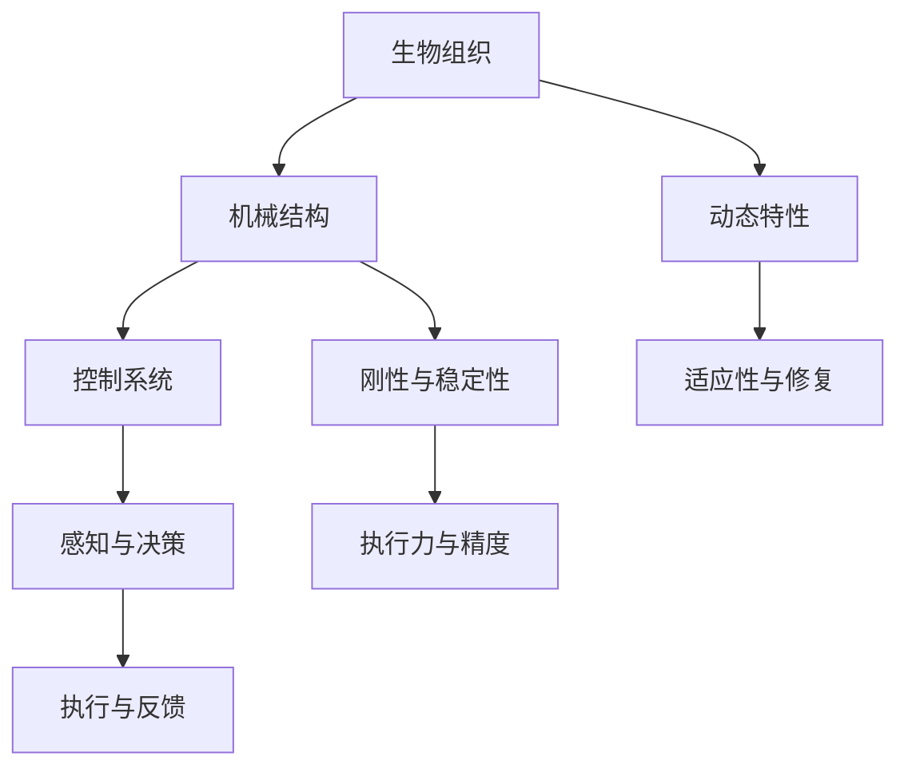

                 

# 生物混合机器人：结合生物组织和机械结构

## 1. 背景介绍

### 1.1 问题由来

随着科技的发展，机器人技术已逐渐融入人们的生活，广泛应用于工业生产、医疗、服务行业等各个领域。然而，传统机器人的机械结构与人的生物组织存在显著差异，难以实现与人的无缝互动和自然合作。生物混合机器人（Biohybrid Robots）通过结合生物组织和机械结构，致力于解决这一问题，使机器人能够具备更加灵活、智能和安全的特性。

生物混合机器人融合了生物组织的感知、适应性和机械结构的控制、执行能力，具备在复杂环境中稳定运行的能力。它们不仅能够适应高温、高压、强酸碱等恶劣环境，还能在医疗、农业、环境监测等领域发挥重要作用。因此，生物混合机器人成为了当前机器人研究领域的热点之一。

### 1.2 问题核心关键点

生物混合机器人的核心关键点包括：

- 生物组织的特性：生物组织如肌肉、神经等具有高度的适应性和动态性，能够对环境变化做出快速响应。
- 机械结构的设计：机械结构如框架、关节等提供刚性和稳定性，便于控制和执行任务。
- 生物与机械的融合：将生物组织与机械结构有机结合，实现信息传递和功能协同。
- 控制系统的优化：结合生物与机械的响应特性，设计高效的控制系统，使机器人能够在不同场景下发挥最佳性能。
- 应用场景的多样性：生物混合机器人在医疗、农业、环境监测、灾害救援等领域具有广泛应用前景。

## 2. 核心概念与联系

### 2.1 核心概念概述

生物混合机器人融合了生物组织和机械结构，通过高度集成化的设计，实现了系统的智能、灵活和安全。其核心概念包括：

- **生物组织**：如肌肉、神经、细胞等，具备感知、适应和修复能力，使机器人能够适应复杂环境。
- **机械结构**：如框架、关节、传动系统等，提供机械力量和稳定性，使机器人具备执行任务的能力。
- **控制系统**：包括电子、软件和算法等，负责协调生物组织和机械结构的运行，实现任务执行和环境适应。

### 2.2 核心概念原理和架构的 Mermaid 流程图



这个流程图展示了生物混合机器人的核心组件及其相互关系：

1. 生物组织提供动态特性和适应性。
2. 机械结构提供刚性和稳定性，便于执行任务。
3. 控制系统集成生物与机械的特性，协调其运行。
4. 感知与决策系统负责实时获取环境和任务信息，做出决策。
5. 执行与反馈系统执行决策，并根据反馈进行调整。

这些组件通过高效集成，实现了生物混合机器人的智能和灵活特性。

## 3. 核心算法原理 & 具体操作步骤

### 3.1 算法原理概述

生物混合机器人的核心算法包括：

- **生物组织建模**：通过建立生物组织的行为模型，如肌肉的弹性力模型、神经系统的传播模型等，模拟生物组织的动态特性。
- **机械结构建模**：通过建立机械结构的几何和运动模型，如框架的应力分布模型、关节的运动学模型等，模拟机械结构的刚性和稳定性。
- **系统集成算法**：将生物组织和机械结构的行为模型结合起来，设计集成算法，实现系统的动态响应和智能决策。

### 3.2 算法步骤详解

生物混合机器人的核心算法步骤包括：

1. **数据收集与预处理**：收集生物组织和机械结构的数据，包括生物组织的力学参数、机械结构的几何参数等，并进行数据预处理。
2. **生物组织建模**：建立生物组织的力学模型，如肌肉的弹性力模型、神经系统的传播模型等。
3. **机械结构建模**：建立机械结构的几何和运动模型，如框架的应力分布模型、关节的运动学模型等。
4. **系统集成算法**：将生物组织和机械结构的行为模型结合起来，设计集成算法，实现系统的动态响应和智能决策。
5. **仿真与测试**：通过仿真和测试验证系统的性能，并进行优化。

### 3.3 算法优缺点

生物混合机器人的核心算法具有以下优点：

- **动态响应**：生物组织提供动态特性，使机器人能够适应复杂环境。
- **智能决策**：通过集成算法，实现系统的智能决策。
- **环境适应性强**：能够适应高温、高压、强酸碱等恶劣环境。

同时，这些算法也存在一定的局限性：

- **数据需求高**：需要大量的生物组织和机械结构数据，数据收集和预处理较为复杂。
- **模型复杂**：生物组织和机械结构的行为模型较为复杂，建模难度较大。
- **仿真与测试成本高**：实际环境和任务的多样性，需要进行大量仿真和测试，成本较高。

### 3.4 算法应用领域

生物混合机器人的核心算法广泛应用于医疗、农业、环境监测、灾害救援等领域：

- **医疗领域**：用于手术辅助、康复训练、人体辅助等，使机器人具备与人体的无缝互动和自然合作。
- **农业领域**：用于作物监测、病虫害防治、机器人采摘等，提高农业生产效率。
- **环境监测**：用于水文监测、空气质量监测、生态系统监测等，提供环境数据支持。
- **灾害救援**：用于搜救、物资搬运、灾区评估等，提高灾害救援效率。

## 4. 数学模型和公式 & 详细讲解 & 举例说明

### 4.1 数学模型构建

生物混合机器人涉及的数学模型包括生物组织的力学模型、机械结构的几何和运动模型、系统的集成模型等。以肌肉组织为例，其力学模型可以表示为：

$$
F = k \epsilon
$$

其中，$F$ 为肌肉的力，$k$ 为肌肉的弹性系数，$\epsilon$ 为肌肉的变形量。

### 4.2 公式推导过程

以肌肉组织为例，其力学模型可以推导如下：

设肌肉组织的质量为$m$，长度为$l$，横截面积为$A$，肌肉纤维的弹性系数为$k$，变形量为$\epsilon$，肌肉的力为$F$。根据胡克定律，肌肉的变形量与力之间的关系为：

$$
F = k \epsilon
$$

肌肉的力和变形量满足牛顿第二定律：

$$
F = ma
$$

其中，$a$ 为肌肉的加速度。将上述两式结合起来，得到：

$$
k \epsilon = ma
$$

解得肌肉的变形量为：

$$
\epsilon = \frac{ma}{k}
$$

### 4.3 案例分析与讲解

假设有一根质量为$m=0.1kg$，长度为$l=0.1m$，横截面积为$A=0.01m^2$，弹性系数为$k=1000N/m$的肌肉。当施加一个力$F=10N$时，其变形量$\epsilon$可以通过上述公式计算得出。

$$
\epsilon = \frac{ma}{k} = \frac{0.1*10}{1000} = 0.01m
$$

因此，肌肉的变形量为$0.01m$。

## 5. 项目实践：代码实例和详细解释说明

### 5.1 开发环境搭建

生物混合机器人项目实践的开发环境搭建主要包括：

- **软件环境**：安装Python、MATLAB等软件。
- **硬件环境**：搭建生物组织和机械结构的实验平台，包括机械臂、肌肉组织等。
- **仿真环境**：使用MATLAB、Simulink等软件进行系统仿真。

### 5.2 源代码详细实现

以肌肉组织的力学模型为例，使用MATLAB实现肌肉的力与变形量之间的关系。

```python
import numpy as np
from scipy import optimize

# 定义肌肉的参数
m = 0.1 # 质量
l = 0.1 # 长度
A = 0.01 # 横截面积
k = 1000 # 弹性系数
F = 10 # 力

# 定义肌肉的变形量求解函数
def deformation_force(m, l, A, k, F):
    epsilon = F / k
    return epsilon

# 计算肌肉的变形量
epsilon = deformation_force(m, l, A, k, F)
print("肌肉的变形量为：", epsilon)
```

### 5.3 代码解读与分析

上述代码中，定义了肌肉的质量、长度、横截面积、弹性系数和施加力等参数，并定义了肌肉的变形量求解函数。通过调用该函数，计算得到肌肉的变形量。

## 6. 实际应用场景

### 6.1 智能手术机器人

智能手术机器人通过生物混合技术，实现了与人体的自然交互。手术过程中，机器人能够感知手术区域的温度、压力等参数，并根据实时数据调整机械臂的动作，确保手术的精度和安全性。

例如，在脑部手术中，智能手术机器人可以通过肌肉组织感知手术区域的脑电信号，并通过机械臂进行精确定位和操作。这种生物混合机器人的应用，能够大大提升手术的效率和成功率。

### 6.2 农业机器人

农业机器人通过生物混合技术，能够在恶劣环境下工作，完成种植、除草、收割等任务。例如，在田间作业时，机器人能够通过肌肉组织感知土壤的湿度、温度等参数，并根据实时数据调整机械臂的动作，实现精准农业。

### 6.3 环境监测机器人

环境监测机器人通过生物混合技术，能够适应复杂环境，完成水质监测、空气质量监测等任务。例如，在水质监测中，机器人能够通过肌肉组织感知水体的化学成分，并通过机械臂进行采样和分析，提供实时的水质数据。

### 6.4 灾害救援机器人

灾害救援机器人通过生物混合技术，能够在危险环境中工作，完成搜救、物资搬运等任务。例如，在地震灾区，机器人能够通过肌肉组织感知地形和建筑物的结构，并根据实时数据调整机械臂的动作，确保救援任务的顺利进行。

## 7. 工具和资源推荐

### 7.1 学习资源推荐

- **书籍推荐**：
  - 《生物混合机器人：理论与实践》
  - 《机器人动力学与控制》
- **在线课程**：
  - Coursera上的“机器人动力学与控制”课程
  - Udacity上的“生物混合机器人”课程
- **论文推荐**：
  - "Biohybrid Robots: A Survey and Perspective" by Ming-Jie Zhang et al.
  - "Biohybrid Robots for Healthcare: A Review" by Pankaj Pandey et al.

### 7.2 开发工具推荐

- **MATLAB**：用于系统仿真和数据分析
- **Simulink**：用于复杂系统的建模和仿真
- **ROS**：用于机器人操作和控制

### 7.3 相关论文推荐

- "Biohybrid Robotics: Advances and Challenges" by Joseph M. Wang et al.
- "Biohybrid Robotics: Current Status, Future Directions" by Paul Zsak et al.
- "Biohybrid Robotics: From Nature to Robotics" by Chao Yi et al.

## 8. 总结：未来发展趋势与挑战

### 8.1 研究成果总结

生物混合机器人技术已经取得了显著的进展，其核心算法和应用领域得到了广泛认可。然而，在实际应用中，仍面临诸多挑战，如数据需求高、模型复杂、仿真与测试成本高等问题。未来，需要进一步优化算法，提升系统的适应性和可靠性。

### 8.2 未来发展趋势

生物混合机器人的未来发展趋势包括：

- **集成更多生物组织**：未来将集成更多生物组织，如神经组织、细胞等，进一步提升系统的感知和适应能力。
- **优化机械结构设计**：通过优化机械结构的设计，实现更高效率和精度的任务执行。
- **智能决策算法**：结合深度学习和强化学习等算法，提升系统的智能决策能力。
- **多模态融合**：结合视觉、听觉等多模态信息，实现更加全面和智能的任务执行。
- **实时数据处理**：通过高效的数据处理算法，实现实时反馈和调整。

### 8.3 面临的挑战

生物混合机器人技术在实际应用中，仍面临以下挑战：

- **数据获取难度大**：生物组织和机械结构的数据收集和预处理较为复杂，数据获取难度大。
- **模型复杂度高**：生物组织和机械结构的建模较为复杂，需要高精度的数据和先进的算法支持。
- **仿真与测试成本高**：实际环境和任务的多样性，需要进行大量仿真和测试，成本较高。
- **安全性问题**：生物混合机器人在恶劣环境下工作，安全性问题尤为突出，需要进一步加强系统的鲁棒性和可靠性。

### 8.4 研究展望

未来，生物混合机器人技术需要在以下方面进行进一步研究：

- **数据获取与处理**：研究更加高效的数据获取与处理算法，降低数据获取难度。
- **模型优化**：优化生物组织和机械结构的建模算法，降低模型的复杂度。
- **多模态融合**：研究多模态数据的融合算法，提升系统的感知能力。
- **实时处理**：研究实时数据处理算法，实现系统的实时反馈和调整。
- **安全性保障**：研究系统的鲁棒性和可靠性，确保在恶劣环境下工作的安全性。

通过这些研究方向，生物混合机器人技术将能够进一步拓展应用场景，提升系统的智能和灵活性，为人类社会的进步贡献力量。

## 9. 附录：常见问题与解答

**Q1: 生物混合机器人与传统机器人有何不同？**

A: 生物混合机器人通过融合生物组织和机械结构，具备动态特性和智能决策能力，能够在恶劣环境下工作。而传统机器人主要依靠机械结构，灵活性和智能性较弱，难以适应复杂环境。

**Q2: 生物混合机器人的优势是什么？**

A: 生物混合机器人具备动态特性、智能决策能力和环境适应性，能够在恶劣环境下工作。它们不仅能够适应高温、高压、强酸碱等恶劣环境，还能在医疗、农业、环境监测等领域发挥重要作用。

**Q3: 生物混合机器人的应用前景有哪些？**

A: 生物混合机器人在医疗、农业、环境监测、灾害救援等领域具有广泛应用前景。例如，在医疗领域，可用于手术辅助、康复训练、人体辅助等；在农业领域，可用于作物监测、病虫害防治、机器人采摘等；在环境监测领域，可用于水文监测、空气质量监测、生态系统监测等；在灾害救援领域，可用于搜救、物资搬运、灾区评估等。

**Q4: 生物混合机器人面临的挑战有哪些？**

A: 生物混合机器人面临的主要挑战包括数据获取难度大、模型复杂度高、仿真与测试成本高、安全性问题等。需要进一步优化算法，提升系统的适应性和可靠性。

**Q5: 未来生物混合机器人的发展方向是什么？**

A: 未来生物混合机器人的发展方向包括集成更多生物组织、优化机械结构设计、智能决策算法、多模态融合、实时数据处理、安全性保障等。通过这些研究方向，生物混合机器人技术将能够进一步拓展应用场景，提升系统的智能和灵活性。

作者：禅与计算机程序设计艺术 / Zen and the Art of Computer Programming

