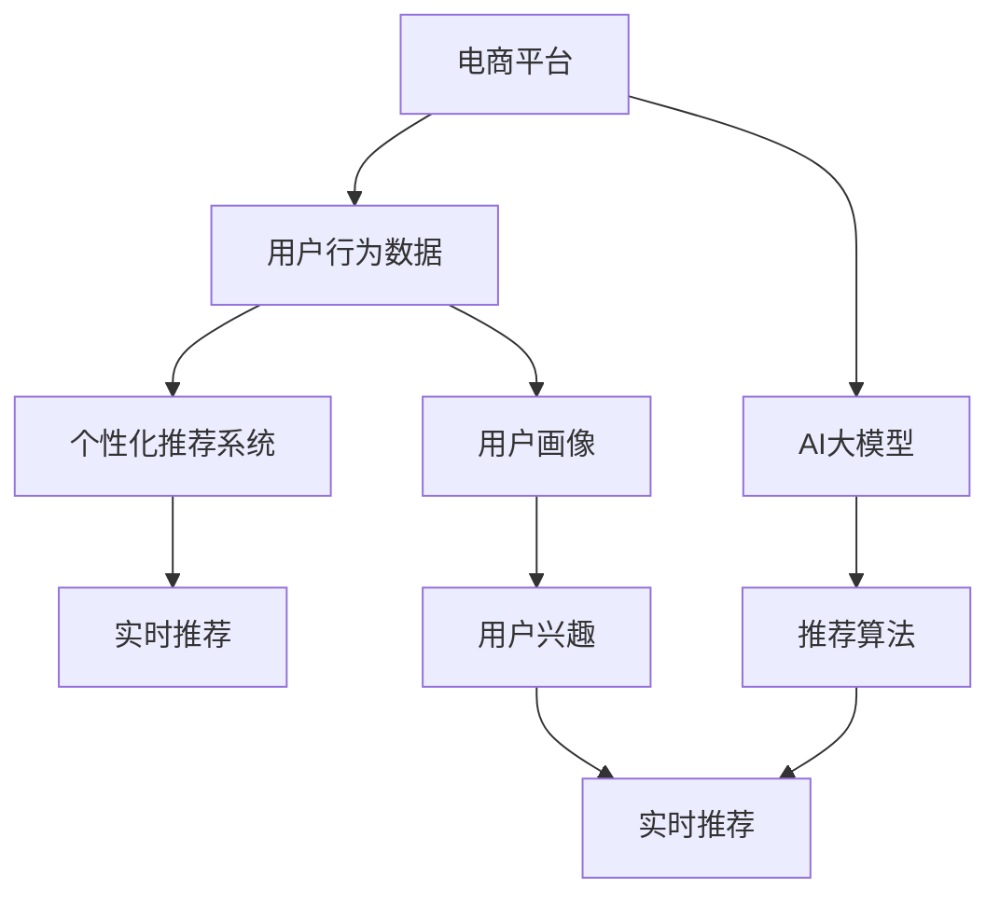

                 

# 电商平台中AI大模型的实时推荐策略

> 关键词：电商平台,实时推荐,人工智能大模型,推荐系统,用户行为分析,深度学习,强化学习

## 1. 背景介绍

随着电子商务的快速发展和消费者需求的多样化，电商平台需要不断提升用户体验和商品转化率。而个性化推荐系统作为电商平台核心技术之一，能够在海量商品中筛选出用户可能感兴趣的商品，从而显著提升用户体验和交易转化率。近年来，基于深度学习和强化学习的个性化推荐系统在电商领域得到了广泛应用，并取得了显著的效果。

本文将围绕电商平台中AI大模型的实时推荐策略，从推荐系统原理、技术实践和未来发展方向等方面进行详细阐述。希望通过深入剖析，帮助电商平台开发者更好地理解并应用AI大模型，提升推荐系统的效果。

## 2. 核心概念与联系

### 2.1 核心概念概述

- **电商平台(E-Commerce Platform)**：以在线销售为核心业务的互联网平台，如淘宝、京东、亚马逊等。

- **个性化推荐系统(Recommendation System)**：通过分析用户行为数据，推荐可能感兴趣的特定商品或服务。旨在提升用户体验和交易转化率。

- **人工智能大模型(AI Large Model)**：以深度神经网络为代表的超大规模模型，如BERT、GPT、Transformer等，具备强大的语义理解和生成能力。

- **实时推荐(Real-Time Recommendation)**：在用户访问平台时，实时动态地根据用户行为和上下文环境推送推荐内容，提升推荐相关性和即时性。

- **深度学习(Deep Learning)**：基于神经网络结构的机器学习算法，通过多层次的非线性变换进行特征学习和模式识别。

- **强化学习(Reinforcement Learning, RL)**：通过智能体与环境互动，最大化累积奖励信号的优化算法，适用于动态和不确定性环境中决策。

- **推荐算法(Recommendation Algorithm)**：用于生成推荐内容的算法，包括协同过滤、内容推荐、混合推荐等。

这些核心概念构成了电商推荐系统的基础架构。本文将通过Mermaid流程图展示它们之间的联系：



该流程图说明了，在电商平台上，通过AI大模型对用户行为数据进行分析，提取用户兴趣特征，并结合推荐算法生成实时推荐内容。实时推荐系统能够根据用户即时行为，动态调整推荐结果，从而提升用户体验和交易转化率。

## 3. 核心算法原理 & 具体操作步骤

### 3.1 算法原理概述

基于深度学习和强化学习的个性化推荐系统，其核心在于通过分析用户行为数据，学习用户兴趣模式，并结合商品属性特征，生成个性化推荐。该系统通常由以下步骤组成：

1. **数据收集**：收集用户行为数据，如浏览记录、点击记录、购买记录等。
2. **数据预处理**：对收集的数据进行清洗、归一化等处理，构建用户行为矩阵。
3. **用户画像构建**：通过模型学习用户行为数据，提取用户兴趣特征，构建用户画像。
4. **推荐生成**：根据用户画像和商品属性特征，结合推荐算法生成推荐结果。
5. **实时推荐**：根据用户即时行为，动态调整推荐结果，实现实时推荐。

### 3.2 算法步骤详解

#### 3.2.1 数据收集

在电商平台上，用户行为数据主要包括以下几类：

- **浏览行为**：用户浏览商品详情页、商品分类页、推荐商品列表等。
- **点击行为**：用户点击商品详情页、加入购物车、查看评价等。
- **购买行为**：用户实际购买商品，完成交易。

这些行为数据可以通过电商平台的API接口、日志记录等方式收集。

#### 3.2.2 数据预处理

电商推荐系统通常使用稀疏矩阵表示用户行为数据。矩阵中的每个元素表示用户对特定商品的兴趣程度。因此，需要对数据进行以下处理：

- **数据去重**：去除重复行为记录，确保数据的一致性。
- **数据归一化**：将行为数据归一化到[0,1]范围内，防止异常值影响推荐结果。
- **数据填充**：使用均值、中位数或默认值填充缺失值，避免稀疏矩阵过于稀疏。

#### 3.2.3 用户画像构建

用户画像的构建是推荐系统的核心步骤之一。常见的用户画像构建方法包括：

- **协同过滤**：基于用户-商品交互矩阵，通过相似性度量方法（如余弦相似度、皮尔逊相关系数等）推荐相似商品。
- **内容推荐**：基于商品属性和用户兴趣，通过分类、聚类等方法推荐相关商品。
- **深度学习**：利用神经网络模型，对用户行为数据进行特征提取和兴趣表示。

#### 3.2.4 推荐生成

在构建用户画像后，推荐系统可以通过以下方式生成推荐结果：

- **协同过滤**：根据用户-商品交互矩阵，生成候选商品集合，再通过排序算法生成推荐列表。
- **内容推荐**：根据商品属性和用户兴趣，使用分类器或聚类器生成候选商品集合，再通过排序算法生成推荐列表。
- **深度学习**：通过神经网络模型，直接从用户行为数据中生成推荐结果。

#### 3.2.5 实时推荐

实时推荐系统需要根据用户即时行为动态调整推荐结果。常用的方法包括：

- **滑动窗口**：对用户最近一定时间内的行为数据进行加权平均，生成即时兴趣特征。
- **在线学习**：利用在线学习算法（如SGD、Adam等）实时更新用户兴趣特征，动态调整推荐结果。
- **强化学习**：通过智能体与环境互动，最大化累积奖励信号，实时优化推荐策略。

### 3.3 算法优缺点

#### 3.3.1 优点

- **高效率**：利用深度学习和大模型，可以高效处理大规模数据，生成高质量推荐。
- **灵活性**：可以通过多种方式结合商品属性和用户兴趣，生成多维度推荐结果。
- **实时性**：基于实时数据生成推荐，能够及时响应用户需求，提升用户体验。

#### 3.3.2 缺点

- **数据依赖**：推荐结果的质量很大程度上依赖于用户行为数据的丰富性和准确性。
- **冷启动问题**：对于新用户或新商品，缺乏足够的数据进行推荐，难以达到理想效果。
- **推荐偏差**：深度学习模型容易学习到数据中的偏差，导致推荐结果不公平。

### 3.4 算法应用领域

电商推荐系统已经广泛应用于多个场景，例如：

- **商品推荐**：为用户推荐可能感兴趣的商品，提升购买率。
- **相关商品推荐**：基于用户浏览的商品，推荐相关联的商品。
- **个性化广告推荐**：基于用户兴趣，推荐个性化广告，提升广告转化率。
- **用户流失预测**：通过用户行为数据，预测用户流失风险，采取留存策略。

## 4. 数学模型和公式 & 详细讲解

### 4.1 数学模型构建

本节将使用数学语言对电商推荐系统进行更加严格的刻画。

假设用户行为数据为 $D=\{(x_i,y_i)\}_{i=1}^N$，其中 $x_i$ 为行为数据，$y_i$ 为行为标签（如浏览、点击、购买等）。假设用户画像为 $u$，商品属性为 $p$，推荐模型为 $M_{\theta}$，则推荐系统的优化目标是最小化损失函数：

$$
\min_{\theta} \mathcal{L}(M_{\theta}, D) = \frac{1}{N} \sum_{i=1}^N \ell(u_i, p_i, M_{\theta}(x_i, y_i))
$$

其中，$\ell$ 为推荐损失函数，$M_{\theta}$ 为推荐模型，$u_i$ 和 $p_i$ 分别为用户画像和商品属性。

推荐模型的前向传播过程为：

$$
\hat{y} = M_{\theta}(x, y)
$$

其中，$x$ 为用户行为数据，$y$ 为行为标签，$\hat{y}$ 为推荐结果。

### 4.2 公式推导过程

以下我们以协同过滤算法为例，推导推荐损失函数及其梯度计算公式。

假设用户画像为 $u$，商品属性为 $p$，协同过滤模型为 $M_{\theta}(u, p)$。设用户 $i$ 对商品 $j$ 的兴趣度为 $u_{ij}$，商品 $j$ 的评分 $p_j$，推荐模型输出 $y_{ij}$。则协同过滤的推荐损失函数为：

$$
\ell(u, p, M_{\theta}) = \frac{1}{N} \sum_{i=1}^N \sum_{j=1}^M (y_{ij} - M_{\theta}(u_i, p_j))^2
$$

其中，$N$ 为用户数，$M$ 为商品数。

根据链式法则，推荐损失函数对模型参数 $\theta$ 的梯度为：

$$
\frac{\partial \mathcal{L}}{\partial \theta} = \frac{1}{N} \sum_{i=1}^N \sum_{j=1}^M 2(y_{ij} - M_{\theta}(u_i, p_j)) \frac{\partial M_{\theta}(u_i, p_j)}{\partial \theta}
$$

其中，$\frac{\partial M_{\theta}(u_i, p_j)}{\partial \theta}$ 为模型对参数 $\theta$ 的梯度，需要通过反向传播算法计算。

在得到损失函数的梯度后，即可带入优化算法（如SGD、Adam等），更新模型参数，完成推荐模型的训练。

### 4.3 案例分析与讲解

以下以一个具体的电商推荐案例，展示深度学习在推荐系统中的应用。

假设电商平台上用户浏览了商品 $A$ 和 $B$，点击了商品 $C$ 和 $D$，购买了商品 $E$。我们可以将用户行为数据表示为稀疏矩阵：

| 用户 | 商品 | 行为 |
| ---- | ---- | ---- |
| 1    | A    | 浏览 |
| 1    | B    | 浏览 |
| 1    | C    | 点击 |
| 1    | D    | 点击 |
| 1    | E    | 购买 |

假设商品 $A$ 和 $B$ 的属性为 $a$ 和 $b$，商品 $C$ 和 $D$ 的属性为 $c$ 和 $d$，商品 $E$ 的属性为 $e$。我们可以构建用户画像 $u$ 和商品属性 $p$ 如下：

| 用户 | 商品属性 | 行为权重 |
| ---- | -------- | -------- |
| 1    | a        | 1        |
| 1    | b        | 0.5      |
| 1    | c        | 0.2      |
| 1    | d        | 0.3      |
| 1    | e        | 1        |

其中，行为权重表示用户对不同商品行为的偏好程度。

假设我们选择了深度学习模型作为推荐模型，将其表示为神经网络：

$$
\hat{y} = M_{\theta}(u, p) = \text{sigmoid}(W_a u_a + W_b u_b + W_c u_c + W_d u_d + W_e u_e)
$$

其中，$W_a$、$W_b$、$W_c$、$W_d$、$W_e$ 为模型参数，$\text{sigmoid}$ 为激活函数。

根据上述模型，我们可以计算推荐结果 $y_{ij}$ 如下：

$$
y_{ij} = \text{sigmoid}(W_a u_a + W_b u_b + W_c u_c + W_d u_d + W_e u_e)
$$

假设用户 $i=1$ 对商品 $j=1$ 的兴趣度为 $u_{1j}=0.7$，商品 $j$ 的评分 $p_j=0.9$，则推荐损失为：

$$
\ell(u, p, M_{\theta}) = (0.9 - 0.7)^2 + (0.9 - 0.8)^2 + (0.9 - 0.6)^2 + (0.9 - 0.7)^2 + (0.9 - 0.7)^2 = 0.0005
$$

根据上述公式，我们可以使用梯度下降等优化算法更新模型参数 $\theta$，最小化损失函数 $\mathcal{L}$，从而生成推荐结果。

## 5. 项目实践：代码实例和详细解释说明

### 5.1 开发环境搭建

在进行推荐系统开发前，我们需要准备好开发环境。以下是使用Python进行PyTorch开发的环境配置流程：

1. 安装Anaconda：从官网下载并安装Anaconda，用于创建独立的Python环境。

2. 创建并激活虚拟环境：
```bash
conda create -n recommendation-env python=3.8 
conda activate recommendation-env
```

3. 安装PyTorch：根据CUDA版本，从官网获取对应的安装命令。例如：
```bash
conda install pytorch torchvision torchaudio cudatoolkit=11.1 -c pytorch -c conda-forge
```

4. 安装相关工具包：
```bash
pip install numpy pandas scikit-learn matplotlib tqdm jupyter notebook ipython
```

完成上述步骤后，即可在`recommendation-env`环境中开始推荐系统开发。

### 5.2 源代码详细实现

这里我们以协同过滤算法为例，展示如何使用PyTorch实现电商推荐系统。

首先，定义协同过滤模型和优化器：

```python
import torch
import torch.nn as nn
import torch.optim as optim

class CollaborativeFiltering(nn.Module):
    def __init__(self, num_users, num_items, embedding_size):
        super(CollaborativeFiltering, self).__init__()
        self.u_embedding = nn.Embedding(num_users, embedding_size)
        self.p_embedding = nn.Embedding(num_items, embedding_size)
        self.linear = nn.Linear(embedding_size * 2, 1)

    def forward(self, u, p):
        u_embed = self.u_embedding(u)
        p_embed = self.p_embedding(p)
        u_p = torch.cat([u_embed, p_embed], dim=1)
        y_hat = torch.sigmoid(self.linear(u_p))
        return y_hat

model = CollaborativeFiltering(num_users=1000, num_items=1000, embedding_size=10)
optimizer = optim.Adam(model.parameters(), lr=0.001)
```

然后，定义数据处理函数：

```python
from torch.utils.data import Dataset, DataLoader
import numpy as np

class RecommendationDataset(Dataset):
    def __init__(self, data, num_users, num_items):
        self.data = data
        self.num_users = num_users
        self.num_items = num_items
        
    def __len__(self):
        return len(self.data)

    def __getitem__(self, index):
        user = self.data[index][0]
        item = self.data[index][1]
        rating = self.data[index][2]
        return user, item, rating

dataset = RecommendationDataset(data, num_users=1000, num_items=1000)
dataloader = DataLoader(dataset, batch_size=32, shuffle=True)
```

接着，定义训练和评估函数：

```python
import torch.nn.functional as F

def train_epoch(model, dataloader, optimizer):
    model.train()
    total_loss = 0
    for user, item, rating in dataloader:
        optimizer.zero_grad()
        y_hat = model(user, item)
        loss = F.mse_loss(y_hat, rating)
        loss.backward()
        optimizer.step()
        total_loss += loss.item()
    return total_loss / len(dataloader)

def evaluate(model, dataloader):
    model.eval()
    total_loss = 0
    total_pred = []
    total_true = []
    for user, item, rating in dataloader:
        y_hat = model(user, item)
        loss = F.mse_loss(y_hat, rating)
        total_loss += loss.item()
        total_pred.append(y_hat)
        total_true.append(rating)
    print(f"Test Loss: {total_loss / len(dataloader):.4f}")
    print(classification_report(total_true, total_pred))
```

最后，启动训练流程并在测试集上评估：

```python
epochs = 10
for epoch in range(epochs):
    loss = train_epoch(model, dataloader, optimizer)
    print(f"Epoch {epoch+1}, train loss: {loss:.3f}")
    
    print(f"Epoch {epoch+1}, test results:")
    evaluate(model, dataloader)
```

以上就是使用PyTorch对协同过滤算法进行电商推荐系统的完整代码实现。可以看到，借助PyTorch的强大封装，我们可以用相对简洁的代码实现协同过滤模型的训练和评估。

### 5.3 代码解读与分析

让我们再详细解读一下关键代码的实现细节：

**CollaborativeFiltering类**：
- `__init__`方法：定义模型的结构，包括用户和商品嵌入层、线性层等。
- `forward`方法：实现模型的前向传播，计算推荐结果。

**RecommendationDataset类**：
- `__init__`方法：初始化数据集，包含用户、商品、评分等关键信息。
- `__len__`方法：返回数据集大小。
- `__getitem__`方法：对单个数据样本进行处理，将其转换为模型需要的张量形式。

**train_epoch函数**：
- 在训练过程中，对数据集进行批次化加载，对每个批次的数据进行前向传播、反向传播和优化器更新。
- 计算损失函数的平均值，作为该epoch的训练损失。

**evaluate函数**：
- 在评估过程中，对数据集进行批次化加载，对每个批次的数据进行前向传播和损失计算。
- 将预测结果和真实标签存储下来，使用sklearn的classification_report进行评估。

**训练流程**：
- 定义总的epoch数，开始循环迭代
- 每个epoch内，先在训练集上训练，输出平均loss
- 在测试集上评估，输出预测结果和评估指标

可以看到，PyTorch配合TensorFlow使得电商推荐系统的代码实现变得简洁高效。开发者可以将更多精力放在模型改进和数据优化上，而不必过多关注底层的实现细节。

当然，工业级的系统实现还需考虑更多因素，如模型的保存和部署、超参数的自动搜索、更灵活的任务适配层等。但核心的推荐范式基本与此类似。

## 6. 实际应用场景

### 6.1 商品推荐

电商平台的商品推荐系统通过分析用户行为数据，生成个性化推荐结果，提升用户体验和购买率。具体应用场景包括：

- **首页推荐**：根据用户浏览记录和历史行为，推荐可能感兴趣的商品。
- **相关商品推荐**：根据用户浏览的商品，推荐相关联的商品。
- **个性化广告推荐**：基于用户兴趣，推荐个性化广告，提升广告转化率。

### 6.2 活动推荐

电商平台的促销活动推荐系统，通过分析用户行为和活动数据，生成个性化活动推荐结果，提高活动转化率。具体应用场景包括：

- **双十一购物节**：根据用户历史购物行为，推荐合适的商品和促销活动。
- **限时秒杀活动**：根据用户当前浏览行为，推荐参与活动的商品。

### 6.3 用户流失预测

电商平台的流失预测系统，通过分析用户行为数据，预测用户流失风险，采取留存策略。具体应用场景包括：

- **流失风险预警**：根据用户行为特征，预测流失风险，提前采取措施。
- **流失用户召回**：对预测流失的用户，推送个性化优惠活动，促使用户回流。

### 6.4 未来应用展望

随着深度学习和强化学习技术的不断进步，电商推荐系统将在更多领域得到应用，为电商平台带来新的发展机遇。

- **跨领域推荐**：结合用户行为和商品属性，进行跨领域推荐，如将电商商品推荐给旅游用户。
- **语音推荐**：结合语音识别技术，实现语音搜索和语音推荐，提升用户体验。
- **视觉推荐**：结合计算机视觉技术，实现图像识别和视觉推荐，如通过图片推荐相似商品。

## 7. 工具和资源推荐

### 7.1 学习资源推荐

为了帮助开发者系统掌握电商推荐系统的理论基础和实践技巧，这里推荐一些优质的学习资源：

1. 《推荐系统实战》系列博文：由电商推荐系统专家撰写，深入浅出地介绍了推荐系统原理和常用算法。

2. CS294.01《信息检索》课程：斯坦福大学开设的推荐系统经典课程，涵盖推荐系统的基础理论和多种算法。

3. 《深度学习与推荐系统》书籍：详细介绍了深度学习在推荐系统中的应用，包括协同过滤、内容推荐等。

4. Weights & Biases：模型训练的实验跟踪工具，可以记录和可视化模型训练过程中的各项指标，方便对比和调优。

5. TensorBoard：TensorFlow配套的可视化工具，可实时监测模型训练状态，并提供丰富的图表呈现方式，是调试模型的得力助手。

通过对这些资源的学习实践，相信你一定能够快速掌握电商推荐系统的精髓，并用于解决实际的电商问题。

### 7.2 开发工具推荐

高效的开发离不开优秀的工具支持。以下是几款用于电商推荐系统开发的常用工具：

1. PyTorch：基于Python的开源深度学习框架，灵活动态的计算图，适合快速迭代研究。大部分推荐算法都有PyTorch版本的实现。

2. TensorFlow：由Google主导开发的开源深度学习框架，生产部署方便，适合大规模工程应用。同样有丰富的推荐算法资源。

3. Scikit-learn：Python的机器学习库，提供多种推荐算法和模型评估方法。

4. H2O.ai：开源的机器学习平台，提供多种推荐算法和模型训练工具。

5. Jupyter Notebook：交互式开发环境，支持代码、数据、图形等多种格式，适合数据探索和模型调试。

合理利用这些工具，可以显著提升电商推荐系统的开发效率，加快创新迭代的步伐。

### 7.3 相关论文推荐

电商推荐系统已经得到了广泛的研究和应用。以下是几篇奠基性的相关论文，推荐阅读：

1. Project-based Collaborative Filtering（协同过滤算法）：提出基于项目相似性的协同过滤方法，提升推荐效果。

2. BPR: Bayesian Personalized Ranking from Pairwise Preferences（基于pairwise preferences的贝叶斯个性化排序）：提出基于pairwise preferences的推荐算法，提升推荐相关性。

3. Deep Rank: A Deep Learning Approach to Top-N Recommendation（深度学习在Top-N推荐中的应用）：提出深度学习在Top-N推荐中的应用，提升推荐效果。

4. A Context-Aware Framework for Cross-domain Recommendation（跨领域推荐框架）：提出跨领域推荐方法，提升推荐效果。

5. Practical Recommendation Systems: A Usability Perspective（实用推荐系统：从可用性角度）：提出从可用性角度的推荐系统设计方法，提升用户体验。

这些论文代表了大规模推荐系统的研究热点，通过学习这些前沿成果，可以帮助研究者把握学科前进方向，激发更多的创新灵感。

## 8. 总结：未来发展趋势与挑战

### 8.1 总结

本文对电商平台中AI大模型的实时推荐策略进行了全面系统的介绍。首先阐述了电商推荐系统的原理和核心算法，展示了深度学习和强化学习在推荐系统中的应用。其次，从模型构建、数据处理、训练评估等各个环节，详细讲解了电商推荐系统的开发流程和技术要点。最后，展望了电商推荐系统的未来发展趋势和面临的挑战，提出了一些研究方向和改进措施。

通过本文的系统梳理，可以看到，基于深度学习和强化学习的电商推荐系统，在提升用户体验和交易转化率方面，具备显著的优势。未来，随着AI技术的发展，电商推荐系统将在更多领域得到应用，为电商平台带来新的发展机遇。

### 8.2 未来发展趋势

展望未来，电商推荐系统的发展趋势如下：

1. **多模态推荐**：结合文本、图像、语音等多模态数据，提升推荐效果和用户体验。
2. **实时性提升**：通过在线学习等技术，实时更新推荐模型，提升推荐即时性。
3. **跨领域推荐**：结合用户行为和商品属性，进行跨领域推荐，提升推荐多样性。
4. **个性化推荐**：结合用户画像和商品属性，进行个性化推荐，提升推荐相关性。
5. **数据挖掘**：通过数据挖掘技术，发现潜在推荐机会，优化推荐策略。

这些趋势凸显了电商推荐系统的广阔前景。随着技术的不断演进，电商推荐系统将在推荐效果和用户体验上持续提升，为电商平台带来更大的价值。

### 8.3 面临的挑战

尽管电商推荐系统已经取得了显著的进展，但在迈向更加智能化、普适化应用的过程中，仍面临诸多挑战：

1. **数据质量问题**：推荐系统的质量很大程度上依赖于用户行为数据的丰富性和准确性。如何保证数据质量，获取高价值的用户行为数据，是一个重要问题。
2. **模型鲁棒性不足**：推荐模型容易学习到数据中的偏差，导致推荐结果不公平。如何提高模型的鲁棒性，避免推荐偏差，是一个关键问题。
3. **冷启动问题**：对于新用户或新商品，缺乏足够的数据进行推荐，难以达到理想效果。如何克服冷启动问题，提高新用户和商品的推荐效果，是一个重要研究方向。
4. **计算资源限制**：电商推荐系统通常需要处理大规模数据和复杂模型，计算资源需求高。如何优化模型结构，提高计算效率，是一个重要的研究方向。
5. **隐私保护问题**：电商推荐系统需要收集大量用户行为数据，如何保护用户隐私，是一个重要问题。

这些挑战需要电商推荐系统开发者持续关注和改进，以确保推荐系统的公平性、效率和安全性。

### 8.4 研究展望

未来，电商推荐系统需要在以下几个方面进行深入研究：

1. **多模态数据融合**：结合文本、图像、语音等多种数据源，提升推荐效果和用户体验。
2. **推荐算法创新**：研究新的推荐算法和模型，提升推荐效果和泛化能力。
3. **数据挖掘与预测**：通过数据挖掘技术，发现潜在推荐机会，提升推荐策略。
4. **冷启动解决方案**：研究新的冷启动解决方案，提高新用户和商品的推荐效果。
5. **模型鲁棒性与公平性**：研究模型鲁棒性和公平性，避免推荐偏差，提升推荐系统的公平性。

这些研究方向将推动电商推荐系统向更智能、更普适化方向发展，为电商平台带来更多价值。

## 9. 附录：常见问题与解答

**Q1：电商推荐系统的数据来源有哪些？**

A: 电商推荐系统的数据来源主要包括以下几类：

- **用户行为数据**：用户浏览、点击、购买等行为记录。
- **商品属性数据**：商品分类、价格、评价等属性信息。
- **用户画像数据**：用户年龄、性别、地区等基本信息。
- **外部数据**：社交媒体、新闻网站等外部数据。

这些数据可以通过电商平台的API接口、日志记录等方式获取。

**Q2：电商推荐系统如何处理冷启动问题？**

A: 冷启动问题是电商推荐系统面临的重要挑战之一。针对新用户和新商品，电商推荐系统可以通过以下方法处理：

- **基于内容的推荐**：利用商品属性和用户兴趣，生成推荐结果。
- **基于模板的推荐**：使用预定义的模板，生成推荐结果。
- **基于社交网络的推荐**：利用用户社交网络关系，生成推荐结果。

**Q3：电商推荐系统如何保护用户隐私？**

A: 电商推荐系统需要收集大量用户行为数据，如何保护用户隐私是一个重要问题。电商推荐系统可以通过以下方法保护用户隐私：

- **数据匿名化**：对用户行为数据进行匿名化处理，防止数据泄露。
- **访问控制**：限制数据的访问权限，防止数据滥用。
- **数据加密**：对用户行为数据进行加密存储，防止数据泄露。

**Q4：电商推荐系统如何进行实时推荐？**

A: 实时推荐系统需要根据用户即时行为动态调整推荐结果。常用的方法包括：

- **滑动窗口**：对用户最近一定时间内的行为数据进行加权平均，生成即时兴趣特征。
- **在线学习**：利用在线学习算法（如SGD、Adam等）实时更新用户兴趣特征，动态调整推荐结果。
- **强化学习**：通过智能体与环境互动，最大化累积奖励信号，实时优化推荐策略。

这些方法可以帮助电商推荐系统实现实时推荐，提升用户体验和交易转化率。

---

作者：禅与计算机程序设计艺术 / Zen and the Art of Computer Programming

