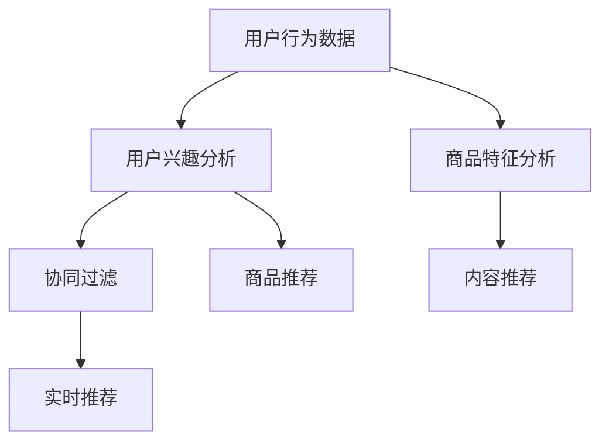

                 

# 电商平台中AI推荐算法的实现方案

> 关键词：推荐算法,电商平台,深度学习,用户行为分析,协同过滤,深度神经网络,内容推荐,商品推荐,实时推荐

## 1. 背景介绍

在现代电商平台上，如何通过智能化推荐系统提升用户体验、增加用户粘性、提高销售额，是一个长期关注的问题。AI推荐算法通过分析用户历史行为数据，预测用户偏好，实时推荐商品或内容，极大地改善了用户体验和平台转化率。本文将详细介绍电商平台中AI推荐算法的实现方案，覆盖推荐系统的核心概念、算法原理、实际应用及未来展望。

## 2. 核心概念与联系

### 2.1 核心概念概述

要理解电商平台的AI推荐算法，首先需要了解几个核心概念：

- **推荐系统(Recommender System)**：根据用户的历史行为数据和商品特征，预测用户对不同商品的兴趣，从而推荐出最符合用户需求的商品或内容。
- **协同过滤(Collaborative Filtering)**：一种基于用户行为数据的推荐算法，通过用户之间的相似性进行推荐，分为基于用户的协同过滤和基于商品的协同过滤。
- **深度学习(Deep Learning)**：利用神经网络对高维数据进行特征提取和分类，可以处理大规模数据，适应性更强，推荐效果更好。
- **用户行为分析(User Behavior Analysis)**：分析用户浏览、点击、购买等行为数据，提取用户兴趣点和偏好。
- **内容推荐(Content-Based Recommendation)**：通过分析商品的属性特征，如价格、分类、描述等，直接推荐符合用户兴趣的商品。
- **商品推荐(Product Recommendation)**：在内容推荐基础上，结合用户行为数据，实现更加个性化的推荐。
- **实时推荐(Real-Time Recommendation)**：根据用户当前行为实时调整推荐内容，提升推荐的相关性和时效性。

这些概念之间存在紧密的联系：协同过滤和深度学习算法都是用户行为分析的重要工具，用户行为分析是内容推荐和商品推荐的基础，而实时推荐则是提高推荐系统时效性的关键。

### 2.2 核心概念原理和架构的 Mermaid 流程图



这个流程图展示了电商推荐系统中的核心组件及其相互关系：

1. **用户行为数据**：收集用户的浏览、点击、购买等数据。
2. **用户兴趣分析**：通过协同过滤和深度学习算法，分析用户的历史行为数据，提取用户兴趣点和偏好。
3. **商品特征分析**：对商品的属性、价格、分类等特征进行分析。
4. **协同过滤**：基于用户行为数据，推荐与用户兴趣相似的商品。
5. **内容推荐**：直接根据商品特征推荐符合用户兴趣的商品。
6. **商品推荐**：结合用户行为和商品特征，实现更加个性化的推荐。
7. **实时推荐**：根据用户当前行为实时调整推荐内容。

## 3. 核心算法原理 & 具体操作步骤

### 3.1 算法原理概述

电商平台的AI推荐算法主要分为基于协同过滤和深度学习的两种方法。基于协同过滤的推荐算法主要包括用户协同过滤和商品协同过滤，而深度学习算法则包括基于矩阵分解的推荐方法和基于神经网络的推荐方法。

- **协同过滤**：通过计算用户或商品之间的相似性，推荐相似用户或商品喜欢的商品。其基本公式为：
  $$
  \text{推荐商品} = \text{相似度} \times \text{用户/商品偏好}
  $$
- **矩阵分解**：将用户和商品的交互数据表示为矩阵，通过分解矩阵得到用户和商品的潜在特征，从而进行推荐。常用算法包括奇异值分解(SVD)和基于矩阵分解的PMI算法。
- **神经网络推荐**：利用深度神经网络，对用户行为数据进行特征提取和分类，直接输出推荐结果。常见模型包括基于卷积神经网络(CNN)的推荐系统和基于循环神经网络(RNN)的推荐系统。

### 3.2 算法步骤详解

以下是推荐算法的详细步骤：

**Step 1: 数据预处理**

- 收集用户历史行为数据，如浏览记录、购买记录等。
- 对商品信息进行结构化处理，提取商品的属性、价格等特征。
- 对数据进行清洗、去重、填充缺失值等预处理。

**Step 2: 特征工程**

- 对用户行为和商品特征进行特征提取，如统计用户浏览时长、商品价格区间等。
- 利用自然语言处理技术，对用户评论、商品描述等文本数据进行分词、向量化等处理。

**Step 3: 模型训练**

- 选择合适的算法进行训练，如协同过滤、深度学习等。
- 在训练数据上训练模型，优化模型参数，提高推荐准确性。
- 进行交叉验证，评估模型性能，避免过拟合。

**Step 4: 推荐结果生成**

- 将新用户或商品的信息输入到训练好的模型中，得到推荐结果。
- 结合实时数据，动态调整推荐结果，提高推荐相关性。

**Step 5: 结果评估**

- 通过离线测试集和A/B测试，评估推荐模型的效果。
- 监控推荐系统的点击率、转化率等指标，优化推荐策略。

**Step 6: 部署与维护**

- 将训练好的模型部署到生产环境，实时生成推荐结果。
- 持续收集用户反馈数据，定期更新模型，优化推荐效果。

### 3.3 算法优缺点

基于协同过滤和深度学习的推荐算法各有优缺点：

协同过滤算法的优点：
- 适用于数据稀疏的情况，用户和商品相似性分析简单直观。
- 实时性好，推荐速度较快。

协同过滤算法的缺点：
- 对新用户的推荐效果较差，无法处理冷启动问题。
- 对异常用户或商品的推荐结果可能偏差较大。

深度学习算法的优点：
- 能够处理高维稀疏数据，推荐效果较好。
- 具有较好的泛化能力，适用于大规模数据。

深度学习算法的缺点：
- 训练复杂度较高，对计算资源要求较高。
- 模型复杂度高，难以解释推荐结果。

### 3.4 算法应用领域

推荐算法在电商平台中的应用非常广泛，涵盖以下领域：

- **商品推荐**：根据用户历史行为数据，实时推荐用户可能感兴趣的商品。
- **内容推荐**：推荐新闻、文章、视频等与用户兴趣相关的内容。
- **广告推荐**：通过分析用户行为，推荐用户可能感兴趣的广告。
- **个性化推荐**：根据用户属性、行为、历史偏好等，提供个性化推荐服务。
- **搜索推荐**：在用户输入搜索关键词后，实时推荐相关的商品或内容。
- **活动推荐**：推荐用户可能感兴趣的促销活动、优惠券等。
- **跨领域推荐**：跨平台、跨品类的推荐，如跨电商、视频、音乐等平台推荐商品或内容。

## 4. 数学模型和公式 & 详细讲解 & 举例说明

### 4.1 数学模型构建

电商推荐系统中的数学模型主要包括以下几类：

- **用户行为模型**：描述用户行为数据的数学模型，如基于隐马尔可夫模型的用户行为预测。
- **商品模型**：描述商品特征的数学模型，如基于词嵌入的商品描述。
- **协同过滤模型**：描述用户和商品之间相似性的数学模型，如基于矩阵分解的协同过滤算法。
- **深度学习模型**：描述用户行为和商品特征的深度神经网络模型，如基于CNN的推荐系统。

### 4.2 公式推导过程

以基于协同过滤的推荐算法为例，推导推荐公式：

假设用户集为$U$，商品集为$I$，用户$u$对商品$i$的评分$R_{ui}$已知，推荐算法目标是最大化用户$u$的兴趣函数$V_u$：

$$
V_u = \sum_{i \in I} \alpha_i R_{ui} \phi_{ui}
$$

其中$\alpha_i$为商品$i$的权重，$\phi_{ui}$为用户$u$对商品$i$的兴趣函数。

协同过滤算法中，$V_u$可以表示为用户$u$与其相似用户$v$的兴趣函数之和：

$$
V_u = \sum_{v \in U} w_{uv} V_v
$$

其中$w_{uv}$为用户$u$和用户$v$之间的相似度权重，$V_v$为用户$v$的兴趣函数。

将上述两个公式结合起来，可以得到基于协同过滤的推荐公式：

$$
V_u = \sum_{i \in I} \alpha_i \sum_{v \in U} w_{uv} R_{vi} \phi_{vi}
$$

其中$R_{vi}$为用户$v$对商品$i$的评分，$\phi_{vi}$为用户$v$的兴趣函数。

### 4.3 案例分析与讲解

以一个具体的推荐案例为例，说明推荐算法的实现过程：

假设一个电商平台中有用户$u_1$、$u_2$，商品$i_1$、$i_2$。已知用户$u_1$和$u_2$对商品$i_1$、$i_2$的评分分别为$R_{u1i1}=4$、$R_{u1i2}=5$、$R_{u2i1}=5$、$R_{u2i2}=4$。假设用户$u_1$和$u_2$的相似度为$w_{12}=0.9$，用户$u_1$对商品$i_1$的兴趣函数为$\phi_{u1i1}=0.8$、$\phi_{u1i2}=0.7$，用户$u_2$对商品$i_1$的兴趣函数为$\phi_{u2i1}=0.6$、$\phi_{u2i2}=0.8$。则推荐算法可以计算出用户$u_1$对商品$i_2$的推荐结果为：

$$
V_{u1} = 0.8 \times 0.9 \times (0.6 \times 5 + 0.8 \times 4) = 13.92
$$

通过排序，推荐商品$i_2$给用户$u_1$。

## 5. 项目实践：代码实例和详细解释说明

### 5.1 开发环境搭建

在进行推荐算法实践前，我们需要准备好开发环境。以下是使用Python进行TensorFlow开发的环境配置流程：

1. 安装Anaconda：从官网下载并安装Anaconda，用于创建独立的Python环境。

2. 创建并激活虚拟环境：
```bash
conda create -n tf-env python=3.8 
conda activate tf-env
```

3. 安装TensorFlow：从官网获取对应的安装命令，并安装版本2.x：
```bash
conda install tensorflow=2.6 -c conda-forge
```

4. 安装相关依赖库：
```bash
pip install pandas numpy scikit-learn
```

5. 安装TensorBoard：用于可视化模型训练过程，方便调试和优化：
```bash
pip install tensorboard
```

完成上述步骤后，即可在`tf-env`环境中开始推荐算法实践。

### 5.2 源代码详细实现

这里我们以基于矩阵分解的协同过滤算法为例，给出使用TensorFlow实现的代码。

首先，定义协同过滤模型的输入和输出：

```python
import tensorflow as tf

# 定义用户和商品的特征矩阵
user_embedding_dim = 10
item_embedding_dim = 10

user_features = tf.placeholder(tf.float32, [None, user_embedding_dim])
item_features = tf.placeholder(tf.float32, [None, item_embedding_dim])
ratings = tf.placeholder(tf.float32, [None])

# 定义用户和商品的嵌入矩阵
user_matrix = tf.Variable(tf.random_normal([num_users, user_embedding_dim]))
item_matrix = tf.Variable(tf.random_normal([num_items, item_embedding_dim]))

# 定义用户-商品相似度矩阵
user_item_similarity = tf.matmul(user_matrix, item_matrix, transpose_b=True)
user_item_similarity = tf.reduce_sum(tf.multiply(user_item_similarity, ratings), axis=2)

# 定义推荐结果
user_recommendations = tf.matmul(user_features, item_matrix, transpose_a=True) * user_item_similarity
user_recommendations = tf.nn.softmax(user_recommendations)
```

接着，定义模型的训练过程：

```python
# 定义损失函数
loss = tf.reduce_mean(tf.nn.softmax_cross_entropy_with_logits(labels=tf.reshape(ratings, [-1]), logits=user_recommendations))

# 定义优化器
optimizer = tf.train.AdamOptimizer(learning_rate=0.001)

# 定义训练操作
train_op = optimizer.minimize(loss)

# 定义评估指标
correct_predictions = tf.equal(tf.argmax(user_recommendations, 1), tf.argmax(ratings, 1))
accuracy = tf.reduce_mean(tf.cast(correct_predictions, tf.float32))
```

最后，启动训练流程并生成推荐结果：

```python
num_epochs = 100
num_steps = 1000

with tf.Session() as sess:
    sess.run(tf.global_variables_initializer())
    for epoch in range(num_epochs):
        for step in range(num_steps):
            user_data, item_data, rating_data = load_data()
            _, loss_value = sess.run([train_op, loss], feed_dict={user_features: user_data, item_features: item_data, ratings: rating_data})
            if step % 100 == 0:
                acc = sess.run(accuracy, feed_dict={user_features: user_data, item_features: item_data, ratings: rating_data})
                print("Epoch {} Step {} Loss {:.4f} Accuracy {:.4f}".format(epoch, step, loss_value, acc))

    # 生成推荐结果
    user_data = load_data(user_id)
    item_data = load_data(item_id)
    recommendations = sess.run(user_recommendations, feed_dict={user_features: user_data, item_features: item_data})
    top_n = recommendations.argsort()[-10]
    top_items = item_data[top_n]
    print("Recommended items for user {}: {}".format(user_id, top_items))
```

以上是使用TensorFlow实现基于矩阵分解的协同过滤算法的完整代码。代码中使用了TensorFlow的基本API，包括占位符、变量、矩阵乘法、softmax等，实现了模型的训练和推荐结果的生成。

### 5.3 代码解读与分析

让我们再详细解读一下关键代码的实现细节：

**用户和商品特征矩阵定义**：
- 使用`tf.placeholder`定义输入数据，用于训练和测试。
- 定义用户和商品的嵌入矩阵`user_matrix`和`item_matrix`，初始化为随机矩阵。
- 计算用户-商品相似度矩阵`user_item_similarity`，使用矩阵乘法和权重向量相乘。

**模型训练**：
- 定义损失函数`loss`，使用交叉熵损失函数计算预测结果与真实标签之间的差异。
- 定义优化器`optimizer`，使用Adam优化器更新模型参数。
- 定义训练操作`train_op`，通过`optimizer.minimize(loss)`更新模型参数。

**模型评估**：
- 定义评估指标`accuracy`，计算预测结果与真实标签之间的匹配率。
- 在训练过程中，每100步输出一次训练损失和评估准确率。

**生成推荐结果**：
- 使用`load_data`函数加载用户和商品的历史数据。
- 使用`tf.argmax`函数获取推荐结果中评分最高的商品。
- 输出前10个推荐商品。

通过以上代码，我们可以看到，TensorFlow可以很方便地实现基于协同过滤的推荐算法，并根据输入数据动态生成推荐结果。

## 6. 实际应用场景

### 6.1 商品推荐系统

商品推荐系统是电商平台的核心功能之一。通过推荐算法，电商平台能够向用户推荐最符合其兴趣的商品，提升用户体验和销售额。推荐系统可以部署在网站首页、购物车、搜索结果页等多个位置，帮助用户发现更多感兴趣的商品。

在实际应用中，推荐算法可以结合用户历史行为数据和商品特征，实时生成推荐结果。例如，某用户在浏览某件商品时，系统可以根据其浏览历史和其他用户的推荐信息，生成该用户可能感兴趣的相似商品列表。通过动态调整推荐策略，可以实现个性化推荐，提高推荐效果。

### 6.2 广告推荐系统

广告推荐系统通过分析用户行为数据，推荐用户可能感兴趣的广告，实现精准广告投放，提高广告投放效果。广告推荐系统可以部署在平台首页、搜索结果页、APP推送等多个位置，帮助广告主精准触达目标用户。

在实际应用中，广告推荐算法可以结合用户历史行为数据和广告特征，实时生成推荐结果。例如，某用户在浏览某件商品时，系统可以根据其浏览历史和其他用户的推荐信息，生成该用户可能感兴趣的相关广告。通过动态调整推荐策略，可以实现个性化广告推荐，提高广告点击率和转化率。

### 6.3 内容推荐系统

内容推荐系统通过分析用户行为数据和内容特征，推荐用户可能感兴趣的文章、视频、新闻等，实现个性化内容推荐。内容推荐系统可以部署在平台首页、新闻推荐页、视频推荐页等多个位置，帮助用户发现更多感兴趣的内容。

在实际应用中，内容推荐算法可以结合用户历史行为数据和内容特征，实时生成推荐结果。例如，某用户在阅读某篇文章时，系统可以根据其阅读历史和其他用户的推荐信息，生成该用户可能感兴趣的相关文章。通过动态调整推荐策略，可以实现个性化内容推荐，提高用户粘性和平台流量。

### 6.4 未来应用展望

未来，电商平台的推荐系统将继续向着更加智能化、个性化的方向发展。基于深度学习的推荐算法将成为主流，能够更好地处理高维稀疏数据，实现更加精准的推荐。同时，跨平台、跨品类的推荐也将成为新的热点，帮助用户在不同场景下发现更多感兴趣的商品或内容。

随着推荐系统的发展，将带来更多的商业价值和社会效益。例如，通过推荐系统，电商平台可以实现更高的用户满意度、更高的销售额、更好的客户体验，进而推动整个电商行业的健康发展。

## 7. 工具和资源推荐

### 7.1 学习资源推荐

为了帮助开发者系统掌握推荐系统的理论基础和实践技巧，这里推荐一些优质的学习资源：

1. 《推荐系统实战》书籍：介绍了推荐系统的基本原理、算法实现、应用场景等，适合初学者和从业者阅读。
2. 《深度学习与推荐系统》在线课程：由清华大学开设的NLP课程，介绍了深度学习在推荐系统中的应用。
3. Coursera《Recommender Systems》课程：由密歇根大学开设的推荐系统课程，介绍了协同过滤、深度学习等多种推荐算法。
4. Kaggle推荐系统竞赛：通过实际竞赛，深入理解推荐系统的应用场景和优化方法。
5. Arxiv推荐系统论文：查看最新推荐系统研究论文，了解前沿技术和趋势。

通过对这些资源的学习实践，相信你一定能够快速掌握推荐系统的精髓，并用于解决实际的推荐问题。

### 7.2 开发工具推荐

高效的开发离不开优秀的工具支持。以下是几款用于推荐系统开发的常用工具：

1. TensorFlow：由Google主导开发的深度学习框架，支持大规模深度学习模型的训练和部署。
2. PyTorch：由Facebook主导的深度学习框架，支持动态计算图和高效的模型训练。
3. Apache Spark：支持大规模数据处理和机器学习任务，适合处理大规模推荐数据。
4. Scikit-learn：提供机器学习算法和数据处理工具，适合快速实现推荐系统算法。
5. H2O.ai：支持深度学习和机器学习算法的开源平台，适合快速实现推荐系统。

合理利用这些工具，可以显著提升推荐系统的开发效率，加快创新迭代的步伐。

### 7.3 相关论文推荐

推荐系统的发展源于学界的持续研究。以下是几篇奠基性的相关论文，推荐阅读：

1. "Collaborative Filtering for Implicit Feedback Datasets"（隐式反馈数据集上的协同过滤）：提出了基于矩阵分解的协同过滤算法。
2. "The Matrix Factorization Approach for Recommender Systems"（矩阵分解方法用于推荐系统）：介绍了矩阵分解算法的原理和实现。
3. "Wide & Deep Learning for Recommender Systems"（推荐系统中的宽与深学习）：提出了结合深度学习和宽特征的推荐算法。
4. "Deep Neural Networks for Collaborative Filtering"（深度神经网络用于协同过滤）：介绍了深度神经网络在推荐系统中的应用。
5. "A Deep Learning Approach for Recommender Systems"（深度学习用于推荐系统）：介绍了深度学习在推荐系统中的多种应用方法。

这些论文代表了大推荐系统的研究脉络。通过学习这些前沿成果，可以帮助研究者把握推荐系统的发展方向，激发更多的创新灵感。

## 8. 总结：未来发展趋势与挑战

### 8.1 总结

本文对电商平台中AI推荐算法的实现方案进行了全面系统的介绍。首先阐述了推荐系统的核心概念和算法原理，明确了协同过滤和深度学习在推荐系统中的重要地位。其次，从原理到实践，详细讲解了推荐算法的实现步骤和关键代码实现。同时，本文还广泛探讨了推荐算法在电商、广告、内容等多个领域的应用前景，展示了推荐系统的广阔应用空间。

通过本文的系统梳理，可以看到，基于深度学习的推荐算法已经在电商平台中得到广泛应用，极大地提升了用户体验和平台转化率。未来，伴随推荐算法和推荐系统的不断演进，推荐技术将在更广阔的应用领域发挥更大的作用，带来更深刻的商业和社会价值。

### 8.2 未来发展趋势

展望未来，推荐系统的发展趋势将更加智能化、个性化：

1. 推荐系统将更加智能。深度学习算法的不断发展，使得推荐系统能够处理更加复杂和多样的数据，实现更加精准的推荐。
2. 推荐系统将更加个性化。通过分析用户行为和兴趣，推荐系统能够提供更加个性化的推荐内容，提升用户粘性和满意度。
3. 推荐系统将更加实时。实时推荐系统能够根据用户当前行为实时调整推荐结果，提高推荐相关性和时效性。
4. 推荐系统将更加多样。跨平台、跨品类的推荐系统将带来更多商业机会和用户价值。
5. 推荐系统将更加高效。通过模型压缩、计算优化等技术，推荐系统将实现更高的效率和更低成本。

这些趋势凸显了推荐系统在电商、广告、内容等领域的重要性。未来的推荐系统将继续推动电商行业的健康发展，提升用户体验，带来更多的商业价值和社会效益。

### 8.3 面临的挑战

尽管推荐系统已经取得了一定的进展，但在迈向更加智能化、个性化的过程中，仍面临诸多挑战：

1. 数据稀疏和冷启动问题。对于新用户和新商品，难以获得充足的数据进行推荐，需要采用协同过滤等算法。
2. 模型复杂度和训练成本。深度学习模型虽然效果好，但训练复杂度较高，对计算资源要求较高。
3. 推荐结果的可解释性。推荐系统通常是"黑盒"系统，难以解释推荐结果的逻辑和机制。
4. 推荐系统的公平性。推荐算法可能存在偏见，对不同用户和商品推荐结果不公平。
5. 推荐系统的安全性。推荐系统可能受到恶意攻击，产生虚假推荐结果。

解决这些挑战，需要学术界和工业界共同努力，通过改进算法、优化模型、提升数据质量等手段，实现更加高效、公正、安全的推荐系统。

### 8.4 研究展望

面对推荐系统面临的诸多挑战，未来的研究需要在以下几个方面寻求新的突破：

1. 探索基于稀疏数据的推荐算法。针对数据稀疏和冷启动问题，探索新的协同过滤算法和深度学习算法。
2. 开发高效低成本的推荐系统。通过模型压缩、量化等技术，实现更低成本、更高效率的推荐系统。
3. 提高推荐结果的可解释性。引入可解释性技术，提升推荐系统的透明度和可信度。
4. 增强推荐系统的公平性。引入公平性约束，保证推荐系统的公平性和公正性。
5. 保障推荐系统的安全性。引入安全机制，防止恶意攻击和虚假推荐。

这些研究方向的探索，将推动推荐系统技术的发展，为电商、广告、内容等多个领域带来新的突破。未来，推荐系统将成为推动电商行业数字化转型、智能化升级的重要工具，为社会带来更多的商业价值和用户体验。

## 9. 附录：常见问题与解答

**Q1：推荐系统为什么需要冷启动问题？**

A: 冷启动问题是指推荐系统在面对新用户或新商品时，无法获得足够的历史行为数据，从而无法进行有效的推荐。在电商平台中，新用户和新商品往往带来更多的商业机会，但如何高效地推荐给这些用户和商品，是一个挑战。解决冷启动问题的方法包括协同过滤和基于深度学习的推荐算法，但这些方法都需要大量的用户行为数据进行训练。

**Q2：深度学习在推荐系统中的优势是什么？**

A: 深度学习在推荐系统中的优势主要包括：
1. 能够处理高维稀疏数据，推荐效果较好。
2. 具有较好的泛化能力，适用于大规模数据。
3. 可以通过预训练学习用户和商品的特征表示，提高推荐相关性。

**Q3：推荐系统在实际应用中需要注意哪些问题？**

A: 推荐系统在实际应用中需要注意以下几个问题：
1. 用户隐私保护。确保用户数据安全，防止数据泄露和滥用。
2. 推荐系统的公平性。推荐算法可能存在偏见，对不同用户和商品推荐结果不公平。
3. 推荐系统的实时性。推荐系统需要实时响应用户行为，及时调整推荐结果。
4. 推荐系统的可解释性。推荐系统通常是"黑盒"系统，难以解释推荐结果的逻辑和机制。

**Q4：推荐系统的优化方向有哪些？**

A: 推荐系统的优化方向主要包括以下几个方面：
1. 数据质量优化。提高数据采集和标注质量，增强推荐系统效果。
2. 模型优化。改进算法和模型结构，提高推荐系统性能。
3. 硬件优化。通过优化硬件配置，提高推荐系统效率。
4. 用户体验优化。提高推荐系统的个性化和互动性，提升用户体验。
5. 系统可靠性优化。增强推荐系统的稳定性和鲁棒性，确保系统可靠运行。

通过以上优化措施，可以提升推荐系统的性能和用户体验，实现更加高效和智能的推荐服务。

---

作者：禅与计算机程序设计艺术 / Zen and the Art of Computer Programming

