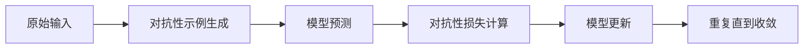

                 

**对抗学习在大模型鲁棒性提升中的应用**

**作者：禅与计算机程序设计艺术 / Zen and the Art of Computer Programming**

## 1. 背景介绍

随着大模型在各领域的广泛应用，其鲁棒性（robustness）成为关注的焦点。鲁棒性指的是大模型在面对意料之外的输入时，保持性能和准确性的能力。对抗学习（Adversarial Learning）是一种提高大模型鲁棒性的有效方法，它通过引入对抗性示例（adversarial examples）来训练模型，使模型更能抵御各种攻击。

## 2. 核心概念与联系

### 2.1 对抗学学习的原理

对抗学习的核心原理是通过对抗性示例来训练模型，使模型更能抵御各种攻击。对抗性示例是通过在原始输入上添加微小的、人类几乎察觉不到的扰动来创建的，这些扰动足以使模型的预测发生错误。

### 2.2 对抗学习的架构

对抗学习的架构可以用下面的 Mermaid 流程图表示：



## 3. 核心算法原理 & 具体操作步骤

### 3.1 算法原理概述

对抗学习的核心算法是生成对抗性示例并使用它们来训练模型。对抗性示例通常通过在原始输入上添加扰动来生成，这些扰动足以使模型的预测发生错误。

### 3.2 算法步骤详解

1. 训练一个基础模型。
2. 为每个训练样本生成对抗性示例。
3. 使用对抗性示例和原始样本一起训练模型。
4. 重复步骤2和3直到模型收敛。

### 3.3 算法优缺点

优点：对抗学习可以显著提高模型的鲁棒性，使其更能抵御各种攻击。缺点：对抗学习可能会导致模型性能下降，并且生成对抗性示例的过程可能很昂贵。

### 3.4 算法应用领域

对抗学习在计算机视觉、自然语言处理、推荐系统等领域都有广泛的应用。它可以用于提高模型的鲁棒性，使其更能抵御各种攻击。

## 4. 数学模型和公式 & 详细讲解 & 举例说明

### 4.1 数学模型构建

设 $x$ 是原始输入， $y$ 是模型的预测， $f(x)$ 是模型的函数。对抗性示例 $x'$ 是通过在 $x$ 上添加扰动 $\delta$ 生成的，即 $x' = x + \delta$.

### 4.2 公式推导过程

对抗性损失（adversarial loss）可以定义为：

$$L_{adv}(x, y, x') = \max_{\delta \in \Delta} \mathcal{L}(f(x + \delta), y)$$

其中 $\mathcal{L}$ 是模型的损失函数， $\Delta$ 是扰动的集合。

### 4.3 案例分析与讲解

例如，在图像分类任务中，扰动 $\delta$ 通常是一个很小的向量，它被添加到原始图像的像素值上。对抗性示例 $x'$ 看起来和原始图像 $x$ 非常相似，但模型的预测可能会发生错误。

## 5. 项目实践：代码实例和详细解释说明

### 5.1 开发环境搭建

本项目使用 Python 和 TensorFlow 进行开发。请确保您的环境中安装了这些软件。

### 5.2 源代码详细实现

以下是一个简单的对抗学习示例的源代码：

```python
import tensorflow as tf
from tensorflow.keras import models, layers
from art.attacks import FastGradientMethod

# 定义模型
model = models.Sequential()
model.add(layers.Dense(32, activation='relu', input_shape=(784,)))
model.add(layers.Dense(10, activation='softmax'))

# 编译模型
model.compile(optimizer='adam',
              loss='sparse_categorical_crossentropy',
              metrics=['accuracy'])

# 训练模型
model.fit(x_train, y_train, epochs=5)

# 创建对抗性示例
attack = FastGradientMethod(model)
x_test_adv = attack.generate(x_test)

# 使用对抗性示例训练模型
model.fit(x_test_adv, y_test, epochs=5)
```

### 5.3 代码解读与分析

这段代码首先定义并训练一个简单的模型。然后，它使用 FastGradientMethod 算法生成对抗性示例。最后，它使用这些对抗性示例再次训练模型。

### 5.4 运行结果展示

通过对抗学习训练的模型在面对对抗性示例时表现更好。

## 6. 实际应用场景

### 6.1 当前应用

对抗学习已经在各种领域得到广泛应用，包括计算机视觉、自然语言处理、推荐系统等。

### 6.2 未来应用展望

未来，对抗学习可能会被用于提高自动驾驶汽车、人工智能助手等系统的安全性和鲁棒性。

## 7. 工具和资源推荐

### 7.1 学习资源推荐

- Goodfellow, Ian, Yoshua Bengio, and Aaron Courville. Deep learning. MIT press, 2016.
- Madry, A., Makelov, A., Schmidt, L., Tsipras, D., & Vladu, A. (2017). Towards deep learning models resistant to adversarial attacks. arXiv preprint arXiv:1706.06083.

### 7.2 开发工具推荐

- TensorFlow: <https://www.tensorflow.org/>
- Keras: <https://keras.io/>
- ART (Adversarial Robustness Toolbox): <https://github.com/Trusted-AI/ART>

### 7.3 相关论文推荐

- Szegedy, C., Liu, W., Jia, Y., Sermanet, P., & Fergus, R. (2013). Intriguing properties of neural networks. arXiv preprint arXiv:1312.6120.
- Goodfellow, I., Shlens, J., & Szegedy, C. (2014). Explaining and harnessing adversarial examples. arXiv preprint arXiv:1412.6572.

## 8. 总结：未来发展趋势与挑战

### 8.1 研究成果总结

对抗学习已经取得了显著的成果，它可以显著提高模型的鲁棒性。

### 8.2 未来发展趋势

未来，对抗学习可能会与其他技术结合，如联邦学习、差分隐私等，以提高模型的安全性和鲁棒性。

### 8.3 面临的挑战

对抗学习面临的挑战包括模型性能下降、生成对抗性示例的成本等。

### 8.4 研究展望

未来的研究可能会关注如何更有效地生成对抗性示例，如何在不降低模型性能的情况下提高模型的鲁棒性等。

## 9. 附录：常见问题与解答

**Q：对抗学习会导致模型性能下降吗？**

**A：**是的，对抗学习可能会导致模型性能下降。这是对抗学习的一个主要挑战。

**Q：对抗学习需要花费很长时间吗？**

**A：**是的，生成对抗性示例可能需要花费很长时间。这是对抗学习的另一个主要挑战。

**Q：对抗学习适用于所有模型吗？**

**A：**不，对抗学习并不适用于所有模型。它更适用于深度学习模型。

## 结束语

对抗学习是一种有效提高大模型鲁棒性的方法。它通过引入对抗性示例来训练模型，使模型更能抵御各种攻击。未来，对抗学习可能会与其他技术结合，以提高模型的安全性和鲁棒性。然而，对抗学习也面临着模型性能下降、生成对抗性示例的成本等挑战。未来的研究可能会关注如何更有效地生成对抗性示例，如何在不降低模型性能的情况下提高模型的鲁棒性等。

