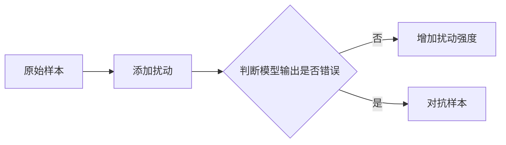

                 

**对抗样本 (Adversarial Examples) 原理与代码实例讲解**

**作者：禅与计算机程序设计艺术 / Zen and the Art of Computer Programming**

## 1. 背景介绍

在深度学习的快速发展过程中，对抗样本 (Adversarial Examples) 成为了一个备受关注的问题。对抗样本是一种特殊的输入，它看起来和正常样本没有区别，但会导致模型产生错误的输出。本文将深入探讨对抗样本的原理，并提供代码实例进行讲解。

## 2. 核心概念与联系

### 2.1 对抗样本的定义

对抗样本是一种特殊的输入，它看起来和正常样本没有区别，但会导致模型产生错误的输出。对抗样本通常是通过对原始样本进行微小的、人类无法察觉的修改而得到的。

### 2.2 对抗样本的类型

对抗样本可以分为两种类型：

- **白盒对抗样本**：攻击者知道模型的内部结构和参数。
- **黑盒对抗样本**：攻击者不知道模型的内部结构和参数，只能通过输入输出进行交互。

### 2.3 对抗样本的生成过程

对抗样本的生成过程可以用以下 Mermaid 流程图表示：



## 3. 核心算法原理 & 具体操作步骤

### 3.1 算法原理概述

对抗样本的生成算法通常基于优化问题，目标是找到最小的扰动，使模型的输出错误。常用的算法包括 Fast Gradient Sign Method (FGSM)、Basic Iterative Method (BIM) 和 Projected Gradient Descent (PGD) 等。

### 3.2 算法步骤详解

以 FGSM 为例，其步骤如下：

1. 选择一个原始样本 $x$。
2. 计算模型在 $x$ 上的梯度 $\nabla_x J(\theta, x, y)$，其中 $J(\theta, x, y)$ 是模型的损失函数，$\theta$ 是模型的参数， $y$ 是样本的标签。
3. 选择一个扰动强度 $\epsilon$。
4. 生成对抗样本 $x' = x + \epsilon \cdot sign(\nabla_x J(\theta, x, y))$.
5. 如果 $x'$ 仍然是有效的输入，则输出 $x'$；否则，重复步骤 4 直到找到有效的 $x'$。

### 3.3 算法优缺点

FGSM 的优点是简单高效，缺点是生成的对抗样本可能不够强大。BIM 和 PGD 可以生成更强大的对抗样本，但需要更多的计算资源。

### 3.4 算法应用领域

对抗样本的研究主要应用于模型的安全性评估，目的是找到模型的薄弱点，以便进行改进。此外，对抗样本也可以用于模型的正则化，即通过对抗样本的训练来提高模型的泛化能力。

## 4. 数学模型和公式 & 详细讲解 & 举例说明

### 4.1 数学模型构建

对抗样本的生成可以看作是一个优化问题，目标是最小化扰动强度 $\epsilon$ 使得模型的输出错误。数学模型可以表示为：

$$\min_{\epsilon} \epsilon \quad \text{s.t.} \quad f(x + \epsilon) \neq y$$

其中 $f(x)$ 是模型的输出函数，$y$ 是样本的标签。

### 4.2 公式推导过程

FGSM 可以看作是对上述优化问题的一次迭代，其公式推导过程如下：

$$\epsilon = \arg\min_{\epsilon} \epsilon \quad \text{s.t.} \quad f(x + \epsilon) \neq y$$

取梯度：

$$\nabla_\epsilon = \frac{\partial f(x + \epsilon)}{\partial \epsilon}$$

设置梯度的方向为扰动的方向：

$$\epsilon = \epsilon + \eta \cdot sign(\nabla_\epsilon)$$

其中 $\eta$ 是学习率。

### 4.3 案例分析与讲解

例如，考虑一个简单的分类模型 $f(x) = sign(w^T x + b)$，其中 $w$ 和 $b$ 是模型的参数。如果 $x$ 是一个正样本，即 $w^T x + b > 0$，则 $f(x) = 1$。FGSM 的目标是找到最小的扰动 $\epsilon$ 使得 $f(x + \epsilon) = -1$，即：

$$\min_{\epsilon} \epsilon \quad \text{s.t.} \quad w^T (x + \epsilon) + b < 0$$

取梯度：

$$\nabla_\epsilon = -\frac{\partial (w^T (x + \epsilon) + b)}{\partial \epsilon} = -w^T$$

设置梯度的方向为扰动的方向：

$$\epsilon = \epsilon + \eta \cdot sign(-w^T) = \epsilon - \eta \cdot w$$

## 5. 项目实践：代码实例和详细解释说明

### 5.1 开发环境搭建

本项目使用 Python 和 TensorFlow 进行开发。请确保您的环境中安装了 Python 3.6 及以上版本，并安装了 TensorFlow 2.0 及以上版本。

### 5.2 源代码详细实现

以下是FGSM 的 Python 实现代码：

```python
import numpy as np
import tensorflow as tf

def fgsm_attack(image, epsilon, data_grad):
    # 计算扰动
    sign_data_grad = np.sign(data_grad)
    perturbed_image = image + epsilon * sign_data_grad
    # 确保扰动在有效范围内
    perturbed_image = np.clip(perturbed_image, 0, 1)
    return perturbed_image

def attack_image(image, epsilon, model):
    # 计算模型在图像上的梯度
    with tf.GradientTape() as tape:
        tape.watch(image)
        prediction = model(image)
        loss = tf.keras.losses.sparse_categorical_crossentropy(model.targets, prediction)
    grads = tape.gradient(loss, image)
    # 生成对抗样本
    perturbed_image = fgsm_attack(image, epsilon, grads)
    return perturbed_image
```

### 5.3 代码解读与分析

`fgsm_attack` 函数计算扰动并生成对抗样本。`attack_image` 函数计算模型在图像上的梯度，并调用 `fgsm_attack` 函数生成对抗样本。

### 5.4 运行结果展示

以下是使用 FGSM 生成对抗样本的示例：

```python
# 加载模型和图像
model = tf.keras.models.load_model('path/to/model')
image = tf.keras.preprocessing.image.load_img('path/to/image', target_size=(28, 28))
image = tf.keras.preprocessing.image.img_to_array(image)
image = np.expand_dims(image, axis=0)

# 生成对抗样本
epsilon = 0.01
perturbed_image = attack_image(image, epsilon, model)

# 显示对抗样本
plt.imshow(perturbed_image[0])
plt.show()
```

## 6. 实际应用场景

### 6.1 模型安全性评估

对抗样本的研究主要应用于模型的安全性评估，目的是找到模型的薄弱点，以便进行改进。例如，可以使用对抗样本攻击模型，并记录模型的错误率，从而评估模型的安全性。

### 6.2 模型正则化

对抗样本也可以用于模型的正则化，即通过对抗样本的训练来提高模型的泛化能力。例如，可以在模型的训练过程中添加对抗样本，从而使模型更加健壮。

### 6.3 未来应用展望

随着对抗样本研究的深入，未来可能会出现更强大的对抗样本生成算法，从而提高模型的安全性和泛化能力。此外，对抗样本的研究也可能会应用于其他领域，例如自动驾驶和医疗诊断等。

## 7. 工具和资源推荐

### 7.1 学习资源推荐

- [对抗样本入门指南](https://adversarial-learning.readthedocs.io/en/latest/)
- [对抗样本的数学基础](https://arxiv.org/abs/1705.07723)
- [对抗样本的实践指南](https://arxiv.org/abs/1807.01697)

### 7.2 开发工具推荐

- [TensorFlow](https://www.tensorflow.org/)
- [Keras](https://keras.io/)
- [PyTorch](https://pytorch.org/)

### 7.3 相关论文推荐

- [Fast Gradient Sign Method](https://arxiv.org/abs/1412.6572)
- [Basic Iterative Method](https://arxiv.org/abs/1607.02533)
- [Projected Gradient Descent](https://arxiv.org/abs/1706.06083)

## 8. 总结：未来发展趋势与挑战

### 8.1 研究成果总结

对抗样本的研究已经取得了显著的成果，包括对抗样本的生成算法、模型的安全性评估方法和模型的正则化技术等。

### 8.2 未来发展趋势

未来对抗样本的研究可能会朝着以下方向发展：

- 更强大的对抗样本生成算法。
- 更有效的模型安全性评估方法。
- 更有效的模型正则化技术。
- 更广泛的应用领域。

### 8.3 面临的挑战

对抗样本的研究也面临着以下挑战：

- 对抗样本的生成算法需要更高的计算资源。
- 模型的安全性评估方法需要更好的指标。
- 模型的正则化技术需要更好的理论基础。
- 对抗样本的研究需要更好的工具和资源。

### 8.4 研究展望

未来对抗样本的研究可能会集中在以下领域：

- 更强大的对抗样本生成算法。
- 更有效的模型安全性评估方法。
- 更有效的模型正则化技术。
- 更广泛的应用领域。
- 更好的理论基础和工具。

## 9. 附录：常见问题与解答

### 9.1 什么是对抗样本？

对抗样本是一种特殊的输入，它看起来和正常样本没有区别，但会导致模型产生错误的输出。

### 9.2 对抗样本有哪些类型？

对抗样本可以分为两种类型：白盒对抗样本和黑盒对抗样本。

### 9.3 如何生成对抗样本？

对抗样本的生成通常基于优化问题，目标是找到最小的扰动，使模型的输出错误。常用的算法包括 FGSM、BIM 和 PGD 等。

### 9.4 对抗样本有什么用途？

对抗样本的研究主要应用于模型的安全性评估，目的是找到模型的薄弱点，以便进行改进。此外，对抗样本也可以用于模型的正则化，即通过对抗样本的训练来提高模型的泛化能力。

### 9.5 对抗样本的研究面临哪些挑战？

对抗样本的研究面临的挑战包括对抗样本的生成算法需要更高的计算资源，模型的安全性评估方法需要更好的指标，模型的正则化技术需要更好的理论基础，对抗样本的研究需要更好的工具和资源等。

**作者：禅与计算机程序设计艺术 / Zen and the Art of Computer Programming**

