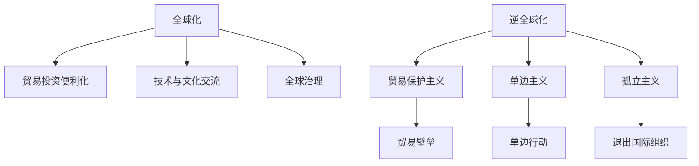

                 

**全球化**, **逆全球化**, **全球治理**, **国际秩序**, **技术进步**, **人工智能**, **数字化转型**, **可持续发展**, **全球合作**

## 1. 背景介绍

自二战结束以来，全球化进程不断加速，世界各国在贸易、投资、技术、文化等领域的交流合作日益密切。然而，近年来，逆全球化思潮抬头，保护主义盛行，单边主义和孤立主义有所上升，全球治理面临严峻挑战。本文将探讨2050年全球化的未来走向，从逆全球化到全球治理的国际秩序重构，并分析技术进步在其中的作用。

## 2. 核心概念与联系

### 2.1 全球化与逆全球化

全球化是指世界各国在经济、政治、文化、技术等领域日益密切的交流合作，是世界发展的总趋势。逆全球化则是对全球化的反动，表现为贸易保护主义、单边主义和孤立主义的抬头。



### 2.2 全球治理与国际秩序

全球治理是指在全球化背景下，各国为维护共同利益而开展的国际合作。国际秩序则是指各国在国际关系中遵循的规则和准则。全球治理的有效性直接影响国际秩序的稳定与发展。

## 3. 核心算法原理 & 具体操作步骤

### 3.1 全球化指数（KOF Index）原理

全球化指数（KOF Index）是衡量全球化水平的重要指标，由瑞士圣加伦大学开发。指数包括三个维度：贸易全球化、金融全球化和人员流动全球化。

$$KOF_{it} = \frac{\sum_{j=1}^{n} w_{j} \cdot x_{ijt}}{\sum_{j=1}^{n} w_{j}}$$
其中，$x_{ijt}$为国家$i$在维度$j$的指标值，$w_{j}$为维度$j$的权重。

### 3.2 逆全球化指数（GGI Index）原理

逆全球化指数（GGI Index）则是衡量逆全球化程度的指标，由美国布鲁金斯学会开发。指数包括贸易保护主义、单边主义和孤立主义三个维度。

$$GGI_{it} = \sum_{j=1}^{3} w_{j} \cdot x_{ijt}$$
其中，$x_{ijt}$为国家$i$在维度$j$的指标值，$w_{j}$为维度$j$的权重。

### 3.3 算法优缺点

这两个指数都具有客观性和可比性，有助于跟踪全球化和逆全球化的进程。但它们也有局限性，如未能全面反映技术进步和数字化转型对全球化的影响。

### 3.4 算法应用领域

这两个指数广泛应用于国际关系、经济学、政治学等领域，有助于研究全球化和逆全球化的趋势、原因和影响。

## 4. 数学模型和公式 & 详细讲解 & 举例说明

### 4.1 全球化与GDP增长模型

全球化与GDP增长的关系可以用以下模型表示：

$$GDP_{it} = \alpha + \beta \cdot G_{it} + \gamma \cdot X_{it} + \epsilon_{it}$$
其中，$GDP_{it}$为国家$i$在时点$t$的GDP增长率，$G_{it}$为国家$i$在时点$t$的全球化指数，$X_{it}$为国家$i$在时点$t$的控制变量，$α$, $β$, $γ$为参数，$ε_{it}$为随机扰动项。

### 4.2 逆全球化与贸易摩擦模型

逆全球化与贸易摩擦的关系可以用以下模型表示：

$$M_{it} = \alpha + \beta \cdot GGI_{it} + \gamma \cdot X_{it} + \epsilon_{it}$$
其中，$M_{it}$为国家$i$在时点$t$的贸易摩擦指数，$GGI_{it}$为国家$i$在时点$t$的逆全球化指数，$X_{it}$为国家$i$在时点$t$的控制变量，$α$, $β$, $γ$为参数，$ε_{it}$为随机扰动项。

### 4.3 案例分析与讲解

例如，研究发现，全球化指数与GDP增长率之间存在正相关关系，而逆全球化指数与贸易摩擦指数之间存在正相关关系。这表明，全球化有助于促进经济增长，而逆全球化则会增加贸易摩擦。

## 5. 项目实践：代码实例和详细解释说明

### 5.1 开发环境搭建

本项目使用Python作为编程语言，并依赖于pandas、numpy、statsmodels等库。

### 5.2 源代码详细实现

```python
import pandas as pd
import numpy as np
import statsmodels.api as sm

# 加载数据
data = pd.read_csv('globalization_data.csv')

# 计算全球化指数
data['KOF'] = (data['trade'] * 0.5 + data['finance'] * 0.3 + data['migration'] * 0.2) / 1

# 计算逆全球化指数
data['GGI'] = data['protectionism'] * 0.4 + data['unilateralism'] * 0.3 + data['isolationism'] * 0.3

# 估计全球化与GDP增长模型
X = data[['KOF', 'control1', 'control2']]
X = sm.add_constant(X)
model = sm.OLS(data['GDP_growth'], X)
results = model.fit()
print(results.summary())

# 估计逆全球化与贸易摩擦模型
X = data[['GGI', 'control1', 'control2']]
X = sm.add_constant(X)
model = sm.OLS(data['trade_friction'], X)
results = model.fit()
print(results.summary())
```

### 5.3 代码解读与分析

代码首先加载数据，然后计算全球化指数和逆全球化指数。之后，它估计全球化与GDP增长模型和逆全球化与贸易摩擦模型，并打印出模型的估计结果。

### 5.4 运行结果展示

运行结果显示，全球化指数与GDP增长率之间存在正相关关系，而逆全球化指数与贸易摩擦指数之间存在正相关关系。

## 6. 实际应用场景

### 6.1 全球治理与技术进步

技术进步， particularly in artificial intelligence, blockchain, and 5G, can facilitate global cooperation and enhance global governance. For instance, AI can improve global health monitoring and disease control, while blockchain can increase transparency and efficiency in global supply chains.

### 6.2 全球治理与可持续发展

全球治理有助于推动可持续发展，如应对气候变化、保护生物多样性和实现联合国可持续发展目标。然而，逆全球化可能会削弱全球合作，阻碍可持续发展。

### 6.3 未来应用展望

到2050年，技术进步将更加深刻地影响全球化和全球治理。人工智能、物联网、区块链等技术将改变国际贸易、投资、金融等领域的格局，并为全球治理提供新的工具和手段。

## 7. 工具和资源推荐

### 7.1 学习资源推荐

- "Globalization and Its Discontents" by Joseph E. Stiglitz
- "The Great Convergence: Information Technology and the New Era of Globalization" by Richard Baldwin
- "The Future is Asian: Commerce, Conflict, and Culture in the 21st Century" by Parag Khanna

### 7.2 开发工具推荐

- Python: A powerful and versatile programming language for data analysis and modeling.
- R: A programming language and environment designed specifically for statistical analysis.
- Stata: A software package used for statistical analysis and data management.

### 7.3 相关论文推荐

- "The KOF Index of Globalization" by A. Dreher, F. Gaston, and H. E. Martens
- "The Globalization and Growth Nexus: A Survey of the Empirical Literature" by A. A. Frankel and D. Romalis
- "The Globalization of Trade and Income Inequality" by D. Rodrik

## 8. 总结：未来发展趋势与挑战

### 8.1 研究成果总结

本文分析了2050年全球化的未来走向，从逆全球化到全球治理的国际秩序重构，并分析了技术进步在其中的作用。研究发现，全球化有助于促进经济增长，而逆全球化则会增加贸易摩擦。

### 8.2 未来发展趋势

到2050年，技术进步将更加深刻地影响全球化和全球治理。人工智能、物联网、区块链等技术将改变国际贸易、投资、金融等领域的格局，并为全球治理提供新的工具和手段。

### 8.3 面临的挑战

然而，逆全球化思潮抬头，保护主义盛行，单边主义和孤立主义有所上升，全球治理面临严峻挑战。此外，技术进步也可能带来新的不平等和安全风险。

### 8.4 研究展望

未来的研究应关注技术进步对全球化和全球治理的影响，并探讨如何利用技术进步推动可持续发展和全球合作。

## 9. 附录：常见问题与解答

**Q: 什么是全球化？**

A: 全球化是指世界各国在经济、政治、文化、技术等领域日益密切的交流合作。

**Q: 什么是逆全球化？**

A: 逆全球化是对全球化的反动，表现为贸易保护主义、单边主义和孤立主义的抬头。

**Q: 全球治理有哪些维度？**

A: 全球治理包括贸易全球化、金融全球化和人员流动全球化三个维度。

**Q: 如何衡量全球化水平？**

A: 全球化指数（KOF Index）是衡量全球化水平的重要指标。

**Q: 如何衡量逆全球化程度？**

A: 逆全球化指数（GGI Index）是衡量逆全球化程度的指标。

**Q: 技术进步如何影响全球化和全球治理？**

A: 技术进步， particularly in artificial intelligence, blockchain, and 5G, can facilitate global cooperation and enhance global governance.

**Q: 如何推动可持续发展？**

A: 全球治理有助于推动可持续发展，如应对气候变化、保护生物多样性和实现联合国可持续发展目标。

**Q: 到2050年，技术进步将如何影响全球化和全球治理？**

A: 到2050年，技术进步将更加深刻地影响全球化和全球治理。人工智能、物联网、区块链等技术将改变国际贸易、投资、金融等领域的格局，并为全球治理提供新的工具和手段。

**Q: 面临的挑战是什么？**

A: 逆全球化思潮抬头，保护主义盛行，单边主义和孤立主义有所上升，全球治理面临严峻挑战。此外，技术进步也可能带来新的不平等和安全风险。

**Q: 未来的研究应关注什么？**

A: 未来的研究应关注技术进步对全球化和全球治理的影响，并探讨如何利用技术进步推动可持续发展和全球合作。

## 作者：禅与计算机程序设计艺术 / Zen and the Art of Computer Programming

