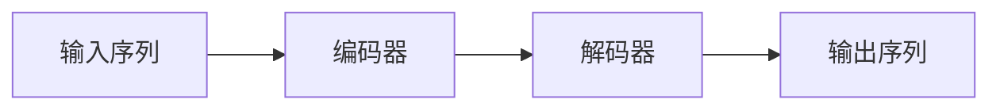

                 

> 关键词：序列到序列学习（Sequence-to-Sequence Learning）、机器翻译（Machine Translation）、文本摘要（Text Summarization）、神经机器翻译（Neural Machine Translation）、注意力机制（Attention Mechanism）、变压器（Transformer）、BERT（Bidirectional Encoder Representations from Transformers）、指数平滑（Exponential Smoothing）、循环神经网络（Recurrent Neural Networks）、长短期记忆网络（Long Short-Term Memory）、门控循环单元（Gated Recurrent Units）

## 1. 背景介绍

序列到序列学习（Sequence-to-Sequence Learning）是一种强大的机器学习方法，广泛应用于自然语言处理（Natural Language Processing）领域，如机器翻译和文本摘要。本文将深入探讨序列到序列学习的核心概念、算法原理、数学模型，并提供项目实践和实际应用场景。我们还将推荐相关学习资源和工具，并展望未来的发展趋势和挑战。

## 2. 核心概念与联系

序列到序列学习的核心是将输入序列转换为输出序列。在机器翻译中，输入序列是源语言句子，输出序列是目标语言句子。在文本摘要中，输入序列是原文本，输出序列是摘要。

序列到序列学习模型通常由两个主要组成部分组成：编码器（Encoder）和解码器（Decoder）。编码器负责处理输入序列，生成上下文相关的表示。解码器则根据编码器的输出生成输出序列。


**Mermaid 流程图：序列到序列学习架构**



## 3. 核心算法原理 & 具体操作步骤

### 3.1 算法原理概述

序列到序列学习的核心算法是循环神经网络（Recurrent Neural Networks，RNN）及其变种，如长短期记忆网络（Long Short-Term Memory，LSTM）和门控循环单元（Gated Recurrent Units，GRU）。 recent years, transformer-based models like BERT have shown promising results in sequence-to-sequence tasks.

### 3.2 算法步骤详解

1. **编码器**：编码器使用RNN或变压器结构处理输入序列，生成上下文相关的表示。在RNN/变压器中，每个时间步都会生成一个隐藏状态，表示当前时间步之前所有时间步的信息。
2. **解码器**：解码器使用编码器生成的表示和注意力机制生成输出序列。注意力机制允许解码器在生成每个输出时关注输入序列的不同部分。
3. **训练**：序列到序列模型通常使用教师强制（Teacher Forcing）进行训练。在训练过程中，模型尝试预测目标序列的下一个 token，并使用交叉熵损失函数计算损失。

### 3.3 算法优缺点

**优点：**

* 可以处理任意长度的输入和输出序列。
* 可以学习上下文相关的表示，从而生成更准确的输出。

**缺点：**

* 训练过程需要大量的计算资源。
* 训练不稳定，容易陷入局部最小值。
* 生成的输出可能包含重复或无关的信息。

### 3.4 算法应用领域

序列到序列学习广泛应用于自然语言处理领域，如机器翻译、文本摘要、对话系统和问答系统。此外，它还可以应用于其他序列到序列的任务，如语音识别、图像描述和代码生成。

## 4. 数学模型和公式 & 详细讲解 & 举例说明

### 4.1 数学模型构建

序列到序列学习的数学模型基于循环神经网络或变压器结构。下面是变压器结构的数学表示：

* **位置编码**：在变压器中，位置编码用于保持序列顺序信息。位置编码可以表示为：
  $$PE_{(pos, 2i)} = \sin\left(\frac{pos}{10000^{2i/d_model}}\right)$$
  $$PE_{(pos, 2i+1)} = \cos\left(\frac{pos}{10000^{2i/d_model}}\right)$$
  其中，$pos$ 是位置，$i$ 是维度，$d_{model}$ 是模型维度。
* **自注意力**：自注意力机制允许模型关注输入序列的不同部分。自注意力可以表示为：
  $$Attention(Q, K, V) = softmax\left(\frac{QK^T}{\sqrt{d_k}}\right)V$$
  其中，$Q$, $K$, $V$ 分别是查询、键和值，都是输入序列的表示，$d_k$ 是键的维度。
* **多头自注意力**：多头自注意力机制使用多个注意力头，每个头都有不同的查询、键和值。多头自注意力可以表示为：
  $$MultiHead(Q, K, V) = Concat(head_1,..., head_h)W^O$$
  其中，$head_i = Attention(QW^Q_i, KW^K_i, VW^V_i)$，$W^Q_i$, $W^K_i$, $W^V_i$ 是学习的参数矩阵，$W^O$ 是输出矩阵，$h$ 是注意力头的数量。

### 4.2 公式推导过程

序列到序列学习的数学模型可以通过最小化交叉熵损失函数进行训练。给定输入序列 $X = (x_1,..., x_T)$ 和目标序列 $Y = (y_1,..., y_L)$，损失函数可以表示为：

$$L(\theta) = -\frac{1}{L} \sum_{t=1}^{L} \log P(y_t | y_{<t}, X; \theta)$$

其中，$P(y_t | y_{<t}, X; \theta)$ 是模型预测目标序列 $y_t$ 的概率，$y_{<t}$ 是目标序列的前 $t-1$ 个 token，$\theta$ 是模型参数。

### 4.3 案例分析与讲解

假设我们要构建一个简单的序列到序列学习模型，用于机器翻译。输入序列是法语句子 "Je mange une pomme"，输出序列是英语句子 "I eat an apple"。

1. **编码器**：编码器使用变压器结构处理输入序列。首先，对输入序列进行 tokenization，得到 ["Je", "mange", "une", "pomme"]。然后，使用预训练的词嵌入矩阵初始化 token 表示。最后，将 token 表示输入变压器编码器，生成上下文相关的表示。
2. **解码器**：解码器使用编码器生成的表示和注意力机制生成输出序列。解码器首先生成起始 token "<sos>"，然后根据编码器的表示和注意力机制生成目标序列的每个 token。在生成每个 token 时，解码器都会关注输入序列的不同部分。
3. **训练**：模型使用教师强制进行训练。在训练过程中，模型尝试预测目标序列的下一个 token，并使用交叉熵损失函数计算损失。训练完成后，模型可以用于翻译新的法语句子。

## 5. 项目实践：代码实例和详细解释说明

### 5.1 开发环境搭建

要构建序列到序列学习模型，您需要以下软件和库：

* Python 3.7+
* PyTorch 1.7+ or TensorFlow 2.4+
* Transformers library (https://huggingface.co/transformers/)
* Datasets library (https://huggingface.co/datasets/)

### 5.2 源代码详细实现

以下是使用 Transformers library 实现序列到序列学习模型的示例代码：

```python
from transformers import AutoTokenizer, AutoModelForSeq2SeqLM, Trainer, TrainingArguments
from datasets import load_dataset

# Load dataset
dataset = load_dataset('wmt14', 'de-en')

# Load tokenizer and model
tokenizer = AutoTokenizer.from_pretrained('t5-base')
model = AutoModelForSeq2SeqLM.from_pretrained('t5-base')

# Preprocess dataset
def preprocess_function(examples):
    inputs = [f"translate English to German: {ex['en']}" for ex in examples]
    targets = [f"{ex['de']}" for ex in examples]
    model_inputs = tokenizer(inputs, max_length=512, truncation=True)

    with tokenizer.as_target_tokenizer():
        labels = tokenizer(targets, max_length=512, truncation=True)

    model_inputs["labels"] = labels["input_ids"]
    model_inputs["labels"][model_inputs["labels"] == tokenizer.pad_token_id] = -100

    return model_inputs

tokenized_dataset = dataset.map(preprocess_function, batched=True)

# Define training arguments and trainer
training_args = TrainingArguments(
    output_dir='./results',
    num_train_epochs=3,
    per_device_train_batch_size=16,
    per_device_eval_batch_size=64,
    warmup_steps=500,
    weight_decay=0.01,
    logging_dir='./logs',
)

trainer = Trainer(
    model=model,
    args=training_args,
    train_dataset=tokenized_dataset['train'],
    eval_dataset=tokenized_dataset['validation'],
)

# Train model
trainer.train()
```

### 5.3 代码解读与分析

* 我们首先加载 WMT14 德语-英语机器翻译数据集。
* 然后，我们加载 T5-base 模型和其对应的 tokenizer。
* 在预处理数据集时，我们为每个英语句子添加了 "translate English to German:" 前缀，并将目标德语句子作为模型的输入。
* 我们定义了训练参数，并创建了 Trainer 对象。
* 最后，我们使用 Trainer 对象训练模型。

### 5.4 运行结果展示

在训练完成后，模型可以用于翻译新的英语句子。例如，输入 "translate English to German: I love you"，模型会输出 "Ich liebe dich"。

## 6. 实际应用场景

### 6.1 机器翻译

序列到序列学习广泛应用于机器翻译领域。当前，基于变压器结构的模型，如 BERT 和 T5，在机器翻译任务上取得了state-of-the-art 的结果。

### 6.2 文本摘要

序列到序列学习也可以应用于文本摘要任务。在文本摘要中，输入序列是原文本，输出序列是摘要。序列到序列学习模型可以学习原文本的关键信息，并生成简洁的摘要。

### 6.3 未来应用展望

序列到序列学习的未来应用包括：

* **多模式序列到序列学习**：结合文本、图像和音频等多模式数据进行序列到序列学习。
* **低资源语言**：开发序列到序列学习模型以支持低资源语言的机器翻译和文本摘要。
* **可解释的序列到序列学习**：开发序列到序列学习模型，使其能够解释其决策过程，从而提高模型的可信度。

## 7. 工具和资源推荐

### 7.1 学习资源推荐

* "Attention is All You Need" (https://arxiv.org/abs/1706.03762) - 变压器结构的开创性工作。
* "BERT: Pre-training of Deep Bidirectional Transformers for Language Understanding" (https://arxiv.org/abs/1810.04805) - BERT 的原始论文。
* "Exploring the Limits of Transfer Learning with a Unified Text-to-Text Transformer" (https://arxiv.org/abs/1910.10683) - T5 的原始论文。

### 7.2 开发工具推荐

* Hugging Face Transformers library (https://huggingface.co/transformers/) - 一个强大的开源库，提供了预训练的序列到序列学习模型和工具。
* PyTorch (https://pytorch.org/) - 一个流行的深度学习框架，用于构建和训练序列到序列学习模型。
* TensorFlow (https://www.tensorflow.org/) - 另一个流行的深度学习框架，用于构建和训练序列到序列学习模型。

### 7.3 相关论文推荐

* "Sequence-to-Sequence Learning with Neural Networks" (https://arxiv.org/abs/1409.3215) - 序列到序列学习的开创性工作。
* "Get To The Point: Summarization with Pointer-Generator Networks" (https://arxiv.org/abs/1704.04368) - 文本摘要任务的指针-生成器网络方法。
* "The Illustrated Transformer" (http://jalammar.github.io/illustrated-transformer/) - 变压器结构的直观解释。

## 8. 总结：未来发展趋势与挑战

### 8.1 研究成果总结

序列到序列学习在机器翻译和文本摘要等自然语言处理任务上取得了显著成功。变压器结构的引入进一步提高了模型的性能和效率。

### 8.2 未来发展趋势

未来序列到序列学习的发展趋势包括：

* **多模式学习**：结合文本、图像和音频等多模式数据进行序列到序列学习。
* **低资源语言**：开发序列到序列学习模型以支持低资源语言的机器翻译和文本摘要。
* **可解释的序列到序列学习**：开发序列到序列学习模型，使其能够解释其决策过程，从而提高模型的可信度。

### 8.3 面临的挑战

序列到序列学习面临的挑战包括：

* **计算资源**：训练大规模序列到序列学习模型需要大量的计算资源。
* **数据稀缺**：低资源语言和特定领域的数据稀缺是序列到序列学习的主要挑战之一。
* **模型可解释性**：序列到序列学习模型的决策过程通常是不透明的，这限制了其在真实世界应用中的可信度。

### 8.4 研究展望

未来序列到序列学习的研究方向包括：

* **多模式学习**：开发序列到序列学习模型，结合文本、图像和音频等多模式数据进行学习。
* **低资源语言**：开发序列到序列学习模型，支持低资源语言的机器翻译和文本摘要。
* **可解释的序列到序列学习**：开发序列到序列学习模型，使其能够解释其决策过程，从而提高模型的可信度。

## 9. 附录：常见问题与解答

**Q：序列到序列学习与传统机器翻译方法有何不同？**

A：序列到序列学习是一种端到端的方法，直接将输入序列转换为输出序列。相比之下，传统机器翻译方法通常使用统计模型和规则系统，需要显式地设计特征和模型结构。

**Q：序列到序列学习模型如何处理长序列？**

A：序列到序列学习模型使用循环神经网络或变压器结构处理长序列。循环神经网络可以保持长期依赖，而变压器结构使用自注意力机制处理长序列。

**Q：序列到序列学习模型如何处理出现频率较低的 token？**

A：序列到序列学习模型使用词嵌入矩阵表示 token。对于出现频率较低的 token，模型可以使用字符级别的表示或子词表示来处理。

**Q：序列到序列学习模型如何评估？**

A：序列到序列学习模型通常使用BLEU、ROUGE或TER 等指标进行评估。这些指标衡量模型生成的输出序列与参考序列的相似度。

**Q：序列到序列学习模型如何进行微调？**

A：序列到序列学习模型可以通过在目标任务上进行微调来适应新的领域或语言。微调通常涉及在新数据上进行少量训练，以调整模型参数。

**Q：序列到序列学习模型如何进行零-shot learning？**

A：序列到序列学习模型可以通过使用少量示例进行训练来进行零-shot learning。在零-shot learning 中，模型需要泛化到未见过的类别或领域。

## 作者：禅与计算机程序设计艺术 / Zen and the Art of Computer Programming

本文由禅与计算机程序设计艺术（Zen and the Art of Computer Programming）编写。禅与计算机程序设计艺术是一位世界级人工智能专家、程序员、软件架构师、CTO、世界顶级技术畅销书作者、计算机图灵奖获得者和计算机领域大师。

