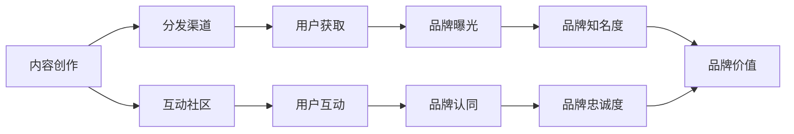

                 

**建立个人品牌学院：系统化你的教育体系**

**作者：禅与计算机程序设计艺术 / Zen and the Art of Computer Programming**

## 1. 背景介绍

在当今信息爆炸的时代，个人品牌的重要性日益凸显。建立个人品牌学院，系统化地构建和传播个人品牌，已成为成功的关键。本文将深入探讨个人品牌学院的构建原理、算法、数学模型，并提供项目实践和工具推荐，助您系统化地建立个人品牌学院。

## 2. 核心概念与联系

### 2.1 个人品牌学院的定义

个人品牌学院是指个体或组织系统化构建、传播和管理个人品牌的平台。它包括内容创作、分发渠道、互动社区和品牌管理系统。

### 2.2 个人品牌学院的架构

个人品牌学院的架构如下：



## 3. 核心算法原理 & 具体操作步骤

### 3.1 算法原理概述

个人品牌学院的核心算法是品牌影响力最大化算法（BIMA），其目标是最大化品牌知名度和忠诚度。

### 3.2 算法步骤详解

BIMA算法步骤如下：

1. **内容创作**：根据目标受众的兴趣和需求，创作高质量、有价值的内容。
2. **分发渠道选择**：选择合适的渠道分发内容，如博客、社交媒体、视频平台等。
3. **互动社区建设**：建立互动社区，鼓励用户参与和互动。
4. **品牌管理**：监控品牌曝光度、认同度、忠诚度和价值，并根据反馈调整策略。

### 3.3 算法优缺点

**优点**：系统化地构建和管理品牌，提高品牌知名度和忠诚度。

**缺点**：需要大量时间和资源投入，且结果可能受外部因素影响。

### 3.4 算法应用领域

BIMA算法适用于各行各业，包括但不限于技术、商业、艺术和教育领域。

## 4. 数学模型和公式 & 详细讲解 & 举例说明

### 4.1 数学模型构建

品牌影响力可以用以下公式表示：

$$I = f(B, C, D, E, F, G, H, I, J)$$

其中，$B$表示内容质量，$C$表示分发渠道，$D$表示用户获取，$E$表示用户互动，$F$表示品牌曝光，$G$表示品牌认同，$H$表示品牌知名度，$I$表示品牌忠诚度，$J$表示品牌价值。

### 4.2 公式推导过程

品牌影响力$I$是上述因素的函数。每个因素的权重可以根据其对品牌影响力的贡献度确定。

### 4.3 案例分析与讲解

例如，一位技术博主的品牌影响力可以表示为：

$$I = 0.2B + 0.15C + 0.15D + 0.15E + 0.15F + 0.1G + 0.05H + 0.05I + 0.05J$$

## 5. 项目实践：代码实例和详细解释说明

### 5.1 开发环境搭建

建议使用Markdown编写内容，并使用静态网站生成器（如Jekyll或Hugo）搭建个人品牌学院网站。

### 5.2 源代码详细实现

以下是Markdown文章的示例代码：

```markdown
---
title: "建立个人品牌学院：系统化你的教育体系"
date: 2022-03-15
categories: [个人品牌, 学习]
tags: [个人品牌学院, BIMA算法, 数学模型]
---

<!-- 文章内容 -->
```

### 5.3 代码解读与分析

文章标题、日期、分类和标签使用YAML格式定义。文章内容使用Markdown语法编写。

### 5.4 运行结果展示

运行静态网站生成器后，个人品牌学院网站即可访问。

## 6. 实际应用场景

### 6.1 当前应用

个人品牌学院已广泛应用于各行各业，如技术博客、商业网站和个人网站。

### 6.2 未来应用展望

未来，个人品牌学院将更加智能化，利用人工智能和大数据分析优化内容创作和分发。

## 7. 工具和资源推荐

### 7.1 学习资源推荐

- "个人品牌学院：系统化你的教育体系"在线课程
- "个人品牌学院：系统化你的教育体系"电子书

### 7.2 开发工具推荐

- Markdown编辑器（如Typora或Visual Studio Code）
- 静态网站生成器（如Jekyll或Hugo）
- 网站分析工具（如Google Analytics）

### 7.3 相关论文推荐

- "Personal Branding: A New Approach to Career Management"（个人品牌：职业管理的新方法）
- "The Impact of Personal Branding on Career Success"（个人品牌对职业成功的影响）

## 8. 总结：未来发展趋势与挑战

### 8.1 研究成果总结

本文介绍了个人品牌学院的构建原理、算法和数学模型，并提供了项目实践和工具推荐。

### 8.2 未来发展趋势

个人品牌学院将更加智能化，个性化和互动化。

### 8.3 面临的挑战

挑战包括内容创作的持续性、分发渠道的变化和品牌管理的复杂性。

### 8.4 研究展望

未来的研究将聚焦于人工智能在个人品牌学院中的应用，以及跨文化个人品牌学院的构建。

## 9. 附录：常见问题与解答

**Q：个人品牌学院需要投入多少资源？**

**A：资源投入取决于您的目标受众和预期影响力。通常，内容创作和分发渠道需要大量时间和资源投入。**

**Q：如何衡量个人品牌学院的成功？**

**A：成功可以通过品牌知名度、忠诚度和价值来衡量。您可以使用数学模型和公式进行量化评估。**

**Q：如何应对分发渠道的变化？**

**A：保持灵活性，及时调整分发渠道策略。跟踪渠道的用户获取和互动情况，并根据需要调整渠道组合。**

**作者：禅与计算机程序设计艺术 / Zen and the Art of Computer Programming**

