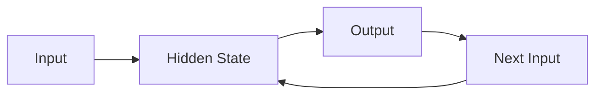

                 

## 1. 背景介绍

循环神经网络（Recurrent Neural Network，RNN）是一种类型的神经网络，专门设计用于处理序列数据。与传统的神经网络不同，RNN可以利用输入序列中之前的信息来预测当前的输出，从而更好地理解序列数据的上下文。RNN在自然语言处理、语音识别、时间序列预测等领域取得了显著的成功。

## 2. 核心概念与联系

### 2.1 核心概念

- **隐藏状态（Hidden State）**：RNN的记忆机制，用于存储之前时间步的信息。
- **输出（Output）**：RNN在当前时间步生成的输出。
- **输入（Input）**：RNN在当前时间步接收的输入。

### 2.2 核心联系

RNN的核心联系是通过隐藏状态在不同时间步之间传递信息。在每个时间步，RNN首先接收输入，然后更新隐藏状态，最后生成输出。隐藏状态在时间步之间传递，允许RNN在处理序列数据时保持上下文意识。



## 3. 核心算法原理 & 具体操作步骤

### 3.1 算法原理概述

RNN的核心原理是利用隐藏状态在时间步之间传递信息。在每个时间步，RNN首先将输入与隐藏状态结合，然后更新隐藏状态，最后生成输出。

### 3.2 算法步骤详解

1. **初始化隐藏状态**：在开始处理序列之前，初始化隐藏状态为零向量。
2. **遍历序列**：对于序列中的每个时间步：
   - 接收当前时间步的输入。
   - 结合当前输入和上一时间步的隐藏状态，更新隐藏状态。
   - 生成当前时间步的输出。
   - 将当前隐藏状态传递给下一个时间步。
3. **结束序列**：当序列结束时，RNN停止处理。

### 3.3 算法优缺点

**优点**：
- 可以处理序列数据，理解上下文。
- 可以学习长期依赖关系。

**缺点**：
- 训练困难，容易陷入局部最小值。
- 难以学习长期依赖关系（长期依赖问题）。

### 3.4 算法应用领域

- 自然语言处理：语言模型、机器翻译、文本分类等。
- 语音识别：连续语音识别、语音合成等。
- 时间序列预测：股票价格预测、天气预测等。

## 4. 数学模型和公式 & 详细讲解 & 举例说明

### 4.1 数学模型构建

设输入序列为$x = (x_1, x_2,..., x_T)$, 隐藏状态为$h = (h_1, h_2,..., h_T)$, 输出序列为$y = (y_1, y_2,..., y_T)$. RNN的数学模型可以表示为：

$$
\begin{align}
h_t &= \tanh(W_{hh}h_{t-1} + W_{xh}x_t + b_h) \\
y_t &= W_{hy}h_t + b_y
\end{align}
$$

其中，$W_{hh}$, $W_{xh}$, $W_{hy}$是学习参数，而$b_h$和$b_y$是偏置项。

### 4.2 公式推导过程

RNN的数学模型是通过最小化预测误差和正则化项（如L2正则化）来学习的。具体来说，RNN的目标函数是：

$$
L = \sum_{t=1}^{T}l(y_t, \hat{y}_t) + \lambda ||W||^2
$$

其中，$l$是损失函数（如交叉熵），$\hat{y}_t$是RNN的预测输出，$||W||^2$是参数的L2范数，$\lambda$是正则化系数。

### 4.3 案例分析与讲解

例如，假设我们要构建一个简单的RNN来预测下一个单词。输入$x_t$是当前单词的向量表示，隐藏状态$h_t$是RNN的记忆，输出$y_t$是下一个单词的概率分布。通过训练RNN，我们可以学习到隐藏状态如何表示上下文，从而更好地预测下一个单词。

## 5. 项目实践：代码实例和详细解释说明

### 5.1 开发环境搭建

我们将使用Python和TensorFlow来实现一个简单的RNN。首先，安装必要的库：

```bash
pip install tensorflow numpy
```

### 5.2 源代码详细实现

```python
import numpy as np
import tensorflow as tf

# 定义RNN单元
def rnn_cell(inputs, hidden_state, weights, biases):
    # 计算隐藏状态
    hidden_state = tf.tanh(tf.matmul(inputs, weights['xh']) + tf.matmul(hidden_state, weights['hh']) + biases['h'])
    # 计算输出
    output = tf.matmul(hidden_state, weights['hy']) + biases['y']
    return hidden_state, output

# 定义RNN模型
def rnn_model(X, weights, biases):
    # 初始化隐藏状态
    hidden_state = tf.zeros([batch_size, hidden_size])
    # 遍历序列
    outputs = []
    for t in range(T):
        hidden_state, output = rnn_cell(X[:, t, :], hidden_state, weights, biases)
        outputs.append(output)
    # 返回输出序列
    return tf.concat(outputs, 1)

# 定义超参数
batch_size = 100
hidden_size = 128
T = 10

# 定义输入数据
X = tf.placeholder(tf.float32, [None, T, input_size])

# 定义学习参数
weights = {
    'hh': tf.Variable(tf.random_normal([hidden_size, hidden_size])),
    'xh': tf.Variable(tf.random_normal([input_size, hidden_size])),
    'hy': tf.Variable(tf.random_normal([hidden_size, output_size]))
}
biases = {
    'h': tf.Variable(tf.random_normal([hidden_size])),
    'y': tf.Variable(tf.random_normal([output_size]))
}

# 定义RNN模型
y = rnn_model(X, weights, biases)

# 定义损失函数和优化器
y_ = tf.placeholder(tf.float32, [None, T, output_size])
loss = tf.reduce_mean(tf.nn.softmax_cross_entropy_with_logits(logits=y, labels=y_))
optimizer = tf.train.AdamOptimizer(learning_rate=0.001).minimize(loss)

# 定义预测函数
predict = tf.argmax(y, 2)
```

### 5.3 代码解读与分析

我们首先定义了RNN单元函数`rnn_cell`，它接受输入`inputs`和隐藏状态`hidden_state`，并返回更新后的隐藏状态和输出。然后，我们定义了RNN模型函数`rnn_model`，它遍历输入序列，在每个时间步调用`rnn_cell`，并返回输出序列。

在主程序中，我们首先定义了超参数，然后定义了输入数据`X`和学习参数`weights`和`biases`。我们使用`tf.placeholder`定义了输入数据`X`和标签`y_`，并使用`tf.Variable`定义了学习参数。

我们定义了RNN模型`y`，并使用交叉熵损失函数和Adam优化器来训练模型。最后，我们定义了预测函数`predict`，它接受RNN的输出`y`并返回预测的标签。

### 5.4 运行结果展示

在训练RNN模型后，我们可以使用`predict`函数来预测新的输入序列。例如：

```python
# 定义输入序列
X_test = np.random.rand(batch_size, T, input_size)

# 运行会话
with tf.Session() as sess:
    sess.run(tf.global_variables_initializer())
    for i in range(num_epochs):
        # 训练模型
        _, loss_value = sess.run([optimizer, loss], feed_dict={X: X_train, y_: y_train})
        # 打印损失值
        if i % 100 == 0:
            print('Epoch:', i, 'Loss:', loss_value)
    # 预测新输入序列
    y_pred = sess.run(predict, feed_dict={X: X_test})
```

## 6. 实际应用场景

### 6.1 当前应用

RNN在自然语言处理、语音识别、时间序列预测等领域有着广泛的应用。例如，RNN可以用于构建语言模型，从而改善机器翻译、文本分类等任务的性能。

### 6.2 未来应用展望

随着深度学习技术的发展，RNN及其变种（如LSTM和GRU）将继续在更多领域得到应用。未来，RNN可能会被用于更复杂的任务，如自动驾驶、医疗诊断等。

## 7. 工具和资源推荐

### 7.1 学习资源推荐

- **书籍**："Natural Language Processing with Python" by Steven Bird, Ewan Klein, and Edward Loper
- **在线课程**：Stanford University's CS224n course on Natural Language Processing

### 7.2 开发工具推荐

- **编程语言**：Python
- **深度学习框架**：TensorFlow, PyTorch

### 7.3 相关论文推荐

- **RNN的原始论文**："Learning Long-Term Dependencies with Gradient Descent is Difficult" by Jürgen Schmidhuber, Sepp Hochreiter, and Felix A. Gers
- **LSTM的原始论文**："Long Short-Term Memory" by Sepp Hochreiter and Jürgen Schmidhuber

## 8. 总结：未来发展趋势与挑战

### 8.1 研究成果总结

RNN及其变种在自然语言处理、语音识别、时间序列预测等领域取得了显著的成功。它们可以学习序列数据的上下文，从而改善模型的性能。

### 8.2 未来发展趋势

未来，RNN及其变种将继续在更多领域得到应用。此外，研究人员将继续探索新的架构和训练方法，以改善RNN的性能和稳定性。

### 8.3 面临的挑战

RNN面临的主要挑战是长期依赖问题，即RNN难以学习长期依赖关系。此外，RNN的训练过程也相对困难，容易陷入局部最小值。

### 8.4 研究展望

未来的研究将关注于改善RNN的长期依赖能力，开发新的训练方法，并将RNN应用于更复杂的任务。

## 9. 附录：常见问题与解答

**Q：RNN和LSTM有什么区别？**

A：LSTM（Long Short-Term Memory）是RNN的一种变种，专门设计用于解决RNN的长期依赖问题。LSTM引入了记忆单元（memory cell）和门控机制，允许LSTM学习长期依赖关系。

**Q：RNN如何处理变长序列？**

A：RNN可以通过使用序列到序列（Seq2Seq）模型来处理变长序列。Seq2Seq模型由两个RNN组成：一个用于编码输入序列，另一个用于解码输出序列。

**Q：RNN如何处理并行计算？**

A：RNN的时间步是串行的，这意味着每个时间步的计算依赖于前一个时间步的输出。因此，RNN不适合并行计算。然而，一些变种（如并行RNN）可以在一定程度上实现并行计算。

---

作者：禅与计算机程序设计艺术 / Zen and the Art of Computer Programming

