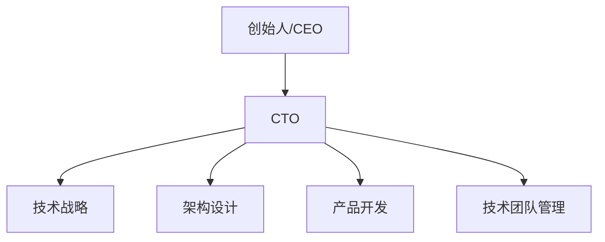

                 

**技术合伙人：创业路上的角色**

## 1. 背景介绍

在创业之路上，技术合伙人（CTO）是一个至关重要的角色。CTO 负责技术战略、架构设计、产品开发，并确保技术团队的高效运作。本文将深入探讨技术合伙人这个角色，包括其核心概念、关键算法、数学模型，并提供项目实践和工具推荐。

## 2. 核心概念与联系

### 2.1 技术合伙人角色

技术合伙人是创始人或 CEO 的技术搭档，负责公司的技术战略和架构设计。CTO 需要平衡技术创新和商业需求，确保公司的技术能力能够支撑其商业目标。



### 2.2 技术合伙人与其他角色

CTO 与其他角色的关系如下：

- **创始人/CEO**：CTO 需要与创始人/CEO 密切合作，理解商业目标，并将其转化为技术战略。
- **产品经理**：CTO 需要与产品经理密切合作，确保技术能力能够支撑产品需求。
- **技术团队**：CTO 需要管理和指导技术团队，确保其高效运作。

## 3. 核心算法原理 & 具体操作步骤

### 3.1 算法原理概述

CTO 需要理解和应用各种算法原理，以设计高效的系统和产品。以下是几种关键算法原理：

- **数据结构**：CTO 需要理解各种数据结构，如数组、链表、树、图等，以设计高效的数据存储和处理系统。
- **算法**：CTO 需要理解和应用各种算法，如排序算法、搜索算法、图算法等，以设计高效的系统和产品。
- **并发控制**：CTO 需要理解并发控制原理，以设计高并发系统。

### 3.2 算法步骤详解

以快速排序算法为例，其步骤如下：

1. 选择一个基准元素，通常是数组的第一个元素。
2. 将小于基准元素的元素放到其左边，大于基准元素的元素放到其右边。
3. 递归地对基准元素左边和右边的子数组重复步骤 1-2。

### 3.3 算法优缺点

快速排序算法的优点包括：

- 平均时间复杂度为 O(n log n)，这是最好情况、平均情况和最坏情况的时间复杂度。
- 空间复杂度为 O(log n)，因为递归调用栈的深度为 log n。

其缺点包括：

- 最坏情况时间复杂度为 O(n^2)，当数组已经排序或接近排序时。
- 不稳定，即相等的元素不保持相对顺序。

### 3.4 算法应用领域

快速排序算法广泛应用于排序、搜索、数据挖掘等领域。CTO 需要根据具体场景选择合适的算法。

## 4. 数学模型和公式 & 详细讲解 & 举例说明

### 4.1 数学模型构建

CTO 需要构建数学模型来描述系统的行为。例如，在设计缓存系统时，CTO 可以构建如下数学模型：

- **请求分布**：描述缓存请求的分布，如泊松分布。
- **缓存命中率**：描述缓存命中请求的比例。
- **缓存吞吐量**：描述缓存系统能够处理的请求数。

### 4.2 公式推导过程

假设缓存请求遵循泊松分布，其平均请求率为 λ，缓存命中率为 h，则缓存吞吐量 T 可以推导如下：

$$
T = \lambda \times (1 + (1 - h) \times \frac{1}{S})
$$

其中，S 是缓存系统的服务时间。

### 4.3 案例分析与讲解

假设一个缓存系统的平均请求率为 100 请求/秒，缓存命中率为 0.9，服务时间为 0.1 秒。则缓存吞吐量为：

$$
T = 100 \times (1 + (1 - 0.9) \times \frac{1}{0.1}) = 110 \text{ 请求/秒}
$$

这意味着缓存系统能够处理每秒 110 个请求。

## 5. 项目实践：代码实例和详细解释说明

### 5.1 开发环境搭建

CTO 需要搭建开发环境，以便开发和测试系统。环境搭建步骤包括：

1. 安装操作系统，如 Linux。
2. 安装编程语言，如 Python。
3. 安装集成开发环境（IDE），如 PyCharm。
4. 安装数据库，如 MySQL。
5. 安装版本控制系统，如 Git。

### 5.2 源代码详细实现

以下是快速排序算法的 Python 实现：

```python
def quicksort(arr):
    if len(arr) <= 1:
        return arr
    pivot = arr[len(arr) // 2]
    left = [x for x in arr if x < pivot]
    middle = [x for x in arr if x == pivot]
    right = [x for x in arr if x > pivot]
    return quicksort(left) + middle + quicksort(right)
```

### 5.3 代码解读与分析

- 递归地对数组进行分区，直到数组长度为 1。
- 选择基准元素，通常是数组的中间元素。
- 将小于基准元素的元素放到其左边，大于基准元素的元素放到其右边。
- 递归地对基准元素左边和右边的子数组重复步骤 2-3。

### 5.4 运行结果展示

以下是快速排序算法的运行结果：

```python
arr = [3,6,8,10,1,2,1]
print(quicksort(arr))  # 输出：[1, 1, 2, 3, 6, 8, 10]
```

## 6. 实际应用场景

### 6.1 当前应用场景

CTO 需要理解当前的技术生态，以便选择合适的技术栈。当前流行的技术包括：

- **云原生**：云原生技术，如 Kubernetes、Docker，使得系统部署和管理更加容易。
- **微服务**：微服务架构，如 Spring Boot、gRPC，使得系统更加灵活和可扩展。
- **大数据**：大数据技术，如 Hadoop、Spark，使得数据处理更加高效。

### 6.2 未来应用展望

未来的技术趋势包括：

- **边缘计算**：边缘计算技术，如 5G、物联网，使得数据处理更加及时和高效。
- **人工智能**：人工智能技术，如深度学习、自然语言处理，使得系统更加智能和自动化。
- **量子计算**：量子计算技术，如量子位、量子门，使得计算更加高效和强大。

## 7. 工具和资源推荐

### 7.1 学习资源推荐

CTO 需要不断学习和更新技能。以下是一些推荐的学习资源：

- **在线课程**：如 Coursera、Udacity、Pluralsight。
- **技术博客**：如 Hacker News、TechCrunch、Wired。
- **技术书籍**：如 "Clean Code"、 "Design Patterns"、 "Site Reliability Engineering"。

### 7.2 开发工具推荐

以下是一些推荐的开发工具：

- **编程语言**：如 Python、Java、Go。
- **集成开发环境（IDE）**：如 Visual Studio Code、PyCharm、IntelliJ IDEA。
- **版本控制系统**：如 Git、SVN。

### 7.3 相关论文推荐

以下是一些推荐的相关论文：

- **技术合伙人角色**："The CTO's Role in Startups"、 "The CTO's Playbook"。
- **技术架构设计**："Site Reliability Engineering"、 "Designing Distributed Systems"。
- **技术创新**："Innovation in Technology"、 "Disruptive Technologies"。

## 8. 总结：未来发展趋势与挑战

### 8.1 研究成果总结

CTO 需要总结其研究成果，以便与团队和创始人分享。成果包括：

- **技术战略**：CTO 需要总结其技术战略，以便与创始人和团队分享。
- **架构设计**：CTO 需要总结其架构设计，以便与团队分享。
- **产品开发**：CTO 需要总结其产品开发成果，以便与团队和创始人分享。

### 8.2 未来发展趋势

未来的发展趋势包括：

- **技术创新**：CTO 需要不断寻求技术创新，以便保持竞争优势。
- **人才培养**：CTO 需要培养和留住人才，以便保持技术能力。
- **商业需求**：CTO 需要平衡技术创新和商业需求，以便支撑商业目标。

### 8.3 面临的挑战

CTO 面临的挑战包括：

- **技术选择**：CTO 需要选择合适的技术栈，以便平衡技术创新和商业需求。
- **人才短缺**：CTO 需要面对人才短缺的挑战，以便培养和留住人才。
- **商业压力**：CTO 需要面对商业压力，以便平衡技术创新和商业需求。

### 8.4 研究展望

CTO 的研究展望包括：

- **技术创新**：CTO 需要不断寻求技术创新，以便保持竞争优势。
- **人才培养**：CTO 需要培养和留住人才，以便保持技术能力。
- **商业需求**：CTO 需要平衡技术创新和商业需求，以便支撑商业目标。

## 9. 附录：常见问题与解答

**Q1：CTO 需要具备哪些技能？**

A1：CTO 需要具备技术、管理和沟通等技能。技术技能包括编程、架构设计、算法等。管理技能包括团队管理、项目管理等。沟通技能包括与创始人、团队和客户的沟通等。

**Q2：CTO 的角色与 CIO 的角色有何区别？**

A2：CTO 主要负责技术战略、架构设计和产品开发，而 CIO 主要负责信息技术的管理和运营。CTO 需要平衡技术创新和商业需求，而 CIO 需要确保信息技术的稳定和安全。

**Q3：CTO 的角色在创业公司和大型企业有何不同？**

A3：在创业公司，CTO 需要承担更多的技术和管理责任，因为公司规模小，团队人数少。而在大型企业，CTO 需要更多地关注技术战略和架构设计，因为公司规模大，团队人数多。

**Q4：CTO 的角色在未来会有何变化？**

A4：未来的 CTO 需要更加关注技术创新和商业需求的平衡。随着技术的发展，CTO 需要不断学习和更新技能，以便保持竞争优势。同时，CTO 需要更加关注人才培养和留住，以便保持技术能力。

**Q5：CTO 的角色在不同行业有何不同？**

A5：CTO 的角色在不同行业会有所不同。例如，在金融行业，CTO 需要更加关注信息安全和合规。而在医疗行业，CTO 需要更加关注数据隐私和可靠性。在不同行业，CTO 需要根据具体场景选择合适的技术栈和架构设计。

## 作者：禅与计算机程序设计艺术 / Zen and the Art of Computer Programming

