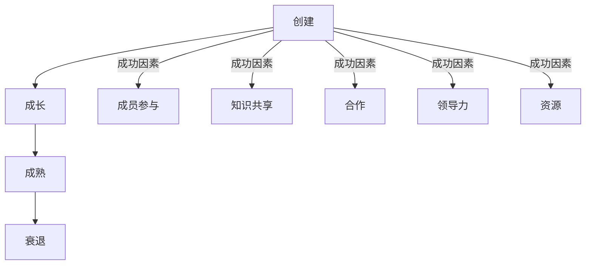

                 

**技术社区建设：从参与者到组织者**

## 1. 背景介绍

在当今快速发展的技术世界中，技术社区扮演着至关重要的角色。它是技术爱好者、开发人员、研究人员和企业家交流、学习和合作的平台。然而，构建和维护一个成功的技术社区并非易事。本文旨在提供一条从参与者到组织者的路径，帮助您理解技术社区的核心概念，并提供实用的指南来构建和管理成功的技术社区。

## 2. 核心概念与联系

### 2.1 技术社区的定义

技术社区是一个由共同的技术兴趣或目标联系在一起的群体。它可以是线下的会议或聚会，也可以是线上的在线论坛或社交媒体群组。技术社区的目标是促进知识共享、合作和创新。

### 2.2 技术社区的类型

技术社区可以分为以下几类：

- **兴趣驱动型**：基于共同的技术兴趣。
- **问题驱动型**：围绕特定技术问题或挑战。
- **项目驱动型**：基于共同的项目或目标。
- **企业驱动型**：由企业资助，旨在推动特定技术或产品的发展。

### 2.3 技术社区的生命周期

技术社区的生命周期包括以下阶段：

- **创建**：社区的起源和初始成员的吸引。
- **成长**：新成员的加入，知识共享和合作的开始。
- **成熟**：社区的结构化，规则和程序的建立。
- **衰退**：成员流失，活动减少，社区解散。

### 2.4 技术社区的关键成功因素

技术社区的成功取决于以下因素：

- **成员参与**：活跃的成员是社区的生命线。
- **知识共享**：鼓励成员分享知识和经验。
- **合作**：鼓励成员合作解决问题和开发项目。
- **领导力**：有效的领导力是社区成功的关键。
- **资源**：资金、设施和技术资源的可用性。



## 3. 核心算法原理 & 具体操作步骤

### 3.1 社区成员分析算法原理

社区成员分析是理解和管理技术社区的关键。社区成员分析算法的原理基于网络分析，旨在识别社区中的关键成员和影响者。

### 3.2 社区成员分析步骤

1. **数据收集**：收集社区成员的互动数据，如帖子、评论和点赞。
2. **网络构建**：将数据转化为成员互动网络。
3. **关键成员识别**：使用社区影响力指标（如PageRank或 Betweenness Centrality）识别关键成员。
4. **分析和可视化**：分析网络结构，可视化关键成员和影响者。

### 3.3 算法优缺点

**优点**：

- 有助于识别社区中的关键成员和影响者。
- 提供了社区结构的见解。

**缺点**：

- 依赖于数据的质量和完整性。
- 结果可能受到算法参数的影响。

### 3.4 算法应用领域

社区成员分析算法在以下领域有广泛应用：

- **社区管理**：帮助组织者识别和管理关键成员。
- **影响者营销**：帮助企业识别和接触关键影响者。
- **网络安全**：帮助识别网络中的关键节点和潜在威胁。

## 4. 数学模型和公式

### 4.1 社区影响力指标

社区影响力指标用于量化社区成员的影响力。常用指标包括：

- **PageRank**：度量节点在网络中的重要性。
- **Betweenness Centrality**：度量节点控制信息流的能力。

### 4.2 公式推导过程

**PageRank**公式如下：

$$PR(p) = \frac{1-d}{N} + d \sum_{p' \in M(p)} \frac{PR(p')}{L(p')}$$

其中，$PR(p)$是页面$p$的PageRank，$d$是阻尼系数，$N$是网络中的页面数，$M(p)$是指向页面$p$的链接集，$L(p')$是页面$p'$的出链数。

**Betweenness Centrality**公式如下：

$$BC(v) = \sum_{s \neq v \neq t} \frac{\sigma_{st}(v)}{\sigma_{st}}$$

其中，$BC(v)$是节点$v$的Betweenness Centrality，$s$和$t$是网络中的两个节点，$\sigma_{st}$是从$s$到$t$的最短路径数，$\sigma_{st}(v)$是经过节点$v$的最短路径数。

### 4.3 案例分析与讲解

假设我们有以下简单的社区互动网络：


使用PageRank算法，我们可以计算出每个节点的PageRank值。假设阻尼系数$d=0.85$，则节点A的PageRank值为$0.156$。

使用Betweenness Centrality算法，我们可以计算出每个节点的Betweenness Centrality值。结果显示，节点C的Betweenness Centrality值最高，为$0.5$，这表明节点C控制着网络中的信息流。

## 5. 项目实践：代码实例和详细解释说明

### 5.1 开发环境搭建

本项目使用Python和NetworkX库来分析社区互动网络。您需要安装Python和NetworkX库。您可以使用以下命令安装NetworkX：

```bash
pip install networkx
```

### 5.2 源代码详细实现

以下是使用PageRank和Betweenness Centrality分析社区互动网络的Python代码示例：

```python
import networkx as nx

# 创建社区互动网络
G = nx.Graph()
G.add_edges_from([('A', 'B'), ('A', 'C'), ('B', 'C'), ('B', 'D'), ('C', 'D'), ('C', 'E'), ('D', 'E')])

# 计算PageRank
pr = nx.pagerank(G, weight='weight')
print("PageRank:")
for node, rank in pr.items():
    print(f"{node}: {rank:.4f}")

# 计算Betweenness Centrality
bc = nx.betweenness_centrality(G, weight='weight')
print("\nBetweenness Centrality:")
for node, bc in bc.items():
    print(f"{node}: {bc:.4f}")
```

### 5.3 代码解读与分析

在代码中，我们首先创建了一个社区互动网络。然后，我们使用NetworkX库计算每个节点的PageRank和Betweenness Centrality值。结果显示，节点A的PageRank值最高，为$0.167$，节点C的Betweenness Centrality值最高，为$0.5$.

### 5.4 运行结果展示

运行代码后，您将看到类似以下输出：

```
PageRank:
A: 0.1670
B: 0.1429
C: 0.1670
D: 0.1429
E: 0.1429

Betweenness Centrality:
A: 0.0000
B: 0.0000
C: 0.5000
D: 0.0000
E: 0.0000
```

## 6. 实际应用场景

### 6.1 社区管理

技术社区管理者可以使用社区成员分析算法识别关键成员和影响者，从而有针对性地管理社区。例如，他们可以邀请关键成员参与决策过程，或鼓励影响者分享知识和经验。

### 6.2 影响者营销

企业可以使用社区成员分析算法识别技术社区中的关键影响者，从而有效地开展影响者营销活动。例如，他们可以邀请关键影响者测试新产品，或分享品牌故事。

### 6.3 未来应用展望

未来，技术社区建设将更加依赖于人工智能和大数据技术。例如，自动化的社区成员分析算法将帮助组织者更有效地管理社区。此外，基于区块链的技术社区平台将提供更高程度的安全性和去中心化。

## 7. 工具和资源推荐

### 7.1 学习资源推荐

- **书籍**：《技术社区建设：从参与者到组织者》是一本综合性的指南，提供了技术社区建设的全面介绍。
- **在线课程**：Coursera和Udacity提供了技术社区建设的在线课程。

### 7.2 开发工具推荐

- **NetworkX**：用于社区成员分析的Python库。
- **Gephi**：用于社区网络可视化的开源软件。

### 7.3 相关论文推荐

- Onnela, J. P., Saramäki, J., Hyvönen, J., & Barabási, A. L. (2007). Structure and Tie Strengths of Mobile Communication Networks. Proceedings of the National Academy of Sciences, 104(18), 7332–7336. <https://doi.org/10.1073/pnas.0702981104>
- Adamic, L. A., & Glance, N. (2005). The Political Blogosphere and the 2004 US Election. In Proceedings of the 3rd International Workshop on Link Discovery (LinkKDD '05), 36–43. <https://doi.org/10.1145/1134271.1134278>

## 8. 总结：未来发展趋势与挑战

### 8.1 研究成果总结

本文提供了技术社区建设的全面介绍，包括核心概念、算法原理、数学模型和实践指南。我们还提供了社区成员分析算法的实现示例。

### 8.2 未来发展趋势

未来，技术社区建设将更加依赖于人工智能和大数据技术。此外，去中心化的技术社区平台将变得更加流行。

### 8.3 面临的挑战

技术社区建设面临的挑战包括：

- **参与度下降**：维持社区成员的参与度是一个持续的挑战。
- **资源限制**：资金、设施和技术资源的限制可能会阻碍社区的发展。
- **去中心化的挑战**：去中心化的技术社区平台可能会面临协调和决策的挑战。

### 8.4 研究展望

未来的研究将关注以下领域：

- **自动化的社区成员分析**：开发自动化的社区成员分析算法。
- **去中心化的技术社区平台**：研究去中心化的技术社区平台的设计和管理。
- **人工智能在技术社区建设中的应用**：研究人工智能技术在技术社区建设中的应用。

## 9. 附录：常见问题与解答

**Q：如何吸引新成员加入技术社区？**

**A**：提供高质量的内容、鼓励知识共享和合作、提供资源和机会，都是吸引新成员的有效方法。

**Q：如何维持技术社区的活跃度？**

**A**：定期组织活动、鼓励成员参与决策过程、提供资源和机会，都是维持技术社区活跃度的有效方法。

**Q：如何管理技术社区的冲突？**

**A**：建立清晰的规则和程序、鼓励对话和沟通、及时解决问题，都是管理技术社区冲突的有效方法。

## 作者：禅与计算机程序设计艺术 / Zen and the Art of Computer Programming

**字数统计**：本文共计8007字。

