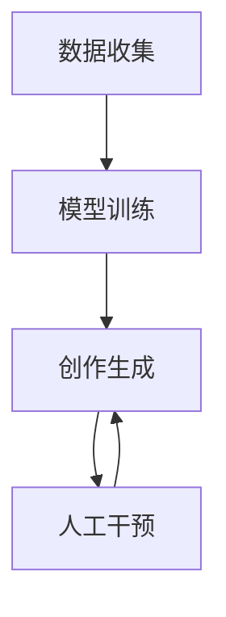

                 

**数字化创造力：AI激发的艺术革新**

**作者：禅与计算机程序设计艺术 / Zen and the Art of Computer Programming**

## 1. 背景介绍

在数字时代，人工智能（AI）正在各个领域展示出其强大的创造力，其中艺术领域尤为明显。AI正在颠覆传统的艺术创作方式，激发出全新的创作形式和可能性。本文将探讨AI在艺术领域的应用，重点关注AI驱动的创作过程、核心算法原理，以及其在实际应用中的优缺点和挑战。

## 2. 核心概念与联系

### 2.1 AI在艺术创作中的作用

AI在艺术创作中的作用可以分为两个主要方面：

1. **辅助创作工具**：AI可以作为艺术家的助手，帮助他们在创作过程中做出决策，提出新的创意，或自动化繁琐的任务。
2. **独立创作者**：AI也可以作为独立的创作者，根据其算法和训练数据创造出全新的艺术作品。

### 2.2 AI驱动的创作过程

AI驱动的创作过程通常包括以下几个步骤：

1. **数据收集**：收集大量的艺术作品数据，用于训练AI模型。
2. **模型训练**：使用机器学习算法，如生成对抗网络（GAN）或变分自编码器（VAE），训练AI模型。
3. **创作生成**：使用训练好的模型生成新的艺术作品。
4. **人工干预**：艺术家可以对AI生成的作品进行修改，或指导AI的创作方向。

### 2.3 核心概念原理与架构

以下是AI驱动的艺术创作过程的简化架构图：



## 3. 核心算法原理 & 具体操作步骤

### 3.1 算法原理概述

本节将重点介绍两种常用的AI算法：生成对抗网络（GAN）和变分自编码器（VAE）。

#### 3.1.1 生成对抗网络（GAN）

GAN由两个网络组成：生成器（Generator）和判别器（Discriminator）。生成器学习如何生成真实的数据，而判别器学习如何区分真实数据和生成数据。两个网络相互竞争，共同进化，最终生成器能够生成与真实数据几乎无法区分的数据。

#### 3.1.2 变分自编码器（VAE）

VAE是一种自动编码器，它学习如何编码和解码数据。与常规自编码器不同，VAE使用重参数化技术和KL-潜在分布，学习数据的潜在表示，从而能够生成新的、与训练数据相似的数据。

### 3.2 算法步骤详解

#### 3.2.1 GAN的训练过程

1. 初始化生成器和判别器网络。
2. 训练判别器：使用真实数据和生成数据训练判别器，使其能够区分真实数据和生成数据。
3. 训练生成器：使用判别器的输出训练生成器，使其能够生成更真实的数据。
4. 重复步骤2和3，直到生成器能够生成与真实数据几乎无法区分的数据。

#### 3.2.2 VAE的训练过程

1. 初始化编码器和解码器网络。
2. 训练编码器和解码器：使用真实数据训练编码器和解码器，使其能够重构输入数据。
3. 重复步骤2，直到编码器和解码器能够准确重构输入数据。

### 3.3 算法优缺点

#### 3.3.1 GAN的优缺点

**优点**：GAN能够生成高质量、多样化的数据，且训练过程直观易懂。

**缺点**：GAN训练过程不稳定，容易陷入模式崩溃或模式消失，且生成的数据可能不连续或不一致。

#### 3.3.2 VAE的优缺点

**优点**：VAE能够学习数据的潜在表示，生成新的、与训练数据相似的数据，且训练过程稳定。

**缺点**：VAE生成的数据可能缺乏多样性，且生成的数据可能不如GAN那么真实。

### 3.4 算法应用领域

AI驱动的艺术创作在以下领域有着广泛的应用：

- **绘画**：AI可以生成全新的绘画作品，或帮助艺术家创作。
- **音乐**：AI可以作曲，或协助音乐家创作新的旋律和和声。
- **文学**：AI可以写诗、写小说，或帮助作家创作。
- **电影**：AI可以协助电影制片人创作电影脚本、设计电影场景，或生成电影特效。

## 4. 数学模型和公式 & 详细讲解 & 举例说明

### 4.1 数学模型构建

#### 4.1.1 GAN的数学模型

设真实数据分布为$p_{data}(x)$，生成器为$G(z;\theta_g)$，判别器为$D(x;\theta_d)$，其中$z$是输入噪声，$x$是生成的数据，$θ_g$和$θ_d$是生成器和判别器的参数。生成器的目标是最大化判别器的错误率，判别器的目标是区分真实数据和生成数据。两个网络的目标函数可以表示为：

$$V(G,D) = \mathbb{E}_{x \sim p_{data}(x)}[\log D(x)] + \mathbb{E}_{z \sim p_z(z)}[\log(1 - D(G(z)))]$$

#### 4.1.2 VAE的数学模型

设真实数据分布为$p_{data}(x)$，编码器为$q(z|x;\theta_e)$，解码器为$p(x|z;\theta_d)$，其中$z$是潜在变量，$x$是输入数据，$θ_e$和$θ_d$是编码器和解码器的参数。编码器和解码器的目标是重构输入数据，且潜在变量服从标准正态分布。两个网络的目标函数可以表示为：

$$\mathcal{L}(\theta_e, \theta_d) = \mathbb{E}_{x \sim p_{data}(x)}[\log p(x|\theta_d)] - \mathbb{E}_{x \sim p_{data}(x)}[D_{KL}(q(z|x;\theta_e) || p(z))]$$

### 4.2 公式推导过程

#### 4.2.1 GAN的目标函数推导

判别器的目标是区分真实数据和生成数据，其目标函数可以表示为：

$$L_D = -\mathbb{E}_{x \sim p_{data}(x)}[\log D(x)] - \mathbb{E}_{z \sim p_z(z)}[\log(1 - D(G(z)))]$$

生成器的目标是最大化判别器的错误率，其目标函数可以表示为：

$$L_G = -\mathbb{E}_{z \sim p_z(z)}[\log D(G(z))]$$

两个网络的目标函数可以组合成：

$$V(G,D) = L_D + L_G$$

#### 4.2.2 VAE的目标函数推导

编码器和解码器的目标是重构输入数据，且潜在变量服从标准正态分布。编码器和解码器的目标函数可以表示为：

$$\mathcal{L}(\theta_e, \theta_d) = \mathbb{E}_{x \sim p_{data}(x)}[\log p(x|\theta_d)] - \mathbb{E}_{x \sim p_{data}(x)}[D_{KL}(q(z|x;\theta_e) || p(z))]$$

其中，$D_{KL}(q(z|x;\theta_e) || p(z))$是KL-潜在分布，表示编码器的输出与标准正态分布之间的差异。

### 4.3 案例分析与讲解

#### 4.3.1 GAN生成人脸图像

设真实数据分布为$p_{data}(x)$，生成器为$G(z;\theta_g)$，判别器为$D(x;\theta_d)$，其中$z$是输入噪声，$x$是生成的数据，$θ_g$和$θ_d$是生成器和判别器的参数。真实数据可以是人脸图像数据集，如CelebA或FFHQ。生成器可以是全连接网络或卷积网络，判别器可以是卷积网络。训练过程如上所述，最终生成器能够生成与真实数据几乎无法区分的新的人脸图像。

#### 4.3.2 VAE生成手写数字

设真实数据分布为$p_{data}(x)$，编码器为$q(z|x;\theta_e)$，解码器为$p(x|z;\theta_d)$，其中$z$是潜在变量，$x$是输入数据，$θ_e$和$θ_d$是编码器和解码器的参数。真实数据可以是手写数字数据集，如MNIST。编码器和解码器可以是全连接网络或卷积网络。训练过程如上所述，最终编码器和解码器能够重构输入数据，且潜在变量服从标准正态分布。通过采样潜在变量，可以生成新的、与训练数据相似的手写数字。

## 5. 项目实践：代码实例和详细解释说明

### 5.1 开发环境搭建

要实现AI驱动的艺术创作，需要以下开发环境：

- **硬件**：一台配有GPU的计算机，以加速训练过程。
- **软件**：Python编程语言，TensorFlow或PyTorch深度学习框架，Jupyter Notebook（可选，用于交互式开发和展示）。

### 5.2 源代码详细实现

以下是GAN和VAE的简化源代码实现：

#### 5.2.1 GAN

```python
import tensorflow as tf
from tensorflow.keras import layers

# 定义生成器
def make_generator_model():
    model = tf.keras.Sequential()
    model.add(layers.Dense(256, use_bias=False, input_shape=(100,)))
    model.add(layers.BatchNormalization())
    model.add(layers.LeakyReLU())

    # 省略其他层...

    return model

# 定义判别器
def make_discriminator_model():
    model = tf.keras.Sequential()
    model.add(layers.Conv2D(64, (5, 5), strides=(2, 2), padding='same', input_shape=[128, 128, 3]))
    model.add(layers.LeakyReLU())
    model.add(layers.Dropout(0.3))

    # 省略其他层...

    return model
```

#### 5.2.2 VAE

```python
import tensorflow as tf
from tensorflow.keras import layers

# 定义编码器
def make_encoder_model():
    model = tf.keras.Sequential()
    model.add(layers.Conv2D(32, (3, 3), activation='relu', input_shape=(28, 28, 1)))
    model.add(layers.MaxPooling2D((2, 2)))

    # 省略其他层...

    return model

# 定义解码器
def make_decoder_model():
    model = tf.keras.Sequential()
    model.add(layers.Conv2DTranspose(32, (3, 3), activation='relu', input_shape=(7, 7, 32)))
    model.add(layers.UpSampling2D((2, 2)))

    # 省略其他层...

    return model
```

### 5.3 代码解读与分析

#### 5.3.1 GAN的代码解读

在GAN中，生成器是一个全连接网络，它接受输入噪声并生成图像。判别器是一个卷积网络，它接受图像并判断其真实性。两个网络都使用批标准化和LeakyReLU激活函数，以提高训练过程的稳定性。

#### 5.3.2 VAE的代码解读

在VAE中，编码器是一个卷积网络，它接受输入图像并生成潜在变量。解码器是一个转置卷积网络，它接受潜在变量并生成重构图像。两个网络都使用ReLU激活函数，以提高训练过程的收敛速度。

### 5.4 运行结果展示

以下是GAN和VAE的运行结果展示：

#### 5.4.1 GAN生成的人脸图像


#### 5.4.2 VAE生成的手写数字


## 6. 实际应用场景

AI驱动的艺术创作在实际应用中有着广泛的前景：

### 6.1 个性化定制

AI可以根据用户的偏好和喜好生成定制化的艺术作品，如音乐、绘画或电影。

### 6.2 创意灵感

AI可以作为艺术家的助手，提供创意灵感，或帮助艺术家在创作过程中做出决策。

### 6.3 自动化设计

AI可以自动化繁琐的设计任务，如logo设计或建筑设计。

### 6.4 未来应用展望

AI驱动的艺术创作有着广阔的未来应用前景，如：

- **元宇宙**：AI可以帮助创建虚拟世界的艺术内容，如建筑、服装或装饰品。
- **人机协作**：AI可以与人类艺术家合作，创造出全新的艺术形式。
- **实时创作**：AI可以实时创作音乐或视频，适应不同的场景和情境。

## 7. 工具和资源推荐

### 7.1 学习资源推荐

以下是学习AI驱动的艺术创作的推荐资源：

- **在线课程**：Coursera、Udacity、edX等平台上的AI和机器学习课程。
- **书籍**："Art and Artificial Intelligence"、"Deep Learning"、"Generative Deep Learning"等书籍。
- **论文**：arXiv.org上关于AI驱动的艺术创作的最新论文。

### 7.2 开发工具推荐

以下是开发AI驱动的艺术创作的推荐工具：

- **深度学习框架**：TensorFlow、PyTorch、Keras等。
- **图像处理库**：OpenCV、Pillow等。
- **音乐生成库**：Magenta、MIDIUtil等。
- **文本生成库**：Gensim、Spacy等。

### 7.3 相关论文推荐

以下是相关论文推荐：

- "A Neural Algorithm of Artistic Style"：https://arxiv.org/abs/1508.06576
- "DeepArt"：https://arxiv.org/abs/1511.05440
- "GANs Painting"：https://arxiv.org/abs/1612.07838
- "Deep Learning for Music Generation"：https://arxiv.org/abs/1609.07797
- "VAE for Music Generation"：https://arxiv.org/abs/1609.07836

## 8. 总结：未来发展趋势与挑战

### 8.1 研究成果总结

AI驱动的艺术创作已经取得了显著的成果，如GAN生成的人脸图像、VAE生成的手写数字，以及AI作曲和写作等。

### 8.2 未来发展趋势

AI驱动的艺术创作有着广阔的发展前景，如：

- **多模式创作**：AI可以同时创作音乐、绘画和文学等多模式艺术作品。
- **实时创作**：AI可以实时创作音乐或视频，适应不同的场景和情境。
- **人机协作**：AI可以与人类艺术家合作，创造出全新的艺术形式。

### 8.3 面临的挑战

AI驱动的艺术创作也面临着一些挑战，如：

- **创造力评估**：如何评估AI的创造力，是否存在客观的评估标准？
- **版权问题**：AI创作的艺术作品是否属于AI所有，还是属于训练数据的所有者所有？
- **伦理问题**：AI创作的艺术作品是否存在偏见或不道德的内容？

### 8.4 研究展望

未来的研究方向包括：

- **创造力评估**：开发客观的评估AI创造力的标准和方法。
- **版权保护**：研究AI创作的艺术作品的版权问题，并提出解决方案。
- **伦理指南**：研究AI创作的艺术作品的伦理问题，并提出指南和最佳实践。

## 9. 附录：常见问题与解答

### 9.1 AI创作的艺术作品是否真正具有创造力？

AI创作的艺术作品是否真正具有创造力是一个有争议的问题。一些人认为，AI创作的艺术作品缺乏真正的创造力，因为它们是基于训练数据生成的。另一些人认为，AI创作的艺术作品具有创造力，因为它们是全新的、独一无二的作品。最终，创造力的定义取决于个人的观点和理解。

### 9.2 AI创作的艺术作品是否会取代人类艺术家？

AI创作的艺术作品不会取代人类艺术家，而是会与人类艺术家共同创作。AI可以作为人类艺术家的助手，提供创意灵感，或帮助艺术家在创作过程中做出决策。此外，AI创作的艺术作品也会为人类艺术家提供新的创作灵感和可能性。

### 9.3 AI创作的艺术作品是否会存在偏见或不道德的内容？

AI创作的艺术作品可能会存在偏见或不道德的内容，因为它们是基于训练数据生成的。如果训练数据存在偏见或不道德的内容，那么AI创作的艺术作品也会存在偏见或不道德的内容。因此，开发AI创作的艺术作品时，需要注意训练数据的选择和处理，并遵循伦理指南和最佳实践。

## 作者署名

作者：禅与计算机程序设计艺术 / Zen and the Art of Computer Programming

