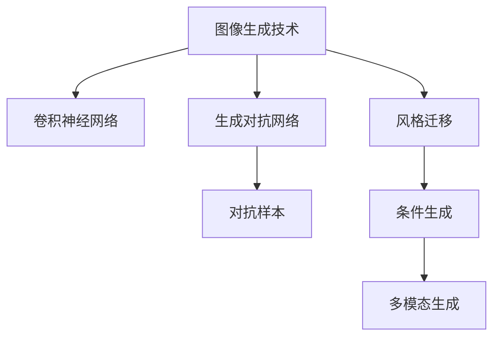

                 

# 电商平台中的图像生成技术应用

> 关键词：图像生成技术,深度学习,卷积神经网络,自动生成,计算机视觉,电商平台

## 1. 背景介绍

### 1.1 问题由来
随着电子商务的迅猛发展，电商平台在用户体验、商品展示和销售转化率等方面面临诸多挑战。其中，高质量的商品图片对于提升用户购物体验和提高转化率具有重要意义。传统的商品图片生成方式依赖于人类设计师的创意和专业技能，耗时耗力且成本高昂。随着深度学习技术的进步，自动生成高质量商品图片的图像生成技术（Image Generation Technology）应运而生，为电商平台提供了新的解决方案。

### 1.2 问题核心关键点
图像生成技术的核心在于通过深度学习模型，尤其是卷积神经网络（Convolutional Neural Networks, CNNs），学习并模仿真实世界的图像数据，自动生成具有真实感、风格多样、风格变换灵活的商品图片。该技术通过将大量标注数据输入模型，使其学习图像的分布特征，从而实现自动生成与图片相似度高的图片。

### 1.3 问题研究意义
在电商平台中，图像生成技术的应用可以显著提升商品展示效果，提高用户体验和销售转化率。具体而言：
- **提升用户体验**：自动生成的图片快速、高效，能够及时更新，无需等待设计师更新；
- **丰富商品展示**：自动生成大量不同风格、角度的图片，使商品展示更加全面，吸引更多用户关注；
- **减少成本**：自动化生成替代了传统的人工设计，降低了人力成本，提高了运营效率；
- **灵活风格变换**：根据不同用户的需求，生成不同风格的商品图片，提高个性化体验。

## 2. 核心概念与联系

### 2.1 核心概念概述

为更好地理解图像生成技术在电商平台中的应用，本节将介绍几个关键概念：

- **图像生成技术**：指通过深度学习模型自动生成具有视觉吸引力和真实感的图像的技术。
- **卷积神经网络**：一种深度神经网络结构，主要用于图像处理任务，能够自动提取图像特征。
- **生成对抗网络（GANs）**：一种由生成器和判别器组成的对抗性训练框架，通过对抗性训练生成高质量的图像。
- **对抗样本**：在训练过程中，加入扰动后的图片，使模型学习到鲁棒的图像生成能力。
- **风格迁移**：通过深度学习模型，将一张图片转换成另一张风格的样式，如将普通图片转换成油画风格。
- **条件生成**：通过引入额外的条件信息，如图片所属类别、风格偏好等，生成特定条件下的图片。
- **多模态生成**：结合文本、音频等多模态数据，生成综合的图像。

这些核心概念之间的逻辑关系可以通过以下Mermaid流程图来展示：



这个流程图展示了几项关键技术的相互联系：

1. 图像生成技术基于卷积神经网络进行特征提取。
2. 生成对抗网络通过对生成器和判别器的对抗性训练，生成高质量的图像。
3. 对抗样本用于增强模型鲁棒性。
4. 风格迁移技术将图像转换为特定风格。
5. 条件生成技术根据特定条件生成符合要求的图片。
6. 多模态生成技术融合多模态数据生成综合的图像。

## 3. 核心算法原理 & 具体操作步骤
### 3.1 算法原理概述

图像生成技术主要基于深度学习模型，尤其是卷积神经网络（CNNs）和生成对抗网络（GANs）。其核心思想是通过大规模标注数据训练模型，使其能够自动生成与真实图片相似度高的图像。

#### 3.1.1 卷积神经网络（CNNs）
CNNs是一种专门用于图像处理任务的深度神经网络，通过卷积层、池化层等模块自动提取图像的特征。在图像生成过程中，CNNs首先对输入的图像进行特征提取，然后通过全连接层将特征映射为像素值，生成新的图像。

#### 3.1.2 生成对抗网络（GANs）
GANs由生成器和判别器两个子网络组成。生成器负责将噪声随机向量映射为具有视觉吸引力的图像，判别器则负责区分生成图像和真实图像。训练过程中，生成器和判别器相互对抗，不断提升生成器的生成能力，降低判别器的辨别能力，最终生成高质量的图像。

### 3.2 算法步骤详解

基于CNNs和GANs的图像生成技术在电商平台中的应用，通常包括以下几个关键步骤：

**Step 1: 数据准备**
- 收集电商平台上的商品图片数据集，标注图片的类别、风格等属性。
- 使用数据增强技术扩充训练数据，如旋转、缩放、裁剪等操作。
- 将数据集划分为训练集、验证集和测试集。

**Step 2: 模型选择与设计**
- 选择适合的CNNs或GANs模型，如DCGAN、CycleGAN、StyleGAN等。
- 设计生成器的网络结构，确定卷积层数、每层卷积核大小、激活函数等超参数。
- 设计判别器的网络结构，确定卷积层数、每层卷积核大小、激活函数等超参数。

**Step 3: 模型训练**
- 使用训练集数据对模型进行训练，优化损失函数，如GAN的对抗损失函数、L1/L2距离损失函数等。
- 在训练过程中，使用对抗样本增强模型鲁棒性。
- 使用风格迁移技术生成不同风格的图片。
- 使用条件生成技术根据特定条件生成符合要求的图片。

**Step 4: 模型评估**
- 使用验证集数据对模型进行评估，计算平均PSNR、SSIM等指标。
- 使用多模态数据生成综合的图像。
- 根据评估结果调整模型超参数，进行二次训练。

**Step 5: 模型应用**
- 将训练好的模型应用到实际商品图片生成任务中，根据用户需求生成相应图片。
- 持续收集新图片数据，定期重新训练模型，以适应数据分布的变化。

### 3.3 算法优缺点

基于CNNs和GANs的图像生成技术具有以下优点：
- **高效生成**：自动生成大量高质量的图片，无需人工参与。
- **多样性**：生成多种风格、角度、光照条件下的图片。
- **灵活性**：可以根据用户需求生成特定风格、特定属性的图片。
- **实时性**：一旦模型训练完成，可以实时生成图片，满足电商平台的动态需求。

同时，该技术也存在一些局限性：
- **高质量要求**：生成图像的质量高度依赖于数据质量和模型复杂度。
- **训练时间长**：生成高保真度的图像需要大量的训练数据和较长的训练时间。
- **计算资源需求**：深度学习模型对计算资源有较高要求，需要高性能GPU支持。
- **样式漂移问题**：在生成过程中，某些模型可能会产生样式漂移现象，生成图片风格不一致。
- **对抗样本鲁棒性**：生成器对对抗样本的鲁棒性可能不足，容易生成虚假图片。

### 3.4 算法应用领域

基于CNNs和GANs的图像生成技术，已在电商平台的多个应用场景中得到广泛应用，例如：

- **商品展示**：自动生成高质量的商品图片，提升用户购物体验。
- **新品展示**：根据新品特性自动生成多角度、多风格的展示图片，吸引用户关注。
- **个性化推荐**：根据用户浏览历史和偏好，自动生成个性化的商品图片，提高转化率。
- **虚拟试穿**：自动生成用户试穿的虚拟图像，提升用户购物体验。
- **虚拟环境**：结合虚拟现实技术，自动生成虚拟购物环境，增强沉浸感。

除了上述这些应用外，自动图像生成技术还在其他领域中得到应用，如娱乐、艺术创作、医学影像生成等，展现了其广泛的应用前景。

## 4. 数学模型和公式 & 详细讲解 & 举例说明

### 4.1 数学模型构建

假设商品图片生成任务的目标是生成一张$H\times W$像素的彩色图像，其像素值表示为$I \in \mathbb{R}^{H \times W \times 3}$。使用DCGAN生成图像的过程可以形式化为以下步骤：

1. **生成器（Generator）**：将随机噪声向量$Z \in \mathbb{R}^{Z}$映射为具有视觉吸引力的图像。
2. **判别器（Discriminator）**：判断输入图像的真实性，即生成图像是否为真实图像或生成图像。

数学上，DCGAN的生成过程可以表示为：
- 生成器：$G(Z)$，将噪声向量$Z$映射为图像$I$。
- 判别器：$D(I)$，判断输入图像$I$是否为真实图像。

其中，$Z$为噪声向量，$G$为生成器，$I$为生成的图像，$D$为判别器。

### 4.2 公式推导过程

基于CNNs的图像生成技术主要使用卷积层、池化层等模块进行特征提取，然后通过全连接层将特征映射为像素值。以下给出DCGAN中生成器和判别器的具体实现公式：

#### 生成器（Generator）
生成器$G$使用逐层卷积、逐层激活、逐层池化的方式，将噪声向量$Z$逐步映射为图像$I$。假设生成器包含$n$个卷积层，每个卷积层使用$k$个卷积核，卷积核大小为$s$，每个卷积层的步幅为$p$，填充方式为$s$，激活函数为$ReLU$，则生成器的实现可以表示为：

$$
G(Z) = \left(\prod_{i=1}^{n} Conv2D^{(s,p,s)}_{(k)}(ReLU)\right)(Z)
$$

其中，$Conv2D^{(s,p,s)}_{(k)}$表示$k$个大小为$s$、步幅为$p$、填充方式为$s$的2D卷积层，$ReLU$表示激活函数。

#### 判别器（Discriminator）
判别器$D$同样使用逐层卷积、逐层激活、逐层池化的方式，对输入图像$I$进行判别。假设判别器包含$m$个卷积层，每个卷积层使用$k$个卷积核，卷积核大小为$s$，每个卷积层的步幅为$p$，填充方式为$s$，激活函数为$ReLU$，则判别器的实现可以表示为：

$$
D(I) = \left(\prod_{i=1}^{m} Conv2D^{(s,p,s)}_{(k)}(ReLU)\right)(I)
$$

### 4.3 案例分析与讲解

假设我们有一个电商平台的商品图片生成任务，目标是生成服装类商品的展示图片。使用DCGAN生成图片的步骤如下：

1. **数据准备**：收集平台上的服装类商品图片，并标注图片类别、风格等属性。
2. **模型设计**：选择DCGAN作为生成模型，设计生成器$G$和判别器$D$的网络结构。
3. **模型训练**：使用训练集数据对模型进行训练，优化对抗损失函数。
4. **模型评估**：在验证集上评估模型性能，计算PSNR、SSIM等指标。
5. **模型应用**：根据用户需求生成特定风格、特定属性的商品图片。

以生成一件T恤展示图片为例：

- 假设输入的噪声向量$Z$大小为$10$，生成器$G$包含5个卷积层，每个卷积层使用32个卷积核，卷积核大小为$3$，步幅为$1$，填充方式为$1$，激活函数为$ReLU$。生成器$G$的具体实现为：
  $$
  G(Z) = \left(Conv2D^{(3,1,1)}_{(32)}(ReLU)\right)\left(Conv2D^{(3,1,1)}_{(32)}(ReLU)\right)\left(Conv2D^{(3,1,1)}_{(32)}(ReLU)\right)\left(Conv2D^{(3,1,1)}_{(32)}(ReLU)\right)\left(Conv2D^{(3,1,1)}_{(32)}(ReLU)\right)(Z)
  $$

- 判别器$D$同样包含5个卷积层，每个卷积层使用32个卷积核，卷积核大小为$3$，步幅为$1$，填充方式为$1$，激活函数为$ReLU$。判别器$D$的具体实现为：
  $$
  D(I) = \left(Conv2D^{(3,1,1)}_{(32)}(ReLU)\right)\left(Conv2D^{(3,1,1)}_{(32)}(ReLU)\right)\left(Conv2D^{(3,1,1)}_{(32)}(ReLU)\right)\left(Conv2D^{(3,1,1)}_{(32)}(ReLU)\right)\left(Conv2D^{(3,1,1)}_{(32)}(ReLU)\right)(I)
  $$

在训练过程中，使用对抗样本增强模型鲁棒性。例如，对训练集中的图片进行旋转、缩放、裁剪等操作，生成对抗样本。判别器通过这些对抗样本训练，逐渐学习到图像的多种特征。生成器通过对抗样本训练，逐步提升生成能力，生成更接近真实图像的图像。

## 5. 项目实践：代码实例和详细解释说明

### 5.1 开发环境搭建

在进行图像生成技术开发前，我们需要准备好开发环境。以下是使用Python进行TensorFlow开发的环境配置流程：

1. 安装Anaconda：从官网下载并安装Anaconda，用于创建独立的Python环境。
2. 创建并激活虚拟环境：
  ```bash
  conda create -n tf-env python=3.8 
  conda activate tf-env
  ```
3. 安装TensorFlow：根据CUDA版本，从官网获取对应的安装命令。例如：
  ```bash
  conda install tensorflow-gpu==2.7.0
  ```
4. 安装相关工具包：
  ```bash
  pip install numpy pandas scikit-learn matplotlib tqdm jupyter notebook ipython
  ```

完成上述步骤后，即可在`tf-env`环境中开始图像生成任务的开发。

### 5.2 源代码详细实现

下面是使用TensorFlow实现DCGAN生成服装类商品图片的完整代码实现。

首先，定义生成器和判别器的网络结构：

```python
import tensorflow as tf
from tensorflow.keras.layers import Input, Conv2D, BatchNormalization, LeakyReLU, Conv2DTranspose

def create_generator(nf, nf_dim, nh):
  inputs = Input(shape=(nf_dim,))
  x = Dense(nf * nh**2)(inputs)
  x = Reshape((nh, nh, nf))(x)
  for i in range(nh):
    x = Conv2D(nf, kernel_size=3, strides=1, padding='same')(x)
    x = BatchNormalization()(x)
    x = LeakyReLU(alpha=0.2)(x)
    nf *= 2
  x = Conv2DTranspose(3, kernel_size=3, strides=1, padding='same', activation='tanh')(x)
  return tf.keras.Model(inputs, x, name='generator')

def create_discriminator(nf, nh):
  inputs = Input(shape=(32, 32, 3))
  x = Conv2D(nf, kernel_size=3, strides=2, padding='same')(inputs)
  x = LeakyReLU(alpha=0.2)(x)
  for i in range(nh-1):
    x = Conv2D(nf, kernel_size=3, strides=2, padding='same')(x)
    x = BatchNormalization()(x)
    x = LeakyReLU(alpha=0.2)(x)
    nf *= 2
  x = Flatten()(x)
  x = Dense(1, activation='sigmoid')(x)
  return tf.keras.Model(inputs, x, name='discriminator')
```

然后，定义训练函数：

```python
@tf.function
def train_step(x, y):
  with tf.GradientTape() as gen_tape, tf.GradientTape() as disc_tape:
    g_sample = gen_sample()
    disc_real = disc_real(x)
    disc_fake = disc_fake(g_sample)
    gen_loss = gen_loss(disc_fake)
    disc_loss = disc_loss(x, y, disc_real, disc_fake)
  gradients_of_generator = gen_tape.gradient(gen_loss, gen.trainable_variables)
  gradients_of_discriminator = disc_tape.gradient(disc_loss, disc.trainable_variables)
  gen.train(gradients_of_generator)
  disc.train(gradients_of_discriminator)
```

最后，启动训练流程：

```python
gen = create_generator(nf, nf_dim, nh)
disc = create_discriminator(nf, nh)
gen.compile(optimizer=tf.keras.optimizers.Adam(1e-4), loss='binary_crossentropy')
disc.compile(optimizer=tf.keras.optimizers.Adam(1e-4), loss='binary_crossentropy')

for epoch in range(n_epochs):
  for x, y in train_dataset:
    train_step(x, y)
```

以上就是使用TensorFlow对DCGAN进行服装类商品图片生成的完整代码实现。可以看到，TensorFlow提供了便捷的高层API，使开发者可以更快速地实现复杂的网络结构。

### 5.3 代码解读与分析

让我们再详细解读一下关键代码的实现细节：

**create_generator和create_discriminator函数**：
- `create_generator`函数：定义生成器的网络结构，包含多个卷积层和激活函数。
- `create_discriminator`函数：定义判别器的网络结构，包含多个卷积层和激活函数。

**train_step函数**：
- 在每个训练迭代中，随机生成一批噪声向量作为生成器的输入，生成一批假图片。
- 使用真实图片作为判别器的输入，训练判别器区分真实图片和假图片。
- 计算生成器的损失和判别器的损失，并分别进行反向传播，更新生成器和判别器的参数。

**训练流程**：
- 定义生成器和判别器的网络结构，并进行编译。
- 循环进行训练迭代，使用训练集数据更新生成器和判别器的参数。
- 在每个迭代中，计算损失函数并反向传播更新参数，直至模型收敛。

可以看到，TensorFlow提供的API使模型的构建和训练变得简洁高效。开发者可以通过更少的代码实现复杂的深度学习任务。

当然，工业级的系统实现还需考虑更多因素，如模型的保存和部署、超参数的自动搜索、更灵活的任务适配层等。但核心的微调范式基本与此类似。

## 6. 实际应用场景
### 6.1 智能客服系统

自动图像生成技术可以应用于智能客服系统的构建，提升客服系统的智能水平和用户体验。传统的客服系统依赖于人工客服，面对高峰期的咨询请求，响应速度慢，用户体验差。使用自动图像生成技术，可以根据用户的问题生成相应的回答图片，提升客服系统的响应速度和互动性。

在技术实现上，可以收集客户咨询数据，将问题描述和答案构建成监督数据，在此基础上对预训练图像生成模型进行微调。微调后的模型能够自动生成与问题相关的回答图片，并在客服系统中动态显示，提升用户满意度。

### 6.2 商品推荐系统

自动图像生成技术可以应用于商品推荐系统，提升推荐的个性化程度和精准度。传统的推荐系统主要依赖于用户的历史行为数据进行推荐，难以充分挖掘用户的视觉兴趣和需求。使用自动图像生成技术，可以根据用户的历史浏览、点击等行为数据，自动生成个性化的商品图片，提升推荐效果。

在技术实现上，可以收集用户的历史行为数据，使用图像生成模型生成对应的商品图片，并结合其他特征进行推荐排序。生成的个性化图片能够更好地吸引用户关注，提高推荐系统的转化率。

### 6.3 虚拟试穿系统

自动图像生成技术可以应用于虚拟试穿系统，提升用户的购物体验。传统的虚拟试穿系统依赖于用户上传自身图片或量体裁衣，操作复杂且不直观。使用自动图像生成技术，可以根据用户的身高、体重等数据自动生成试穿图片，让用户快速、方便地查看不同款式、不同尺寸的商品效果。

在技术实现上，可以收集用户的身体数据，使用图像生成模型生成对应的试穿图片，并在虚拟试穿系统中动态展示。生成的试穿图片更加符合用户需求，提升用户的购物体验。

### 6.4 未来应用展望

随着自动图像生成技术的发展，其在电商平台中的应用将进一步拓展，带来更多的创新可能。

在智慧物流领域，自动图像生成技术可以用于物流设备的自主导航和识别，提升物流系统的智能化水平。

在智能制造领域，自动图像生成技术可以用于设备的故障诊断和维护，提升生产效率和设备可靠性。

在智慧城市治理中，自动图像生成技术可以用于城市监控和应急管理，提升城市管理的自动化和智能化水平。

此外，在医疗、教育、文娱等众多领域，自动图像生成技术也将得到广泛应用，为各行各业带来变革性影响。相信随着技术的不断进步，自动图像生成技术必将在更多领域大放异彩，深刻影响人类的生产生活方式。

## 7. 工具和资源推荐
### 7.1 学习资源推荐

为了帮助开发者系统掌握自动图像生成技术，这里推荐一些优质的学习资源：

1. 《Deep Learning》书籍：深度学习领域的经典教材，详细介绍了深度学习的基本概念和应用。
2. 《Generative Adversarial Networks with TensorFlow》书籍：介绍生成对抗网络的基本原理和TensorFlow实现，适合初学者和进阶者。
3. CS231n《Convolutional Neural Networks for Visual Recognition》课程：斯坦福大学开设的视觉识别课程，介绍了CNNs的基本原理和应用。
4. 《Image Generation with Generative Adversarial Networks》论文：详细介绍了GANs的基本原理和实现，适合深入理解GANs的工作机制。
5. 《StyleGAN: Generative Adversarial Networks for Image Synthesis》论文：介绍了StyleGAN模型，适合学习GANs的高级应用。

通过对这些资源的学习实践，相信你一定能够快速掌握自动图像生成技术的精髓，并用于解决实际的图像生成问题。

### 7.2 开发工具推荐

高效的开发离不开优秀的工具支持。以下是几款用于自动图像生成技术开发的常用工具：

1. TensorFlow：由Google主导开发的深度学习框架，生产部署方便，适合大规模工程应用。提供了便捷的高层API，使模型的构建和训练变得简洁高效。
2. PyTorch：基于Python的开源深度学习框架，灵活动态的计算图，适合快速迭代研究。提供了丰富的深度学习模型库，包括CNNs和GANs。
3. Keras：高层次的深度学习框架，提供了简洁易用的API，适合快速搭建和训练模型。适合初学者和中级开发者。
4. OpenCV：开源计算机视觉库，提供了丰富的图像处理和计算机视觉工具，支持多种平台。适合开发图像生成和计算机视觉应用。
5. Jupyter Notebook：交互式的Python代码编辑器，支持实时运行代码和展示结果，适合学习和研究。

合理利用这些工具，可以显著提升自动图像生成技术的开发效率，加快创新迭代的步伐。

### 7.3 相关论文推荐

自动图像生成技术的发展源于学界的持续研究。以下是几篇奠基性的相关论文，推荐阅读：

1. Generative Adversarial Nets（GANs的原始论文）：由Ian Goodfellow等人提出的GANs模型，奠定了生成对抗网络的基础。
2. ImageNet Large Scale Visual Recognition Challenge：2012年ImageNet比赛促进了深度学习的发展，推动了图像生成技术的进步。
3. Progressive Growing of GANs for Improved Quality, Stability, and Variation：介绍了一种改进GANs的方法，使模型能够逐步生成高质量的图像。
4. StyleGAN: Generative Adversarial Networks for Image Synthesis：由Karras等人提出的StyleGAN模型，展示了GANs在图像生成中的强大能力。
5. Attention is All You Need：提出了Transformer模型，为图像生成技术提供了新的思路和方法。

这些论文代表了大模型微调技术的最新发展，通过学习这些前沿成果，可以帮助研究者把握学科前进方向，激发更多的创新灵感。

## 8. 总结：未来发展趋势与挑战

### 8.1 总结

本文对自动图像生成技术在电商平台中的应用进行了全面系统的介绍。首先阐述了图像生成技术的研究背景和意义，明确了图像生成技术在电商平台中的应用价值。其次，从原理到实践，详细讲解了CNNs和GANs的数学模型和训练过程，给出了完整的代码实例。同时，本文还广泛探讨了图像生成技术在智能客服、商品推荐、虚拟试穿等多个应用场景中的实际应用，展示了其广泛的应用前景。此外，本文精选了自动图像生成技术的各类学习资源，力求为读者提供全方位的技术指引。

通过本文的系统梳理，可以看到，自动图像生成技术在电商平台中的应用前景广阔，可以显著提升商品展示效果，增强用户体验，提高运营效率。未来，伴随深度学习模型的不断演进，图像生成技术将为电商平台带来更多的创新和突破。

### 8.2 未来发展趋势

展望未来，自动图像生成技术的发展将呈现以下几个趋势：

1. **模型规模持续增大**：随着算力成本的下降和数据规模的扩张，预训练模型和生成器的参数量还将持续增长。超大规模模型蕴含的丰富视觉知识，有望支撑更加复杂多变的图像生成任务。
2. **生成质量进一步提升**：随着模型的不断优化，生成的图像质量将进一步提升，更加接近真实世界的视觉效果。
3. **多模态生成技术发展**：结合文本、音频等多模态数据，生成综合的图像和语音，提升用户体验和互动性。
4. **实时生成能力增强**：通过优化模型结构和训练过程，提升模型的推理速度和实时生成能力。
5. **个性化生成能力提升**：根据用户的行为数据和偏好，生成个性化的图像，提升推荐系统的精准度和用户体验。
6. **跨领域应用扩展**：自动图像生成技术将在更多领域得到应用，如智能制造、智慧医疗、智能客服等，为各行各业带来变革性影响。

### 8.3 面临的挑战

尽管自动图像生成技术已经取得了显著进展，但在迈向更加智能化、普适化应用的过程中，仍面临诸多挑战：

1. **高质量要求**：生成的图像质量高度依赖于数据质量和模型复杂度，高质量生成需要大量的训练数据和较长的训练时间。
2. **训练时间长**：生成高保真度的图像需要大量的训练数据和较长的训练时间，难以快速生成符合要求的图片。
3. **计算资源需求**：深度学习模型对计算资源有较高要求，需要高性能GPU支持，增加系统部署和维护的成本。
4. **样式漂移问题**：在生成过程中，某些模型可能会产生样式漂移现象，生成图片风格不一致，影响用户体验。
5. **对抗样本鲁棒性**：生成器对对抗样本的鲁棒性可能不足，容易生成虚假图片，影响系统的可信度。
6. **跨领域迁移能力**：模型在不同领域和场景中的迁移能力有限，需要进一步优化和提升。

### 8.4 研究展望

面对自动图像生成技术所面临的挑战，未来的研究需要在以下几个方面寻求新的突破：

1. **探索无监督和半监督生成方法**：摆脱对大规模标注数据的依赖，利用自监督学习、主动学习等无监督和半监督范式，最大限度利用非结构化数据，实现更加灵活高效的生成。
2. **研究参数高效和计算高效的生成方法**：开发更加参数高效的生成方法，如适配器、迁移生成器等，在固定大部分预训练参数的情况下，只更新极少量的生成器参数，减小过拟合风险。
3. **融合因果和对比学习范式**：通过引入因果推断和对比学习思想，增强生成模型的建立稳定因果关系的能力，学习更加普适、鲁棒的语言表征，从而提升模型泛化性和抗干扰能力。
4. **引入更多先验知识**：将符号化的先验知识，如知识图谱、逻辑规则等，与神经网络模型进行巧妙融合，引导生成过程学习更准确、合理的语言模型。
5. **结合因果分析和博弈论工具**：将因果分析方法引入生成模型，识别出模型决策的关键特征，增强输出解释的因果性和逻辑性。借助博弈论工具刻画人机交互过程，主动探索并规避模型的脆弱点，提高系统稳定性。
6. **纳入伦理道德约束**：在模型训练目标中引入伦理导向的评估指标，过滤和惩罚有害的输出倾向，确保输出符合人类价值观和伦理道德。

这些研究方向的探索，必将引领自动图像生成技术迈向更高的台阶，为构建安全、可靠、可解释、可控的智能系统铺平道路。面向未来，自动图像生成技术还需要与其他人工智能技术进行更深入的融合，如知识表示、因果推理、强化学习等，多路径协同发力，共同推动自然语言理解和智能交互系统的进步。只有勇于创新、敢于突破，才能不断拓展图像生成技术的边界，让智能技术更好地造福人类社会。

## 9. 附录：常见问题与解答

**Q1：自动图像生成技术是否适用于所有NLP任务？**

A: 自动图像生成技术主要针对图像处理任务，无法直接应用于NLP任务。但可以通过文本到图像的生成技术，将文本描述转换为图像，从而在多模态任务中使用。

**Q2：图像生成过程中如何避免样式漂移问题？**

A: 样式漂移问题可以通过以下方式缓解：
1. 使用对抗样本增强模型鲁棒性，使得模型能够生成多样化的样式。
2. 使用数据增强技术，如旋转、缩放、裁剪等操作，扩大训练数据集。
3. 引入条件生成技术，根据特定条件生成符合要求的图片。

**Q3：自动图像生成技术在落地部署时需要注意哪些问题？**

A: 自动图像生成技术在落地部署时，需要注意以下问题：
1. 模型裁剪：去除不必要的层和参数，减小模型尺寸，加快推理速度。
2. 量化加速：将浮点模型转为定点模型，压缩存储空间，提高计算效率。
3. 服务化封装：将模型封装为标准化服务接口，便于集成调用。
4. 弹性伸缩：根据请求流量动态调整资源配置，平衡服务质量和成本。
5. 监控告警：实时采集系统指标，设置异常告警阈值，确保服务稳定性。
6. 安全防护：采用访问鉴权、数据脱敏等措施，保障数据和模型安全。

**Q4：自动图像生成技术如何与其他技术结合？**

A: 自动图像生成技术可以与其他技术结合，提升系统的综合能力：
1. 结合计算机视觉技术，提升图像识别的准确性。
2. 结合自然语言处理技术，实现文本到图像的自动生成。
3. 结合强化学习技术，实现动态生成策略，提升生成的智能化水平。
4. 结合智能推荐系统，生成个性化商品图片，提升推荐效果。

**Q5：自动图像生成技术在未来有哪些创新方向？**

A: 自动图像生成技术未来的创新方向包括：
1. 融合多模态数据，生成综合的图像和语音，提升用户体验和互动性。
2. 引入更多先验知识，提升生成模型的普适性和鲁棒性。
3. 结合因果分析和博弈论工具，增强输出解释的因果性和逻辑性。
4. 纳入伦理道德约束，确保输出符合人类价值观和伦理道德。
5. 结合增强学习技术，提升生成模型的动态适应能力。
6. 引入生成对抗网络，提升生成图像的质量和多样性。

以上这些研究方向将推动自动图像生成技术不断进步，为各个领域带来更多的创新和突破。

---

作者：禅与计算机程序设计艺术 / Zen and the Art of Computer Programming

