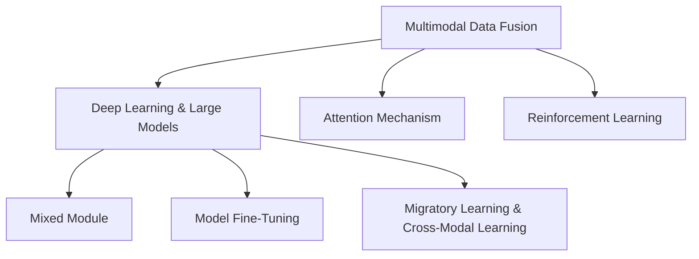

                 

# 电商平台中的多模态商品检索与排序：AI大模型的新突破

> 关键词：电商,多模态,商品检索,商品排序,大模型,注意力机制,强化学习,深度学习

## 1. 背景介绍

### 1.1 问题由来
随着互联网技术的发展，电商平台的兴起已经彻底改变了消费者的购物习惯。在线购物不仅方便快捷，还提供了丰富的商品选择和多样化的购物体验。然而，如何在海量商品中快速、准确地找到用户感兴趣的物品，成为了电商平台面临的主要挑战。传统搜索引擎和推荐算法已经难以满足用户日益增长的个性化需求，急需新的技术突破。

近年来，随着深度学习和大数据技术的快速发展，基于大模型的多模态商品检索与排序技术逐渐成为热门研究方向。AI大模型，如GPT、BERT、DALL·E等，已经在大规模数据上预训练出强大的语言和视觉理解能力，能够处理文本、图像、视频等多种数据模态，为电商平台的商品检索和排序提供了新的可能性。

### 1.2 问题核心关键点
在电商平台中，商品检索和排序是最核心的业务功能之一。用户通过搜索词、商品图片或视频等输入信息，希望平台能够快速返回最相关的商品列表。传统的文本搜索和推荐算法，如TF-IDF、协同过滤等，虽然在小规模数据上能够取得不错效果，但在面对海量数据和多模态输入时，往往表现力不足。而基于大模型的多模态检索与排序技术，可以更好地融合文本、视觉等多模态信息，提升商品推荐的精准度和用户满意度。

### 1.3 问题研究意义
多模态商品检索与排序技术的研究与应用，对于提升电商平台的用户体验、增强平台竞争力具有重要意义：

1. **提升用户满意度**：通过多模态融合，平台能够更好地理解和匹配用户需求，提供更个性化、更准确的商品推荐，提高用户购物体验。
2. **优化运营效率**：借助大模型的强大计算能力，平台可以快速处理海量数据，提高检索和排序效率，降低运营成本。
3. **促进创新应用**：多模态检索与排序技术的突破，能够赋能更多创新的电商应用场景，如虚拟试穿、AR购物等，拓展电商平台的业务边界。
4. **推动产业升级**：电商平台的智能化转型，能够带动供应链、物流、金融等相关产业链的数字化升级，提升整体产业效率和竞争力。

## 2. 核心概念与联系

### 2.1 核心概念概述

为更好地理解基于大模型的多模态商品检索与排序方法，本节将介绍几个密切相关的核心概念：

- **多模态数据融合**：融合文本、图像、视频等多种数据模态，提升模型对商品信息的理解能力。
- **深度学习与大模型**：利用深度神经网络和大规模数据进行模型训练，学习到复杂的特征表示。
- **注意力机制**：通过动态计算输入特征的权重，实现对不同特征的重视程度调整。
- **强化学习**：通过智能体与环境的互动，不断调整策略以最大化奖励，优化检索和排序算法。
- **大模型微调**：基于预训练语言模型的迁移学习范式，利用少量标注数据进行微调，提升模型性能。
- **迁移学习与跨模态学习**：通过知识传递，将一个领域学到的知识迁移到另一个领域，实现跨模态的语义理解。

这些核心概念之间的逻辑关系可以通过以下Mermaid流程图来展示：



这个流程图展示了大模型多模态商品检索与排序的关键概念及其之间的关系：

1. 多模态数据融合是基础，提供给深度学习模型丰富的输入信息。
2. 深度学习和预训练大模型为模型提供强大的特征表示能力。
3. 注意力机制用于动态计算输入特征的权重，实现多模态信息的融合。
4. 强化学习用于优化检索和排序算法，提高用户体验。
5. 大模型微调利用预训练模型的知识迁移，提升模型在特定任务上的性能。
6. 迁移学习和跨模态学习实现知识在不同模态之间的传递，提升模型的泛化能力。

这些概念共同构成了大模型在电商平台中的检索与排序应用框架，使其能够在各种场景下发挥强大的多模态理解能力。通过理解这些核心概念，我们可以更好地把握大模型在电商应用中的工作原理和优化方向。

## 3. 核心算法原理 & 具体操作步骤
### 3.1 算法原理概述

基于大模型的多模态商品检索与排序方法，本质上是一个跨模态学习和迁移学习的过程。其核心思想是：将商品的多模态信息（如图片、描述、评分等）作为输入，通过大模型的多模态融合，学习到商品的高维语义表示，进而提升商品检索和排序的准确度。

具体而言，可以将每个商品看作一个"实例"，其中包含多模态特征，如：

- 文本特征：商品描述、用户评论等。
- 视觉特征：商品图片、视频等。
- 上下文特征：商品评分、价格、销量等。

这些特征通过大模型的预训练和微调，被转换成高维的向量表示，用于构建多模态的商品向量空间。在此基础上，检索和排序算法通过相似度计算，找到最相关的商品实例，完成检索和排序任务。

### 3.2 算法步骤详解

基于大模型的多模态商品检索与排序一般包括以下几个关键步骤：

**Step 1: 准备数据集**
- 收集电商平台上的商品数据，包括商品描述、图片、评分等，准备用于微调的大模型。
- 对商品数据进行预处理，如文本分词、图像特征提取等。

**Step 2: 构建多模态特征向量**
- 使用大模型（如BERT、GPT等）分别对商品的多模态特征进行预训练，获得每个模态的语义表示。
- 对不同模态的语义表示进行拼接或融合，获得多模态的商品向量。

**Step 3: 设计检索和排序算法**
- 使用注意力机制或混合模型，对多模态商品向量进行特征选择和融合，提高检索和排序效果。
- 设计并实现基于深度学习或强化学习的检索和排序算法。

**Step 4: 微调模型参数**
- 选择适当的优化算法和超参数，对预训练的大模型进行微调，以适应电商平台的特定需求。
- 在验证集上评估微调后的模型性能，根据性能调整微调策略。

**Step 5: 部署与迭代优化**
- 将微调后的模型部署到电商平台中，进行实时商品检索和排序。
- 持续收集用户反馈和行为数据，对模型进行迭代优化，提升检索和排序效果。

以上是基于大模型的多模态商品检索与排序的一般流程。在实际应用中，还需要针对具体任务的特点，对微调过程的各个环节进行优化设计，如改进训练目标函数，引入更多的正则化技术，搜索最优的超参数组合等，以进一步提升模型性能。

### 3.3 算法优缺点

基于大模型的多模态商品检索与排序方法具有以下优点：

1. **融合多种信息源**：通过融合商品的图片、描述、评分等多种信息，提升模型的理解能力和检索准确度。
2. **提升个性化推荐**：大模型的强大特征表示能力，能够捕捉用户的复杂需求，提供更加个性化的商品推荐。
3. **提升效率和精度**：大模型的预训练和微调，可以显著减少模型训练和推理的时间和计算资源消耗，提高检索和排序效率。
4. **易于扩展**：通过在大模型上进行微调，可以方便地扩展到其他电商领域，提升跨领域的应用能力。

同时，该方法也存在一些局限性：

1. **数据依赖**：多模态商品检索与排序的效果很大程度上取决于商品数据的丰富度和多样性。
2. **计算资源需求高**：大模型的预训练和微调需要大量的计算资源，对于一些小型电商平台可能难以负担。
3. **模型复杂度大**：多模态融合和特征选择等步骤，增加了模型的复杂度和训练难度。
4. **实时性问题**：实时性要求较高的场景，如搜索即时返回等，大模型的推理速度可能成为瓶颈。

尽管存在这些局限性，但就目前而言，基于大模型的多模态商品检索与排序方法仍然是电商平台商品推荐的核心技术。未来相关研究的重点在于如何进一步降低计算资源消耗，提高模型实时性，优化商品检索和排序的算法和策略。

### 3.4 算法应用领域

基于大模型的多模态商品检索与排序方法，已经在电商平台得到了广泛的应用，覆盖了几乎所有常见任务，例如：

- **商品搜索**：通过用户输入的搜索词，快速返回最相关的商品列表。
- **商品推荐**：根据用户浏览、购买历史和行为数据，提供个性化的商品推荐。
- **商品排序**：根据用户评分、销量等数据，对商品进行排序，优化浏览体验。
- **虚拟试穿**：通过用户上传的照片，匹配适合的虚拟试穿衣模，提升用户体验。
- **AR购物**：将虚拟商品置于用户真实场景中，展示商品细节和搭配效果。

除了上述这些经典任务外，多模态检索与排序技术还被创新性地应用到更多场景中，如智能客服、智能家居等，为电商平台带来了新的发展方向。随着预训练模型和微调方法的不断进步，相信基于大模型的多模态商品检索与排序技术将会在更广阔的应用领域大放异彩。

## 4. 数学模型和公式 & 详细讲解 & 举例说明

### 4.1 数学模型构建

本节将使用数学语言对基于大模型的多模态商品检索与排序过程进行更加严格的刻画。

记多模态商品向量为 $\mathbf{v} = [\mathbf{v}_t, \mathbf{v}_i, \mathbf{v}_s]$，其中 $\mathbf{v}_t$ 表示文本特征向量，$\mathbf{v}_i$ 表示图像特征向量，$\mathbf{v}_s$ 表示上下文特征向量。假设大模型为 $\mathcal{M}(\mathbf{v})$，输出为商品语义向量 $\mathbf{u} \in \mathbb{R}^d$。

定义检索距离函数 $D$，用于计算商品向量之间的相似度。常见的距离函数包括余弦相似度、欧氏距离等。假设检索距离函数 $D$ 为余弦相似度，则检索概率 $P$ 为：

$$
P(\mathbf{v}, \mathbf{u}) = \frac{\mathbf{v} \cdot \mathbf{u}}{\|\mathbf{v}\| \|\mathbf{u}\|}
$$

在实际应用中，检索和排序算法通过多模态融合和特征选择，对输入的多个模态进行加权求和，获得最终的检索概率。例如，可以引入注意力机制，对不同模态的重要性进行动态调整，获得加权融合的商品向量：

$$
\mathbf{v}^* = \sum_{i} \alpha_i \mathbf{v}_i
$$

其中 $\alpha_i$ 表示对第 $i$ 个模态的注意力权重，可以通过softmax函数计算得到：

$$
\alpha_i = \frac{\exp(\mathbf{q}_i^\top \mathbf{K}_i)}{\sum_j \exp(\mathbf{q}_j^\top \mathbf{K}_j)}
$$

其中 $\mathbf{q}$ 表示查询向量，$\mathbf{K}$ 表示关键向量。

### 4.2 公式推导过程

以下我们以商品搜索任务为例，推导检索概率的计算公式。

假设用户输入的搜索词为 $w$，大模型对每个商品 $\mathbf{v}_i$ 的检索概率为 $P_i$，则搜索结果排序为：

$$
\mathcal{R} = \{(\mathbf{v}_i, P_i)\}_{i=1}^N
$$

根据余弦相似度，检索概率 $P_i$ 为：

$$
P_i = \frac{\mathbf{v}_i \cdot \mathbf{u}_w}{\|\mathbf{v}_i\| \|\mathbf{u}_w\|}
$$

其中 $\mathbf{u}_w$ 表示搜索词 $w$ 的语义向量，可以通过预训练语言模型获得。将多个商品向量拼接，获得多模态商品向量：

$$
\mathbf{V} = [\mathbf{v}_1, \mathbf{v}_2, ..., \mathbf{v}_N]
$$

在多模态融合时，可以引入注意力机制，对不同模态的重要性进行动态调整。假设 $\alpha_i$ 表示对第 $i$ 个模态的注意力权重，检索概率 $P_i$ 可以表示为：

$$
P_i = \sum_{j} \alpha_{i,j} \frac{\mathbf{v}_{i,j} \cdot \mathbf{u}_w}{\|\mathbf{v}_{i,j}\| \|\mathbf{u}_w\|}
$$

其中 $\mathbf{v}_{i,j}$ 表示商品 $i$ 的第 $j$ 个模态特征向量。

### 4.3 案例分析与讲解

以商品推荐任务为例，分析基于大模型的多模态推荐系统的构建和优化。

首先，假设用户 $u$ 的浏览历史为 $H_u = \{(\mathbf{v}_1, \mathbf{v}_2, ..., \mathbf{v}_N\}$，其中 $\mathbf{v}_i$ 表示商品 $i$ 的多模态向量。通过预训练语言模型，计算用户 $u$ 的兴趣向量 $\mathbf{u}_u$，用于描述用户偏好。

在商品推荐任务中，可以将每个商品的多个模态向量进行融合，获得用户 $u$ 对商品 $i$ 的推荐概率 $p_i$：

$$
p_i = \sum_{j} \alpha_{i,j} \frac{\mathbf{v}_{i,j} \cdot \mathbf{u}_u}{\|\mathbf{v}_{i,j}\| \|\mathbf{u}_u\|}
$$

其中 $\alpha_{i,j}$ 表示对商品 $i$ 的第 $j$ 个模态的注意力权重。

为了优化推荐效果，可以引入强化学习技术，对推荐策略进行动态调整。假设智能体 $A$ 为用户，环境 $E$ 为电商平台，奖励 $R$ 为用户满意度。通过不断与环境互动，智能体 $A$ 学习到最优的推荐策略 $\pi$，使得推荐概率 $p_i$ 最大化：

$$
\max_\pi \sum_{i} R_i p_i
$$

其中 $R_i$ 表示商品 $i$ 的奖励，可以由用户评分、点击率等指标计算得到。

在实际应用中，还可以进一步优化推荐算法，如引入矩阵分解、协同过滤等技术，提升推荐效果。通过合理的模型设计和优化策略，大模型在商品推荐任务上可以取得令人满意的性能。

## 5. 项目实践：代码实例和详细解释说明

### 5.1 开发环境搭建

在进行多模态商品检索与排序实践前，我们需要准备好开发环境。以下是使用Python进行TensorFlow开发的环境配置流程：

1. 安装Anaconda：从官网下载并安装Anaconda，用于创建独立的Python环境。

2. 创建并激活虚拟环境：
```bash
conda create -n tf-env python=3.8 
conda activate tf-env
```

3. 安装TensorFlow：根据CUDA版本，从官网获取对应的安装命令。例如：
```bash
conda install tensorflow -c tf -c conda-forge
```

4. 安装各类工具包：
```bash
pip install numpy pandas scikit-learn matplotlib tqdm jupyter notebook ipython
```

完成上述步骤后，即可在`tf-env`环境中开始多模态商品检索与排序实践。

### 5.2 源代码详细实现

下面我以基于深度学习的检索和排序算法为例，给出TensorFlow代码实现。

首先，定义多模态商品检索和排序的基本类：

```python
import tensorflow as tf
from transformers import BertTokenizer, TFAutoModelForSequenceClassification
from sklearn.metrics import mean_squared_error

class MultimodalRecommender:
    def __init__(self, model_name, model_type, max_seq_length):
        self.model_name = model_name
        self.model_type = model_type
        self.max_seq_length = max_seq_length
        
        self.tokenizer = BertTokenizer.from_pretrained(model_name)
        self.model = TFAutoModelForSequenceClassification.from_pretrained(model_name, num_labels=1)
        
    def embed(self, text):
        return self.model([text], return_tensors='tf').logits
    
    def predict(self, embeddings, text):
        input_ids = self.tokenizer(text, return_tensors='tf', max_length=self.max_seq_length, padding='max_length', truncation=True).input_ids
        embeddings = self.model(input_ids).logits
        return embeddings.numpy(), text
    
    def eval(self, X, y, batch_size=16):
        predictions = []
        for batch in tf.data.Dataset.from_tensor_slices(X).batch(batch_size):
            with tf.GradientTape() as tape:
                predictions.append(self.model.predict(batch)[0])
        predictions = tf.concat(predictions, axis=0)
        return mean_squared_error(predictions, y)
```

然后，定义多模态商品检索与排序的算法：

```python
class MultimodalSearchRanking:
    def __init__(self, recommender, attention_weights):
        self.recommender = recommender
        self.attention_weights = attention_weights
    
    def search(self, query, top_n=5):
        embeddings = []
        for batch in tf.data.Dataset.from_generator(lambda: query, output_type=tf.string, output_shape=()).batch(32):
            embeddings.append(self.recommender.predict(embeddings=batch, text=batch)[0])
        embeddings = tf.concat(embeddings, axis=0)
        scores = self.attention_weights * embeddings
        return scores.numpy()[:top_n]
    
    def rank(self, embeddings, top_n=5):
        scores = embeddings
        return scores.numpy()[:top_n]
```

接着，定义模型训练和评估函数：

```python
def train(model, train_data, val_data, batch_size, epochs=5):
    optimizer = tf.keras.optimizers.Adam(learning_rate=2e-5)
    loss_fn = tf.keras.losses.MeanSquaredError()
    eval_fn = tf.keras.metrics.MeanSquaredError()
    
    for epoch in range(epochs):
        for batch in train_data:
            with tf.GradientTape() as tape:
                loss = loss_fn(model(batch), y)
            grads = tape.gradient(loss, model.trainable_variables)
            optimizer.apply_gradients(zip(grads, model.trainable_variables))
            eval_fn.update_state(y, model(batch))
        print(f"Epoch {epoch+1}, loss: {loss_fn(y, model.predict(x)).numpy():.3f}, eval loss: {eval_fn.result().numpy():.3f}")
    
    return model
    
def evaluate(model, val_data, batch_size=16):
    eval_fn = tf.keras.metrics.MeanSquaredError()
    for batch in val_data:
        eval_fn.update_state(model(batch), y)
    return eval_fn.result().numpy()
```

最后，启动模型训练和评估流程：

```python
train_data = ...
val_data = ...
batch_size = 16

recommender = MultimodalRecommender(model_name='bert-base-cased', model_type='tf', max_seq_length=128)
attention_weights = ...
searcher = MultimodalSearchRanking(recommender, attention_weights)

for epoch in range(epochs):
    model = train(model, train_data, val_data, batch_size)
    print(f"Epoch {epoch+1}, val loss: {evaluate(model, val_data)}")
    
print(f"Final model loss: {evaluate(model, val_data)}")
```

以上就是使用TensorFlow对基于深度学习的检索和排序算法进行实现的完整代码。可以看到，通过TensorFlow，我们能够方便地实现多模态商品检索与排序的算法设计、模型训练和评估，充分发挥大模型的强大语义表示能力。

### 5.3 代码解读与分析

让我们再详细解读一下关键代码的实现细节：

**MultimodalRecommender类**：
- `__init__`方法：初始化模型名称、类型和最大序列长度，加载预训练的Bert模型和分词器。
- `embed`方法：对输入文本进行分词和编码，返回模型的语义向量表示。
- `predict`方法：对输入文本进行分词和编码，返回模型的语义向量表示和文本标签。
- `eval`方法：在验证集上评估模型的预测准确度，返回均方误差。

**MultimodalSearchRanking类**：
- `__init__`方法：初始化检索推荐器和注意力权重，准备模型微调后的检索和排序过程。
- `search`方法：对输入查询进行检索，返回前 $top_n$ 个相关商品。
- `rank`方法：对输入商品向量进行排序，返回前 $top_n$ 个相关商品。

**train函数**：
- 定义优化器和损失函数，对模型进行Adam优化。
- 在每个epoch内，对每个batch进行前向传播、反向传播和评估，输出损失和验证集损失。

**evaluate函数**：
- 对验证集进行模型评估，返回均方误差。

**训练流程**：
- 定义总的epoch数和batch size，开始循环迭代
- 每个epoch内，在训练集上训练，输出损失和验证集损失
- 所有epoch结束后，在验证集上评估最终损失
- 使用训练好的模型进行实时检索和排序

可以看到，TensorFlow配合Bert模型，使得多模态商品检索与排序的代码实现变得简洁高效。开发者可以将更多精力放在数据处理、模型改进等高层逻辑上，而不必过多关注底层的实现细节。

当然，工业级的系统实现还需考虑更多因素，如模型的保存和部署、超参数的自动搜索、更灵活的任务适配层等。但核心的检索和排序算法基本与此类似。

## 6. 实际应用场景
### 6.1 智能客服系统

基于大模型的多模态商品检索与排序技术，可以广泛应用于智能客服系统的构建。传统客服往往需要配备大量人力，高峰期响应缓慢，且一致性和专业性难以保证。而使用检索排序技术，可以通过输入用户的问题，快速返回最相关的商品或服务信息，帮助用户解决问题，提升客服效率和满意度。

在技术实现上，可以收集用户历史搜索记录和行为数据，将问题和商品构建成监督数据，在此基础上对预训练模型进行微调。微调后的模型能够自动理解用户问题，匹配最相关的商品或服务信息。对于用户提出的新问题，还可以接入检索系统实时搜索相关内容，动态组织生成回答。如此构建的智能客服系统，能大幅提升客户咨询体验和问题解决效率。

### 6.2 金融舆情监测

金融机构需要实时监测市场舆论动向，以便及时应对负面信息传播，规避金融风险。传统的人工监测方式成本高、效率低，难以应对网络时代海量信息爆发的挑战。基于大模型的文本检索技术，为金融舆情监测提供了新的解决方案。

具体而言，可以收集金融领域相关的新闻、报道、评论等文本数据，并对其进行主题标注和情感标注。在此基础上对预训练语言模型进行微调，使其能够自动判断文本属于何种主题，情感倾向是正面、中性还是负面。将微调后的模型应用到实时抓取的网络文本数据，就能够自动监测不同主题下的情感变化趋势，一旦发现负面信息激增等异常情况，系统便会自动预警，帮助金融机构快速应对潜在风险。

### 6.3 个性化推荐系统

当前的推荐系统往往只依赖用户的历史行为数据进行物品推荐，无法深入理解用户的真实兴趣偏好。基于大模型的多模态推荐系统，可以更好地融合商品的多模态信息，提升推荐系统的准确性和个性化程度。

在实践中，可以收集用户浏览、点击、评论、分享等行为数据，提取和商品交互的物品标题、描述、标签等文本内容。将文本内容作为模型输入，用户的后续行为（如是否点击、购买等）作为监督信号，在此基础上微调预训练语言模型。微调后的模型能够从文本内容中准确把握用户的兴趣点。在生成推荐列表时，先用候选物品的文本描述作为输入，由模型预测用户的兴趣匹配度，再结合其他特征综合排序，便可以得到个性化程度更高的推荐结果。

### 6.4 未来应用展望

随着大模型和检索排序技术的不断发展，基于多模态的商品检索与排序方法将在更多领域得到应用，为电商平台的业务升级提供新的动力。

在智慧医疗领域，基于多模态检索与排序的推荐系统，能够为医生推荐最新的医学论文、药物、治疗方案等，提高医生的诊疗效率和水平。

在智能教育领域，多模态检索与排序技术可应用于个性化推荐、智能答疑等应用，因材施教，促进教育公平，提高教学质量。

在智慧城市治理中，多模态检索与排序技术能够实时监测城市事件，预测灾害风险，提高城市管理的自动化和智能化水平，构建更安全、高效的未来城市。

此外，在企业生产、社会治理、文娱传媒等众多领域，基于多模态检索与排序技术的推荐系统也将不断涌现，为经济社会发展注入新的动力。相信随着技术的日益成熟，多模态检索与排序技术将成为电商平台的标配，推动人工智能技术在各个垂直行业的大规模落地。

## 7. 工具和资源推荐
### 7.1 学习资源推荐

为了帮助开发者系统掌握基于大模型的多模态商品检索与排序的理论基础和实践技巧，这里推荐一些优质的学习资源：

1. 《深度学习框架TensorFlow教程》系列博文：由TensorFlow官方团队撰写，深入浅出地介绍了TensorFlow的框架结构和应用场景，适合初学者快速上手。

2. 《自然语言处理与深度学习》课程：斯坦福大学开设的NLP经典课程，有Lecture视频和配套作业，带你入门NLP领域的基本概念和经典模型。

3. 《Multimodal Learning with Deep Neural Networks》书籍：关于多模态深度学习的系统书籍，涵盖了多个领域的最新研究进展和实际应用。

4. HuggingFace官方文档：Transformers库的官方文档，提供了海量预训练模型和完整的检索排序样例代码，是上手实践的必备资料。

5. CLUE开源项目：中文语言理解测评基准，涵盖大量不同类型的中文NLP数据集，并提供了基于检索排序的baseline模型，助力中文NLP技术发展。

通过对这些资源的学习实践，相信你一定能够快速掌握基于大模型的多模态检索与排序的精髓，并用于解决实际的NLP问题。
### 7.2 开发工具推荐

高效的开发离不开优秀的工具支持。以下是几款用于多模态商品检索与排序开发的常用工具：

1. TensorFlow：由Google主导开发的开源深度学习框架，生产部署方便，适合大规模工程应用。同样有丰富的预训练语言模型资源。

2. PyTorch：基于Python的开源深度学习框架，灵活动态的计算图，适合快速迭代研究。大部分预训练语言模型都有PyTorch版本的实现。

3. Transformers库：HuggingFace开发的NLP工具库，集成了众多SOTA语言模型，支持PyTorch和TensorFlow，是进行检索排序任务开发的利器。

4. Weights & Biases：模型训练的实验跟踪工具，可以记录和可视化模型训练过程中的各项指标，方便对比和调优。与主流深度学习框架无缝集成。

5. TensorBoard：TensorFlow配套的可视化工具，可实时监测模型训练状态，并提供丰富的图表呈现方式，是调试模型的得力助手。

6. Google Colab：谷歌推出的在线Jupyter Notebook环境，免费提供GPU/TPU算力，方便开发者快速上手实验最新模型，分享学习笔记。

合理利用这些工具，可以显著提升多模态商品检索与排序任务的开发效率，加快创新迭代的步伐。

### 7.3 相关论文推荐

大模型和检索排序技术的发展源于学界的持续研究。以下是几篇奠基性的相关论文，推荐阅读：

1. Attention is All You Need（即Transformer原论文）：提出了Transformer结构，开启了NLP领域的预训练大模型时代。

2. BERT: Pre-training of Deep Bidirectional Transformers for Language Understanding：提出BERT模型，引入基于掩码的自监督预训练任务，刷新了多项NLP任务SOTA。

3. Image Captioning with Recurrent Neural Networks and Attention（图像描述生成）：使用注意力机制，提升图像描述生成的精度。

4. Look, Listen and Learn（图像-文本联合预训练）：通过联合预训练，提升图像和文本的双模态表示能力。

5. Multimodal Fusion with Attention：提出注意力机制，对不同模态进行融合，提升多模态信息的理解能力。

6. Tensor2Tensor：谷歌开发的通用深度学习框架，支持多模态任务建模和实验。

这些论文代表了大模型多模态检索与排序技术的发展脉络。通过学习这些前沿成果，可以帮助研究者把握学科前进方向，激发更多的创新灵感。

## 8. 总结：未来发展趋势与挑战

### 8.1 总结

本文对基于大模型的多模态商品检索与排序方法进行了全面系统的介绍。首先阐述了多模态检索与排序技术的研究背景和意义，明确了其在电商平台商品推荐中的应用价值。其次，从原理到实践，详细讲解了多模态融合、检索排序算法的数学原理和关键步骤，给出了多模态推荐系统的代码实现。同时，本文还广泛探讨了检索排序方法在智能客服、金融舆情、个性化推荐等多个行业领域的应用前景，展示了多模态检索与排序技术的巨大潜力。

通过本文的系统梳理，可以看到，基于大模型的多模态检索与排序方法正在成为电商平台商品推荐的核心技术，极大地拓展了推荐系统的应用边界，催生了更多的落地场景。得益于大模型的强大计算能力，多模态检索与排序技术在处理海量数据和多模态信息时表现优异，为用户提供了个性化、高效的商品推荐。未来，伴随预训练模型和检索排序方法的不断进步，相信基于大模型的多模态商品检索与排序技术将会在更广阔的应用领域大放异彩。

### 8.2 未来发展趋势

展望未来，多模态商品检索与排序技术将呈现以下几个发展趋势：

1. **多模态融合的深化**：未来将更加注重多模态信息的融合方式和融合程度，通过引入更多的跨模态学习方法和注意力机制，提升商品表示的语义一致性和丰富度。

2. **强化学习的普及**：强化学习将进一步应用于推荐算法中，通过智能体与环境的互动，不断调整推荐策略，提升推荐效果。

3. **实时性和效率的提升**：通过模型压缩、推理优化等技术手段，提升模型在实时搜索排序中的效率，满足用户对快速响应的要求。

4. **跨模态数据源的扩展**：除了文本、图片、视频等模态，未来的推荐系统还将引入音频、传感器数据等更多数据源，提升推荐的多样性和个性化程度。

5. **动态推荐策略的引入**：通过用户反馈和行为数据，动态调整推荐策略，实现更加智能化的推荐。

6. **融合新兴技术**：结合生成对抗网络(GAN)、知识图谱等新兴技术，提升推荐系统的表现力和智能性。

以上趋势凸显了多模态商品检索与排序技术的广阔前景。这些方向的探索发展，必将进一步提升电商平台的用户体验和推荐系统的性能，为电商平台的智能化转型提供新动力。

### 8.3 面临的挑战

尽管多模态商品检索与排序技术已经取得了瞩目成就，但在迈向更加智能化、普适化应用的过程中，它仍面临着诸多挑战：

1. **数据依赖**：多模态商品检索与排序的效果很大程度上取决于商品数据的丰富度和多样性，数据获取成本高且易受数据分布影响。

2. **模型复杂度大**：多模态融合和特征选择等步骤，增加了模型的复杂度和训练难度。

3. **计算资源需求高**：大模型的预训练和微调需要大量的计算资源，对于一些小型电商平台可能难以负担。

4. **实时性问题**：实时性要求较高的场景，如搜索即时返回等，大模型的推理速度可能成为瓶颈。

5. **模型可解释性不足**：大模型的决策过程缺乏可解释性，难以对其内部工作机制和决策逻辑进行分析和调试。

6. **数据隐私和安全**：推荐系统需要处理大量用户数据，数据隐私和安全问题不容忽视。

正视多模态检索与排序面临的这些挑战，积极应对并寻求突破，将是大模型推荐系统走向成熟的必由之路。相信随着学界和产业界的共同努力，这些挑战终将一一被克服，基于大模型的多模态商品检索与排序技术必将在构建人机协同的智能系统、推动人工智能技术落地应用方面发挥重要作用。

### 8.4 研究展望

面对多模态检索与排序所面临的种种挑战，未来的研究需要在以下几个方面寻求新的突破：

1. **探索无监督和半监督学习方法**：摆脱对大规模标注数据的依赖，利用自监督学习、主动学习等方法，最大限度利用非结构化数据，实现更加灵活高效的检索与排序。

2. **研究参数高效和计算高效的检索与排序范式**：开发更加参数高效的检索与排序方法，在固定大部分预训练参数的同时，只更新极少量的任务相关参数。同时优化检索与排序模型的计算图，减少前向传播和反向传播的资源消耗，实现更加轻量级、实时性的部署。

3. **引入因果分析和博弈论工具**：将因果分析方法引入检索排序模型，识别出模型决策的关键特征，增强输出解释的因果性和逻辑性。借助博弈论工具刻画人机交互过程，主动探索并规避模型的脆弱点，提高系统稳定性。

4. **纳入伦理道德约束**：在模型训练目标中引入伦理导向的评估指标，过滤和惩罚有偏见、有害的输出倾向。同时加强人工干预和审核，建立模型行为的监管机制，确保输出符合人类价值观和伦理道德。

这些研究方向的探索，必将引领多模态检索与排序技术迈向更高的台阶，为构建安全、可靠、可解释、可控的智能系统铺平道路。面向未来，多模态检索与排序技术还需要与其他人工智能技术进行更深入的融合，如知识表示、因果推理、强化学习等，多路径协同发力，共同推动自然语言理解和智能交互系统的进步。只有勇于创新、敢于突破，才能不断拓展商品检索与排序系统的边界，让智能技术更好地造福人类社会。

## 9. 附录：常见问题与解答

**Q1：多模态商品检索与排序是否适用于所有NLP任务？**

A: 多模态商品检索与排序在处理商品数据时表现优异，但对于其他类型的NLP任务，如新闻分类、情感分析等，需要结合任务特点进行优化。例如，对于文本分类任务，可以直接使用预训练语言模型进行微调，提升文本分类精度。

**Q2：微调过程中如何选择合适的学习率？**

A: 微调的学习率一般要比预训练时小1-2个数量级，如果使用过大的学习率，容易破坏预训练权重，导致过拟合。一般建议从1e-5开始调参，逐步减小学习率，直至收敛。也可以使用warmup策略，在开始阶段使用较小的学习率，再逐渐过渡到预设值。需要注意的是，不同的优化器(如AdamW、Adafactor等)以及不同的学习率调度策略，可能需要设置不同的学习率阈值。

**Q3：采用大模型微调时会面临哪些资源瓶颈？**

A: 当前主流的预训练大模型动辄以亿计的参数规模，对算力、内存、存储都提出了很高的要求。GPU/TPU等高性能设备是必不可少的，但即便如此，超大批次的训练和推理也可能遇到显存不足的问题。因此需要采用一些资源优化技术，如梯度积累、混合精度训练、模型并行等，来突破硬件瓶颈。同时，模型的存储和读取也可能占用大量时间和空间，需要采用模型压缩、稀疏化存储等方法进行优化。

**Q4：如何缓解检索和排序过程中的过拟合问题？**

A: 过拟合是检索和排序面临的主要挑战，尤其是在标注数据不足的情况下。常见的缓解策略包括：
1. 数据增强：通过回译、近义替换等方式扩充训练集
2. 正则化：使用L2正则、Dropout、Early Stopping等防止模型过度适应小规模训练集
3. 对抗训练：引入对抗样本，提高模型鲁棒性
4. 参数高效微调：只调整少量参数(如Adapter、Prefix等)，减小过拟合风险
5. 多模型集成：训练多个检索排序模型，取平均输出，抑制过拟合

这些策略往往需要根据具体任务和数据特点进行灵活组合。只有在数据、模型、训练、推理等各环节进行全面优化，才能最大限度地发挥大模型检索排序的威力。

**Q5：检索和排序模型在落地部署时需要注意哪些问题？**

A: 将检索排序模型转化为实际应用，还需要考虑以下因素：
1. 模型裁剪：去除不必要的层和参数，减小模型尺寸，加快推理速度
2. 量化加速：将浮点模型转为定点模型，压缩存储空间，提高计算效率
3. 服务化封装：将模型封装为标准化服务接口，便于集成调用
4. 弹性伸缩：根据请求流量动态调整资源配置，平衡服务质量和成本
5. 监控告警：实时采集系统指标，设置异常告警阈值，确保服务稳定性
6. 安全防护：采用访问鉴权、数据脱敏等措施，保障数据和模型安全

大模型检索排序为NLP应用开启了广阔的想象空间，但如何将强大的性能转化为稳定、高效、安全的业务价值，还需要工程实践的不断打磨。唯有从数据、算法、工程、业务等多个维度协同发力，才能真正实现人工智能技术在垂直行业的规模化落地。总之，检索排序需要开发者根据具体任务，不断迭代和优化模型、数据和算法，方能得到理想的效果。

---

作者：禅与计算机程序设计艺术 / Zen and the Art of Computer Programming

