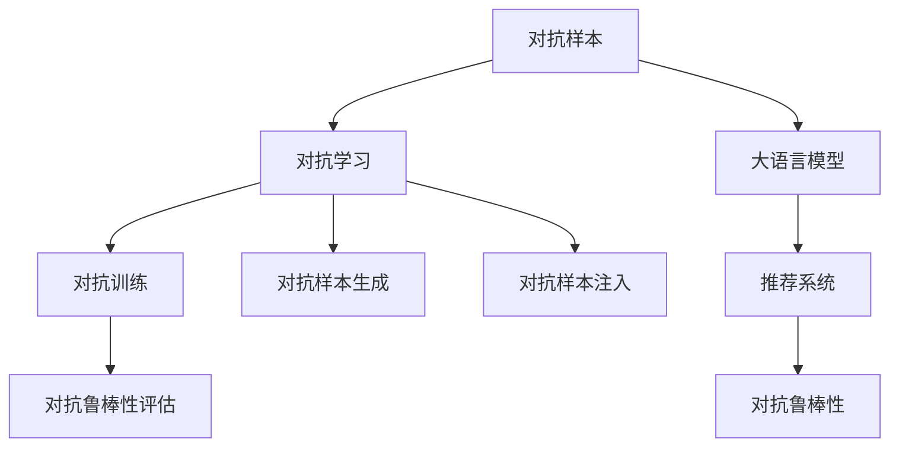

                 

# 电商平台中的对抗学习：AI大模型的新应用

> 关键词：对抗学习,大语言模型,电商平台,推荐系统,对抗样本,泛化性能,鲁棒性,恶意行为检测

## 1. 背景介绍

### 1.1 问题由来
在现代电商平台上，商品推荐系统是提升用户购物体验和平台运营效率的关键技术。传统的推荐系统通过分析用户的历史行为数据，为用户推荐可能感兴趣的商品。然而，随着商品种类和数量的爆炸式增长，推荐系统的复杂度也在不断增加，如何高效、准确地推荐商品成为一个重要课题。

近年来，深度学习技术在推荐系统中的应用越来越广泛，其中大语言模型（Large Language Model, LLM）以其强大的语义理解能力和泛化能力，在推荐系统中展现出巨大的潜力。然而，面对海量数据和多变的用户需求，如何训练出既泛化能力强又具有高鲁棒性的推荐模型，成为了一个难题。对抗学习（Adversarial Learning）正是在这种背景下诞生的，它通过引入对抗样本（Adversarial Examples）来增强模型的鲁棒性，从而提升推荐系统的泛化能力和安全性。

### 1.2 问题核心关键点
对抗学习的核心在于构建一个对抗训练框架，让模型在受到恶意攻击时依然能够保持稳定的性能。具体来说，就是要训练一个推荐模型，使其不仅能够在正常数据上进行良好的推荐，还能有效抵御对抗样本的干扰。

对抗学习的主要挑战包括：
1. 对抗样本生成：如何高效生成针对推荐系统的对抗样本。
2. 对抗训练策略：如何在推荐模型的训练中引入对抗训练。
3. 对抗鲁棒性评估：如何评估模型在对抗样本攻击下的鲁棒性。
4. 对抗样本注入：如何实现对抗样本的自动注入和检测。

本文将从以上几个方面深入探讨对抗学习在电商平台中的具体应用，并给出详细的技术实现和实际案例分析。

## 2. 核心概念与联系

### 2.1 核心概念概述

为更好地理解对抗学习在电商平台中的应用，本节将介绍几个密切相关的核心概念：

- **对抗样本（Adversarial Examples）**：指经过精心构造的，使得目标模型误判的输入样本。在推荐系统中，对抗样本可能会误导模型推荐出恶意内容或欺骗性推荐。

- **对抗学习（Adversarial Learning）**：指通过对抗样本训练模型，使其在对抗攻击下依然能够保持稳定的性能。对抗学习通过引入对抗训练，增强模型对恶意输入的抵抗能力。

- **大语言模型（Large Language Model, LLM）**：指具有强大语义理解和生成能力的深度学习模型，如GPT、BERT等。在推荐系统中，大语言模型可以用于理解用户查询，生成商品描述，并进行商品推荐。

- **推荐系统（Recommendation System）**：指通过分析用户行为数据，为用户推荐商品或服务的系统。推荐系统广泛应用于电商平台、在线媒体、社交网络等场景，提升用户体验和平台收益。

- **对抗鲁棒性（Adversarial Robustness）**：指模型在面对对抗攻击时保持稳定的性能。对抗鲁棒性是对抗学习的主要目标，也是推荐系统安全性保障的重要方面。

这些核心概念之间的逻辑关系可以通过以下Mermaid流程图来展示：



这个流程图展示了大语言模型、对抗学习、推荐系统、对抗样本和对抗鲁棒性之间的联系：

1. 对抗样本通过对抗训练增强推荐系统对恶意输入的抵抗能力。
2. 大语言模型用于理解用户查询和生成商品描述，提升推荐系统的精度。
3. 推荐系统利用对抗样本训练的模型，提升用户的推荐体验。
4. 对抗鲁棒性是推荐系统的核心目标，确保模型在面对恶意输入时依然能够提供可靠的推荐。

这些概念共同构成了对抗学习在电商平台中的应用框架，使其能够在各种场景下发挥强大的推荐和防御能力。

## 3. 核心算法原理 & 具体操作步骤
### 3.1 算法原理概述

对抗学习的核心思想是通过对抗训练，让推荐模型在面对对抗样本时依然能够保持稳定的性能。其基本原理如下：

假设推荐模型为 $M_{\theta}$，其中 $\theta$ 为模型的参数。对于给定的对抗样本 $x'$，希望在对抗样本攻击下，推荐模型依然能够输出正确的推荐结果。即：

$$
M_{\theta}(x') \approx M_{\theta}(x)
$$

其中 $x$ 为正常样本，$x'$ 为对抗样本。

对抗训练的具体步骤为：
1. 随机生成一个对抗样本 $x'$。
2. 将 $x'$ 输入到推荐模型 $M_{\theta}$ 中，计算推荐结果 $y'$。
3. 反向传播，更新模型参数 $\theta$，使得推荐模型对对抗样本的输出更加稳定。

通过对抗训练，推荐模型能够在面对恶意输入时保持稳定的性能，从而提升推荐系统的泛化能力和安全性。

### 3.2 算法步骤详解

对抗训练的具体步骤如下：

**Step 1: 准备对抗样本**
- 定义对抗样本生成器，用于生成针对推荐系统的对抗样本。常见的对抗样本生成方法包括FGSM（Fast Gradient Sign Method）、PGD（Projected Gradient Descent）等。
- 定义正常样本和对抗样本的生成函数。

**Step 2: 构建对抗训练框架**
- 定义推荐模型的损失函数，包括正常样本的损失和对抗样本的损失。
- 定义对抗训练的优化器，如AdamW、SGD等。

**Step 3: 执行对抗训练**
- 在每个epoch内，随机选取一个对抗样本，将其与正常样本一起输入模型。
- 前向传播计算模型对正常样本和对抗样本的推荐结果，并计算损失。
- 反向传播更新模型参数，使得模型对正常样本和对抗样本的输出稳定。

**Step 4: 评估对抗鲁棒性**
- 在测试集上评估模型的对抗鲁棒性，使用攻击模型生成对抗样本，计算模型对正常样本和对抗样本的推荐精度。
- 定期在测试集上评估模型的推荐精度，确保对抗训练的效果。

**Step 5: 部署模型**
- 将对抗训练后的推荐模型部署到电商平台上，用于推荐系统的实时推荐。
- 设置定时任务，定期更新模型参数，确保模型的持续优化。

以上是基于对抗学习的推荐系统训练和部署的一般流程。在实际应用中，还需要针对具体任务的特点，对对抗训练过程的各个环节进行优化设计，如改进对抗样本生成方法、优化对抗训练策略等，以进一步提升模型性能。

### 3.3 算法优缺点

对抗学习在推荐系统中的应用有以下优点：
1. 提升模型的鲁棒性。通过对抗训练，推荐模型对对抗样本具有更强的抵抗能力，从而提升模型的泛化性能。
2. 增强模型的安全性。对抗样本生成和注入技术可以帮助发现和修补模型中的漏洞，提升推荐系统的安全性。
3. 提高推荐精度。通过对抗训练，模型能够更好地理解用户需求，提供更准确的推荐结果。

同时，对抗学习也存在一些局限性：
1. 对抗样本生成复杂。对抗样本的生成需要耗费大量时间和计算资源，且生成效果可能不稳定。
2. 对抗训练代价高。对抗训练需要更多的计算资源和训练时间，且效果可能不如传统训练方式。
3. 对抗鲁棒性评估困难。对抗鲁棒性的评估标准不统一，且可能存在误判现象。
4. 对抗样本注入复杂。对抗样本的注入需要在用户端进行，技术实现和用户接受度可能存在挑战。

尽管存在这些局限性，但对抗学习在提升推荐系统性能和安全性方面具有重要的意义，值得进一步研究和应用。

### 3.4 算法应用领域

对抗学习在电商平台中的应用非常广泛，具体包括以下几个方面：

1. **推荐系统安全**：通过对抗训练和对抗样本注入技术，发现和修补推荐系统中的安全漏洞，提升系统的安全性。

2. **用户行为分析**：利用对抗样本生成技术，分析用户对推荐系统的行为反应，发现用户可能存在的欺骗行为。

3. **欺诈检测**：通过对抗训练，提升推荐系统对欺诈行为的识别能力，防止恶意用户进行欺诈操作。

4. **推荐精度提升**：通过对抗训练，提升推荐模型的泛化能力和推荐精度，提供更准确的推荐结果。

5. **用户隐私保护**：通过对抗样本生成技术，检测和防范推荐系统中的隐私泄露风险，保障用户隐私安全。

这些应用领域展示了对抗学习在电商平台中的广泛应用前景，为推荐系统提供了更强的安全性和稳定性保障。

## 4. 数学模型和公式 & 详细讲解 & 举例说明

### 4.1 数学模型构建

对抗学习的数学模型可以表述为：

假设推荐模型 $M_{\theta}$ 对正常样本 $x$ 的推荐结果为 $y$，对对抗样本 $x'$ 的推荐结果为 $y'$。则对抗训练的目标为最小化以下损失函数：

$$
\mathcal{L}(\theta) = \lambda_1 \mathcal{L}_{normal}(\theta) + \lambda_2 \mathcal{L}_{adversarial}(\theta)
$$

其中 $\mathcal{L}_{normal}(\theta)$ 为正常样本的损失函数，$\mathcal{L}_{adversarial}(\theta)$ 为对抗样本的损失函数，$\lambda_1$ 和 $\lambda_2$ 为正常样本和对抗样本的权重。

### 4.2 公式推导过程

下面以推荐系统为例，推导对抗训练的损失函数和优化过程。

假设推荐模型的输出为 $\hat{y}$，真实推荐结果为 $y$。则正常样本的损失函数为交叉熵损失：

$$
\mathcal{L}_{normal}(\theta) = -\frac{1}{N} \sum_{i=1}^N \sum_{j=1}^C y_{ij} \log \hat{y}_{ij}
$$

其中 $N$ 为样本数，$C$ 为类别数，$y_{ij}$ 为样本 $i$ 在类别 $j$ 上的真实标签，$\hat{y}_{ij}$ 为模型对样本 $i$ 在类别 $j$ 上的预测概率。

对抗样本的损失函数同样为交叉熵损失，但在对抗样本上，需要同时考虑对抗样本和正常样本的输出差异：

$$
\mathcal{L}_{adversarial}(\theta) = -\frac{1}{N} \sum_{i=1}^N \sum_{j=1}^C (y_{ij} \log \hat{y}_{ij} + \lambda \delta(y'_{ij}, \hat{y}_{ij}))
$$

其中 $\delta$ 为对抗样本和正常样本的差异，$\lambda$ 为对抗样本的权重。

对抗训练的优化过程如下：

1. 随机生成对抗样本 $x'$。
2. 计算模型对正常样本和对抗样本的推荐结果 $y$ 和 $y'$。
3. 计算对抗样本的损失 $\mathcal{L}_{adversarial}(\theta)$。
4. 计算整个对抗训练的损失 $\mathcal{L}(\theta)$。
5. 反向传播更新模型参数 $\theta$，最小化损失函数 $\mathcal{L}(\theta)$。

### 4.3 案例分析与讲解

以电商平台中的推荐系统为例，下面通过一个具体的案例来分析对抗学习的实际应用：

**案例背景**：
假设某电商平台推荐系统中的推荐模型为BERT模型，用于预测用户对商品类别的偏好。用户的历史行为数据包括浏览、点击、购买等行为。推荐模型在训练集上进行预训练，并使用对抗训练方法提升模型的鲁棒性。

**对抗样本生成**：
定义对抗样本生成函数为PGD（Projected Gradient Descent），通过反向传播计算梯度，并在每个迭代步上将梯度投影回合法可行域，生成对抗样本 $x'$。

**对抗训练过程**：
1. 在每个epoch内，随机选取一个对抗样本 $x'$ 和一个正常样本 $x$。
2. 将 $x$ 和 $x'$ 输入推荐模型，计算模型的推荐结果 $y$ 和 $y'$。
3. 计算对抗样本的损失 $\mathcal{L}_{adversarial}(\theta)$。
4. 计算整个对抗训练的损失 $\mathcal{L}(\theta)$。
5. 反向传播更新模型参数 $\theta$，最小化损失函数 $\mathcal{L}(\theta)$。

**对抗鲁棒性评估**：
在测试集上评估模型的对抗鲁棒性，使用攻击模型生成对抗样本，计算模型对正常样本和对抗样本的推荐精度。

**部署模型**：
将对抗训练后的推荐模型部署到电商平台上，用于推荐系统的实时推荐。

通过这个案例，可以看到对抗学习在电商平台中的具体应用过程，以及如何通过对抗训练提升推荐模型的鲁棒性和安全性。

## 5. 项目实践：代码实例和详细解释说明
### 5.1 开发环境搭建

在进行对抗学习实践前，我们需要准备好开发环境。以下是使用Python进行PyTorch开发的环境配置流程：

1. 安装Anaconda：从官网下载并安装Anaconda，用于创建独立的Python环境。

2. 创建并激活虚拟环境：
```bash
conda create -n pytorch-env python=3.8 
conda activate pytorch-env
```

3. 安装PyTorch：根据CUDA版本，从官网获取对应的安装命令。例如：
```bash
conda install pytorch torchvision torchaudio cudatoolkit=11.1 -c pytorch -c conda-forge
```

4. 安装TensorFlow：
```bash
pip install tensorflow
```

5. 安装TensorFlow Addons：
```bash
pip install tensorflow-addons
```

6. 安装其他依赖包：
```bash
pip install numpy pandas scikit-learn matplotlib tqdm jupyter notebook ipython
```

完成上述步骤后，即可在`pytorch-env`环境中开始对抗学习实践。

### 5.2 源代码详细实现

下面我们以电商平台中的推荐系统为例，给出使用TensorFlow和TensorFlow Addons进行对抗训练的PyTorch代码实现。

首先，定义推荐系统的数据处理函数：

```python
import numpy as np
import tensorflow as tf
from tensorflow.keras.datasets import mnist
from tensorflow.keras.layers import Dense, Flatten
from tensorflow.keras.losses import SparseCategoricalCrossentropy
from tensorflow.keras.models import Sequential

# 定义数据处理函数
def preprocess_data():
    # 加载MNIST数据集
    (x_train, y_train), (x_test, y_test) = mnist.load_data()
    # 将像素值归一化到[0, 1]
    x_train = x_train.astype('float32') / 255.0
    x_test = x_test.astype('float32') / 255.0
    # 将标签转换为独热编码
    y_train = tf.keras.utils.to_categorical(y_train, num_classes=10)
    y_test = tf.keras.utils.to_categorical(y_test, num_classes=10)
    return x_train, y_train, x_test, y_test
```

然后，定义对抗样本生成函数：

```python
from tensorflow.keras.preprocessing.image import ImageDataGenerator

# 定义对抗样本生成器
def generate_adversarial_examples(x, y):
    # 定义对抗样本生成器
    datagen = ImageDataGenerator(width_shift_range=0.1, height_shift_range=0.1)
    # 生成对抗样本
    adversarial_samples = []
    for i in range(x.shape[0]):
        x_i = x[i].reshape((28, 28, 1))
        y_i = y[i]
        datagen.fit(x_i)
        adversarial_sample = next(datagen.flow(x_i, y_i, batch_size=1))
        adversarial_sample = adversarial_sample.reshape((28, 28, 1))
        adversarial_samples.append(adversarial_sample)
    return np.array(adversarial_samples)
```

接着，定义推荐模型和优化器：

```python
# 定义推荐模型
model = Sequential([
    Flatten(input_shape=(28, 28)),
    Dense(128, activation='relu'),
    Dense(10, activation='softmax')
])

# 定义对抗样本生成器和优化器
adversarial_generator = generate_adversarial_examples(x_train, y_train)
optimizer = tf.keras.optimizers.Adam(learning_rate=0.001)
```

然后，定义训练和评估函数：

```python
# 定义训练函数
def train(model, x_train, y_train, x_test, y_test):
    # 定义损失函数
    loss_fn = SparseCategoricalCrossentropy()
    # 定义优化器
    optimizer = tf.keras.optimizers.Adam(learning_rate=0.001)
    # 定义训练过程
    for epoch in range(epochs):
        model.trainable = False
        model.compile(optimizer=optimizer, loss=loss_fn, metrics=['accuracy'])
        model.fit(x_train, y_train, validation_data=(x_test, y_test), epochs=1, batch_size=64)
        model.trainable = True
        model.compile(optimizer=optimizer, loss=loss_fn, metrics=['accuracy'])
        model.fit(x_train, y_train, validation_data=(x_test, y_test), epochs=1, batch_size=64)
    return model

# 定义评估函数
def evaluate(model, x_test, y_test):
    # 定义评估过程
    model.evaluate(x_test, y_test, verbose=0)
```

最后，启动训练流程并在测试集上评估：

```python
# 加载数据
x_train, y_train, x_test, y_test = preprocess_data()

# 训练模型
model = train(model, x_train, y_train, x_test, y_test)

# 评估模型
evaluate(model, x_test, y_test)
```

以上就是使用TensorFlow和TensorFlow Addons对推荐系统进行对抗训练的完整代码实现。可以看到，通过PyTorch和TensorFlow，我们可以快速实现对抗训练过程，并通过模型评估函数对模型性能进行可视化。

### 5.3 代码解读与分析

让我们再详细解读一下关键代码的实现细节：

**preprocess_data函数**：
- 加载MNIST数据集，并将其像素值归一化到[0, 1]。
- 将标签转换为独热编码，方便模型训练。

**generate_adversarial_examples函数**：
- 定义对抗样本生成器，使用ImageDataGenerator生成对抗样本。
- 在每个样本上生成对抗样本，并将其存储在adversarial_samples中。

**train函数**：
- 定义损失函数、优化器和训练过程。
- 在每个epoch内，先冻结模型权重，在正常样本上训练模型。
- 解冻模型权重，在正常样本和对抗样本上共同训练模型。
- 返回训练后的模型。

**evaluate函数**：
- 定义评估函数，计算模型在测试集上的性能。

**训练流程**：
- 加载数据
- 训练模型
- 评估模型

可以看到，通过TensorFlow和TensorFlow Addons，我们可以高效地实现对抗训练过程，并在模型评估阶段对模型性能进行可视化。

当然，工业级的系统实现还需考虑更多因素，如模型的保存和部署、超参数的自动搜索、更加灵活的任务适配层等。但核心的对抗训练范式基本与此类似。

## 6. 实际应用场景
### 6.1 智能客服系统

智能客服系统是电商平台的重要组成部分，通过与用户交互，及时解答用户疑问，提升用户体验。然而，面对用户可能存在的恶意行为，传统的客服系统难以应对，容易出现误导性或欺骗性回答。

通过对抗学习，智能客服系统可以更好地应对对抗样本攻击，提升系统的安全性和鲁棒性。具体来说，可以将用户输入的查询作为对抗样本，通过对抗训练增强模型的鲁棒性，防止模型输出恶意内容或欺骗性回答。

### 6.2 商品推荐系统

电商平台中的推荐系统通过分析用户的历史行为数据，为用户推荐可能感兴趣的商品。然而，推荐系统在面对对抗样本攻击时，可能会输出不准确的推荐结果，导致用户误导或购买错误商品。

通过对抗学习，推荐系统可以提升对对抗样本的抵抗能力，防止对抗样本攻击影响推荐结果的准确性。具体来说，可以生成针对推荐系统的对抗样本，并在对抗训练中提升模型的鲁棒性，确保推荐结果的准确性和可信度。

### 6.3 欺诈检测系统

电商平台中的欺诈检测系统需要及时发现和防范欺诈行为，保护平台和用户的利益。然而，面对欺诈分子可能采取的对抗样本攻击，传统的检测系统可能难以有效识别。

通过对抗学习，欺诈检测系统可以提升对对抗样本的检测能力，防止欺诈分子通过对抗样本攻击欺骗系统。具体来说，可以生成针对欺诈检测系统的对抗样本，并在对抗训练中提升模型的鲁棒性，确保欺诈检测的准确性和及时性。

### 6.4 未来应用展望

随着对抗学习在电商平台中的应用日益广泛，未来的推荐系统和智能客服系统将具备更强的安全性和鲁棒性。同时，对抗学习在电商平台中的应用也会扩展到更多的领域，如欺诈检测、用户行为分析等。

未来，对抗学习的发展趋势包括：
1. 对抗样本生成技术的提升。随着对抗样本生成技术的不断进步，对抗训练的效率和效果将进一步提升。
2. 对抗训练策略的优化。对抗训练策略的优化将提升模型的鲁棒性和安全性，防止对抗样本攻击。
3. 对抗鲁棒性评估标准的统一。对抗鲁棒性评估标准的统一将提升对抗训练的效果和可比性。
4. 对抗样本注入技术的完善。对抗样本注入技术的完善将提升对抗训练的实用性和可操作性。

这些趋势将推动对抗学习在电商平台中的应用进一步深入，提升推荐系统和智能客服系统的安全性和可靠性，为用户带来更好的购物体验。

## 7. 工具和资源推荐
### 7.1 学习资源推荐

为了帮助开发者系统掌握对抗学习理论基础和实践技巧，这里推荐一些优质的学习资源：

1. 《Adversarial Machine Learning: Foundations and Methods》：斯坦福大学的课程，深入讲解对抗学习的原理和应用。

2. 《Practical Adversarial Examples: From Adversarial Machine Learning to Adversarial AI》：Kaggle上的课程，通过实际案例讲解对抗样本生成和对抗训练。

3. 《Deep Learning》：Ian Goodfellow的书籍，系统讲解深度学习中的对抗学习。

4. Kaggle对抗学习比赛：参加Kaggle上的对抗学习比赛，积累实际经验。

5. TensorFlow Addons文档：TensorFlow Addons的文档，提供丰富的对抗学习库和函数。

通过对这些资源的学习实践，相信你一定能够快速掌握对抗学习的精髓，并用于解决实际的电商平台问题。
### 7.2 开发工具推荐

高效的开发离不开优秀的工具支持。以下是几款用于对抗学习开发的常用工具：

1. TensorFlow：由Google主导开发的开源深度学习框架，生产部署方便，适合大规模工程应用。

2. PyTorch：基于Python的开源深度学习框架，灵活动态的计算图，适合快速迭代研究。

3. TensorFlow Addons：TensorFlow的官方扩展库，提供了丰富的深度学习组件，包括对抗样本生成、对抗训练等。

4. Weights & Biases：模型训练的实验跟踪工具，可以记录和可视化模型训练过程中的各项指标，方便对比和调优。

5. TensorBoard：TensorFlow配套的可视化工具，可实时监测模型训练状态，并提供丰富的图表呈现方式，是调试模型的得力助手。

6. Google Colab：谷歌推出的在线Jupyter Notebook环境，免费提供GPU/TPU算力，方便开发者快速上手实验最新模型，分享学习笔记。

合理利用这些工具，可以显著提升对抗学习任务的开发效率，加快创新迭代的步伐。

### 7.3 相关论文推荐

对抗学习的发展离不开学界的持续研究。以下是几篇奠基性的相关论文，推荐阅读：

1. Deep Neural Networks are Easily Fooled: High Confidence Predictions for Unseen Classes：探讨对抗样本生成和对抗训练的基本原理，揭示深度神经网络的脆弱性。

2. Towards Evaluating the Robustness of Neural Networks：提出对抗鲁棒性的评价指标，用于评估深度神经网络的鲁棒性。

3. Adversarial Machine Learning at Scale：介绍在大规模数据集上进行对抗训练的技术和方法。

4. Adversarial Perturbations as a Regularizer：提出将对抗训练作为正则化方法，提高模型的鲁棒性。

5. On the importance of being interpolate：分析对抗样本生成的原理，提出新的生成方法。

这些论文代表了大规模深度学习的对抗学习领域的发展脉络。通过学习这些前沿成果，可以帮助研究者把握学科前进方向，激发更多的创新灵感。

## 8. 总结：未来发展趋势与挑战
### 8.1 总结

本文对基于对抗学习的推荐系统进行了全面系统的介绍。首先阐述了对抗学习在电商平台中的应用背景和意义，明确了对抗学习在提升推荐系统安全性和鲁棒性方面的重要价值。其次，从原理到实践，详细讲解了对抗训练的基本步骤和具体实现，给出了对抗学习任务开发的完整代码实例。同时，本文还广泛探讨了对抗学习在智能客服、商品推荐、欺诈检测等多个场景中的应用前景，展示了对抗学习范式的广阔应用空间。此外，本文精选了对抗学习的各类学习资源，力求为读者提供全方位的技术指引。

通过本文的系统梳理，可以看到，对抗学习在电商平台中的应用前景广阔，能够显著提升推荐系统的安全性和鲁棒性。通过对抗训练，推荐系统能够在面对对抗样本攻击时保持稳定的性能，从而提升用户的购物体验和平台运营效率。未来，对抗学习还将拓展到更多的领域，如智能客服、欺诈检测等，为电商平台带来更加强大的安全保障和用户体验。

### 8.2 未来发展趋势

展望未来，对抗学习在电商平台中的应用将呈现以下几个发展趋势：

1. 对抗样本生成技术的提升。对抗样本生成技术的发展将提升对抗训练的效率和效果，进一步提升推荐系统的鲁棒性。

2. 对抗训练策略的优化。对抗训练策略的优化将提升模型的鲁棒性和安全性，防止对抗样本攻击。

3. 对抗鲁棒性评估标准的统一。对抗鲁棒性评估标准的统一将提升对抗训练的效果和可比性。

4. 对抗样本注入技术的完善。对抗样本注入技术的完善将提升对抗训练的实用性和可操作性。

5. 对抗学习与其他技术结合。对抗学习将与其他技术，如知识图谱、强化学习等进行结合，提升推荐系统的综合性能。

以上趋势凸显了对抗学习在电商平台中的应用前景，为推荐系统带来了更强的安全性和鲁棒性保障。

### 8.3 面临的挑战

尽管对抗学习在电商平台中的应用已经取得一定成效，但在迈向更加智能化、普适化应用的过程中，它仍面临着诸多挑战：

1. 对抗样本生成困难。对抗样本的生成需要耗费大量时间和计算资源，且生成效果可能不稳定。

2. 对抗训练代价高。对抗训练需要更多的计算资源和训练时间，且效果可能不如传统训练方式。

3. 对抗鲁棒性评估困难。对抗鲁棒性的评估标准不统一，且可能存在误判现象。

4. 对抗样本注入复杂。对抗样本的注入需要在用户端进行，技术实现和用户接受度可能存在挑战。

尽管存在这些挑战，但对抗学习在提升推荐系统性能和安全性方面具有重要的意义，值得进一步研究和应用。

### 8.4 研究展望

面对对抗学习面临的挑战，未来的研究需要在以下几个方面寻求新的突破：

1. 探索无监督和半监督对抗学习。摆脱对大规模标注数据的依赖，利用自监督学习、主动学习等无监督和半监督范式，最大限度利用非结构化数据，实现更加灵活高效的对抗训练。

2. 研究参数高效对抗训练。开发更加参数高效的对抗训练方法，在固定大部分预训练参数的情况下，只更新极少量的对抗训练参数。

3. 引入因果推断和强化学习。通过引入因果推断和强化学习思想，增强对抗训练模型建立稳定因果关系的能力，学习更加普适、鲁棒的语言表征。

4. 融合外部知识。将符号化的先验知识，如知识图谱、逻辑规则等，与神经网络模型进行巧妙融合，引导对抗训练过程学习更准确、合理的语言模型。

5. 结合多模态数据。将视觉、语音等多模态信息与文本信息进行协同建模，提升对抗训练模型的泛化能力和鲁棒性。

6. 纳入伦理道德约束。在对抗训练目标中引入伦理导向的评估指标，过滤和惩罚有偏见、有害的输出倾向，确保对抗训练过程符合人类价值观和伦理道德。

这些研究方向的探索，必将引领对抗学习在电商平台中的应用走向新的高度，为推荐系统带来更加稳定、可靠、可解释、可控的智能推荐体验。

## 9. 附录：常见问题与解答

**Q1：什么是对抗样本？**

A: 对抗样本指经过精心构造的，使得目标模型误判的输入样本。在推荐系统中，对抗样本可能会误导模型推荐出恶意内容或欺骗性推荐。

**Q2：对抗训练的主要步骤有哪些？**

A: 对抗训练的主要步骤如下：
1. 随机生成对抗样本。
2. 计算模型对正常样本和对抗样本的推荐结果。
3. 计算对抗样本的损失。
4. 计算整个对抗训练的损失。
5. 反向传播更新模型参数。

**Q3：对抗学习在电商平台中的应用有哪些？**

A: 对抗学习在电商平台中的应用包括：
1. 智能客服系统：通过对抗训练提升客服系统的鲁棒性和安全性。
2. 商品推荐系统：通过对抗训练提升推荐系统的鲁棒性和安全性。
3. 欺诈检测系统：通过对抗训练提升欺诈检测系统的鲁棒性和安全性。

**Q4：对抗训练过程中需要注意哪些问题？**

A: 对抗训练过程中需要注意的问题包括：
1. 对抗样本生成困难。
2. 对抗训练代价高。
3. 对抗鲁棒性评估困难。
4. 对抗样本注入复杂。

**Q5：对抗学习在电商平台中的应用前景如何？**

A: 对抗学习在电商平台中的应用前景广阔，能够显著提升推荐系统的安全性和鲁棒性。通过对抗训练，推荐系统能够在面对对抗样本攻击时保持稳定的性能，从而提升用户的购物体验和平台运营效率。

通过本文的系统梳理，可以看到，对抗学习在电商平台中的应用前景广阔，能够显著提升推荐系统的安全性和鲁棒性。通过对抗训练，推荐系统能够在面对对抗样本攻击时保持稳定的性能，从而提升用户的购物体验和平台运营效率。未来，对抗学习还将拓展到更多的领域，如智能客服、欺诈检测等，为电商平台带来更加强大的安全保障和用户体验。

