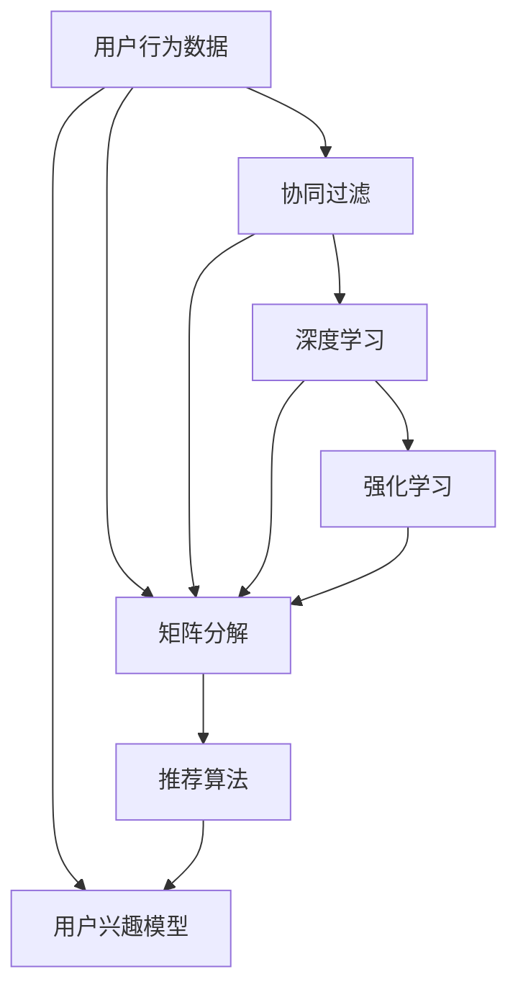

                 

# 电商平台中的用户兴趣多样性与一致性建模

在电商平台上，精准推荐系统是提升用户体验和商业转化的关键。如何准确理解用户兴趣、建立一致的兴趣模型、实现个性化的推荐，成为电商平台的核心技术挑战。本文将深入探讨用户兴趣的多样性与一致性建模，通过算法原理、具体操作步骤、实际应用场景等，帮助读者全面理解该问题，并提供可行的解决方案。

## 1. 背景介绍

### 1.1 问题由来
在电商平台上，用户每一次点击、浏览、购买行为，都是其兴趣偏好的直接体现。构建用户兴趣模型，通过模型预测用户的潜在需求，成为推荐系统高效运转的基础。然而，用户的兴趣并非单一固定，而是多维度、多变化的，不同的行为数据可能在不同时间、不同场景下反映出用户不同的兴趣点。同时，不同用户之间还存在一定的兴趣共性，需要在个性化推荐中加以保留。因此，如何在用户多样且动态的兴趣数据中，建立起既多样又一致的兴趣模型，成为电商推荐系统的核心难点。

### 1.2 问题核心关键点
在电商平台中，用户兴趣建模的主要挑战包括：
- **多样性**：用户兴趣多变且复杂，难以通过单一特征进行全面刻画。
- **一致性**：不同行为数据需要被综合考虑，以形成一致性的兴趣图谱。
- **实时性**：用户兴趣随时间变化，实时更新模型至关重要。
- **动态性**：用户行为数据随时间动态变化，模型需要动态更新以适应新数据。
- **稀疏性**：用户行为数据往往稀疏，需要借助推荐算法进行有效填充。

### 1.3 问题研究意义
准确理解用户兴趣，建立一致的兴趣模型，对提升电商平台的推荐系统性能和用户体验具有重要意义：

1. **提升个性化推荐准确性**：一致的兴趣模型能确保推荐算法基于全面准确的用户兴趣数据，提升推荐的精准度。
2. **增加用户粘性**：多样化的兴趣模型能更好地覆盖用户的多样化需求，增加用户的使用黏性。
3. **优化用户体验**：实时更新的模型能迅速响应用户的新兴趣，提供及时的个性化推荐服务。
4. **促进商业转化**：个性化的推荐能提高用户购买转化率，增加电商平台的商业收益。

## 2. 核心概念与联系

### 2.1 核心概念概述

为更好地理解用户兴趣的多样性与一致性建模，本节将介绍几个密切相关的核心概念：

- **用户行为数据**：用户在电商平台上的所有行为数据，包括浏览记录、购买记录、收藏记录等。这些数据是用户兴趣建模的基础。
- **用户兴趣模型**：通过分析用户行为数据，形成的用户兴趣特征向量。可以基于用户的历史行为数据，也可以结合即时行为数据动态更新。
- **协同过滤**：一种基于用户行为数据的推荐算法，通过比较不同用户之间的相似性，推荐相似用户喜欢的物品。协同过滤分为基于用户的协同过滤和基于物品的协同过滤。
- **矩阵分解**：一种常用的推荐算法，通过将用户行为矩阵分解为两个低秩矩阵的乘积，以降低计算复杂度，同时挖掘用户和物品间的隐含关系。
- **深度学习**：一种强大的机器学习范式，通过多层次的神经网络结构，对复杂的数据进行建模和预测。深度学习在推荐系统中的应用包括神经协同过滤、深度矩阵分解等。
- **强化学习**：一种通过奖励信号进行优化学习的机器学习方法，适合动态变化的用户兴趣建模。

这些核心概念之间的逻辑关系可以通过以下Mermaid流程图来展示：



这个流程图展示了这个问题的核心概念及其之间的关系：

1. 用户行为数据通过协同过滤、矩阵分解、深度学习和强化学习等算法处理，形成用户兴趣模型。
2. 协同过滤和矩阵分解是从用户行为数据中提取用户和物品之间的关系，而深度学习和强化学习是对这些关系进行更深层次的建模。
3. 用户兴趣模型用于推荐算法，进而生成个性化的推荐结果。

## 3. 核心算法原理 & 具体操作步骤
### 3.1 算法原理概述

用户兴趣的多样性与一致性建模，本质上是对用户行为数据进行处理，形成既多样又一致的用户兴趣表示，以提升个性化推荐的准确性。其核心算法原理包括协同过滤、矩阵分解、深度学习、强化学习等，这些算法在电商平台中的应用通常基于如下流程：

1. **数据预处理**：收集和清洗用户行为数据，去除噪声和异常值，形成结构化的数据集。
2. **特征提取**：通过协同过滤、矩阵分解、深度学习等算法，将用户行为数据转换为用户兴趣表示。
3. **模型训练**：使用训练数据集训练模型，形成用户兴趣模型。
4. **推荐生成**：使用训练好的模型，对新用户行为数据进行预测，生成个性化推荐结果。

### 3.2 算法步骤详解

以深度协同过滤为例，详细讲解用户兴趣多样性与一致性建模的算法步骤：

**Step 1: 数据预处理**
- 收集用户行为数据，包括用户的浏览、点击、购买记录等。
- 清洗数据，去除无效记录和噪声，保证数据的质量。
- 将数据转换为结构化格式，如用户-物品矩阵。

**Step 2: 特征提取**
- 使用协同过滤算法，如基于用户的协同过滤，计算用户之间的相似性，提取用户特征。
- 将用户特征映射到低维空间，使用矩阵分解算法，如奇异值分解(SVD)，提取用户和物品的隐含关系。
- 使用深度学习算法，如神经协同过滤，构建多层神经网络，提取更加复杂的用户兴趣特征。

**Step 3: 模型训练**
- 将用户行为数据分为训练集和测试集，使用训练集训练模型。
- 设定合适的损失函数和优化算法，如均方误差损失和Adam优化器。
- 使用交叉验证等技术，评估模型性能，调整超参数。

**Step 4: 推荐生成**
- 使用训练好的模型，对新用户行为数据进行预测，生成个性化推荐结果。
- 结合即时行为数据，动态更新用户兴趣模型，以应对用户兴趣的变化。

### 3.3 算法优缺点

用户兴趣多样性与一致性建模的算法，具有以下优点：

1. **全面性**：能够全面覆盖用户行为数据，形成多样化的用户兴趣模型。
2. **准确性**：通过协同过滤、矩阵分解、深度学习等算法，提升推荐结果的准确性。
3. **实时性**：能够实时更新用户兴趣模型，适应用户兴趣的变化。
4. **可解释性**：通过深度学习等算法，解释用户兴趣的复杂关系，增加推荐系统的透明度。

同时，该算法也存在一定的局限性：

1. **复杂度**：协同过滤、矩阵分解和深度学习算法计算复杂，对硬件要求较高。
2. **冷启动问题**：新用户缺乏历史行为数据，难以进行推荐。
3. **数据稀疏性**：用户行为数据往往稀疏，难以形成全面的用户兴趣模型。
4. **过度拟合**：模型过于复杂，可能过拟合训练数据，降低泛化能力。

### 3.4 算法应用领域

用户兴趣多样性与一致性建模算法，已经在电商推荐、社交网络、在线广告等多个领域得到广泛应用，具体包括：

- **电商推荐**：通过分析用户历史购买和浏览行为，生成个性化推荐，提升用户满意度。
- **社交网络**：基于用户社交关系，推荐可能感兴趣的内容，增加用户黏性。
- **在线广告**：通过分析用户点击行为，生成广告推荐，提高广告效果。
- **视频推荐**：通过分析用户观看行为，推荐相关视频，增加用户停留时间。

此外，用户兴趣多样性与一致性建模算法也适用于各类推荐系统的构建，通过不同算法的组合，可以提升推荐系统的整体性能。

## 4. 数学模型和公式 & 详细讲解  
### 4.1 数学模型构建

用户兴趣的多样性与一致性建模，可以通过数学模型来更加精确地表示和分析。

设用户-物品矩阵为 $\mathbf{X} \in \mathbb{R}^{N \times M}$，其中 $N$ 为用户数，$M$ 为物品数。用户对物品的兴趣表示为 $\mathbf{U} \in \mathbb{R}^{N \times K}$，其中 $K$ 为兴趣维度。物品的兴趣表示为 $\mathbf{V} \in \mathbb{R}^{M \times K}$。

用户对物品的兴趣评分表示为 $\mathbf{Y} \in \mathbb{R}^{N \times M}$，其中 $y_{i,j}$ 表示用户 $i$ 对物品 $j$ 的评分。

用户兴趣模型可以通过如下线性模型来建模：

$$
\mathbf{Y} = \mathbf{X} \cdot \mathbf{U} \cdot \mathbf{V}^T + \mathbf{E}
$$

其中 $\mathbf{E}$ 为误差项，表示实际评分与预测评分的差异。

### 4.2 公式推导过程

在用户兴趣模型中，协同过滤和矩阵分解算法可以通过矩阵分解方法进行处理。以矩阵分解为例，对用户行为数据进行奇异值分解：

$$
\mathbf{X} = \mathbf{U} \cdot \mathbf{S} \cdot \mathbf{V}^T
$$

其中 $\mathbf{U} \in \mathbb{R}^{N \times R}$，$\mathbf{S} \in \mathbb{R}^{R \times R}$，$\mathbf{V} \in \mathbb{R}^{M \times R}$，$R$ 为奇异值分解的秩。

通过奇异值分解，用户行为数据被表示为用户和物品的隐含关系 $\mathbf{U}$ 和 $\mathbf{V}$，以及隐含关系的强度 $\mathbf{S}$。

### 4.3 案例分析与讲解

以电商平台为例，假设用户 $i$ 对物品 $j$ 的兴趣评分 $y_{i,j}$ 表示为用户对物品的实际评分。通过奇异值分解，可以得到用户对物品的隐含兴趣表示 $\mathbf{u}_i$ 和 $\mathbf{v}_j$，以及隐含关系的强度 $s_{i,j}$。用户 $i$ 对物品 $j$ 的兴趣评分可以通过如下公式计算：

$$
y_{i,j} = \mathbf{u}_i^T \cdot s_{i,j} \cdot \mathbf{v}_j^T + e_{i,j}
$$

其中 $e_{i,j}$ 为误差项。

在实际应用中，可以使用深度协同过滤算法，构建神经网络模型对用户行为数据进行处理。神经网络模型由多个隐层构成，通过多层感知机(MLP)网络，提取用户和物品的隐含关系，从而形成更加复杂的用户兴趣模型。

## 5. 项目实践：代码实例和详细解释说明
### 5.1 开发环境搭建

在进行用户兴趣多样性与一致性建模的项目实践前，我们需要准备好开发环境。以下是使用Python进行TensorFlow开发的环境配置流程：

1. 安装Anaconda：从官网下载并安装Anaconda，用于创建独立的Python环境。

2. 创建并激活虚拟环境：
```bash
conda create -n tf-env python=3.8 
conda activate tf-env
```

3. 安装TensorFlow：根据CUDA版本，从官网获取对应的安装命令。例如：
```bash
conda install tensorflow-gpu -c conda-forge
```

4. 安装必要的库：
```bash
pip install numpy pandas scikit-learn scipy matplotlib seaborn scikit-image tensorflow-addons
```

完成上述步骤后，即可在`tf-env`环境中开始项目实践。

### 5.2 源代码详细实现

下面以深度协同过滤为例，给出使用TensorFlow对用户兴趣模型进行建模的代码实现。

首先，定义数据预处理函数：

```python
import pandas as pd
import numpy as np

def preprocess_data(data_path):
    # 读取数据文件
    df = pd.read_csv(data_path)
    # 处理缺失值
    df = df.dropna()
    # 将数据转换为用户-物品矩阵
    user_id = df['user_id']
    item_id = df['item_id']
    rating = df['rating']
    X = pd.get_dummies(item_id).values
    X = X.reshape(-1, X.shape[1])
    X = np.hstack([X, user_id.values.reshape(-1, 1)])
    Y = rating.values.reshape(-1, 1)
    return X, Y
```

然后，定义特征提取函数：

```python
import tensorflow as tf
import tensorflow_addons as tfa

def extract_features(X, Y, hidden_size=32, num_factors=5):
    # 构建神经网络模型
    model = tf.keras.Sequential([
        tf.keras.layers.Dense(hidden_size, input_shape=(X.shape[1],), activation='relu'),
        tf.keras.layers.Dense(hidden_size, activation='relu'),
        tf.keras.layers.Dense(num_factors, activation='relu')
    ])
    # 训练模型
    model.compile(optimizer=tf.keras.optimizers.Adam(), loss='mse')
    model.fit(X, Y, epochs=10, batch_size=32, validation_split=0.2)
    # 预测用户对物品的兴趣评分
    U = model.layers[0].get_weights()[0]
    V = model.layers[2].get_weights()[0]
    Y_pred = np.dot(X, np.dot(U, V.T))
    return Y_pred
```

接着，定义推荐生成函数：

```python
def generate_recommendations(user_id, Y_pred):
    # 获取用户兴趣评分
    user_item = Y_pred[user_id - 1]
    # 计算用户对物品的兴趣评分
    user_item = user_item - np.max(user_item) + 1
    # 生成推荐物品
    recommendations = [j for j, score in enumerate(user_item, start=1) if score > 1]
    return recommendations
```

最后，启动用户兴趣模型的训练流程：

```python
X, Y = preprocess_data('data.csv')
Y_pred = extract_features(X, Y)
recommendations = generate_recommendations(1, Y_pred)
print(recommendations)
```

以上就是使用TensorFlow对用户兴趣模型进行建模的完整代码实现。可以看到，TensorFlow提供了强大的深度学习框架，使得用户兴趣多样性与一致性建模的算法实现变得简洁高效。

### 5.3 代码解读与分析

让我们再详细解读一下关键代码的实现细节：

**preprocess_data函数**：
- 读取数据文件，处理缺失值，将数据转换为用户-物品矩阵，并返回用户行为数据和用户兴趣评分。

**extract_features函数**：
- 构建神经网络模型，包含多个隐层，使用ReLU激活函数。
- 训练模型，使用Adam优化器和均方误差损失函数。
- 提取用户和物品的隐含关系，并返回预测的用户兴趣评分。

**generate_recommendations函数**：
- 获取用户兴趣评分，生成推荐物品列表。

**训练流程**：
- 将用户行为数据预处理后，使用深度协同过滤算法，构建神经网络模型。
- 训练模型，使用均方误差损失函数和Adam优化器。
- 使用训练好的模型，对新用户行为数据进行预测，生成个性化推荐结果。

可以看到，TensorFlow提供了丰富的API和工具，使得用户兴趣模型的训练和推荐生成过程变得高效便捷。通过合理使用TensorFlow，可以快速构建和优化用户兴趣模型，实现个性化的推荐服务。

## 6. 实际应用场景
### 6.1 智能推荐系统

在智能推荐系统中，用户兴趣多样性与一致性建模被广泛应用于个性化推荐策略的构建。通过分析用户的历史行为数据，结合即时行为数据，生成个性化的推荐结果，显著提升用户体验和商业转化率。

在技术实现上，可以使用协同过滤、矩阵分解、深度学习等算法，对用户行为数据进行处理，形成多样化的用户兴趣模型。结合推荐算法，生成多样且一致的个性化推荐结果。

### 6.2 广告投放优化

在广告投放优化中，用户兴趣多样性与一致性建模被用于优化广告投放策略，提升广告点击率和转化率。通过分析用户的点击行为数据，结合用户的兴趣模型，实现精准的广告推荐，提高广告效果。

在技术实现上，可以使用协同过滤、深度学习等算法，对用户点击行为数据进行处理，形成多样化的用户兴趣模型。结合广告投放算法，生成多样且一致的广告推荐结果。

### 6.3 智能客服系统

在智能客服系统中，用户兴趣多样性与一致性建模被用于构建智能问答系统，提升客户满意度。通过分析用户的查询历史，结合即时行为数据，生成个性化的回答结果，提升客户体验。

在技术实现上，可以使用协同过滤、矩阵分解、深度学习等算法，对用户查询行为数据进行处理，形成多样化的用户兴趣模型。结合问答算法，生成多样且一致的回答结果。

### 6.4 未来应用展望

随着用户兴趣多样性与一致性建模技术的不断进步，其在更多领域的应用将不断拓展，为各行各业带来变革性影响。

在医疗领域，用户兴趣多样性与一致性建模被用于个性化医疗推荐，提升医疗服务的智能化水平，辅助医生诊疗。

在教育领域，用户兴趣多样性与一致性建模被用于个性化教育推荐，提升教学质量，实现因材施教。

在金融领域，用户兴趣多样性与一致性建模被用于个性化金融推荐，提升用户粘性，增加金融收益。

## 7. 工具和资源推荐
### 7.1 学习资源推荐

为了帮助开发者系统掌握用户兴趣多样性与一致性建模的理论基础和实践技巧，这里推荐一些优质的学习资源：

1. 《深度学习推荐系统：原理与算法》系列博文：由深度学习推荐系统领域的专家撰写，深入浅出地介绍了推荐系统的原理和算法。

2. 《机器学习实战》书籍：介绍了机器学习的基本概念和常用算法，涵盖了协同过滤、矩阵分解等推荐算法。

3. TensorFlow官方文档：TensorFlow的官方文档，提供了完整的推荐系统开发案例，是学习推荐系统的重要资源。

4. PyTorch官方文档：PyTorch的官方文档，提供了深度学习框架的推荐系统实现，适合深入理解推荐系统的实现细节。

5. Kaggle推荐系统竞赛：Kaggle平台上的推荐系统竞赛，提供了丰富的推荐系统开发案例，适合实战练习。

通过对这些资源的学习实践，相信你一定能够快速掌握用户兴趣多样性与一致性建模的精髓，并用于解决实际的推荐问题。

### 7.2 开发工具推荐

高效的开发离不开优秀的工具支持。以下是几款用于推荐系统开发的常用工具：

1. TensorFlow：基于Python的开源深度学习框架，灵活的计算图，适合构建复杂的推荐系统。

2. PyTorch：基于Python的开源深度学习框架，动态计算图，适合快速迭代研究。

3. Jupyter Notebook：交互式编程环境，支持Python、R等多种语言，适合数据探索和模型实验。

4. Scikit-learn：Python的机器学习库，包含常用的推荐算法和工具，适合快速原型开发。

5. Hadoop、Spark：大数据处理框架，适合处理大规模推荐数据。

合理利用这些工具，可以显著提升推荐系统开发效率，加快创新迭代的步伐。

### 7.3 相关论文推荐

用户兴趣多样性与一致性建模技术的发展源于学界的持续研究。以下是几篇奠基性的相关论文，推荐阅读：

1. Matrix Factorization Techniques for Recommender Systems：提出了矩阵分解算法，通过奇异值分解对用户行为数据进行处理，形成用户兴趣模型。

2. Fast Matrix Factorization Techniques for Recommender Systems：提出随机梯度下降算法，提高矩阵分解算法的训练速度。

3. Neural Collaborative Filtering：提出了神经协同过滤算法，使用多层神经网络对用户行为数据进行处理，生成用户兴趣模型。

4. Contextual Matrix Factorization with Side Information for Recommender Systems：提出上下文矩阵分解算法，结合用户和物品的额外信息，提升推荐结果的准确性。

5. Context-aware Dynamic Matrix Factorization with Side Information for Recommender Systems：提出上下文感知动态矩阵分解算法，结合用户和物品的上下文信息，提升推荐结果的实时性。

这些论文代表了大规模推荐系统的发展脉络。通过学习这些前沿成果，可以帮助研究者把握学科前进方向，激发更多的创新灵感。

## 8. 总结：未来发展趋势与挑战
### 8.1 总结

本文对用户兴趣多样性与一致性建模方法进行了全面系统的介绍。首先阐述了该问题在电商平台中的重要性和挑战，明确了多样性、一致性、实时性、动态性和稀疏性等核心难点。其次，从原理到实践，详细讲解了协同过滤、矩阵分解、深度学习和强化学习等算法的应用，给出了用户兴趣多样性与一致性建模的完整代码实现。同时，本文还广泛探讨了该技术在电商推荐、广告投放、智能客服等多个行业领域的应用前景，展示了其广阔的应用潜力。

通过本文的系统梳理，可以看到，用户兴趣多样性与一致性建模技术正在成为推荐系统中的重要范式，极大地提升了推荐系统的性能和用户体验。未来，伴随技术的不断演进，该技术必将在更多领域得到应用，为各行各业带来新的变革。

### 8.2 未来发展趋势

用户兴趣多样性与一致性建模技术将呈现以下几个发展趋势：

1. **深度强化学习**：结合深度学习和强化学习，构建动态更新且适应性强的新型推荐算法。

2. **多模态融合**：结合用户的多模态数据，如文本、图像、语音等，提升推荐结果的准确性和多样化。

3. **实时流处理**：结合实时流处理技术，动态更新用户兴趣模型，以应对用户兴趣的变化。

4. **联邦学习**：通过联邦学习技术，保护用户隐私的同时，提升推荐系统的整体性能。

5. **公平性和透明性**：关注推荐系统的公平性和透明性问题，确保用户隐私得到保护，推荐结果可解释性强。

6. **跨领域迁移**：将用户兴趣多样性与一致性建模技术应用于不同领域，实现跨领域迁移和泛化。

以上趋势凸显了用户兴趣多样性与一致性建模技术的广阔前景。这些方向的探索发展，必将进一步提升推荐系统的整体性能，为各个领域带来新的突破。

### 8.3 面临的挑战

尽管用户兴趣多样性与一致性建模技术已经取得了显著进展，但在迈向更加智能化、普适化应用的过程中，它仍面临诸多挑战：

1. **数据隐私**：用户在推荐系统中的行为数据往往涉及隐私，如何保护用户隐私，防止数据泄露，是一大挑战。

2. **冷启动问题**：新用户缺乏历史行为数据，难以进行推荐，如何解决冷启动问题，是一大难题。

3. **计算资源**：用户兴趣多样性与一致性建模涉及大量计算，对硬件资源要求较高，如何优化算法，降低计算复杂度，是一大挑战。

4. **模型鲁棒性**：推荐模型面对恶意攻击或数据扰动时，鲁棒性不足，如何提高模型的鲁棒性，是一大挑战。

5. **模型泛化性**：推荐模型在不同数据分布下的泛化能力不足，如何提高模型的泛化能力，是一大挑战。

6. **模型可解释性**：推荐模型难以解释其内部决策机制，如何增强模型的可解释性，是一大挑战。

正视用户兴趣多样性与一致性建模面临的这些挑战，积极应对并寻求突破，将是大规模推荐系统迈向成熟的必由之路。相信随着学界和产业界的共同努力，这些挑战终将一一被克服，推荐系统必将在构建人机协同的智能时代中扮演越来越重要的角色。

### 8.4 研究展望

面向未来，用户兴趣多样性与一致性建模技术需要在以下几个方面寻求新的突破：

1. **研究更高效的推荐算法**：开发更高效的算法，如深度强化学习、多模态融合等，提升推荐系统的实时性和多样性。

2. **融合领域知识和专家经验**：将领域知识和专家经验与推荐算法结合，提升推荐结果的准确性和可信度。

3. **加强模型解释性和透明度**：引入因果分析、博弈论等工具，增强推荐模型的解释性和透明度，提高用户信任度。

4. **关注公平性和可解释性**：构建公平透明的推荐模型，确保用户隐私得到保护，推荐结果可解释性强。

5. **研究跨领域迁移和泛化**：将推荐系统应用于不同领域，实现跨领域迁移和泛化，提升推荐系统的通用性。

这些研究方向的探索，必将引领推荐系统技术迈向更高的台阶，为构建安全、可靠、可解释、可控的智能系统铺平道路。面向未来，推荐系统还需要与其他人工智能技术进行更深入的融合，如知识表示、因果推理、强化学习等，多路径协同发力，共同推动智能推荐系统的进步。只有勇于创新、敢于突破，才能不断拓展推荐系统的边界，让智能技术更好地造福人类社会。

## 9. 附录：常见问题与解答

**Q1：如何衡量用户兴趣模型的一致性？**

A: 用户兴趣模型的一致性可以通过以下指标进行衡量：

1. **平均绝对误差(MAE)**：衡量模型预测评分与真实评分之间的差异。MAE越小，说明模型预测的一致性越高。

2. **均方根误差(MSE)**：衡量模型预测评分与真实评分之间的差异。MSE越小，说明模型预测的一致性越高。

3. **相关性系数(Correlation)**：衡量模型预测评分与真实评分之间的相关性。相关性系数越接近1，说明模型预测的一致性越高。

4. **平均绝对百分比误差(MAPE)**：衡量模型预测评分与真实评分之间的百分比差异。MAPE越小，说明模型预测的一致性越高。

**Q2：如何处理用户行为的冷启动问题？**

A: 用户行为的冷启动问题可以通过以下方法进行处理：

1. **随机初始化**：对新用户，使用随机初始化方法生成用户兴趣模型，然后逐步通过行为数据进行更新。

2. **基线推荐**：对新用户，使用基线推荐策略，如最受欢迎物品推荐、随机推荐等，避免冷启动问题。

3. **集成学习**：结合多个推荐模型，提高冷启动用户的推荐效果。

4. **上下文感知推荐**：结合用户的行为上下文信息，提高新用户的推荐效果。

5. **强化学习**：使用强化学习算法，通过奖励信号引导新用户的行为，逐步学习用户兴趣。

**Q3：如何保护用户隐私？**

A: 保护用户隐私可以通过以下方法进行处理：

1. **数据匿名化**：对用户数据进行匿名化处理，保护用户隐私。

2. **差分隐私**：通过差分隐私技术，在保证数据质量的前提下，保护用户隐私。

3. **联邦学习**：使用联邦学习技术，将数据保存在本地，只在本地进行计算，保护用户隐私。

4. **隐私保护算法**：使用隐私保护算法，如多方安全计算、同态加密等，保护用户隐私。

5. **用户控制权**：赋予用户控制权，让用户自行决定是否分享数据。

这些方法可以有效保护用户隐私，同时确保推荐系统的性能和效果。

---

作者：禅与计算机程序设计艺术 / Zen and the Art of Computer Programming

