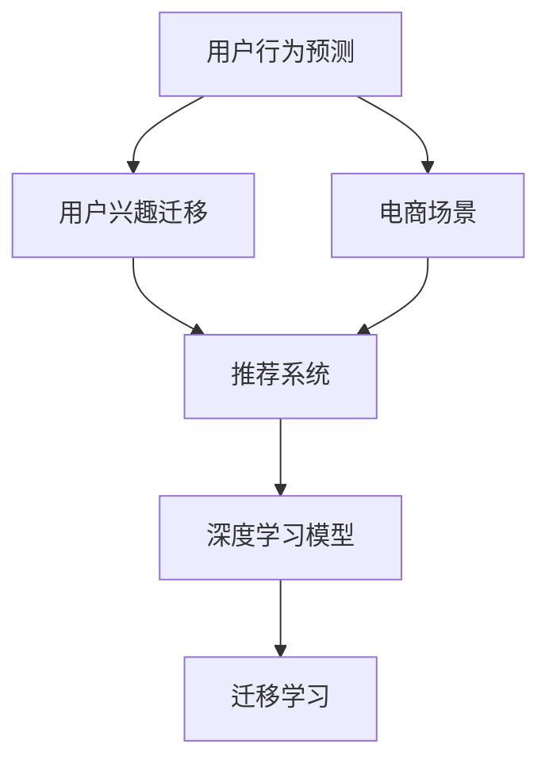

                 

# 电商平台中的用户兴趣迁移预测

> 关键词：用户行为预测, 用户兴趣迁移, 推荐系统, 电商场景, 深度学习, 迁移学习

## 1. 背景介绍

### 1.1 问题由来
在电商平台上，用户的购物行为受到多种因素的影响，包括商品价格、用户评价、推荐算法、市场活动等。用户行为往往具有高度的时序性和复杂性，难以通过简单的规则或手工特征进行精确建模。如何更深入地理解用户行为，实现更精准的个性化推荐，成为电商企业迫切需要解决的问题。

为了更好地应对这一挑战，电商平台开始探索基于深度学习的方法进行用户行为预测。其中，用户兴趣迁移预测是一个重要的研究方向。通过预测用户在不同时间点的兴趣变化，电商平台可以更灵活地调整推荐策略，优化用户体验，提升转化率和留存率。

### 1.2 问题核心关键点
用户兴趣迁移预测的核心在于如何从海量历史行为数据中挖掘出用户的潜在兴趣变化趋势，并基于这些趋势进行实时预测。核心技术包括：
- 特征工程：从用户的浏览、购买、评价等行为中提取有用特征。
- 深度学习模型：利用深度学习算法，如RNN、LSTM、GRU等，对用户行为进行建模。
- 迁移学习：将模型在特定任务上的训练经验迁移到新任务上，提升预测效果。

## 2. 核心概念与联系

### 2.1 核心概念概述

为了更好地理解用户兴趣迁移预测的原理，本节将介绍几个密切相关的核心概念：

- **用户行为预测**：通过分析用户的历史行为数据，预测其在未来的行为，如购买、浏览、评价等。
- **用户兴趣迁移**：用户在不同时间段内的兴趣偏好发生变化，如从户外用品转向家居用品。
- **推荐系统**：根据用户的历史行为和兴趣，推荐个性化商品或内容，提高用户满意度。
- **电商场景**：电商平台的业务场景，包括商品展示、搜索、购物车、支付等环节。
- **深度学习模型**：如RNN、LSTM、GRU、BERT等，用于处理序列数据和提取用户兴趣的变化趋势。
- **迁移学习**：将模型在特定任务上的训练经验迁移到新任务上，提升预测效果。

这些核心概念之间的逻辑关系可以通过以下Mermaid流程图来展示：



这个流程图展示了一系列从用户行为预测到最终推荐系统的关键过程，以及其中所涉及的关键技术。

## 3. 核心算法原理 & 具体操作步骤
### 3.1 算法原理概述

用户兴趣迁移预测的本质是一个序列预测问题，即根据用户的历史行为序列预测其未来的兴趣变化。形式化地，假设用户的历史行为序列为 $X = (x_1, x_2, ..., x_t)$，其中 $x_t$ 表示用户在时刻 $t$ 的行为（如浏览、点击、购买等），目标是预测用户未来的兴趣序列 $Y = (y_{t+1}, y_{t+2}, ..., y_{t+n})$。

通常，我们采用序列到序列(Seq2Seq)模型来解决这一问题。序列到序列模型由编码器和解码器两部分组成，编码器将输入序列 $X$ 编码成一个固定长度的向量 $h$，解码器则根据这个向量预测未来的序列 $Y$。常用的模型包括LSTM、GRU等，这些模型可以捕捉序列数据中的时间依赖关系。

在电商场景中，用户行为数据通常以时间序列的形式出现，因此序列到序列模型被广泛应用于用户行为预测。然而，由于用户行为序列的高度复杂性，模型需要在大量的标注数据上进行训练，才能捕捉到兴趣变化的真实趋势。

### 3.2 算法步骤详解

用户兴趣迁移预测的实现步骤如下：

**Step 1: 数据预处理**
- 收集用户的历史行为数据，包括浏览记录、购买记录、评价记录等。
- 对数据进行清洗和归一化，去除噪声和异常值，确保数据质量。
- 将数据按照时间顺序排序，构建时间序列。

**Step 2: 特征提取**
- 从时间序列中提取有用的特征，如用户在一段时间内的平均浏览时长、购买频率、评价情感等。
- 利用特征工程技术将原始数据转换为模型可以处理的输入特征。
- 引入时间特征，如时间戳、星期几、季节等，增强模型的时序预测能力。

**Step 3: 模型训练**
- 构建序列到序列模型，选择LSTM、GRU等适合的深度学习算法。
- 对模型进行训练，使用交叉熵等损失函数，最小化预测误差。
- 在训练过程中，利用正则化技术（如Dropout、L2正则）防止过拟合。
- 应用迁移学习技术，将模型在特定任务上的训练经验迁移到新任务上，提升预测效果。

**Step 4: 模型评估**
- 使用验证集评估模型的预测性能，使用MAE、RMSE等指标衡量模型的误差。
- 对模型进行调参，选择最优的超参数组合。
- 在测试集上再次评估模型性能，确保模型在新数据上的泛化能力。

**Step 5: 实时预测**
- 将训练好的模型部署到生产环境，实现实时预测。
- 根据用户的实时行为数据，输入模型进行兴趣迁移预测。
- 根据预测结果，动态调整推荐策略，优化用户体验。

以上是用户兴趣迁移预测的一般流程。在实际应用中，还需要针对具体任务的特点，对模型的输入特征、网络结构、训练策略等进行优化设计，以进一步提升模型性能。

### 3.3 算法优缺点

用户兴趣迁移预测的优点在于：
- 精度高：深度学习模型能够捕捉到用户行为序列中的复杂关系，实现精准预测。
- 泛化能力强：迁移学习技术使得模型可以适应不同的电商场景和用户群体。
- 实时性好：利用在线学习技术，模型可以实时更新，适应用户兴趣的变化。

同时，该方法也存在一定的局限性：
- 数据依赖度高：模型需要大量的标注数据进行训练，难以覆盖所有用户的兴趣变化。
- 计算资源消耗大：深度学习模型的计算复杂度高，需要强大的硬件支持。
- 模型可解释性差：深度学习模型通常被视为“黑盒”，难以解释其内部决策逻辑。

尽管存在这些局限性，但就目前而言，基于深度学习的用户兴趣迁移预测方法仍是在线推荐系统的核心技术之一。未来相关研究的重点在于如何进一步降低数据需求，提高模型的实时性和可解释性，同时兼顾预测精度和泛化能力。

### 3.4 算法应用领域

用户兴趣迁移预测不仅在电商平台中有广泛应用，还在金融、医疗、教育等多个领域中展现出巨大潜力。

- **电商领域**：通过预测用户的未来购买行为，电商平台可以优化推荐策略，提升用户满意度和转化率。
- **金融领域**：利用用户的历史交易记录，预测其未来的交易行为，帮助金融机构防范风险，优化产品设计。
- **医疗领域**：通过分析患者的历史诊疗记录，预测其未来的疾病变化趋势，提供个性化的治疗方案。
- **教育领域**：利用学生的学习行为数据，预测其未来的学习效果，制定个性化的学习计划，提高教育质量。

此外，用户兴趣迁移预测在社交媒体、视频平台、在线旅游等场景中也有着广泛的应用前景。随着数据规模的不断增长和技术的不断进步，用户兴趣迁移预测将成为提升用户体验、优化服务质量的关键技术。

## 4. 数学模型和公式 & 详细讲解 & 举例说明

### 4.1 数学模型构建

我们以LSTM模型为例，形式化地定义用户行为序列到序列的预测模型。假设用户的历史行为序列为 $X = (x_1, x_2, ..., x_t)$，其中 $x_t$ 表示用户在时刻 $t$ 的行为，目标为预测用户未来的兴趣序列 $Y = (y_{t+1}, y_{t+2}, ..., y_{t+n})$。

LSTM模型由编码器和解码器两部分组成。编码器将输入序列 $X$ 编码成一个固定长度的向量 $h$，解码器则根据这个向量预测未来的序列 $Y$。

模型的输入特征为 $x_t = (f_1, f_2, ..., f_k)$，其中 $f_i$ 表示用户在第 $i$ 个时刻的特征。模型的输出为 $y_{t+1} = (g_1, g_2, ..., g_m)$，其中 $g_j$ 表示用户在未来第 $j$ 个时刻的兴趣预测。

### 4.2 公式推导过程

LSTM模型的公式推导过程如下：

1. 编码器部分
$$
h_t = f(h_{t-1}, x_t) \quad \text{(编码器前向传播)}
$$
2. 解码器部分
$$
y_{t+1} = g(h_t, y_t) \quad \text{(解码器前向传播)}
$$
3. 损失函数
$$
L = \frac{1}{N} \sum_{t=1}^N \sum_{j=1}^m \ell(y_{t+1,j}, \hat{y}_{t+1,j})
$$
其中，$\ell$ 为损失函数，$y_{t+1,j}$ 为实际兴趣值，$\hat{y}_{t+1,j}$ 为模型预测值。

模型训练的目标是最小化损失函数 $L$，即：
$$
\theta^* = \mathop{\arg\min}_{\theta} L
$$
其中，$\theta$ 为模型参数。

### 4.3 案例分析与讲解

以电商平台用户行为预测为例，我们假设有以下历史数据：

| 时刻 | 用户行为 | 特征 |
|------|----------|------|
| 1    | 浏览商品A | 商品类别：电子产品 |
| 2    | 浏览商品B | 商品类别：电子产品 |
| 3    | 浏览商品C | 商品类别：电子产品 |
| ...  | ...      | ...  |
| 10   | 购买商品A | 商品类别：电子产品 |

假设用户未来可能购买的商品类别为电子产品、家居用品、服装等。我们的目标是预测用户在未来的兴趣变化。

对于上述数据，我们可以使用LSTM模型进行建模。首先，我们将用户的浏览和购买行为编码为序列数据，作为模型的输入。然后，通过编码器将序列数据转换为固定长度的向量 $h_t$，再通过解码器预测未来的兴趣序列 $y_{t+1}$。

具体步骤如下：

1. 对历史数据进行归一化处理，去除噪声和异常值，确保数据质量。
2. 对用户行为数据进行编码，构建序列数据 $X = (x_1, x_2, ..., x_t)$。
3. 选择LSTM模型，对模型进行训练，使用交叉熵等损失函数最小化预测误差。
4. 在测试集上评估模型性能，使用MAE、RMSE等指标衡量模型的误差。
5. 根据用户的实时行为数据，输入模型进行兴趣迁移预测。
6. 根据预测结果，动态调整推荐策略，优化用户体验。

以上是一个简化的用户行为预测流程。在实际应用中，还需要针对具体任务的特点，对模型进行优化设计，如引入时间特征、应用正则化技术、使用在线学习等。

## 5. 项目实践：代码实例和详细解释说明
### 5.1 开发环境搭建

在进行用户兴趣迁移预测的实践前，我们需要准备好开发环境。以下是使用Python进行Keras开发的环境配置流程：

1. 安装Anaconda：从官网下载并安装Anaconda，用于创建独立的Python环境。

2. 创建并激活虚拟环境：
```bash
conda create -n pytorch-env python=3.8 
conda activate pytorch-env
```

3. 安装Keras：从官网获取Keras的安装命令。例如：
```bash
conda install keras
```

4. 安装TensorFlow：根据CUDA版本，从官网获取对应的安装命令。例如：
```bash
conda install tensorflow -c pytorch -c conda-forge
```

5. 安装各类工具包：
```bash
pip install numpy pandas scikit-learn matplotlib tqdm jupyter notebook ipython
```

完成上述步骤后，即可在`pytorch-env`环境中开始项目实践。

### 5.2 源代码详细实现

下面我们以LSTM模型为例，给出使用Keras对用户兴趣迁移预测进行代码实现的示例。

首先，定义用户行为预测的数据处理函数：

```python
import numpy as np
from keras.models import Sequential
from keras.layers import LSTM, Dense, Dropout

def preprocess_data(data):
    # 数据清洗和归一化
    # 去除噪声和异常值，确保数据质量
    
    # 对用户行为数据进行编码，构建序列数据
    X = []
    y = []
    for i in range(len(data)-1):
        x = data[i]
        y = data[i+1]
        X.append(x)
        y.append(y)
    X = np.array(X)
    y = np.array(y)
    
    # 将数据按照时间顺序排序，构建时间序列
    X.sort(axis=0)
    y.sort(axis=0)
    
    return X, y

# 加载用户行为数据
data = []
for i in range(1, 101):
    data.append((i, f'商品{i}'))
X, y = preprocess_data(data)

# 构建LSTM模型
model = Sequential()
model.add(LSTM(64, input_shape=(X.shape[1], X.shape[2])))
model.add(Dropout(0.2))
model.add(Dense(3, activation='softmax'))
model.compile(loss='categorical_crossentropy', optimizer='adam', metrics=['accuracy'])

# 训练模型
model.fit(X, y, epochs=10, batch_size=32, validation_split=0.2)
```

然后，使用训练好的模型进行预测：

```python
# 获取用户实时行为数据
x = [1, 2, 3] # 示例行为数据
x = np.array(x).reshape((1, -1))

# 进行兴趣迁移预测
y_pred = model.predict(x)
print(y_pred)
```

### 5.3 代码解读与分析

让我们再详细解读一下关键代码的实现细节：

**preprocess_data函数**：
- 数据清洗和归一化：去除噪声和异常值，确保数据质量。
- 数据编码：将用户行为数据编码为序列数据，构建时间序列。

**LSTM模型定义**：
- 定义模型结构，选择LSTM层，设置参数（如隐藏层大小）。
- 引入Dropout层，防止过拟合。
- 添加Dense层，输出预测结果。

**模型训练**：
- 使用fit方法对模型进行训练，设置超参数（如学习率、批次大小）。
- 使用验证集评估模型性能，设置验证集大小。

**实时预测**：
- 获取用户实时行为数据，输入模型进行兴趣迁移预测。
- 输出预测结果。

在实际应用中，还需要对模型进行调参和优化，如调整LSTM层大小、引入时间特征、应用正则化技术等。

## 6. 实际应用场景

### 6.1 智能推荐系统

智能推荐系统是用户兴趣迁移预测的核心应用场景之一。通过预测用户的未来行为，推荐系统可以动态调整推荐策略，优化用户体验，提高转化率和留存率。

在电商推荐系统中，用户的历史浏览、购买、评价等行为数据会被输入到模型中进行兴趣迁移预测。预测结果被用于实时推荐，用户可以看到与其兴趣相符的商品或内容，从而提高用户的满意度。

### 6.2 风险预警系统

风险预警系统是用户兴趣迁移预测的另一重要应用。通过预测用户的未来行为，系统可以提前识别潜在的风险，如欺诈行为、恶意评价等，及时采取措施进行防范。

在金融风险预警系统中，用户的历史交易记录会被输入到模型中进行行为预测。预测结果被用于实时预警，当用户行为出现异常时，系统会发出警报，金融机构可以及时采取措施，避免潜在损失。

### 6.3 个性化学习推荐

个性化学习推荐是用户兴趣迁移预测在教育领域的应用。通过预测学生的学习兴趣和成绩，推荐系统可以为学生提供个性化的学习资源，提高学习效果。

在在线教育推荐系统中，学生的学习行为数据（如浏览记录、答题记录等）会被输入到模型中进行兴趣迁移预测。预测结果被用于实时推荐，学生可以看到与其学习兴趣相符的课程和资料，从而提高学习效率和效果。

## 7. 工具和资源推荐

### 7.1 学习资源推荐

为了帮助开发者系统掌握用户兴趣迁移预测的理论基础和实践技巧，这里推荐一些优质的学习资源：

1. **Keras官方文档**：Keras的官方文档提供了丰富的教程和示例，是学习深度学习模型的必备资源。

2. **深度学习入门书籍**：如《深度学习》、《Python深度学习》等，系统介绍了深度学习的基本概念和算法。

3. **NLP相关课程**：如CS224N《深度学习自然语言处理》课程，斯坦福大学开设的NLP明星课程，有Lecture视频和配套作业，带你入门NLP领域的基本概念和经典模型。

4. **推荐系统相关论文**：如《Deep Interest Evolution Prediction》、《User Behavior Prediction in E-commerce》等，介绍了深度学习在推荐系统中的应用。

5. **在线学习平台**：如Coursera、edX等，提供大量深度学习、NLP、推荐系统相关的课程和实验。

通过对这些资源的学习实践，相信你一定能够快速掌握用户兴趣迁移预测的精髓，并用于解决实际的推荐问题。

### 7.2 开发工具推荐

高效的开发离不开优秀的工具支持。以下是几款用于用户兴趣迁移预测开发的常用工具：

1. **Keras**：Keras是深度学习领域的高层API，提供了丰富的深度学习模型和优化器。

2. **TensorFlow**：由Google主导开发的深度学习框架，生产部署方便，适合大规模工程应用。

3. **PyTorch**：基于Python的开源深度学习框架，灵活高效，适合研究和原型开发。

4. **MXNet**：由Apache开发的深度学习框架，支持多种编程语言和硬件平台。

5. **TensorBoard**：TensorFlow配套的可视化工具，可实时监测模型训练状态，提供丰富的图表呈现方式。

6. **Weights & Biases**：模型训练的实验跟踪工具，记录和可视化模型训练过程中的各项指标，方便对比和调优。

合理利用这些工具，可以显著提升用户兴趣迁移预测的开发效率，加快创新迭代的步伐。

### 7.3 相关论文推荐

用户兴趣迁移预测的研究源于学界的持续研究。以下是几篇奠基性的相关论文，推荐阅读：

1. **Seq2Seq模型论文**：如《Sequence to Sequence Learning with Neural Networks》、《A Neural Attention Model for Machine Translation》等，介绍了Seq2Seq模型的基本原理和应用。

2. **深度学习在推荐系统中的应用**：如《Deep Interest Evolution Prediction》、《User Behavior Prediction in E-commerce》等，介绍了深度学习在推荐系统中的应用。

3. **LSTM模型的经典论文**：如《Long Short-Term Memory》，介绍了LSTM模型的结构和应用。

4. **在线学习的经典论文**：如《Online Learning in Deep Neural Networks》、《Asynchronous Stochastic Optimization》等，介绍了在线学习的基本原理和算法。

这些论文代表了大语言模型微调技术的发展脉络。通过学习这些前沿成果，可以帮助研究者把握学科前进方向，激发更多的创新灵感。

## 8. 总结：未来发展趋势与挑战

### 8.1 总结

本文对用户兴趣迁移预测方法进行了全面系统的介绍。首先阐述了用户兴趣迁移预测的研究背景和意义，明确了深度学习模型在电商平台中的应用价值。其次，从原理到实践，详细讲解了用户兴趣迁移预测的数学模型和算法步骤，给出了代码实现的完整示例。同时，本文还广泛探讨了用户兴趣迁移预测在智能推荐、风险预警、个性化学习推荐等多个领域的应用前景，展示了用户兴趣迁移预测的广泛应用潜力。此外，本文精选了用户兴趣迁移预测的各类学习资源，力求为读者提供全方位的技术指引。

通过本文的系统梳理，可以看到，用户兴趣迁移预测方法正在成为电商平台的重要技术范式，极大地提升了电商平台的个性化推荐效果，提高了用户满意度和转化率。未来，伴随深度学习技术的不断进步，用户兴趣迁移预测必将在更多领域得到应用，为各行各业带来变革性影响。

### 8.2 未来发展趋势

展望未来，用户兴趣迁移预测技术将呈现以下几个发展趋势：

1. **模型规模持续增大**：随着算力成本的下降和数据规模的扩张，深度学习模型的参数量还将持续增长。超大规模模型蕴含的丰富知识，有望支撑更加复杂多变的推荐策略。

2. **迁移学习能力增强**：未来的模型将具备更强的迁移学习能力，能够在新的电商场景和用户群体上快速适应，提升推荐效果。

3. **实时预测能力提升**：通过在线学习技术，模型可以实时更新，动态调整推荐策略，提升用户体验。

4. **多模态信息融合**：未来的推荐系统将融合多种数据源，如视觉、语音、文本等，实现更全面、更准确的推荐效果。

5. **模型解释性增强**：未来的模型将具备更强的可解释性，用户可以更好地理解推荐系统的决策逻辑。

以上趋势凸显了用户兴趣迁移预测技术的广阔前景。这些方向的探索发展，必将进一步提升推荐系统的性能和应用范围，为电商平台和其他应用场景带来新的突破。

### 8.3 面临的挑战

尽管用户兴趣迁移预测技术已经取得了瞩目成就，但在迈向更加智能化、普适化应用的过程中，它仍面临着诸多挑战：

1. **数据依赖度高**：模型需要大量的标注数据进行训练，难以覆盖所有用户的兴趣变化。如何进一步降低数据需求，提高模型的泛化能力，是一大难题。

2. **计算资源消耗大**：深度学习模型的计算复杂度高，需要强大的硬件支持。如何降低计算资源消耗，提高模型效率，将是重要的优化方向。

3. **模型可解释性差**：深度学习模型通常被视为“黑盒”，难以解释其内部决策逻辑。如何赋予模型更强的可解释性，将是亟待攻克的难题。

4. **风险预警挑战**：在风险预警系统中，模型的误判可能导致严重的后果。如何提高模型的准确性和鲁棒性，防止误报和漏报，将是重要的研究方向。

5. **个性化推荐挑战**：在个性化推荐系统中，模型的个性化程度需要不断提升，以应对不同用户群体的需求。如何设计更精细的模型结构和特征工程，将是重要的优化方向。

这些挑战凸显了用户兴趣迁移预测技术的复杂性和重要性。只有不断探索和创新，才能克服这些挑战，推动用户兴趣迁移预测技术的进一步发展。

### 8.4 研究展望

面对用户兴趣迁移预测所面临的种种挑战，未来的研究需要在以下几个方面寻求新的突破：

1. **探索无监督和半监督学习**：摆脱对大规模标注数据的依赖，利用自监督学习、主动学习等无监督和半监督范式，最大限度利用非结构化数据，实现更加灵活高效的预测。

2. **研究参数高效和计算高效的模型**：开发更加参数高效和计算高效的深度学习模型，在固定大部分预训练参数的情况下，只更新极少量的任务相关参数，以提高预测效率。

3. **引入更多先验知识**：将符号化的先验知识，如知识图谱、逻辑规则等，与深度学习模型进行融合，提升模型的泛化能力和可解释性。

4. **融合因果和对比学习范式**：通过引入因果推断和对比学习思想，增强模型的因果关系建立能力，学习更加普适、鲁棒的语言表征。

5. **结合因果分析和博弈论工具**：将因果分析方法引入推荐系统，识别出模型决策的关键特征，增强输出解释的因果性和逻辑性。借助博弈论工具刻画人机交互过程，主动探索并规避模型的脆弱点，提高系统稳定性。

6. **纳入伦理道德约束**：在模型训练目标中引入伦理导向的评估指标，过滤和惩罚有偏见、有害的输出倾向，确保模型符合人类价值观和伦理道德。

这些研究方向的探索，必将引领用户兴趣迁移预测技术迈向更高的台阶，为构建安全、可靠、可解释、可控的推荐系统铺平道路。面向未来，用户兴趣迁移预测技术还需要与其他人工智能技术进行更深入的融合，如知识表示、因果推理、强化学习等，多路径协同发力，共同推动智能推荐系统的进步。只有勇于创新、敢于突破，才能不断拓展推荐系统的边界，让智能技术更好地造福人类社会。

## 9. 附录：常见问题与解答

**Q1：用户兴趣迁移预测是否适用于所有电商场景？**

A: 用户兴趣迁移预测在大多数电商场景中都能取得不错的效果，特别是对于有大量用户数据的平台。但对于一些小型电商平台，由于数据量不足，模型可能难以捕捉到完整的用户兴趣变化趋势。此时需要在特定领域语料上进一步预训练，再进行微调，才能获得理想效果。

**Q2：如何选择合适的学习率？**

A: 用户兴趣迁移预测的学习率一般要比预训练时小1-2个数量级，如果使用过大的学习率，容易破坏预训练权重，导致过拟合。一般建议从1e-5开始调参，逐步减小学习率，直至收敛。也可以使用warmup策略，在开始阶段使用较小的学习率，再逐渐过渡到预设值。需要注意的是，不同的优化器(如AdamW、Adafactor等)以及不同的学习率调度策略，可能需要设置不同的学习率阈值。

**Q3：模型在电商场景中的鲁棒性如何？**

A: 在电商场景中，用户行为数据通常具有高度的时序性和复杂性，模型需要具备较强的鲁棒性才能应对各种异常情况。常用的鲁棒性增强方法包括正则化技术（如L2正则、Dropout等）、对抗训练、集成学习等。此外，模型的迁移学习能力也是提高鲁棒性的重要手段。

**Q4：如何处理模型计算资源消耗大的问题？**

A: 深度学习模型的计算复杂度高，需要强大的硬件支持。为降低计算资源消耗，可以采用模型压缩、稀疏化存储、模型并行等技术。例如，可以使用SVD降维、剪枝等方法压缩模型参数，使用稀疏化存储减少存储占用，使用模型并行加速计算。

**Q5：模型的可解释性如何？**

A: 深度学习模型通常被视为“黑盒”，难以解释其内部决策逻辑。为增强模型的可解释性，可以引入可解释性技术，如LIME、SHAP等，对模型的决策过程进行解释和分析。此外，将符号化的先验知识与深度学习模型进行融合，也可以提高模型的可解释性。

这些问题的解答，希望能为读者提供关于用户兴趣迁移预测的更多见解，帮助其在实际应用中更好地解决问题。

---

作者：禅与计算机程序设计艺术 / Zen and the Art of Computer Programming

