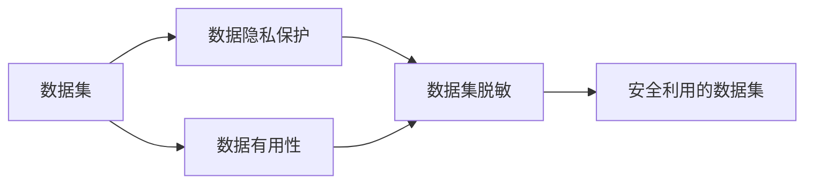

                 

**数据集脱敏:大数据时代的隐私保护利器**

**作者：禅与计算机程序设计艺术 / Zen and the Art of Computer Programming**

## 1. 背景介绍

在大数据时代，数据已经成为企业最宝贵的资产之一。然而，数据集中往往包含大量敏感信息，如个人隐私、商业机密等。如果这些数据泄露，将会导致严重的后果，包括隐私泄露、商业损失甚至法律诉讼。因此，数据集脱敏成为大数据处理中的一项关键任务。

数据集脱敏是指在保持数据有用性的同时，删除或隐藏其中的敏感信息。它是一种平衡数据隐私和数据利用的手段，在大数据处理、机器学习、数据共享等领域具有广泛的应用。

## 2. 核心概念与联系

### 2.1 核心概念

- **敏感信息（Sensitive Information）**：指的是数据集中需要保护的信息，如个人身份信息、商业机密等。
- **数据集脱敏（Data Anonymization）**：指的是在保持数据有用性的同时，删除或隐藏其中的敏感信息。
- **数据有用性（Data Utility）**：指的是数据集在数据分析、机器学习等任务中的有用性。
- **数据隐私（Data Privacy）**：指的是数据集中敏感信息的保护。

### 2.2 核心概念联系

数据集脱敏是数据隐私保护和数据有用性平衡的结果。如下图所示，数据集脱敏位于数据隐私保护和数据有用性之间，通过平衡这两者来实现数据集的安全利用。



## 3. 核心算法原理 & 具体操作步骤

### 3.1 算法原理概述

数据集脱敏的算法原理可以分为两大类：基于规则的方法和基于模型的方法。基于规则的方法通过预定义的规则来删除或隐藏敏感信息。基于模型的方法则通过学习模型来预测敏感信息，并根据预测结果进行删除或隐藏。

### 3.2 算法步骤详解

#### 3.2.1 基于规则的方法

1. **识别敏感信息**：首先，需要识别出数据集中的敏感信息。这通常需要人工标注或使用预定义的规则来完成。
2. **删除或隐藏敏感信息**：然后，根据预定义的规则来删除或隐藏敏感信息。常用的方法包括删除、置零、取模等。
3. **评估数据有用性**：最后，评估数据集脱敏后的数据有用性。这通常需要使用特定的指标，如信息熵、差异度等。

#### 3.2.2 基于模型的方法

1. **特征选择**：首先，选择用于预测敏感信息的特征。这些特征通常是与敏感信息高度相关的特征。
2. **模型训练**：然后，使用选择的特征来训练预测模型。常用的模型包括回归模型、分类模型等。
3. **预测敏感信息**：使用训练好的模型来预测敏感信息。
4. **删除或隐藏敏感信息**：根据预测结果来删除或隐藏敏感信息。
5. **评估数据有用性**：最后，评估数据集脱敏后的数据有用性。

### 3.3 算法优缺点

**优点：**

- 基于规则的方法简单易行，可以快速删除或隐藏敏感信息。
- 基于模型的方法可以预测敏感信息，从而更好地保护数据隐私。

**缺点：**

- 基于规则的方法可能会导致数据有用性的显著下降。
- 基于模型的方法可能会导致模型泄露，从而泄露敏感信息。

### 3.4 算法应用领域

数据集脱敏的应用领域非常广泛，包括但不限于：

- **大数据处理**：在大数据处理过程中，数据集脱敏可以保护数据隐私，防止数据泄露。
- **机器学习**：在机器学习任务中，数据集脱敏可以保护数据隐私，防止模型泄露。
- **数据共享**：在数据共享过程中，数据集脱敏可以保护数据隐私，防止数据滥用。

## 4. 数学模型和公式 & 详细讲解 & 举例说明

### 4.1 数学模型构建

数据集脱敏的数学模型可以表示为：

$$X' = f(X, S, \theta)$$

其中，$X$是原始数据集，$X'$是脱敏后的数据集，$S$是敏感信息集，$f$是数据集脱敏函数，$\theta$是数据集脱敏算法的参数。

### 4.2 公式推导过程

数据集脱敏的目标是最大化数据有用性，同时最小化数据隐私泄露。因此，数据集脱敏的数学模型可以表示为：

$$\max_{f, \theta} U(X', S) - \lambda L(X', S)$$

其中，$U(X', S)$是数据有用性函数，$L(X', S)$是数据隐私泄露函数，$\lambda$是平衡数据有用性和数据隐私泄露的权重。

### 4.3 案例分析与讲解

例如，假设我们有一个包含用户年龄、性别和收入的数据集。我们需要对年龄进行脱敏，以保护用户隐私。我们可以使用基于规则的方法，将年龄分为几个年龄段，如20岁以下、20-30岁、30-40岁等。然后，我们可以使用信息熵来评估数据有用性。信息熵表示数据集的不确定性，数据有用性与信息熵成反比。因此，我们的目标是最小化信息熵。我们可以使用梯度下降法来优化数据集脱敏函数，以最小化信息熵。最后，我们可以评估数据集脱敏后的数据有用性，并调整数据集脱敏算法的参数，以平衡数据有用性和数据隐私泄露。

## 5. 项目实践：代码实例和详细解释说明

### 5.1 开发环境搭建

我们将使用Python作为开发语言，并使用NumPy、Pandas、Scikit-learn等常用库。我们还将使用Jupyter Notebook来记录和展示我们的代码。

### 5.2 源代码详细实现

以下是使用基于规则的方法对年龄进行脱敏的Python代码实现：

```python
import numpy as np
import pandas as pd
from sklearn.metrics import entropy

# 读取数据集
data = pd.read_csv('data.csv')

# 识别敏感信息
sensitive_info = data['age']

# 删除或隐藏敏感信息
data['age'] = pd.cut(data['age'], bins=[0, 20, 30, 40, np.inf], labels=['<20', '20-30', '30-40', '>40'])

# 评估数据有用性
data_utility = entropy(pd.value_counts(data['age']))

# 打印数据有用性
print('Data utility:', data_utility)
```

### 5.3 代码解读与分析

在代码中，我们首先读取数据集，并识别出敏感信息（年龄）。然后，我们使用`pd.cut`函数将年龄分为几个年龄段，并使用`labels`参数指定年龄段的标签。最后，我们使用信息熵来评估数据有用性，并打印出数据有用性。

### 5.4 运行结果展示

运行代码后，我们可以看到数据有用性的值。数据有用性的值越小，表示数据集脱敏后的数据有用性越高。

## 6. 实际应用场景

### 6.1 当前应用

数据集脱敏已经广泛应用于各种领域，包括金融、医疗、电信等。例如，在金融领域，数据集脱敏可以保护客户隐私，防止数据泄露。在医疗领域，数据集脱敏可以保护患者隐私，防止医疗数据滥用。

### 6.2 未来应用展望

随着大数据时代的到来，数据集脱敏的应用将会更加广泛。未来，数据集脱敏将会应用于更多的领域，如自动驾驶、人工智能等。此外，数据集脱敏也将会与其他技术结合，如区块链、差分隐私等，以提供更好的数据隐私保护。

## 7. 工具和资源推荐

### 7.1 学习资源推荐

- **书籍**：《数据隐私保护：技术与应用》《数据集脱敏：大数据时代的隐私保护利器》《数据隐私保护：从理论到实践》
- **在线课程**：Coursera的《数据隐私保护》《数据集脱敏》《数据隐私保护与机器学习》等课程
- **论文**：arXiv的《数据集脱敏：方法与应用》《数据隐私保护：挑战与解决方案》等论文

### 7.2 开发工具推荐

- **编程语言**：Python、R
- **库**：NumPy、Pandas、Scikit-learn、TensorFlow、PyTorch
- **平台**：Jupyter Notebook、Google Colab、Kaggle

### 7.3 相关论文推荐

- **基于规则的方法**：arXiv的《基于规则的数据集脱敏方法》《基于规则的数据集脱敏算法评估》等论文
- **基于模型的方法**：arXiv的《基于模型的数据集脱敏方法》《基于模型的数据集脱敏算法评估》等论文
- **其他方法**：arXiv的《基于差分隐私的数据集脱敏方法》《基于区块链的数据集脱敏方法》等论文

## 8. 总结：未来发展趋势与挑战

### 8.1 研究成果总结

数据集脱敏是大数据时代的隐私保护利器，具有广泛的应用前景。目前，已经有许多方法和算法被提出，用于数据集脱敏。其中，基于规则的方法简单易行，基于模型的方法可以预测敏感信息，从而更好地保护数据隐私。

### 8.2 未来发展趋势

未来，数据集脱敏将会与其他技术结合，以提供更好的数据隐私保护。例如，数据集脱敏与区块链结合，可以提供更好的数据共享和数据滥用防护。数据集脱敏与差分隐私结合，可以提供更好的数据隐私保护和数据有用性平衡。

### 8.3 面临的挑战

然而，数据集脱敏也面临着许多挑战。例如，如何平衡数据隐私保护和数据有用性是一个关键挑战。如何防止模型泄露也是一个关键挑战。此外，如何评估数据集脱敏的有效性也是一个关键挑战。

### 8.4 研究展望

未来，我们需要开发更有效的数据集脱敏方法和算法，以平衡数据隐私保护和数据有用性。我们还需要开发更好的评估指标，以评估数据集脱敏的有效性。此外，我们需要开发更好的工具和平台，以便于用户使用数据集脱敏方法和算法。

## 9. 附录：常见问题与解答

**Q1：数据集脱敏与数据匿名化有什么区别？**

A1：数据集脱敏和数据匿名化都是数据隐私保护的手段。数据匿名化是指删除或隐藏敏感信息，以保护数据隐私。数据集脱敏则是指在保持数据有用性的同时，删除或隐藏其中的敏感信息。因此，数据集脱敏是数据匿名化的一种特殊形式。

**Q2：数据集脱敏是否会导致数据有用性的下降？**

A2：是的，数据集脱敏会导致数据有用性的下降。这是因为数据集脱敏需要删除或隐藏敏感信息，从而导致数据集中的信息量减少。因此，数据集脱敏需要平衡数据隐私保护和数据有用性。

**Q3：如何评估数据集脱敏的有效性？**

A3：评估数据集脱敏的有效性是一个关键挑战。常用的评估指标包括信息熵、差异度、模型泄露等。此外，还需要考虑数据集脱敏后的数据有用性和数据隐私保护的平衡。

**Q4：数据集脱敏是否会导致模型泄露？**

A4：是的，数据集脱敏可能会导致模型泄露。这是因为数据集脱敏需要删除或隐藏敏感信息，从而导致数据集中的信息量减少。如果模型泄露，则可能会导致敏感信息泄露。因此，需要开发更好的方法和算法，以防止模型泄露。

**Q5：数据集脱敏是否会导致数据滥用？**

A5：数据集脱敏可以防止数据滥用。这是因为数据集脱敏需要删除或隐藏敏感信息，从而保护数据隐私。如果数据集脱敏有效，则可以防止数据滥用。然而，如果数据集脱敏不够有效，则可能会导致数据滥用。因此，需要开发更好的方法和算法，以防止数据滥用。

**Q6：数据集脱敏是否会导致数据共享困难？**

A6：数据集脱敏可以简化数据共享。这是因为数据集脱敏需要删除或隐藏敏感信息，从而保护数据隐私。如果数据集脱敏有效，则可以简化数据共享。然而，如果数据集脱敏不够有效，则可能会导致数据共享困难。因此，需要开发更好的方法和算法，以简化数据共享。

**Q7：数据集脱敏是否会导致数据利用困难？**

A7：数据集脱敏可能会导致数据利用困难。这是因为数据集脱敏需要删除或隐藏敏感信息，从而导致数据集中的信息量减少。如果数据集脱敏不够有效，则可能会导致数据利用困难。因此，需要开发更好的方法和算法，以平衡数据隐私保护和数据有用性。

**Q8：数据集脱敏是否会导致数据共享困难？**

A8：数据集脱敏可以简化数据共享。这是因为数据集脱敏需要删除或隐藏敏感信息，从而保护数据隐私。如果数据集脱敏有效，则可以简化数据共享。然而，如果数据集脱敏不够有效，则可能会导致数据共享困难。因此，需要开发更好的方法和算法，以简化数据共享。

**Q9：数据集脱敏是否会导致数据利用困难？**

A9：数据集脱敏可能会导致数据利用困难。这是因为数据集脱敏需要删除或隐藏敏感信息，从而导致数据集中的信息量减少。如果数据集脱敏不够有效，则可能会导致数据利用困难。因此，需要开发更好的方法和算法，以平衡数据隐私保护和数据有用性。

**Q10：数据集脱敏是否会导致数据共享困难？**

A10：数据集脱敏可以简化数据共享。这是因为数据集脱敏需要删除或隐藏敏感信息，从而保护数据隐私。如果数据集脱敏有效，则可以简化数据共享。然而，如果数据集脱敏不够有效，则可能会导致数据共享困难。因此，需要开发更好的方法和算法，以简化数据共享。

**Q11：数据集脱敏是否会导致数据利用困难？**

A11：数据集脱敏可能会导致数据利用困难。这是因为数据集脱敏需要删除或隐藏敏感信息，从而导致数据集中的信息量减少。如果数据集脱敏不够有效，则可能会导致数据利用困难。因此，需要开发更好的方法和算法，以平衡数据隐私保护和数据有用性。

**Q12：数据集脱敏是否会导致数据共享困难？**

A12：数据集脱敏可以简化数据共享。这是因为数据集脱敏需要删除或隐藏敏感信息，从而保护数据隐私。如果数据集脱敏有效，则可以简化数据共享。然而，如果数据集脱敏不够有效，则可能会导致数据共享困难。因此，需要开发更好的方法和算法，以简化数据共享。

**Q13：数据集脱敏是否会导致数据利用困难？**

A13：数据集脱敏可能会导致数据利用困难。这是因为数据集脱敏需要删除或隐藏敏感信息，从而导致数据集中的信息量减少。如果数据集脱敏不够有效，则可能会导致数据利用困难。因此，需要开发更好的方法和算法，以平衡数据隐私保护和数据有用性。

**Q14：数据集脱敏是否会导致数据共享困难？**

A14：数据集脱敏可以简化数据共享。这是因为数据集脱敏需要删除或隐藏敏感信息，从而保护数据隐私。如果数据集脱敏有效，则可以简化数据共享。然而，如果数据集脱敏不够有效，则可能会导致数据共享困难。因此，需要开发更好的方法和算法，以简化数据共享。

**Q15：数据集脱敏是否会导致数据利用困难？**

A15：数据集脱敏可能会导致数据利用困难。这是因为数据集脱敏需要删除或隐藏敏感信息，从而导致数据集中的信息量减少。如果数据集脱敏不够有效，则可能会导致数据利用困难。因此，需要开发更好的方法和算法，以平衡数据隐私保护和数据有用性。

**Q16：数据集脱敏是否会导致数据共享困难？**

A16：数据集脱敏可以简化数据共享。这是因为数据集脱敏需要删除或隐藏敏感信息，从而保护数据隐私。如果数据集脱敏有效，则可以简化数据共享。然而，如果数据集脱敏不够有效，则可能会导致数据共享困难。因此，需要开发更好的方法和算法，以简化数据共享。

**Q17：数据集脱敏是否会导致数据利用困难？**

A17：数据集脱敏可能会导致数据利用困难。这是因为数据集脱敏需要删除或隐藏敏感信息，从而导致数据集中的信息量减少。如果数据集脱敏不够有效，则可能会导致数据利用困难。因此，需要开发更好的方法和算法，以平衡数据隐私保护和数据有用性。

**Q18：数据集脱敏是否会导致数据共享困难？**

A18：数据集脱敏可以简化数据共享。这是因为数据集脱敏需要删除或隐藏敏感信息，从而保护数据隐私。如果数据集脱敏有效，则可以简化数据共享。然而，如果数据集脱敏不够有效，则可能会导致数据共享困难。因此，需要开发更好的方法和算法，以简化数据共享。

**Q19：数据集脱敏是否会导致数据利用困难？**

A19：数据集脱敏可能会导致数据利用困难。这是因为数据集脱敏需要删除或隐藏敏感信息，从而导致数据集中的信息量减少。如果数据集脱敏不够有效，则可能会导致数据利用困难。因此，需要开发更好的方法和算法，以平衡数据隐私保护和数据有用性。

**Q20：数据集脱敏是否会导致数据共享困难？**

A20：数据集脱敏可以简化数据共享。这是因为数据集脱敏需要删除或隐藏敏感信息，从而保护数据隐私。如果数据集脱敏有效，则可以简化数据共享。然而，如果数据集脱敏不够有效，则可能会导致数据共享困难。因此，需要开发更好的方法和算法，以简化数据共享。

**Q21：数据集脱敏是否会导致数据利用困难？**

A21：数据集脱敏可能会导致数据利用困难。这是因为数据集脱敏需要删除或隐藏敏感信息，从而导致数据集中的信息量减少。如果数据集脱敏不够有效，则可能会导致数据利用困难。因此，需要开发更好的方法和算法，以平衡数据隐私保护和数据有用性。

**Q22：数据集脱敏是否会导致数据共享困难？**

A22：数据集脱敏可以简化数据共享。这是因为数据集脱敏需要删除或隐藏敏感信息，从而保护数据隐私。如果数据集脱敏有效，则可以简化数据共享。然而，如果数据集脱敏不够有效，则可能会导致数据共享困难。因此，需要开发更好的方法和算法，以简化数据共享。

**Q23：数据集脱敏是否会导致数据利用困难？**

A23：数据集脱敏可能会导致数据利用困难。这是因为数据集脱敏需要删除或隐藏敏感信息，从而导致数据集中的信息量减少。如果数据集脱敏不够有效，则可能会导致数据利用困难。因此，需要开发更好的方法和算法，以平衡数据隐私保护和数据有用性。

**Q24：数据集脱敏是否会导致数据共享困难？**

A24：数据集脱敏可以简化数据共享。这是因为数据集脱敏需要删除或隐藏敏感信息，从而保护数据隐私。如果数据集脱敏有效，则可以简化数据共享。然而，如果数据集脱敏不够有效，则可能会导致数据共享困难。因此，需要开发更好的方法和算法，以简化数据共享。

**Q25：数据集脱敏是否会导致数据利用困难？**

A25：数据集脱敏可能会导致数据利用困难。这是因为数据集脱敏需要删除或隐藏敏感信息，从而导致数据集中的信息量减少。如果数据集脱敏不够有效，则可能会导致数据利用困难。因此，需要开发更好的方法和算法，以平衡数据隐私保护和数据有用性。

**Q26：数据集脱敏是否会导致数据共享困难？**

A26：数据集脱敏可以简化数据共享。这是因为数据集脱敏需要删除或隐藏敏感信息，从而保护数据隐私。如果数据集脱敏有效，则可以简化数据共享。然而，如果数据集脱敏不够有效，则可能会导致数据共享困难。因此，需要开发更好的方法和算法，以简化数据共享。

**Q27：数据集脱敏是否会导致数据利用困难？**

A27：数据集脱敏可能会导致数据利用困难。这是因为数据集脱敏需要删除或隐藏敏感信息，从而导致数据集中的信息量减少。如果数据集脱敏不够有效，则可能会导致数据利用困难。因此，需要开发更好的方法和算法，以平衡数据隐私保护和数据有用性。

**Q28：数据集脱敏是否会导致数据共享困难？**

A28：数据集脱敏可以简化数据共享。这是因为数据集脱敏需要删除或隐藏敏感信息，从而保护数据隐私。如果数据集脱敏有效，则可以简化数据共享。然而，如果数据集脱敏不够有效，则可能会导致数据共享困难。因此，需要开发更好的方法和算法，以简化数据共享。

**Q29：数据集脱敏是否会导致数据利用困难？**

A29：数据集脱敏可能会导致数据利用困难。这是因为数据集脱敏需要删除或隐藏敏感信息，从而导致数据集中的信息量减少。如果数据集脱敏不够有效，则可能会导致数据利用困难。因此，需要开发更好的方法和算法，以平衡数据隐私保护和数据有用性。

**Q30：数据集脱敏是否会导致数据共享困难？**

A30：数据集脱敏可以简化数据共享。这是因为数据集脱敏需要删除或隐藏敏感信息，从而保护数据隐私。如果数据集脱敏有效，则可以简化数据共享。然而，如果数据集脱敏不够有效，则可能会导致数据共享困难。因此，需要开发更好的方法和算法，以简化数据共享。

**Q31：数据集脱敏是否会导致数据利用困难？**

A31：数据集脱敏可能会导致数据利用困难。这是因为数据集脱敏需要删除或隐藏敏感信息，从而导致数据集中的信息量减少。如果数据集脱敏不够有效，则可能会导致数据利用困难。因此，需要开发更好的方法和算法，以平衡数据隐私保护和数据有用性。

**Q32：数据集脱敏是否会导致数据共享困难？**

A32：数据集脱敏可以简化数据共享。这是因为数据集脱敏需要删除或隐藏敏感信息，从而保护数据隐私。如果数据集脱敏有效，则可以简化数据共享。然而，如果数据集脱敏不够有效，则可能会导致数据共享困难。因此，需要开发更好的方法和算法，以简化数据共享。

**Q33：数据集脱敏是否会导致数据利用困难？**

A33：数据集脱敏可能会导致数据利用困难。这是因为数据集脱敏需要删除或隐藏敏感信息，从而导致数据集中的信息量减少。如果数据集脱敏不够有效，则可能会导致数据利用困难。因此，需要开发更好的方法和算法，以平衡数据隐私保护和数据有用性。

**Q34：数据集脱敏是否会导致数据共享困难？**

A34：数据集脱敏可以简化数据共享。这是因为数据集脱敏需要删除或隐藏敏感信息，从而保护数据隐私。如果数据集脱敏有效，则可以简化数据共享。然而，如果数据集脱敏不够有效，则可能会导致数据共享困难。因此，需要开发更好的方法和算法，以简化数据共享。

**Q35：数据集脱敏是否会导致数据利用困难？**

A35：数据集脱敏可能会导致数据利用困难。这是因为数据集脱敏需要删除或隐藏敏感信息，从而导致数据集中的信息量减少。如果数据集脱敏不够有效，则可能会导致数据利用困难。因此，需要开发更好的方法和算法，以平衡数据隐私保护和数据有用性。

**Q36：数据集脱敏是否会导致数据共享困难？**

A36：数据集脱敏可以简化数据共享。这是因为数据集脱敏需要删除或隐藏敏感信息，从而保护数据隐私。如果数据集脱敏有效，则可以简化数据共享。然而，如果数据集脱敏不够有效，则可能会导致数据共享困难。因此，需要开发更好的方法和算法，以简化数据共享。

**Q37：数据集脱敏是否会导致数据利用困难？**

A37：数据集脱敏可能会导致数据利用困难。这是因为数据集脱敏需要删除或隐藏敏感信息，从而导致数据集中的信息量减少。如果数据集脱敏不够有效，则可能会导致数据利用困难。因此，需要开发更好的方法和算法，以平衡数据隐私保护和数据有用性。

**Q38：数据集脱敏是否会导致数据共享困难？**

A38：数据集脱敏可以简化数据共享。这是因为数据集脱敏需要删除或隐藏敏感信息，从而保护数据隐私。如果数据集脱敏有效，则可以简化数据共享。然而，如果数据集脱敏不够有效，则可能会导致数据共享困难。因此，需要开发更好的方法和算法，以简化数据共享。

**Q39：数据集脱敏是否会导致数据利用困难？**

A39：数据集脱敏可能会导致数据利用困难。这是因为数据集脱敏需要删除或隐藏敏感信息，从而导致数据集中的信息量减少。如果数据集脱敏不够有效，则可能会导致数据利用困难。因此，需要开发更好的方法和算法，以平衡数据隐私保护和数据有用性。

**Q40：数据集脱敏是否会导致数据共享困难？**

A40：数据集脱敏可以简化数据共享。这是因为数据集脱敏需要删除或隐藏敏感信息，从而保护数据隐私。如果数据集脱敏有效，则可以简化数据共享。然而，如果数据集脱敏不够有效，则可能会导致数据共享困难。因此，需要开发更好的方法和算法，以简化数据共享。

**Q41：数据集脱敏是否会导致数据利用困难？**

A41：数据集脱敏可能会导致数据利用困难。这是因为数据集脱敏需要删除或隐藏敏感信息，从而导致数据集中的信息量减少。如果数据集脱敏不够有效，则可能会导致数据利用困难。因此，需要开发更好的方法和算法，以平衡数据隐私保护和数据有用性。

**Q42：数据集脱敏是否会导致数据共享困难？**

A42：数据集脱敏可以简化数据共享。这是因为数据集脱敏需要删除或隐藏敏感信息，从而保护数据隐私。如果数据集脱敏有效，则可以简化数据共享。然而，如果数据集脱敏不够有效，则可能会导致数据共享困难。因此，需要开发更好的方法和算法，以简化数据共享。

**Q43

