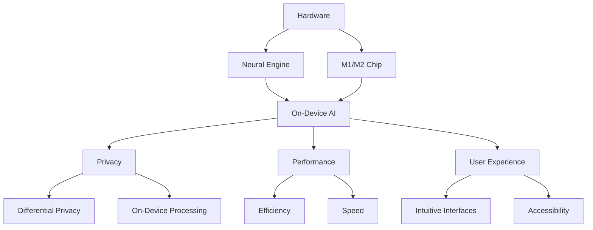

                 

**关键词：**AI应用、苹果、人工智能、深度学习、自然语言处理、计算机视觉、隐私保护、用户体验

## 1. 背景介绍

在当今的技术世界中，人工智能（AI）已经渗透到我们的日常生活中，从智能手机到智能家居，从自动驾驶汽车到医疗保健。作为全球科技巨头之一，苹果公司也在积极拥抱AI，并将其集成到其产品和服务中。 recent announcements from Apple have highlighted their commitment to AI, with a focus on privacy, performance, and user experience. This article will delve into the value of Apple's AI applications, exploring their core concepts, algorithms, mathematical models, and real-world applications.

## 2. 核心概念与联系

苹果的AI应用建立在其硬件和软件生态系统之上，提供了一个完整的解决方案。以下是苹果AI应用的核心概念和它们之间的联系：



### 2.1 硬件平台

苹果的AI应用建立在其强大的硬件平台之上，包括自主设计的M1和M2芯片，以及专门为AI任务优化的神经引擎（Neural Engine）。这些硬件组件为AI应用提供了高性能和低功耗的计算能力。

### 2.2 On-Device AI

苹果的AI应用大多在设备本地运行，这意味着AI模型和数据都存储在用户的设备上。这种本地处理的优势在于它可以提供更快的响应时间，更好的隐私保护，以及更少的数据使用。

### 2.3 隐私保护

苹果高度重视用户隐私，在其AI应用中采用了多种隐私保护措施，包括差分隐私（Differential Privacy）和本地处理。这些措施旨在保护用户数据，防止数据滥用和未经授权的访问。

### 2.4 性能和用户体验

苹果的AI应用旨在提供出色的性能和用户体验。通过优化AI模型的效率和速度，苹果可以提供快速、流畅的AI驱动功能，从而改善用户体验。此外，苹果还努力确保其AI应用具有直观的用户界面和出色的可访问性。

## 3. 核心算法原理 & 具体操作步骤

苹果的AI应用建立在各种AI算法之上，包括深度学习、自然语言处理（NLP）、计算机视觉等。以下是一些核心算法的原理和操作步骤：

### 3.1 算法原理概述

- **深度学习：**苹果的AI应用广泛使用深度神经网络，这些模型由多个相互连接的神经元组成，可以学习和表示复杂的数据模式。
- **自然语言处理：**苹果的NLP算法旨在理解、生成和翻译人类语言。这些算法使用统计模型和深度学习技术来分析文本数据。
- **计算机视觉：**苹果的计算机视觉算法旨在从视觉数据中提取信息。这些算法使用深度学习技术来识别物体、场景和人脸等。

### 3.2 算法步骤详解

以下是一些核心AI算法的操作步骤：

- **训练：**AI模型需要大量的数据来学习。在训练过程中，模型会调整其内部参数，以最小化预测误差。
- **推理：**一旦模型训练完成，它就可以用于新数据的预测。在推理过程中，模型会接受输入数据，并输出预测结果。
- **优化：**为了提高模型的性能，苹果会使用各种优化技术，如模型压缩、量化和剪枝，以减小模型的大小和计算开销。

### 3.3 算法优缺点

- **优点：**苹果的AI算法可以提供高精度的预测，并可以在设备本地运行，提供快速的响应时间和更好的隐私保护。
- **缺点：**AI模型需要大量的数据和计算资源来训练，这可能会导致模型过度拟合和泛化能力差。此外，AI模型可能会受到偏见和不平等的影响，从而导致不公平的结果。

### 3.4 算法应用领域

苹果的AI应用遍布其产品和服务的各个方面，包括：

- **照片：**AI驱动的照片应用，如人像模式、夜景模式和智能HDR，可以自动优化照片质量。
- **Siri：**苹果的虚拟助手Siri使用NLP技术来理解和响应用户的语音请求。
- **Face ID：**苹果的面部识别系统使用计算机视觉技术来识别用户的面部，并提供安全的解锁和支付功能。
- **Apple Watch：**Apple Watch使用AI来跟踪用户的活动、心率和其他生理指标，并提供个性化的健康建议。

## 4. 数学模型和公式 & 详细讲解 & 举例说明

苹果的AI应用建立在各种数学模型和公式之上。以下是一些关键数学模型的构建、推导过程和案例分析：

### 4.1 数学模型构建

- **线性回归：**线性回归是一种简单的回归模型，用于预测连续目标变量。其数学模型可以表示为：

  $$y = β_0 + β_1x + ε$$

  其中，$y$是目标变量，$x$是输入变量，$β_0$和$β_1$是模型参数，$ε$是误差项。

- **逻辑回归：**逻辑回归是一种分类模型，用于预测二进制目标变量。其数学模型可以表示为：

  $$P(y=1|x) = \sigma(β_0 + β_1x)$$

  其中，$P(y=1|x)$是目标变量为1的概率，$x$是输入变量，$β_0$和$β_1$是模型参数，$\sigma$是sigmoid函数。

### 4.2 公式推导过程

以下是线性回归模型参数推导过程的简化版本：

1. 给定数据集$(x_i, y_i)$，其中$i=1,2,...,n$。
2. 定义目标函数：

  $$J(β_0, β_1) = \frac{1}{2n}\sum_{i=1}^{n}(y_i - (β_0 + β_1x_i))^2$$

3. 使用梯度下降算法最小化目标函数：

  $$β_0 := β_0 - η\frac{1}{n}\sum_{i=1}^{n}(y_i - (β_0 + β_1x_i))$$

  $$β_1 := β_1 - η\frac{1}{n}\sum_{i=1}^{n}x_i(y_i - (β_0 + β_1x_i))$$

  其中，$η$是学习率。

### 4.3 案例分析与讲解

以下是线性回归模型在预测房价的案例分析：

假设我们有房屋面积（平方米）和房价（万美元）的数据集。我们可以使用线性回归模型来预测房价。通过训练模型，我们可以得到模型参数$β_0$和$β_1$。然后，我们可以使用这些参数来预测给定房屋面积的房价：

$$y = β_0 + β_1x$$

例如，如果$β_0 = -50$和$β_1 = 200$，则给定房屋面积为2000平方米的房屋，其预测房价为：

$$y = -50 + 200 \times 2000 = 395,000$$

## 5. 项目实践：代码实例和详细解释说明

以下是使用Python和Scikit-learn库实现线性回归模型的代码实例：

### 5.1 开发环境搭建

要运行以下代码，您需要安装Python和Scikit-learn库。您可以使用以下命令安装Scikit-learn：

```bash
pip install -U scikit-learn
```

### 5.2 源代码详细实现

以下是使用Scikit-learn库实现线性回归模型的代码：

```python
from sklearn.linear_model import LinearRegression
from sklearn.model_selection import train_test_split
from sklearn.metrics import mean_squared_error
import numpy as np
import pandas as pd

# 加载数据集
data = pd.read_csv('housing.csv')
X = data[['square_feet']]
y = data['price']

# 拆分数据集为训练集和测试集
X_train, X_test, y_train, y_test = train_test_split(X, y, test_size=0.2, random_state=42)

# 创建线性回归模型
model = LinearRegression()

# 训练模型
model.fit(X_train, y_train)

# 预测测试集
y_pred = model.predict(X_test)

# 评估模型
mse = mean_squared_error(y_test, y_pred)
print(f'Mean Squared Error: {mse}')
```

### 5.3 代码解读与分析

以下是代码的解读和分析：

- 我们首先导入必要的库和模块。
- 我们加载房屋面积和房价的数据集，并将其拆分为输入变量（房屋面积）和目标变量（房价）。
- 我们使用`train_test_split`函数将数据集拆分为训练集和测试集。
- 我们创建一个线性回归模型，并使用训练集训练模型。
- 我们使用训练好的模型预测测试集的房价。
- 我们使用均方误差（MSE）评估模型的性能。

### 5.4 运行结果展示

运行上述代码后，您应该会看到输出的均方误差（MSE）值。这个值表示模型预测的房价与实际房价之间的平均平方误差。较小的MSE值表示模型的预测更准确。

## 6. 实际应用场景

苹果的AI应用在其产品和服务的各个方面都有实际应用。以下是一些实际应用场景：

### 6.1 照片应用

苹果的照片应用使用AI来自动优化照片质量。例如，人像模式可以自动检测并模糊背景，夜景模式可以改善低光照条件下的照片质量，智能HDR可以自动调整曝光和对比度。

### 6.2 Siri

苹果的虚拟助手Siri使用NLP技术来理解和响应用户的语音请求。Siri可以执行各种任务，从设置提醒到播放音乐，从查找信息到发送消息。

### 6.3 Face ID

苹果的面部识别系统使用计算机视觉技术来识别用户的面部，并提供安全的解锁和支付功能。Face ID可以在各种光照条件下工作，并可以识别用户的面部，即使他们佩戴口罩或头盔也可以。

### 6.4 未来应用展望

随着AI技术的不断发展，苹果的AI应用也将不断扩展和改进。未来，我们可能会看到更多的AI驱动功能出现在苹果的产品和服务中，从增强现实（AR）到自动驾驶汽车，从医疗保健到环境监测。

## 7. 工具和资源推荐

以下是一些学习AI和开发AI应用的推荐工具和资源：

### 7.1 学习资源推荐

- **在线课程：** Coursera、Udacity、edX等平台提供了大量的AI在线课程。
- **书籍：** "深度学习"（Ian Goodfellow、Yoshua Bengio和Aaron Courville著）、"自然语言处理以Python为媒介"（Steven Bird、Ewan Klein和Edward Loper著）等书籍是AI领域的经典著作。
- **博客和论坛：** Towards Data Science、KDnuggets、Stack Overflow等博客和论坛提供了大量的AI技术文章和讨论。

### 7.2 开发工具推荐

- **开发环境：** Anaconda、PyCharm、Visual Studio Code等开发环境提供了AI开发所需的工具和库。
- **AI库和框架：** TensorFlow、PyTorch、Scikit-learn等AI库和框架提供了构建AI应用所需的工具。
- **云平台：** AWS、Google Cloud、Microsoft Azure等云平台提供了AI开发和部署所需的基础设施。

### 7.3 相关论文推荐

- **深度学习：** "ImageNet Classification with Deep Convolutional Neural Networks"（Krizhevsky、Sutskever和Hinton著）、"Generative Adversarial Networks"（Goodfellow、Perez和Courville著）等论文是深度学习领域的里程碑式著作。
- **自然语言处理：** "Attention Is All You Need"（Vaswani、Shazeer等著）、"BERT: Pre-training of Deep Bidirectional Transformers for Language Understanding"（Devlin、Chang和Lee著）等论文是NLP领域的里程碑式著作。
- **计算机视觉：** "R-CNN"（Girshick、Donahue和Darrell著）、"Faster R-CNN: Towards Real-Time Object Detection with Region Proposal Networks"（Ren、He和Girshick著）等论文是计算机视觉领域的里程碑式著作。

## 8. 总结：未来发展趋势与挑战

### 8.1 研究成果总结

苹果的AI应用在隐私保护、性能和用户体验方面取得了显著成就。通过在设备本地运行AI模型，苹果可以提供快速的响应时间和更好的隐私保护。此外，苹果还开发了各种AI驱动功能，从照片应用到Siri，从Face ID到Apple Watch。

### 8.2 未来发展趋势

随着AI技术的不断发展，苹果的AI应用也将不断扩展和改进。未来，我们可能会看到更多的AI驱动功能出现在苹果的产品和服务中，从增强现实（AR）到自动驾驶汽车，从医疗保健到环境监测。此外，AI模型的性能和效率也将继续提高，从而为用户提供更好的体验。

### 8.3 面临的挑战

虽然苹果的AI应用取得了显著成就，但它们也面临着各种挑战。其中包括：

- **隐私保护：**虽然苹果在隐私保护方面取得了显著成就，但仍然存在隐私泄露的风险。未来，苹果需要继续努力保护用户数据，防止数据滥用和未经授权的访问。
- **模型偏见：**AI模型可能会受到偏见和不平等的影响，从而导致不公平的结果。未来，苹果需要努力消除模型偏见，确保其AI应用公平和包容。
- **计算资源：**虽然苹果的硬件平台为AI应用提供了强大的计算能力，但仍然存在计算资源不足的风险。未来，苹果需要继续优化其AI模型，以提高其性能和效率。

### 8.4 研究展望

未来，苹果的AI研究将继续关注隐私保护、性能和用户体验。苹果将继续开发新的AI驱动功能，并改进其现有的AI应用。此外，苹果还将继续努力消除模型偏见，确保其AI应用公平和包容。最后，苹果将继续优化其AI模型，以提高其性能和效率。

## 9. 附录：常见问题与解答

以下是一些常见问题与解答：

**Q：苹果的AI应用是如何保护隐私的？**

A：苹果的AI应用大多在设备本地运行，这意味着AI模型和数据都存储在用户的设备上。这种本地处理的优势在于它可以提供更快的响应时间，更好的隐私保护，以及更少的数据使用。此外，苹果还采用了差分隐私（Differential Privacy）和其他隐私保护措施，以防止数据滥用和未经授权的访问。

**Q：苹果的AI应用是如何提供高性能的？**

A：苹果的AI应用建立在其强大的硬件平台之上，包括自主设计的M1和M2芯片，以及专门为AI任务优化的神经引擎（Neural Engine）。这些硬件组件为AI应用提供了高性能和低功耗的计算能力。此外，苹果还开发了各种优化技术，如模型压缩、量化和剪枝，以减小模型的大小和计算开销。

**Q：苹果的AI应用是如何提供出色的用户体验的？**

A：苹果的AI应用旨在提供出色的用户体验。通过优化AI模型的效率和速度，苹果可以提供快速、流畅的AI驱动功能，从而改善用户体验。此外，苹果还努力确保其AI应用具有直观的用户界面和出色的可访问性。

**Q：苹果的AI应用是如何应用于实际场景的？**

A：苹果的AI应用在其产品和服务的各个方面都有实际应用。例如，照片应用使用AI来自动优化照片质量，Siri使用NLP技术来理解和响应用户的语音请求，Face ID使用计算机视觉技术来识别用户的面部，Apple Watch使用AI来跟踪用户的活动和生理指标。

**Q：未来苹果的AI应用将如何发展？**

A：随着AI技术的不断发展，苹果的AI应用也将不断扩展和改进。未来，我们可能会看到更多的AI驱动功能出现在苹果的产品和服务中，从增强现实（AR）到自动驾驶汽车，从医疗保健到环境监测。此外，AI模型的性能和效率也将继续提高，从而为用户提供更好的体验。

## 作者：禅与计算机程序设计艺术 / Zen and the Art of Computer Programming

