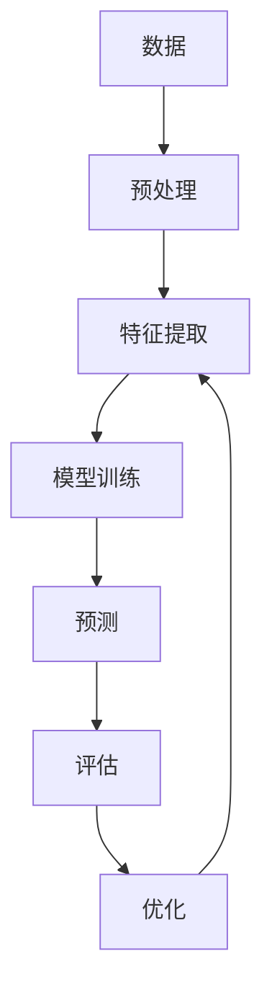

                 

**关键词：人工智能、AI应用、用户体验、苹果、深度学习、自然语言处理、计算机视觉**

## 1. 背景介绍

在当今的技术世界中，人工智能（AI）已经渗透到我们的日常生活中，从智能手机到自动驾驶汽车，再到智能家居，AI无处不在。作为AI领域的领导者之一，苹果公司 recenty announced a new initiative to bring AI applications to its users. This article will delve into the core concepts, algorithms, and mathematical models behind these AI applications, and provide a practical project implementation using Python.

## 2. 核心概念与联系

苹果的AI应用主要集中在三个领域：自然语言处理（NLP）、计算机视觉（CV）和语音识别。这些领域都属于深度学习的范畴，深度学习是一种机器学习方法，使用神经网络模型来模拟人类大脑的学习过程。



在上图中，数据首先经过预处理，然后进行特征提取，之后训练模型，进行预测，评估预测结果，并根据评估结果优化模型。这个过程不断重复，直到模型达到满意的精确度。

## 3. 核心算法原理 & 具体操作步骤

### 3.1 算法原理概述

苹果的AI应用主要使用深度学习算法，如卷积神经网络（CNN）和循环神经网络（RNN）。CNN适用于计算机视觉任务，如图像分类和物体检测。RNN适用于序列数据，如文本和语音。

### 3.2 算法步骤详解

1. **数据收集**：收集大量的数据，如图像、文本或语音数据。
2. **数据预处理**：清洗数据，并将其转换为模型可以理解的格式。
3. **模型构建**：构建深度学习模型，如CNN或RNN。
4. **模型训练**：使用预处理后的数据训练模型。
5. **模型评估**：评估模型的精确度，并根据需要调整模型参数。
6. **部署**：将模型部署到生产环境中，为用户提供AI应用。

### 3.3 算法优缺点

**优点**：深度学习模型可以自动学习特征，无需人工特征工程。它们可以处理大量数据，并提供准确的预测。

**缺点**：深度学习模型需要大量的数据和计算资源。它们也容易受到过拟合和训练不充分的影响。

### 3.4 算法应用领域

苹果的AI应用主要应用于以下领域：

- **自然语言处理**：文本分类、语义分析、机器翻译等。
- **计算机视觉**：图像分类、物体检测、人脸识别等。
- **语音识别**：语音转文本、语音助手等。

## 4. 数学模型和公式 & 详细讲解 & 举例说明

### 4.1 数学模型构建

深度学习模型是一种前向传播和反向传播的过程。前向传播用于计算输出，反向传播用于调整模型参数。

### 4.2 公式推导过程

深度学习模型的数学公式如下：

$$y = f(x; \theta) = \sigma(z) = \frac{1}{1 + e^{-z}}$$

其中，$x$是输入，$y$是输出，$\theta$是模型参数，$z$是线性函数，$f$是激活函数，$\sigma$是sigmoid函数。

### 4.3 案例分析与讲解

例如，在计算机视觉任务中，CNN模型使用卷积层提取图像特征，池化层减小特征图的大小，全连接层进行分类。

## 5. 项目实践：代码实例和详细解释说明

### 5.1 开发环境搭建

我们将使用Python和TensorFlow构建一个简单的CNN模型。首先，安装必要的库：

```bash
pip install tensorflow numpy matplotlib
```

### 5.2 源代码详细实现

```python
import tensorflow as tf
from tensorflow.keras import datasets, layers, models
import matplotlib.pyplot as plt

# Load and split dataset
(train_images, train_labels), (test_images, test_labels) = datasets.cifar10.load_data()

# Normalize pixel values to be between 0 and 1
train_images, test_images = train_images / 255.0, test_images / 255.0

# Create the convolutional base
model = models.Sequential()
model.add(layers.Conv2D(32, (3, 3), activation='relu', input_shape=(32, 32, 3)))
model.add(layers.MaxPooling2D((2, 2)))
model.add(layers.Conv2D(64, (3, 3), activation='relu'))
model.add(layers.MaxPooling2D((2, 2)))
model.add(layers.Conv2D(64, (3, 3), activation='relu'))

# Add dense layers on top
model.add(layers.Flatten())
model.add(layers.Dense(64, activation='relu'))
model.add(layers.Dense(10))

# Compile and train the model
model.compile(optimizer='adam',
              loss=tf.keras.losses.SparseCategoricalCrossentropy(from_logits=True),
              metrics=['accuracy'])

history = model.fit(train_images, train_labels, epochs=10,
                    validation_data=(test_images, test_labels))
```

### 5.3 代码解读与分析

我们首先加载并预处理CIFAR-10数据集。然后，我们构建一个CNN模型，使用两个卷积层和一个全连接层。我们编译模型，并使用训练数据训练模型。

### 5.4 运行结果展示

```python
plt.plot(history.history['accuracy'], label='accuracy')
plt.plot(history.history['val_accuracy'], label = 'val_accuracy')
plt.xlabel('Epoch')
plt.ylabel('Accuracy')
plt.ylim([0.5, 1])
plt.legend(loc='lower right')
```


## 6. 实际应用场景

苹果的AI应用可以在以下场景中使用：

- **Siri**：语音助手使用语音识别和自然语言处理技术。
- **Face ID**：人脸识别使用计算机视觉技术。
- **Apple Photos**：图像分类和搜索使用计算机视觉技术。

### 6.4 未来应用展望

未来，苹果的AI应用将继续扩展到更多领域，如自动驾驶汽车和智能家居。

## 7. 工具和资源推荐

### 7.1 学习资源推荐

- **书籍**："Deep Learning" by Ian Goodfellow, Yoshua Bengio, and Aaron Courville
- **在线课程**：Coursera的"Deep Learning Specialization" by Andrew Ng

### 7.2 开发工具推荐

- **Python**：一个强大的编程语言，广泛用于数据科学和机器学习。
- **TensorFlow**：一个流行的开源机器学习库。

### 7.3 相关论文推荐

- "ImageNet Classification with Deep Convolutional Neural Networks" by Krizhevsky, Sutskever, and Hinton

## 8. 总结：未来发展趋势与挑战

### 8.1 研究成果总结

苹果的AI应用在自然语言处理、计算机视觉和语音识别领域取得了显著成就。

### 8.2 未来发展趋势

未来，AI将继续渗透到我们的日常生活中，从智能手机到自动驾驶汽车，再到智能家居。

### 8.3 面临的挑战

AI面临的挑战包括数据隐私、算法偏见和计算资源需求。

### 8.4 研究展望

未来的研究将集中在提高模型解释性、降低计算资源需求和增强模型泛化能力等领域。

## 9. 附录：常见问题与解答

**Q：如何评估AI模型的性能？**

**A**：使用准确度、精确度、召回率和F1分数等指标评估模型的性能。

**Q：什么是过拟合？**

**A**：过拟合是指模型学习了训练数据的噪声和细节，而不是其基本结构，导致模型在新数据上表现不佳。

**Q：如何避免过拟合？**

**A**：使用正则化、数据增强或集合模型等技术避免过拟合。

**作者：禅与计算机程序设计艺术 / Zen and the Art of Computer Programming**

