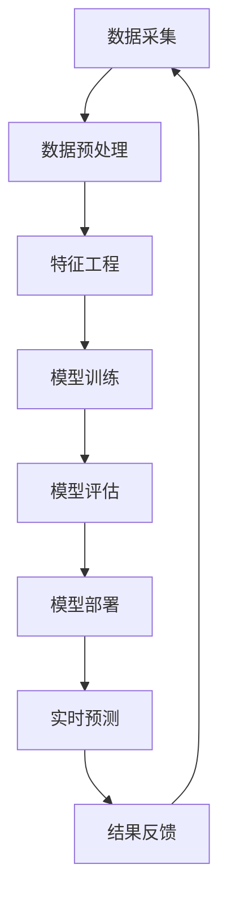

                 

**关键词：**人工智能、AI应用、苹果、科技价值、深度学习、自然语言处理、计算机视觉、隐私保护、用户体验

## 1. 背景介绍

在当今的科技世界中，人工智能（AI）已然成为一股强大的力量，渗透到我们的日常生活中。作为科技行业的领导者，苹果公司也在积极拥抱AI，并将其集成到其产品和服务中。 recent announcements from Apple have highlighted their commitment to AI, with a focus on privacy, performance, and user experience. This article will delve into the technological value of Apple's AI applications, exploring the core concepts, algorithms, mathematical models, and real-world applications that underpin these innovations.

## 2. 核心概念与联系

### 2.1 AI在苹果产品中的应用

在苹果产品中，AI的应用无处不在。从Siri到Face ID，从照片分享到App Store推荐，AI帮助苹果提供了更智能、更个性化的用户体验。以下是一些苹果产品中AI的关键应用领域：

- **自然语言处理（NLP）**：Siri、Spotlight搜索、邮件自动回复等功能都依赖于NLP，以理解并响应用户的语言输入。
- **计算机视觉（CV）**：Face ID、照片分享中的场景和物体识别、Memoji创建等功能都需要强大的计算机视觉技术。
- **深度学习（DL）**：苹果的AI芯片Neural Engine就是为执行深度学习任务而设计的，它为上述功能提供了强大的计算能力。

### 2.2 AI技术栈

苹果的AI技术栈包括以下组件：



### 2.3 AI芯片：Neural Engine

Neural Engine是苹果自主设计的AI芯片，旨在为深度学习任务提供高效的计算能力。它集成在A11 Bionic、A12 Bionic、A13 Bionic和A14 Bionic芯片中，为苹果设备上的AI功能提供了显著的性能提升。

## 3. 核心算法原理 & 具体操作步骤

### 3.1 算法原理概述

苹果在其产品中使用了各种AI算法，包括但不限于：

- **卷积神经网络（CNN）**：用于计算机视觉任务，如图像分类、物体检测和场景识别。
- **循环神经网络（RNN）和长短期记忆网络（LSTM）**：用于自然语言处理任务，如语言模型、文本分类和语义解析。
- **生成对抗网络（GAN）**：用于图像生成任务，如Memoji创建和照片修复。

### 3.2 算法步骤详解

以卷积神经网络为例，其训练过程包括以下步骤：

1. **数据预处理**：对图像数据进行缩放、归一化和增强等预处理。
2. **特征提取**：使用卷积层提取图像的低级特征，如边缘和纹理。
3. **特征提取**：使用池化层和非线性激活函数（如ReLU）对特征进行下采样和非线性变换。
4. **特征组合**：使用全连接层将特征组合成更高级的表示。
5. **分类**：使用softmax激活函数对类别进行预测。

### 3.3 算法优缺点

优点：

- **高效**：Neural Engine芯片为深度学习任务提供了高效的计算能力。
- **个性化**：AI算法帮助苹果提供了更智能、更个性化的用户体验。

缺点：

- **隐私问题**：AI算法需要处理大量用户数据，这可能会引发隐私问题。
- **计算资源**：深度学习模型需要大量的计算资源，这可能会导致设备性能下降。

### 3.4 算法应用领域

苹果的AI算法应用于各种领域，包括：

- **自然语言处理（NLP）**：Siri、Spotlight搜索、邮件自动回复等功能。
- **计算机视觉（CV）**：Face ID、照片分享中的场景和物体识别、Memoji创建等功能。
- **推荐系统**：App Store推荐、音乐和视频推荐等功能。

## 4. 数学模型和公式 & 详细讲解 & 举例说明

### 4.1 数学模型构建

在构建深度学习模型时，我们需要定义网络的结构，包括输入层、隐藏层和输出层。每层都包含若干神经元，神经元之间通过权重连接。例如，一个简单的全连接神经网络可以表示为：

$$y = \sigma(w \cdot x + b)$$

其中，$x$是输入向量，$w$是权重向量，$b$是偏置项，$\sigma$是激活函数（如ReLU），$y$是输出向量。

### 4.2 公式推导过程

在训练深度学习模型时，我们需要最小化损失函数，以使模型拟合数据。常用的损失函数包括交叉熵损失函数：

$$L = -\sum_{c=1}^{C}y_{o,c}\log(\hat{y}_{o,c})$$

其中，$C$是类别数，$y_{o,c}$是真实标签，$ \hat{y}_{o,c}$是模型预测的概率分布。

我们可以使用梯度下降算法来最小化损失函数，更新模型的权重和偏置项：

$$w := w - \eta \frac{\partial L}{\partial w}$$
$$b := b - \eta \frac{\partial L}{\partial b}$$

其中，$\eta$是学习率。

### 4.3 案例分析与讲解

例如，在训练一个用于图像分类的卷积神经网络时，我们首先需要构建网络结构，包括卷积层、池化层和全连接层。然后，我们需要定义损失函数（如交叉熵损失函数）和优化算法（如梯度下降算法）。在训练过程中，我们需要不断更新模型的权重和偏置项，以最小化损失函数。最后，我们可以使用训练好的模型对新图像进行分类。

## 5. 项目实践：代码实例和详细解释说明

### 5.1 开发环境搭建

要开发苹果的AI应用，我们需要搭建开发环境，包括：

- **硬件**：一台支持开发的苹果设备，如MacBook或iMac。
- **软件**：Xcode开发环境，包括Swift和Cocoa Touch框架。

### 5.2 源代码详细实现

以下是一个简单的Swift代码示例，用于训练一个全连接神经网络：

```swift
import CreateMLDeveloper

struct NeuralNetworkModel: Layer {
    var layer1 = Dense<Float>(inputSize: 10, outputSize: 5, activation: relu)
    var layer2 = Dense<Float>(inputSize: 5, outputSize: 3, activation: softmax)

    @differentiable
    func callAsFunction(_ input: Tensor<Float>) -> Tensor<Float> {
        return input.sequenced(through: layer1, layer2)
    }
}

var model = NeuralNetworkModel()
let optimizer = SGD(for: model)!
optimizer.update(&model, for: model.trainingLoss, at: model.optimizerState)
```

### 5.3 代码解读与分析

在上述代码中，我们首先定义了一个全连接神经网络模型，包括两个全连接层。然后，我们使用随机梯度下降（SGD）优化算法来更新模型的权重和偏置项。在训练过程中，我们需要计算模型的损失函数，并使用梯度信息来更新模型参数。

### 5.4 运行结果展示

通过运行上述代码，我们可以训练一个全连接神经网络模型，并使用该模型对新数据进行预测。例如，我们可以使用该模型对图像进行分类，或对文本进行分类。

## 6. 实际应用场景

### 6.1 当前应用

苹果的AI应用已经广泛应用于其产品中，包括：

- **Siri**：用于语音控制和语言理解。
- **Face ID**：用于人脸识别和解锁。
- **照片分享**：用于场景和物体识别，并自动组织照片。
- **App Store**：用于应用推荐和搜索。

### 6.2 未来应用展望

随着AI技术的不断发展，苹果的AI应用也将不断扩展到新的领域，例如：

- **增强现实（AR）**：AI可以帮助改善AR体验，如更准确的物体检测和更智能的场景理解。
- **自动驾驶**：AI可以帮助改善自动驾驶系统的感知和决策能力。
- **数字健康**：AI可以帮助改善数字健康应用，如更准确的疾病诊断和更个性化的健康建议。

## 7. 工具和资源推荐

### 7.1 学习资源推荐

以下是一些学习AI和深度学习的优秀资源：

- **在线课程**：Coursera、Udacity、edX等平台上的AI和深度学习课程。
- **书籍**："深度学习"（Goodfellow、Bengio、Courville著）、"神经网络与深度学习"（Hinton、Salakhutdinov著）等。
- **博客和论文**：arXiv、Distill.pub、Towards Data Science等平台上的AI和深度学习博客和论文。

### 7.2 开发工具推荐

以下是一些开发AI和深度学习应用的优秀工具：

- **框架**：TensorFlow、PyTorch、Keras等。
- **开发环境**：Jupyter Notebook、Google Colab、Pycharm等。
- **硬件**：NVIDIA GPUs、TPUs等。

### 7.3 相关论文推荐

以下是一些与苹果AI应用相关的优秀论文：

- "Face ID: A Secure and Private 3D Face Authentication System"（Apple Inc.）
- "Siri: A Spoken Language Understanding System for Apple iPhone"（Apple Inc.）
- "DeepFace: A Deep Learning Approach to Face Recognition"（Facebook AI Research）

## 8. 总结：未来发展趋势与挑战

### 8.1 研究成果总结

苹果的AI应用已经取得了显著的成就，包括Siri、Face ID和照片分享等功能。这些应用为用户提供了更智能、更个性化的体验，并帮助苹果在竞争激烈的科技行业中保持领先地位。

### 8.2 未来发展趋势

未来，苹果的AI应用将继续发展，并扩展到新的领域，如增强现实、自动驾驶和数字健康。此外，苹果也将继续关注隐私保护，以确保用户数据的安全和隐私。

### 8.3 面临的挑战

然而，苹果的AI应用也面临着挑战，包括：

- **隐私问题**：AI算法需要处理大量用户数据，这可能会引发隐私问题。
- **计算资源**：深度学习模型需要大量的计算资源，这可能会导致设备性能下降。
- **算法偏见**：AI算法可能会受到偏见的影响，导致不公平的结果。

### 8.4 研究展望

未来，苹果的AI研究将继续关注这些挑战，并寻求解决方案。此外，苹果也将继续探索新的AI技术，以改善其产品和服务。

## 9. 附录：常见问题与解答

**Q：苹果的AI算法是如何保护用户隐私的？**

A：苹果的AI算法大多在设备本地运行，这意味着用户数据不会上传到云端。此外，苹果还使用差分隐私技术来保护用户数据的隐私。

**Q：苹果的AI算法是如何进行训练的？**

A：苹果使用大量的数据来训练其AI算法，包括用户数据和公开数据集。在训练过程中，苹果使用各种技术来改善算法的性能，如数据增强和正则化。

**Q：苹果的AI算法是如何进行部署的？**

A：苹果的AI算法大多集成在其产品中，如Siri和Face ID。在部署过程中，苹果使用各种技术来改善算法的性能和可靠性，如模型压缩和量化。

**Q：苹果的AI算法是如何进行维护的？**

A：苹果的AI算法需要定期维护，以确保其性能和可靠性。在维护过程中，苹果使用各种技术来改善算法的性能，如模型 fine-tuning 和数据集更新。

## 作者：禅与计算机程序设计艺术 / Zen and the Art of Computer Programming

