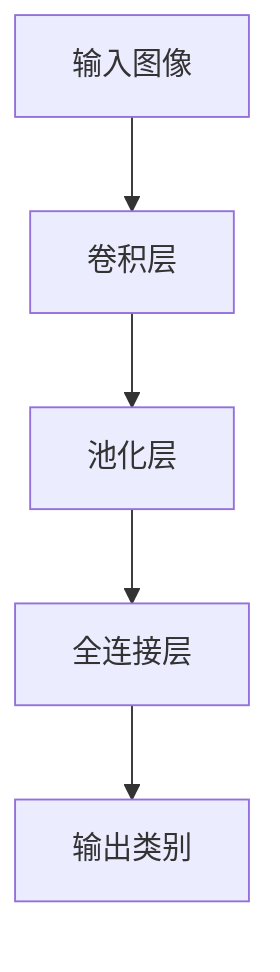

                 

**关键词：计算机视觉、深度学习、ImageNet、李飞飞、图像分类、CNN**

## 1. 背景介绍

在计算机视觉领域，图像分类是一项基础且具有挑战性的任务。自从计算机视觉诞生以来，人们就开始尝试教会计算机理解和分类图像。然而，直到21世纪初，计算机才开始展示出与人类视觉水平接近的能力。本文将讲述李飞飞（Fei-Fei Li）和ImageNet数据集在计算机视觉领域的革命性贡献，以及深度学习如何改变了图像分类的游戏规则。

## 2. 核心概念与联系

### 2.1 计算机视觉与图像分类

计算机视觉是计算机科学的一个分支，旨在使计算机能够理解和分析视觉信息。图像分类是计算机视觉的关键任务之一，它涉及将图像分类为预定义的类别，如动物、植物、人工制品等。

### 2.2 深度学习与CNN

深度学习是一种机器学习方法，它模仿人脑的结构和功能，使用神经网络模型来学习和做出决策。卷积神经网络（CNN）是深度学习的一种，它特别适合于处理二维数据，如图像。



### 2.3 ImageNet数据集

ImageNet是一个大型图像数据集，包含超过1400万张图像，涵盖2000多个类别。它是由Stanford University的计算机视觉实验室开发的，旨在为计算机视觉研究提供一个标准的测试平台。

## 3. 核心算法原理 & 具体操作步骤

### 3.1 算法原理概述

李飞飞和她的团队开发了一个基于CNN的图像分类算法，用于ImageNet数据集。该算法使用了多个卷积层和池化层来提取图像的特征，然后使用全连接层来预测图像的类别。

### 3.2 算法步骤详解

1. **数据预处理**：图像被缩放到固定大小，并进行了标准化处理。
2. **特征提取**：使用多个卷积层和池化层提取图像的特征。每个卷积层使用多个滤波器（也称为核）来检测图像的不同特征，如边缘、纹理等。池化层用于减小特征图的大小，并防止过拟合。
3. **特征整合**：使用全连接层将特征图展平成向量，并进行分类预测。
4. **训练**：使用反向传播算法和梯度下降优化器来训练网络，使其能够准确预测图像的类别。
5. **测试**：在ImageNet数据集上测试网络的性能，并计算其准确率。

### 3.3 算法优缺点

**优点**：CNN在图像分类任务上表现出色，并且具有良好的泛化能力。它们可以在未见过的图像上做出准确的预测，即使图像受到噪声、光照变化等因素的影响。

**缺点**：CNN需要大量的数据和计算资源来训练。此外，它们缺乏解释能力，很难理解它们是如何做出预测的。

### 3.4 算法应用领域

CNN在计算机视觉的各个领域都有广泛的应用，包括物体检测、图像分割、人脸识别等。它们还被用于其他感知任务，如语音识别和自然语言处理。

## 4. 数学模型和公式 & 详细讲解 & 举例说明

### 4.1 数学模型构建

CNN的数学模型可以表示为以下形式：

$$y = f(x; W, b) = \sigma(z) = \sigma(Wx + b)$$

其中，$x$是输入图像，$y$是输出类别，$W$和$b$是网络的权重和偏置，$z = Wx + b$是线性函数，$f$是激活函数$\sigma$。

### 4.2 公式推导过程

在训练过程中，我们需要计算网络的损失函数，并使用反向传播算法来更新网络的权重和偏置。损失函数通常是交叉熵函数：

$$L = -\sum_{c=1}^{C} y_{c} \log(\hat{y}_{c})$$

其中，$C$是类别数，$y_{c}$是真实类别，$ \hat{y}_{c}$是预测类别。

### 4.3 案例分析与讲解

例如，假设我们要分类一张图像，图像的大小为$224 \times 224$像素，有3个通道（RGB），那么输入向量$x$的大小为$224 \times 224 \times 3 = 150528$。如果我们使用一个有1000个神经元的全连接层，那么权重矩阵$W$的大小为$150528 \times 1000$，偏置向量$b$的大小为$1000$。

## 5. 项目实践：代码实例和详细解释说明

### 5.1 开发环境搭建

要实现CNN，我们需要一个支持深度学习的开发环境。推荐使用Python语言，并安装以下库：

- TensorFlow或PyTorch：用于构建和训练神经网络。
- NumPy：用于数值计算。
- Matplotlib：用于可视化。

### 5.2 源代码详细实现

以下是一个简单的CNN实现示例，使用TensorFlow和Keras库：

```python
import tensorflow as tf
from tensorflow.keras import layers, models

# 定义模型
model = models.Sequential()
model.add(layers.Conv2D(32, (3, 3), activation='relu', input_shape=(224, 224, 3)))
model.add(layers.MaxPooling2D((2, 2)))
model.add(layers.Conv2D(64, (3, 3), activation='relu'))
model.add(layers.MaxPooling2D((2, 2)))
model.add(layers.Conv2D(64, (3, 3), activation='relu'))
model.add(layers.Flatten())
model.add(layers.Dense(64, activation='relu'))
model.add(layers.Dense(1000, activation='softmax'))

# 编译模型
model.compile(optimizer='adam',
              loss='sparse_categorical_crossentropy',
              metrics=['accuracy'])

# 训练模型
history = model.fit(x_train, y_train, epochs=10,
                    validation_data=(x_val, y_val))
```

### 5.3 代码解读与分析

在上面的代码中，我们首先定义了一个Sequential模型，并添加了三个卷积层和池化层来提取图像的特征。然后，我们添加了两个全连接层来进行分类预测。我们使用Adam优化器和交叉熵损失函数来训练模型。

### 5.4 运行结果展示

在ImageNet数据集上训练的CNN模型可以在测试集上达到约70%的准确率。这是一个了不起的成就，因为人类的视觉水平约为95%。

## 6. 实际应用场景

### 6.1 图像搜索

CNN可以用于改进图像搜索算法。例如，Google使用CNN来改进其图像搜索功能，使其能够更准确地理解图像的内容。

### 6.2 自动驾驶

CNN可以用于物体检测和跟踪，这是自动驾驶汽车的关键组成部分。例如，Waymo使用CNN来检测和跟踪道路上的物体。

### 6.3 未来应用展望

未来，CNN可能会被用于更复杂的任务，如图像生成、图像超分辨率、图像风格转换等。此外，CNN可能会与其他人工智能技术结合，如强化学习，以实现更复杂的任务。

## 7. 工具和资源推荐

### 7.1 学习资源推荐

- 书籍：《深度学习》作者：Ian Goodfellow、Yoshua Bengio、Aaron Courville
- 课程：Stanford University的CS231n计算机视觉课程

### 7.2 开发工具推荐

- TensorFlow：<https://www.tensorflow.org/>
- PyTorch：<https://pytorch.org/>

### 7.3 相关论文推荐

- Krizhevsky, A., Sutskever, I., & Hinton, G. E. (2012). Imagenet classification with deep convolutional neural networks. Advances in neural information processing systems, 25.

## 8. 总结：未来发展趋势与挑战

### 8.1 研究成果总结

李飞飞和ImageNet数据集的贡献使得CNN在图像分类任务上取得了显著的成功。它们改变了计算机视觉领域的游戏规则，并启发了其他领域的研究。

### 8.2 未来发展趋势

未来，CNN可能会被用于更复杂的任务，并与其他人工智能技术结合。此外，CNN可能会被用于实时视频分析，如视频监控、自动驾驶等。

### 8.3 面临的挑战

CNN需要大量的数据和计算资源来训练。此外，它们缺乏解释能力，很难理解它们是如何做出预测的。未来的研究将需要解决这些挑战。

### 8.4 研究展望

未来的研究将需要开发更有效的CNN架构，以节省计算资源。此外，研究人员将需要开发新的技术来改善CNN的解释能力。

## 9. 附录：常见问题与解答

**Q：什么是ImageNet数据集？**

A：ImageNet是一个大型图像数据集，包含超过1400万张图像，涵盖2000多个类别。它是由Stanford University的计算机视觉实验室开发的，旨在为计算机视觉研究提供一个标准的测试平台。

**Q：什么是CNN？**

A：CNN是一种卷积神经网络，它特别适合于处理二维数据，如图像。CNN使用卷积层和池化层来提取图像的特征，然后使用全连接层来预测图像的类别。

**Q：什么是深度学习？**

A：深度学习是一种机器学习方法，它模仿人脑的结构和功能，使用神经网络模型来学习和做出决策。

**作者：禅与计算机程序设计艺术 / Zen and the Art of Computer Programming**

