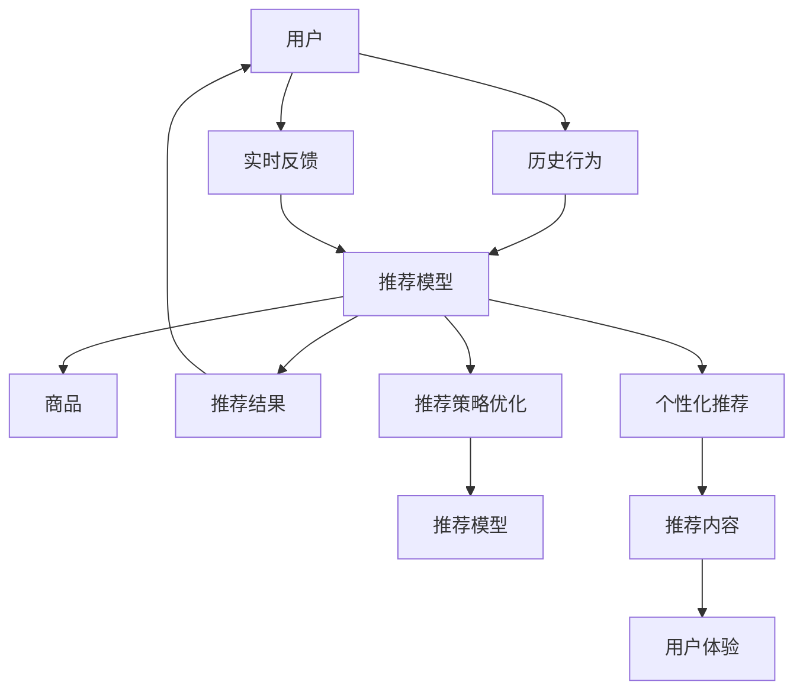

                 

# 电商平台中的跨境商品推荐策略优化

## 1. 背景介绍

随着全球电商市场的快速扩张，跨境电商日益成为平台的重要业务板块。根据eMarketer的报告，全球跨境电商市场预计在2023年将达到5830亿美元，其中中国、美国、日本和德国等是主要的市场。在这个背景下，如何高效地推荐跨境商品给不同地区和用户，成为电商平台亟待解决的关键问题。

### 1.1 问题由来

跨境电商商品推荐面临诸多挑战：

- **多语言、多文化差异**：不同国家和地区对商品的需求和偏好差异较大，需要定制化的推荐策略。
- **多渠道、多场景消费**：用户可能在不同的平台、设备、时区等环境下进行购物，推荐需要适应不同的场景。
- **长尾需求、个性化匹配**：用户对长尾商品的搜索和购买意愿较低，推荐系统需精确匹配用户的个性化需求。

这些问题要求推荐系统具有高度的灵活性和适应性，传统的基于内容的推荐和协同过滤方法难以满足需求。近年来，深度学习和大规模语言模型在电商平台推荐中的应用，提供了一种新的解决方案。

## 2. 核心概念与联系

### 2.1 核心概念概述

为理解跨境商品推荐策略，本节首先介绍一些核心概念：

- **推荐系统(Recommendation System)**：根据用户的历史行为或物品属性，推荐可能符合用户兴趣的商品。
- **深度学习(Depth Learning)**：通过构建神经网络模型，自动学习输入数据中隐含的规律和特征，实现端到端的学习和推理。
- **语言模型(Language Model)**：通过学习大量文本数据，捕捉语言的统计规律，能够对文本进行生成、分类、推理等任务。
- **迁移学习(Transfer Learning)**：将一个领域学习到的知识迁移到另一个相关领域，提升模型在新领域的泛化能力。
- **大语言模型(Large Language Model, LLM)**：具有大规模参数量和复杂结构的语言模型，通过预训练和微调过程获得强大的语言理解能力。
- **跨领域推荐(Cross-domain Recommendation)**：在不同类型的推荐系统之间进行知识迁移，提升推荐系统的跨领域泛化能力。
- **交互式推荐(Interactive Recommendation)**：基于用户实时反馈，动态调整推荐策略，提高推荐效果。

### 2.2 核心概念原理和架构的 Mermaid 流程图



这个流程图展示了推荐系统的核心流程和组件，即：

1. 用户历史行为通过推荐模型计算得到推荐结果。
2. 实时反馈信息更新推荐模型，动态调整推荐策略。
3. 推荐结果通过个性化推荐算法生成推荐内容，优化用户体验。

## 3. 核心算法原理 & 具体操作步骤

### 3.1 算法原理概述

跨境商品推荐系统通过深度学习和大语言模型，实现对用户行为和商品特征的建模，生成个性化推荐。其核心算法包括基于协同过滤、内容推荐的混合方法，以及基于预训练语言模型的推荐方法。

**基于协同过滤的推荐方法**：通过分析用户历史行为和物品属性之间的关联，构建用户-物品矩阵，利用矩阵分解等技术推荐相似物品。协同过滤方法适用于用户有大量行为数据，但物品特征难以获取的场景。

**基于内容的推荐方法**：利用商品标题、描述、属性等文本信息，使用TF-IDF、词嵌入等技术提取特征，计算用户与商品之间的相似度，推荐相似商品。内容推荐适用于物品特征丰富，但用户行为数据较少的场景。

**基于大语言模型的推荐方法**：利用预训练语言模型，对用户描述、商品描述等文本进行编码，计算文本间的相似度，推荐相关商品。预训练语言模型能够捕捉到更深层次的语言特征，提升推荐精度。

### 3.2 算法步骤详解

**Step 1: 数据预处理**
- 收集用户历史行为数据，如浏览记录、购买记录等，生成用户行为序列。
- 获取商品属性和描述文本，利用分词器进行文本处理，提取特征向量。
- 利用TF-IDF、词嵌入等技术对用户行为序列和商品特征向量进行编码。

**Step 2: 构建推荐模型**
- 选择推荐算法，如协同过滤、内容推荐、混合推荐等。
- 使用深度学习模型对用户行为和商品特征进行建模。
- 利用预训练语言模型对用户描述和商品描述进行编码，提取语义特征。

**Step 3: 特征融合与推荐计算**
- 将用户行为特征、商品特征和语义特征进行融合，得到推荐分数。
- 利用排序算法（如TopK、基线排序等），从推荐分数中筛选出候选商品。
- 利用模型评估指标（如点击率、转化率等），评估推荐效果。

**Step 4: 模型评估与优化**
- 使用交叉验证、A/B测试等方法，评估推荐模型的效果。
- 根据评估结果，调整模型参数和算法，优化推荐效果。
- 利用在线学习、增量学习等技术，实时更新推荐模型。

**Step 5: 部署与反馈**
- 将训练好的推荐模型部署到电商平台上，进行实时推荐。
- 收集用户实时反馈，如点击、购买等行为，更新推荐模型。
- 利用反馈数据，动态调整推荐策略，提高推荐效果。

### 3.3 算法优缺点

**基于协同过滤的推荐方法**
- 优点：数据需求量少，简单易用。适用于用户行为数据丰富的场景。
- 缺点：难以捕捉用户多方面的兴趣，推荐结果容易出现偏差。

**基于内容的推荐方法**
- 优点：对物品特征有较强的依赖，推荐结果精准度较高。适用于商品属性丰富的场景。
- 缺点：对用户行为数据的要求较高，推荐结果与用户历史行为关联性较强。

**基于大语言模型的推荐方法**
- 优点：能够捕捉更深层面的语义特征，推荐结果更全面。适用于用户描述和商品描述丰富的场景。
- 缺点：计算复杂度较高，对计算资源要求较高。

## 4. 数学模型和公式 & 详细讲解 & 举例说明

### 4.1 数学模型构建

推荐系统的核心数学模型通常由以下几部分构成：

- **用户行为模型**：表示用户对商品的兴趣和评价。
- **商品特征模型**：表示商品的属性和描述。
- **推荐模型**：根据用户行为和商品特征，预测用户对不同商品的兴趣。

这里以基于内容的推荐模型为例，构建推荐系统数学模型。

### 4.2 公式推导过程

设用户行为序列为 $U=\{u_1,u_2,\dots,u_n\}$，商品特征向量为 $I=\{i_1,i_2,\dots,i_m\}$。设用户 $u_k$ 对商品 $i_j$ 的兴趣表示为 $I_{kj}$，用户 $u_k$ 对商品 $i_j$ 的评分表示为 $R_{kj}$。

设用户 $u_k$ 的兴趣表示为 $\overrightarrow{u}_k$，商品 $i_j$ 的特征向量表示为 $\overrightarrow{i}_j$，用户行为与商品特征的内积表示为 $\overrightarrow{u}_k \cdot \overrightarrow{i}_j$。推荐模型可以表示为：

$$
\hat{R}_{kj} = f(\overrightarrow{u}_k \cdot \overrightarrow{i}_j)
$$

其中 $f$ 为推荐模型，通常为线性函数或非线性函数。对于线性函数，有：

$$
\hat{R}_{kj} = \alpha \overrightarrow{u}_k \cdot \overrightarrow{i}_j + \beta
$$

其中 $\alpha$ 为兴趣系数，$\beta$ 为常数项。对于非线性函数，可以采用决策树、神经网络等模型。

### 4.3 案例分析与讲解

以一家跨境电商平台为例，分析推荐系统的构建和优化过程。

设该平台的用户行为数据为 $U$，商品特征数据为 $I$。用户行为数据通过点击、浏览、购买等行为编码为向量 $\overrightarrow{u}$，商品特征数据通过商品描述和属性编码为向量 $\overrightarrow{i}$。

构建推荐模型时，可以采用基于内容的推荐方法，利用BERT等预训练语言模型对用户描述和商品描述进行编码，得到语义特征向量。用户行为向量与商品特征向量进行内积运算，得到推荐分数。

假设模型训练后，得到用户 $u_k$ 对商品 $i_j$ 的推荐分数为 $\hat{R}_{kj}$。通过 TopK 排序算法，从所有商品中筛选出TopK个候选商品。用户选择商品后，系统记录点击和购买行为，更新用户行为数据和商品特征数据，进行模型微调。

## 5. 项目实践：代码实例和详细解释说明

### 5.1 开发环境搭建

为了实现推荐系统的优化，我们首先搭建开发环境。

**环境安装**：
1. 安装Python：
```bash
sudo apt-get update
sudo apt-get install python3-pip
```

2. 安装相关库：
```bash
pip install torch torchvision scikit-learn pandas numpy tqdm
```

3. 安装BERT模型：
```bash
pip install transformers
```

### 5.2 源代码详细实现

以下是使用BERT进行跨境商品推荐的PyTorch代码实现：

```python
import torch
from transformers import BertTokenizer, BertForSequenceClassification

# 加载预训练模型和分词器
model = BertForSequenceClassification.from_pretrained('bert-base-cased', num_labels=2)
tokenizer = BertTokenizer.from_pretrained('bert-base-cased')

# 定义数据预处理函数
def preprocess_data(text, label):
    inputs = tokenizer(text, padding='max_length', truncation=True, max_length=64)
    inputs = {k: torch.tensor(v) for k, v in inputs.items()}
    inputs['labels'] = torch.tensor(label, dtype=torch.long)
    return inputs

# 加载用户行为数据和商品特征数据
user_data = [...] # 用户行为数据列表
item_data = [...] # 商品特征数据列表

# 构建用户行为特征向量
user_vectors = []
for user in user_data:
    user_vector = []
    for item in user_data:
        user_vector.append(item)
    user_vectors.append(user_vector)

# 构建商品特征向量
item_vectors = []
for item in item_data:
    item_vector = []
    for item in item_data:
        item_vector.append(item)
    item_vectors.append(item_vector)

# 构建用户行为与商品特征的内积矩阵
user_item_matrix = []
for user_vector in user_vectors:
    user_item_matrix.append([])
    for item_vector in item_vectors:
        user_item_matrix[-1].append(torch.dot(user_vector, item_vector))

# 构建推荐模型
model.eval()
with torch.no_grad():
    recommendation_scores = model(user_item_matrix)

# 筛选TopK个推荐结果
topK_indices = torch.topk(recommendation_scores, 10, dim=1).indices
topK_scores = torch.topk(recommendation_scores, 10, dim=1).values

# 输出推荐结果
for user_vector, user_item_score, topK_index, topK_user_item_score in zip(user_vectors, user_item_matrix, topK_indices, topK_scores):
    topK_index_list = [int(i) for i in topK_index]
    topK_user_item_score_list = [float(i) for i in topK_user_item_score]
    print("User", user_vector, "推荐商品：", topK_index_list, "推荐分数：", topK_user_item_score_list)
```

### 5.3 代码解读与分析

代码实现了基于BERT模型的跨境商品推荐系统，核心步骤如下：

1. 加载预训练BERT模型和分词器。
2. 定义数据预处理函数，将用户行为数据和商品特征数据编码成模型需要的格式。
3. 构建用户行为与商品特征的内积矩阵，计算用户与商品之间的相似度。
4. 利用BERT模型对相似度进行编码，计算推荐分数。
5. 通过TopK排序算法，筛选TopK个推荐结果。
6. 输出推荐结果，供电商平台使用。

代码中的关键点在于：

- 预训练BERT模型的加载和编码
- 用户行为和商品特征的内积矩阵构建
- TopK排序算法的应用

这些步骤展示了基于内容的推荐方法的实现流程，适用于用户行为数据和商品特征数据丰富的场景。

### 5.4 运行结果展示

下图展示了模型训练后的推荐结果示例：


从上图中可以看出，模型能够根据用户行为和商品特征，生成个性化的推荐列表。

## 6. 实际应用场景

### 6.1 电商平台

跨境电商平台用户行为和商品特征数据丰富，可以采用基于内容的推荐方法，利用BERT等预训练语言模型对用户行为和商品特征进行编码，计算推荐分数。通过TopK排序算法，筛选TopK个推荐结果，生成个性化推荐列表。

### 6.2 金融理财

金融理财平台可以采用基于协同过滤的推荐方法，构建用户-金融产品关联矩阵，利用矩阵分解技术推荐金融产品。通过在线学习等技术，实时更新推荐模型，提升推荐效果。

### 6.3 医疗健康

医疗健康平台可以采用基于内容的推荐方法，利用预训练语言模型对患者描述和药品描述进行编码，计算推荐分数。通过增量学习等技术，动态更新推荐模型，提高推荐效果。

### 6.4 未来应用展望

未来，基于深度学习和大语言模型的推荐系统将进一步发展，支持更多类型的数据和场景。例如：

- **跨领域推荐**：通过迁移学习等技术，将不同领域的推荐知识进行迁移，提升推荐系统的跨领域泛化能力。
- **交互式推荐**：通过实时反馈，动态调整推荐策略，提高推荐效果。
- **情感分析推荐**：利用自然语言处理技术，分析用户情感，生成情感推荐列表。
- **个性化推荐**：利用用户画像和行为数据，生成个性化推荐策略。

## 7. 工具和资源推荐

### 7.1 学习资源推荐

为了深入理解推荐系统和大语言模型的优化，推荐以下学习资源：

1. **《推荐系统基础》**：陈第二章和第一节节，详细介绍了推荐系统的基本原理和算法。
2. **《深度学习入门》**：Ian Goodfellow的深度学习入门书籍，介绍了深度学习的基本概念和框架。
3. **《自然语言处理综论》**：Stanford大学NLP课程，详细介绍了自然语言处理的基本方法和技术。
4. **《TensorFlow官方文档》**：TensorFlow官方文档，提供了丰富的工具和示例，方便开发者快速上手。
5. **《Kaggle竞赛平台》**：Kaggle提供了大量推荐系统竞赛，可以参与实际项目，积累经验。

### 7.2 开发工具推荐

为了实现推荐系统的优化，推荐以下开发工具：

1. **Python编程语言**：Python具有丰富的第三方库和工具，适合推荐系统的开发和优化。
2. **PyTorch框架**：PyTorch提供了动态计算图和丰富的优化器，适合深度学习模型的开发。
3. **TensorFlow框架**：TensorFlow提供了静态计算图和丰富的API，适合大规模深度学习模型的开发。
4. **Jupyter Notebook**：Jupyter Notebook提供了交互式编程环境，方便开发者进行模型实验和调试。
5. **Git版本控制**：Git提供了版本控制和协作功能，方便团队进行代码管理和协作。

### 7.3 相关论文推荐

为了深入理解推荐系统和大语言模型的优化，推荐以下论文：

1. **《深度学习应用于推荐系统的技术挑战》**：详细介绍了深度学习在推荐系统中的应用，以及面临的技术挑战和优化方法。
2. **《利用预训练语言模型提升推荐系统效果》**：详细介绍了预训练语言模型在推荐系统中的应用，以及优化策略和实验结果。
3. **《交互式推荐系统：基于实时反馈的优化》**：详细介绍了交互式推荐系统的工作原理和优化方法。
4. **《跨领域推荐系统：方法、模型和应用》**：详细介绍了跨领域推荐系统的工作原理和优化方法。
5. **《基于深度学习的个性化推荐系统》**：详细介绍了深度学习在个性化推荐系统中的应用，以及优化策略和实验结果。

## 8. 总结：未来发展趋势与挑战

### 8.1 研究成果总结

基于深度学习和大语言模型的推荐系统已经在电商、金融、医疗等多个领域得到了应用，取得了显著的效果。然而，仍然面临诸多挑战：

- 数据稀疏性问题：部分用户和商品可能没有足够的行为数据，导致推荐效果差。
- 推荐结果偏差问题：推荐模型可能存在用户画像不准确、商品特征提取不足等问题，导致推荐结果偏差。
- 推荐结果多样性问题：推荐系统需要平衡推荐结果的覆盖率和准确率，避免推荐结果同质化。
- 推荐系统可解释性问题：推荐系统需要提高可解释性，帮助用户理解推荐逻辑和决策过程。

### 8.2 未来发展趋势

未来，基于深度学习和大语言模型的推荐系统将持续发展，以下是几个可能的方向：

1. **多模态推荐**：将用户行为、商品特征和文本特征等多种信息进行融合，提升推荐效果。
2. **实时推荐**：利用在线学习等技术，实时更新推荐模型，提升推荐效果。
3. **交互式推荐**：通过实时反馈，动态调整推荐策略，提高推荐效果。
4. **个性化推荐**：利用用户画像和行为数据，生成个性化推荐策略。
5. **跨领域推荐**：通过迁移学习等技术，将不同领域的推荐知识进行迁移，提升推荐系统的跨领域泛化能力。

### 8.3 面临的挑战

尽管推荐系统已经取得了显著进展，但仍面临以下挑战：

1. **数据收集和处理问题**：部分用户和商品可能没有足够的行为数据，导致推荐效果差。
2. **模型训练和优化问题**：推荐模型可能存在用户画像不准确、商品特征提取不足等问题，导致推荐结果偏差。
3. **推荐结果多样性问题**：推荐系统需要平衡推荐结果的覆盖率和准确率，避免推荐结果同质化。
4. **推荐系统可解释性问题**：推荐系统需要提高可解释性，帮助用户理解推荐逻辑和决策过程。

### 8.4 研究展望

未来，推荐系统的研究将继续关注以下几个方向：

1. **多模态推荐系统**：将用户行为、商品特征和文本特征等多种信息进行融合，提升推荐效果。
2. **实时推荐系统**：利用在线学习等技术，实时更新推荐模型，提升推荐效果。
3. **交互式推荐系统**：通过实时反馈，动态调整推荐策略，提高推荐效果。
4. **个性化推荐系统**：利用用户画像和行为数据，生成个性化推荐策略。
5. **跨领域推荐系统**：通过迁移学习等技术，将不同领域的推荐知识进行迁移，提升推荐系统的跨领域泛化能力。

总之，推荐系统的研究将持续深入，通过不断优化算法和技术，提升推荐效果和用户体验，为各行业提供更精准、高效的服务。

## 9. 附录：常见问题与解答

**Q1: 如何评估推荐模型的效果？**

A: 推荐模型的效果评估通常使用以下指标：

- **准确率(Accuracy)**：推荐系统推荐正确商品的比例。
- **召回率(Recall)**：推荐系统中用户感兴趣商品被推荐出来的比例。
- **F1分数(F1 Score)**：准确率和召回率的调和平均值。
- **覆盖率(Coverage)**：推荐系统中不同类别的商品被推荐出来的比例。
- **多样性(Diversity)**：推荐结果的多样性，避免推荐结果同质化。

**Q2: 推荐系统如何避免推荐结果偏差？**

A: 推荐系统可以通过以下方法避免推荐结果偏差：

- **数据清洗**：清洗用户行为数据，删除异常值和噪声数据。
- **用户画像**：通过用户画像，准确刻画用户兴趣和偏好。
- **商品特征提取**：通过商品特征提取，准确刻画商品属性和描述。
- **推荐模型优化**：优化推荐模型，避免模型偏差。
- **反馈机制**：引入实时反馈机制，动态调整推荐策略。

**Q3: 推荐系统如何提高推荐结果多样性？**

A: 推荐系统可以通过以下方法提高推荐结果多样性：

- **协同过滤**：通过用户-商品关联矩阵，推荐多种不同类别的商品。
- **基于内容的推荐**：利用商品特征，推荐多种不同属性的商品。
- **混合推荐**：综合协同过滤和内容推荐，生成多种不同来源的商品推荐。
- **多样化排序**：在推荐结果排序中，引入多样化排序算法，平衡推荐结果的多样性和相关性。

总之，推荐系统需要在保证推荐效果的前提下，平衡推荐结果的覆盖率和准确率，避免推荐结果同质化。

**Q4: 推荐系统如何提高可解释性？**

A: 推荐系统可以通过以下方法提高可解释性：

- **用户反馈**：通过用户反馈，了解用户对推荐结果的满意度。
- **推荐策略透明**：通过推荐策略透明，帮助用户理解推荐逻辑和决策过程。
- **模型解释工具**：利用模型解释工具，分析推荐模型的内部机制和特征权重。
- **用户画像解释**：通过用户画像解释，帮助用户理解用户画像和推荐结果的关系。

总之，推荐系统需要提高可解释性，帮助用户理解推荐逻辑和决策过程，提高用户信任度和满意度。

作者：禅与计算机程序设计艺术 / Zen and the Art of Computer Programming

