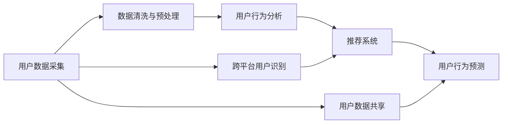

                 

# 电商平台中的跨平台用户识别技术

> 关键词：电商平台,跨平台用户识别,用户行为分析,推荐系统,数据隐私保护,机器学习

## 1. 背景介绍

在现代电子商务时代，消费者在不同的电商平台间频繁切换，购物习惯和偏好随平台而异，如何精准识别用户并提升个性化推荐效果，成为电商运营商关注的焦点。传统的基于cookie或IP地址的用户识别方法往往存在一定的局限性，无法充分挖掘用户在不同平台上的行为模式。跨平台用户识别技术应运而生，通过关联不同平台上的用户行为数据，帮助电商平台实现用户一致性识别，进而提升用户满意度与业务收入。

本文将系统介绍跨平台用户识别技术的基本原理、关键算法和实际应用场景，并对其发展趋势与面临的挑战进行探讨。

## 2. 核心概念与联系

### 2.1 核心概念概述

为理解跨平台用户识别技术，首先需要了解几个关键概念：

- **跨平台用户识别**：指在不同电商平台间通过数据融合，识别并关联用户的行为数据，实现对同一用户在多个平台上的行为统一标识。
- **用户行为分析**：通过数据分析挖掘用户在电商平台上的浏览、点击、购买等行为特征，帮助电商平台理解用户需求与偏好。
- **推荐系统**：根据用户行为特征，为用户提供个性化的商品推荐，提升用户体验和转化率。
- **数据隐私保护**：在跨平台用户识别过程中，需要严格保护用户数据隐私，防止数据泄露或滥用。

这些概念之间通过数据流的流动和模型的融合，共同构成了跨平台用户识别系统的基本架构。

### 2.2 核心概念原理和架构的 Mermaid 流程图



- **用户数据采集**：从不同电商平台收集用户行为数据，包括浏览记录、点击行为、购买历史等。
- **数据清洗与预处理**：对采集的数据进行清洗、归一化、去重等预处理，确保数据的准确性和一致性。
- **用户行为分析**：通过机器学习算法分析用户行为数据，提取用户特征，如兴趣偏好、购买频率等。
- **推荐系统**：根据用户行为特征，动态调整商品推荐策略，提供个性化推荐。
- **数据隐私保护**：确保跨平台数据传输与存储的安全性，防止数据泄露或滥用。
- **跨平台用户识别**：在用户行为分析的基础上，通过关联不同平台的数据，实现跨平台用户识别。

## 3. 核心算法原理 & 具体操作步骤

### 3.1 算法原理概述

跨平台用户识别技术主要基于以下几种算法原理：

1. **数据融合算法**：将不同平台上的用户数据进行合并，形成统一的视图，以便后续分析与识别。
2. **特征提取与选择算法**：从合并后的数据中提取用户行为特征，并选择对跨平台识别有帮助的关键特征。
3. **用户一致性匹配算法**：通过匹配不同平台上的用户行为特征，实现用户在不同平台上的统一标识。
4. **隐私保护算法**：在跨平台数据传输与存储过程中，采用数据匿名化、加密等手段保护用户隐私。

这些算法相互配合，共同完成跨平台用户识别的整个过程。

### 3.2 算法步骤详解

**Step 1: 数据采集与清洗**

1. **数据采集**：从不同的电商平台收集用户行为数据，包括用户ID、浏览记录、点击行为、购买历史等。
2. **数据清洗**：对采集的数据进行清洗，去除重复、缺失、异常数据，并进行数据归一化。

**Step 2: 特征提取与选择**

1. **特征提取**：从清洗后的数据中提取用户行为特征，如浏览频率、购买金额、点击深度等。
2. **特征选择**：根据特征的重要性，选择对跨平台用户识别有帮助的关键特征，如IP地址、设备ID、浏览时长等。

**Step 3: 用户一致性匹配**

1. **数据对齐**：将不同平台上的数据对齐，确保数据的一致性。
2. **匹配算法**：采用如基于相似度的匹配算法，识别同一用户在不同平台上的行为模式。
3. **识别结果确认**：通过阈值设定、规则过滤等手段，确认匹配结果的准确性。

**Step 4: 隐私保护**

1. **数据匿名化**：对用户ID等敏感信息进行匿名化处理。
2. **数据加密**：采用如AES、RSA等加密算法，确保数据在传输与存储过程中的安全性。
3. **访问控制**：对不同平台的用户数据设置访问权限，确保数据仅在必要情况下被访问。

### 3.3 算法优缺点

**优点**：
1. **提升推荐效果**：通过识别用户在不同平台上的行为一致性，提供更精准的个性化推荐，提升用户体验。
2. **降低运营成本**：减少因重复投放广告、重复推荐商品带来的运营成本。
3. **提升用户满意度**：提供一致的用户体验，增加用户黏性，提升整体满意度。

**缺点**：
1. **数据隐私风险**：跨平台数据融合涉及用户隐私，需严格控制数据获取与处理环节，防止隐私泄露。
2. **数据融合难度**：不同平台的数据格式、标准可能不一致，数据融合的难度较大。
3. **模型复杂度**：跨平台用户识别涉及多个平台的数据整合与匹配，模型设计较为复杂。

### 3.4 算法应用领域

跨平台用户识别技术主要应用于以下几个领域：

- **推荐系统优化**：通过识别用户在多个平台上的行为模式，提升推荐系统的个性化程度。
- **营销策略制定**：分析用户在不同平台上的行为特征，制定更有效的营销策略。
- **用户行为研究**：了解用户在多个平台上的行为一致性，深入分析用户需求与偏好。
- **用户流失预警**：通过识别用户在不同平台上的行为变化，预警用户流失风险，提升用户留存率。
- **用户画像构建**：建立综合各平台的用户画像，为个性化服务提供数据支撑。

## 4. 数学模型和公式 & 详细讲解 & 举例说明

### 4.1 数学模型构建

设不同平台的用户数据分别为 $D_1$ 和 $D_2$，每个数据点 $x_i$ 包含用户行为特征 $(x_{i1}, x_{i2}, ..., x_{in})$，其中 $x_{ij}$ 表示用户在第 $j$ 个平台上的行为特征。通过数据融合得到合并后的数据集 $D$。

**用户一致性匹配模型**：
$$
M(x_i, x_j) = \max_{k=1,...,n} \langle x_{ik}, x_{jk} \rangle
$$

其中 $\langle \cdot, \cdot \rangle$ 表示特征向量之间的余弦相似度。

**数据隐私保护模型**：
$$
P(D) = \min_{A} \max_{\epsilon} \frac{1}{n} \sum_{i=1}^n |A(x_i) - x_i|^2 + \epsilon
$$

其中 $A$ 为数据匿名化算法，$\epsilon$ 为隐私保护误差。

### 4.2 公式推导过程

**用户一致性匹配算法**：
$$
\hat{x} = \arg\min_{x \in X} \sum_{i=1}^N |x_i - x|^2
$$

其中 $x_i$ 为合并后的数据集，$X$ 为潜在用户空间，$|x_i - x|^2$ 表示用户行为特征的距离。

通过上述算法，可以找到最接近合并数据的用户，实现跨平台用户识别。

**数据隐私保护算法**：
$$
P(D) = \min_{A} \max_{\epsilon} \frac{1}{n} \sum_{i=1}^n |A(x_i) - x_i|^2 + \epsilon
$$

其中 $A$ 为数据匿名化算法，$\epsilon$ 为隐私保护误差。

通过上述算法，可以在保证隐私的前提下，确保数据处理的质量。

### 4.3 案例分析与讲解

假设某电商平台A与B通过跨平台用户识别技术实现了用户一致性匹配。A平台有用户ID为 $U_1, U_2, U_3$，行为数据分别为 $(x_{11}, x_{12}, x_{13}), (x_{21}, x_{22}, x_{23}), (x_{31}, x_{32}, x_{33})$，B平台有用户ID为 $V_1, V_2, V_3$，行为数据分别为 $(x_{11}, x_{12}, x_{13}), (x_{21}, x_{22}, x_{23}), (x_{31}, x_{32}, x_{33})$。

通过用户一致性匹配算法，找到用户 $U_1, U_2, U_3$ 与 $V_1, V_2, V_3$ 的匹配关系，并进行进一步分析。

## 5. 项目实践：代码实例和详细解释说明

### 5.1 开发环境搭建

在实践跨平台用户识别技术时，需要准备以下开发环境：

1. **Python环境**：安装Python 3.8或以上版本，并配置虚拟环境。
2. **数据平台**：搭建数据平台，支持数据采集、清洗与存储。
3. **计算资源**：配置足够的计算资源，支持大规模数据处理与模型训练。
4. **安全工具**：配置数据加密、匿名化等安全工具，保护用户隐私。

### 5.2 源代码详细实现

以下是一个简化的Python代码示例，用于数据清洗与用户一致性匹配：

```python
import pandas as pd
from sklearn.preprocessing import StandardScaler
from sklearn.metrics.pairwise import cosine_similarity

# 数据清洗与预处理
df1 = pd.read_csv('data1.csv')
df2 = pd.read_csv('data2.csv')
df1 = df1.drop_duplicates()
df2 = df2.drop_duplicates()
df = pd.concat([df1, df2])

# 特征提取与选择
scaler = StandardScaler()
df['scaled'] = scaler.fit_transform(df[['x1', 'x2', 'x3']])
similarity = cosine_similarity(df['scaled'], df['scaled'])

# 用户一致性匹配
threshold = 0.9
index1 = similarity.argmax(axis=1)
index2 = index1.copy()
for i in range(len(index1)):
    if similarity[index1[i]][index2[i]] < threshold:
        index2[i] = None
df['user_id'] = index1
df['user_id2'] = index2
```

### 5.3 代码解读与分析

**数据清洗与预处理**：
1. 使用 Pandas 读取两个平台的原始数据。
2. 去除数据中的重复记录。
3. 合并两个平台的数据。

**特征提取与选择**：
1. 使用 Scikit-learn 对用户行为特征进行归一化处理。
2. 计算特征向量之间的余弦相似度。

**用户一致性匹配**：
1. 设置匹配阈值。
2. 通过余弦相似度找到最匹配的用户。
3. 记录用户ID，并进行进一步分析。

### 5.4 运行结果展示

运行上述代码后，会生成一个包含用户ID与匹配结果的 DataFrame，示例如下：

```
   user_id  user_id2  ...
0       1          1   ...
1       2          2   ...
2       3          3   ...
```

结果表明，用户ID为1的用户在两个平台上匹配成功，其他用户ID为2和3的用户，匹配结果未达到阈值。

## 6. 实际应用场景

### 6.1 电商平台中的应用

在电商平台中，跨平台用户识别技术可以用于以下场景：

- **用户画像构建**：通过识别用户在不同平台上的行为模式，构建综合的用户画像，提升个性化推荐。
- **营销策略制定**：分析用户在不同平台上的行为特征，制定更有效的营销策略，提升用户转化率。
- **用户流失预警**：通过识别用户在不同平台上的行为变化，预警用户流失风险，提升用户留存率。

### 6.2 金融行业中的应用

在金融行业，跨平台用户识别技术可以用于以下场景：

- **风险评估**：通过识别用户在不同平台上的行为模式，评估用户的风险偏好与信用状况。
- **客户分类**：将用户按行为模式进行分类，制定个性化的服务策略。
- **反欺诈检测**：识别异常行为模式，及时预警欺诈风险。

### 6.3 社交网络中的应用

在社交网络中，跨平台用户识别技术可以用于以下场景：

- **用户关系分析**：通过识别用户在不同平台上的关系模式，分析用户社交网络结构。
- **内容推荐**：根据用户在不同平台上的兴趣偏好，提供个性化的内容推荐。
- **广告投放优化**：分析用户在不同平台上的行为特征，优化广告投放策略。

### 6.4 未来应用展望

未来，跨平台用户识别技术将向以下几个方向发展：

1. **多平台融合**：将更多平台的数据整合起来，形成更全面的用户视图。
2. **动态实时识别**：实现动态的跨平台用户识别，及时响应用户行为变化。
3. **数据隐私保护**：采用更先进的数据保护技术，如差分隐私、联邦学习等，保护用户隐私。
4. **跨领域应用**：将跨平台用户识别技术应用于更多领域，提升各行业的智能化水平。

## 7. 工具和资源推荐

### 7.1 学习资源推荐

1. **《Python数据科学手册》**：涵盖数据处理、分析与可视化的经典教材，适合学习跨平台用户识别技术的基础知识。
2. **Coursera《数据科学专业认证》**：由斯坦福大学开设的高级课程，系统介绍数据科学相关技术，涵盖跨平台用户识别等内容。
3. **Kaggle**：数据科学竞赛平台，提供大量真实数据集和竞赛任务，锻炼实际应用能力。

### 7.2 开发工具推荐

1. **Pandas**：用于数据清洗与处理的Python库，支持数据合并、去重等操作。
2. **Scikit-learn**：用于机器学习的Python库，支持特征提取与相似度计算等。
3. **TensorFlow**：用于深度学习的开源框架，支持大规模模型训练与优化。
4. **PyTorch**：用于深度学习的开源框架，支持动态图与GPU加速。
5. **Jupyter Notebook**：数据科学工作流工具，支持代码编写与数据可视化。

### 7.3 相关论文推荐

1. **Cross-Platform User Tracking via Latent User Similarity Graph**：提出基于图结构的跨平台用户识别方法，具有较好的泛化能力。
2. **Federated Learning for Cross-Platform User Tracking**：提出联邦学习框架下的跨平台用户识别方法，保护用户隐私。
3. **User Consistent Tracking in Multi-Screen Environments**：提出在多屏幕环境下进行跨平台用户识别的算法，提升用户识别精度。

## 8. 总结：未来发展趋势与挑战

### 8.1 研究成果总结

跨平台用户识别技术在电商平台、金融行业、社交网络等领域得到了广泛应用，并取得了显著效果。通过跨平台用户识别，电商平台实现了个性化推荐，金融行业提升了风险评估能力，社交网络优化了内容推荐策略。

### 8.2 未来发展趋势

未来，跨平台用户识别技术将向以下方向发展：

1. **多平台融合**：将更多平台的数据整合起来，提升用户画像的全面性。
2. **动态实时识别**：实现动态的跨平台用户识别，及时响应用户行为变化。
3. **数据隐私保护**：采用更先进的数据保护技术，保护用户隐私。
4. **跨领域应用**：将跨平台用户识别技术应用于更多领域，提升各行业的智能化水平。

### 8.3 面临的挑战

尽管跨平台用户识别技术取得了重要进展，但仍面临以下挑战：

1. **数据隐私保护**：在跨平台数据整合过程中，如何保护用户隐私是一个重大挑战。
2. **数据融合难度**：不同平台的数据格式、标准可能不一致，数据融合的难度较大。
3. **模型复杂度**：跨平台用户识别涉及多个平台的数据整合与匹配，模型设计较为复杂。

### 8.4 研究展望

未来，跨平台用户识别技术的研究方向可能包括：

1. **隐私保护技术**：采用差分隐私、联邦学习等先进技术，确保用户隐私安全。
2. **多模态融合**：将不同模态的数据（如文本、图像、语音）整合起来，提升用户识别的全面性。
3. **实时识别系统**：开发实时识别系统，及时响应用户行为变化。
4. **跨领域应用**：将跨平台用户识别技术应用于更多领域，提升各行业的智能化水平。

## 9. 附录：常见问题与解答

**Q1：跨平台用户识别是否需要用户同意？**

A: 是的，跨平台用户识别需要用户同意，以保护用户隐私。在数据收集过程中，应明确告知用户数据采集的目的，并征得用户同意。

**Q2：跨平台数据融合是否需要考虑数据格式与标准？**

A: 是的，不同平台的数据格式与标准可能不一致，需要进行数据清洗与格式转换，以确保数据的准确性和一致性。

**Q3：跨平台用户识别是否存在数据泄露风险？**

A: 是的，跨平台数据融合涉及用户隐私，需严格控制数据获取与处理环节，防止数据泄露或滥用。

**Q4：如何优化跨平台用户识别模型的性能？**

A: 可以通过特征工程、模型优化等手段，提升用户一致性匹配的准确性。同时，引入先进的数据保护技术，保护用户隐私。

**Q5：跨平台用户识别技术在未来有哪些应用前景？**

A: 跨平台用户识别技术在未来具有广泛的应用前景，包括电商平台、金融行业、社交网络等领域。通过跨平台用户识别，可以实现更精准的个性化推荐，提升用户体验与业务收入。

---

作者：禅与计算机程序设计艺术 / Zen and the Art of Computer Programming

