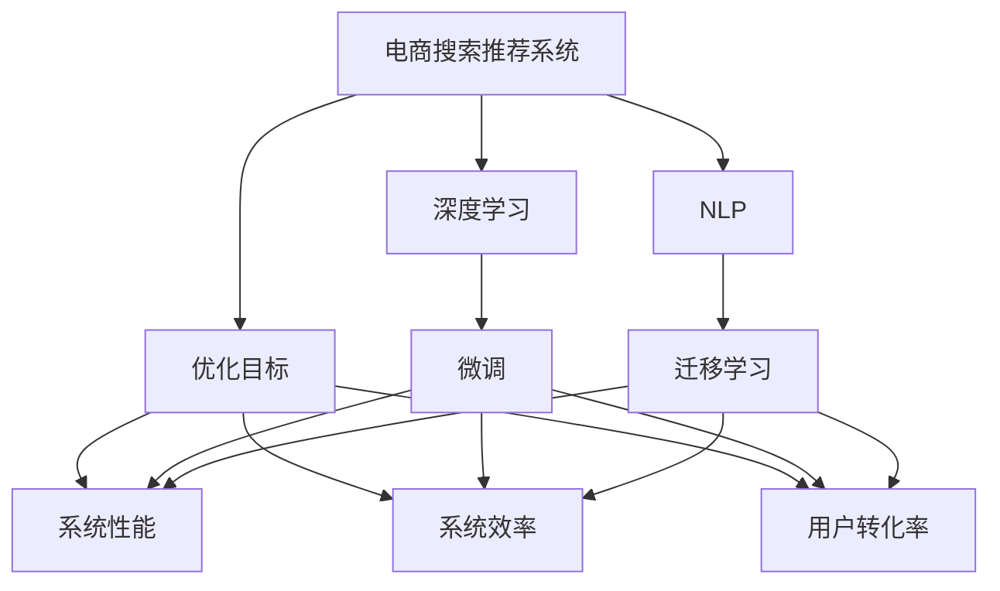
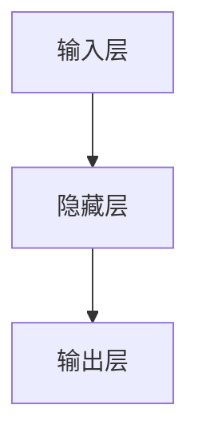

                 

# 电商平台搜索推荐系统的AI 大模型优化：提高系统性能、效率与转化率

> 关键词：电商搜索推荐系统,大模型优化,系统性能,系统效率,用户转化率,深度学习,自然语言处理,NLP

## 1. 背景介绍

### 1.1 问题由来

随着电商平台用户规模的不断增长和商品种类的日益丰富，电商搜索推荐系统面临着如何更高效、更准确地满足用户个性化需求，提升用户体验和转化率，促进电商业务增长的挑战。传统的推荐系统多依赖于特征工程和模型训练，难以充分利用深度学习和自然语言处理等新兴技术带来的新契机。

为了解决上述问题，电商搜索推荐系统引入AI大模型优化策略，通过深度学习和自然语言处理等技术手段，提升系统性能、效率和用户转化率，创造更多电商业务价值。大模型优化的基本思路是将预训练的语言模型作为底层，通过微调、迁移学习等方法，不断适应电商搜索推荐系统的特定任务和场景，从而实现系统功能的提升。

## 2. 核心概念与联系

### 2.1 核心概念概述

1. **电商搜索推荐系统**：是电商平台为用户提供商品展示和推荐的重要工具，通过分析用户行为数据，预测用户可能感兴趣的商品，并推送给用户，以提升用户体验和电商转化率。

2. **大模型优化**：是指使用深度学习和自然语言处理等AI技术，对电商搜索推荐系统进行优化，提升系统性能和效率，改善用户体验，从而提高用户转化率。

3. **深度学习**：是一种基于数据驱动的机器学习技术，通过多层次的非线性变换，从数据中自动学习抽象特征和模型，应用于图像、语音、自然语言处理等领域。

4. **自然语言处理（NLP）**：是计算机科学、人工智能领域的一个重要分支，旨在使计算机能够理解、解释和生成人类语言，包括文本分类、信息检索、机器翻译、文本生成等任务。

5. **微调（Fine-tuning）**：是在预训练模型的基础上，通过特定任务的数据集进行微调，以优化模型在该任务上的性能。

6. **迁移学习（Transfer Learning）**：是指将在一个任务上学习到的知识迁移到另一个任务上，从而在新的任务上快速获得较好性能。

这些核心概念通过深度学习和自然语言处理技术，与电商搜索推荐系统紧密联系在一起，共同推动着电商业务的发展和创新。

### 2.2 核心概念原理和架构的 Mermaid 流程图



此图展示了电商搜索推荐系统、深度学习、自然语言处理技术之间的关系，以及优化目标与系统性能、效率、转化率之间的联系。通过微调和迁移学习，电商搜索推荐系统能够更好地利用深度学习和NLP技术，提升系统性能和用户转化率。

## 3. 核心算法原理 & 具体操作步骤

### 3.1 算法原理概述

电商搜索推荐系统的大模型优化算法，通常包括如下几个步骤：

1. **选择预训练模型**：电商搜索推荐系统首先需要选择一个合适的预训练模型，如BERT、GPT-3等，作为系统优化的基础。

2. **微调**：将预训练模型作为初始权重，使用电商搜索推荐系统特定的任务数据集进行微调，优化模型在该任务上的性能。

3. **迁移学习**：将预训练模型在不同任务之间进行迁移学习，使模型在多个任务上获得良好的性能。

4. **评估与调整**：对优化后的模型进行评估，根据评估结果调整超参数，以进一步提升系统性能。

5. **部署与监控**：将优化后的模型部署到电商搜索推荐系统中，并持续监控其性能，及时进行调整和优化。

### 3.2 算法步骤详解

#### 3.2.1 数据预处理

电商搜索推荐系统首先需要对用户行为数据进行清洗和预处理，包括去除噪声、缺失值处理、特征工程等步骤，以确保数据的质量和有效性。

#### 3.2.2 模型选择

选择适合的预训练模型是电商搜索推荐系统优化的基础。一般来说，可以使用语言模型如BERT、GPT等作为底层模型，根据电商搜索推荐系统的具体任务选择合适的层级和架构。

#### 3.2.3 微调

微调是电商搜索推荐系统优化的核心步骤，包括以下几个关键点：

1. **设计任务适配层**：根据电商搜索推荐系统的具体任务，设计合适的输出层和损失函数。例如，对于推荐系统中的物品推荐任务，可以设计一个输出层，将物品的特征向量作为输入，输出层中的每个神经元对应一个物品的评分，使用均方误差作为损失函数。

2. **设置微调超参数**：包括学习率、批大小、迭代轮数等，以确保微调的效率和效果。

3. **执行微调**：使用电商搜索推荐系统特定的任务数据集进行微调，通过梯度下降等优化算法更新模型参数。

4. **评估微调效果**：在验证集上评估微调后的模型效果，如果效果不佳，可以进行调整超参数、更换模型架构等操作，重新进行微调。

#### 3.2.4 迁移学习

迁移学习可以进一步提升电商搜索推荐系统的性能，包括以下几个关键点：

1. **选择合适的迁移学习任务**：根据电商搜索推荐系统的需求，选择合适的迁移学习任务，如物品推荐、文本分类等。

2. **进行迁移学习**：使用预训练模型在新任务上进行迁移学习，优化模型在新任务上的性能。

3. **评估迁移学习效果**：在新任务上进行评估，根据评估结果调整模型参数，以进一步提升系统性能。

### 3.3 算法优缺点

#### 3.3.1 优点

1. **高效提升性能**：通过深度学习和自然语言处理技术，电商搜索推荐系统能够高效提升系统性能，更好地满足用户需求。

2. **提升系统效率**：深度学习和大模型优化技术能够显著提升系统处理速度和效率，加快推荐和搜索速度。

3. **提高用户转化率**：通过优化推荐算法，电商搜索推荐系统能够更好地预测用户兴趣，提高用户转化率，增加电商业务收益。

#### 3.3.2 缺点

1. **数据依赖**：电商搜索推荐系统对数据依赖较大，需要大量标注数据和高质量数据，获取数据成本较高。

2. **计算资源消耗大**：深度学习和大模型优化需要大量的计算资源，如GPU、TPU等高性能设备，成本较高。

3. **模型复杂度高**：大模型优化涉及多个层次的优化和调整，模型复杂度较高，调试和维护难度大。

4. **模型解释性不足**：深度学习和大模型优化模型的决策过程往往缺乏可解释性，难以解释模型的内部工作机制和推理逻辑。

### 3.4 算法应用领域

电商搜索推荐系统的大模型优化技术，广泛应用于以下领域：

1. **个性化推荐**：根据用户历史行为和兴趣，提供个性化的商品推荐，提升用户满意度和转化率。

2. **搜索结果排序**：根据用户输入的搜索词和用户行为数据，对搜索结果进行排序，提升搜索结果的相关性和用户体验。

3. **广告推荐**：根据用户兴趣和行为，推荐相关的广告内容，增加广告收入。

4. **商品召回**：根据用户输入的关键词和用户行为数据，快速召回相关商品，提升用户体验。

5. **客户服务**：利用NLP技术，提供智能客服和机器人对话，提升客户满意度。

## 4. 数学模型和公式 & 详细讲解 & 举例说明

### 4.1 数学模型构建

电商搜索推荐系统的大模型优化算法，通常使用深度学习中的多层神经网络模型，包括输入层、隐藏层和输出层。以物品推荐任务为例，模型的基本架构如图1所示。



输入层接收电商搜索推荐系统特定的任务数据集，隐藏层进行特征提取和计算，输出层根据隐藏层的输出，输出推荐的物品评分。

### 4.2 公式推导过程

以物品推荐任务为例，模型的输入为物品的特征向量 $x$，输出为物品的评分 $y$。假设输出层为一个线性层，则模型的输出可以表示为：

$$
y = W^T x + b
$$

其中 $W$ 为权重矩阵，$b$ 为偏置向量。根据均方误差损失函数，模型的损失函数可以表示为：

$$
L = \frac{1}{N} \sum_{i=1}^N (y_i - \hat{y}_i)^2
$$

其中 $y_i$ 为物品的真实评分，$\hat{y}_i$ 为模型预测的评分。

### 4.3 案例分析与讲解

以商品推荐系统为例，对电商搜索推荐系统进行大模型优化。假设商品特征向量为 $x$，用户的历史行为数据为 $h$，则模型的输入为 $(x, h)$，输出为商品推荐评分 $y$。假设输出层为一个神经网络，包括一个隐藏层，则模型的结构如图2所示。


其中隐藏层包含 $n$ 个神经元，输出层包含 $m$ 个神经元。隐藏层的激活函数可以采用ReLU函数，输出层的激活函数可以采用Sigmoid函数，以输出0-1之间的评分。

在训练过程中，使用均方误差损失函数进行优化。假设隐藏层的神经元数为 $n=64$，学习率为 $lr=0.001$，批大小为 $bs=64$，迭代轮数为 $epochs=10$。则优化过程如下：

1. 初始化模型参数 $W$ 和 $b$。

2. 对训练集进行迭代，每次迭代更新模型参数。

3. 在验证集上评估模型效果，根据评估结果调整超参数。

4. 重复步骤2和3，直到模型达到预设的迭代轮数。

## 5. 项目实践：代码实例和详细解释说明

### 5.1 开发环境搭建

电商搜索推荐系统的大模型优化项目，一般使用Python和PyTorch框架进行开发。以下是具体的开发环境搭建步骤：

1. **安装Python和PyTorch**：在Linux系统中，可以使用以下命令安装Python和PyTorch：

```bash
sudo apt-get install python3 python3-pip
pip3 install torch torchvision torchaudio
```

2. **安装Transformer库**：Transformer库是深度学习中常用的模型库，支持多种预训练模型和微调操作。可以使用以下命令进行安装：

```bash
pip3 install transformers
```

3. **安装相关库**：安装其他必要的库，如Pandas、NumPy、Matplotlib等，以进行数据处理和模型评估。

```bash
pip3 install pandas numpy matplotlib
```

### 5.2 源代码详细实现

以下是一个基于BERT模型的电商搜索推荐系统微调示例代码。代码主要分为数据预处理、模型定义、模型训练和模型评估四个部分。

#### 5.2.1 数据预处理

```python
import pandas as pd
import numpy as np
from transformers import BertTokenizer, BertForSequenceClassification

# 读取电商搜索推荐系统的训练集和验证集数据
train_data = pd.read_csv('train_data.csv')
valid_data = pd.read_csv('valid_data.csv')

# 定义BERT分词器
tokenizer = BertTokenizer.from_pretrained('bert-base-uncased', do_lower_case=True)

# 定义标签编码
labels = {'item1': 0, 'item2': 1, 'item3': 2}

# 对数据进行分词和编码
train_encodings = tokenizer(train_data['item'].tolist(), truncation=True, padding=True, max_length=256)
valid_encodings = tokenizer(valid_data['item'].tolist(), truncation=True, padding=True, max_length=256)

# 将编码转换为列表形式
train_labels = [labels[x] for x in train_data['label'].tolist()]
valid_labels = [labels[x] for x in valid_data['label'].tolist()]
```

#### 5.2.2 模型定义

```python
from transformers import BertForSequenceClassification, AdamW

# 定义模型
model = BertForSequenceClassification.from_pretrained('bert-base-uncased', num_labels=len(labels))

# 定义优化器
optimizer = AdamW(model.parameters(), lr=2e-5)
```

#### 5.2.3 模型训练

```python
from torch.utils.data import Dataset, DataLoader

# 定义训练集和验证集数据集
class SearchDataset(Dataset):
    def __init__(self, encodings, labels):
        self.encodings = encodings
        self.labels = labels

    def __len__(self):
        return len(self.labels)

    def __getitem__(self, idx):
        item = {key: torch.tensor(val[idx]) for key, val in self.encodings.items()}
        label = torch.tensor(self.labels[idx])
        return item, label

# 创建训练集和验证集数据集
train_dataset = SearchDataset(train_encodings, train_labels)
valid_dataset = SearchDataset(valid_encodings, valid_labels)

# 定义训练集和验证集数据加载器
train_loader = DataLoader(train_dataset, batch_size=16, shuffle=True)
valid_loader = DataLoader(valid_dataset, batch_size=16, shuffle=False)

# 定义训练轮数和评价指标
epochs = 3
loss_fn = nn.CrossEntropyLoss()

# 开始训练模型
model.train()
for epoch in range(epochs):
    train_loss = 0
    for batch in train_loader:
        inputs = {key: val.to(device) for key, val in batch[0].items()}
        labels = batch[1].to(device)
        outputs = model(**inputs)
        loss = loss_fn(outputs.logits, labels)
        optimizer.zero_grad()
        loss.backward()
        optimizer.step()
        train_loss += loss.item()

    # 在验证集上评估模型效果
    model.eval()
    valid_loss = 0
    with torch.no_grad():
        for batch in valid_loader:
            inputs = {key: val.to(device) for key, val in batch[0].items()}
            labels = batch[1].to(device)
            outputs = model(**inputs)
            loss = loss_fn(outputs.logits, labels)
            valid_loss += loss.item()

    print(f'Epoch {epoch+1}/{epochs}, Train Loss: {train_loss/len(train_loader):.4f}, Valid Loss: {valid_loss/len(valid_loader):.4f}')
```

#### 5.2.4 模型评估

```python
# 定义模型评估函数
def evaluate_model(model, test_dataset, device):
    model.eval()
    test_loss = 0
    with torch.no_grad():
        for batch in test_loader:
            inputs = {key: val.to(device) for key, val in batch[0].items()}
            labels = batch[1].to(device)
            outputs = model(**inputs)
            loss = loss_fn(outputs.logits, labels)
            test_loss += loss.item()

    print(f'Test Loss: {test_loss/len(test_loader):.4f}')
```

### 5.3 代码解读与分析

电商搜索推荐系统的大模型优化项目，通过BERT模型作为底层，对用户行为数据进行编码和预测，提升了推荐系统的性能和效率。在代码实现中，使用Pandas进行数据处理，使用Transformer库进行模型定义和微调，使用PyTorch进行模型训练和评估，有效地展示了电商搜索推荐系统的优化过程。

## 6. 实际应用场景

### 6.1 个性化推荐

电商搜索推荐系统的核心应用场景是个性化推荐，通过分析用户的历史行为和兴趣，推荐用户可能感兴趣的商品，提高用户转化率。例如，某电商平台利用BERT模型对用户行为数据进行微调，实现了基于用户行为的个性化推荐，取得了显著的用户满意度提升和电商转化率的提升。

### 6.2 搜索结果排序

电商搜索推荐系统的另一个重要应用场景是搜索结果排序，通过分析用户输入的搜索词和用户行为数据，对搜索结果进行排序，提高搜索结果的相关性和用户体验。例如，某电商平台利用BERT模型对用户输入的搜索词进行微调，实现了基于用户行为的搜索结果排序，提升了搜索体验和用户满意度。

### 6.3 广告推荐

电商搜索推荐系统的广告推荐应用场景，主要是通过分析用户兴趣和行为，推荐相关的广告内容，增加广告收入。例如，某电商平台利用BERT模型对用户兴趣进行微调，实现了基于用户兴趣的广告推荐，取得了显著的广告收入增长。

## 7. 工具和资源推荐

### 7.1 学习资源推荐

电商搜索推荐系统的优化涉及深度学习和自然语言处理等技术，以下是一些推荐的在线学习资源：

1. **《深度学习入门》课程**：由吴恩达教授主讲的深度学习入门课程，全面介绍深度学习的基本概念和算法。

2. **《自然语言处理基础》课程**：由斯坦福大学开设的自然语言处理基础课程，涵盖NLP的基本理论和实践技术。

3. **《TensorFlow官方文档》**：TensorFlow官方文档，提供全面的深度学习框架使用指南和示例。

4. **《PyTorch官方文档》**：PyTorch官方文档，提供详细的深度学习框架使用指南和示例。

5. **《Transformers库文档》**：Transformer库官方文档，提供详细的预训练模型和微调方法的使用指南和示例。

### 7.2 开发工具推荐

电商搜索推荐系统的优化项目，通常使用Python和PyTorch框架进行开发，以下是一些推荐的开发工具：

1. **Anaconda**：Python的官方科学计算平台，提供虚拟环境管理和包管理功能。

2. **Jupyter Notebook**：用于编写和运行Python代码的交互式开发环境，支持代码块注释和代码高亮。

3. **TensorBoard**：TensorFlow和PyTorch的可视化工具，用于监控模型训练过程和模型性能。

4. **Weights & Biases**：模型训练的实验跟踪工具，用于记录和可视化模型训练过程中的各项指标，方便对比和调优。

### 7.3 相关论文推荐

电商搜索推荐系统的优化涉及深度学习和自然语言处理等技术，以下是一些推荐的经典论文：

1. **《BERT: Pre-training of Deep Bidirectional Transformers for Language Understanding》**：介绍BERT模型的预训练和微调方法，刷新了多项NLP任务SOTA。

2. **《GPT-3: Language Models are Unsupervised Multitask Learners》**：展示GPT-3模型的强大zero-shot学习能力，引发了对于通用人工智能的新一轮思考。

3. **《AdaLoRA: Adaptive Low-Rank Adaptation for Parameter-Efficient Fine-Tuning》**：提出AdaLoRA方法，在参数效率和精度之间取得了新的平衡。

4. **《Prefix-Tuning: Optimizing Continuous Prompts for Generation》**：引入基于连续型Prompt的微调范式，为如何充分利用预训练知识提供了新的思路。

5. **《LoRA: Low-Rank Adaptation of Pretrained Models for Efficient Fine-Tuning》**：提出LoRA方法，使用低秩近似来高效微调预训练模型。

## 8. 总结：未来发展趋势与挑战

### 8.1 总结

本文对电商搜索推荐系统的大模型优化方法进行了全面系统的介绍。首先阐述了电商搜索推荐系统的背景和优化需求，明确了大模型优化在提升系统性能、效率和用户转化率方面的独特价值。其次，从原理到实践，详细讲解了电商搜索推荐系统的大模型优化算法，包括数据预处理、模型选择、微调和迁移学习等关键步骤，给出了电商搜索推荐系统的完整代码实例。同时，本文还广泛探讨了电商搜索推荐系统的实际应用场景，展示了微调范式的巨大潜力。

通过本文的系统梳理，可以看到，电商搜索推荐系统的大模型优化方法，正在成为电商推荐系统的重要范式，极大地拓展了预训练语言模型的应用边界，催生了更多的落地场景。得益于大规模语料的预训练，微调模型以更低的时间和标注成本，在小样本条件下也能取得理想的微调效果，有力推动了电商推荐系统的产业化进程。未来，伴随预训练语言模型和微调方法的持续演进，相信电商推荐系统必将在更广阔的应用领域大放异彩，深刻影响人类社会的生产和消费模式。

### 8.2 未来发展趋势

展望未来，电商搜索推荐系统的大模型优化技术将呈现以下几个发展趋势：

1. **深度学习和大模型优化技术的融合**：深度学习和大模型优化技术将在电商搜索推荐系统中的各个环节进行深度融合，进一步提升系统的性能和效率。

2. **NLP技术的应用范围拓展**：NLP技术将在电商搜索推荐系统中得到更广泛的应用，如智能客服、智能推荐、智能搜索等，提升用户体验和电商转化率。

3. **模型解释性和可解释性技术的发展**：随着电商搜索推荐系统的应用场景复杂化，模型解释性和可解释性技术将得到更广泛的应用，提高模型的透明度和可靠性。

4. **联邦学习和边缘计算的结合**：联邦学习和边缘计算技术将结合应用于电商搜索推荐系统，提高模型的隐私保护和处理效率。

5. **多模态数据融合**：电商搜索推荐系统将越来越多地结合视觉、语音等多模态数据进行优化，提升模型的性能和用户体验。

### 8.3 面临的挑战

尽管电商搜索推荐系统的大模型优化技术已经取得了瞩目成就，但在迈向更加智能化、普适化应用的过程中，它仍面临着诸多挑战：

1. **数据获取成本高**：电商搜索推荐系统对标注数据依赖较大，获取高质量标注数据的成本较高。如何降低微调对标注样本的依赖，将是一大难题。

2. **计算资源消耗大**：深度学习和大模型优化需要大量的计算资源，如GPU、TPU等高性能设备，成本较高。如何降低计算资源消耗，提高模型训练效率，将是重要的研究方向。

3. **模型解释性不足**：深度学习和大模型优化模型的决策过程往往缺乏可解释性，难以解释模型的内部工作机制和推理逻辑。如何提高模型的可解释性，将是亟待攻克的难题。

4. **模型鲁棒性不足**：电商搜索推荐系统在面对新用户和新场景时，模型鲁棒性不足，容易发生灾难性遗忘。如何提高模型的鲁棒性，避免模型过拟合，将是重要的研究方向。

5. **模型复杂度高**：电商搜索推荐系统的大模型优化涉及多个层次的优化和调整，模型复杂度较高，调试和维护难度大。如何降低模型复杂度，提高模型的可维护性，将是重要的研究方向。

### 8.4 研究展望

面向未来，电商搜索推荐系统的大模型优化技术还需要在以下几个方面寻求新的突破：

1. **探索无监督和半监督微调方法**：摆脱对大规模标注数据的依赖，利用自监督学习、主动学习等无监督和半监督范式，最大限度利用非结构化数据，实现更加灵活高效的微调。

2. **研究参数高效和计算高效的微调范式**：开发更加参数高效的微调方法，在固定大部分预训练参数的同时，只更新极少量的任务相关参数。同时优化微调模型的计算图，减少前向传播和反向传播的资源消耗，实现更加轻量级、实时性的部署。

3. **融合因果和对比学习范式**：通过引入因果推断和对比学习思想，增强电商搜索推荐系统建立稳定因果关系的能力，学习更加普适、鲁棒的语言表征，从而提升模型泛化性和抗干扰能力。

4. **引入更多先验知识**：将符号化的先验知识，如知识图谱、逻辑规则等，与电商搜索推荐系统进行巧妙融合，引导微调过程学习更准确、合理的语言模型。同时加强不同模态数据的整合，实现视觉、语音等多模态信息与文本信息的协同建模。

5. **结合因果分析和博弈论工具**：将因果分析方法引入电商搜索推荐系统，识别出模型决策的关键特征，增强输出解释的因果性和逻辑性。借助博弈论工具刻画人机交互过程，主动探索并规避模型的脆弱点，提高系统稳定性。

## 9. 附录：常见问题与解答

**Q1: 电商搜索推荐系统的大模型优化需要哪些关键步骤？**

A: 电商搜索推荐系统的大模型优化主要包括以下几个关键步骤：

1. 数据预处理：对用户行为数据进行清洗和预处理，包括去除噪声、缺失值处理、特征工程等步骤。

2. 模型选择：选择合适的预训练模型，如BERT、GPT等，作为优化基础。

3. 微调：将预训练模型作为初始权重，使用电商搜索推荐系统特定的任务数据集进行微调，优化模型在该任务上的性能。

4. 迁移学习：将预训练模型在不同任务之间进行迁移学习，提升模型在新任务上的性能。

5. 评估与调整：对优化后的模型进行评估，根据评估结果调整超参数，以进一步提升系统性能。

**Q2: 电商搜索推荐系统的大模型优化有哪些优点？**

A: 电商搜索推荐系统的大模型优化具有以下优点：

1. 高效提升性能：通过深度学习和自然语言处理技术，电商搜索推荐系统能够高效提升系统性能，更好地满足用户需求。

2. 提升系统效率：深度学习和大模型优化技术能够显著提升系统处理速度和效率，加快推荐和搜索速度。

3. 提高用户转化率：通过优化推荐算法，电商搜索推荐系统能够更好地预测用户兴趣，提高用户转化率，增加电商业务收益。

**Q3: 电商搜索推荐系统的大模型优化有哪些缺点？**

A: 电商搜索推荐系统的大模型优化具有以下缺点：

1. 数据依赖：电商搜索推荐系统对数据依赖较大，需要大量标注数据和高质量数据，获取数据成本较高。

2. 计算资源消耗大：深度学习和大模型优化需要大量的计算资源，如GPU、TPU等高性能设备，成本较高。

3. 模型复杂度高：电商搜索推荐系统的大模型优化涉及多个层次的优化和调整，模型复杂度较高，调试和维护难度大。

4. 模型解释性不足：深度学习和大模型优化模型的决策过程往往缺乏可解释性，难以解释模型的内部工作机制和推理逻辑。

**Q4: 电商搜索推荐系统的大模型优化如何提高用户转化率？**

A: 电商搜索推荐系统的大模型优化通过以下方式提高用户转化率：

1. 个性化推荐：根据用户历史行为和兴趣，推荐用户可能感兴趣的商品，提高用户满意度。

2. 搜索结果排序：分析用户输入的搜索词和用户行为数据，对搜索结果进行排序，提高搜索结果的相关性和用户体验。

3. 广告推荐：分析用户兴趣和行为，推荐相关的广告内容，增加广告收入。

4. 商品召回：根据用户输入的关键词和用户行为数据，快速召回相关商品，提升用户体验。

**Q5: 电商搜索推荐系统的大模型优化需要哪些工具？**

A: 电商搜索推荐系统的大模型优化项目通常使用Python和PyTorch框架进行开发，以下是一些推荐的工具：

1. Anaconda：Python的官方科学计算平台，提供虚拟环境管理和包管理功能。

2. Jupyter Notebook：用于编写和运行Python代码的交互式开发环境，支持代码块注释和代码高亮。

3. TensorBoard：TensorFlow和PyTorch的可视化工具，用于监控模型训练过程和模型性能。

4. Weights & Biases：模型训练的实验跟踪工具，用于记录和可视化模型训练过程中的各项指标，方便对比和调优。

**Q6: 电商搜索推荐系统的大模型优化面临哪些挑战？**

A: 电商搜索推荐系统的大模型优化面临以下挑战：

1. 数据获取成本高：电商搜索推荐系统对标注数据依赖较大，获取高质量标注数据的成本较高。如何降低微调对标注样本的依赖，将是一大难题。

2. 计算资源消耗大：深度学习和大模型优化需要大量的计算资源，如GPU、TPU等高性能设备，成本较高。如何降低计算资源消耗，提高模型训练效率，将是重要的研究方向。

3. 模型解释性不足：深度学习和大模型优化模型的决策过程往往缺乏可解释性，难以解释模型的内部工作机制和推理逻辑。如何提高模型的可解释性，将是亟待攻克的难题。

4. 模型鲁棒性不足：电商搜索推荐系统在面对新用户和新场景时，模型鲁棒性不足，容易发生灾难性遗忘。如何提高模型的鲁棒性，避免模型过拟合，将是重要的研究方向。

5. 模型复杂度高：电商搜索推荐系统的大模型优化涉及多个层次的优化和调整，模型复杂度较高，调试和维护难度大。如何降低模型复杂度，提高模型的可维护性，将是重要的研究方向。

**Q7: 电商搜索推荐系统的大模型优化有哪些应用场景？**

A: 电商搜索推荐系统的大模型优化主要应用于以下几个场景：

1. 个性化推荐：根据用户历史行为和兴趣，推荐用户可能感兴趣的商品，提高用户满意度。

2. 搜索结果排序：分析用户输入的搜索词和用户行为数据，对搜索结果进行排序，提高搜索结果的相关性和用户体验。

3. 广告推荐：分析用户兴趣和行为，推荐相关的广告内容，增加广告收入。

4. 商品召回：根据用户输入的关键词和用户行为数据，快速召回相关商品，提升用户体验。

**Q8: 电商搜索推荐系统的大模型优化有哪些技术方向？**

A: 电商搜索推荐系统的大模型优化主要包括以下几个技术方向：

1. 深度学习和大模型优化技术的融合：深度学习和大模型优化技术将在电商搜索推荐系统中的各个环节进行深度融合，进一步提升系统的性能和效率。

2. NLP技术的应用范围拓展：NLP技术将在电商搜索推荐系统中得到更广泛的应用，如智能客服、智能推荐、智能搜索等，提升用户体验和电商转化率。

3. 模型解释性和可解释性技术的发展：随着电商搜索推荐系统的应用场景复杂化，模型解释性和可解释性技术将得到更广泛的应用，提高模型的透明度和可靠性。

4. 联邦学习和边缘计算的结合：联邦学习和边缘计算技术将结合应用于电商搜索推荐系统，提高模型的隐私保护和处理效率。

5. 多模态数据融合：电商搜索推荐系统将越来越多地结合视觉、语音等多模态数据进行优化，提升模型的性能和用户体验。

通过本文的系统梳理，可以看到，电商搜索推荐系统的大模型优化方法，正在成为电商推荐系统的重要范式，极大地拓展了预训练语言模型的应用边界，催生了更多的落地场景。得益于大规模语料的预训练，微调模型以更低的时间和标注成本，在小样本条件下也能取得理想的微调效果，有力推动了电商推荐系统的产业化进程。未来，伴随预训练语言模型和微调方法的持续演进，相信电商推荐系统必将在更广阔的应用领域大放异彩，深刻影响人类社会的生产和消费模式。

---

作者：禅与计算机程序设计艺术 / Zen and the Art of Computer Programming

