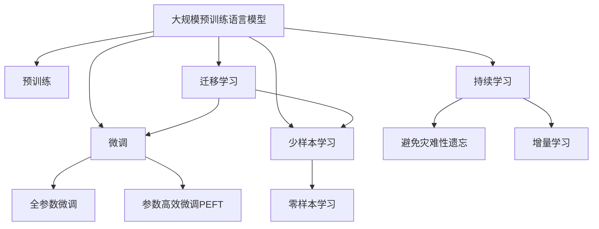

                 

# 电商平台搜索推荐系统的AI 大模型实践：应对数据规模与质量的双重挑战

## 1. 背景介绍

在数字化转型的浪潮中，电商平台作为实体经济与虚拟市场的交汇点，正在经历前所未有的变革。随着用户行为数据、商品属性数据和评价数据等信息的爆炸式增长，电商平台搜索推荐系统面临着数据规模与数据质量的双重挑战。一方面，数据规模庞大、维度众多，如何高效处理这些数据，从中挖掘出有价值的信息，是数据工程师的首要难题；另一方面，数据质量参差不齐，包含噪声、缺失和不一致性问题，如何保证数据的质量，是推荐算法的核心考量。

在这样的背景下，人工智能大模型（Large Artificial Intelligence Models）逐渐成为电商平台搜索推荐系统的重要工具。通过利用大规模预训练语言模型和自监督学习方法，大模型可以自动学习到丰富的语义和结构化知识，并通过微调（Fine-Tuning）机制，将模型适配到具体的电商场景，从而提升搜索推荐系统的性能和智能化水平。本文将详细探讨如何在大规模电商平台数据上，应用大模型进行高效、精准的搜索推荐，并总结关键问题和解决方案。

## 2. 核心概念与联系

为了更好地理解大模型在电商平台搜索推荐中的应用，本节将介绍几个核心概念及其联系。

### 2.1 核心概念概述

- **大规模预训练语言模型**：如BERT、GPT等，通过在大规模无标签文本数据上进行预训练，学习到丰富的语言知识和语义表示，能够在各种自然语言处理（NLP）任务上取得优异表现。

- **微调（Fine-Tuning）**：在预训练模型的基础上，使用下游任务的少量标注数据进行有监督学习，优化模型在该任务上的表现，通常只调整顶层分类器或解码器，并以较小的学习率更新全部或部分的模型参数。

- **迁移学习（Transfer Learning）**：将一个领域学习到的知识，迁移到另一个相关领域的学习过程。大模型的预训练-微调过程即是一种典型的迁移学习方式。

- **参数高效微调（Parameter-Efficient Fine-Tuning, PEFT）**：仅更新少量的模型参数，而固定大部分预训练权重不变，以提高微调效率，避免过拟合。

- **少样本学习（Few-shot Learning）**：仅在少量标注样本的情况下，模型能够快速适应新任务的学习方法。在大模型中，通常通过在输入中提供少量示例来实现，无需更新模型参数。

- **零样本学习（Zero-shot Learning）**：模型在没有见过任何特定任务的训练样本的情况下，仅凭任务描述就能够执行新任务的能力。大模型通过预训练获得的广泛知识，使其能够理解任务指令并生成相应输出。

### 2.2 核心概念联系

这些核心概念之间的逻辑关系可以通过以下Mermaid流程图来展示：



这个流程图展示了大模型的核心概念及其之间的关系：

1. 大模型通过预训练获得基础能力。
2. 微调是对预训练模型进行任务特定的优化，可以分为全参数微调和参数高效微调（PEFT）。
3. 少样本学习和零样本学习是在小样本条件下的快速适应能力。
4. 迁移学习是连接预训练模型与下游任务的桥梁，可以通过微调或少样本学习来实现。
5. 持续学习旨在使模型能够不断学习新知识，同时避免遗忘旧知识。

这些概念共同构成了大模型在电商平台搜索推荐系统的学习和应用框架，使其能够在各种场景下发挥强大的智能能力。通过理解这些核心概念，我们可以更好地把握大模型的工作原理和优化方向。

## 3. 核心算法原理 & 具体操作步骤

### 3.1 算法原理概述

在电商平台搜索推荐系统中，大模型通过预训练-微调机制，从海量电商数据中自动学习用户行为和商品属性之间的关系，并将其应用于搜索推荐任务。具体而言，大模型首先在大规模无标签电商数据上进行预训练，学习到通用的语言表示和电商特征。然后，通过微调机制，将模型适配到具体的搜索推荐任务上，优化模型在预测用户行为和推荐商品上的性能。

### 3.2 算法步骤详解

基于预训练-微调的搜索推荐系统一般包括以下几个关键步骤：

**Step 1: 准备数据集**

- **数据集划分**：将电商数据集分为训练集、验证集和测试集，通常需要按照用户行为、商品属性等特征进行划分。
- **数据清洗**：去除噪声、缺失和异常数据，保证数据质量。
- **特征工程**：提取和构建电商数据中的文本特征（如商品描述、用户评价）和数值特征（如价格、评分）。

**Step 2: 选择预训练模型和微调策略**

- **预训练模型选择**：选择适合电商领域的预训练模型，如BERT、GPT、LM-BFF等。
- **微调策略确定**：根据任务特点，选择全参数微调、参数高效微调、提示学习等微调策略。

**Step 3: 添加任务适配层**

- **输出层设计**：根据推荐任务类型，设计合适的输出层，如全连接层、Attention层等。
- **损失函数选择**：选择适合电商任务的损失函数，如交叉熵损失、均方误差损失等。

**Step 4: 设置微调超参数**

- **学习率**：选择合适的学习率，一般比从头训练小1-2个数量级。
- **批大小**：设定合适的批大小，平衡训练速度和内存占用。
- **迭代轮数**：设定迭代轮数，通常通过验证集上的性能进行判断。

**Step 5: 执行梯度训练**

- **数据批次加载**：使用PyTorch或TensorFlow等框架，将电商数据按批次加载到模型中。
- **前向传播**：将输入数据送入模型，计算损失函数。
- **反向传播**：计算损失函数对模型参数的梯度，使用优化算法更新模型参数。
- **验证集评估**：周期性在验证集上评估模型性能，防止过拟合。

**Step 6: 测试和部署**

- **测试集评估**：在测试集上评估微调后模型的性能，对比微调前后的精度提升。
- **部署优化**：将模型部署到实际应用中，进行优化调整，如模型裁剪、量化加速等。

### 3.3 算法优缺点

基于预训练-微调的搜索推荐系统具有以下优点：

1. **高效性**：利用大模型预训练获得的丰富知识，可以快速适配下游任务，提升模型性能。
2. **泛化性强**：大模型的预训练特征能够很好地泛化到不同场景，提升模型的通用性和适应性。
3. **参数高效**：通过参数高效微调技术，可以在不增加大量参数的情况下，提高微调效果。
4. **可解释性**：部分大模型（如GPT）提供可解释的推理过程，有助于理解和调试模型。

同时，该方法也存在以下局限性：

1. **数据依赖**：微调效果高度依赖于电商数据的质量和数量，高质量数据的获取成本较高。
2. **计算资源需求**：大模型训练和微调需要较大的计算资源，对硬件配置要求较高。
3. **微调过程复杂**：微调涉及多层次的数据处理和模型调整，实现过程复杂。
4. **过拟合风险**：微调过程中可能出现过拟合问题，尤其是数据量较少时。
5. **泛化能力有限**：微调后的模型在未见过的新数据上，泛化能力可能受到限制。

尽管存在这些局限性，但就目前而言，基于预训练-微调的搜索推荐系统仍然是大模型应用的主要范式。未来相关研究的重点在于如何进一步降低微调对标注数据的依赖，提高模型的泛化能力和参数效率，同时兼顾可解释性和伦理安全性等因素。

### 3.4 算法应用领域

基于大模型的预训练-微调机制，搜索推荐系统已经在电商领域得到了广泛应用，覆盖了从商品推荐到用户行为分析等多个方面，例如：

- **商品推荐**：根据用户的历史行为和浏览记录，推荐相关商品。利用微调后的模型，能够自动学习商品间的关联关系，提升推荐精度。
- **用户画像**：通过分析用户行为和评论，构建用户画像，提供个性化推荐。微调后的模型能够从文本中提取出用户的兴趣点和行为特征。
- **情感分析**：对用户评论进行情感分析，判断用户对商品的态度。利用微调后的模型，能够自动学习情感表达和情感分类。
- **关联推荐**：基于用户的行为数据和商品属性，推荐相关联的商品。利用微调后的模型，能够捕捉用户和商品之间的复杂关系。
- **实时推荐**：通过实时抓取和分析用户行为数据，动态调整推荐策略。利用微调后的模型，能够快速适应新数据，提供实时推荐。

除了上述这些经典任务外，大模型微调技术也被创新性地应用到更多场景中，如内容生成、广告投放、智能客服等，为电商平台的智能化升级提供了新的技术路径。随着预训练模型和微调方法的不断进步，相信搜索推荐技术将在更广阔的应用领域大放异彩。

## 4. 数学模型和公式 & 详细讲解

### 4.1 数学模型构建

在电商平台搜索推荐系统中，大模型的目标是通过微调优化，预测用户行为和推荐商品。设电商数据集为 $D=\{(x_i, y_i)\}_{i=1}^N$，其中 $x_i$ 为电商数据（如用户行为、商品属性），$y_i$ 为标签（如是否购买、评分等）。

定义模型 $M_{\theta}$ 在电商数据 $x_i$ 上的预测结果为 $\hat{y}_i$。则模型的损失函数为：

$$
\mathcal{L}(\theta) = \frac{1}{N} \sum_{i=1}^N \ell(\hat{y}_i, y_i)
$$

其中 $\ell$ 为电商任务的损失函数，如交叉熵损失、均方误差损失等。

### 4.2 公式推导过程

以电商领域常见的二分类任务为例，假设模型 $M_{\theta}$ 在输入 $x_i$ 上的预测结果为 $\hat{y}_i = M_{\theta}(x_i) \in [0,1]$，表示用户购买或不购买的概率。则二分类交叉熵损失函数定义为：

$$
\ell(\hat{y}_i, y_i) = -[y_i\log \hat{y}_i + (1-y_i)\log (1-\hat{y}_i)]
$$

将其代入经验风险公式，得：

$$
\mathcal{L}(\theta) = -\frac{1}{N}\sum_{i=1}^N [y_i\log M_{\theta}(x_i)+(1-y_i)\log(1-M_{\theta}(x_i))]
$$

根据链式法则，损失函数对模型参数 $\theta$ 的梯度为：

$$
\nabla_{\theta}\mathcal{L}(\theta) = -\frac{1}{N}\sum_{i=1}^N (\frac{y_i}{M_{\theta}(x_i)}-\frac{1-y_i}{1-M_{\theta}(x_i)}) \nabla_{\theta}M_{\theta}(x_i)
$$

其中 $\nabla_{\theta}M_{\theta}(x_i)$ 可进一步递归展开，利用自动微分技术完成计算。

在得到损失函数的梯度后，即可带入优化算法进行模型参数的更新，重复上述过程直至收敛，最终得到微调后的模型参数 $\theta^*$。

### 4.3 案例分析与讲解

以下是一个基于BERT模型的电商推荐系统的具体案例：

**Step 1: 数据集准备**

- **数据清洗**：去除缺失和噪声数据，确保数据完整性和准确性。
- **特征工程**：提取用户行为特征（如浏览记录、购买记录）和商品属性特征（如商品名称、价格）。

**Step 2: 模型选择**

- **预训练模型选择**：选择BERT作为电商推荐系统的预训练模型。
- **微调策略确定**：选择全参数微调策略，只调整顶层分类器，更新全部预训练参数。

**Step 3: 任务适配层设计**

- **输出层设计**：添加全连接层作为输出层，输出二分类预测结果。
- **损失函数选择**：选择交叉熵损失函数。

**Step 4: 超参数设置**

- **学习率**：设置学习率为2e-5。
- **批大小**：设置批大小为128。
- **迭代轮数**：设置迭代轮数为10轮。

**Step 5: 模型训练**

- **数据加载**：使用PyTorch的数据批次加载机制，将电商数据分批次加载到模型中。
- **前向传播**：将输入数据送入模型，计算预测结果和损失函数。
- **反向传播**：计算损失函数对模型参数的梯度，使用Adam优化算法更新模型参数。
- **验证集评估**：在验证集上周期性评估模型性能，根据性能指标判断是否停止训练。

**Step 6: 模型部署**

- **模型保存**：将微调后的模型保存为模型文件，方便后续部署。
- **模型推理**：在测试集上部署微调后的模型，进行商品推荐。

## 5. 项目实践：代码实例和详细解释说明

### 5.1 开发环境搭建

在进行电商推荐系统的大模型微调实践前，需要准备好开发环境。以下是使用Python进行PyTorch开发的环境配置流程：

1. 安装Anaconda：从官网下载并安装Anaconda，用于创建独立的Python环境。

2. 创建并激活虚拟环境：
```bash
conda create -n pytorch-env python=3.8 
conda activate pytorch-env
```

3. 安装PyTorch：根据CUDA版本，从官网获取对应的安装命令。例如：
```bash
conda install pytorch torchvision torchaudio cudatoolkit=11.1 -c pytorch -c conda-forge
```

4. 安装TensorFlow：如果需要使用TensorFlow进行模型训练，可以参考官方文档进行安装。

5. 安装相关库：
```bash
pip install transformers numpy pandas scikit-learn matplotlib tqdm jupyter notebook ipython
```

完成上述步骤后，即可在`pytorch-env`环境中开始大模型微调实践。

### 5.2 源代码详细实现

以下是一个基于BERT模型的电商推荐系统的代码实现：

**Step 1: 数据集准备**

```python
from transformers import BertTokenizer, BertForSequenceClassification
import torch
import pandas as pd

# 加载数据集
df = pd.read_csv('data.csv')

# 数据清洗和特征工程
# ...

# 构建tokenizer
tokenizer = BertTokenizer.from_pretrained('bert-base-cased')

# 构建输入数据
inputs = tokenizer(df['input'], padding=True, truncation=True, return_tensors='pt')

# 构建标签
labels = torch.tensor(df['label'])

# 划分训练集和验证集
train_inputs, valid_inputs = train_test_split(inputs, test_size=0.2)
train_labels, valid_labels = train_test_split(labels, test_size=0.2)
```

**Step 2: 模型选择**

```python
# 选择预训练模型
model = BertForSequenceClassification.from_pretrained('bert-base-cased', num_labels=2)

# 设置优化器和损失函数
optimizer = AdamW(model.parameters(), lr=2e-5)
criterion = CrossEntropyLoss()
```

**Step 3: 任务适配层设计**

```python
# 输出层设计
model.add_output_layer = torch.nn.Linear(768, 2)
```

**Step 4: 超参数设置**

```python
# 设置超参数
epochs = 10
batch_size = 128
```

**Step 5: 模型训练**

```python
# 模型训练
for epoch in range(epochs):
    for i, (inputs, labels) in enumerate(zip(train_inputs, train_labels)):
        model.zero_grad()
        outputs = model(inputs, labels=labels)
        loss = criterion(outputs.logits, labels)
        loss.backward()
        optimizer.step()
```

**Step 6: 模型部署**

```python
# 模型保存
model.save_pretrained('model/')

# 模型推理
test_inputs = tokenizer(test_data, padding=True, truncation=True, return_tensors='pt')
outputs = model(test_inputs)
predictions = torch.argmax(outputs.logits, dim=1)

# 输出预测结果
print(predictions)
```

以上就是基于PyTorch对BERT模型进行电商推荐系统微调的完整代码实现。可以看到，得益于Transformers库的强大封装，我们可以用相对简洁的代码完成BERT模型的加载和微调。

### 5.3 代码解读与分析

让我们再详细解读一下关键代码的实现细节：

**数据集准备**

- **数据加载**：使用Pandas库加载电商数据集，并进行清洗和特征工程。
- **tokenizer构建**：使用BERT的预训练tokenizer，将电商数据转换为模型所需的token ids。

**模型选择**

- **预训练模型选择**：选择适合电商领域的预训练模型，如BERT。
- **输出层设计**：添加全连接层作为输出层，输出二分类预测结果。

**超参数设置**

- **学习率**：设置学习率为2e-5，比从头训练小1-2个数量级。
- **批大小**：设置批大小为128，平衡训练速度和内存占用。

**模型训练**

- **数据批次加载**：使用PyTorch的数据批次加载机制，将电商数据分批次加载到模型中。
- **前向传播**：将输入数据送入模型，计算预测结果和损失函数。
- **反向传播**：计算损失函数对模型参数的梯度，使用Adam优化算法更新模型参数。
- **验证集评估**：在验证集上周期性评估模型性能，根据性能指标判断是否停止训练。

**模型部署**

- **模型保存**：将微调后的模型保存为模型文件，方便后续部署。
- **模型推理**：在测试集上部署微调后的模型，进行商品推荐。

## 6. 实际应用场景

### 6.1 智能客服系统

基于大模型的电商推荐系统可以应用于智能客服系统的构建。传统客服往往需要配备大量人力，高峰期响应缓慢，且一致性和专业性难以保证。而使用微调后的推荐系统，可以7x24小时不间断服务，快速响应客户咨询，用推荐结果引导客户，提供个性化服务。

在技术实现上，可以收集企业内部的历史客户咨询数据，将问题和推荐结果构建成监督数据，在此基础上对预训练推荐系统进行微调。微调后的推荐系统能够自动理解客户意图，匹配最合适的商品推荐，引导客户完成交易。对于客户提出的新问题，还可以接入检索系统实时搜索相关内容，动态组织推荐结果，提升客户满意度。

### 6.2 个性化推荐系统

当前的推荐系统往往只依赖用户的历史行为数据进行物品推荐，无法深入理解用户的真实兴趣偏好。基于大模型微调技术，个性化推荐系统可以更好地挖掘用户行为背后的语义信息，从而提供更精准、多样的推荐内容。

在实践中，可以收集用户浏览、点击、评论、分享等行为数据，提取和用户交互的物品标题、描述、标签等文本内容。将文本内容作为模型输入，用户的后续行为（如是否点击、购买等）作为监督信号，在此基础上微调预训练推荐系统。微调后的系统能够从文本中自动学习用户兴趣点，在生成推荐列表时，先利用用户历史行为数据，再结合文本信息，进行多模态融合，提供更加个性化和精准的推荐结果。

### 6.3 实时推荐系统

随着电商平台数据量的不断增加，实时推荐系统成为了电商推荐系统的重要组成部分。通过实时抓取和分析用户行为数据，动态调整推荐策略，可以在短时间内提供最符合用户需求的推荐结果。

在大模型微调推荐系统中，利用实时更新的电商数据，动态调整推荐模型参数，实现实时推荐。通过引入在线学习技术，如增量学习、在线优化等，可以使推荐模型持续更新，适应数据分布的变化，提供更加动态和准确的推荐结果。

### 6.4 未来应用展望

随着大模型和微调方法的不断发展，基于大模型的电商推荐系统将在更多领域得到应用，为电商平台智能化升级提供新的技术路径。

在智慧医疗领域，利用大模型推荐系统进行医疗查询、药品推荐等，可以提升医疗服务的智能化水平，辅助医生诊疗，加速新药开发进程。

在智能教育领域，利用大模型推荐系统进行课程推荐、学习计划推荐等，可以因材施教，促进教育公平，提高教学质量。

在智慧城市治理中，利用大模型推荐系统进行城市事件推荐、市民服务推荐等，可以提高城市管理的自动化和智能化水平，构建更安全、高效的未来城市。

此外，在企业生产、社会治理、文娱传媒等众多领域，基于大模型微调的人工智能应用也将不断涌现，为各行各业数字化转型升级提供新的技术路径。相信随着技术的日益成熟，大模型微调方法必将在构建人机协同的智能时代中扮演越来越重要的角色。

## 7. 工具和资源推荐

### 7.1 学习资源推荐

为了帮助开发者系统掌握大模型在电商平台搜索推荐中的应用，这里推荐一些优质的学习资源：

1. 《Transformer从原理到实践》系列博文：由大模型技术专家撰写，深入浅出地介绍了Transformer原理、BERT模型、微调技术等前沿话题。

2. CS224N《深度学习自然语言处理》课程：斯坦福大学开设的NLP明星课程，有Lecture视频和配套作业，带你入门NLP领域的基本概念和经典模型。

3. 《Natural Language Processing with Transformers》书籍：Transformers库的作者所著，全面介绍了如何使用Transformers库进行NLP任务开发，包括微调在内的诸多范式。

4. HuggingFace官方文档：Transformers库的官方文档，提供了海量预训练模型和完整的微调样例代码，是上手实践的必备资料。

5. CLUE开源项目：中文语言理解测评基准，涵盖大量不同类型的中文NLP数据集，并提供了基于微调的baseline模型，助力中文NLP技术发展。

通过对这些资源的学习实践，相信你一定能够快速掌握大模型在电商平台搜索推荐系统中的应用，并用于解决实际的NLP问题。

### 7.2 开发工具推荐

高效的开发离不开优秀的工具支持。以下是几款用于大模型电商推荐系统开发的常用工具：

1. PyTorch：基于Python的开源深度学习框架，灵活动态的计算图，适合快速迭代研究。大部分预训练语言模型都有PyTorch版本的实现。

2. TensorFlow：由Google主导开发的开源深度学习框架，生产部署方便，适合大规模工程应用。同样有丰富的预训练语言模型资源。

3. Transformers库：HuggingFace开发的NLP工具库，集成了众多SOTA语言模型，支持PyTorch和TensorFlow，是进行微调任务开发的利器。

4. Weights & Biases：模型训练的实验跟踪工具，可以记录和可视化模型训练过程中的各项指标，方便对比和调优。与主流深度学习框架无缝集成。

5. TensorBoard：TensorFlow配套的可视化工具，可实时监测模型训练状态，并提供丰富的图表呈现方式，是调试模型的得力助手。

6. Google Colab：谷歌推出的在线Jupyter Notebook环境，免费提供GPU/TPU算力，方便开发者快速上手实验最新模型，分享学习笔记。

合理利用这些工具，可以显著提升大模型电商推荐系统的开发效率，加快创新迭代的步伐。

### 7.3 相关论文推荐

大模型和微调技术的发展源于学界的持续研究。以下是几篇奠基性的相关论文，推荐阅读：

1. Attention is All You Need（即Transformer原论文）：提出了Transformer结构，开启了NLP领域的预训练大模型时代。

2. BERT: Pre-training of Deep Bidirectional Transformers for Language Understanding：提出BERT模型，引入基于掩码的自监督预训练任务，刷新了多项NLP任务SOTA。

3. Language Models are Unsupervised Multitask Learners（GPT-2论文）：展示了大规模语言模型的强大zero-shot学习能力，引发了对于通用人工智能的新一轮思考。

4. Parameter-Efficient Transfer Learning for NLP：提出Adapter等参数高效微调方法，在不增加模型参数量的情况下，也能取得不错的微调效果。

5. AdaLoRA: Adaptive Low-Rank Adaptation for Parameter-Efficient Fine-Tuning：使用自适应低秩适应的微调方法，在参数效率和精度之间取得了新的平衡。

这些论文代表了大模型微调技术的发展脉络。通过学习这些前沿成果，可以帮助研究者把握学科前进方向，激发更多的创新灵感。

## 8. 总结：未来发展趋势与挑战

### 8.1 总结

本文对基于预训练-微调的电商平台搜索推荐系统进行了全面系统的介绍。首先阐述了大模型和微调技术的研究背景和意义，明确了微调在拓展预训练模型应用、提升电商推荐性能方面的独特价值。其次，从原理到实践，详细讲解了预训练-微调的数学原理和关键步骤，给出了电商推荐系统微调的完整代码实现。同时，本文还广泛探讨了微调技术在智能客服、个性化推荐等多个电商领域的应用前景，展示了微调范式的巨大潜力。

通过本文的系统梳理，可以看到，基于大模型的预训练-微调技术正在成为电商平台搜索推荐系统的核心范式，极大地提升了推荐系统的智能化水平，显著改善了用户体验和运营效率。未来，伴随大模型和微调方法的不断演进，基于大模型的电商推荐技术必将在更广阔的应用领域大放异彩。

### 8.2 未来发展趋势

展望未来，大模型在电商平台搜索推荐系统中的应用将呈现以下几个发展趋势：

1. **模型规模持续增大**：随着算力成本的下降和数据规模的扩张，预训练语言模型的参数量还将持续增长。超大规模语言模型蕴含的丰富知识，有望支撑更加复杂多变的电商推荐任务。

2. **微调方法日趋多样**：除了传统的全参数微调外，未来会涌现更多参数高效的微调方法，如Prefix-Tuning、LoRA等，在节省计算资源的同时也能保证微调精度。

3. **持续学习成为常态**：随着数据分布的不断变化，微调模型也需要持续学习新知识以保持性能。如何在不遗忘原有知识的同时，高效吸收新样本信息，将成为重要的研究课题。

4. **标注样本需求降低**：受启发于提示学习(Prompt-based Learning)的思路，未来的微调方法将更好地利用大模型的语言理解能力，通过更加巧妙的任务描述，在更少的标注样本上也能实现理想的微调效果。

5. **多模态微调崛起**：当前的微调主要聚焦于纯文本数据，未来会进一步拓展到图像、视频、语音等多模态数据微调。多模态信息的融合，将显著提升语言模型对现实世界的理解和建模能力。

6. **跨领域迁移能力增强**：经过海量数据的预训练和多领域任务的微调，未来的语言模型将具备更强大的跨领域迁移能力，能够更好地适应不同场景下的电商推荐任务。

以上趋势凸显了大模型在电商平台搜索推荐系统中的应用前景。这些方向的探索发展，必将进一步提升推荐系统的性能和智能化水平，为电商平台的智能化升级提供新的技术路径。

### 8.3 面临的挑战

尽管大模型在电商平台搜索推荐系统中取得了显著成效，但在迈向更加智能化、普适化应用的过程中，它仍面临着诸多挑战：

1. **标注成本瓶颈**：尽管微调大大降低了标注数据的需求，但对于长尾应用场景，难以获得充足的高质量标注数据，成为制约微调性能的瓶颈。如何进一步降低微调对标注样本的依赖，将是一大难题。

2. **模型鲁棒性不足**：当前微调模型面对域外数据时，泛化性能往往大打折扣。对于测试样本的微小扰动，微调模型的预测也容易发生波动。如何提高微调模型的鲁棒性，避免灾难性遗忘，还需要更多理论和实践的积累。

3. **推理效率有待提高**：大规模语言模型虽然精度高，但在实际部署时往往面临推理速度慢、内存占用大等效率问题。如何在保证性能的同时，简化模型结构，提升推理速度，优化资源占用，将是重要的优化方向。

4. **可解释性亟需加强**：当前微调模型更像是"黑盒"系统，难以解释其内部工作机制和决策逻辑。对于医疗、金融等高风险应用，算法的可解释性和可审计性尤为重要。如何赋予微调模型更强的可解释性，将是亟待攻克的难题。

5. **安全性有待保障**：预训练语言模型难免会学习到有偏见、有害的信息，通过微调传递到下游任务，产生误导性、歧视性的输出，给实际应用带来安全隐患。如何从数据和算法层面消除模型偏见，避免恶意用途，确保输出的安全性，也将是重要的研究课题。

6. **知识整合能力不足**：现有的微调模型往往局限于任务内数据，难以灵活吸收和运用更广泛的先验知识。如何让微调过程更好地与外部知识库、规则库等专家知识结合，形成更加全面、准确的信息整合能力，还有很大的想象空间。

正视微调面临的这些挑战，积极应对并寻求突破，将是大模型在电商平台搜索推荐系统中的应用走向成熟的必由之路。相信随着学界和产业界的共同努力，这些挑战终将一一被克服，大模型在电商平台的智能化转型中将扮演越来越重要的角色。

### 8.4 研究展望

面对大模型在电商平台搜索推荐系统中的应用挑战，未来的研究需要在以下几个方面寻求新的突破：

1. **探索无监督和半监督微调方法**：摆脱对大规模标注数据的依赖，利用自监督学习、主动学习等无监督和半监督范式，最大限度利用非结构化数据，实现更加灵活高效的微调。

2. **研究参数高效和计算高效的微调范式**：开发更加参数高效的微调方法，在固定大部分预训练参数的情况下，只更新极少量的任务相关参数。同时优化微调模型的计算图，减少前向传播和反向传播的资源消耗，实现更加轻量级、实时性的部署。

3. **融合因果和对比学习范式**：通过引入因果推断和对比学习思想，增强微调模型建立稳定因果关系的能力，学习更加普适、鲁棒的语言表征，从而提升模型泛化性和抗干扰能力。

4. **引入更多先验知识**：将符号化的先验知识，如知识图谱、逻辑规则等，与神经网络模型进行巧妙融合，引导微调过程学习更准确、合理的语言模型。同时加强不同模态数据的整合，实现视觉、语音等多模态信息与文本信息的协同建模。

5. **结合因果分析和博弈论工具**：将因果分析方法引入微调模型，识别出模型决策的关键特征，增强输出解释的因果性和逻辑性。借助博弈论工具刻画人机交互过程，主动探索并规避模型的脆弱点，提高系统稳定性。

6. **纳入伦理道德约束**：在模型训练目标中引入伦理导向的评估指标，过滤和惩罚有偏见、有害的输出倾向。同时加强人工干预和审核，建立模型行为的监管机制，确保输出符合人类价值观和伦理道德。

这些研究方向的探索，必将引领大模型在电商平台搜索推荐系统中的应用走向更高的台阶，为构建安全、可靠、可解释、可控的智能系统铺平道路。面向未来，大模型必将在构建人机协同的智能时代中扮演越来越重要的角色。

## 9. 附录：常见问题与解答

**Q1：大模型在电商推荐系统中的表现如何？**

A: 大模型在电商推荐系统中表现优异，特别是在长尾商品推荐、个性化推荐等任务上，能够自动学习用户行为和商品属性之间的关系，提供精准的推荐结果。微调后的模型能够在有限标注数据下，快速适应新的电商场景，提升推荐系统的性能。

**Q2：大模型微调时如何选择合适的超参数？**

A: 超参数的选择对微调效果有重要影响。一般建议通过网格搜索或随机搜索方法，在验证集上评估不同超参数组合的性能，选择最优的超参数。常见的超参数包括学习率、批大小、迭代轮数等，需要根据具体任务和数据特点进行调整。

**Q3：如何缓解微调过程中的过拟合问题？**

A: 缓解微调过程中的过拟合问题，一般可以采取以下措施：
1. 数据增强：通过回译、近义替换等方式扩充训练集。
2. 正则化：使用L2正则、Dropout、Early Stopping等防止过拟合。
3. 对抗训练：引入对抗样本，提高模型鲁棒性。
4. 参数高效微调：仅更新少量任务相关参数，避免过拟合。

**Q4：大模型微调后如何部署？**

A: 大模型微调后的部署需要考虑以下因素：
1. 模型裁剪：去除不必要的层和参数，减小模型尺寸，加快推理速度。
2. 量化加速：将浮点模型转为定点模型，压缩存储空间，提高计算效率。
3. 服务化封装：将模型封装为标准化服务接口，便于集成调用。
4. 弹性伸缩：根据请求流量动态调整资源配置，平衡服务质量和成本。
5. 监控告警：实时采集系统指标，设置异常告警阈值，确保服务稳定性。
6. 安全防护：采用访问鉴权、数据脱敏等措施，保障数据和模型安全。

通过合理部署，可以将大模型微调系统的性能最大化，同时确保系统的稳定性和安全性。

---

作者：禅与计算机程序设计艺术 / Zen and the Art of Computer Programming

