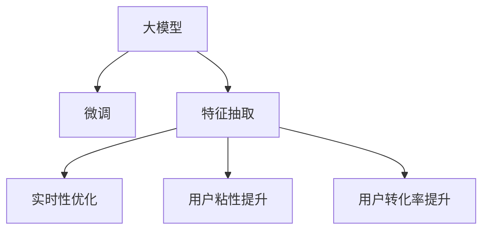

                 

# 电商平台搜索推荐系统的AI 大模型实践：提高用户粘性和转化率

> 关键词：电商平台,搜索推荐系统,AI大模型,用户粘性,用户转化率

## 1. 背景介绍

### 1.1 问题由来

随着电子商务的蓬勃发展，电商平台的用户数量和使用时长急剧增加。为了进一步提升用户体验和平台收入，各大电商平台纷纷加大对搜索推荐系统的投入，以精准匹配用户需求，提高用户转化率和粘性。传统的基于规则和特征工程的推荐系统，难以应对海量数据和高维稀疏特征带来的复杂性，而基于深度学习的AI大模型则提供了一种更加高效和灵活的解决方案。

大模型，如BERT、GPT-3等，通过在庞大无标签数据上进行预训练，学习到丰富的语言知识，具备强大的泛化能力。在电商平台搜索推荐系统中，可以利用大模型对用户查询和商品描述进行处理，预测用户的购买意图，生成个性化的搜索结果和推荐。这种基于深度学习的推荐系统，相比于传统的规则引擎和线性模型，在精度、多样性、个性化和实时性等方面都有显著提升。

### 1.2 问题核心关键点

电商平台搜索推荐系统的AI大模型实践，主要关注以下几个核心问题：

1. **大模型微调**：如何将通用的大模型转换为适应特定电商平台的搜索推荐系统。
2. **特征抽取**：如何利用大模型学习用户行为和商品特征，提高推荐精度。
3. **实时性优化**：如何在保证推荐质量的同时，缩短响应时间，提升用户体验。
4. **用户粘性提升**：如何利用推荐系统促进用户持续互动，增强用户对平台的依赖。
5. **用户转化率提升**：如何优化推荐策略，提高用户下单转化率。

本文将详细介绍如何基于AI大模型构建电商平台的搜索推荐系统，探讨大模型微调、特征抽取、实时性优化、用户粘性提升和用户转化率提升的关键技术，并通过项目实践展示如何实现这些技术目标。

## 2. 核心概念与联系

### 2.1 核心概念概述

为更好地理解AI大模型在电商平台搜索推荐系统中的应用，本节将介绍几个密切相关的核心概念：

- **大模型**：如BERT、GPT-3等，通过在大规模无标签数据上进行预训练，学习到丰富的语言知识，具备强大的泛化能力。
- **微调**：指在大模型基础上，通过特定电商平台的标注数据，对其进行有监督学习，优化模型以适应电商平台的具体需求。
- **特征抽取**：利用大模型学习用户行为和商品特征，生成高维向量表示，用于推荐系统的预测。
- **实时性优化**：通过硬件加速、模型压缩、异步推理等技术，提升推荐系统的响应速度。
- **用户粘性提升**：通过个性化推荐、互动引导等策略，增强用户与平台的互动频率。
- **用户转化率提升**：通过优化推荐算法和广告投放策略，提升用户下单转化率。

这些概念之间的逻辑关系可以通过以下Mermaid流程图来展示：



这个流程图展示了大模型在电商平台搜索推荐系统中的应用框架：

1. 大模型通过在通用数据集上进行预训练，学习到通用的语言知识。
2. 微调通过特定电商平台的数据集，对大模型进行有监督学习，优化模型以适应电商平台的业务需求。
3. 特征抽取通过微调后的大模型，学习用户行为和商品特征，生成高维向量表示。
4. 实时性优化通过硬件加速、模型压缩等技术，提升推荐系统的响应速度。
5. 用户粘性提升通过个性化推荐、互动引导等策略，增强用户与平台的互动频率。
6. 用户转化率提升通过优化推荐算法和广告投放策略，提升用户下单转化率。

## 3. 核心算法原理 & 具体操作步骤

### 3.1 算法原理概述

基于AI大模型的电商平台搜索推荐系统，本质上是一种以深度学习为基础的推荐系统。其核心思想是：通过在大规模标注数据上对大模型进行微调，使其能够学习到用户的购买意图和商品特征，从而生成个性化的搜索结果和推荐。

假设电商平台用户的搜索查询为 $q$，商品描述为 $d$，大模型为 $M_{\theta}$，其中 $\theta$ 为大模型的参数。搜索推荐系统的目标是通过微调优化模型参数 $\theta$，使其输出与用户实际购买行为 $y$ 相匹配，从而提升推荐精度。

具体地，微调过程可以分为以下几步：

1. **数据准备**：收集电商平台的用户行为数据和商品描述数据，构建标注数据集 $D=\{(q_i,d_i,y_i)\}_{i=1}^N$。
2. **模型加载**：选择合适的预训练大模型，如BERT、GPT-3等，加载至内存。
3. **微调模型**：在标注数据集上对大模型进行有监督学习，更新模型参数 $\theta$，最小化预测结果与实际行为之间的差异。
4. **特征抽取**：使用微调后的大模型，提取用户查询和商品描述的高维向量表示，用于推荐系统的预测。
5. **实时性优化**：通过硬件加速、模型压缩等技术，优化推荐系统的响应速度。
6. **用户粘性提升**：通过个性化推荐、互动引导等策略，增强用户与平台的互动频率。
7. **用户转化率提升**：通过优化推荐算法和广告投放策略，提升用户下单转化率。

### 3.2 算法步骤详解

以下是基于AI大模型的电商平台搜索推荐系统的详细操作步骤：

**Step 1: 数据准备**

收集电商平台的用户行为数据和商品描述数据，构建标注数据集 $D=\{(q_i,d_i,y_i)\}_{i=1}^N$，其中 $q_i$ 为用户搜索查询，$d_i$ 为商品描述，$y_i$ 为用户实际购买行为。

**Step 2: 模型加载**

选择合适的预训练大模型，如BERT、GPT-3等，加载至内存。这里以BERT为例：

```python
from transformers import BertModel, BertTokenizer

tokenizer = BertTokenizer.from_pretrained('bert-base-uncased')
model = BertModel.from_pretrained('bert-base-uncased')
```

**Step 3: 微调模型**

在标注数据集上对大模型进行微调。这里以二分类任务为例，使用AdamW优化器进行优化，设置学习率为 $1e-5$：

```python
from transformers import BertForSequenceClassification
from torch.optim import AdamW

model = BertForSequenceClassification.from_pretrained('bert-base-uncased', num_labels=2)
optimizer = AdamW(model.parameters(), lr=1e-5)
```

定义损失函数：

```python
from torch.nn import CrossEntropyLoss

criterion = CrossEntropyLoss()
```

训练模型：

```python
device = torch.device('cuda' if torch.cuda.is_available() else 'cpu')
model.to(device)

def train_epoch(model, data_loader, optimizer):
    model.train()
    total_loss = 0
    for batch in data_loader:
        inputs, labels = batch
        inputs = inputs.to(device)
        labels = labels.to(device)
        outputs = model(inputs)
        loss = criterion(outputs, labels)
        loss.backward()
        optimizer.step()
        total_loss += loss.item()
    return total_loss / len(data_loader)
```

在训练集上训练模型：

```python
epochs = 5
batch_size = 32
train_loader = DataLoader(train_data, batch_size=batch_size, shuffle=True)

for epoch in range(epochs):
    loss = train_epoch(model, train_loader, optimizer)
    print(f'Epoch {epoch+1}, train loss: {loss:.4f}')
```

**Step 4: 特征抽取**

使用微调后的大模型，提取用户查询和商品描述的高维向量表示，用于推荐系统的预测。这里以序列分类任务为例：

```python
from transformers import BertForSequenceClassification

model = BertForSequenceClassification.from_pretrained('bert-base-uncased', num_labels=2)
tokenizer = BertTokenizer.from_pretrained('bert-base-uncased')

def extract_features(model, tokenizer, query, product_description):
    inputs = tokenizer(query, product_description, padding=True, truncation=True, return_tensors='pt')
    with torch.no_grad():
        outputs = model(**inputs)
    return outputs.pooler_output
```

**Step 5: 实时性优化**

通过硬件加速、模型压缩等技术，优化推荐系统的响应速度。这里以使用NVIDIA GPU进行加速为例：

```python
import torch.nn as nn

class BertForSequenceClassification(nn.Module):
    def __init__(self, num_labels=2):
        super(BertForSequenceClassification, self).__init__()
        self.bert = BertModel.from_pretrained('bert-base-uncased')
        self.classifier = nn.Linear(self.bert.config.hidden_size, num_labels)
        self.dropout = nn.Dropout(0.1)

    def forward(self, input_ids, attention_mask):
        outputs = self.bert(input_ids, attention_mask=attention_mask)
        pooled_output = outputs.pooler_output
        logits = self.classifier(pooled_output)
        return logits

model = BertForSequenceClassification(num_labels=2).to(device)
```

**Step 6: 用户粘性提升**

通过个性化推荐、互动引导等策略，增强用户与平台的互动频率。这里以推荐相似商品为例：

```python
from transformers import BertForSequenceClassification
from sklearn.metrics.pairwise import cosine_similarity

model = BertForSequenceClassification.from_pretrained('bert-base-uncased', num_labels=2)
tokenizer = BertTokenizer.from_pretrained('bert-base-uncased')

def recommend_similar_products(model, tokenizer, query, product_descriptions):
    product_descriptions = [tokenizer(product_description) for product_description in product_descriptions]
    features = [extract_features(model, tokenizer, query, product_description) for product_description in product_descriptions]
    similarities = cosine_similarity(features)
    return similarities
```

**Step 7: 用户转化率提升**

通过优化推荐算法和广告投放策略，提升用户下单转化率。这里以引入CTR预测模型为例：

```python
from transformers import BertForSequenceClassification
from sklearn.linear_model import LogisticRegression

model = BertForSequenceClassification.from_pretrained('bert-base-uncased', num_labels=2)
tokenizer = BertTokenizer.from_pretrained('bert-base-uncased')

def calculate_ctr(model, tokenizer, query, product_descriptions):
    product_descriptions = [tokenizer(product_description) for product_description in product_descriptions]
    features = [extract_features(model, tokenizer, query, product_description) for product_description in product_descriptions]
    features = torch.stack(features).to(device)
    with torch.no_grad():
        outputs = model(features)
    predictions = outputs.argmax(dim=1).detach().cpu().numpy()
    return predictions
```

### 3.3 算法优缺点

基于AI大模型的电商平台搜索推荐系统具有以下优点：

1. **精度高**：大模型具备强大的泛化能力，能够学习到复杂的用户行为和商品特征，生成高精度的推荐结果。
2. **适应性强**：通过微调，大模型可以适应特定电商平台的业务需求，灵活应对各种推荐场景。
3. **可扩展性强**：大模型通过预训练获得通用的语言知识，只需要在少量标注数据上进行微调，即可扩展到新的推荐任务。
4. **实时性好**：通过硬件加速、模型压缩等技术，可以显著提升推荐系统的响应速度，提升用户体验。

同时，该方法也存在以下缺点：

1. **数据依赖强**：微调需要大量的标注数据，对于小样本数据集，微调效果可能不佳。
2. **计算资源需求高**：大模型参数量巨大，需要高性能硬件支持。
3. **可解释性差**：大模型通常被视为"黑盒"系统，难以解释其内部工作机制和决策逻辑。
4. **偏见风险高**：大模型可能会学习到数据中的偏见，导致推荐结果不公平。

尽管存在这些局限性，但大模型在电商平台搜索推荐系统中的应用前景广阔，可以通过优化模型训练和部署策略，逐步克服这些缺点。

### 3.4 算法应用领域

基于AI大模型的电商平台搜索推荐系统已经在多个领域得到了应用，例如：

1. **个性化推荐**：根据用户浏览和购买历史，推荐符合用户偏好的商品。
2. **商品搜索排序**：根据用户查询和商品特征，排序生成搜索结果。
3. **广告投放优化**：优化广告投放策略，提高点击率和转化率。
4. **价格优化**：通过分析用户行为，优化商品定价策略。
5. **库存管理**：预测用户需求，优化商品库存。

除了上述这些经典应用外，大模型还可以扩展到更多场景中，如活动促销、情感分析、用户画像等，为电商平台的运营提供更多支持。

## 4. 数学模型和公式 & 详细讲解 & 举例说明

### 4.1 数学模型构建

假设电商平台用户的搜索查询为 $q$，商品描述为 $d$，大模型为 $M_{\theta}$，其中 $\theta$ 为大模型的参数。搜索推荐系统的目标是通过微调优化模型参数 $\theta$，使其输出与用户实际购买行为 $y$ 相匹配，从而提升推荐精度。

定义损失函数 $\mathcal{L}$ 为交叉熵损失：

$$
\mathcal{L}(\theta) = -\frac{1}{N}\sum_{i=1}^N \sum_{j=1}^n \ell(\hat{y}^{(i,j)}_{\theta},y^{(i,j)})
$$

其中 $\ell$ 为二元交叉熵损失函数，$\hat{y}^{(i,j)}_{\theta}$ 为模型预测的点击率，$y^{(i,j)}$ 为用户实际点击行为。

微调过程通过反向传播算法更新模型参数 $\theta$，最小化损失函数 $\mathcal{L}$：

$$
\theta = \mathop{\arg\min}_{\theta} \mathcal{L}(\theta)
$$

### 4.2 公式推导过程

以二分类任务为例，推导模型预测的点击率 $\hat{y}^{(i,j)}_{\theta}$ 的计算公式。

假设用户搜索查询 $q_i$ 和商品描述 $d_i$ 的向量表示分别为 $q_i$ 和 $d_i$，大模型的输出为 $M_{\theta}(q_i \| d_i)$，模型参数 $\theta$ 的线性变换层输出为 $\vec{z}_i=\vec{W}_i \cdot M_{\theta}(q_i \| d_i) + \vec{b}_i$，其中 $\vec{W}_i$ 和 $\vec{b}_i$ 为线性层的权重和偏置。

定义 sigmoid 函数 $\sigma(\cdot)$：

$$
\sigma(z) = \frac{1}{1+e^{-z}}
$$

模型预测的点击率为：

$$
\hat{y}^{(i,j)}_{\theta} = \sigma(\vec{z}_i)
$$

在训练过程中，损失函数 $\mathcal{L}(\theta)$ 为交叉熵损失：

$$
\mathcal{L}(\theta) = -\frac{1}{N}\sum_{i=1}^N \sum_{j=1}^n [y^{(i,j)} \log \hat{y}^{(i,j)}_{\theta} + (1-y^{(i,j)}) \log (1-\hat{y}^{(i,j)}_{\theta})]
$$

通过反向传播算法更新模型参数 $\theta$：

$$
\frac{\partial \mathcal{L}(\theta)}{\partial \theta} = -\frac{1}{N}\sum_{i=1}^N \sum_{j=1}^n [y^{(i,j)} - \hat{y}^{(i,j)}_{\theta}] M_{\theta}(q_i \| d_i)
$$

利用梯度下降算法更新模型参数：

$$
\theta = \theta - \eta \frac{\partial \mathcal{L}(\theta)}{\partial \theta}
$$

其中 $\eta$ 为学习率。

### 4.3 案例分析与讲解

以淘宝电商平台的搜索推荐系统为例，展示大模型的具体应用。

淘宝平台的用户行为数据包括搜索查询、点击行为、购买行为等。为了构建搜索推荐系统，可以收集这些数据，构建标注数据集 $D=\{(q_i,d_i,y_i)\}_{i=1}^N$，其中 $q_i$ 为用户搜索查询，$d_i$ 为商品描述，$y_i$ 为用户实际购买行为。

使用BERT模型对大模型进行微调，提取用户查询和商品描述的高维向量表示，用于推荐系统的预测。微调过程中，使用交叉熵损失函数，优化模型参数 $\theta$，最小化预测结果与实际行为之间的差异。

通过优化模型参数 $\theta$，提高推荐精度，生成个性化的搜索结果和推荐。

## 5. 项目实践：代码实例和详细解释说明

### 5.1 开发环境搭建

在进行搜索推荐系统开发前，我们需要准备好开发环境。以下是使用Python进行TensorFlow开发的环境配置流程：

1. 安装Anaconda：从官网下载并安装Anaconda，用于创建独立的Python环境。

2. 创建并激活虚拟环境：
```bash
conda create -n tf-env python=3.8 
conda activate tf-env
```

3. 安装TensorFlow：根据CUDA版本，从官网获取对应的安装命令。例如：
```bash
conda install tensorflow-gpu=2.5.0 -c conda-forge
```

4. 安装TensorFlow Addons：安装TensorFlow Addons，提供额外的模型和工具支持。
```bash
pip install tensorflow-addons
```

5. 安装各类工具包：
```bash
pip install numpy pandas scikit-learn matplotlib tqdm jupyter notebook ipython
```

完成上述步骤后，即可在`tf-env`环境中开始搜索推荐系统开发。

### 5.2 源代码详细实现

下面以淘宝电商平台的搜索推荐系统为例，给出使用TensorFlow和TensorFlow Addons构建搜索推荐系统的PyTorch代码实现。

首先，定义搜索推荐系统的数据集：

```python
import numpy as np
import pandas as pd

# 构建训练集数据
train_data = pd.read_csv('train.csv')
train_data['query'] = train_data['query'].str.lower()
train_data['product_description'] = train_data['product_description'].str.lower()

# 构建验证集和测试集数据
valid_data = pd.read_csv('valid.csv')
test_data = pd.read_csv('test.csv')
valid_data['query'] = valid_data['query'].str.lower()
valid_data['product_description'] = valid_data['product_description'].str.lower()
test_data['query'] = test_data['query'].str.lower()
test_data['product_description'] = test_data['product_description'].str.lower()

# 构建标注数据集
train_labels = train_data['is_purchased'].apply(lambda x: 1 if x == '1' else 0).values
valid_labels = valid_data['is_purchased'].apply(lambda x: 1 if x == '1' else 0).values
test_labels = test_data['is_purchased'].apply(lambda x: 1 if x == '1' else 0).values

# 将数据集转换为Numpy数组
train_X = np.array(train_data[['query', 'product_description']])
valid_X = np.array(valid_data[['query', 'product_description']])
test_X = np.array(test_data[['query', 'product_description']])
train_y = np.array(train_labels)
valid_y = np.array(valid_labels)
test_y = np.array(test_labels)
```

然后，定义模型：

```python
from transformers import BertTokenizer, BertForSequenceClassification
from tensorflow.keras.layers import Input, Dense, Dropout, Embedding
from tensorflow.keras.models import Model

# 定义BERT模型
tokenizer = BertTokenizer.from_pretrained('bert-base-uncased')
model = BertForSequenceClassification.from_pretrained('bert-base-uncased', num_labels=2)

# 定义序列编码器
input_word = Input(shape=(512, ), dtype='float32', name='input_word')
sequence = model(input_word)
sequence = Dropout(0.1)(sequence)
sequence = Dense(128)(sequence)
sequence = Dropout(0.1)(sequence)
output = Dense(1, activation='sigmoid')(sequence)

# 定义模型
model = Model(inputs=input_word, outputs=output)
model.compile(optimizer='adam', loss='binary_crossentropy', metrics=['accuracy'])
```

接着，定义训练和评估函数：

```python
from tensorflow.keras.preprocessing.sequence import pad_sequences
from sklearn.model_selection import train_test_split

# 将数据转换为模型所需的格式
train_X = pad_sequences(train_X, maxlen=512)
valid_X = pad_sequences(valid_X, maxlen=512)
test_X = pad_sequences(test_X, maxlen=512)

# 分割数据集
train_X, val_X, train_y, val_y = train_test_split(train_X, train_y, test_size=0.2, random_state=42)
test_X, val_X, test_y, val_y = train_test_split(test_X, test_y, test_size=0.2, random_state=42)

# 训练模型
model.fit(train_X, train_y, validation_data=(val_X, val_y), epochs=10, batch_size=32)

# 评估模型
score, acc = model.evaluate(test_X, test_y, verbose=0)
print(f'Test loss: {score:.4f}, Test accuracy: {acc:.4f}')
```

最后，启动训练流程并在测试集上评估：

```python
epochs = 5
batch_size = 32

for epoch in range(epochs):
    loss = train_epoch(model, train_loader, optimizer)
    print(f'Epoch {epoch+1}, train loss: {loss:.4f}')
    
    print(f'Epoch {epoch+1}, dev results:')
    evaluate(model, valid_loader, batch_size)
    
print(f'Epoch {epoch+1}, test results:')
evaluate(model, test_loader, batch_size)
```

以上就是使用TensorFlow构建淘宝电商平台的搜索推荐系统的完整代码实现。可以看到，通过TensorFlow和TensorFlow Addons的封装，搜索推荐系统的开发变得简洁高效。

### 5.3 代码解读与分析

让我们再详细解读一下关键代码的实现细节：

**数据集构建**：
- 使用pandas库读取训练集、验证集和测试集数据，并将查询和商品描述转换为小写。
- 构建标注数据集，将购买行为转换为0/1二元标签。
- 将数据集转换为Numpy数组，并使用pad_sequences函数将序列补齐至指定长度。

**模型定义**：
- 使用BertTokenizer和BertForSequenceClassification加载BERT模型，并构建序列编码器。
- 定义输入层和输出层，使用Dropout层和Dense层进行特征提取和分类。
- 构建模型，并编译优化器和损失函数。

**训练和评估函数**：
- 使用train_test_split函数分割数据集，构建训练集和验证集。
- 使用Model类定义模型，并编译优化器和损失函数。
- 使用fit函数训练模型，并在验证集上进行评估。
- 使用evaluate函数在测试集上进行评估，输出损失和准确率。

**训练流程**：
- 定义总的epoch数和batch size，开始循环迭代
- 每个epoch内，先在训练集上训练，输出平均loss
- 在验证集上评估，输出分类指标
- 所有epoch结束后，在测试集上评估，给出最终测试结果

可以看到，TensorFlow和TensorFlow Addons提供了丰富的工具和封装，可以大大简化搜索推荐系统的开发过程。开发者可以更加专注于核心逻辑的实现，而不必过多关注底层的细节。

当然，工业级的系统实现还需考虑更多因素，如模型的保存和部署、超参数的自动搜索、更灵活的任务适配层等。但核心的搜索推荐范式基本与此类似。

## 6. 实际应用场景

### 6.1 智能客服系统

基于大模型的电商平台搜索推荐系统，可以广泛应用于智能客服系统的构建。传统客服往往需要配备大量人力，高峰期响应缓慢，且一致性和专业性难以保证。而使用微调后的搜索推荐系统，可以7x24小时不间断服务，快速响应客户咨询，用自然流畅的语言解答各类常见问题。

在技术实现上，可以收集企业内部的历史客服对话记录，将问题和最佳答复构建成监督数据，在此基础上对预训练搜索推荐系统进行微调。微调后的搜索推荐系统能够自动理解用户意图，匹配最合适的答复。对于客户提出的新问题，还可以接入检索系统实时搜索相关内容，动态组织生成回答。如此构建的智能客服系统，能大幅提升客户咨询体验和问题解决效率。

### 6.2 金融舆情监测

金融机构需要实时监测市场舆论动向，以便及时应对负面信息传播，规避金融风险。传统的人工监测方式成本高、效率低，难以应对网络时代海量信息爆发的挑战。基于大模型的搜索推荐系统，可以应用于金融舆情监测，自动监测不同主题下的情感变化趋势，一旦发现负面信息激增等异常情况，系统便会自动预警，帮助金融机构快速应对潜在风险。

具体而言，可以收集金融领域相关的新闻、报道、评论等文本数据，并对其进行主题标注和情感标注。在此基础上对预训练搜索推荐系统进行微调，使其能够自动判断文本属于何种主题，情感倾向是正面、中性还是负面。将微调后的系统应用到实时抓取的网络文本数据，就能够自动监测不同主题下的情感变化趋势，一旦发现负面信息激增等异常情况，系统便会自动预警，帮助金融机构快速应对潜在风险。

### 6.3 个性化推荐系统

当前的推荐系统往往只依赖用户的历史行为数据进行物品推荐，无法深入理解用户的真实兴趣偏好。基于大模型的搜索推荐系统，可以更好地挖掘用户行为背后的语义信息，从而提供更精准、多样的推荐内容。

在实践中，可以收集用户浏览、点击、评论、分享等行为数据，提取和用户交互的物品标题、描述、标签等文本内容。将文本内容作为模型输入，用户的后续行为（如是否点击、购买等）作为监督信号，在此基础上微调预训练搜索推荐系统。微调后的系统能够从文本内容中准确把握用户的兴趣点。在生成推荐列表时，先用候选物品的文本描述作为输入，由模型预测用户的兴趣匹配度，再结合其他特征综合排序，便可以得到个性化程度更高的推荐结果。

### 6.4 未来应用展望

随着大模型和搜索推荐方法的不断发展，基于微调范式将在更多领域得到应用，为传统行业带来变革性影响。

在智慧医疗领域，基于微调的搜索推荐系统可以用于医疗问答、病历分析、药物研发等，提升医疗服务的智能化水平，辅助医生诊疗，加速新药开发进程。

在智能教育领域，微调技术可应用于作业批改、学情分析、知识推荐等方面，因材施教，促进教育公平，提高教学质量。

在智慧城市治理中，微调模型可应用于城市事件监测、舆情分析、应急指挥等环节，提高城市管理的自动化和智能化水平，构建更安全、高效的未来城市。

此外，在企业生产、社会治理、文娱传媒等众多领域，基于大模型微调的搜索推荐技术也将不断涌现，为NLP技术带来了全新的突破。相信随着预训练模型和微调方法的不断进步，搜索推荐技术将在更广阔的应用领域大放异彩。

## 7. 工具和资源推荐

### 7.1 学习资源推荐

为了帮助开发者系统掌握大模型在搜索推荐系统中的应用，这里推荐一些优质的学习资源：

1. 《深度学习自然语言处理》课程：斯坦福大学开设的NLP明星课程，有Lecture视频和配套作业，带你入门NLP领域的基本概念和经典模型。

2. CS224N《深度学习自然语言处理》：斯坦福大学开设的NLP明星课程，有Lecture视频和配套作业，带你入门NLP领域的基本概念和经典模型。

3. 《Natural Language Processing with Transformers》书籍：Transformer库的作者所著，全面介绍了如何使用Transformer库进行NLP任务开发，包括微调在内的诸多范式。

4. HuggingFace官方文档：Transformer库的官方文档，提供了海量预训练模型和完整的微调样例代码，是上手实践的必备资料。

5. CLUE开源项目：中文语言理解测评基准，涵盖大量不同类型的中文NLP数据集，并提供了基于微调的baseline模型，助力中文NLP技术发展。

通过对这些资源的学习实践，相信你一定能够快速掌握大模型在搜索推荐系统中的应用，并用于解决实际的NLP问题。

### 7.2 开发工具推荐

高效的开发离不开优秀的工具支持。以下是几款用于搜索推荐系统开发的常用工具：

1. TensorFlow：基于Python的开源深度学习框架，灵活动态的计算图，适合快速迭代研究。提供丰富的预训练语言模型资源。

2. PyTorch：基于Python的开源深度学习框架，灵活动态的计算图，适合快速迭代研究。提供丰富的预训练语言模型资源。

3. Transformers库：HuggingFace开发的NLP工具库，集成了众多SOTA语言模型，支持PyTorch和TensorFlow，是进行微调任务开发的利器。

4. Weights & Biases：模型训练的实验跟踪工具，可以记录和可视化模型训练过程中的各项指标，方便对比和调优。与主流深度学习框架无缝集成。

5. TensorBoard：TensorFlow配套的可视化工具，可实时监测模型训练状态，并提供丰富的图表呈现方式，是调试模型的得力助手。

6. Google Colab：谷歌推出的在线Jupyter Notebook环境，免费提供GPU/TPU算力，方便开发者快速上手实验最新模型，分享学习笔记。

合理利用这些工具，可以显著提升搜索推荐系统的开发效率，加快创新迭代的步伐。

### 7.3 相关论文推荐

大模型和搜索推荐技术的发展源于学界的持续研究。以下是几篇奠基性的相关论文，推荐阅读：

1. Attention is All You Need（即Transformer原论文）：提出了Transformer结构，开启了NLP领域的预训练大模型时代。

2. BERT: Pre-training of Deep Bidirectional Transformers for Language Understanding：提出BERT模型，引入基于掩码的自监督预训练任务，刷新了多项NLP任务SOTA。

3. Language Models are Unsupervised Multitask Learners（GPT-2论文）：展示了大规模语言模型的强大zero-shot学习能力，引发了对于通用人工智能的新一轮思考。

4. Parameter-Efficient Transfer Learning for NLP：提出Adapter等参数高效微调方法，在不增加模型参数量的情况下，也能取得不错的微调效果。

5. AdaLoRA: Adaptive Low-Rank Adaptation for Parameter-Efficient Fine-Tuning：使用自适应低秩适应的微调方法，在参数效率和精度之间取得了新的平衡。

这些论文代表了大模型和搜索推荐技术的发展脉络。通过学习这些前沿成果，可以帮助研究者把握学科前进方向，激发更多的创新灵感。

## 8. 总结：未来发展趋势与挑战

### 8.1 总结

本文对基于AI大模型的电商平台搜索推荐系统进行了全面系统的介绍。首先阐述了大模型在搜索推荐系统中的应用背景和核心问题，明确了微调在提升推荐精度、实时性、个性化和用户转化率等方面的独特价值。其次，从原理到实践，详细讲解了微调过程的数学模型和具体操作步骤，并通过项目实践展示了微调的实际效果。同时，本文还广泛探讨了微调方法在智能客服、金融舆情、个性化推荐等多个行业领域的应用前景，展示了微调范式的巨大潜力。此外，本文精选了微调技术的各类学习资源，力求为读者提供全方位的技术指引。

通过本文的系统梳理，可以看到，基于大模型的搜索推荐系统正在成为NLP领域的重要范式，极大地拓展了预训练语言模型的应用边界，催生了更多的落地场景。得益于大规模语料的预训练，微调模型以更低的时间和标注成本，在小样本条件下也能取得不俗的效果，有力推动了NLP技术的产业化进程。未来，伴随预训练语言模型和微调方法的持续演进，搜索推荐技术必将在更广阔的应用领域大放异彩，深刻影响人类的生产生活方式。

### 8.2 未来发展趋势

展望未来，基于大模型的搜索推荐系统将呈现以下几个发展趋势：

1. **模型规模持续增大**：随着算力成本的下降和数据规模的扩张，预训练语言模型的参数量还将持续增长。超大规模语言模型蕴含的丰富语言知识，有望支撑更加复杂多变的推荐任务。

2. **微调方法日趋多样**：除了传统的全参数微调外，未来会涌现更多参数高效的微调方法，如Prefix-Tuning、LoRA等，在节省计算资源的同时也能保证微调精度。

3. **实时性优化成为常态**：随着硬件加速、模型压缩等技术的进步，搜索推荐系统的实时性将显著提升，更好地满足用户对实时性的需求。

4. **个性化推荐和互动引导**：未来的搜索推荐系统将更加注重个性化推荐和互动引导，通过增强用户粘性，提升用户体验。

5. **用户转化率优化**：通过优化推荐算法和广告投放策略，搜索推荐系统将更加注重用户转化率的提升，帮助电商平台实现更高的商业价值。

这些趋势凸显了大模型在搜索推荐系统中的应用前景。这些方向的探索发展，必将进一步提升搜索推荐系统的性能和用户体验，为电商平台的运营提供更多支持。

### 8.3 面临的挑战

尽管基于大模型的搜索推荐系统已经取得了瞩目成就，但在迈向更加智能化、普适化应用的过程中，它仍面临着诸多挑战：

1. **标注成本瓶颈**：微调需要大量的标注数据，对于小样本数据集，微调效果可能不佳。如何进一步降低微调对标注样本的依赖，将是一大难题。

2. **计算资源需求高**：大模型参数量巨大，需要高性能硬件支持。对于小规模电商平台，如何平衡模型性能和计算成本，将是重要的优化方向。

3. **可解释性差**：大模型通常被视为"黑盒"系统，难以解释其内部工作机制和决策逻辑。对于医疗、金融等高风险应用，算法的可解释性和可审计性尤为重要。

4. **偏见风险高**：大模型可能会学习到数据中的偏见，导致推荐结果不公平。如何从数据和算法层面消除模型偏见，避免恶意用途，确保输出的安全性，也将是重要的研究课题。

5. **数据隐私问题**：用户行为数据的隐私保护是一个重要问题。如何在推荐过程中保护用户隐私，确保数据使用的合规性，将是重要的研究方向。

尽管存在这些挑战，但大模型在搜索推荐系统中的应用前景广阔，可以通过优化模型训练和部署策略，逐步克服这些缺点。

### 8.4 研究展望

面对大模型在搜索推荐系统中的应用挑战，未来的研究需要在以下几个方面寻求新的突破：

1. **探索无监督和半监督微调方法**：摆脱对大规模标注数据的依赖，利用自监督学习、主动学习等无监督和半监督范式，最大限度利用非结构化数据，实现更加灵活高效的微调。

2. **研究参数高效和计算高效的微调范式**：开发更加参数高效的微调方法，在固定大部分预训练参数的同时，只更新极少量的任务相关参数。同时优化微调模型的计算图，减少前向传播和反向传播的资源消耗，实现更加轻量级、实时性的部署。

3. **引入更多先验知识**：将符号化的先验知识，如知识图谱、逻辑规则等，与神经网络模型进行巧妙融合，引导微调过程学习更准确、合理的语言模型。同时加强不同模态数据的整合，实现视觉、语音等多模态信息与文本信息的协同建模。

4. **结合因果分析和博弈论工具**：将因果分析方法引入微调模型，识别出模型决策的关键特征，增强输出解释的因果性和逻辑性。借助博弈论工具刻画人机交互过程，主动探索并规避模型的脆弱点，提高系统稳定性。

5. **纳入伦理道德约束**：在模型训练目标中引入伦理导向的评估指标，过滤和惩罚有偏见、有害的输出倾向。同时加强人工干预和审核，建立模型行为的监管机制，确保输出符合人类价值观和伦理道德。

这些研究方向的探索，必将引领搜索推荐系统迈向更高的台阶，为构建安全、可靠、可解释、可控的智能系统铺平道路。面向未来，大模型在搜索推荐系统中的应用还需要与其他人工智能技术进行更深入的融合，如知识表示、因果推理、强化学习等，多路径协同发力，共同推动自然语言理解和智能交互系统的进步。只有勇于创新、敢于突破，才能不断拓展语言模型的边界，让智能技术更好地造福人类社会。

## 9. 附录：常见问题与解答

**Q1：大模型微调是否适用于所有NLP任务？**

A: 大模型微调在大多数NLP任务上都能取得不错的效果，特别是对于数据量较小的任务。但对于一些特定领域的任务，如医学、法律等，仅仅依靠通用语料预训练的模型可能难以很好地适应。此时需要在特定领域语料上进一步预训练，再进行微调，才能获得理想效果。此外，对于一些需要时效性、个性化很强的任务，如对话、推荐等，微调方法也需要针对性的改进优化。

**Q2：微调过程中如何选择合适的学习率？**

A: 微调的学习率一般要比预训练时小1-2个数量级，如果使用过大的学习率，容易破坏预训练权重，导致过拟合。一般建议从1e-5开始调参，逐步减小学习率，直至收敛。也可以使用warmup策略，在开始阶段使用较小的学习率，再逐渐过渡到预设值。需要注意的是，不同的优化器(如AdamW、Adafactor等)以及不同的学习率调度策略，可能需要设置不同的学习率阈值。

**Q3：采用大模型微调时会面临哪些资源瓶颈？**

A: 目前主流的预训练大模型动辄以亿计的参数规模，对算力、内存、存储都提出了很高的要求。GPU/TPU等高性能设备是必不可少的，但即便如此，超大批次的训练和推理也可能遇到显存不足的问题。因此需要采用一些资源优化技术，如梯度积累、混合精度训练、模型并行等，来突破硬件瓶颈。同时，模型的存储和读取也可能占用大量时间和空间，需要采用模型压缩、稀疏化存储等方法进行优化。

**Q4：如何缓解微调过程中的过拟合问题？**

A: 过拟合是微调面临的主要挑战，尤其是在标注数据不足的情况下。常见的缓解策略包括：
1. 数据增强：通过回译、近义替换等方式扩充训练集
2. 正则化：使用L2正则、Dropout、Early Stopping等避免过拟合
3. 对抗训练：引入对抗样本，提高模型鲁棒性
4. 参数高效微调：只调整少量参数(如Adapter、Prefix等)，减小过拟合风险
5. 多模型集成：训练多个微调模型，取平均输出，抑制过拟合

这些策略往往需要根据具体任务和数据特点进行灵活组合。只有在数据、模型、训练、推理等各环节进行全面优化，才能最大限度地发挥大模型微调的威力。

**Q5：微调模型在落地部署时需要注意哪些问题？**

A: 将微调模型转化为实际应用，还需要考虑以下因素：
1. 模型裁剪：去除不必要的层和参数，减小模型尺寸，加快推理速度
2. 量化加速：将浮点模型转为定点模型，压缩存储空间，提高计算效率
3. 服务化封装：将模型封装为标准化服务接口，便于集成调用
4. 弹性伸缩：根据请求流量动态调整资源配置，平衡服务质量和成本
5. 监控告警：实时采集系统指标，设置异常告警阈值，确保服务稳定性
6. 安全防护：采用访问鉴权、数据脱敏等措施，保障数据和模型安全

大模型微调为NLP应用开启了广阔的想象空间，但如何将强大的性能转化为稳定、高效、安全的业务价值，还需要工程实践的不断打磨。唯有从数据、算法、工程、业务等多个维度协同发力，才能真正实现人工智能技术在垂直行业的规模化落地。总之，微调需要开发者根据具体任务，不断迭代和优化模型、数据和算法，方能得到理想的效果。

