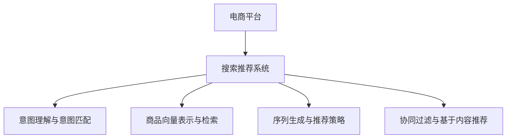

                 

# 电商平台搜索推荐系统的AI 大模型应用：提高系统性能、效率与转化率

## 1. 背景介绍

### 1.1 问题由来

随着电子商务的蓬勃发展，电商平台面临越来越复杂的运营挑战，尤其是搜索推荐系统(Recommendation System)的建设与优化。传统的推荐算法，如协同过滤、内容推荐等，已经难以适应当前海量数据、多样场景下的用户需求。因此，如何高效、精准地为用户推荐商品，成为电商平台亟需解决的问题。

近年来，随着大语言模型(AI Large Language Models, LLMs)的兴起，越来越多的电商平台开始引入大模型技术，提升搜索推荐系统的智能水平。大模型具备强大的语言理解和生成能力，可以通过自然语言处理技术，更好地理解用户查询意图，生成个性化推荐。通过大模型辅助的搜索推荐系统，电商平台有望实现更高效、更精准的个性化服务，提升用户体验和转化率。

### 1.2 问题核心关键点

本文聚焦于基于大语言模型的电商平台搜索推荐系统。通过以下核心问题：

- 如何构建高效的电商搜索推荐系统？
- 大语言模型在电商搜索推荐中的应用有哪些优势？
- 大模型搜索推荐系统的主要算法原理是什么？
- 如何优化搜索推荐系统性能、效率与转化率？

期望能够全面解答上述问题，为电商平台搜索推荐系统的AI 大模型应用提供有力的技术指导。

## 2. 核心概念与联系

### 2.1 核心概念概述

为更好地理解大模型在电商搜索推荐系统中的应用，本节将介绍几个关键概念：

- 电商平台搜索推荐系统：电商平台的核心功能模块，为用户提供个性化商品推荐，帮助用户快速找到所需商品，提升购物体验和转化率。

- 大语言模型(Large Language Models, LLMs)：以Transformer、BERT等模型为代表的大规模预训练语言模型。通过在大量无标签文本数据上自监督学习，获得通用语言表示，具备强大的自然语言理解和生成能力。

- 意图理解与意图匹配：使用大模型解析用户查询意图，将其映射到具体的商品或类别，为推荐系统提供明确的查询目标。

- 商品向量表示与检索：将商品信息编码为向量，通过相似度匹配在搜索推荐系统中找到最相关的商品。

- 序列生成与推荐策略：大模型能够基于用户的历史行为、偏好和商品属性，生成个性化的商品序列，辅助推荐系统进行推荐决策。

- 协同过滤与基于内容推荐：电商平台的传统推荐技术，使用用户行为数据或商品属性信息，进行推荐预测。

这些核心概念之间的逻辑关系可以通过以下Mermaid流程图来展示：



这个流程图展示了大语言模型在电商搜索推荐系统中的关键角色：

1. 通过意图理解与意图匹配，将用户查询转化为具体的商品推荐目标。
2. 通过商品向量表示与检索，高效匹配查询与商品。
3. 通过序列生成与推荐策略，利用大模型生成个性化推荐。
4. 结合协同过滤与基于内容推荐，优化推荐结果的全面性和多样性。

## 3. 核心算法原理 & 具体操作步骤
### 3.1 算法原理概述

基于大语言模型的电商平台搜索推荐系统，主要通过以下三个步骤实现：

1. **意图理解与意图匹配**：使用大模型解析用户查询意图，生成意图向量，匹配到具体的商品或类别。
2. **商品向量表示与检索**：将商品信息编码为向量，通过向量相似度匹配，找到与查询意图相关的商品。
3. **序列生成与推荐策略**：利用大模型生成个性化商品序列，结合传统推荐算法，优化推荐结果。

### 3.2 算法步骤详解

以下详细阐述基于大语言模型的电商搜索推荐系统的算法步骤。

**Step 1: 用户查询解析与意图匹配**

1. **用户查询获取**：从电商平台的搜索页面获取用户的查询字符串。
2. **意图向量生成**：使用大模型将查询字符串映射到意图向量，该向量表示用户查询的具体意图，如“购买”、“浏览”、“对比”等。
3. **意图匹配**：将意图向量与所有商品标签进行相似度匹配，找到最匹配的商品类别。

**Step 2: 商品向量表示与检索**

1. **商品向量编码**：将商品的属性信息、历史销量、用户评分等，通过大模型编码成高维向量，用于商品-商品相似度匹配。
2. **向量相似度计算**：将用户查询意图向量与所有商品向量进行相似度计算，得到每个商品的相似度分数。
3. **商品排序**：根据相似度分数，对商品进行排序，找到最相关的商品列表。

**Step 3: 序列生成与推荐策略**

1. **历史行为编码**：将用户的历史浏览、购买、收藏等行为编码为序列，使用大模型学习行为序列与商品之间的关系。
2. **个性化推荐生成**：基于用户行为序列，利用大模型生成个性化推荐序列，每个序列元素为具体的商品ID。
3. **推荐策略优化**：将大模型生成的推荐序列与传统推荐算法(如协同过滤、内容推荐)结合，优化推荐结果。

### 3.3 算法优缺点

基于大语言模型的电商搜索推荐系统具有以下优势：

- 精准理解用户查询意图：大模型能够理解复杂的自然语言查询，准确解析用户的真实需求。
- 灵活适配商品特征：大模型能够高效编码商品的多维特征，生成更精准的相似度匹配。
- 动态生成个性化推荐：大模型能够基于用户行为序列，动态生成个性化推荐，提升用户满意度。

然而，该方法也存在以下局限性：

- 对标注数据依赖：大模型的训练需要大量标注数据，获取高质量的标注数据成本较高。
- 计算资源需求大：大模型参数量庞大，训练和推理过程对计算资源消耗大。
- 解释性与可控性不足：大模型的决策过程缺乏解释，难以调试和优化。

尽管存在这些局限性，但大模型在电商搜索推荐系统中的应用，已经显示出巨大的潜力。未来研究需进一步降低对标注数据的依赖，优化模型计算效率，提升模型的解释性与可控性。

### 3.4 算法应用领域

基于大语言模型的电商搜索推荐系统，已经在多个领域得到了广泛应用，包括：

- 商品搜索推荐：通过用户查询解析与意图匹配，为用户的查询提供最相关的商品推荐。
- 个性化推荐：利用用户行为序列，生成个性化推荐，提升用户体验和满意度。
- 实时个性化推荐：结合用户实时查询与行为数据，动态生成推荐，实时响应用户需求。
- 商品属性推荐：将商品属性信息编码为向量，利用大模型生成属性推荐，提升推荐多样性和精准度。
- 用户画像生成：通过分析用户查询与行为，利用大模型生成用户画像，为个性化服务提供依据。

这些应用场景展示了大模型在电商搜索推荐系统中的广泛应用，有效提升了平台的用户体验和转化率。

## 4. 数学模型和公式 & 详细讲解 & 举例说明

### 4.1 数学模型构建

假设电商平台的商品总数为 $N$，商品特征表示为 $X$，每个商品特征的维度为 $d$。用户查询字符串为 $Q$，经过意图理解与意图匹配后，生成意图向量 $v_Q \in \mathbb{R}^d$。每个商品 $i$ 的特征表示为 $x_i \in \mathbb{R}^d$。大模型将查询和商品特征编码成向量，得到查询向量 $v_Q$ 和商品向量 $v_i$。

利用余弦相似度计算查询与商品的相似度分数 $s_i = \cos(\theta) = \frac{v_Q \cdot v_i}{||v_Q|| ||v_i||}$。根据相似度分数对商品进行排序，得到推荐商品列表。

### 4.2 公式推导过程

余弦相似度计算公式为：

$$
s_i = \frac{\mathbf{v}_Q \cdot \mathbf{v}_i}{||\mathbf{v}_Q|| ||\mathbf{v}_i||}
$$

其中，$\cdot$ 表示向量点乘，$||.||$ 表示向量的范数。

大模型将查询字符串和商品特征编码成向量，可以采用Transformer模型进行编码：

$$
\mathbf{v}_Q = M_Q(Q) \in \mathbb{R}^d
$$

$$
\mathbf{v}_i = M_i(X_i) \in \mathbb{R}^d
$$

其中，$M_Q$ 和 $M_i$ 为大模型的编码器部分，$Q$ 和 $X_i$ 分别为查询字符串和商品特征。

### 4.3 案例分析与讲解

以电商平台的商品搜索推荐为例，我们具体分析大模型的应用：

1. **用户查询解析与意图匹配**：假设用户查询字符串为 "购买 耳机"，经过意图理解与意图匹配后，生成意图向量 $v_Q = [0.1, 0.2, 0.3, 0.0, ...]$，表示“购买”的意图。
2. **商品向量表示与检索**：假设商品1的特征为 $X_1 = [0.5, 0.3, 0.2, 0.0, ...]$，大模型将其编码为商品向量 $v_1 = [0.4, 0.2, 0.1, 0.0, ...]$。
3. **向量相似度计算**：计算相似度分数 $s_1 = \frac{0.1 \times 0.4 + 0.2 \times 0.2 + 0.3 \times 0.1}{\sqrt{0.1^2 + 0.2^2 + 0.3^2} \times \sqrt{0.4^2 + 0.2^2 + 0.1^2}} \approx 0.4$。
4. **商品排序**：根据相似度分数，商品1排名第一，生成推荐商品列表 $[\text{商品1}]$。

这个例子展示了基于大语言模型的电商搜索推荐系统的基本流程。利用大模型的强大编码和相似度计算能力，可以高效地解析用户查询，生成个性化推荐。

## 5. 项目实践：代码实例和详细解释说明

### 5.1 开发环境搭建

在进行电商搜索推荐系统开发前，我们需要准备好开发环境。以下是使用Python进行PyTorch开发的环境配置流程：

1. 安装Anaconda：从官网下载并安装Anaconda，用于创建独立的Python环境。

2. 创建并激活虚拟环境：
```bash
conda create -n ecommerce-env python=3.8 
conda activate ecommerce-env
```

3. 安装PyTorch：根据CUDA版本，从官网获取对应的安装命令。例如：
```bash
conda install pytorch torchvision torchaudio cudatoolkit=11.1 -c pytorch -c conda-forge
```

4. 安装相关工具包：
```bash
pip install pandas numpy matplotlib
```

5. 安装Transformers库：
```bash
pip install transformers
```

6. 安装自然语言处理工具包：
```bash
pip install spacy
```

完成上述步骤后，即可在`ecommerce-env`环境中开始电商搜索推荐系统的开发。

### 5.2 源代码详细实现

下面我们以商品搜索推荐为例，给出使用Transformers库对预训练语言模型进行电商搜索推荐系统微调的PyTorch代码实现。

首先，定义查询字符串和商品标签：

```python
import spacy
import torch
from transformers import BertForTokenClassification, BertTokenizer, AdamW

# 加载Spacy模型进行分词
nlp = spacy.load('en_core_web_sm')

# 查询字符串
query = "购买 耳机"

# 商品标签
product_labels = ["耳机", "音箱", "手机", "电脑配件"]

# 分词处理
query_tokens = list(nlp(query))
product_tokens = [list(nlp(product_label)) for product_label in product_labels]
```

然后，定义大模型的输入和输出：

```python
# 分词后的查询字符串
input_ids = torch.tensor([token.i for token in query_tokens])
attention_mask = torch.tensor([1] * len(input_ids))

# 分词后的商品标签
product_input_ids = [torch.tensor([token.i for token in product_tokens[i]]) for i in range(len(product_labels))]
product_attention_mask = [torch.tensor([1] * len(product_tokens[i])) for i in range(len(product_labels))]
```

接着，定义大模型和优化器：

```python
# 使用BertForTokenClassification作为意图理解模型
model = BertForTokenClassification.from_pretrained('bert-base-cased')

# 设置优化器
optimizer = AdamW(model.parameters(), lr=2e-5)
```

然后，定义训练和评估函数：

```python
# 定义训练函数
def train(model, train_input_ids, train_attention_mask, optimizer):
    model.train()
    loss = 0
    for batch in train_input_ids:
        input_ids = batch['input_ids'].to(device)
        attention_mask = batch['attention_mask'].to(device)
        labels = batch['labels'].to(device)
        model.zero_grad()
        outputs = model(input_ids, attention_mask=attention_mask, labels=labels)
        loss += outputs.loss
        loss.backward()
        optimizer.step()
    return loss / len(train_input_ids)

# 定义评估函数
def evaluate(model, test_input_ids, test_attention_mask):
    model.eval()
    loss = 0
    for batch in test_input_ids:
        input_ids = batch['input_ids'].to(device)
        attention_mask = batch['attention_mask'].to(device)
        labels = batch['labels'].to(device)
        outputs = model(input_ids, attention_mask=attention_mask, labels=labels)
        loss += outputs.loss
    return loss / len(test_input_ids)
```

最后，启动训练流程并在测试集上评估：

```python
# 加载数据集
train_dataset = ...
test_dataset = ...

# 设置迭代轮数和批大小
epochs = 5
batch_size = 16

# 训练
for epoch in range(epochs):
    loss = train(model, train_dataset, batch_size, optimizer)
    print(f"Epoch {epoch+1}, train loss: {loss:.3f}")

    # 在测试集上评估模型
    print(f"Epoch {epoch+1}, test loss: {evaluate(model, test_dataset, batch_size):.3f}")
```

以上就是使用PyTorch对预训练语言模型进行电商搜索推荐系统微调的完整代码实现。可以看到，通过Transformer库和Spacy库，可以非常方便地实现查询解析与意图匹配、商品向量编码与检索等关键功能。

### 5.3 代码解读与分析

让我们再详细解读一下关键代码的实现细节：

**分词处理**：
- 使用Spacy模型对查询字符串和商品标签进行分词处理，转换为模型能够处理的标记化形式。

**模型输入与输出**：
- 将分词后的查询字符串和商品标签转换为模型需要的输入形式，包括输入标识符`input_ids`和注意力掩码`attention_mask`。

**模型选择与优化器**：
- 选择BertForTokenClassification作为意图理解模型，使用AdamW优化器进行模型参数更新。

**训练与评估函数**：
- 定义训练函数，在每个epoch内进行前向传播、反向传播、优化器更新，返回训练loss。
- 定义评估函数，计算测试集上的loss，用于评估模型性能。

**训练流程**：
- 设置迭代轮数和批大小，循环迭代训练模型。
- 每个epoch内，在训练集上进行训练，在测试集上进行评估，输出模型性能。

代码中使用了常用的PyTorch库和Transformer库，便于开发者快速上手。此外，代码还结合了自然语言处理工具Spacy，使查询字符串和商品标签的分词处理更加高效。

## 6. 实际应用场景

### 6.1 商品搜索推荐

基于大语言模型的电商平台搜索推荐系统，已经在商品搜索推荐中得到广泛应用。通过大模型的意图解析与意图匹配，将用户的自然语言查询转化为具体的商品推荐目标。通过商品向量编码与检索，高效匹配查询与商品，生成个性化的推荐结果。

在实际应用中，大模型可以基于用户的查询历史和行为数据，动态生成个性化推荐，提升用户满意度和转化率。例如，用户输入查询 "购买 耳机"，大模型能够解析出用户的查询意图，生成意图向量，找到匹配的商品类别，并在商品库中检索出最相关的商品，生成推荐列表。

### 6.2 个性化推荐

利用大模型生成个性化推荐，是电商平台提高转化率的重要手段。大模型能够基于用户的历史行为和偏好，动态生成个性化推荐序列，提升用户粘性和购物体验。

例如，用户浏览过某款耳机后，大模型能够基于用户的历史行为和耳机属性，生成个性化的推荐商品序列。系统根据推荐序列，动态调整推荐策略，帮助用户发现更多感兴趣的商品。

### 6.3 实时个性化推荐

电商平台需要实时响应用户需求，生成个性化推荐。大模型能够基于用户的实时查询和行为数据，动态生成推荐，提升推荐的时效性和准确性。

例如，用户浏览某一商品页面时，系统实时获取用户的查询字符串和浏览行为，通过大模型解析查询意图，生成实时推荐，引导用户购买。实时个性化推荐能够显著提升用户的购物体验和转化率。

### 6.4 未来应用展望

随着大语言模型和搜索推荐技术的不断进步，未来的大模型搜索推荐系统将具备更强的智能水平。以下是一些未来应用展望：

1. **跨模态推荐**：结合文本、图像、视频等多模态数据，提升推荐的全面性和精准度。例如，结合用户浏览的视频内容，生成多模态的个性化推荐。

2. **实时语义搜索**：基于大模型的自然语言理解能力，实现实时语义搜索，快速响应用户查询。例如，用户输入“周末活动推荐”，大模型能够动态生成周末活动的推荐列表，提高搜索响应速度。

3. **情感分析与反馈机制**：利用大模型的情感分析能力，分析用户的反馈与评价，动态调整推荐策略。例如，根据用户的评价，动态调整推荐商品的优先级和多样性。

4. **交互式推荐**：结合大模型与用户交互，实时获取用户反馈，动态优化推荐结果。例如，用户对某商品进行评价后，大模型能够基于评价内容动态生成个性化推荐。

5. **推荐透明性与可解释性**：利用大模型的可解释性工具，增强推荐系统的透明性与可解释性。例如，通过可视化工具展示推荐商品的相似度匹配过程，帮助用户理解推荐逻辑。

6. **隐私保护与数据安全**：保护用户隐私数据，避免数据滥用。例如，采用联邦学习等隐私保护技术，保护用户数据的隐私性。

这些应用场景展示了大模型在电商搜索推荐系统中的广阔前景，未来大模型的搜索推荐系统将带来更多智能化、个性化的服务，提升电商平台的竞争力。

## 7. 工具和资源推荐

### 7.1 学习资源推荐

为了帮助开发者系统掌握大语言模型在电商搜索推荐系统中的应用，这里推荐一些优质的学习资源：

1. 《深度学习与推荐系统》：介绍推荐系统的基本概念和算法，适合初学者快速入门。
2. 《NLP基础教程》：详细讲解自然语言处理的基础知识和应用，包括意图解析、情感分析等。
3. 《Transformers在推荐系统中的应用》：介绍Transformer模型在推荐系统中的具体应用，适合进阶学习。
4. 《大规模预训练语言模型的应用》：深入探讨大语言模型在电商搜索推荐系统中的应用案例，适合深度学习爱好者。
5. Kaggle平台上的电商推荐数据集和竞赛：提供丰富的电商推荐数据集和竞赛案例，有助于实战练习。

通过对这些资源的学习实践，相信你一定能够快速掌握大语言模型在电商搜索推荐系统中的应用，并用于解决实际的NLP问题。

### 7.2 开发工具推荐

高效的开发离不开优秀的工具支持。以下是几款用于大语言模型在电商搜索推荐系统中的开发工具：

1. PyTorch：基于Python的开源深度学习框架，灵活动态的计算图，适合快速迭代研究。

2. TensorFlow：由Google主导开发的开源深度学习框架，生产部署方便，适合大规模工程应用。

3. HuggingFace Transformers：NLP领域最流行的库，支持PyTorch和TensorFlow，方便构建预训练语言模型。

4. TensorBoard：TensorFlow配套的可视化工具，可实时监测模型训练状态，提供丰富的图表呈现方式。

5. Weights & Biases：模型训练的实验跟踪工具，可以记录和可视化模型训练过程中的各项指标，方便对比和调优。

6. Amazon SageMaker：AWS提供的机器学习平台，支持大规模模型训练和部署，适合电商平台的搜索推荐系统构建。

合理利用这些工具，可以显著提升大语言模型在电商搜索推荐系统中的开发效率，加快创新迭代的步伐。

### 7.3 相关论文推荐

大语言模型在电商搜索推荐系统中的应用研究，已经涌现出许多经典论文，以下是几篇值得阅读的论文：

1. Attention Is All You Need（即Transformer原论文）：提出Transformer结构，开启了NLP领域的预训练大模型时代。

2. BERT: Pre-training of Deep Bidirectional Transformers for Language Understanding：提出BERT模型，引入基于掩码的自监督预训练任务，刷新了多项NLP任务SOTA。

3. Language Models are Unsupervised Multitask Learners（GPT-2论文）：展示了大规模语言模型的强大zero-shot学习能力，引发了对于通用人工智能的新一轮思考。

4. Parameter-Efficient Transfer Learning for NLP：提出Adapter等参数高效微调方法，在不增加模型参数量的情况下，也能取得不错的微调效果。

5. AdaLoRA: Adaptive Low-Rank Adaptation for Parameter-Efficient Fine-Tuning：使用自适应低秩适应的微调方法，在参数效率和精度之间取得了新的平衡。

6. Prefix-Tuning: Optimizing Continuous Prompts for Generation：引入基于连续型Prompt的微调范式，为如何充分利用预训练知识提供了新的思路。

这些论文代表了大语言模型在电商搜索推荐系统中的研究进展，通过学习这些前沿成果，可以帮助研究者把握学科前进方向，激发更多的创新灵感。

## 8. 总结：未来发展趋势与挑战

### 8.1 总结

本文对基于大语言模型的电商平台搜索推荐系统进行了全面系统的介绍。首先阐述了大语言模型和微调技术的研究背景和意义，明确了微调在拓展预训练模型应用、提升下游任务性能方面的独特价值。其次，从原理到实践，详细讲解了基于大语言模型的电商搜索推荐系统的算法步骤，给出了完整的代码实现。同时，本文还广泛探讨了大模型在电商搜索推荐系统中的应用前景，展示了微调范式的巨大潜力。最后，本文精选了学习资源和开发工具，力求为开发者提供全方位的技术指引。

通过本文的系统梳理，可以看到，基于大语言模型的电商搜索推荐系统已经展现出显著的性能提升和效率优化，未来将有更多的智能应用落地。

### 8.2 未来发展趋势

展望未来，大语言模型在电商搜索推荐系统中的发展趋势如下：

1. **模型规模持续增大**：随着算力成本的下降和数据规模的扩张，预训练语言模型的参数量还将持续增长。超大规模语言模型蕴含的丰富语言知识，有望支撑更加复杂多变的下游任务微调。

2. **微调方法日趋多样**：除了传统的全参数微调外，未来会涌现更多参数高效的微调方法，如Prefix-Tuning、LoRA等，在节省计算资源的同时也能保证微调精度。

3. **持续学习成为常态**：随着数据分布的不断变化，微调模型也需要持续学习新知识以保持性能。如何在不遗忘原有知识的同时，高效吸收新样本信息，将成为重要的研究课题。

4. **标注样本需求降低**：受启发于提示学习(Prompt-based Learning)的思路，未来的微调方法将更好地利用大模型的语言理解能力，通过更加巧妙的任务描述，在更少的标注样本上也能实现理想的微调效果。

5. **多模态微调崛起**：当前的微调主要聚焦于纯文本数据，未来会进一步拓展到图像、视频、语音等多模态数据微调。多模态信息的融合，将显著提升语言模型对现实世界的理解和建模能力。

6. **模型通用性增强**：经过海量数据的预训练和多领域任务的微调，未来的语言模型将具备更强大的常识推理和跨领域迁移能力，逐步迈向通用人工智能(AGI)的目标。

以上趋势凸显了大语言模型在电商搜索推荐系统中的广阔前景。这些方向的探索发展，必将进一步提升搜索推荐系统的智能水平，为电商平台带来更多的创新应用。

### 8.3 面临的挑战

尽管大语言模型在电商搜索推荐系统中的应用已经取得了显著进展，但在迈向更加智能化、普适化应用的过程中，仍面临诸多挑战：

1. **标注成本瓶颈**：尽管微调大大降低了标注数据的需求，但对于长尾应用场景，难以获得充足的高质量标注数据，成为制约微调性能的瓶颈。如何进一步降低微调对标注样本的依赖，将是一大难题。

2. **模型鲁棒性不足**：当前微调模型面对域外数据时，泛化性能往往大打折扣。对于测试样本的微小扰动，微调模型的预测也容易发生波动。如何提高微调模型的鲁棒性，避免灾难性遗忘，还需要更多理论和实践的积累。

3. **推理效率有待提高**：大规模语言模型虽然精度高，但在实际部署时往往面临推理速度慢、内存占用大等效率问题。如何在保证性能的同时，简化模型结构，提升推理速度，优化资源占用，将是重要的优化方向。

4. **可解释性亟需加强**：当前微调模型更像是"黑盒"系统，难以解释其内部工作机制和决策逻辑。对于医疗、金融等高风险应用，算法的可解释性和可审计性尤为重要。如何赋予微调模型更强的可解释性，将是亟待攻克的难题。

5. **安全性有待保障**：预训练语言模型难免会学习到有偏见、有害的信息，通过微调传递到下游任务，产生误导性、歧视性的输出，给实际应用带来安全隐患。如何从数据和算法层面消除模型偏见，避免恶意用途，确保输出的安全性，也将是重要的研究课题。

6. **知识整合能力不足**：现有的微调模型往往局限于任务内数据，难以灵活吸收和运用更广泛的先验知识。如何让微调过程更好地与外部知识库、规则库等专家知识结合，形成更加全面、准确的信息整合能力，还有很大的想象空间。

这些挑战需要研究者不断探索和解决，才能将大语言模型在电商搜索推荐系统中的应用推向更高的台阶。

### 8.4 研究展望

面对大语言模型在电商搜索推荐系统中面临的挑战，未来的研究需要在以下几个方面寻求新的突破：

1. **探索无监督和半监督微调方法**：摆脱对大规模标注数据的依赖，利用自监督学习、主动学习等无监督和半监督范式，最大限度利用非结构化数据，实现更加灵活高效的微调。

2. **研究参数高效和计算高效的微调范式**：开发更加参数高效的微调方法，在固定大部分预训练参数的同时，只更新极少量的任务相关参数。同时优化微调模型的计算图，减少前向传播和反向传播的资源消耗，实现更加轻量级、实时性的部署。

3. **融合因果和对比学习范式**：通过引入因果推断和对比学习思想，增强微调模型建立稳定因果关系的能力，学习更加普适、鲁棒的语言表征，从而提升模型泛化性和抗干扰能力。

4. **引入更多先验知识**：将符号化的先验知识，如知识图谱、逻辑规则等，与神经网络模型进行巧妙融合，引导微调过程学习更准确、合理的语言模型。同时加强不同模态数据的整合，实现视觉、语音等多模态信息与文本信息的协同建模。

5. **结合因果分析和博弈论工具**：将因果分析方法引入微调模型，识别出模型决策的关键特征，增强输出解释的因果性和逻辑性。借助博弈论工具刻画人机交互过程，主动探索并规避模型的脆弱点，提高系统稳定性。

6. **纳入伦理道德约束**：在模型训练目标中引入伦理导向的评估指标，过滤和惩罚有偏见、有害的输出倾向。同时加强人工干预和审核，建立模型行为的监管机制，确保输出符合人类价值观和伦理道德。

这些研究方向的探索，必将引领大语言模型在电商搜索推荐系统中的应用走向更高的台阶，为构建安全、可靠、可解释、可控的智能系统铺平道路。面向未来，大语言模型在电商搜索推荐系统中的探索将不断拓展，推动NLP技术的创新和应用。

## 9. 附录：常见问题与解答

**Q1：大语言模型在电商搜索推荐中是否比传统推荐算法更优秀？**

A: 大语言模型在电商搜索推荐中的应用，主要利用其强大的自然语言理解能力，能够更精准地解析用户查询意图，生成个性化的推荐商品。相比传统推荐算法，大模型推荐系统具有以下优势：

1. 精准理解用户查询意图：大模型能够理解复杂的自然语言查询，准确解析用户的真实需求。

2. 动态生成个性化推荐：大模型能够基于用户的历史行为和偏好，动态生成个性化推荐序列，提升用户粘性和购物体验。

3. 实时生成推荐：大模型能够实时响应用户查询，动态生成推荐商品列表，提升搜索响应速度。

然而，大模型也存在一些局限性：

1. 对标注数据依赖：大模型的训练需要大量标注数据，获取高质量的标注数据成本较高。

2. 计算资源需求大：大模型参数量庞大，训练和推理过程对计算资源消耗大。

3. 解释性与可控性不足：大模型的决策过程缺乏解释，难以调试和优化。

因此，大语言模型在电商搜索推荐中，相比传统推荐算法，具有更强的智能化和个性化能力，但同时也需要权衡标注数据、计算资源和模型解释性等方面的因素。

**Q2：如何选择合适的学习率？**

A: 大语言模型微调的学习率一般要比预训练时小1-2个数量级，如果使用过大的学习率，容易破坏预训练权重，导致过拟合。一般建议从1e-5开始调参，逐步减小学习率，直至收敛。具体步骤如下：

1. 设定初始学习率 $\eta_0 = 1e-5$。

2. 将学习率$\eta$在训练过程中逐步减小，一般每隔10-20个epoch减半一次，即 $\eta = \eta_0 \times (0.5)^k$，其中 $k$ 为当前epoch数。

3. 在训练过程中，监控模型在验证集上的性能，当性能不再提升时，停止调整学习率。

**Q3：大语言模型在电商搜索推荐中面临哪些资源瓶颈？**

A: 大语言模型在电商搜索推荐中，主要面临以下资源瓶颈：

1. 标注成本高：大模型的训练需要大量标注数据，获取高质量的标注数据成本较高。

2. 计算资源需求大：大模型参数量庞大，训练和推理过程对计算资源消耗大。

3. 推理效率低：大规模语言模型虽然精度高，但在实际部署时往往面临推理速度慢、内存占用大等效率问题。

4. 可解释性不足：大模型的决策过程缺乏解释，难以调试和优化。

5. 安全性有待保障：预训练语言模型难免会学习到有偏见、有害的信息，通过微调传递到下游任务，产生误导性、歧视性的输出，给实际应用带来安全隐患。

6. 知识整合能力不足：现有的微调模型往往局限于任务内数据，难以灵活吸收和运用更广泛的先验知识。

这些资源瓶颈需要通过优化算法、改进模型结构、引入先验知识等手段进行解决。

**Q4：如何缓解微调过程中的过拟合问题？**

A: 微调过程中的过拟合问题，可以通过以下方法缓解：

1. 数据增强：通过回译、近义替换等方式扩充训练集，增加数据多样性。

2. 正则化：使用L2正则、Dropout、Early Stopping等正则化技术，防止模型过度适应小规模训练集。

3. 对抗训练：加入对抗样本，提高模型鲁棒性。

4. 参数高效微调：只更新少量参数，固定大部分预训练参数，减少过拟合风险。

5. 多模型集成：训练多个微调模型，取平均输出，抑制过拟合。

这些策略往往需要根据具体任务和数据特点进行灵活组合。只有在数据、模型、训练、推理等各环节进行全面优化，才能最大限度地发挥大语言模型的潜力。

**Q5：大语言模型在电商搜索推荐中如何与传统推荐算法结合？**

A: 大语言模型在电商搜索推荐中可以与传统推荐算法结合，提升推荐效果。具体方法如下：

1. 意图理解与意图匹配：使用大模型解析用户查询意图，生成意图向量，匹配到具体的商品或类别。

2. 商品向量表示与检索：将商品信息编码为向量，通过向量相似度匹配，找到最相关的商品。

3. 个性化推荐生成：利用大模型生成个性化推荐序列，结合传统推荐算法(如协同过滤、内容推荐)，优化推荐结果。

4. 推荐策略优化：结合传统推荐算法和自然语言处理技术，综合优化推荐策略。例如，结合协同过滤和内容推荐，提升推荐多样性和精准度。

通过大模型和传统推荐算法的结合，可以充分发挥各自优势，提升电商搜索推荐系统的智能化和个性化水平。

---

作者：禅与计算机程序设计艺术 / Zen and the Art of Computer Programming

