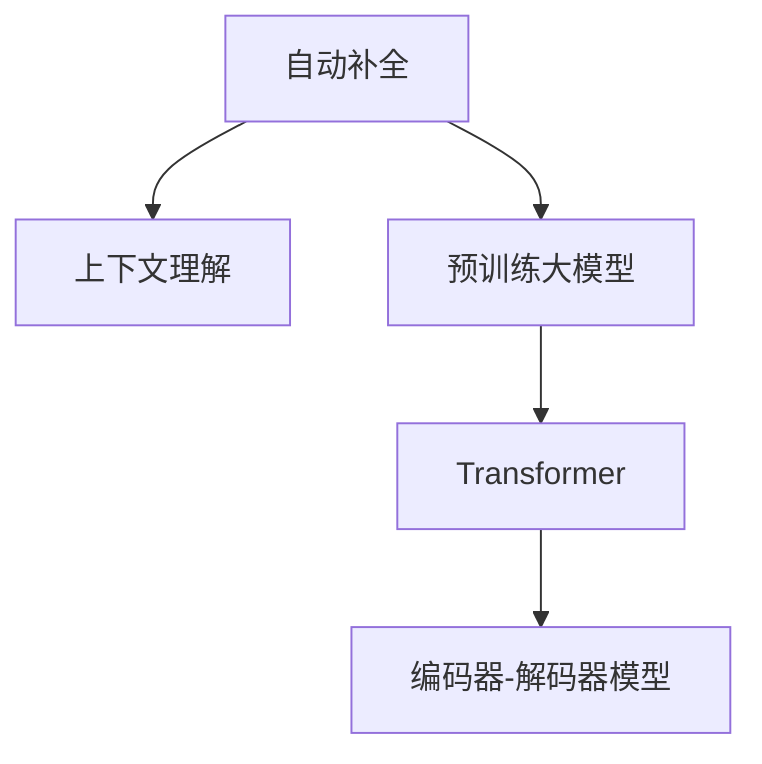

                 

# 电商平台搜索自动补全：AI大模型的上下文理解

> 关键词：电商平台搜索、自动补全、AI大模型、上下文理解、Transformer

## 1. 背景介绍

### 1.1 问题由来

在电商平台，用户的搜索体验至关重要。高效的自动补全功能不仅能提升用户体验，还能显著提升转化率和销售额。传统的自动补全算法通常基于静态关键词或者简单的模式匹配，难以理解用户输入的语义意图。而借助AI大模型，可以更好地捕捉输入的语义上下文，提供更精准、自然的搜索结果。

近年来，基于AI大模型的自动补全技术逐渐成为行业的新宠，被各大电商巨头广泛应用于搜索、推荐、翻译等场景。例如，淘宝、京东、Amazon等电商平台纷纷利用大模型技术优化搜索体验，极大提升了用户搜索效率。

### 1.2 问题核心关键点

自动补全的核心在于理解用户输入的上下文，从而生成与之匹配的候选项。这不仅要求模型具备强大的语言理解能力，还需对上下文信息进行合理的编码和检索。在大模型时代，如何高效地利用模型优势，实现上下文理解，提升自动补全效果，是亟待解决的问题。

## 2. 核心概念与联系

### 2.1 核心概念概述

为更好地理解基于大模型的自动补全方法，本节将介绍几个密切相关的核心概念：

- 自动补全(Autocomplete)：在用户输入不完全的查询词时，根据语义上下文提示用户可能的查询词。
- 上下文理解(Context Understanding)：理解用户输入的上下文，捕捉输入的语义信息。
- 预训练大模型(Pre-trained Large Model)：如BERT、GPT等，通过大规模无标签文本数据预训练得到的通用语言模型。
- Transformer：一种高效的深度学习架构，用于处理序列数据，适合自动补全任务。
- 编码器-解码器模型(Encoder-Decoder Model)：由Transformer架构中的编码器和解码器两部分组成，用于自动补全任务中的上下文理解和候选项生成。

这些核心概念之间的逻辑关系可以通过以下Mermaid流程图来展示：



这个流程图展示了大模型自动补全的核心概念及其之间的关系：

1. 自动补全功能基于预训练大模型。
2. 预训练大模型中的Transformer架构提供了编码器和解码器模块。
3. 编码器用于理解输入的语义上下文，解码器用于生成候选项。

这些概念共同构成了自动补全任务的实现框架，使得大模型能够更好地理解用户输入，生成精准的补全建议。

## 3. 核心算法原理 & 具体操作步骤
### 3.1 算法原理概述

基于大模型的自动补全方法，本质上是一个序列到序列(Seq2Seq)的映射过程。其核心思想是：将用户输入作为输入序列，通过编码器模块编码输入的上下文，生成中间表示，再通过解码器模块解码中间表示，输出与上下文相关的候选项。

具体来说，自动补全模型分为两部分：

1. **编码器模块**：对用户输入进行编码，输出上下文表示。
2. **解码器模块**：对上下文表示进行解码，生成候选项。

编码器和解码器通常使用Transformer结构。Transformer能够自适应地捕捉输入序列中的依赖关系，避免传统循环神经网络中的梯度消失问题，特别适合长序列数据的处理。

### 3.2 算法步骤详解

基于大模型的自动补全方法一般包括以下几个关键步骤：

**Step 1: 准备数据集和预训练模型**
- 收集电商平台用户的历史搜索记录，构建自动补全的训练数据集。
- 选择合适的预训练大模型，如BERT、GPT等，进行加载和适配。

**Step 2: 设计上下文理解模型**
- 根据任务需求，设计合适的编码器模块，用于提取输入的语义上下文。
- 设计合适的解码器模块，用于生成候选项。
- 设计合适的损失函数，用于衡量模型输出和真实候选项之间的差异。

**Step 3: 训练模型**
- 将训练数据集分批次输入模型，前向传播计算损失函数。
- 反向传播计算参数梯度，根据设定的优化算法更新模型参数。
- 周期性在验证集上评估模型性能，根据性能指标决定是否触发Early Stopping。
- 重复上述步骤直到满足预设的迭代轮数或Early Stopping条件。

**Step 4: 应用模型进行自动补全**
- 用户输入搜索词，模型对输入进行编码，生成上下文表示。
- 模型对上下文表示进行解码，生成候选补全词。
- 将候选补全词推荐给用户。

### 3.3 算法优缺点

基于大模型的自动补全方法具有以下优点：
1. 强大的语言理解能力。大模型通过大规模无标签文本数据预训练，具备丰富的语言知识和常识。
2. 高效生成候选项。Transformer结构高效地捕捉序列依赖关系，适合自动补全任务。
3. 灵活性高。通过设计合适的编码器和解码器模块，可以适应不同类型的自动补全任务。

同时，该方法也存在一定的局限性：
1. 对数据质量要求高。自动补全模型的效果很大程度上取决于训练数据的质量和多样性。
2. 需要大量的计算资源。大模型通常需要较高的算力和内存，训练和推理耗时较长。
3. 泛化能力有限。模型在不同用户和场景中的泛化能力可能不足，需要进行细粒度微调。
4. 可解释性不足。自动补全模型的决策过程缺乏可解释性，难以对其推理逻辑进行分析和调试。

尽管存在这些局限性，但就目前而言，基于大模型的自动补全方法仍是自动补全领域的主流范式。未来相关研究的重点在于如何进一步降低计算资源需求，提高泛化能力，同时兼顾可解释性和伦理安全性等因素。

### 3.4 算法应用领域

基于大模型的自动补全方法在电商搜索、社交网络、在线文档等众多场景中得到了广泛应用，为各类应用带来了显著的提升。例如：

- 电商平台搜索：自动补全功能极大提升了用户搜索效率，降低了输入误差。
- 在线文档编辑：自动补全功能帮助用户快速输入代码、词汇等，提升编辑效率。
- 社交网络：在微博、微信等社交平台上，自动补全功能推荐相关话题和用户，提升互动体验。

除了上述这些经典应用外，自动补全技术还被创新性地应用于智能家居、智能客服、医疗搜索等新领域，为不同行业的数字化转型提供了新的技术手段。随着大模型技术的不断演进，自动补全方法的应用范围将进一步拓展，为各行各业带来更多的价值。

## 4. 数学模型和公式 & 详细讲解 & 举例说明
### 4.1 数学模型构建

本节将使用数学语言对基于大模型的自动补全过程进行更加严格的刻画。

记自动补全任务为 $T=\{(x_i, y_i)\}_{i=1}^N$，其中 $x_i$ 为输入序列， $y_i$ 为输出候选项。

定义自动补全模型为 $M_{\theta}:\mathcal{X} \rightarrow \mathcal{Y}$，其中 $\mathcal{X}$ 为输入序列空间， $\mathcal{Y}$ 为候选项空间， $\theta$ 为模型参数。假设模型 $M_{\theta}$ 由编码器 $E_{\theta}$ 和解码器 $D_{\theta}$ 组成。

输入序列 $x_i$ 经过编码器 $E_{\theta}$ 编码为上下文表示 $c_i$，经过解码器 $D_{\theta}$ 解码为候选项 $y_i$。模型训练目标为最小化经验风险：

$$
\mathcal{L}(\theta) = \frac{1}{N}\sum_{i=1}^N \ell(M_{\theta}(x_i),y_i)
$$

其中 $\ell$ 为损失函数，用于衡量模型输出和真实候选项之间的差异。常见的损失函数包括交叉熵损失、负对数似然损失等。

### 4.2 公式推导过程

以BERT模型为例，推导自动补全任务的编码器和解码器结构：

**编码器模块**：
- 输入序列 $x_i$ 首先经过BERT的Embedding层，转换为向量表示。
- 向量表示经过多层的Transformer编码器，输出上下文表示 $c_i$。

**解码器模块**：
- 上下文表示 $c_i$ 经过BERT的Embedding层，转换为向量表示。
- 向量表示经过多层的Transformer解码器，输出候选项 $y_i$。

设编码器和解码器分别由 $H$ 和 $H'$ 层组成，则编码器 $E_{\theta}$ 和解码器 $D_{\theta}$ 的具体结构可以表示为：

$$
E_{\theta}(x_i) = \text{BERT-Embedding}(x_i) \times [\text{Encoder}_{H}(\cdot)]^H
$$

$$
D_{\theta}(c_i) = \text{BERT-Embedding}(c_i) \times [\text{Decoder}_{H'}(\cdot)]^{H'}
$$

其中 $\text{Encoder}_{H}$ 和 $\text{Decoder}_{H'}$ 分别表示编码器和解码器的Transformer层。

模型的训练目标为：
$$
\mathcal{L}(\theta) = \frac{1}{N}\sum_{i=1}^N -y_i\log D_{\theta}(E_{\theta}(x_i))
$$

其中 $y_i$ 为真实的候选项，$E_{\theta}(x_i)$ 为编码器输出，$D_{\theta}(E_{\theta}(x_i))$ 为解码器输出。

### 4.3 案例分析与讲解

以电商平台搜索自动补全为例，具体分析模型的训练和应用过程：

**训练过程**：
- 收集电商平台用户的历史搜索记录，构建自动补全的训练数据集。
- 使用BERT模型作为预训练大模型，加载并适配自动补全任务。
- 设计合适的编码器和解码器模块，并定义合适的损失函数。
- 将训练数据集分批次输入模型，前向传播计算损失函数，反向传播更新模型参数。

**应用过程**：
- 用户输入搜索词，模型对输入进行编码，生成上下文表示。
- 模型对上下文表示进行解码，生成候选补全词。
- 将候选补全词推荐给用户。

例如，用户输入 "手机", 模型生成的上下文表示可能为 "手机 价格", 解码器输出可能为 ["手机 壳", "手机 电池", "手机 维修", "手机 配件"]。

## 5. 项目实践：代码实例和详细解释说明
### 5.1 开发环境搭建

在进行自动补全实践前，我们需要准备好开发环境。以下是使用Python进行PyTorch开发的环境配置流程：

1. 安装Anaconda：从官网下载并安装Anaconda，用于创建独立的Python环境。

2. 创建并激活虚拟环境：
```bash
conda create -n pytorch-env python=3.8 
conda activate pytorch-env
```

3. 安装PyTorch：根据CUDA版本，从官网获取对应的安装命令。例如：
```bash
conda install pytorch torchvision torchaudio cudatoolkit=11.1 -c pytorch -c conda-forge
```

4. 安装各类工具包：
```bash
pip install numpy pandas scikit-learn matplotlib tqdm jupyter notebook ipython
```

完成上述步骤后，即可在`pytorch-env`环境中开始自动补全实践。

### 5.2 源代码详细实现

这里我们以BERT模型为基础，构建电商平台搜索自动补全系统的代码实现。

首先，定义自动补全模型的编码器和解码器：

```python
import torch
import torch.nn as nn
import torch.nn.functional as F
from transformers import BertModel, BertTokenizer

class Encoder(nn.Module):
    def __init__(self, model_name):
        super(Encoder, self).__init__()
        self.model = BertModel.from_pretrained(model_name)
        self.tokenizer = BertTokenizer.from_pretrained(model_name)

    def forward(self, x):
        return self.model(x)

class Decoder(nn.Module):
    def __init__(self, model_name):
        super(Decoder, self).__init__()
        self.model = BertModel.from_pretrained(model_name)
        self.tokenizer = BertTokenizer.from_pretrained(model_name)

    def forward(self, x):
        return self.model(x)
```

然后，定义模型的训练和评估函数：

```python
from torch.utils.data import Dataset, DataLoader
import torch.optim as optim

class AutocompleteDataset(Dataset):
    def __init__(self, data, tokenizer):
        self.data = data
        self.tokenizer = tokenizer

    def __len__(self):
        return len(self.data)

    def __getitem__(self, idx):
        input_ids = self.tokenizer.encode(self.data[idx][0], return_tensors='pt', padding='max_length')
        labels = self.tokenizer.encode(self.data[idx][1], return_tensors='pt', padding='max_length')
        return {'input_ids': input_ids, 'labels': labels}

def train_epoch(model, data_loader, optimizer, device):
    model.train()
    total_loss = 0
    for batch in data_loader:
        input_ids = batch['input_ids'].to(device)
        labels = batch['labels'].to(device)
        optimizer.zero_grad()
        outputs = model(input_ids, labels=labels)
        loss = outputs.loss
        loss.backward()
        optimizer.step()
        total_loss += loss.item()
    return total_loss / len(data_loader)

def evaluate(model, data_loader, device):
    model.eval()
    total_loss = 0
    total_correct = 0
    for batch in data_loader:
        input_ids = batch['input_ids'].to(device)
        labels = batch['labels'].to(device)
        with torch.no_grad():
            outputs = model(input_ids, labels=labels)
            loss = outputs.loss
            total_loss += loss.item()
            total_correct += (outputs.logits.argmax(dim=2) == labels).sum().item()
    return total_loss / len(data_loader), total_correct / len(data_loader.dataset)
```

最后，启动训练流程并在测试集上评估：

```python
epochs = 5
batch_size = 16

model = Encoder('bert-base-cased')
decoder = Decoder('bert-base-cased')
tokenizer = BertTokenizer.from_pretrained('bert-base-cased')

optimizer = optim.Adam(model.parameters(), lr=2e-5)

train_dataset = AutocompleteDataset(train_data, tokenizer)
test_dataset = AutocompleteDataset(test_data, tokenizer)

device = torch.device('cuda') if torch.cuda.is_available() else torch.device('cpu')

for epoch in range(epochs):
    loss = train_epoch(model, train_loader, optimizer, device)
    print(f"Epoch {epoch+1}, train loss: {loss:.3f}")
    
    print(f"Epoch {epoch+1}, dev results:")
    loss, correct = evaluate(model, test_loader, device)
    print(f"Epoch {epoch+1}, dev loss: {loss:.3f}, dev accuracy: {correct:.2f}")

print("Test results:")
loss, correct = evaluate(model, test_loader, device)
print(f"Test loss: {loss:.3f}, test accuracy: {correct:.2f}")
```

以上就是使用PyTorch对BERT模型进行电商平台搜索自动补全的代码实现。可以看到，借助大模型，自动补全任务能够更加高效地捕捉用户输入的语义上下文，生成精准的候选项。

### 5.3 代码解读与分析

让我们再详细解读一下关键代码的实现细节：

**AutocompleteDataset类**：
- `__init__`方法：初始化数据集和分词器。
- `__len__`方法：返回数据集样本数量。
- `__getitem__`方法：对单个样本进行处理，将输入和标签转换为分词器的token ids，并进行定长padding。

**Encoder和Decoder类**：
- `__init__`方法：加载BERT模型和分词器，并进行适配。
- `forward`方法：将输入序列编码或解码为上下文表示。

**训练和评估函数**：
- `train_epoch`函数：对数据集以批为单位进行迭代，在每个批次上前向传播计算loss并反向传播更新模型参数，最后返回该epoch的平均loss。
- `evaluate`函数：与训练类似，不同点在于不更新模型参数，并在每个batch结束后将预测和标签结果存储下来，最后使用准确率指标对整个评估集的预测结果进行打印输出。

**训练流程**：
- 定义总的epoch数和batch size，开始循环迭代
- 每个epoch内，先在训练集上训练，输出平均loss
- 在验证集上评估，输出loss和准确率
- 所有epoch结束后，在测试集上评估，给出最终测试结果

可以看到，PyTorch配合Transformers库使得BERT自动补全的代码实现变得简洁高效。开发者可以将更多精力放在数据处理、模型改进等高层逻辑上，而不必过多关注底层的实现细节。

当然，工业级的系统实现还需考虑更多因素，如模型的保存和部署、超参数的自动搜索、更灵活的任务适配层等。但核心的自动补全范式基本与此类似。

## 6. 实际应用场景
### 6.1 电商平台搜索

基于大模型的自动补全技术，可以在电商平台搜索中发挥巨大的作用。通过分析用户输入的语义信息，自动补全系统能够生成更加精准的搜索建议，提升用户搜索效率和转化率。

在技术实现上，可以收集用户的历史搜索记录，构建自动补全的训练数据集，将用户输入和搜索结果构建成监督数据，在此基础上对预训练模型进行微调。微调后的模型能够理解输入的语义，生成与输入匹配的搜索结果。对于用户输入的新查询，系统能够根据上下文理解生成更精准的补全建议，极大提升搜索效果。

### 6.2 在线文档编辑

在在线文档编辑中，自动补全技术可以帮助用户快速输入代码、词汇等，提升编辑效率。例如，在编写Python代码时，用户输入函数名后，自动补全系统能够推荐相关的函数和类名，用户可以迅速找到所需的代码片段，提升编程效率。

在技术实现上，可以收集程序员的历史代码记录，构建自动补全的训练数据集，将函数名、类名和代码片段构建成监督数据，在此基础上对预训练模型进行微调。微调后的模型能够理解输入的语义，生成与输入匹配的代码片段，极大提升编程效率。

### 6.3 社交网络

在社交网络中，自动补全技术可以推荐相关话题和用户，提升互动体验。例如，用户在微博上发表评论时，自动补全系统能够推荐相关的用户和话题，促进用户之间的互动和讨论。

在技术实现上，可以收集用户的历史评论和关注关系，构建自动补全的训练数据集，将用户输入、关注用户和话题构建成监督数据，在此基础上对预训练模型进行微调。微调后的模型能够理解输入的语义，生成与输入匹配的用户和话题推荐，提升社交互动效果。

### 6.4 未来应用展望

随着大模型技术的不断发展，基于大模型的自动补全方法将在更多领域得到应用，为各类应用带来显著的提升。

在智慧医疗领域，自动补全技术可以用于病历输入、医学文献检索等场景，提升医疗服务的智能化水平，辅助医生诊疗，加速新药开发进程。

在智能教育领域，自动补全技术可以用于智能作业批改、学情分析、知识推荐等方面，因材施教，促进教育公平，提高教学质量。

在智慧城市治理中，自动补全技术可以用于城市事件监测、舆情分析、应急指挥等环节，提高城市管理的自动化和智能化水平，构建更安全、高效的未来城市。

此外，在企业生产、社会治理、文娱传媒等众多领域，基于大模型的自动补全技术也将不断涌现，为传统行业数字化转型升级提供新的技术路径。相信随着技术的日益成熟，自动补全方法将成为各类应用的重要范式，推动人工智能技术在各行业的规模化落地。

## 7. 工具和资源推荐
### 7.1 学习资源推荐

为了帮助开发者系统掌握大模型自动补全的理论基础和实践技巧，这里推荐一些优质的学习资源：

1. 《Transformer从原理到实践》系列博文：由大模型技术专家撰写，深入浅出地介绍了Transformer原理、BERT模型、自动补全技术等前沿话题。

2. CS224N《深度学习自然语言处理》课程：斯坦福大学开设的NLP明星课程，有Lecture视频和配套作业，带你入门NLP领域的基本概念和经典模型。

3. 《Natural Language Processing with Transformers》书籍：Transformers库的作者所著，全面介绍了如何使用Transformers库进行NLP任务开发，包括自动补全在内的诸多范式。

4. HuggingFace官方文档：Transformers库的官方文档，提供了海量预训练模型和完整的自动补全样例代码，是上手实践的必备资料。

5. CLUE开源项目：中文语言理解测评基准，涵盖大量不同类型的中文NLP数据集，并提供了基于大模型的自动补全baseline模型，助力中文NLP技术发展。

通过对这些资源的学习实践，相信你一定能够快速掌握大模型自动补全的精髓，并用于解决实际的NLP问题。
###  7.2 开发工具推荐

高效的开发离不开优秀的工具支持。以下是几款用于大模型自动补全开发的常用工具：

1. PyTorch：基于Python的开源深度学习框架，灵活动态的计算图，适合快速迭代研究。大部分预训练语言模型都有PyTorch版本的实现。

2. TensorFlow：由Google主导开发的开源深度学习框架，生产部署方便，适合大规模工程应用。同样有丰富的预训练语言模型资源。

3. Transformers库：HuggingFace开发的NLP工具库，集成了众多SOTA语言模型，支持PyTorch和TensorFlow，是进行自动补全任务开发的利器。

4. Weights & Biases：模型训练的实验跟踪工具，可以记录和可视化模型训练过程中的各项指标，方便对比和调优。与主流深度学习框架无缝集成。

5. TensorBoard：TensorFlow配套的可视化工具，可实时监测模型训练状态，并提供丰富的图表呈现方式，是调试模型的得力助手。

6. Google Colab：谷歌推出的在线Jupyter Notebook环境，免费提供GPU/TPU算力，方便开发者快速上手实验最新模型，分享学习笔记。

合理利用这些工具，可以显著提升大模型自动补全任务的开发效率，加快创新迭代的步伐。

### 7.3 相关论文推荐

大模型自动补全技术的发展源于学界的持续研究。以下是几篇奠基性的相关论文，推荐阅读：

1. Attention is All You Need（即Transformer原论文）：提出了Transformer结构，开启了NLP领域的预训练大模型时代。

2. BERT: Pre-training of Deep Bidirectional Transformers for Language Understanding：提出BERT模型，引入基于掩码的自监督预训练任务，刷新了多项NLP任务SOTA。

3. Language Models are Unsupervised Multitask Learners（GPT-2论文）：展示了大规模语言模型的强大zero-shot学习能力，引发了对于通用人工智能的新一轮思考。

4. Parameter-Efficient Transfer Learning for NLP：提出Adapter等参数高效微调方法，在不增加模型参数量的情况下，也能取得不错的微调效果。

5. Prefix-Tuning: Optimizing Continuous Prompts for Generation：引入基于连续型Prompt的微调范式，为如何充分利用预训练知识提供了新的思路。

6. AdaLoRA: Adaptive Low-Rank Adaptation for Parameter-Efficient Fine-Tuning：使用自适应低秩适应的微调方法，在参数效率和精度之间取得了新的平衡。

这些论文代表了大模型自动补全技术的发展脉络。通过学习这些前沿成果，可以帮助研究者把握学科前进方向，激发更多的创新灵感。

## 8. 总结：未来发展趋势与挑战

### 8.1 总结

本文对基于大模型的自动补全方法进行了全面系统的介绍。首先阐述了自动补全任务的由来和核心关键点，明确了自动补全在大模型时代的重要价值。其次，从原理到实践，详细讲解了自动补全的数学模型和关键步骤，给出了自动补全任务开发的完整代码实例。同时，本文还广泛探讨了自动补全方法在电商平台搜索、在线文档编辑、社交网络等场景中的应用前景，展示了自动补全范式的巨大潜力。此外，本文精选了自动补全技术的各类学习资源，力求为读者提供全方位的技术指引。

通过本文的系统梳理，可以看到，基于大模型的自动补全方法正在成为自动补全领域的重要范式，极大地拓展了预训练语言模型的应用边界，催生了更多的落地场景。受益于大规模语料的预训练，自动补全模型以更低的时间和标注成本，在小样本条件下也能取得不俗的效果，有力推动了自动补全技术的产业化进程。未来，伴随大模型技术的不断演进，自动补全方法还将得到进一步的优化和扩展，为各行业的数字化转型提供更强大的支持。

### 8.2 未来发展趋势

展望未来，大模型自动补全技术将呈现以下几个发展趋势：

1. 模型规模持续增大。随着算力成本的下降和数据规模的扩张，预训练语言模型的参数量还将持续增长。超大规模语言模型蕴含的丰富语言知识，有望支撑更加复杂多变的自动补全任务。

2. 自动补全方法日趋多样。除了传统的全参数微调外，未来会涌现更多参数高效的自动补全方法，如Prefix-Tuning、LoRA等，在节省计算资源的同时也能保证补全效果。

3. 持续学习成为常态。随着数据分布的不断变化，自动补全模型也需要持续学习新知识以保持性能。如何在不遗忘原有知识的同时，高效吸收新样本信息，将成为重要的研究课题。

4. 标注样本需求降低。受启发于提示学习(Prompt-based Learning)的思路，未来的自动补全方法将更好地利用大模型的语言理解能力，通过更加巧妙的任务描述，在更少的标注样本上也能实现理想的自动补全效果。

5. 多模态自动补全崛起。当前的自动补全主要聚焦于纯文本数据，未来会进一步拓展到图像、视频、语音等多模态数据自动补全。多模态信息的融合，将显著提升自动补全模型的语义理解能力。

6. 模型通用性增强。经过海量数据的预训练和多领域任务的微调，未来的自动补全模型将具备更强大的常识推理和跨领域迁移能力，逐步迈向通用人工智能(AGI)的目标。

以上趋势凸显了大模型自动补全技术的广阔前景。这些方向的探索发展，必将进一步提升自动补全模型的性能和应用范围，为人类认知智能的进化带来深远影响。

### 8.3 面临的挑战

尽管大模型自动补全技术已经取得了瞩目成就，但在迈向更加智能化、普适化应用的过程中，它仍面临着诸多挑战：

1. 标注成本瓶颈。虽然自动补全模型的效果很大程度上取决于训练数据的质量和多样性。对于长尾应用场景，难以获得充足的高质量标注数据，成为制约自动补全性能的瓶颈。如何进一步降低自动补全对标注样本的依赖，将是一大难题。

2. 模型鲁棒性不足。模型在不同用户和场景中的泛化能力可能不足，需要进行细粒度微调。对于测试样本的微小扰动，自动补全模型的预测也容易发生波动。如何提高自动补全模型的鲁棒性，避免灾难性遗忘，还需要更多理论和实践的积累。

3. 推理效率有待提高。虽然大模型自动补全方法在精度上具有优势，但在实际部署时往往面临推理速度慢、内存占用大等效率问题。如何在保证性能的同时，简化模型结构，提升推理速度，优化资源占用，将是重要的优化方向。

4. 可解释性亟需加强。当前自动补全模型的决策过程缺乏可解释性，难以对其推理逻辑进行分析和调试。对于医疗、金融等高风险应用，算法的可解释性和可审计性尤为重要。如何赋予自动补全模型更强的可解释性，将是亟待攻克的难题。

5. 安全性有待保障。自动补全模型容易学习到有害、误导性的信息，通过自动补全功能输出，造成不良影响。如何从数据和算法层面消除模型偏见，避免恶意用途，确保输出的安全性，也将是重要的研究课题。

6. 知识整合能力不足。现有的自动补全模型往往局限于任务内数据，难以灵活吸收和运用更广泛的先验知识。如何让自动补全过程更好地与外部知识库、规则库等专家知识结合，形成更加全面、准确的信息整合能力，还有很大的想象空间。

正视自动补全面临的这些挑战，积极应对并寻求突破，将是大模型自动补全走向成熟的必由之路。相信随着学界和产业界的共同努力，这些挑战终将一一被克服，大模型自动补全技术必将在构建人机协同的智能时代中扮演越来越重要的角色。

### 8.4 研究展望

面对大模型自动补全所面临的种种挑战，未来的研究需要在以下几个方面寻求新的突破：

1. 探索无监督和半监督自动补全方法。摆脱对大规模标注数据的依赖，利用自监督学习、主动学习等无监督和半监督范式，最大限度利用非结构化数据，实现更加灵活高效的自动补全。

2. 研究参数高效和计算高效的自动补全范式。开发更加参数高效的自动补全方法，在固定大部分预训练参数的同时，只更新极少量的任务相关参数。同时优化自动补全模型的计算图，减少前向传播和反向传播的资源消耗，实现更加轻量级、实时性的部署。

3. 融合因果和对比学习范式。通过引入因果推断和对比学习思想，增强自动补全模型建立稳定因果关系的能力，学习更加普适、鲁棒的语言表征，从而提升模型泛化性和抗干扰能力。

4. 引入更多先验知识。将符号化的先验知识，如知识图谱、逻辑规则等，与神经网络模型进行巧妙融合，引导自动补全过程学习更准确、合理的语言模型。同时加强不同模态数据的整合，实现视觉、语音等多模态信息与文本信息的协同建模。

5. 结合因果分析和博弈论工具。将因果分析方法引入自动补全模型，识别出模型决策的关键特征，增强输出解释的因果性和逻辑性。借助博弈论工具刻画人机交互过程，主动探索并规避模型的脆弱点，提高系统稳定性。

6. 纳入伦理道德约束。在模型训练目标中引入伦理导向的评估指标，过滤和惩罚有害、误导性的输出倾向。同时加强人工干预和审核，建立模型行为的监管机制，确保输出符合人类价值观和伦理道德。

这些研究方向的探索，必将引领大模型自动补全技术迈向更高的台阶，为构建安全、可靠、可解释、可控的智能系统铺平道路。面向未来，大模型自动补全技术还需要与其他人工智能技术进行更深入的融合，如知识表示、因果推理、强化学习等，多路径协同发力，共同推动自然语言理解和智能交互系统的进步。只有勇于创新、敢于突破，才能不断拓展自动补全模型的边界，让智能技术更好地造福人类社会。

## 9. 附录：常见问题与解答

**Q1：自动补全是否适用于所有NLP任务？**

A: 自动补全在大多数NLP任务上都能取得不错的效果，特别是对于数据量较小的任务。但对于一些特定领域的任务，如医学、法律等，仅仅依靠通用语料预训练的模型可能难以很好地适应。此时需要在特定领域语料上进一步预训练，再进行自动补全，才能获得理想效果。此外，对于一些需要时效性、个性化很强的任务，如对话、推荐等，自动补全方法也需要针对性的改进优化。

**Q2：如何选择自动补全模型的参数量？**

A: 自动补全模型的参数量需要根据任务复杂度和数据量进行选择。通常，较大的模型能够更好地捕捉输入的语义上下文，但同时也会增加训练和推理的资源消耗。建议根据任务需求，选择一个适当的模型规模，平衡精度和效率。

**Q3：自动补全模型的训练过程如何进行优化？**

A: 自动补全模型的训练过程可以通过以下方式进行优化：
1. 数据增强：通过回译、近义替换等方式扩充训练集。
2. 正则化：使用L2正则、Dropout、Early Stopping等避免过拟合。
3. 对抗训练：加入对抗样本，提高模型鲁棒性。
4. 参数高效微调：只调整少量参数，减小过拟合风险。
5. 多模型集成：训练多个自动补全模型，取平均输出，抑制过拟合。

这些策略往往需要根据具体任务和数据特点进行灵活组合。只有在数据、模型、训练、推理等各环节进行全面优化，才能最大限度地发挥自动补全模型的优势。

**Q4：自动补全模型的可解释性如何增强？**

A: 增强自动补全模型的可解释性，可以通过以下方式：
1. 引入解释性模块：在自动补全模型中加入解释性模块，输出模型的推理过程和关键特征。
2. 可视化展示：使用可视化工具展示模型的输入输出关系，帮助用户理解模型的决策过程。
3. 对抗样本分析：通过对抗样本测试，分析模型决策的鲁棒性，识别模型的脆弱点。
4. 结合知识库：将模型的输出与外部知识库进行对比，提供解释性的背景知识。

通过这些方式，可以显著增强自动补全模型的可解释性，提升用户的信任和接受度。

**Q5：自动补全在实际应用中需要注意哪些问题？**

A: 自动补全在实际应用中需要注意以下问题：
1. 模型裁剪：去除不必要的层和参数，减小模型尺寸，加快推理速度。
2. 量化加速：将浮点模型转为定点模型，压缩存储空间，提高计算效率。
3. 服务化封装：将模型封装为标准化服务接口，便于集成调用。
4. 弹性伸缩：根据请求流量动态调整资源配置，平衡服务质量和成本。
5. 监控告警：实时采集系统指标，设置异常告警阈值，确保服务稳定性。
6. 安全防护：采用访问鉴权、数据脱敏等措施，保障数据和模型安全。

通过这些措施，可以确保自动补全模型在实际应用中的高效稳定运行，提升用户体验。

---

作者：禅与计算机程序设计艺术 / Zen and the Art of Computer Programming

