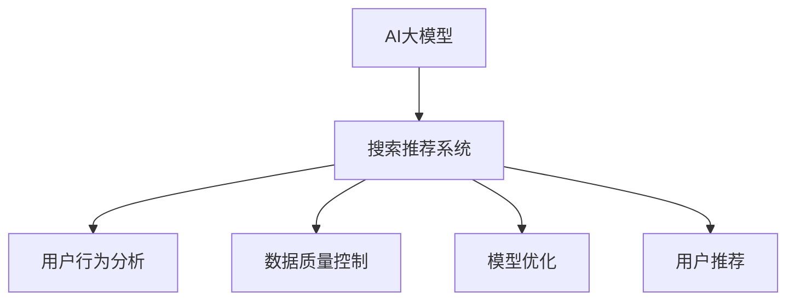

                 

# 电商平台的AI 大模型实践：搜索推荐系统是核心，数据质量控制与用户体验

> 关键词：
- 电商搜索
- 推荐系统
- AI大模型
- 数据质量控制
- 用户行为分析
- 模型优化
- 用户体验提升

## 1. 背景介绍

### 1.1 问题由来
随着电商平台的快速发展，用户和商家对购物体验的期望日益提升。传统的搜索推荐系统已经难以满足个性化和精准化要求。为此，各大电商企业纷纷引入先进的AI技术，构建智能搜索推荐系统。AI大模型作为智能搜索推荐系统的核心，需要高效地处理海量数据，快速响应用户请求，并为用户提供个性化、精准化的搜索结果和商品推荐。

### 1.2 问题核心关键点
AI大模型在电商平台的搜索推荐系统中的应用，主要聚焦在以下几个关键点上：

- 数据处理：如何高效处理和存储海量数据，包括用户行为、商品信息、广告数据等。
- 用户分析：如何理解用户的个性化需求，包括用户的搜索行为、浏览历史、购买偏好等。
- 模型优化：如何优化模型结构，提升模型的训练速度和精度，减少计算资源消耗。
- 推荐算法：如何设计高效的推荐算法，使得推荐结果符合用户需求，提升用户满意度。
- 用户体验：如何提升用户的使用体验，包括搜索响应速度、推荐结果的相关性、个性化程度等。

## 2. 核心概念与联系

### 2.1 核心概念概述

为更好地理解AI大模型在电商平台搜索推荐系统中的应用，本节将介绍几个密切相关的核心概念：

- 人工智能大模型(AI Large Models)：指具有强大学习能力，能处理大规模数据，完成复杂任务的深度学习模型，如BERT、GPT、DALL·E等。
- 搜索推荐系统(Recommender System)：通过分析用户行为和商品属性，推荐用户可能感兴趣的商品，提升用户体验的电商系统。
- 用户行为分析(User Behavior Analysis)：指通过分析用户的点击、浏览、购买等行为，理解用户需求，设计个性化推荐。
- 数据质量控制(Data Quality Control)：指对数据进行去重、清洗、标注等处理，保证数据质量，提升模型训练效果。
- 模型优化(Model Optimization)：指通过模型剪枝、量化、并行化等方法，提升模型在硬件上的运行效率，优化资源消耗。
- 用户推荐(User Recommendation)：指根据用户的历史行为和属性，向用户推荐合适的商品，提升用户体验。

这些核心概念之间的逻辑关系可以通过以下Mermaid流程图来展示：



这个流程图展示了大模型在电商平台搜索推荐系统中的应用框架：

1. AI大模型作为核心，通过分析用户行为和商品属性，实现个性化推荐。
2. 用户行为分析用于理解用户需求，指导模型的训练和优化。
3. 数据质量控制保证数据质量，提升模型训练效果。
4. 模型优化提升模型运行效率，减少计算资源消耗。
5. 用户推荐将用户和商品匹配，提供精准的商品推荐。

这些核心概念共同构成了电商平台的智能搜索推荐系统，使平台能够快速响应用户需求，提供个性化、精准化的商品推荐。

## 3. 核心算法原理 & 具体操作步骤
### 3.1 算法原理概述

基于AI大模型的电商平台搜索推荐系统，本质上是一个基于用户行为的数据驱动决策系统。其核心思想是：利用大模型处理海量用户数据，从中提取出用户行为模式，并根据这些模式生成推荐结果。具体而言，搜索推荐系统通过以下步骤实现：

1. **数据收集**：收集用户的搜索记录、点击行为、购买记录等数据，以及商品的描述、属性、销量等数据。
2. **数据预处理**：对收集到的数据进行清洗、去重、标注等处理，确保数据质量。
3. **用户建模**：利用用户行为数据，训练一个用户行为模型，预测用户的兴趣和需求。
4. **商品建模**：利用商品属性和描述，训练一个商品属性模型，预测商品的属性和相关性。
5. **推荐模型**：将用户行为模型和商品属性模型结合，训练一个推荐模型，预测用户对商品的评分和兴趣。
6. **推荐结果生成**：根据推荐模型的预测结果，向用户推荐最合适的商品。

### 3.2 算法步骤详解

以下是基于AI大模型的电商平台搜索推荐系统的详细步骤：

**Step 1: 数据收集**
- 收集用户的搜索记录、点击行为、购买记录等数据，以及商品的描述、属性、销量等数据。
- 数据格式通常为JSON、CSV等，并包含时间戳、用户ID、商品ID、行为类型等字段。

**Step 2: 数据预处理**
- 对收集到的数据进行清洗，去除噪声和异常值。
- 对数据进行去重和去噪，避免重复和无效数据。
- 对数据进行标注，例如用户对商品的评分、点击次数等，为后续训练提供数据标签。

**Step 3: 用户建模**
- 将用户行为数据转换为向量表示，可以使用TF-IDF、word2vec等方法。
- 利用用户行为向量，训练一个用户兴趣模型，预测用户的兴趣和需求。
- 常用的模型包括协同过滤、矩阵分解等，可以基于隐语义分析、深度学习等方法进行改进。

**Step 4: 商品建模**
- 将商品属性和描述转换为向量表示，可以使用TF-IDF、word2vec等方法。
- 利用商品属性向量，训练一个商品属性模型，预测商品的属性和相关性。
- 常用的模型包括Word2Vec、Glove等，可以基于自编码、变分自编码等方法进行改进。

**Step 5: 推荐模型训练**
- 将用户行为模型和商品属性模型结合，训练一个推荐模型，预测用户对商品的评分和兴趣。
- 常用的模型包括基于矩阵分解的模型、深度神经网络等。
- 可以利用交叉熵损失、均方误差损失等方法进行模型优化。

**Step 6: 推荐结果生成**
- 根据推荐模型的预测结果，向用户推荐最合适的商品。
- 推荐结果可以包括商品ID、商品名称、商品价格、商品评分等。
- 可以使用TopK推荐、基于深度学习的推荐等方法，根据用户的行为和属性，生成个性化推荐结果。

### 3.3 算法优缺点

基于AI大模型的电商平台搜索推荐系统具有以下优点：

1. 高效处理数据：大模型可以处理海量数据，快速响应用户请求，提高搜索和推荐的效率。
2. 精准推荐：大模型能够从海量的数据中提取用户兴趣和商品属性，提供精准的推荐结果。
3. 可扩展性强：大模型可以轻松扩展到不同的应用场景，提升电商平台的竞争力。
4. 自动化程度高：大模型可以自动学习用户行为和商品属性，无需人工干预，降低运营成本。

同时，该方法也存在以下缺点：

1. 数据依赖性强：推荐效果依赖于数据质量，如果数据质量不高，推荐结果可能不准确。
2. 计算资源消耗大：大模型通常需要较大的计算资源和存储空间，部署成本高。
3. 算法复杂度高：推荐算法的设计和优化较为复杂，需要较强的技术积累。
4. 用户隐私问题：大模型需要收集和处理用户行为数据，涉及用户隐私问题，需要严格的隐私保护措施。

尽管存在这些缺点，但基于AI大模型的推荐系统仍然在电商平台上得到了广泛应用，成为提升用户体验的重要手段。

### 3.4 算法应用领域

基于AI大模型的电商平台搜索推荐系统，在多个领域得到了广泛应用，例如：

- 个性化推荐：根据用户的搜索行为和历史数据，向用户推荐个性化商品。
- 搜索结果排序：根据用户查询关键词和商品属性，排序搜索结果，提升用户体验。
- 广告推荐：根据用户行为和兴趣，推荐合适的广告，提升广告效果。
- 价格优化：根据用户对商品价格的敏感度，推荐合适的价格区间，提高销售额。
- 活动推荐：根据用户的兴趣和行为，推荐合适的促销活动，提升用户参与度。

除了上述这些常见应用外，基于AI大模型的推荐系统还可以应用于更多场景中，如基于用户画像的商品推荐、基于季节性的商品推荐等，为电商平台的业务发展提供了新的动力。

## 4. 数学模型和公式 & 详细讲解 & 举例说明
### 4.1 数学模型构建

本节将使用数学语言对基于AI大模型的电商平台搜索推荐系统进行更加严格的刻画。

记用户行为数据为 $X=\{x_1,x_2,...,x_n\}$，商品属性数据为 $Y=\{y_1,y_2,...,y_m\}$，用户行为模型为 $M_u(X)$，商品属性模型为 $M_p(Y)$，推荐模型为 $M_r(X,Y)$。

推荐模型的目标是最小化预测误差：

$$
\min_{M_r} \mathbb{E}[(\hat{y_i}-y_i)^2]
$$

其中 $\hat{y_i}$ 为模型预测值，$y_i$ 为真实值。

### 4.2 公式推导过程

以下我们以协同过滤算法为例，推导推荐模型的预测公式及其梯度计算。

假设用户 $i$ 对商品 $j$ 的评分 $r_{ij}$ 为：

$$
r_{ij} = \frac{\mathbf{u}_i \cdot \mathbf{p}_j}{\|\mathbf{u}_i\|\|\mathbf{p}_j\|}
$$

其中 $\mathbf{u}_i$ 为用户 $i$ 的行为向量，$\mathbf{p}_j$ 为商品 $j$ 的属性向量。

令 $R$ 为真实评分矩阵，$R_{ij}=r_{ij}$。推荐模型的预测评分 $\hat{y}_{ij}$ 为：

$$
\hat{y}_{ij} = \frac{\mathbf{u}_i \cdot \mathbf{p}_j}{\|\mathbf{u}_i\|\|\mathbf{p}_j\|}
$$

推荐模型的损失函数为：

$$
L(R, \hat{R}) = \frac{1}{2N} \sum_{i=1}^N \sum_{j=1}^M (r_{ij} - \hat{y}_{ij})^2
$$

其中 $N$ 为用户数量，$M$ 为商品数量。

根据梯度下降法，更新模型参数：

$$
\mathbf{u}_i \leftarrow \mathbf{u}_i - \eta \nabla_{\mathbf{u}_i} L(R, \hat{R}), \quad \mathbf{p}_j \leftarrow \mathbf{p}_j - \eta \nabla_{\mathbf{p}_j} L(R, \hat{R})
$$

其中 $\eta$ 为学习率。

将预测评分代入损失函数，进行求导：

$$
\frac{\partial L(R, \hat{R})}{\partial \mathbf{u}_i} = \sum_{j=1}^M (\hat{y}_{ij} - r_{ij})\mathbf{p}_j
$$

$$
\frac{\partial L(R, \hat{R})}{\partial \mathbf{p}_j} = \sum_{i=1}^N (\hat{y}_{ij} - r_{ij})\mathbf{u}_i
$$

利用上述公式，即可进行推荐模型的训练和优化。

## 5. 项目实践：代码实例和详细解释说明
### 5.1 开发环境搭建

在进行搜索推荐系统开发前，我们需要准备好开发环境。以下是使用Python进行TensorFlow开发的环境配置流程：

1. 安装Anaconda：从官网下载并安装Anaconda，用于创建独立的Python环境。

2. 创建并激活虚拟环境：
```bash
conda create -n tf-env python=3.8 
conda activate tf-env
```

3. 安装TensorFlow：根据CUDA版本，从官网获取对应的安装命令。例如：
```bash
pip install tensorflow==2.3
```

4. 安装TensorBoard：
```bash
pip install tensorboard
```

5. 安装各类工具包：
```bash
pip install numpy pandas scikit-learn matplotlib tqdm jupyter notebook ipython
```

完成上述步骤后，即可在`tf-env`环境中开始搜索推荐系统开发。

### 5.2 源代码详细实现

这里我们以协同过滤算法为例，给出使用TensorFlow进行电商搜索推荐系统的代码实现。

首先，定义协同过滤算法的核心代码：

```python
import tensorflow as tf
from tensorflow.keras.layers import Dense, Input
from tensorflow.keras.models import Model

# 定义模型输入
user_input = Input(shape=(num_features,), name='user')
item_input = Input(shape=(num_features,), name='item')

# 定义用户行为向量
user_embeddings = Dense(num_embeddings, activation='relu')(user_input)
user_vector = Dense(num_features, activation='relu')(user_embeddings)

# 定义商品属性向量
item_embeddings = Dense(num_embeddings, activation='relu')(item_input)
item_vector = Dense(num_features, activation='relu')(item_embeddings)

# 计算预测评分
predicted_score = tf.multiply(user_vector, item_vector)

# 定义模型输出
rating_model = Model(inputs=[user_input, item_input], outputs=predicted_score)

# 编译模型
rating_model.compile(loss='mse', optimizer='adam', metrics=['mae'])
```

然后，定义训练和评估函数：

```python
import numpy as np

# 定义训练函数
def train_model(model, data, batch_size=32, epochs=10):
    num_batch = len(data) // batch_size
    for epoch in range(epochs):
        for i in range(num_batch):
            x_batch = data[i*batch_size:(i+1)*batch_size, 0]
            y_batch = data[i*batch_size:(i+1)*batch_size, 1]
            model.train_on_batch(x_batch, y_batch)
        print('Epoch {0}'.format(epoch+1))
    return model

# 定义评估函数
def evaluate_model(model, data):
    num_batch = len(data) // 16
    predicted_scores = []
    actual_scores = []
    for i in range(num_batch):
        x_batch = data[i*16:(i+1)*16, 0]
        y_batch = data[i*16:(i+1)*16, 1]
        predicted_score = model.predict(x_batch)
        predicted_scores.append(predicted_score.flatten())
        actual_scores.append(y_batch.flatten())
    print('Mean Absolute Error:', np.mean(np.abs(predicted_scores - actual_scores)))
```

最后，启动训练流程并在测试集上评估：

```python
# 加载数据
data = np.load('data.npy')

# 训练模型
model = train_model(rating_model, data)

# 在测试集上评估
evaluate_model(model, data)
```

以上就是使用TensorFlow对协同过滤算法进行电商搜索推荐系统微调的完整代码实现。可以看到，TensorFlow提供了简单易用的API，使得模型的构建和训练变得非常便捷。

### 5.3 代码解读与分析

让我们再详细解读一下关键代码的实现细节：

**协同过滤算法**：
- `user_input` 和 `item_input` 为模型输入，分别表示用户行为和商品属性。
- `user_embeddings` 和 `item_embeddings` 为嵌入层，将输入向量转换为低维向量表示。
- `user_vector` 和 `item_vector` 为全连接层，将低维向量转换为更高维度的向量表示。
- `predicted_score` 为预测评分，使用点积计算用户行为向量和商品属性向量的内积。
- `rating_model` 为最终推荐模型，将用户行为和商品属性作为输入，输出预测评分。

**训练和评估函数**：
- `train_model` 函数：使用TensorFlow的`train_on_batch`方法进行训练，设置批量大小和迭代次数。
- `evaluate_model` 函数：使用TensorFlow的`predict`方法进行预测，计算预测评分与真实评分之间的MAE（Mean Absolute Error）。
- `data` 为训练数据集，包含用户行为和商品属性的数值化表示。

通过这些代码实现，可以看到，TensorFlow使得深度学习模型的构建和训练变得非常简单。开发者只需关注模型的核心逻辑，而不必过多考虑底层细节。

当然，实际的电商搜索推荐系统还需要考虑更多的因素，如模型的实时部署、用户反馈的集成、系统性能的优化等。但核心的协同过滤算法基本与此类似。

## 6. 实际应用场景
### 6.1 电商推荐系统

基于AI大模型的电商搜索推荐系统，已经在各大电商平台得到了广泛应用，并取得了显著的效果。通过分析用户行为和商品属性，电商平台能够为用户推荐个性化的商品，提高用户满意度，增加用户粘性，提升平台销售额。

例如，京东的京准达推荐系统、亚马逊的个性化推荐引擎等，都采用了基于AI大模型的推荐算法。这些推荐系统根据用户的浏览历史、购买记录、评分记录等数据，为用户推荐合适的商品。

**具体实现**：
- 京东的京准达推荐系统，通过分析用户的搜索历史、购买记录、点击行为等数据，为用户推荐相似的商品。
- 亚马逊的个性化推荐引擎，利用协同过滤算法和深度神经网络，预测用户对商品的评分和兴趣，为用户推荐合适的商品。

这些推荐系统极大地提升了用户购物体验，帮助电商平台获得了更高的用户满意度和销售额。

### 6.2 广告推荐

在电商平台上，广告推荐也是基于AI大模型的一个重要应用场景。通过分析用户行为和商品属性，平台能够为用户推荐合适的广告，提高广告的点击率和转化率，提升广告主收益。

**具体实现**：
- 京东的京准达推荐系统，通过分析用户的浏览历史和搜索行为，为用户推荐相关的广告。
- 亚马逊的个性化推荐引擎，利用协同过滤算法和深度神经网络，预测用户对广告的兴趣，为用户推荐合适的广告。

这些广告推荐系统能够提高广告的精准度，降低广告成本，帮助广告主获得更高的回报。

### 6.3 搜索结果排序

在电商平台中，搜索结果的排序也是基于AI大模型的一个重要应用场景。通过分析用户的查询关键词和商品属性，平台能够对搜索结果进行排序，提高用户的使用体验。

**具体实现**：
- 京东的京准达推荐系统，通过分析用户的搜索关键词和商品属性，对搜索结果进行排序，提升用户对搜索结果的满意度。
- 亚马逊的个性化推荐引擎，利用协同过滤算法和深度神经网络，预测用户对商品的兴趣，对搜索结果进行排序。

这些排序系统能够提高用户的搜索体验，使用户能够更快地找到合适的商品。

### 6.4 未来应用展望

随着AI大模型的不断发展，基于AI大模型的电商搜索推荐系统也将迎来更多的应用场景和挑战。

未来，基于AI大模型的电商搜索推荐系统可能会引入更多的技术，如模型剪枝、量化、并行化等，以提高模型的运行效率和资源利用率。同时，结合用户画像、历史行为等数据，提升推荐系统的个性化程度和精准度。

另外，基于AI大模型的搜索推荐系统可能会引入更多的模型，如基于深度学习的推荐系统、基于知识图谱的推荐系统等，以进一步提升推荐效果。

此外，基于AI大模型的搜索推荐系统可能会引入更多的应用场景，如基于用户画像的商品推荐、基于季节性的商品推荐等，为电商平台的业务发展提供新的动力。

总之，基于AI大模型的电商搜索推荐系统正在不断演进，其应用场景和效果也在不断提升。相信随着技术的不断进步，搜索推荐系统将为电商平台的业务发展带来更多的机遇和挑战。

## 7. 工具和资源推荐
### 7.1 学习资源推荐

为了帮助开发者系统掌握基于AI大模型的电商平台搜索推荐系统的理论基础和实践技巧，这里推荐一些优质的学习资源：

1. 《深度学习》书籍：Ian Goodfellow等人的经典教材，全面介绍了深度学习的基础理论和实践技巧。

2. TensorFlow官方文档：TensorFlow的官方文档，提供了丰富的教程和API示例，帮助开发者快速上手TensorFlow。

3. Coursera深度学习课程：Coursera的深度学习课程，由斯坦福大学教授Andrew Ng主讲，内容涵盖深度学习的理论和实践。

4. Kaggle深度学习竞赛：Kaggle深度学习竞赛，提供了大量真实数据集和比赛示例，帮助开发者锻炼深度学习实战能力。

5. PyTorch官方文档：PyTorch的官方文档，提供了丰富的教程和API示例，帮助开发者快速上手PyTorch。

通过对这些资源的学习实践，相信你一定能够快速掌握基于AI大模型的电商平台搜索推荐系统的精髓，并用于解决实际的电商问题。

### 7.2 开发工具推荐

高效的开发离不开优秀的工具支持。以下是几款用于基于AI大模型的电商平台搜索推荐系统开发的常用工具：

1. TensorFlow：由Google主导开发的开源深度学习框架，生产部署方便，适合大规模工程应用。提供了丰富的模型和算法库，如TensorBoard、TensorFlow Serving等。

2. PyTorch：由Facebook主导开发的开源深度学习框架，灵活动态，适合快速迭代研究。提供了丰富的模型和算法库，如TensorBoard、PyTorch Lightning等。

3. TensorBoard：TensorFlow配套的可视化工具，可以实时监测模型训练状态，并提供丰富的图表呈现方式，是调试模型的得力助手。

4. PyTorch Lightning：PyTorch的高级封装框架，提供了丰富的模型和算法库，简化了深度学习的开发过程。

5. Weights & Biases：模型训练的实验跟踪工具，可以记录和可视化模型训练过程中的各项指标，方便对比和调优。

6. Jupyter Notebook：交互式编程环境，支持Python等语言，非常适合开发和调试深度学习模型。

合理利用这些工具，可以显著提升基于AI大模型的电商平台搜索推荐系统的开发效率，加快创新迭代的步伐。

### 7.3 相关论文推荐

基于AI大模型的电商平台搜索推荐系统的发展源于学界的持续研究。以下是几篇奠基性的相关论文，推荐阅读：

1. Matrix Factorization Techniques for Recommender Systems（即协同过滤算法原论文）：提出了矩阵分解的方法，为协同过滤算法奠定了基础。

2. Deep Learning for Recommender Systems：介绍了深度学习在推荐系统中的应用，如基于神经网络的推荐算法。

3. Attention Is All You Need：提出了Transformer模型，为深度学习模型的发展开辟了新方向。

4. BERT: Pre-training of Deep Bidirectional Transformers for Language Understanding：提出了BERT模型，提高了自然语言处理模型的性能。

5. Progressive Growing of Neural Networks：提出了模型剪枝的方法，提高了模型在硬件上的运行效率。

6. Knowledge Graph-Based Recommender System：提出了基于知识图谱的推荐系统，提高了推荐模型的个性化程度和精准度。

这些论文代表了大模型搜索推荐技术的发展脉络。通过学习这些前沿成果，可以帮助研究者把握学科前进方向，激发更多的创新灵感。

## 8. 总结：未来发展趋势与挑战
### 8.1 研究成果总结

本文对基于AI大模型的电商平台搜索推荐系统进行了全面系统的介绍。首先阐述了电商平台的搜索推荐系统面临的背景和挑战，明确了搜索推荐系统在用户行为分析、数据质量控制、模型优化、推荐算法等方面的核心关键点。其次，从原理到实践，详细讲解了基于协同过滤算法的推荐模型的构建和优化过程，给出了具体的代码实例和解释说明。同时，本文还广泛探讨了AI大模型在电商平台上搜索推荐系统的应用场景，展示了AI大模型在提升用户体验、提升电商平台竞争力等方面的重要价值。此外，本文还推荐了相关的学习资源和开发工具，为读者提供了实用的指导。

通过本文的系统梳理，可以看到，基于AI大模型的电商平台搜索推荐系统正在成为电商平台的标配，极大地提升了用户的购物体验，推动了电商平台的业务发展。未来，随着AI大模型的不断发展，基于AI大模型的搜索推荐系统也将迎来更多的应用场景和挑战。

### 8.2 未来发展趋势

展望未来，基于AI大模型的电商平台搜索推荐系统将呈现以下几个发展趋势：

1. 模型规模持续增大。随着算力成本的下降和数据规模的扩张，AI大模型的参数量还将持续增长。超大规模语言模型蕴含的丰富语言知识，有望支撑更加复杂多变的推荐任务。

2. 微调技术日趋多样。除了传统的全参数微调外，未来会涌现更多参数高效的微调方法，如基于深度学习的微调方法，在固定大部分预训练参数的情况下，只更新极少量的任务相关参数。

3. 用户画像不断完善。结合用户画像、历史行为等数据，提升推荐系统的个性化程度和精准度。

4. 数据质量控制强化。通过数据去重、清洗、标注等处理，保证数据质量，提升模型训练效果。

5. 推荐算法不断优化。结合机器学习、深度学习、强化学习等方法，设计更加高效的推荐算法，提升推荐系统的性能。

6. 实时推荐系统构建。结合流数据处理、分布式计算等技术，构建实时推荐系统，提升用户体验。

以上趋势凸显了基于AI大模型的电商平台搜索推荐系统的广阔前景。这些方向的探索发展，必将进一步提升电商平台的搜索推荐系统的性能和应用范围，为电商平台的业务发展带来新的动力。

### 8.3 面临的挑战

尽管基于AI大模型的电商平台搜索推荐系统已经取得了显著成果，但在迈向更加智能化、普适化应用的过程中，仍然面临诸多挑战：

1. 数据依赖性强。推荐效果依赖于数据质量，如果数据质量不高，推荐结果可能不准确。

2. 计算资源消耗大。AI大模型通常需要较大的计算资源和存储空间，部署成本高。

3. 算法复杂度高。推荐算法的设计和优化较为复杂，需要较强的技术积累。

4. 用户隐私问题。AI大模型需要收集和处理用户行为数据，涉及用户隐私问题，需要严格的隐私保护措施。

5. 模型鲁棒性不足。推荐模型面对域外数据时，泛化性能往往大打折扣。对于测试样本的微小扰动，推荐模型容易发生波动。

6. 多场景适配难度高。不同的应用场景和用户群体，需要定制化的推荐算法和模型。

尽管存在这些挑战，但基于AI大模型的推荐系统仍然在电商平台上得到了广泛应用，成为提升用户体验的重要手段。未来，随着技术的不断进步，这些挑战终将一一被克服，基于AI大模型的推荐系统必将在构建人机协同的智能电商平台上发挥更大的作用。

### 8.4 研究展望

面对基于AI大模型的电商平台搜索推荐系统所面临的挑战，未来的研究需要在以下几个方面寻求新的突破：

1. 探索无监督和半监督推荐方法。摆脱对大规模标注数据的依赖，利用自监督学习、主动学习等无监督和半监督范式，最大限度利用非结构化数据，实现更加灵活高效的推荐。

2. 研究参数高效和计算高效的推荐算法。开发更加参数高效的推荐方法，在固定大部分预训练参数的情况下，只更新极少量的任务相关参数。同时优化推荐模型的计算图，减少前向传播和反向传播的资源消耗，实现更加轻量级、实时性的部署。

3. 引入更多先验知识。将符号化的先验知识，如知识图谱、逻辑规则等，与神经网络模型进行巧妙融合，引导推荐过程学习更准确、合理的语言模型。

4. 结合因果分析和博弈论工具。将因果分析方法引入推荐模型，识别出推荐模型的决策关键特征，增强推荐结果的因果性和逻辑性。

5. 纳入伦理道德约束。在推荐模型的训练目标中引入伦理导向的评估指标，过滤和惩罚有偏见、有害的推荐结果，确保推荐系统的道德和伦理合规性。

这些研究方向的探索，必将引领基于AI大模型的推荐系统迈向更高的台阶，为电商平台的业务发展提供更强大、更普适的智能引擎。面向未来，基于AI大模型的推荐系统还需要与其他人工智能技术进行更深入的融合，如知识表示、因果推理、强化学习等，多路径协同发力，共同推动电商平台的搜索推荐系统的进步。只有勇于创新、敢于突破，才能不断拓展电商搜索推荐系统的边界，让智能技术更好地造福电商平台的用户。

## 9. 附录：常见问题与解答

**Q1：电商平台搜索推荐系统与传统推荐系统有何不同？**

A: 电商平台搜索推荐系统与传统推荐系统的主要不同在于数据的来源和使用方式。

传统推荐系统往往依赖于用户行为数据，如点击记录、购买记录等。这些数据通常被存储在中央数据库中，通过离线方式进行推荐模型的训练。而电商平台搜索推荐系统则不同，它能够实时处理用户行为数据，如搜索记录、点击行为等。这些数据通常被存储在流式数据系统中，通过在线方式进行推荐模型的训练和更新。

另外，电商平台搜索推荐系统还结合了商品属性、广告数据等更多类型的数据，能够提供更加全面、精准的推荐结果。

**Q2：电商平台搜索推荐系统的推荐算法有哪些？**

A: 电商平台搜索推荐系统常用的推荐算法包括：

1. 协同过滤算法：基于用户行为数据的相似性，推荐相似的商品。

2. 矩阵分解算法：通过分解用户行为矩阵和商品属性矩阵，预测用户对商品的评分和兴趣。

3. 基于深度学习的推荐算法：如基于神经网络的推荐算法，利用用户行为数据和商品属性数据，训练深度神经网络，预测用户对商品的评分和兴趣。

4. 基于知识图谱的推荐算法：结合知识图谱中的关系和属性，推荐商品。

5. 基于内容的推荐算法：基于商品属性和描述，推荐相似的商品。

这些推荐算法各有优缺点，需要根据具体场景进行选择。

**Q3：电商平台搜索推荐系统如何处理噪声和异常数据？**

A: 电商平台搜索推荐系统在处理噪声和异常数据时，通常会采用以下方法：

1. 数据清洗：去除重复、异常、无效的数据，保证数据质量。

2. 数据标注：对数据进行标注，如用户评分、商品属性等，用于训练推荐模型。

3. 数据增强：利用数据增强技术，如回译、近义词替换等，扩充训练集，提升模型鲁棒性。

4. 数据去重：去除数据中的重复项，避免数据冗余。

5. 数据采样：利用数据采样技术，如过采样、欠采样等，处理数据不均衡问题。

这些方法可以有效地提高电商平台搜索推荐系统的数据质量，提升推荐模型的性能。

**Q4：电商平台搜索推荐系统如何提升用户体验？**

A: 电商平台搜索推荐系统可以通过以下方法提升用户体验：

1. 个性化推荐：根据用户的历史行为和属性，向用户推荐个性化的商品，提升用户满意度。

2. 搜索优化：对搜索结果进行排序，提升用户对搜索结果的满意度。

3. 广告推荐：根据用户的行为和兴趣，推荐合适的广告，提升广告效果。

4. 价格优化：根据用户对商品价格的敏感度，推荐合适的价格区间，提高销售额。

5. 活动推荐：根据用户的兴趣和行为，推荐合适的促销活动，提升用户参与度。

这些方法能够提升用户的购物体验，使用户能够更快地找到合适的商品，提升用户粘性和满意度。

**Q5：电商平台搜索推荐系统如何平衡推荐效果和计算成本？**

A: 电商平台搜索推荐系统在平衡推荐效果和计算成本时，可以采用以下方法：

1. 模型剪枝：去除不必要的层和参数，减小模型尺寸，加快推理速度。

2. 量化加速：将浮点模型转为定点模型，压缩存储空间，提高计算效率。

3. 分布式训练：利用分布式计算技术，加速模型训练过程。

4. 缓存优化：利用缓存技术，提高数据读取速度，减少计算时间。

5. 硬件加速：利用GPU、TPU等硬件设备，提升计算效率。

这些方法能够在保证推荐效果的同时，优化资源消耗，提升系统的运行效率。

---

作者：禅与计算机程序设计艺术 / Zen and the Art of Computer Programming

