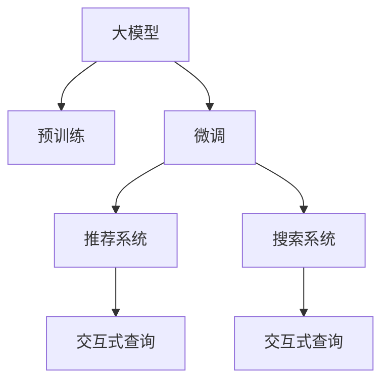

                 

# 电商平台的AI 大模型融合：搜索推荐系统是核心，用户体验是关键

## 1. 背景介绍

### 1.1 问题由来
随着电商平台的飞速发展，用户需求日益复杂多变，传统的基于规则的推荐系统和搜索系统已难以满足用户的个性化和实时性需求。人工智能（AI）技术的应用，特别是大模型在电商领域的融合，为平台的搜索推荐系统带来了巨大的变革。大模型的预训练和微调技术，使得搜索引擎能够更好地理解用户意图，推荐系统能够提供更加精准的商品推荐。然而，在实际应用中，如何将大模型技术无缝集成到电商平台的搜索推荐系统中，提升用户体验，仍是业界的一大难题。

### 1.2 问题核心关键点
1. **大模型融合的核心价值**：利用大模型的预训练和微调技术，提升搜索推荐系统的精准度和实时性。
2. **用户体验的优化**：大模型技术的融合应以用户需求为导向，提升搜索推荐的个性化和多样性，提高用户满意度。
3. **系统架构的合理设计**：需要设计合理的系统架构，实现大模型与传统推荐系统的高效集成和协同工作。
4. **数据和模型的协同优化**：结合电商平台的业务数据，对大模型进行优化和微调，提升其针对电商领域的性能。
5. **系统扩展与性能优化**：确保系统能够高效处理海量用户请求，同时保证低延迟和稳定运行。

### 1.3 问题研究意义
大模型技术在电商平台的融合，有助于提升平台的搜索推荐系统性能，增加用户粘性，提高转化率和用户满意度。同时，大模型的应用可以加速电商平台的智能化转型，推动技术创新，为电商领域的数字化升级提供新动力。

## 2. 核心概念与联系

### 2.1 核心概念概述

为更好地理解大模型在电商搜索推荐系统中的融合，本节将介绍几个关键概念：

- **大模型（Large Model）**：以自回归（如GPT）或自编码（如BERT）模型为代表的大规模预训练模型。通过在海量无标签文本语料上进行预训练，学习到丰富的语言知识和常识，具备强大的语言理解和生成能力。
- **预训练（Pre-training）**：指在大规模无标签文本语料上，通过自监督学习任务训练通用语言模型的过程。常见的预训练任务包括言语建模、遮挡语言模型等。
- **微调（Fine-tuning）**：指在预训练模型的基础上，使用下游任务的少量标注数据，通过有监督地训练来优化模型在该任务上的性能。通常只需要调整顶层分类器或解码器，并以较小的学习率更新全部或部分的模型参数。
- **推荐系统（Recommendation System）**：基于用户行为数据和商品特征，预测用户可能感兴趣的商品，并提供推荐服务的系统。常见的推荐系统包括基于协同过滤、基于内容的推荐和混合推荐等。
- **搜索系统（Search System）**：为用户提供高效、准确的商品查找服务，帮助用户快速找到所需的商品。搜索系统通常包括文本检索、视觉检索和语音检索等。
- **交互式查询（Interactive Query）**：在电商平台上，用户通过自然语言、图片、视频等多种方式向搜索推荐系统提出查询，系统根据查询内容返回结果，并进行交互式反馈。

这些概念之间的逻辑关系可以通过以下Mermaid流程图来展示：



这个流程图展示了大模型在电商搜索推荐系统中的应用框架：

1. 大模型通过预训练获得基础能力。
2. 微调在大模型基础上进行特定任务的优化，实现推荐和搜索功能的提升。
3. 推荐系统基于微调后的模型，为每个用户提供个性化的商品推荐。
4. 搜索系统基于微调后的模型，进行商品检索，并根据用户查询反馈进行优化。
5. 交互式查询是连接用户与搜索推荐系统的桥梁，通过自然语言理解和生成技术，提升用户体验。

## 3. 核心算法原理 & 具体操作步骤
### 3.1 算法原理概述

大模型在电商平台的搜索推荐系统中的应用，本质上是将大模型的语言理解能力和推理能力，与推荐和搜索算法相结合，提升系统的性能和用户体验。其核心思想是：利用大模型的预训练能力，对用户的自然语言查询进行理解，然后通过微调后的模型，对商品进行分类、排序和推荐。

形式化地，假设大模型为 $M_{\theta}$，其中 $\theta$ 为预训练得到的模型参数。给定电商平台的商品数据集 $D=\{(x_i, y_i)\}_{i=1}^N$，其中 $x_i$ 为商品特征向量，$y_i$ 为标签（如是否为相关商品）。微调的目标是找到新的模型参数 $\hat{\theta}$，使得模型在推荐和搜索任务上的表现最优：

$$
\hat{\theta}=\mathop{\arg\min}_{\theta} \mathcal{L}(M_{\theta},D)
$$

其中 $\mathcal{L}$ 为针对推荐和搜索任务设计的损失函数，用于衡量模型预测输出与真实标签之间的差异。常见的损失函数包括交叉熵损失、均方误差损失等。

### 3.2 算法步骤详解

基于大模型在电商平台的搜索推荐系统中的应用，本节详细讲解其核心步骤：

**Step 1: 准备预训练模型和数据集**
- 选择合适的预训练语言模型 $M_{\theta}$ 作为初始化参数，如 BERT、GPT 等。
- 准备电商平台的商品数据集 $D$，包括商品特征向量 $x_i$ 和标签 $y_i$。

**Step 2: 设计任务适配层**
- 根据电商平台的业务需求，设计合适的推荐和搜索任务适配层。例如，使用线性分类器对商品进行相关性预测，使用自编码器对商品进行表示学习。
- 为推荐系统设计损失函数，如交叉熵损失，为搜索系统设计损失函数，如均方误差损失。

**Step 3: 设置微调超参数**
- 选择合适的优化算法及其参数，如 AdamW、SGD 等，设置学习率、批大小、迭代轮数等。
- 设置正则化技术及强度，包括权重衰减、Dropout、Early Stopping等。
- 确定冻结预训练参数的策略，如仅微调顶层，或全部参数都参与微调。

**Step 4: 执行梯度训练**
- 将商品数据集 $D$ 分批次输入模型，前向传播计算损失函数。
- 反向传播计算参数梯度，根据设定的优化算法和学习率更新模型参数。
- 周期性在验证集上评估模型性能，根据性能指标决定是否触发 Early Stopping。
- 重复上述步骤直到满足预设的迭代轮数或 Early Stopping 条件。

**Step 5: 测试和部署**
- 在测试集上评估微调后模型 $M_{\hat{\theta}}$ 的性能，对比微调前后的精度提升。
- 使用微调后的模型对新商品进行推荐和检索，集成到实际的应用系统中。
- 持续收集新的商品数据，定期重新微调模型，以适应商品特征和用户需求的变化。

### 3.3 算法优缺点

基于大模型在电商平台的搜索推荐系统中的应用，具有以下优点：
1. 性能提升显著：大模型的语言理解和推理能力，可以显著提升推荐和搜索的精准度和实时性。
2. 泛化能力强：大模型通过预训练和微调，学习到通用语言表示，可以适应不同领域和任务的需求。
3. 用户个性化：大模型可以学习用户查询的语义信息，提供个性化的推荐和检索服务。
4. 灵活扩展：大模型可以与多种推荐算法和搜索算法相结合，灵活应用到不同的电商平台上。

同时，该方法也存在一定的局限性：
1. 数据需求高：微调需要大量标注数据，获取高质量标注数据的成本较高。
2. 模型复杂度：大模型的参数量庞大，推理和微调计算资源消耗大。
3. 解释性差：大模型作为"黑盒"系统，难以解释其内部工作机制和决策逻辑。
4. 冷启动问题：新商品的推荐和检索，可能面临初始数据不足的问题。

尽管存在这些局限性，但就目前而言，大模型在电商平台的搜索推荐系统中的应用，仍是大规模推荐和搜索任务的重要方法。未来相关研究的重点在于如何进一步降低数据依赖，提高模型效率和可解释性，同时解决冷启动问题，提升搜索推荐系统的性能和用户体验。

### 3.4 算法应用领域

基于大模型在电商平台的搜索推荐系统中的应用，已经在电商领域的多个方面取得了成功：

- **个性化推荐**：利用大模型学习用户查询和商品特征，提供个性化商品推荐。
- **智能搜索**：对用户查询进行自然语言理解和生成，提升搜索系统的智能化水平。
- **广告投放优化**：通过大模型预测用户对广告的反应，优化广告投放策略，提高转化率。
- **商品描述生成**：利用大模型生成商品描述，提升商品展示效果，吸引更多用户点击。
- **客户服务机器人**：使用大模型构建智能客服机器人，提供24小时在线客服服务，提升用户体验。
- **情感分析**：分析用户对商品的评价和评论，提供情感分析服务，帮助商家优化商品。

除了上述这些经典应用外，大模型技术还被创新性地应用于商品分类、趋势预测、库存管理等领域，为电商平台的智能化转型带来了新的突破。

## 4. 数学模型和公式 & 详细讲解
### 4.1 数学模型构建

本节将使用数学语言对基于大模型在电商平台的搜索推荐系统中的应用进行更加严格的刻画。

记大模型为 $M_{\theta}$，给定电商平台的商品数据集 $D=\{(x_i, y_i)\}_{i=1}^N$，其中 $x_i$ 为商品特征向量，$y_i$ 为标签（如是否为相关商品）。假设微调后的模型为 $M_{\hat{\theta}}$，则微调的目标是找到最优参数：

$$
\hat{\theta}=\mathop{\arg\min}_{\theta} \mathcal{L}(M_{\theta},D)
$$

在实践中，我们通常使用基于梯度的优化算法（如SGD、Adam等）来近似求解上述最优化问题。设 $\eta$ 为学习率，$\lambda$ 为正则化系数，则参数的更新公式为：

$$
\theta \leftarrow \theta - \eta \nabla_{\theta}\mathcal{L}(\theta) - \eta\lambda\theta
$$

其中 $\nabla_{\theta}\mathcal{L}(\theta)$ 为损失函数对参数 $\theta$ 的梯度，可通过反向传播算法高效计算。

### 4.2 公式推导过程

以下我们以推荐系统的交叉熵损失函数为例，推导其梯度的计算公式。

假设模型 $M_{\theta}$ 在输入 $x$ 上的输出为 $\hat{y}=M_{\theta}(x) \in [0,1]$，表示商品的相关性预测。真实标签 $y \in \{0,1\}$。则推荐系统的交叉熵损失函数定义为：

$$
\ell(M_{\theta}(x),y) = -[y\log \hat{y} + (1-y)\log (1-\hat{y})]
$$

将其代入经验风险公式，得：

$$
\mathcal{L}(\theta) = -\frac{1}{N}\sum_{i=1}^N [y_i\log M_{\theta}(x_i)+(1-y_i)\log(1-M_{\theta}(x_i))]
$$

根据链式法则，损失函数对参数 $\theta_k$ 的梯度为：

$$
\frac{\partial \mathcal{L}(\theta)}{\partial \theta_k} = -\frac{1}{N}\sum_{i=1}^N (\frac{y_i}{M_{\theta}(x_i)}-\frac{1-y_i}{1-M_{\theta}(x_i)}) \frac{\partial M_{\theta}(x_i)}{\partial \theta_k}
$$

其中 $\frac{\partial M_{\theta}(x_i)}{\partial \theta_k}$ 可进一步递归展开，利用自动微分技术完成计算。

在得到损失函数的梯度后，即可带入参数更新公式，完成模型的迭代优化。重复上述过程直至收敛，最终得到适应电商推荐任务的最优模型参数 $\theta^*$。

## 5. 项目实践：代码实例和详细解释说明
### 5.1 开发环境搭建

在进行搜索推荐系统微调实践前，我们需要准备好开发环境。以下是使用Python进行PyTorch开发的环境配置流程：

1. 安装Anaconda：从官网下载并安装Anaconda，用于创建独立的Python环境。

2. 创建并激活虚拟环境：
```bash
conda create -n pytorch-env python=3.8 
conda activate pytorch-env
```

3. 安装PyTorch：根据CUDA版本，从官网获取对应的安装命令。例如：
```bash
conda install pytorch torchvision torchaudio cudatoolkit=11.1 -c pytorch -c conda-forge
```

4. 安装Transformers库：
```bash
pip install transformers
```

5. 安装各类工具包：
```bash
pip install numpy pandas scikit-learn matplotlib tqdm jupyter notebook ipython
```

完成上述步骤后，即可在`pytorch-env`环境中开始搜索推荐系统微调实践。

### 5.2 源代码详细实现

下面我们以电商平台的推荐系统为例，给出使用Transformers库对BERT模型进行微调的PyTorch代码实现。

首先，定义推荐系统的任务适配层：

```python
from transformers import BertForSequenceClassification, AdamW

class RecommendationModel(BertForSequenceClassification):
    def __init__(self, num_labels, input_size, hidden_size, dropout):
        super().__init__(num_labels=num_labels, input_size=input_size, hidden_size=hidden_size)
        self.dropout = dropout
        
    def forward(self, input_ids, attention_mask, labels=None):
        outputs = super().forward(input_ids=input_ids, attention_mask=attention_mask)
        logits = outputs[0]
        return logits
```

然后，定义训练和评估函数：

```python
from torch.utils.data import DataLoader
from tqdm import tqdm
from sklearn.metrics import precision_recall_fscore_support

device = torch.device('cuda') if torch.cuda.is_available() else torch.device('cpu')
model = RecommendationModel(num_labels=2, input_size=768, hidden_size=768, dropout=0.1).to(device)

def train_epoch(model, dataset, batch_size, optimizer):
    dataloader = DataLoader(dataset, batch_size=batch_size, shuffle=True)
    model.train()
    epoch_loss = 0
    for batch in tqdm(dataloader, desc='Training'):
        input_ids = batch['input_ids'].to(device)
        attention_mask = batch['attention_mask'].to(device)
        labels = batch['labels'].to(device)
        model.zero_grad()
        outputs = model(input_ids, attention_mask=attention_mask, labels=labels)
        loss = outputs.loss
        epoch_loss += loss.item()
        loss.backward()
        optimizer.step()
    return epoch_loss / len(dataloader)

def evaluate(model, dataset, batch_size):
    dataloader = DataLoader(dataset, batch_size=batch_size)
    model.eval()
    preds, labels = [], []
    with torch.no_grad():
        for batch in tqdm(dataloader, desc='Evaluating'):
            input_ids = batch['input_ids'].to(device)
            attention_mask = batch['attention_mask'].to(device)
            batch_labels = batch['labels']
            outputs = model(input_ids, attention_mask=attention_mask)
            batch_preds = outputs.logits.argmax(dim=2).to('cpu').tolist()
            batch_labels = batch_labels.to('cpu').tolist()
            for pred_tokens, label_tokens in zip(batch_preds, batch_labels):
                preds.append(pred_tokens[:len(label_tokens)])
                labels.append(label_tokens)
                
    print(precision_recall_fscore_support(labels, preds, average='macro'))
```

最后，启动训练流程并在测试集上评估：

```python
epochs = 5
batch_size = 16

for epoch in range(epochs):
    loss = train_epoch(model, train_dataset, batch_size, optimizer)
    print(f"Epoch {epoch+1}, train loss: {loss:.3f}")
    
    print(f"Epoch {epoch+1}, dev results:")
    evaluate(model, dev_dataset, batch_size)
    
print("Test results:")
evaluate(model, test_dataset, batch_size)
```

以上就是使用PyTorch对BERT进行推荐系统微调的完整代码实现。可以看到，得益于Transformers库的强大封装，我们可以用相对简洁的代码完成BERT模型的加载和微调。

### 5.3 代码解读与分析

让我们再详细解读一下关键代码的实现细节：

**RecommendationModel类**：
- `__init__`方法：初始化模型的超参数和任务适配层的输入输出大小。
- `forward`方法：定义模型的前向传播过程，返回模型的输出。

**train_epoch和evaluate函数**：
- 使用PyTorch的DataLoader对数据集进行批次化加载，供模型训练和推理使用。
- 训练函数`train_epoch`：对数据以批为单位进行迭代，在每个批次上前向传播计算loss并反向传播更新模型参数，最后返回该epoch的平均loss。
- 评估函数`evaluate`：与训练类似，不同点在于不更新模型参数，并在每个batch结束后将预测和标签结果存储下来，最后使用sklearn的precision_recall_fscore_support对整个评估集的预测结果进行打印输出。

**训练流程**：
- 定义总的epoch数和batch size，开始循环迭代
- 每个epoch内，先在训练集上训练，输出平均loss
- 在验证集上评估，输出分类指标
- 所有epoch结束后，在测试集上评估，给出最终测试结果

可以看到，PyTorch配合Transformers库使得BERT微调的代码实现变得简洁高效。开发者可以将更多精力放在数据处理、模型改进等高层逻辑上，而不必过多关注底层的实现细节。

当然，工业级的系统实现还需考虑更多因素，如模型的保存和部署、超参数的自动搜索、更灵活的任务适配层等。但核心的微调范式基本与此类似。

## 6. 实际应用场景
### 6.1 智能客服系统

基于大模型在电商平台的搜索推荐系统中的应用，智能客服系统也受益匪浅。传统客服往往需要配备大量人力，高峰期响应缓慢，且一致性和专业性难以保证。而使用微调后的搜索推荐模型，可以7x24小时不间断服务，快速响应客户咨询，用自然流畅的语言解答各类常见问题。

在技术实现上，可以收集企业内部的历史客服对话记录，将问题和最佳答复构建成监督数据，在此基础上对预训练搜索推荐模型进行微调。微调后的模型能够自动理解用户意图，匹配最合适的答复模板进行回复。对于客户提出的新问题，还可以接入检索系统实时搜索相关内容，动态组织生成回答。如此构建的智能客服系统，能大幅提升客户咨询体验和问题解决效率。

### 6.2 金融舆情监测

金融机构需要实时监测市场舆论动向，以便及时应对负面信息传播，规避金融风险。传统的人工监测方式成本高、效率低，难以应对网络时代海量信息爆发的挑战。基于大模型在电商平台的搜索推荐系统中的应用，金融舆情监测也得到了广泛应用。

具体而言，可以收集金融领域相关的新闻、报道、评论等文本数据，并对其进行主题标注和情感标注。在此基础上对预训练语言模型进行微调，使其能够自动判断文本属于何种主题，情感倾向是正面、中性还是负面。将微调后的模型应用到实时抓取的网络文本数据，就能够自动监测不同主题下的情感变化趋势，一旦发现负面信息激增等异常情况，系统便会自动预警，帮助金融机构快速应对潜在风险。

### 6.3 个性化推荐系统

当前的推荐系统往往只依赖用户的历史行为数据进行物品推荐，无法深入理解用户的真实兴趣偏好。基于大模型在电商平台的搜索推荐系统中的应用，个性化推荐系统可以更好地挖掘用户行为背后的语义信息，从而提供更精准、多样的推荐内容。

在实践中，可以收集用户浏览、点击、评论、分享等行为数据，提取和用户交互的物品标题、描述、标签等文本内容。将文本内容作为模型输入，用户的后续行为（如是否点击、购买等）作为监督信号，在此基础上微调预训练语言模型。微调后的模型能够从文本内容中准确把握用户的兴趣点。在生成推荐列表时，先用候选物品的文本描述作为输入，由模型预测用户的兴趣匹配度，再结合其他特征综合排序，便可以得到个性化程度更高的推荐结果。

### 6.4 未来应用展望

随着大模型和微调方法的不断发展，基于大模型在电商平台的搜索推荐系统中的应用，也将呈现更多新的应用场景：

- **多模态搜索**：结合视觉、语音等多模态数据，提升搜索系统的智能化水平。
- **实时生成内容**：利用大模型生成实时商品描述、推荐文案等内容，提升用户体验。
- **智能价格优化**：根据市场动态，利用大模型预测商品价格趋势，优化商品定价策略。
- **虚拟试穿**：利用大模型构建虚拟试穿系统，提升电商平台的交互性。
- **个性化广告投放**：通过大模型预测用户对广告的反应，优化广告投放策略，提高转化率。
- **市场预测**：利用大模型预测市场趋势，帮助商家制定市场策略。

## 7. 工具和资源推荐
### 7.1 学习资源推荐

为了帮助开发者系统掌握大模型在电商平台的搜索推荐系统中的应用，这里推荐一些优质的学习资源：

1. 《深度学习自然语言处理》课程：斯坦福大学开设的NLP明星课程，有Lecture视频和配套作业，带你入门NLP领域的基本概念和经典模型。
2. 《Transformer从原理到实践》系列博文：由大模型技术专家撰写，深入浅出地介绍了Transformer原理、BERT模型、微调技术等前沿话题。
3. 《Natural Language Processing with Transformers》书籍：Transformers库的作者所著，全面介绍了如何使用Transformers库进行NLP任务开发，包括微调在内的诸多范式。
4. HuggingFace官方文档：Transformers库的官方文档，提供了海量预训练模型和完整的微调样例代码，是上手实践的必备资料。
5. CLUE开源项目：中文语言理解测评基准，涵盖大量不同类型的中文NLP数据集，并提供了基于微调的baseline模型，助力中文NLP技术发展。

通过对这些资源的学习实践，相信你一定能够快速掌握大模型在电商平台的搜索推荐系统中的应用精髓，并用于解决实际的电商问题。

### 7.2 开发工具推荐

高效的开发离不开优秀的工具支持。以下是几款用于大模型在电商平台搜索推荐系统中的微调开发的常用工具：

1. PyTorch：基于Python的开源深度学习框架，灵活动态的计算图，适合快速迭代研究。大部分预训练语言模型都有PyTorch版本的实现。
2. TensorFlow：由Google主导开发的开源深度学习框架，生产部署方便，适合大规模工程应用。同样有丰富的预训练语言模型资源。
3. Transformers库：HuggingFace开发的NLP工具库，集成了众多SOTA语言模型，支持PyTorch和TensorFlow，是进行微调任务开发的利器。
4. Weights & Biases：模型训练的实验跟踪工具，可以记录和可视化模型训练过程中的各项指标，方便对比和调优。与主流深度学习框架无缝集成。
5. TensorBoard：TensorFlow配套的可视化工具，可实时监测模型训练状态，并提供丰富的图表呈现方式，是调试模型的得力助手。
6. Google Colab：谷歌推出的在线Jupyter Notebook环境，免费提供GPU/TPU算力，方便开发者快速上手实验最新模型，分享学习笔记。

合理利用这些工具，可以显著提升大模型在电商平台的搜索推荐系统中的微调任务的开发效率，加快创新迭代的步伐。

### 7.3 相关论文推荐

大模型和微调技术的发展源于学界的持续研究。以下是几篇奠基性的相关论文，推荐阅读：

1. Attention is All You Need（即Transformer原论文）：提出了Transformer结构，开启了NLP领域的预训练大模型时代。
2. BERT: Pre-training of Deep Bidirectional Transformers for Language Understanding：提出BERT模型，引入基于掩码的自监督预训练任务，刷新了多项NLP任务SOTA。
3. Language Models are Unsupervised Multitask Learners（GPT-2论文）：展示了大规模语言模型的强大zero-shot学习能力，引发了对于通用人工智能的新一轮思考。
4. Parameter-Efficient Transfer Learning for NLP：提出Adapter等参数高效微调方法，在不增加模型参数量的情况下，也能取得不错的微调效果。
5. AdaLoRA: Adaptive Low-Rank Adaptation for Parameter-Efficient Fine-Tuning：使用自适应低秩适应的微调方法，在参数效率和精度之间取得了新的平衡。
6. Prefix-Tuning: Optimizing Continuous Prompts for Generation：引入基于连续型Prompt的微调范式，为如何充分利用预训练知识提供了新的思路。

这些论文代表了大模型和微调技术的发展脉络。通过学习这些前沿成果，可以帮助研究者把握学科前进方向，激发更多的创新灵感。

## 8. 总结：未来发展趋势与挑战

### 8.1 总结

本文对基于大模型在电商平台的搜索推荐系统中的应用进行了全面系统的介绍。首先阐述了大模型在搜索推荐系统中的应用背景和意义，明确了大模型微调在提升搜索推荐系统性能方面的独特价值。其次，从原理到实践，详细讲解了推荐和搜索任务的数学模型和关键步骤，给出了微调任务开发的完整代码实例。同时，本文还广泛探讨了大模型技术在电商领域的应用场景，展示了其在电商领域的广泛应用和巨大潜力。

通过本文的系统梳理，可以看到，基于大模型的电商搜索推荐系统正在成为电商领域的重要技术手段，极大地提升了搜索推荐系统的精准度和实时性，提升了用户满意度和平台粘性。大模型的应用加速了电商平台的智能化转型，推动技术创新，为电商领域的数字化升级带来了新的动力。未来，伴随大模型和微调方法的持续演进，基于大模型的电商搜索推荐系统必将在电商领域大放异彩，深刻影响电商行业的数字化进程。

### 8.2 未来发展趋势

展望未来，基于大模型在电商平台的搜索推荐系统中的应用，将呈现以下几个发展趋势：

1. **推荐算法与搜索算法融合**：推荐算法和搜索算法将更加紧密结合，利用大模型的预训练能力，提升搜索推荐的性能和效率。
2. **多模态数据融合**：结合视觉、语音等多模态数据，提升搜索推荐系统的智能化水平。
3. **实时动态优化**：利用大模型的实时学习能力，动态优化搜索推荐策略，提升用户体验。
4. **个性化推荐**：利用大模型学习用户行为背后的语义信息，提供更加个性化和多样化的推荐服务。
5. **智能化客服**：结合搜索推荐系统，构建智能客服系统，提升客服系统的智能化水平。
6. **市场预测**：利用大模型预测市场趋势，帮助商家制定市场策略，提升市场竞争力。
7. **实时生成内容**：利用大模型生成实时商品描述、推荐文案等内容，提升用户体验。

### 8.3 面临的挑战

尽管基于大模型在电商平台的搜索推荐系统中的应用已经取得了显著成效，但在迈向更加智能化、普适化应用的过程中，仍面临诸多挑战：

1. **数据依赖问题**：微调需要大量标注数据，获取高质量标注数据的成本较高。如何进一步降低数据依赖，提高模型效率和可解释性，仍是一大难题。
2. **计算资源需求高**：大模型的参数量庞大，推理和微调计算资源消耗大。如何在保证性能的同时，优化模型结构和计算效率，是未来需要关注的问题。
3. **冷启动问题**：新商品的推荐和检索，可能面临初始数据不足的问题。如何在数据不足的情况下，提供高质量的推荐和检索服务，仍是挑战。
4. **模型鲁棒性**：面对域外数据时，微调的泛化性能往往大打折扣。如何提高模型鲁棒性，避免灾难性遗忘，还需要更多理论和实践的积累。
5. **安全性问题**：大模型可能学习到有害信息，如何确保模型的安全性，避免有害输出，是亟待解决的问题。
6. **解释性问题**：大模型作为"黑盒"系统，难以解释其内部工作机制和决策逻辑。如何赋予模型更强的可解释性，提升用户信任度，是未来需要解决的问题。

尽管存在这些挑战，但就目前而言，基于大模型在电商平台的搜索推荐系统中的应用，仍是大规模推荐和搜索任务的重要方法。未来相关研究的重点在于如何进一步降低数据依赖，提高模型效率和可解释性，同时解决冷启动问题，提升搜索推荐系统的性能和用户体验。

### 8.4 研究展望

面对大模型在电商平台的搜索推荐系统中的应用所面临的挑战，未来的研究需要在以下几个方面寻求新的突破：

1. **无监督和半监督微调方法**：探索利用无监督和半监督学习范式，降低对标注数据的依赖，提高模型泛化能力。
2. **参数高效和计算高效的微调范式**：开发更加参数高效和计算高效的微调方法，在保证性能的同时，优化模型结构和计算效率。
3. **多模态融合**：结合视觉、语音等多模态数据，提升搜索推荐系统的智能化水平。
4. **实时动态优化**：利用大模型的实时学习能力，动态优化搜索推荐策略，提升用户体验。
5. **个性化推荐**：利用大模型学习用户行为背后的语义信息，提供更加个性化和多样化的推荐服务。
6. **智能化客服**：结合搜索推荐系统，构建智能客服系统，提升客服系统的智能化水平。
7. **市场预测**：利用大模型预测市场趋势，帮助商家制定市场策略，提升市场竞争力。
8. **实时生成内容**：利用大模型生成实时商品描述、推荐文案等内容，提升用户体验。
9. **安全性保障**：确保模型的安全性，避免有害输出，保障用户和商家利益。
10. **解释性提升**：赋予模型更强的可解释性，提升用户信任度，增强模型透明度。

这些研究方向将有助于推动基于大模型的电商搜索推荐系统迈向更高的成熟度，为电商领域的智能化转型提供新的动力。

## 9. 附录：常见问题与解答

**Q1：大模型微调是否适用于所有推荐系统？**

A: 大模型微调在大多数推荐系统中都能取得不错的效果，特别是对于数据量较小的推荐系统。但对于一些特定领域的推荐系统，如推荐系统与电商平台的推荐系统有较大差异，可能需要进一步微调和优化。

**Q2：如何选择合适的微调超参数？**

A: 微调超参数的选择需要根据具体任务和数据集进行调整。常见的超参数包括学习率、批大小、迭代轮数、正则化强度等。一般建议从默认值开始调参，逐步调整超参数，直到找到最优组合。可以使用网格搜索、随机搜索等方法辅助调参。

**Q3：微调过程中的过拟合问题如何解决？**

A: 过拟合是微调过程中常见的问题。解决过拟合问题的方法包括数据增强、正则化、对抗训练等。例如，可以通过回译、近义替换等方式扩充训练集，使用L2正则、Dropout等技术，以及引入对抗样本进行训练。

**Q4：微调模型在实际应用中需要注意哪些问题？**

A: 微调模型在实际应用中需要注意以下问题：
1. 模型裁剪：去除不必要的层和参数，减小模型尺寸，加快推理速度。
2. 量化加速：将浮点模型转为定点模型，压缩存储空间，提高计算效率。
3. 服务化封装：将模型封装为标准化服务接口，便于集成调用。
4. 弹性伸缩：根据请求流量动态调整资源配置，平衡服务质量和成本。
5. 监控告警：实时采集系统指标，设置异常告警阈值，确保服务稳定性。

合理利用这些工具，可以显著提升大模型在电商平台的搜索推荐系统中的微调任务的开发效率，加快创新迭代的步伐。

**Q5：大模型微调在电商平台的搜索推荐系统中有哪些应用场景？**

A: 大模型在电商平台的搜索推荐系统中有以下应用场景：
1. 个性化推荐：利用大模型学习用户查询和商品特征，提供个性化商品推荐。
2. 智能搜索：对用户查询进行自然语言理解和生成，提升搜索系统的智能化水平。
3. 广告投放优化：通过大模型预测用户对广告的反应，优化广告投放策略，提高转化率。
4. 商品描述生成：利用大模型生成商品描述，提升商品展示效果，吸引更多用户点击。
5. 客户服务机器人：使用大模型构建智能客服机器人，提供24小时在线客服服务，提升用户体验。
6. 情感分析：分析用户对商品的评价和评论，提供情感分析服务，帮助商家优化商品。
7. 多模态搜索：结合视觉、语音等多模态数据，提升搜索系统的智能化水平。
8. 实时生成内容：利用大模型生成实时商品描述、推荐文案等内容，提升用户体验。

大模型微调在电商平台的搜索推荐系统中的应用场景非常广泛，可以显著提升平台的智能化水平，提升用户满意度。

**Q6：如何提高大模型在电商平台的搜索推荐系统中的性能？**

A: 提高大模型在电商平台的搜索推荐系统中的性能可以从以下几个方面入手：
1. 数据质量：提高标注数据的质量和数量，降低模型过拟合风险。
2. 模型优化：选择合适的模型架构和优化算法，提升模型的泛化能力和推理速度。
3. 任务适配：设计合理的任务适配层和损失函数，提升模型的针对性和适应性。
4. 系统集成：将大模型与传统推荐算法和搜索算法相结合，提升系统的综合性能。
5. 实时动态优化：利用大模型的实时学习能力，动态优化搜索推荐策略，提升用户体验。
6. 多模态融合：结合视觉、语音等多模态数据，提升搜索推荐系统的智能化水平。
7. 个性化推荐：利用大模型学习用户行为背后的语义信息，提供更加个性化和多样化的推荐服务。

通过上述措施，可以显著提高大模型在电商平台的搜索推荐系统中的性能，提升用户体验。

---

作者：禅与计算机程序设计艺术 / Zen and the Art of Computer Programming

