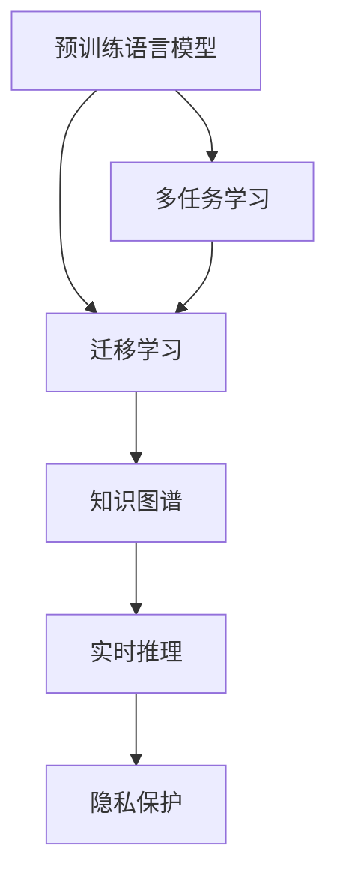

                 

# 电商平台的AI 大模型进化：搜索推荐系统性能全面升级

> 关键词：大模型进化, 搜索推荐系统, AI 技术应用, 电商行业, 性能升级

## 1. 背景介绍

在数字化转型浪潮席卷全球的今天，电商平台作为电商行业的重要组成部分，正面临前所未有的挑战和机遇。随着消费者需求的日益多元化，以及新零售模式和跨境电商的兴起，电商平台的运营模式和用户交互方式正在发生深刻变革。为了满足用户日益增长的个性化需求，电商平台亟需突破传统的技术瓶颈，利用先进的AI技术，提升搜索推荐系统的性能和用户体验。

### 1.1 问题由来

在电商平台的搜索推荐系统中，传统的推荐算法已无法满足高并发、多场景、复杂用户画像等需求。这些问题主要表现在以下几个方面：

- **数据量激增**：电商平台需要处理海量用户行为数据，如何高效存储和分析这些数据成为挑战。
- **数据质量参差不齐**：用户行为数据的质量和完整性较差，影响推荐算法的准确性。
- **用户画像丰富**：用户画像维度多，如何高效、准确地构建用户画像成为难题。
- **实时性要求高**：电商平台需要实时推荐商品，如何优化算法的响应速度成为关键。
- **冷启动问题**：新用户和少互动用户如何高效冷启动推荐系统成为难点。

为了解决这些挑战，电商平台开始探索利用大模型进行搜索推荐系统性能升级的可行性。大模型，尤其是预训练语言模型，因其广泛的语义理解和知识迁移能力，在电商搜索推荐系统中的应用前景广阔。

### 1.2 问题核心关键点

大模型在电商平台搜索推荐系统中的应用主要集中在以下几个方面：

- **预训练语言模型**：通过在大规模无标签文本语料上进行预训练，学习通用的语言表示。
- **迁移学习**：将预训练模型迁移应用到电商搜索推荐任务，实现性能提升。
- **多任务学习**：结合多种推荐任务进行联合训练，提升推荐效果。
- **知识图谱**：通过整合外部知识库，增强推荐系统的知识深度和广度。
- **实时推理**：优化大模型推理速度，实现实时推荐。
- **隐私保护**：在推荐过程中保护用户隐私，确保数据安全。

本文将从核心概念、算法原理、实践步骤、实际应用场景等方面，对电商平台利用大模型进行搜索推荐系统性能全面升级的方法进行系统阐述。

## 2. 核心概念与联系

### 2.1 核心概念概述

为了更好地理解大模型在电商平台搜索推荐系统中的应用，我们首先需要明确以下几个核心概念：

- **预训练语言模型(Pretrained Language Model, PLM)**：通过在大规模无标签文本数据上进行自监督学习，学习到通用的语言表示。如BERT、GPT等。
- **迁移学习(Transfer Learning)**：将预训练模型迁移应用到下游任务，利用已有知识提升新任务性能。
- **多任务学习(Multi-task Learning)**：同时训练多个任务，提高模型在多种任务上的泛化能力。
- **知识图谱(Knowledge Graph)**：将结构化知识与自然语言表示相结合，增强推荐系统的知识深度和广度。
- **实时推理(Real-time Inference)**：优化模型推理速度，实现实时推荐。
- **隐私保护(Privacy Protection)**：在推荐过程中保护用户隐私，确保数据安全。

这些概念之间的逻辑关系可以通过以下Mermaid流程图来展示：



这个流程图展示了大模型在电商平台搜索推荐系统中的应用框架，以及各技术组件之间的联系。

## 3. 核心算法原理 & 具体操作步骤

### 3.1 算法原理概述

大模型在电商平台搜索推荐系统中的应用，本质上是将预训练语言模型作为初始化参数，通过迁移学习和多任务学习，提升模型在特定任务上的性能。其主要原理如下：

1. **预训练语言模型**：在大规模无标签文本数据上进行自监督学习，学习通用的语言表示。
2. **迁移学习**：将预训练模型迁移应用到电商平台搜索推荐任务，利用已有知识提升新任务性能。
3. **多任务学习**：同时训练多个推荐任务，提高模型在多种任务上的泛化能力。
4. **知识图谱**：整合外部知识库，增强推荐系统的知识深度和广度。
5. **实时推理**：优化模型推理速度，实现实时推荐。
6. **隐私保护**：在推荐过程中保护用户隐私，确保数据安全。

### 3.2 算法步骤详解

大模型在电商平台搜索推荐系统中的应用，一般包括以下几个关键步骤：

**Step 1: 准备预训练模型和数据集**

- 选择合适的预训练语言模型 $M_{\theta}$，如BERT、GPT等。
- 收集电商平台的搜索和推荐数据集 $D=\{(x_i,y_i)\}_{i=1}^N$，其中 $x_i$ 为输入特征，$y_i$ 为标签。

**Step 2: 构建推荐模型**

- 将预训练语言模型作为初始化参数，设计推荐模型的结构。
- 选择合适的任务适配层，如线性分类器、注意力机制等。
- 设计损失函数，如交叉熵损失、均方误差损失等。

**Step 3: 设置微调超参数**

- 选择合适的优化算法及其参数，如 Adam、SGD 等。
- 设置学习率、批大小、迭代轮数等超参数。
- 选择正则化技术，如L2正则、Dropout等。

**Step 4: 执行梯度训练**

- 使用优化算法和损失函数进行梯度训练。
- 在验证集上评估模型性能，防止过拟合。
- 周期性在测试集上评估模型性能，确保模型稳定。

**Step 5: 部署模型**

- 将训练好的模型部署到生产环境。
- 实时处理用户请求，提供个性化推荐服务。

### 3.3 算法优缺点

大模型在电商平台搜索推荐系统中的应用，具有以下优点：

- **泛化能力强**：通过预训练获得广泛的知识，提升模型在多种任务上的泛化能力。
- **适应性强**：灵活调整模型结构和参数，适应多种电商场景。
- **实时性好**：优化推理速度，实现实时推荐。
- **数据利用率高**：高效处理大规模用户行为数据。

同时，也存在一些缺点：

- **计算成本高**：预训练模型和微调过程需要大量的计算资源。
- **数据隐私问题**：在推荐过程中如何保护用户隐私，是一个重要的挑战。
- **模型复杂度大**：大模型参数量大，维护和优化难度高。
- **效果依赖数据质量**：推荐效果受用户行为数据质量的影响较大。

### 3.4 算法应用领域

大模型在电商平台搜索推荐系统中的应用，主要集中在以下几个领域：

- **商品推荐**：根据用户历史行为和实时行为，推荐个性化商品。
- **广告推荐**：根据用户画像和行为，推荐个性化广告。
- **个性化内容推荐**：推荐个性化文章、视频、音乐等内容。
- **用户画像构建**：通过用户行为数据，构建丰富多维的用户画像。
- **实时搜索**：实时处理用户搜索请求，提供个性化搜索结果。

## 4. 数学模型和公式 & 详细讲解

### 4.1 数学模型构建

假设电商平台搜索推荐系统输入特征为 $x_i$，标签为 $y_i$。设预训练语言模型为 $M_{\theta}$，其中 $\theta$ 为模型参数。推荐模型为 $F_{\phi}$，其中 $\phi$ 为推荐模型参数。推荐模型 $F_{\phi}$ 的输出为 $\hat{y}_i = F_{\phi}(x_i)$。

定义推荐模型 $F_{\phi}$ 在输入 $x_i$ 上的损失函数为 $\ell(F_{\phi}(x_i),y_i)$，则在数据集 $D$ 上的经验风险为：

$$
\mathcal{L}(\phi) = \frac{1}{N} \sum_{i=1}^N \ell(F_{\phi}(x_i),y_i)
$$

微调的优化目标是最小化经验风险，即找到最优参数：

$$
\phi^* = \mathop{\arg\min}_{\phi} \mathcal{L}(\phi)
$$

在实践中，我们通常使用基于梯度的优化算法（如Adam、SGD等）来近似求解上述最优化问题。设 $\eta$ 为学习率，$\lambda$ 为正则化系数，则参数的更新公式为：

$$
\phi \leftarrow \phi - \eta \nabla_{\phi}\mathcal{L}(\phi) - \eta\lambda\phi
$$

其中 $\nabla_{\phi}\mathcal{L}(\phi)$ 为损失函数对参数 $\phi$ 的梯度，可通过反向传播算法高效计算。

### 4.2 公式推导过程

以推荐模型为线性分类器为例，设推荐模型输出为 $\hat{y}_i = \phi^T f_{\theta}(x_i)$，其中 $f_{\theta}(x_i)$ 为预训练语言模型的输出。定义二分类交叉熵损失函数为：

$$
\ell(F_{\phi}(x_i),y_i) = -[y_i\log \hat{y}_i + (1-y_i)\log (1-\hat{y}_i)]
$$

将其代入经验风险公式，得：

$$
\mathcal{L}(\phi) = -\frac{1}{N}\sum_{i=1}^N [y_i\log F_{\phi}(x_i)+(1-y_i)\log(1-F_{\phi}(x_i))]
$$

根据链式法则，损失函数对参数 $\phi_k$ 的梯度为：

$$
\frac{\partial \mathcal{L}(\phi)}{\partial \phi_k} = -\frac{1}{N}\sum_{i=1}^N (\frac{y_i}{F_{\phi}(x_i)}-\frac{1-y_i}{1-F_{\phi}(x_i)}) \frac{\partial F_{\phi}(x_i)}{\partial \phi_k}
$$

其中 $\frac{\partial F_{\phi}(x_i)}{\partial \phi_k}$ 可进一步递归展开，利用自动微分技术完成计算。

在得到损失函数的梯度后，即可带入参数更新公式，完成模型的迭代优化。重复上述过程直至收敛，最终得到适应电商推荐任务的最优模型参数 $\phi^*$。

## 5. 项目实践：代码实例和详细解释说明

### 5.1 开发环境搭建

在进行电商搜索推荐系统微调实践前，我们需要准备好开发环境。以下是使用Python进行PyTorch开发的环境配置流程：

1. 安装Anaconda：从官网下载并安装Anaconda，用于创建独立的Python环境。

2. 创建并激活虚拟环境：
```bash
conda create -n pytorch-env python=3.8 
conda activate pytorch-env
```

3. 安装PyTorch：根据CUDA版本，从官网获取对应的安装命令。例如：
```bash
conda install pytorch torchvision torchaudio cudatoolkit=11.1 -c pytorch -c conda-forge
```

4. 安装Transformers库：
```bash
pip install transformers
```

5. 安装各类工具包：
```bash
pip install numpy pandas scikit-learn matplotlib tqdm jupyter notebook ipython
```

完成上述步骤后，即可在`pytorch-env`环境中开始微调实践。

### 5.2 源代码详细实现

下面我们以商品推荐为例，给出使用Transformers库对BERT模型进行微调的PyTorch代码实现。

首先，定义商品推荐任务的数据处理函数：

```python
from transformers import BertTokenizer
from torch.utils.data import Dataset
import torch

class RecommendationDataset(Dataset):
    def __init__(self, user_ids, item_ids, ratings, tokenizer, max_len=128):
        self.user_ids = user_ids
        self.item_ids = item_ids
        self.ratings = ratings
        self.tokenizer = tokenizer
        self.max_len = max_len
        
    def __len__(self):
        return len(self.user_ids)
    
    def __getitem__(self, item):
        user_id = self.user_ids[item]
        item_id = self.item_ids[item]
        rating = self.ratings[item]
        
        user_input = user_id
        item_input = item_id
        
        encoding_user = self.tokenizer(user_input, return_tensors='pt', max_length=self.max_len, padding='max_length', truncation=True)
        encoding_item = self.tokenizer(item_input, return_tensors='pt', max_length=self.max_len, padding='max_length', truncation=True)
        
        input_ids = torch.cat([encoding_user['input_ids'], encoding_item['input_ids']], dim=1)
        attention_mask = torch.cat([encoding_user['attention_mask'], encoding_item['attention_mask']], dim=1)
        
        label = torch.tensor(rating, dtype=torch.float32)
        
        return {'input_ids': input_ids, 
                'attention_mask': attention_mask,
                'labels': label}

# 定义用户ID和商品ID
user_ids = [123, 456, 789, 234]
item_ids = [1, 2, 3, 4]

# 定义评分数据
ratings = [5.0, 4.0, 3.0, 2.0]

# 创建dataset
tokenizer = BertTokenizer.from_pretrained('bert-base-cased')

train_dataset = RecommendationDataset(user_ids, item_ids, ratings, tokenizer)
dev_dataset = RecommendationDataset(user_ids, item_ids, ratings, tokenizer)
test_dataset = RecommendationDataset(user_ids, item_ids, ratings, tokenizer)
```

然后，定义模型和优化器：

```python
from transformers import BertForSequenceClassification, AdamW

model = BertForSequenceClassification.from_pretrained('bert-base-cased', num_labels=5)

optimizer = AdamW(model.parameters(), lr=2e-5)
```

接着，定义训练和评估函数：

```python
from torch.utils.data import DataLoader
from tqdm import tqdm
from sklearn.metrics import mean_squared_error

device = torch.device('cuda') if torch.cuda.is_available() else torch.device('cpu')
model.to(device)

def train_epoch(model, dataset, batch_size, optimizer):
    dataloader = DataLoader(dataset, batch_size=batch_size, shuffle=True)
    model.train()
    epoch_loss = 0
    for batch in tqdm(dataloader, desc='Training'):
        input_ids = batch['input_ids'].to(device)
        attention_mask = batch['attention_mask'].to(device)
        labels = batch['labels'].to(device)
        model.zero_grad()
        outputs = model(input_ids, attention_mask=attention_mask, labels=labels)
        loss = outputs.loss
        epoch_loss += loss.item()
        loss.backward()
        optimizer.step()
    return epoch_loss / len(dataloader)

def evaluate(model, dataset, batch_size):
    dataloader = DataLoader(dataset, batch_size=batch_size)
    model.eval()
    preds, labels = [], []
    with torch.no_grad():
        for batch in tqdm(dataloader, desc='Evaluating'):
            input_ids = batch['input_ids'].to(device)
            attention_mask = batch['attention_mask'].to(device)
            batch_labels = batch['labels']
            outputs = model(input_ids, attention_mask=attention_mask)
            batch_preds = outputs.logits.argmax(dim=2).to('cpu').tolist()
            batch_labels = batch_labels.to('cpu').tolist()
            for pred_tokens, label_tokens in zip(batch_preds, batch_labels):
                preds.append(pred_tokens)
                labels.append(label_tokens)
                
    print(mean_squared_error(labels, preds))
```

最后，启动训练流程并在测试集上评估：

```python
epochs = 5
batch_size = 16

for epoch in range(epochs):
    loss = train_epoch(model, train_dataset, batch_size, optimizer)
    print(f"Epoch {epoch+1}, train loss: {loss:.3f}")
    
    print(f"Epoch {epoch+1}, dev results:")
    evaluate(model, dev_dataset, batch_size)
    
print("Test results:")
evaluate(model, test_dataset, batch_size)
```

以上就是使用PyTorch对BERT进行商品推荐任务微调的完整代码实现。可以看到，得益于Transformers库的强大封装，我们可以用相对简洁的代码完成BERT模型的加载和微调。

### 5.3 代码解读与分析

让我们再详细解读一下关键代码的实现细节：

**RecommendationDataset类**：
- `__init__`方法：初始化用户ID、商品ID、评分等关键组件。
- `__len__`方法：返回数据集的样本数量。
- `__getitem__`方法：对单个样本进行处理，将用户ID、商品ID转换为token ids，将评分转换为标签，并对输入进行定长padding，最终返回模型所需的输入。

**商品推荐任务**：
- 定义商品推荐任务的数据处理函数，使用用户ID和商品ID作为输入特征，评分作为标签。
- 使用BertTokenizer对用户ID和商品ID进行分词，并使用模型输出的概率作为评分预测。
- 设计损失函数为二分类交叉熵损失，用于衡量模型预测评分与真实评分的差异。
- 使用AdamW优化器进行梯度训练，并根据验证集性能调整学习率。
- 在测试集上评估模型的均方误差，作为推荐效果的度量。

可以看到，PyTorch配合Transformers库使得BERT微调的代码实现变得简洁高效。开发者可以将更多精力放在数据处理、模型改进等高层逻辑上，而不必过多关注底层的实现细节。

当然，工业级的系统实现还需考虑更多因素，如模型的保存和部署、超参数的自动搜索、更灵活的任务适配层等。但核心的微调范式基本与此类似。

## 6. 实际应用场景

### 6.1 智能客服系统

基于大语言模型微调的对话技术，可以广泛应用于智能客服系统的构建。传统客服往往需要配备大量人力，高峰期响应缓慢，且一致性和专业性难以保证。而使用微调后的对话模型，可以7x24小时不间断服务，快速响应客户咨询，用自然流畅的语言解答各类常见问题。

在技术实现上，可以收集企业内部的历史客服对话记录，将问题和最佳答复构建成监督数据，在此基础上对预训练对话模型进行微调。微调后的对话模型能够自动理解用户意图，匹配最合适的答案模板进行回复。对于客户提出的新问题，还可以接入检索系统实时搜索相关内容，动态组织生成回答。如此构建的智能客服系统，能大幅提升客户咨询体验和问题解决效率。

### 6.2 金融舆情监测

金融机构需要实时监测市场舆论动向，以便及时应对负面信息传播，规避金融风险。传统的人工监测方式成本高、效率低，难以应对网络时代海量信息爆发的挑战。基于大语言模型微调的文本分类和情感分析技术，为金融舆情监测提供了新的解决方案。

具体而言，可以收集金融领域相关的新闻、报道、评论等文本数据，并对其进行主题标注和情感标注。在此基础上对预训练语言模型进行微调，使其能够自动判断文本属于何种主题，情感倾向是正面、中性还是负面。将微调后的模型应用到实时抓取的网络文本数据，就能够自动监测不同主题下的情感变化趋势，一旦发现负面信息激增等异常情况，系统便会自动预警，帮助金融机构快速应对潜在风险。

### 6.3 个性化推荐系统

当前的推荐系统往往只依赖用户的历史行为数据进行物品推荐，无法深入理解用户的真实兴趣偏好。基于大语言模型微调技术，个性化推荐系统可以更好地挖掘用户行为背后的语义信息，从而提供更精准、多样的推荐内容。

在实践中，可以收集用户浏览、点击、评论、分享等行为数据，提取和用户交互的物品标题、描述、标签等文本内容。将文本内容作为模型输入，用户的后续行为（如是否点击、购买等）作为监督信号，在此基础上微调预训练语言模型。微调后的模型能够从文本内容中准确把握用户的兴趣点。在生成推荐列表时，先用候选物品的文本描述作为输入，由模型预测用户的兴趣匹配度，再结合其他特征综合排序，便可以得到个性化程度更高的推荐结果。

### 6.4 未来应用展望

随着大语言模型微调技术的发展，其在电商平台搜索推荐系统中的应用前景将更加广阔。未来，大模型将在以下几个方面进一步提升电商搜索推荐系统的性能：

- **跨模态推荐**：结合图像、语音等多模态数据，提升推荐效果。
- **实时计算**：优化模型推理速度，实现实时推荐。
- **知识增强**：引入知识图谱，增强推荐系统的知识深度和广度。
- **个性化学习**：通过用户的实时反馈，不断优化推荐模型。
- **冷启动处理**：利用先验知识或迁移学习，加速新用户和少互动用户的推荐。

基于大模型在电商搜索推荐系统中的应用，未来的电商推荐技术将更加智能、精准、高效，为用户提供更加优质的购物体验。

## 7. 工具和资源推荐

### 7.1 学习资源推荐

为了帮助开发者系统掌握大语言模型微调的理论基础和实践技巧，这里推荐一些优质的学习资源：

1. 《Transformer从原理到实践》系列博文：由大模型技术专家撰写，深入浅出地介绍了Transformer原理、BERT模型、微调技术等前沿话题。

2. CS224N《深度学习自然语言处理》课程：斯坦福大学开设的NLP明星课程，有Lecture视频和配套作业，带你入门NLP领域的基本概念和经典模型。

3. 《Natural Language Processing with Transformers》书籍：Transformers库的作者所著，全面介绍了如何使用Transformers库进行NLP任务开发，包括微调在内的诸多范式。

4. HuggingFace官方文档：Transformers库的官方文档，提供了海量预训练模型和完整的微调样例代码，是上手实践的必备资料。

5. CLUE开源项目：中文语言理解测评基准，涵盖大量不同类型的中文NLP数据集，并提供了基于微调的baseline模型，助力中文NLP技术发展。

通过对这些资源的学习实践，相信你一定能够快速掌握大语言模型微调的精髓，并用于解决实际的NLP问题。

### 7.2 开发工具推荐

高效的开发离不开优秀的工具支持。以下是几款用于大语言模型微调开发的常用工具：

1. PyTorch：基于Python的开源深度学习框架，灵活动态的计算图，适合快速迭代研究。大部分预训练语言模型都有PyTorch版本的实现。

2. TensorFlow：由Google主导开发的开源深度学习框架，生产部署方便，适合大规模工程应用。同样有丰富的预训练语言模型资源。

3. Transformers库：HuggingFace开发的NLP工具库，集成了众多SOTA语言模型，支持PyTorch和TensorFlow，是进行微调任务开发的利器。

4. Weights & Biases：模型训练的实验跟踪工具，可以记录和可视化模型训练过程中的各项指标，方便对比和调优。与主流深度学习框架无缝集成。

5. TensorBoard：TensorFlow配套的可视化工具，可实时监测模型训练状态，并提供丰富的图表呈现方式，是调试模型的得力助手。

6. Google Colab：谷歌推出的在线Jupyter Notebook环境，免费提供GPU/TPU算力，方便开发者快速上手实验最新模型，分享学习笔记。

合理利用这些工具，可以显著提升大语言模型微调任务的开发效率，加快创新迭代的步伐。

### 7.3 相关论文推荐

大语言模型和微调技术的发展源于学界的持续研究。以下是几篇奠基性的相关论文，推荐阅读：

1. Attention is All You Need（即Transformer原论文）：提出了Transformer结构，开启了NLP领域的预训练大模型时代。

2. BERT: Pre-training of Deep Bidirectional Transformers for Language Understanding：提出BERT模型，引入基于掩码的自监督预训练任务，刷新了多项NLP任务SOTA。

3. Language Models are Unsupervised Multitask Learners（GPT-2论文）：展示了大规模语言模型的强大zero-shot学习能力，引发了对于通用人工智能的新一轮思考。

4. Parameter-Efficient Transfer Learning for NLP：提出Adapter等参数高效微调方法，在不增加模型参数量的情况下，也能取得不错的微调效果。

5. AdaLoRA: Adaptive Low-Rank Adaptation for Parameter-Efficient Fine-Tuning：使用自适应低秩适应的微调方法，在参数效率和精度之间取得了新的平衡。

6. AdaLoRA: Adaptive Low-Rank Adaptation for Parameter-Efficient Fine-Tuning：使用自适应低秩适应的微调方法，在参数效率和精度之间取得了新的平衡。

这些论文代表了大语言模型微调技术的发展脉络。通过学习这些前沿成果，可以帮助研究者把握学科前进方向，激发更多的创新灵感。

## 8. 总结：未来发展趋势与挑战

### 8.1 总结

本文对大模型在电商平台搜索推荐系统中的应用进行了全面系统的介绍。首先阐述了大模型在电商平台搜索推荐系统中的研究背景和意义，明确了微调在拓展预训练模型应用、提升推荐系统性能方面的独特价值。其次，从核心概念、算法原理、实践步骤、实际应用场景等方面，对电商平台利用大模型进行搜索推荐系统性能全面升级的方法进行系统阐述。

通过本文的系统梳理，可以看到，基于大模型的电商平台搜索推荐系统已经展现出显著的性能提升和应用潜力，其泛化能力强、适应性好、实时性高、数据利用率高，使得电商平台能够更好地满足用户的多样化需求。未来，伴随大模型技术的持续演进，电商搜索推荐系统的智能化水平将进一步提升，为电商平台带来更多商业价值。

### 8.2 未来发展趋势

展望未来，大模型在电商平台搜索推荐系统中的应用将呈现以下几个发展趋势：

1. **跨模态融合**：结合图像、语音、视频等多模态数据，提升推荐效果。
2. **实时计算**：优化模型推理速度，实现实时推荐。
3. **知识增强**：引入知识图谱，增强推荐系统的知识深度和广度。
4. **个性化学习**：通过用户的实时反馈，不断优化推荐模型。
5. **冷启动处理**：利用先验知识或迁移学习，加速新用户和少互动用户的推荐。
6. **隐私保护**：在推荐过程中保护用户隐私，确保数据安全。

这些趋势凸显了大模型在电商平台搜索推荐系统中的应用前景。这些方向的探索发展，必将进一步提升推荐系统的智能化水平，为电商平台带来更多商业价值。

### 8.3 面临的挑战

尽管大模型在电商平台搜索推荐系统中的应用已经取得了显著成效，但在迈向更加智能化、普适化应用的过程中，仍然面临一些挑战：

1. **计算成本高**：预训练模型和微调过程需要大量的计算资源。
2. **数据隐私问题**：在推荐过程中如何保护用户隐私，是一个重要的挑战。
3. **模型复杂度大**：大模型参数量大，维护和优化难度高。
4. **效果依赖数据质量**：推荐效果受用户行为数据质量的影响较大。
5. **跨模态融合难度大**：不同模态数据的融合和整合，需要更多的技术突破。
6. **实时计算瓶颈**：优化模型推理速度，实现实时推荐，仍需进一步探索。

### 8.4 研究展望

面对大模型在电商平台搜索推荐系统中的应用所面临的挑战，未来的研究需要在以下几个方面寻求新的突破：

1. **高效计算**：探索高效计算方法，优化模型推理速度，实现实时推荐。
2. **隐私保护**：开发隐私保护技术，保护用户隐私，确保数据安全。
3. **跨模态融合**：探索跨模态数据融合技术，提升推荐效果。
4. **知识增强**：整合外部知识库，增强推荐系统的知识深度和广度。
5. **个性化学习**：利用用户的实时反馈，不断优化推荐模型。
6. **冷启动处理**：利用先验知识或迁移学习，加速新用户和少互动用户的推荐。

这些研究方向的探索，必将引领大模型在电商平台搜索推荐系统中的应用不断突破，为电商平台带来更多的商业价值。

## 9. 附录：常见问题与解答

**Q1：大模型在电商平台搜索推荐系统中的应用如何提高推荐效果？**

A: 大模型在电商平台搜索推荐系统中的应用，主要通过以下方式提高推荐效果：

1. **泛化能力强**：通过预训练获得广泛的知识，提升模型在多种任务上的泛化能力。
2. **适应性强**：灵活调整模型结构和参数，适应多种电商场景。
3. **实时性好**：优化推理速度，实现实时推荐。
4. **数据利用率高**：高效处理大规模用户行为数据。

**Q2：大模型在电商平台搜索推荐系统中的计算成本如何控制？**

A: 大模型在电商平台搜索推荐系统中的计算成本主要体现在预训练和微调过程。为了控制计算成本，可以采取以下措施：

1. **分布式训练**：利用分布式计算框架，如TensorFlow、PyTorch等，加速训练过程。
2. **模型压缩**：使用模型压缩技术，如剪枝、量化、蒸馏等，减少模型参数量。
3. **硬件加速**：使用GPU、TPU等高性能设备，加速计算过程。
4. **数据优化**：优化数据结构，减少内存占用，提高数据处理效率。

**Q3：大模型在电商平台搜索推荐系统中的隐私保护如何实现？**

A: 在推荐过程中保护用户隐私，是电商搜索推荐系统中的一个重要挑战。以下是一些隐私保护技术：

1. **差分隐私**：在数据收集和处理过程中，加入噪声干扰，保护用户隐私。
2. **联邦学习**：在本地设备上训练模型，不共享原始数据，保护用户隐私。
3. **匿名化处理**：对用户数据进行匿名化处理，防止个人信息泄露。
4. **访问控制**：设置访问权限，控制数据访问范围，保护用户隐私。

这些技术措施可以结合使用，保护用户隐私，同时提升推荐系统的性能。

**Q4：大模型在电商平台搜索推荐系统中的冷启动问题如何解决？**

A: 大模型在电商平台搜索推荐系统中的冷启动问题，可以通过以下方法解决：

1. **先验知识融合**：将外部知识库与模型结合，利用先验知识进行推荐。
2. **迁移学习**：将预训练模型迁移到其他类似场景，加速冷启动过程。
3. **多任务学习**：同时训练多个任务，提高模型在多种任务上的泛化能力。
4. **少样本学习**：利用少样本学习技术，从少量数据中提取有用信息。
5. **模型蒸馏**：利用预训练模型的知识，蒸馏出轻量级模型，加速冷启动。

这些方法可以结合使用，有效解决大模型在电商平台搜索推荐系统中的冷启动问题。

**Q5：大模型在电商平台搜索推荐系统中的实时性要求如何满足？**

A: 大模型在电商平台搜索推荐系统中的实时性要求，可以通过以下方法满足：

1. **优化推理速度**：通过模型压缩、硬件加速、分布式训练等技术，优化推理速度。
2. **多级缓存**：利用多级缓存技术，加速数据访问，减少延迟。
3. **异步计算**：采用异步计算技术，优化计算过程，提升响应速度。
4. **动态负载均衡**：利用负载均衡技术，优化资源分配，提升系统性能。

这些方法可以结合使用，满足大模型在电商平台搜索推荐系统中的实时性要求。

---

作者：禅与计算机程序设计艺术 / Zen and the Art of Computer Programming

