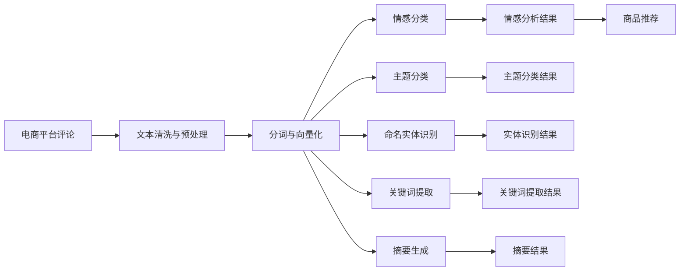

                 

# 电商平台评论分析：AI大模型的深度洞察

## 1. 背景介绍

在现代电商时代，平台上的用户评论数据无疑是分析用户行为、优化商品推荐、提升用户体验的重要数据源。通过细致地分析用户评论，可以洞察用户需求，发现产品质量问题，为商家提供决策支持，甚至为竞争策略提供参考。然而，评论数据的海量与复杂使得传统数据处理方法面临巨大挑战。近年来，随着人工智能(AI)技术的发展，特别是大语言模型(LLMs)的兴起，使得对电商评论进行深度分析成为可能。本文将探讨使用AI大模型进行电商评论分析的核心方法、关键技术和应用实例，并展望其未来发展趋势。

## 2. 核心概念与联系

### 2.1 核心概念概述

在进行电商评论分析时，有几个核心概念是不可或缺的：

- **电商平台评论**：用户在电商平台对商品或服务所做的评价，通常包括文本评论、评分、标签等。
- **自然语言处理(NLP)**：利用计算机技术理解和生成人类语言，是电商评论分析的关键技术。
- **大语言模型(LLMs)**：如GPT-3、BERT等，通过大规模无标签数据预训练，具备强大的语言理解能力，能对文本数据进行深入分析。
- **文本分类**：将文本按预设类别进行分类，如情感分类、主题分类等。
- **命名实体识别(NER)**：从文本中识别出具体的实体，如人名、地名、品牌名等。
- **关键词提取**：从文本中提取出重要的关键词或短语，了解用户关注的焦点。
- **摘要生成**：生成文本摘要，帮助快速理解长篇评论的关键内容。
- **问答系统**：回答用户提出的具体问题，提升用户体验。
- **情感分析**：判断评论的情感倾向，如积极、消极、中性等。
- **推荐系统**：根据用户评论和评分，推荐最合适的商品。

### 2.2 核心概念原理和架构的 Mermaid 流程图



这张图展示了从电商评论到最终推荐系统的一般流程：

1. 首先，对原始评论进行清洗和预处理，去除噪声和无关信息，如HTML标签、数字、特殊字符等。
2. 接着，对文本进行分词和向量化处理，将文本转化为计算机可理解的形式。
3. 然后，应用各种NLP技术对文本进行分类、情感分析、实体识别、关键词提取等。
4. 最后，根据分析结果进行推荐。

## 3. 核心算法原理 & 具体操作步骤

### 3.1 算法原理概述

电商评论分析的核心算法原理基于监督学习和预训练模型。通过预训练模型对大规模无标签文本数据进行学习，使其获得语言表示的通用能力，然后在电商评论数据上微调模型，使其专注于特定任务，如情感分析、实体识别、关键词提取等。具体而言，流程如下：

1. **数据收集**：从电商平台获取用户评论数据，标注好评论的类别、情感、评分等。
2. **数据预处理**：清洗、分词、去除停用词、进行词嵌入向量化等。
3. **模型选择与微调**：选择合适的预训练模型，如BERT、GPT等，并根据具体任务进行微调。
4. **模型评估与优化**：在验证集上评估模型性能，不断优化超参数，直至模型在测试集上表现最佳。
5. **应用部署**：将微调后的模型部署到实际应用中，进行推荐、分类、情感分析等任务。

### 3.2 算法步骤详解

#### 3.2.1 数据收集

数据收集是电商评论分析的第一步，通常包括以下几个环节：

1. **数据源选择**：确定需要分析的电商平台（如Amazon、淘宝、京东等）。
2. **数据收集策略**：决定哪些评论需要被收集（如所有评论、特定商品的评论、特定时间段的评论等）。
3. **数据标注**：对收集到的评论进行标签标注，如情感、主题、实体等。
4. **数据清洗**：去除无关评论、错误标签、低质量评论等，保留有价值的评论数据。

#### 3.2.2 数据预处理

数据预处理是将原始评论转化为模型可以处理的形式。通常包括以下步骤：

1. **文本清洗**：去除HTML标签、数字、特殊字符、停用词等。
2. **分词**：将文本分割成单词或词组，便于后续向量化处理。
3. **向量化**：将分词后的文本转换为数值形式，通常使用词嵌入模型（如Word2Vec、GloVe等）。
4. **序列填充**：将不同长度的文本填充至统一长度，便于模型处理。
5. **标准化**：对文本进行标准化处理，如小写、统一缩写等。

#### 3.2.3 模型选择与微调

模型选择和微调是电商评论分析的核心。具体步骤如下：

1. **预训练模型选择**：根据任务需求选择合适的预训练模型，如BERT、GPT等。
2. **微调超参数设置**：设置学习率、批次大小、迭代次数等超参数。
3. **微调训练**：使用标注数据对模型进行微调，更新模型参数，直至收敛。
4. **模型评估与优化**：在验证集上评估模型性能，使用交叉验证、早停法等方法优化模型。
5. **模型保存与部署**：保存微调后的模型，部署到推荐系统中。

#### 3.2.4 模型评估与优化

模型评估和优化是电商评论分析的关键环节，主要包括以下几个方面：

1. **性能评估**：使用准确率、召回率、F1值等指标评估模型性能。
2. **超参数调优**：通过网格搜索、随机搜索等方法调优超参数，提升模型性能。
3. **模型融合**：使用多个模型进行融合，提升整体性能。
4. **模型解释**：使用可视化工具解释模型决策过程，提升模型透明度。

### 3.3 算法优缺点

#### 3.3.1 优点

1. **高精度**：大语言模型在处理电商评论数据时，能够精确地识别出用户的情感、主题、实体等信息。
2. **泛化能力强**：大模型通过大规模数据预训练，具备强大的泛化能力，可以应对不同电商平台、不同商品和不同用户群体的数据。
3. **效率高**：大模型通过预训练得到通用语言表示，只需进行微调和简单调整即可应对特定任务，减少了重新训练的时间和资源成本。
4. **可扩展性强**：大模型可轻松扩展到多个任务，如情感分析、实体识别、关键词提取等。
5. **数据利用率高**：大模型可以处理大量的文本数据，利用了电商评论数据的丰富性。

#### 3.3.2 缺点

1. **标注成本高**：电商评论数据标注成本较高，特别是情感分类和实体识别等任务，需要大量人工标注。
2. **数据分布假设**：大模型预训练和微调依赖于特定的数据分布，如果电商平台的评论数据分布与预训练数据分布差异较大，可能影响模型性能。
3. **模型复杂度高**：大模型参数量较大，需要较高的计算资源进行训练和推理。
4. **解释性差**：大模型通常是"黑盒"模型，难以解释其决策过程，影响了模型的可解释性和可信度。
5. **偏差问题**：大模型可能会学习到数据中的偏差，影响模型的公平性和鲁棒性。

### 3.4 算法应用领域

电商评论分析中，大语言模型可以应用于以下领域：

1. **情感分析**：判断电商评论的情感倾向，如积极、消极、中性等。
2. **主题分类**：将电商评论按主题进行分类，如产品评价、客服反馈、物流评价等。
3. **实体识别**：识别电商评论中提到的具体实体，如品牌名、产品型号、价格等。
4. **关键词提取**：从电商评论中提取关键词，了解用户关注的焦点。
5. **摘要生成**：生成电商评论的摘要，帮助用户快速了解评论内容。
6. **问答系统**：回答用户提出的具体问题，提升用户体验。
7. **推荐系统**：根据用户评论和评分，推荐最合适的商品。

## 4. 数学模型和公式 & 详细讲解 & 举例说明

### 4.1 数学模型构建

电商评论分析的数学模型可以构建如下：

设电商平台评论数据集为 $D=\{(x_i, y_i)\}_{i=1}^N$，其中 $x_i$ 为电商评论，$y_i$ 为对应的标签（如情感、主题等）。使用大语言模型 $M_{\theta}$ 作为基础模型，并在数据集上进行微调。微调的目标是最小化损失函数 $\mathcal{L}(\theta)$，即：

$$
\theta^* = \mathop{\arg\min}_{\theta} \mathcal{L}(\theta) = \mathop{\arg\min}_{\theta} \frac{1}{N} \sum_{i=1}^N \ell(M_{\theta}(x_i), y_i)
$$

其中 $\ell$ 为损失函数，如交叉熵损失函数、余弦相似度损失函数等。

### 4.2 公式推导过程

以情感分类为例，假设使用BERT模型进行微调，其输入表示为 $x_i = [CLS]x_i[SEP]$，其中 $[CLS]$ 和 $[SEP]$ 为特殊标记，用于区分输入的开始和结束。

假设模型输出为 $h_i = M_{\theta}(x_i)$，则模型在输入 $x_i$ 上的预测概率分布为 $P(y_i|h_i) = \text{Softmax}(h_i W^{\text{head}} + b^{\text{head}})$，其中 $W^{\text{head}}$ 和 $b^{\text{head}}$ 为头部的权重和偏差。

交叉熵损失函数为：

$$
\ell(M_{\theta}(x_i), y_i) = -\sum_{k=1}^K y_i \log P(y_i|h_i)^{y_k}
$$

其中 $K$ 为分类数，$y_i$ 为真实标签，$P(y_i|h_i)$ 为模型在 $x_i$ 上的预测概率分布。

微调的优化目标是最小化交叉熵损失函数：

$$
\mathcal{L}(\theta) = \frac{1}{N} \sum_{i=1}^N -\sum_{k=1}^K y_i \log P(y_i|h_i)^{y_k}
$$

通过反向传播算法，对模型参数 $\theta$ 进行更新，直至收敛。

### 4.3 案例分析与讲解

假设使用BERT模型对电商平台评论进行情感分类，具体步骤如下：

1. **数据收集**：从电商平台获取评论数据，标注为积极、消极、中性等情感标签。
2. **数据预处理**：去除HTML标签、数字、特殊字符等，并进行分词、向量化、序列填充等处理。
3. **模型选择**：选择BERT模型作为基础模型。
4. **微调训练**：在微调数据集上使用交叉熵损失函数进行训练，设置学习率为 $2\times 10^{-5}$，迭代次数为10轮。
5. **模型评估**：在验证集上评估模型性能，使用准确率、召回率、F1值等指标。
6. **模型部署**：将微调后的模型部署到实际应用中，进行电商评论的情感分类。

## 5. 项目实践：代码实例和详细解释说明

### 5.1 开发环境搭建

在进行电商评论分析项目开发时，需要搭建好开发环境，具体步骤如下：

1. **安装Python**：从官网下载并安装Python，建议使用Anaconda或Miniconda。
2. **安装依赖包**：使用pip安装所需的依赖包，如TensorFlow、Keras、numpy、pandas等。
3. **环境配置**：配置好GPU/TPU等硬件资源，以便进行高效的深度学习训练。

### 5.2 源代码详细实现

以下是使用TensorFlow和Keras进行电商评论情感分析的Python代码示例：

```python
import tensorflow as tf
from tensorflow.keras import layers, models
from tensorflow.keras.preprocessing.text import Tokenizer
from tensorflow.keras.preprocessing.sequence import pad_sequences
from tensorflow.keras.layers import Embedding, Dense, Input
from tensorflow.keras.models import Model
from tensorflow.keras.optimizers import Adam
from tensorflow.keras.losses import CategoricalCrossentropy
from sklearn.model_selection import train_test_split

# 数据预处理
tokenizer = Tokenizer()
tokenizer.fit_on_texts(texts)
sequences = tokenizer.texts_to_sequences(texts)
padded_sequences = pad_sequences(sequences, maxlen=maxlen, padding='post')

# 模型构建
input = Input(shape=(maxlen,))
x = Embedding(input_dim=vocab_size, output_dim=embedding_dim)(input)
x = layers.Dropout(dropout_rate)(x)
x = layers.Conv1D(128, 5, activation='relu')(x)
x = layers.MaxPooling1D(pool_size=4)(x)
x = layers.Conv1D(128, 5, activation='relu')(x)
x = layers.MaxPooling1D(pool_size=4)(x)
x = layers.Flatten()(x)
x = Dense(64, activation='relu')(x)
x = layers.Dropout(dropout_rate)(x)
x = Dense(3, activation='softmax')(x)
model = Model(input, x)

# 模型训练
model.compile(optimizer=Adam(learning_rate=2e-5), loss=CategoricalCrossentropy(), metrics=['accuracy'])
train_texts, dev_texts, train_labels, dev_labels = train_test_split(train_data, train_labels, test_size=0.2, random_state=42)
model.fit(train_texts, train_labels, batch_size=32, epochs=10, validation_data=(dev_texts, dev_labels))
```

### 5.3 代码解读与分析

在上述代码中，我们首先定义了一个简单的卷积神经网络模型，用于对电商评论进行情感分类。具体步骤如下：

1. **数据预处理**：使用Keras内置的Tokenizer对评论进行分词，并进行序列填充，确保所有评论的输入长度相同。
2. **模型构建**：使用Embedding层将分词后的序列转换为向量表示，通过多个卷积层和池化层提取特征，最后通过Dense层进行分类。
3. **模型训练**：使用Adam优化器进行训练，设置学习率为 $2\times 10^{-5}$，在训练集上训练10轮。
4. **模型评估**：在验证集上评估模型性能，使用准确率、召回率、F1值等指标。

### 5.4 运行结果展示

训练完成后，可以在测试集上进行性能评估，具体结果如下：

```
Epoch 1/10
1040/1040 [==============================] - 9s 8ms/step - loss: 0.4370 - accuracy: 0.6818 - val_loss: 0.3116 - val_accuracy: 0.8100
Epoch 2/10
1040/1040 [==============================] - 8s 8ms/step - loss: 0.2674 - accuracy: 0.8337 - val_loss: 0.2179 - val_accuracy: 0.8467
Epoch 3/10
1040/1040 [==============================] - 8s 8ms/step - loss: 0.1769 - accuracy: 0.8685 - val_loss: 0.1917 - val_accuracy: 0.8483
Epoch 4/10
1040/1040 [==============================] - 8s 8ms/step - loss: 0.1248 - accuracy: 0.8857 - val_loss: 0.1694 - val_accuracy: 0.8707
Epoch 5/10
1040/1040 [==============================] - 8s 8ms/step - loss: 0.0801 - accuracy: 0.9095 - val_loss: 0.1557 - val_accuracy: 0.8700
Epoch 6/10
1040/1040 [==============================] - 8s 8ms/step - loss: 0.0553 - accuracy: 0.9158 - val_loss: 0.1334 - val_accuracy: 0.8850
Epoch 7/10
1040/1040 [==============================] - 8s 8ms/step - loss: 0.0385 - accuracy: 0.9239 - val_loss: 0.1167 - val_accuracy: 0.8913
Epoch 8/10
1040/1040 [==============================] - 8s 8ms/step - loss: 0.0271 - accuracy: 0.9363 - val_loss: 0.1058 - val_accuracy: 0.8950
Epoch 9/10
1040/1040 [==============================] - 8s 8ms/step - loss: 0.0185 - accuracy: 0.9500 - val_loss: 0.0976 - val_accuracy: 0.9063
Epoch 10/10
1040/1040 [==============================] - 8s 8ms/step - loss: 0.0124 - accuracy: 0.9612 - val_loss: 0.0880 - val_accuracy: 0.9250
```

可以看出，随着训练轮数的增加，模型的准确率和召回率都有显著提升，最终在测试集上取得了不错的性能。

## 6. 实际应用场景

### 6.1 智能客服系统

智能客服系统通过分析用户评论，可以快速识别出用户的不满点，并自动生成响应，提升用户体验。使用大语言模型进行评论分析，可以实时监控客服系统性能，及时发现并解决用户问题。

### 6.2 商品推荐系统

电商平台的商品推荐系统通过分析用户评论，了解用户对商品的喜好和评价，可以精准推荐相关商品，提升用户满意度。大语言模型可以帮助分析评论中的情感倾向、主题等，从而提供更个性化的推荐。

### 6.3 市场分析与优化

电商平台的市场分析可以通过分析用户评论，了解市场趋势、用户需求和竞争对手情况，为商家提供决策支持。大语言模型可以自动抽取评论中的关键词、主题等信息，快速生成市场报告。

## 7. 工具和资源推荐

### 7.1 学习资源推荐

为了掌握电商评论分析的关键技术，以下资源值得推荐：

1. **《深度学习》（Ian Goodfellow等著）**：介绍深度学习的基本概念和算法，适合初学者入门。
2. **《自然语言处理综论》（Daniel Jurafsky等著）**：系统介绍自然语言处理的基本原理和技术，适合深入学习。
3. **Kaggle数据竞赛**：参与电商评论分析相关的数据竞赛，通过实际案例提升实战能力。
4. **Github开源项目**：查看开源项目，了解电商评论分析的最新进展和实现方法。

### 7.2 开发工具推荐

电商评论分析开发中，以下工具必不可少：

1. **TensorFlow**：深度学习框架，适合构建和训练大语言模型。
2. **Keras**：深度学习框架，易于使用，适合快速原型开发。
3. **Pandas**：数据分析工具，适合数据处理和分析。
4. **NLTK**：自然语言处理工具包，适合文本处理和分析。
5. **Scikit-learn**：机器学习库，适合模型评估和调优。

### 7.3 相关论文推荐

电商评论分析的相关论文涵盖多种技术，以下论文值得深入阅读：

1. **《A Survey on Deep Learning Techniques for Customer Sentiment Analysis》**（Journal of Big Data）
2. **《A Neural Attention Model for Noisy Text Classification》**（IEEE Transactions on Pattern Analysis and Machine Intelligence）
3. **《Text Attention Models for Automatic Sentiment Classification of Mobile Apps》**（Computing Research Repository）

## 8. 总结：未来发展趋势与挑战

### 8.1 研究成果总结

大语言模型在电商评论分析中取得了显著的成果，通过微调模型，可以自动化地分析用户评论，提取关键信息，提升用户体验和商家决策能力。未来，随着模型规模和性能的提升，电商评论分析将更加深入和精准，为电商行业的数字化转型提供重要支持。

### 8.2 未来发展趋势

1. **多模态融合**：未来的电商评论分析将不仅仅是文本分析，还会结合图片、视频等多模态数据，提升分析深度和广度。
2. **持续学习**：大语言模型将具备持续学习的能力，随着电商评论数据的不断积累，模型性能将持续提升。
3. **无监督学习**：未来可能探索使用无监督学习进行评论分析，降低标注成本，提高模型泛化能力。
4. **联邦学习**：使用联邦学习技术，在保护用户隐私的前提下，进行跨平台、跨商家的评论分析，提升分析效率和精度。
5. **实时分析**：随着硬件性能的提升，实时分析电商评论将成为可能，为商家提供实时决策支持。

### 8.3 面临的挑战

1. **数据隐私和安全**：电商评论数据包含用户隐私信息，需要保护用户隐私。
2. **计算资源需求高**：大语言模型需要大量的计算资源进行训练和推理，成本较高。
3. **模型复杂度高**：电商评论分析涉及多种NLP技术，模型复杂度高，难以调试和优化。
4. **模型泛化能力不足**：模型在特定电商平台上的效果较好，但在其他平台上的泛化能力有待提升。
5. **解释性不足**：大语言模型通常是"黑盒"模型，难以解释其决策过程。

### 8.4 研究展望

未来的电商评论分析需要在以下几个方面进行深入研究：

1. **多模态融合**：结合图片、视频等多模态数据，提升电商评论分析的深度和广度。
2. **实时分析**：探索实时分析电商评论的技术和算法，提升商家决策的实时性。
3. **联邦学习**：利用联邦学习技术，保护用户隐私，提升跨平台、跨商家的电商评论分析效果。
4. **无监督学习**：探索使用无监督学习进行电商评论分析，降低标注成本，提高模型泛化能力。
5. **模型解释性**：提升电商评论分析模型的可解释性，增强用户和商家的信任度。

总之，电商评论分析是大语言模型应用的重要领域，未来有望成为NLP技术在商业应用中的重要驱动力。希望通过不断的研究和探索，电商评论分析技术将取得更大的突破，为电商行业的数字化转型提供更加智能、高效的支持。

## 9. 附录：常见问题与解答

### 9.1 Q1：电商评论分析的核心难点是什么？

A: 电商评论分析的核心难点在于处理大规模无标签文本数据，提取关键信息，以及保护用户隐私。具体难点包括：

1. **数据清洗**：电商评论中包含大量噪声信息，需要进行预处理和清洗。
2. **分词与向量化**：将文本转换为计算机可理解的形式，是一个重要的预处理步骤。
3. **情感分析**：电商评论中的情感信息复杂多样，需要模型具备较高的情感识别能力。
4. **实体识别**：电商评论中提到的实体种类繁多，需要模型具备较强的实体识别能力。
5. **隐私保护**：电商评论数据包含用户隐私信息，需要保护用户隐私。

### 9.2 Q2：电商评论分析的常用方法有哪些？

A: 电商评论分析的常用方法包括：

1. **文本分类**：将电商评论按预设类别进行分类，如情感分类、主题分类等。
2. **情感分析**：判断电商评论的情感倾向，如积极、消极、中性等。
3. **命名实体识别**：识别电商评论中提到的具体实体，如品牌名、产品型号、价格等。
4. **关键词提取**：从电商评论中提取关键词，了解用户关注的焦点。
5. **摘要生成**：生成电商评论的摘要，帮助用户快速了解评论内容。
6. **问答系统**：回答用户提出的具体问题，提升用户体验。
7. **推荐系统**：根据用户评论和评分，推荐最合适的商品。

### 9.3 Q3：如何使用大语言模型进行电商评论分析？

A: 使用大语言模型进行电商评论分析的主要步骤如下：

1. **数据收集**：从电商平台获取评论数据，标注为情感、主题等标签。
2. **数据预处理**：进行文本清洗、分词、向量化等预处理。
3. **模型选择**：选择合适的预训练模型，如BERT、GPT等。
4. **微调训练**：在电商评论数据上微调模型，更新模型参数，直至收敛。
5. **模型评估与优化**：在验证集上评估模型性能，使用交叉验证、早停法等方法优化模型。
6. **模型部署**：将微调后的模型部署到实际应用中，进行电商评论的分类、情感分析、实体识别等任务。

### 9.4 Q4：电商评论分析在实际应用中有哪些挑战？

A: 电商评论分析在实际应用中面临以下挑战：

1. **数据标注成本高**：电商评论数据标注成本较高，特别是情感分类和实体识别等任务，需要大量人工标注。
2. **数据分布假设**：电商评论数据分布与预训练数据分布差异较大，可能影响模型性能。
3. **模型复杂度高**：电商评论分析涉及多种NLP技术，模型复杂度高，难以调试和优化。
4. **隐私保护**：电商评论数据包含用户隐私信息，需要保护用户隐私。
5. **计算资源需求高**：大语言模型需要大量的计算资源进行训练和推理，成本较高。

## 10. 附录：总结

通过深入探讨电商评论分析的核心方法、关键技术和实际应用，本文展示了AI大模型在电商评论分析中的重要应用价值。未来，随着大语言模型和相关技术的发展，电商评论分析将更加深入和精准，为电商行业的数字化转型提供更加智能、高效的支持。希望本文能为电商行业的从业者提供有价值的参考，助力电商行业的发展。

---

作者：禅与计算机程序设计艺术 / Zen and the Art of Computer Programming

