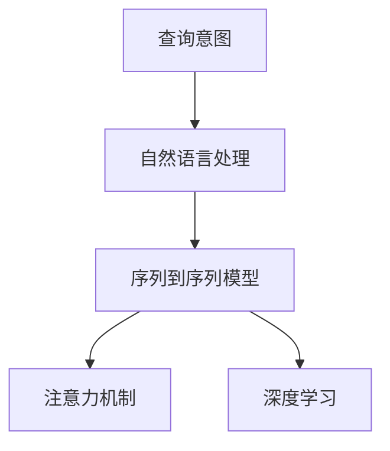
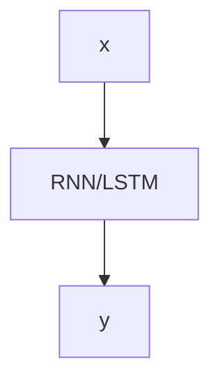
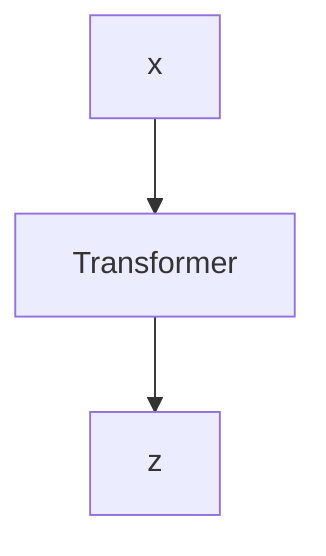

                 

# 电商搜索中的query意图分类与理解技术

## 1. 背景介绍

### 1.1 问题由来
在现代电商平台上，用户通过搜索查询商品信息以辅助购买决策。根据不同的搜索意图，用户的行为和需求呈现出多样性。查询意图的识别和理解对于电商平台而言，不仅能够提升用户体验，还能显著提高搜索相关性，优化广告投放和推荐系统。

例如，用户输入查询“女式运动鞋”时，希望看到不同品牌、价格区间、尺码等具体商品信息；而查询“如何选购运动鞋”时，则希望获取购买指南、用户评价和商品对比等辅助信息。因此，理解用户查询背后的意图，是提升电商搜索体验的重要环节。

### 1.2 问题核心关键点
电商搜索中的query意图识别和理解主要关注以下核心问题：
- 如何构建有效的查询意图分类模型？
- 如何设计高效的意图理解算法？
- 如何在实际应用中提升搜索效果？

本文将系统介绍电商搜索中的query意图分类与理解技术，包括核心概念、算法原理、具体实现及应用场景。

## 2. 核心概念与联系

### 2.1 核心概念概述

为深入理解query意图分类与理解技术，首先需明确几个关键概念：

- **查询意图(Question Intent)**：指用户通过搜索查询表达出的目的和需求。例如，“女式运动鞋”表明查询者需要搜索女式运动鞋商品；“如何选购运动鞋”表示查询者需要关于选购的指导信息。
- **自然语言处理(Natural Language Processing, NLP)**：涉及将自然语言转换为计算机可处理形式的技术，包括分词、词性标注、句法分析、语义理解等。
- **序列到序列模型(Sequence-to-Sequence Model)**：一种经典的NLP任务模型，通过编码器-解码器结构，将输入序列映射为输出序列。
- **注意力机制(Attention Mechanism)**：一种机制，用于提高序列到序列模型的效果，特别是在处理长序列、提取关键信息等方面。
- **深度学习(Deep Learning)**：一种通过多层神经网络提取特征，并应用于各类NLP任务的机器学习方法。

这些概念之间的联系可以通过以下Mermaid流程图展示：



这个流程图揭示了query意图分类与理解技术的核心架构：首先，查询意图被视为输入，通过自然语言处理技术进行转换；然后，序列到序列模型和注意力机制结合，进行意图分类和理解；最终，深度学习技术用于模型训练和优化。

## 3. 核心算法原理 & 具体操作步骤

### 3.1 算法原理概述

query意图分类与理解的核心算法包括意图分类模型和意图理解模型。其中，意图分类模型用于将用户查询划分为不同类别，如产品搜索、购买指南、用户评价等；意图理解模型则用于深入分析查询背后的具体需求和意图，如搜索商品、了解商品信息、比较商品等。

- **意图分类模型**：通过构建序列到序列模型，将输入查询序列映射为输出意图类别序列。常用的模型包括循环神经网络(RNN)和长短时记忆网络(LSTM)。
- **意图理解模型**：同样基于序列到序列模型，通过注意力机制提取查询中的关键信息，并映射为具体的意图和需求。

### 3.2 算法步骤详解

**意图分类模型的训练**：

1. **数据准备**：收集标注有意图的电商搜索数据，划分为训练集和测试集。
2. **模型构建**：选择RNN或LSTM模型，并定义损失函数，如交叉熵损失。
3. **模型训练**：使用训练集数据对模型进行迭代优化，更新模型参数，直至收敛。
4. **模型评估**：在测试集上评估模型性能，选择最优模型。

**意图理解模型的训练**：

1. **数据准备**：收集标注有具体意图和需求的电商搜索数据，划分训练集和测试集。
2. **模型构建**：选择Transformer模型，并添加注意力机制，定义任务目标。
3. **模型训练**：使用训练集数据对模型进行迭代优化，更新模型参数，直至收敛。
4. **模型评估**：在测试集上评估模型性能，选择最优模型。

### 3.3 算法优缺点

**意图分类模型**：
- **优点**：结构简单，易于实现和扩展；对序列长度的容忍度高，适用于处理长查询序列。
- **缺点**：难以捕捉查询序列中的长期依赖关系，可能导致分类准确率受限。

**意图理解模型**：
- **优点**：能够有效地捕捉查询序列中的关键信息，适用于复杂的查询意图理解。
- **缺点**：模型复杂度较高，训练和推理成本较大；对数据标注质量要求高，标注难度较大。

### 3.4 算法应用领域

query意图分类与理解技术在电商搜索中的应用场景非常广泛，包括但不限于：

- **搜索结果排序**：通过识别查询意图，优化搜索结果排序，提升用户体验。
- **商品推荐**：根据查询意图，推荐相关的商品或信息，提高推荐效果。
- **广告投放**：根据查询意图，定制化广告内容，提高广告点击率。
- **用户行为分析**：分析用户的搜索行为，挖掘用户偏好，提供个性化服务。

## 4. 数学模型和公式 & 详细讲解

### 4.1 数学模型构建

假设用户查询为 $x = (x_1, x_2, ..., x_n)$，意图分类目标为 $y = (y_1, y_2, ..., y_m)$。

意图分类模型通常采用循环神经网络(RNN)或长短时记忆网络(LSTM)，结构示意图如下：



模型输入为查询序列 $x$，输出为意图类别序列 $y$。

### 4.2 公式推导过程

假设模型参数为 $\theta$，损失函数为 $\mathcal{L}$，则意图分类模型的优化目标为：

$$
\theta^* = \mathop{\arg\min}_{\theta} \mathcal{L}(M_{\theta}(x), y)
$$

其中，$M_{\theta}(x)$ 为模型 $M_{\theta}$ 对查询 $x$ 的预测结果，$\mathcal{L}$ 为交叉熵损失。

对于意图理解模型，我们同样采用Transformer模型。假设查询为 $x = (x_1, x_2, ..., x_n)$，意图和需求为 $z = (z_1, z_2, ..., z_k)$。模型结构如下：



Transformer模型的编码器-解码器结构如图示。假设编码器参数为 $\theta_E$，解码器参数为 $\theta_D$，则意图理解模型的优化目标为：

$$
(\theta_E^*, \theta_D^*) = \mathop{\arg\min}_{\theta_E, \theta_D} \mathcal{L}(M_{\theta_E, \theta_D}(x), z)
$$

其中，$M_{\theta_E, \theta_D}(x)$ 为模型 $M_{\theta_E, \theta_D}$ 对查询 $x$ 的预测结果，$\mathcal{L}$ 为任务损失函数。

### 4.3 案例分析与讲解

以电商搜索中的“女式运动鞋”查询为例，进行意图分类和理解：

1. **意图分类**：使用RNN模型，对查询“女式运动鞋”进行分类。模型输出的意图类别为“产品搜索”。

2. **意图理解**：使用Transformer模型，对查询“女式运动鞋”进行理解。模型输出的意图为“搜索商品”，需求为“女式”、“运动鞋”。

通过上述过程，电商平台能够精准地理解用户查询意图，进而提供更符合用户需求的搜索结果和服务。

## 5. 项目实践：代码实例和详细解释说明

### 5.1 开发环境搭建

在进行query意图分类与理解技术的开发前，需要搭建合适的开发环境。

1. **环境安装**：
   - 安装Python 3.x环境。
   - 安装TensorFlow 2.x版本。
   - 安装PyTorch 1.x版本。

2. **数据准备**：
   - 收集标注有查询意图和需求的电商搜索数据。
   - 划分训练集和测试集。

3. **模型搭建**：
   - 使用TensorFlow或PyTorch搭建RNN或LSTM模型，或使用Transformer模型。

### 5.2 源代码详细实现

以下是使用TensorFlow搭建RNN模型进行意图分类的示例代码：

```python
import tensorflow as tf
from tensorflow.keras.layers import Embedding, LSTM, Dense

# 定义模型结构
class IntentClassifier(tf.keras.Model):
    def __init__(self, vocab_size, embedding_dim, hidden_units):
        super(IntentClassifier, self).__init__()
        self.embedding = Embedding(vocab_size, embedding_dim)
        self.lstm = LSTM(hidden_units)
        self.dense = Dense(num_classes, activation='softmax')

    def call(self, inputs):
        x = self.embedding(inputs)
        x = self.lstm(x)
        x = self.dense(x)
        return x

# 构建模型
model = IntentClassifier(vocab_size=10000, embedding_dim=100, hidden_units=128)
model.compile(loss='categorical_crossentropy', optimizer='adam', metrics=['accuracy'])

# 训练模型
model.fit(train_data, train_labels, epochs=10, validation_data=(test_data, test_labels))
```

### 5.3 代码解读与分析

** IntentClassifier类**：
- `__init__方法`：初始化模型，定义模型参数。
- `call方法`：定义模型前向传播过程。

**模型训练**：
- 使用训练集数据对模型进行迭代优化，直至收敛。
- 在测试集上评估模型性能，选择最优模型。

## 6. 实际应用场景

### 6.1 电商搜索排序

电商平台的搜索排序依赖于对查询意图的理解。通过意图分类和理解，电商平台能够优化搜索结果排序，提升用户体验。

**具体实现**：
1. **意图分类**：对用户查询进行分类，如产品搜索、购买指南、用户评价等。
2. **意图理解**：分析查询背后的具体需求和意图，如搜索商品、了解商品信息、比较商品等。
3. **排序优化**：根据意图分类和理解结果，优化搜索结果排序，提高相关性和用户体验。

### 6.2 商品推荐

商品推荐系统通过理解用户查询意图，推荐相关的商品或信息。

**具体实现**：
1. **意图分类**：对用户查询进行意图分类，如商品搜索、产品对比、用户评价等。
2. **意图理解**：分析查询背后的具体需求和意图，如搜索某类商品、比较不同品牌、查看用户评价等。
3. **推荐生成**：根据意图分类和理解结果，推荐相关的商品或信息，提高推荐效果。

### 6.3 广告投放

广告投放系统通过理解用户查询意图，定制化广告内容，提高广告点击率。

**具体实现**：
1. **意图分类**：对用户查询进行分类，如搜索广告、品牌广告、用户评价等。
2. **意图理解**：分析查询背后的具体需求和意图，如搜索某类商品、了解商品信息、比较商品等。
3. **广告定制**：根据意图分类和理解结果，定制化广告内容，提高广告点击率。

### 6.4 用户行为分析

用户行为分析通过分析用户的搜索行为，挖掘用户偏好，提供个性化服务。

**具体实现**：
1. **意图分类**：对用户查询进行分类，如搜索行为、购买行为、评价行为等。
2. **意图理解**：分析查询背后的具体需求和意图，如搜索某类商品、了解商品信息、比较商品等。
3. **行为分析**：根据意图分类和理解结果，分析用户行为，提供个性化服务。

## 7. 工具和资源推荐

### 7.1 学习资源推荐

为了帮助开发者系统掌握query意图分类与理解技术的理论基础和实践技巧，这里推荐一些优质的学习资源：

1. **自然语言处理与深度学习课程**：如Coursera上的《自然语言处理》课程，介绍了NLP基础和深度学习技术，非常适合初学者。
2. **Transformer模型教程**：Hugging Face提供的Transformer模型教程，详细介绍了Transformer模型的构建和训练方法。
3. **TensorFlow和PyTorch官方文档**：提供了丰富的模型构建和训练教程，适合开发者参考学习。
4. **电商搜索论文**：搜索领域的经典论文，如“Query Intent Recognition and Understanding in E-commerce Search”，可深入理解query意图分类的前沿技术。

### 7.2 开发工具推荐

在进行query意图分类与理解技术的开发时，需要选择合适的工具和框架。以下是几款常用的开发工具：

1. **TensorFlow**：Google开发的深度学习框架，支持分布式计算和GPU加速，适合大规模模型训练。
2. **PyTorch**：Facebook开发的深度学习框架，灵活性和易用性高，适合研究和原型开发。
3. **Hugging Face Transformers库**：提供了丰富的预训练模型和序列到序列模型构建工具，适合快速实现意图分类和理解模型。

### 7.3 相关论文推荐

query意图分类与理解技术的研究源于学界的持续探索。以下是几篇奠基性的相关论文，推荐阅读：

1. **《A Survey on Deep Learning Approaches for Intent Classification in E-Commerce》**：总结了电商搜索中query意图分类的各种方法。
2. **《Effective Intent Understanding in E-commerce Search》**：介绍了电商搜索中query意图理解的多种方法。
3. **《Transformers in Natural Language Processing》**：介绍了Transformer模型的原理和应用，适合理解序列到序列模型。
4. **《Attention is All You Need》**：Transformer模型的经典论文，介绍了注意力机制的基本原理。

这些论文代表了大语言模型微调技术的发展脉络。通过学习这些前沿成果，可以帮助研究者把握学科前进方向，激发更多的创新灵感。

## 8. 总结：未来发展趋势与挑战

### 8.1 总结

本文对电商搜索中的query意图分类与理解技术进行了全面系统的介绍。首先阐述了query意图分类与理解技术的研究背景和意义，明确了意图分类和意图理解模型在电商搜索中的核心价值。其次，从原理到实践，详细讲解了意图分类和理解模型的数学模型和算法步骤，给出了详细的代码实现示例。同时，本文还探讨了意图分类和理解技术在电商搜索中的广泛应用，展示了其巨大潜力。最后，本文精选了意图分类和理解技术的各类学习资源，力求为开发者提供全方位的技术指引。

通过本文的系统梳理，可以看到，query意图分类与理解技术在电商搜索中的应用前景广阔，能够显著提升用户体验和平台性能。未来，伴随深度学习技术和NLP技术的发展，query意图分类与理解技术将进一步成熟和普及，为电商搜索和推荐系统带来更多突破。

### 8.2 未来发展趋势

展望未来，query意图分类与理解技术将呈现以下几个发展趋势：

1. **多模态数据融合**：将视觉、语音等多模态数据与文本数据结合，提升对查询意图的全面理解。
2. **上下文理解**：考虑查询上下文信息，进一步提升意图的准确性。
3. **实时性**：通过流式处理技术，实现实时意图分类和理解，提高系统响应速度。
4. **个性化推荐**：结合用户行为和偏好，提供更加个性化的商品推荐和服务。
5. **跨领域迁移**：将意图分类和理解技术应用于多个领域，提升通用性。

这些趋势凸显了query意图分类与理解技术的广阔前景。这些方向的探索发展，必将进一步提升电商搜索系统的性能和用户体验。

### 8.3 面临的挑战

尽管query意图分类与理解技术已经取得了一定成果，但在迈向更加智能化、普适化应用的过程中，它仍面临诸多挑战：

1. **数据质量问题**：高质量标注数据是意图分类的基础，但数据标注成本高、难度大。
2. **模型复杂性**：意图理解模型复杂度较高，训练和推理成本较大。
3. **鲁棒性和泛化能力**：模型在实际应用中，面对复杂和多样化的查询，仍需提升鲁棒性和泛化能力。
4. **可解释性和公平性**：模型的决策过程缺乏可解释性，可能存在偏差，需提高可解释性和公平性。

这些挑战需要研究者不断优化算法和模型，提升数据质量，提高模型性能和可解释性，才能真正实现query意图分类与理解技术的广泛应用。

### 8.4 研究展望

面对query意图分类与理解技术所面临的挑战，未来的研究需要在以下几个方面寻求新的突破：

1. **数据增强和预训练**：通过数据增强和预训练，提升模型对复杂查询的理解能力。
2. **模型压缩和优化**：通过模型压缩和优化，提高模型推理速度和可解释性。
3. **多任务学习和联合学习**：通过多任务学习和联合学习，提升模型的泛化能力和可解释性。
4. **跨领域迁移和自适应**：将意图分类和理解技术应用于多个领域，提升模型的跨领域迁移和自适应能力。
5. **隐私保护和安全性**：保护用户隐私和数据安全，提高系统的可信度和可靠性。

这些研究方向的探索，必将引领query意图分类与理解技术迈向更高的台阶，为电商搜索和推荐系统带来更多突破。面向未来，query意图分类与理解技术还需要与其他人工智能技术进行更深入的融合，如知识表示、因果推理、强化学习等，多路径协同发力，共同推动自然语言理解和智能交互系统的进步。只有勇于创新、敢于突破，才能不断拓展语言模型的边界，让智能技术更好地造福人类社会。

## 9. 附录：常见问题与解答

**Q1：query意图分类与理解技术是否适用于所有电商搜索场景？**

A: query意图分类与理解技术在大多数电商搜索场景中都能取得不错的效果，特别是对于数据量较大的场景。但对于一些特定领域的搜索场景，如医疗、法律等，仅仅依靠通用语料预训练的模型可能难以很好地适应。此时需要在特定领域语料上进一步预训练，再进行意图分类和理解。

**Q2：如何提高query意图分类的准确性？**

A: 提高query意图分类的准确性需要从多个方面进行优化：
1. **数据标注质量**：确保标注数据的高质量和高覆盖率，避免噪声和歧义。
2. **模型选择和设计**：选择适合任务的模型结构，如RNN、LSTM、Transformer等，并设计合适的损失函数和优化器。
3. **模型调参**：通过网格搜索或贝叶斯优化等方法，找到最优的模型参数组合。
4. **模型融合**：将多个模型的预测结果进行融合，提升分类准确性。

**Q3：query意图理解过程中如何处理噪声和歧义？**

A: 在query意图理解过程中，处理噪声和歧义是关键步骤。可以通过以下方法进行优化：
1. **数据预处理**：对查询进行分词、词性标注、句法分析等预处理，去除噪声和歧义。
2. **多模型集成**：结合多个模型的预测结果，进行多模态信息融合，提升理解准确性。
3. **知识图谱辅助**：利用知识图谱，提供查询中的实体和关系信息，辅助意图理解。

**Q4：如何评估query意图分类和理解模型的性能？**

A: 评估query意图分类和理解模型的性能需要综合考虑多个指标：
1. **意图分类准确率**：计算模型在不同意图类别上的分类准确率，评估意图分类的效果。
2. **意图理解准确率**：计算模型在理解查询意图和需求时的准确率，评估意图理解的效果。
3. **召回率和精确率**：计算模型对不同查询意图的召回率和精确率，评估模型对意图的覆盖能力和准确性。
4. **F1分数**：计算模型的F1分数，综合考虑分类准确率和召回率。

**Q5：如何在实际应用中提升query意图分类与理解技术的效果？**

A: 在实际应用中提升query意图分类与理解技术的效果需要从多个环节进行优化：
1. **数据质量提升**：收集高质量的标注数据，提高数据的质量和覆盖率。
2. **模型优化**：选择合适的模型结构和算法，并进行调参优化。
3. **上下文理解**：考虑查询的上下文信息，提升模型的理解能力。
4. **实时处理**：采用流式处理技术，实现实时意图分类和理解。
5. **跨领域迁移**：将意图分类和理解技术应用于多个领域，提升模型的通用性。

通过综合考虑以上因素，可以在实际应用中提升query意图分类与理解技术的效果，实现更高效、更准确的电商搜索体验。

---

作者：禅与计算机程序设计艺术 / Zen and the Art of Computer Programming

