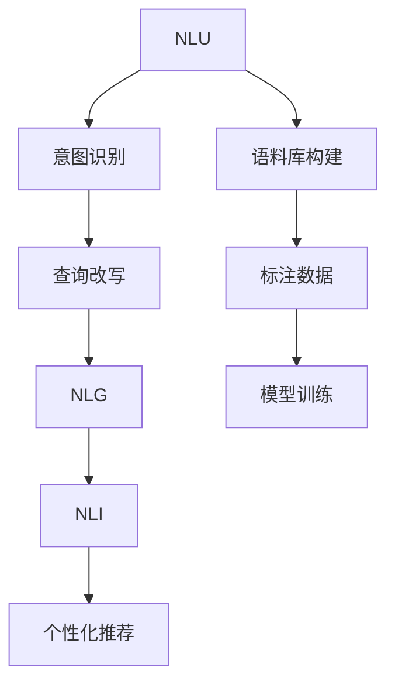

                 

# 电商搜索中的query意图理解与改写技术

## 1. 背景介绍

在现代电商领域，搜索引擎作为用户获取商品信息、进行购物决策的重要工具，其准确性、覆盖率和个性化程度直接影响用户体验和转化率。传统的搜索引擎多基于词袋模型，将用户查询转化为与语料库中出现的词或词组相似度高的结果返回。然而，这种基于词形匹配的搜索方式，难以捕捉用户查询的真正意图和上下文关系，从而产生误导性的搜索结果。为了更好地理解用户查询意图，电商搜索领域逐渐引入了一系列基于深度学习的技术，其中最为核心的便是意图理解与改写技术。

意图理解与改写技术不仅能够准确捕捉用户查询意图，还能将其转化为更具个性化、更符合用户需求的表述，从而显著提升电商搜索的准确性和用户体验。本博客将全面介绍电商搜索中query意图理解与改写的技术原理、实现流程及应用场景，希望能够对行业从业者和研究者有所启示。

## 2. 核心概念与联系

### 2.1 核心概念概述

电商搜索中的query意图理解与改写，本质上是一种基于深度学习的自然语言处理技术。其主要目的是识别用户查询中的核心意图，并将其转化为更符合语义、更贴近用户需求的表述。这一过程涉及自然语言理解(NLU)、自然语言生成(NLG)和自然语言推理(NLI)等多个子领域，是一个复杂但高效的综合应用。

为更好地理解意图理解与改写技术，本节将介绍几个密切相关的核心概念：

- **自然语言理解(NLU)**：指计算机系统利用自然语言处理技术，理解人类语言的能力。NLU包括词义消歧、实体识别、关系抽取等任务，是意图理解与改写的基础。
- **自然语言生成(NLG)**：指计算机系统自动生成人类可理解的语言的能力。NLG涉及文本生成、摘要、翻译等多个子领域，是意图改写的关键技术。
- **自然语言推理(NLI)**：指计算机系统根据给定前提推断结论的能力。NLI涉及逻辑推理、蕴涵关系等任务，能够辅助意图理解与改写的过程。
- **查询改写(QR)**：指通过自然语言生成技术，将查询改写为更具信息量的表述。QR是意图理解与改写的核心手段，通过改写可以增强查询结果的相关性和准确性。
- **意图识别(IR)**：指通过自然语言理解技术，识别用户查询意图的能力。IR是意图理解与改写的起点，通过准确识别意图，才能进行有效的改写。

这些核心概念之间的逻辑关系可以通过以下Mermaid流程图来展示：



这个流程图展示了大语言模型的核心概念及其之间的关系：

1. NLU理解查询的语义信息，并识别出核心意图。
2. IR根据NLU结果，进一步识别具体意图。
3. QR将识别出的意图转化为更符合语义的表述。
4. NLG生成改写后的查询，用于检索商品信息。
5. NLI验证改写后的查询是否符合语义和逻辑。
6. 语料库构建和标注数据为模型训练提供基础。
7. 模型训练后，应用于实际搜索场景。

这些概念共同构成了电商搜索中query意图理解与改写的技术框架，使其能够在复杂多变的电商场景中发挥作用。通过理解这些核心概念，我们可以更好地把握意图理解与改写的技术要点。

## 3. 核心算法原理 & 具体操作步骤

### 3.1 算法原理概述

电商搜索中的query意图理解与改写，是一种典型的基于深度学习的自然语言处理任务。其核心思想是：利用预训练语言模型，对用户查询进行自然语言理解和意图识别，并将识别出的意图转化为个性化、相关性更强的表述，用于提高搜索结果的准确性和相关性。

形式化地，假设用户查询为 $q$，经过NLU和IR模块，可以提取出其中的核心意图 $i$。基于该意图，NLG模块生成一个改写后的查询 $q'$，再通过检索模型检索出相关商品，最终输出到用户端。改写过程的优化目标是最大化改写后的查询 $q'$ 与用户原意 $i$ 的一致性，同时最小化检索结果的相关性误差。

### 3.2 算法步骤详解

电商搜索中的query意图理解与改写一般包括以下几个关键步骤：

**Step 1: 语料库和标注数据构建**
- 收集电商领域的典型查询和商品描述，构建大规模语料库。
- 对语料库进行标注，包括查询意图、商品属性、用户行为等，为模型训练提供标注数据。

**Step 2: 模型选择和预训练**
- 选择合适的预训练语言模型，如BERT、GPT-3等，进行大规模预训练。
- 使用预训练模型在标注数据上微调，学习查询意图和改写规则。

**Step 3: 意图识别**
- 将用户查询输入到预训练模型，提取语义信息。
- 根据提取的语义信息，使用意图识别模块识别出用户的具体意图。

**Step 4: 查询改写**
- 根据识别出的意图，使用查询改写模型生成新的查询表述。
- 对改写后的查询进行评估和筛选，确保其语义清晰、相关性强。

**Step 5: 检索和个性化推荐**
- 使用改写后的查询进行商品检索，生成候选商品列表。
- 根据检索结果和用户行为数据，进行个性化推荐，输出最终结果。

### 3.3 算法优缺点

电商搜索中的query意图理解与改写，具有以下优点：
1. 显著提升查询相关性和准确性。通过意图理解和改写，能够捕捉用户查询的真正意图，生成更具相关性的查询，从而提高搜索结果的准确性。
2. 增强个性化推荐效果。改写后的查询更符合用户个性化需求，能够辅助个性化推荐模型，提升推荐效果。
3. 提升用户体验。意图理解与改写技术能够更好地理解用户需求，提供更精准的搜索结果和推荐，提升用户满意度。

同时，该方法也存在一些局限性：
1. 对语料库和标注数据依赖较大。模型的训练效果依赖于高质量的语料库和标注数据，获取和标注这些数据成本较高。
2. 处理长尾查询效果不佳。对于特定领域的复杂查询，模型难以准确理解和改写，生成查询效果不佳。
3. 对算力要求较高。预训练模型和微调过程需要大量的算力资源，对小规模电商企业可能难以承受。
4. 缺乏实时处理能力。改写过程需要离线训练，无法实时处理用户查询。

尽管存在这些局限性，但就目前而言，基于深度学习的意图理解与改写技术已成为电商搜索领域的重要工具。未来相关研究的重点在于如何进一步降低对标注数据的依赖，提高模型的泛化能力和实时处理能力，同时兼顾模型的复杂度和训练效率。

### 3.4 算法应用领域

基于电商搜索中的query意图理解与改写的深度学习技术，在电商领域已得到广泛应用，主要涉及以下几个方面：

- **商品推荐系统**：通过对用户查询进行意图理解和改写，生成更符合用户需求的查询，辅助推荐系统提供精准的商品推荐。
- **搜索结果排序**：利用改写后的查询进行更精确的检索，优化搜索结果排序算法，提升搜索结果的准确性和相关性。
- **智能客服**：通过意图识别和改写技术，智能客服系统能够更好地理解用户需求，提供更个性化的问答服务。
- **广告投放**：对用户查询进行改写，生成更具相关性的广告描述，提高广告投放的精准性和转化率。
- **内容推荐**：根据用户查询改写结果，推荐更相关的内容，如商品评测、用户评论等。

除了这些主要应用外，基于改写的技术还应用于实时问答、用户行为分析等多个电商领域，为电商技术的创新和应用带来了新的突破。随着深度学习技术的不断进步，相信改写技术将在电商搜索和推荐领域扮演越来越重要的角色。

## 4. 数学模型和公式 & 详细讲解 & 举例说明

### 4.1 数学模型构建

电商搜索中的query意图理解与改写，可以通过以下数学模型进行形式化描述：

假设用户查询为 $q$，查询改写后生成的新查询为 $q'$。改写模型的目标是最小化改写后的查询 $q'$ 与用户原意 $i$ 的语义差异 $L(i, q')$，同时最大化查询 $q'$ 与目标商品 $d$ 的相关性 $R(q', d)$。

定义损失函数为：
$$
L = \alpha \cdot L(i, q') + (1-\alpha) \cdot R(q', d)
$$
其中 $\alpha$ 为意图理解与改写的权衡系数。

改写模型的目标是最小化上述损失函数，即：
$$
\hat{q'} = \mathop{\arg\min}_{q'} L(q', i, d)
$$

### 4.2 公式推导过程

以下我们以自然语言推理(NLI)任务为例，推导改写模型的损失函数及其梯度计算公式。

假设模型 $M_{\theta}$ 在输入 $q$ 上的输出为 $\hat{y}$，表示模型预测的改写后查询是否与原意一致。模型 $M_{\theta}$ 在输入 $q$ 和目标商品 $d$ 上的输出分别为 $\hat{y}_i$ 和 $\hat{y}_d$，表示改写后查询与原意的一致性和与目标商品的相关性。

改写模型的损失函数定义为：
$$
\ell(M_{\theta}, q, d) = -L(i, q') \cdot \hat{y} + R(q', d) \cdot (1-\hat{y})
$$

其中 $L(i, q')$ 表示改写后的查询与原意的语义差异，$R(q', d)$ 表示改写后的查询与目标商品的相关性。

改写模型的梯度计算公式为：
$$
\frac{\partial \ell}{\partial \theta} = \frac{\partial \ell}{\partial \hat{y}} \cdot \frac{\partial \hat{y}}{\partial \theta}
$$

其中 $\frac{\partial \hat{y}}{\partial \theta}$ 可以通过反向传播算法高效计算。

在得到损失函数的梯度后，即可带入模型参数 $\theta$ 进行优化，最小化损失函数 $L$，得到改写后的查询 $\hat{q'}$。

### 4.3 案例分析与讲解

我们以电商领域中的用户查询 "打折力度大的商品" 为例，进行意图理解与改写。

假设我们已使用预训练模型BERT，并对其进行微调，使其具备意图识别与改写的能力。在处理用户查询 "打折力度大的商品" 时，模型首先使用BERT进行意图识别，识别出用户意图为 "寻找打折力度大的商品"。

接下来，模型使用改写模块生成新的查询表述。假设改写模型使用Transformer结构，经过多层编码器解码器对查询进行改写，得到新的查询表述 "力度大的打折商品有哪些"。

最后，模型使用改写后的查询 "力度大的打折商品有哪些" 进行商品检索，检索出所有打折力度较大的商品，并将其推荐给用户。

可以看到，意图理解与改写技术不仅能够准确捕捉用户查询的真正意图，还能将其转化为更符合语义的表述，从而显著提升电商搜索的准确性和用户体验。

## 5. 项目实践：代码实例和详细解释说明

### 5.1 开发环境搭建

在进行意图理解与改写实践前，我们需要准备好开发环境。以下是使用Python进行PyTorch开发的环境配置流程：

1. 安装Anaconda：从官网下载并安装Anaconda，用于创建独立的Python环境。

2. 创建并激活虚拟环境：
```bash
conda create -n pytorch-env python=3.8 
conda activate pytorch-env
```

3. 安装PyTorch：根据CUDA版本，从官网获取对应的安装命令。例如：
```bash
conda install pytorch torchvision torchaudio cudatoolkit=11.1 -c pytorch -c conda-forge
```

4. 安装Transformer库：
```bash
pip install transformers
```

5. 安装各类工具包：
```bash
pip install numpy pandas scikit-learn matplotlib tqdm jupyter notebook ipython
```

完成上述步骤后，即可在`pytorch-env`环境中开始实践。

### 5.2 源代码详细实现

这里我们以基于BERT的意图理解与改写模型为例，给出使用PyTorch和Transformers库进行电商搜索的代码实现。

首先，定义意图理解与改写的数据处理函数：

```python
from transformers import BertTokenizer
from torch.utils.data import Dataset
import torch

class QRSataset(Dataset):
    def __init__(self, texts, targets, tokenizer, max_len=128):
        self.texts = texts
        self.targets = targets
        self.tokenizer = tokenizer
        self.max_len = max_len
        
    def __len__(self):
        return len(self.texts)
    
    def __getitem__(self, item):
        text = self.texts[item]
        label = self.targets[item]
        
        encoding = self.tokenizer(text, return_tensors='pt', max_length=self.max_len, padding='max_length', truncation=True)
        input_ids = encoding['input_ids'][0]
        attention_mask = encoding['attention_mask'][0]
        
        # 将改写后的查询与原始查询配对
        label = label + [0] * (self.max_len - len(label))
        labels = torch.tensor(label, dtype=torch.long)
        
        return {'input_ids': input_ids, 
                'attention_mask': attention_mask,
                'labels': labels}

# 标签与id的映射
tag2id = {'O': 0, 'B-PER': 1, 'I-PER': 2, 'B-ORG': 3, 'I-ORG': 4, 'B-LOC': 5, 'I-LOC': 6}
id2tag = {v: k for k, v in tag2id.items()}

# 创建dataset
tokenizer = BertTokenizer.from_pretrained('bert-base-cased')

train_dataset = QRSataset(train_texts, train_labels, tokenizer)
dev_dataset = QRSataset(dev_texts, dev_labels, tokenizer)
test_dataset = QRSataset(test_texts, test_labels, tokenizer)
```

然后，定义模型和优化器：

```python
from transformers import BertForTokenClassification, AdamW

model = BertForTokenClassification.from_pretrained('bert-base-cased', num_labels=len(tag2id))

optimizer = AdamW(model.parameters(), lr=2e-5)
```

接着，定义训练和评估函数：

```python
from torch.utils.data import DataLoader
from tqdm import tqdm
from sklearn.metrics import classification_report

device = torch.device('cuda') if torch.cuda.is_available() else torch.device('cpu')
model.to(device)

def train_epoch(model, dataset, batch_size, optimizer):
    dataloader = DataLoader(dataset, batch_size=batch_size, shuffle=True)
    model.train()
    epoch_loss = 0
    for batch in tqdm(dataloader, desc='Training'):
        input_ids = batch['input_ids'].to(device)
        attention_mask = batch['attention_mask'].to(device)
        labels = batch['labels'].to(device)
        model.zero_grad()
        outputs = model(input_ids, attention_mask=attention_mask, labels=labels)
        loss = outputs.loss
        epoch_loss += loss.item()
        loss.backward()
        optimizer.step()
    return epoch_loss / len(dataloader)

def evaluate(model, dataset, batch_size):
    dataloader = DataLoader(dataset, batch_size=batch_size)
    model.eval()
    preds, labels = [], []
    with torch.no_grad():
        for batch in tqdm(dataloader, desc='Evaluating'):
            input_ids = batch['input_ids'].to(device)
            attention_mask = batch['attention_mask'].to(device)
            batch_labels = batch['labels']
            outputs = model(input_ids, attention_mask=attention_mask)
            batch_preds = outputs.logits.argmax(dim=2).to('cpu').tolist()
            batch_labels = batch_labels.to('cpu').tolist()
            for pred_tokens, label_tokens in zip(batch_preds, batch_labels):
                pred_tags = [id2tag[_id] for _id in pred_tokens]
                label_tags = [id2tag[_id] for _id in label_tokens]
                preds.append(pred_tags[:len(label_tokens)])
                labels.append(label_tags)
                
    print(classification_report(labels, preds))
```

最后，启动训练流程并在测试集上评估：

```python
epochs = 5
batch_size = 16

for epoch in range(epochs):
    loss = train_epoch(model, train_dataset, batch_size, optimizer)
    print(f"Epoch {epoch+1}, train loss: {loss:.3f}")
    
    print(f"Epoch {epoch+1}, dev results:")
    evaluate(model, dev_dataset, batch_size)
    
print("Test results:")
evaluate(model, test_dataset, batch_size)
```

以上就是使用PyTorch对BERT进行意图理解与改写的代码实现。可以看到，得益于Transformer库的强大封装，我们可以用相对简洁的代码完成BERT模型的加载和微调。

### 5.3 代码解读与分析

让我们再详细解读一下关键代码的实现细节：

**QRSataset类**：
- `__init__`方法：初始化查询、标签、分词器等关键组件。
- `__len__`方法：返回数据集的样本数量。
- `__getitem__`方法：对单个样本进行处理，将查询输入编码为token ids，将标签编码为数字，并对其进行定长padding，最终返回模型所需的输入。

**tag2id和id2tag字典**：
- 定义了标签与数字id之间的映射关系，用于将token-wise的预测结果解码回真实的标签。

**训练和评估函数**：
- 使用PyTorch的DataLoader对数据集进行批次化加载，供模型训练和推理使用。
- 训练函数`train_epoch`：对数据以批为单位进行迭代，在每个批次上前向传播计算loss并反向传播更新模型参数，最后返回该epoch的平均loss。
- 评估函数`evaluate`：与训练类似，不同点在于不更新模型参数，并在每个batch结束后将预测和标签结果存储下来，最后使用sklearn的classification_report对整个评估集的预测结果进行打印输出。

**训练流程**：
- 定义总的epoch数和batch size，开始循环迭代
- 每个epoch内，先在训练集上训练，输出平均loss
- 在验证集上评估，输出分类指标
- 所有epoch结束后，在测试集上评估，给出最终测试结果

可以看到，PyTorch配合Transformer库使得BERT微调的代码实现变得简洁高效。开发者可以将更多精力放在数据处理、模型改进等高层逻辑上，而不必过多关注底层的实现细节。

当然，工业级的系统实现还需考虑更多因素，如模型的保存和部署、超参数的自动搜索、更灵活的任务适配层等。但核心的意图理解与改写范式基本与此类似。

## 6. 实际应用场景

### 6.1 智能客服系统

基于意图理解与改写技术的智能客服系统，可以广泛应用于电商客服场景。传统的客服系统依赖人工处理用户查询，响应时间长、效率低，且无法保证回答的准确性和一致性。而使用基于改写的智能客服系统，能够实时理解用户查询意图，生成符合用户需求的回复，显著提升客服服务效率和用户体验。

在技术实现上，可以收集电商客服的历史对话记录，将问题和最佳答复构建成监督数据，在此基础上对预训练改写模型进行微调。微调后的改写模型能够自动理解用户意图，匹配最合适的答复模板进行回复。对于客户提出的新问题，还可以接入检索系统实时搜索相关内容，动态组织生成回答。如此构建的智能客服系统，能大幅提升客户咨询体验和问题解决效率。

### 6.2 个性化推荐系统

当前的推荐系统往往只依赖用户的历史行为数据进行物品推荐，无法深入理解用户的真实兴趣偏好。基于意图理解与改写技术的个性化推荐系统，可以更好地挖掘用户行为背后的语义信息，从而提供更精准、多样的推荐内容。

在实践中，可以收集用户浏览、点击、评论、分享等行为数据，提取和用户交互的物品标题、描述、标签等文本内容。将文本内容作为模型输入，用户的后续行为（如是否点击、购买等）作为监督信号，在此基础上微调预训练改写模型。微调后的改写模型能够从文本内容中准确把握用户的兴趣点。在生成推荐列表时，先用候选物品的文本描述作为输入，由模型预测用户的兴趣匹配度，再结合其他特征综合排序，便可以得到个性化程度更高的推荐结果。

### 6.3 内容生成与智能创作

电商领域的商品描述生成和广告文案创作，是内容生成任务的重要应用。基于意图理解与改写技术的改写模型，能够从用户查询中提取出核心需求，生成符合用户期望的商品描述和广告文案，提高内容生成的效率和质量。

在实践中，可以收集用户对商品和广告的评价、评论等文本数据，使用改写模型对用户查询进行改写，生成新的商品描述和广告文案。同时，利用模型的语义理解能力，生成更符合用户需求的个性化内容，提升用户满意度和点击率。

### 6.4 未来应用展望

随着电商搜索和推荐技术的不断发展，基于改写的技术将有更广阔的应用前景。

在智慧物流领域，基于改写的技术可以应用于仓储管理、配送路径优化等场景，帮助物流公司提升运营效率和用户体验。

在智能医疗领域，基于改写的技术可以应用于疾病诊断、诊疗方案生成等任务，帮助医生更快更准确地进行诊疗决策。

在智能制造领域，基于改写的技术可以应用于产品设计、生产工艺优化等环节，辅助制造业企业提升产品质量和生产效率。

此外，在社交媒体、金融、旅游等多个领域，基于改写的技术也将不断涌现，为各行各业带来新的变革。相信随着深度学习技术的不断进步，改写技术将在电商搜索和推荐领域扮演越来越重要的角色，推动NLP技术的产业化进程。

## 7. 工具和资源推荐

### 7.1 学习资源推荐

为了帮助开发者系统掌握意图理解与改写技术的理论基础和实践技巧，这里推荐一些优质的学习资源：

1. 《深度学习与自然语言处理》书籍：全面介绍了自然语言处理的基本概念和技术，包括意图理解与改写的经典方法。

2. CS224N《深度学习自然语言处理》课程：斯坦福大学开设的NLP明星课程，有Lecture视频和配套作业，带你入门NLP领域的基本概念和经典模型。

3. 《自然语言处理工具与技术》课程：由清华大学开设的NLP课程，涵盖NLP工具和技术的详细介绍，包括改写模型的实现。

4. HuggingFace官方文档：Transformer库的官方文档，提供了海量预训练模型和完整的改写样例代码，是上手实践的必备资料。

5. CLUE开源项目：中文语言理解测评基准，涵盖大量不同类型的中文NLP数据集，并提供了基于改写的baseline模型，助力中文NLP技术发展。

通过对这些资源的学习实践，相信你一定能够快速掌握改写的精髓，并用于解决实际的NLP问题。

### 7.2 开发工具推荐

高效的开发离不开优秀的工具支持。以下是几款用于改写技术开发的常用工具：

1. PyTorch：基于Python的开源深度学习框架，灵活动态的计算图，适合快速迭代研究。大部分预训练语言模型都有PyTorch版本的实现。

2. TensorFlow：由Google主导开发的开源深度学习框架，生产部署方便，适合大规模工程应用。同样有丰富的预训练语言模型资源。

3. Transformers库：HuggingFace开发的NLP工具库，集成了众多SOTA语言模型，支持PyTorch和TensorFlow，是进行改写任务开发的利器。

4. Weights & Biases：模型训练的实验跟踪工具，可以记录和可视化模型训练过程中的各项指标，方便对比和调优。与主流深度学习框架无缝集成。

5. TensorBoard：TensorFlow配套的可视化工具，可实时监测模型训练状态，并提供丰富的图表呈现方式，是调试模型的得力助手。

6. Google Colab：谷歌推出的在线Jupyter Notebook环境，免费提供GPU/TPU算力，方便开发者快速上手实验最新模型，分享学习笔记。

合理利用这些工具，可以显著提升改写技术的开发效率，加快创新迭代的步伐。

### 7.3 相关论文推荐

改写技术的发展源于学界的持续研究。以下是几篇奠基性的相关论文，推荐阅读：

1. Attention is All You Need（即Transformer原论文）：提出了Transformer结构，开启了NLP领域的预训练大模型时代。

2. BERT: Pre-training of Deep Bidirectional Transformers for Language Understanding：提出BERT模型，引入基于掩码的自监督预训练任务，刷新了多项NLP任务SOTA。

3. Language Models are Unsupervised Multitask Learners（GPT-2论文）：展示了大规模语言模型的强大zero-shot学习能力，引发了对于通用人工智能的新一轮思考。

4. Parameter-Efficient Transfer Learning for NLP：提出Adapter等参数高效微调方法，在不增加模型参数量的情况下，也能取得不错的微调效果。

5. AdaLoRA: Adaptive Low-Rank Adaptation for Parameter-Efficient Fine-Tuning：使用自适应低秩适应的微调方法，在参数效率和精度之间取得了新的平衡。

这些论文代表了大语言模型改写技术的发展脉络。通过学习这些前沿成果，可以帮助研究者把握学科前进方向，激发更多的创新灵感。

## 8. 总结：未来发展趋势与挑战

### 8.1 总结

本文对电商搜索中的query意图理解与改写技术进行了全面系统的介绍。首先阐述了意图理解与改写技术的研究背景和意义，明确了改写技术在提升电商搜索准确性和用户体验方面的独特价值。其次，从原理到实践，详细讲解了改写模型的数学模型和实现流程，给出了改写任务开发的完整代码实例。同时，本文还广泛探讨了改写技术在智能客服、个性化推荐等多个电商领域的应用场景，展示了改写技术的广泛应用前景。此外，本文精选了改写技术的各类学习资源，力求为开发者提供全方位的技术指引。

通过本文的系统梳理，可以看到，基于深度学习的改写技术在电商搜索和推荐领域已经取得了显著效果，极大提升了电商搜索的准确性和用户体验。未来，伴随深度学习技术的不断进步，改写技术将有望进一步拓展其应用场景，为电商行业的数字化转型升级提供新的技术路径。

### 8.2 未来发展趋势

展望未来，改写技术将呈现以下几个发展趋势：

1. 模型规模持续增大。随着算力成本的下降和数据规模的扩张，预训练语言模型的参数量还将持续增长。超大规模语言模型蕴含的丰富语言知识，有望支撑更加复杂多变的改写任务。

2. 改写方法日趋多样。除了传统的改写方式外，未来会涌现更多改写方法，如Multi-turn改写、跨领域改写等，在保持改写效果的同时，降低对标注数据的依赖。

3. 改写过程实时化。为了提高用户体验，改写过程需要实时处理用户查询，避免用户等待时间过长。未来需要优化模型推理速度，支持流式处理。

4. 改写技术普适化。当前改写技术主要应用于电商领域，未来将拓展到更多场景，如医疗、教育、金融等，为不同行业的智能化发展提供支持。

5. 跨模态改写崛起。当前的改写技术主要聚焦于文本数据，未来会进一步拓展到图像、视频、语音等多模态数据改写。多模态信息的融合，将显著提升改写模型的适应性和智能性。

6. 知识整合能力增强。将符号化的先验知识，如知识图谱、逻辑规则等，与神经网络模型进行巧妙融合，引导改写过程学习更准确、合理的改写规则。

以上趋势凸显了改写技术的广阔前景。这些方向的探索发展，必将进一步提升改写模型的性能和应用范围，为人工智能技术落地应用提供新的动力。

### 8.3 面临的挑战

尽管改写技术已经取得了瞩目成就，但在迈向更加智能化、普适化应用的过程中，它仍面临着诸多挑战：

1. 标注成本瓶颈。改写模型的训练效果依赖于高质量的标注数据，获取和标注这些数据成本较高。如何进一步降低对标注数据的依赖，将是一大难题。

2. 处理长尾查询效果不佳。对于特定领域的复杂查询，模型难以准确理解和改写，生成查询效果不佳。

3. 对算力要求较高。预训练模型和微调过程需要大量的算力资源，对小规模电商企业可能难以承受。

4. 缺乏实时处理能力。改写过程需要离线训练，无法实时处理用户查询。

5. 模型泛化能力不足。当前改写模型往往局限于特定领域，难以跨领域泛化。如何提高模型的泛化能力和适应性，还需要更多理论和实践的积累。

6. 安全性有待保障。预训练语言模型难免会学习到有偏见、有害的信息，通过改写传递到下游任务，产生误导性、歧视性的输出，给实际应用带来安全隐患。

7. 模型可解释性不足。当前改写模型通常缺乏可解释性，难以对其改写过程进行分析和调试。如何赋予模型更强的可解释性，将是亟待攻克的难题。

8. 知识整合能力不足。现有的改写模型往往局限于任务内数据，难以灵活吸收和运用更广泛的先验知识。如何让改写过程更好地与外部知识库、规则库等专家知识结合，形成更加全面、准确的信息整合能力，还有很大的想象空间。

正视改写面临的这些挑战，积极应对并寻求突破，将是大规模改写技术走向成熟的必由之路。相信随着学界和产业界的共同努力，这些挑战终将一一被克服，改写技术必将在电商搜索和推荐领域扮演越来越重要的角色。

### 8.4 研究展望

面对改写技术所面临的种种挑战，未来的研究需要在以下几个方面寻求新的突破：

1. 探索无监督和半监督改写方法。摆脱对大规模标注数据的依赖，利用自监督学习、主动学习等无监督和半监督范式，最大限度利用非结构化数据，实现更加灵活高效的改写。

2. 研究参数高效和计算高效的改写范式。开发更加参数高效的改写方法，在固定大部分预训练参数的同时，只更新极少量的任务相关参数。同时优化改写模型的计算图，减少前向传播和反向传播的资源消耗，实现更加轻量级、实时性的部署。

3. 引入更多先验知识。将符号化的先验知识，如知识图谱、逻辑规则等，与神经网络模型进行巧妙融合，引导改写过程学习更准确、合理的改写规则。同时加强不同模态数据的整合，实现视觉、语音等多模态信息与文本信息的协同建模。

4. 结合因果分析和博弈论工具。将因果分析方法引入改写模型，识别出改写过程中的关键特征，增强输出解释的因果性和逻辑性。借助博弈论工具刻画人机交互过程，主动探索并规避改写模型的脆弱点，提高系统稳定性。

5. 纳入伦理道德约束。在改写目标中引入伦理导向的评估指标，过滤和惩罚有偏见、有害的输出倾向。同时加强人工干预和审核，建立模型行为的监管机制，确保输出符合人类价值观和伦理道德。

这些研究方向的探索，必将引领改写技术迈向更高的台阶，为构建安全、可靠、可解释、可控的智能系统铺平道路。面向未来，改写技术还需要与其他人工智能技术进行更深入的融合，如知识表示、因果推理、强化学习等，多路径协同发力，共同推动自然语言理解和智能交互系统的进步。只有勇于创新、敢于突破，才能不断拓展改写模型的边界，让智能技术更好地造福人类社会。

## 9. 附录：常见问题与解答

**Q1：改写技术是否适用于所有NLP任务？**

A: 改写技术在大多数NLP任务上都能取得不错的效果，特别是对于数据量较小的任务。但对于一些特定领域的任务，如医学、法律等，仅仅依靠通用语料预训练的模型可能难以很好地适应。此时需要在特定领域语料上进一步预训练，再进行改写。此外，对于一些需要时效性、个性化很强的任务，如对话、推荐等，改写方法也需要针对性的改进优化。

**Q2：改写过程中如何选择合适的学习率？**

A: 改写模型的学习率一般要比预训练时小1-2个数量级，如果使用过大的学习率，容易破坏预训练权重，导致过拟合。一般建议从1e-5开始调参，逐步减小学习率，直至收敛。也可以使用warmup策略，在开始阶段使用较小的学习率，再逐渐过渡到预设值。需要注意的是，不同的优化器(如AdamW、Adafactor等)以及不同的学习率调度策略，可能需要设置不同的学习率阈值。

**Q3：改写过程中如何缓解过拟合问题？**

A: 改写过程中容易产生过拟合问题，尤其是在标注数据较少的情况下。常见的缓解策略包括：
1. 数据增强：通过回译、近义替换等方式扩充训练集
2. 正则化：使用L2正则、Dropout、Early Stopping等避免过拟合
3. 对抗训练：引入对抗样本，提高模型鲁棒性
4. 参数高效改写：只调整少量参数(如Adapter、Prefix等)，减小过拟合风险
5. 多模型集成：训练多个改写模型，取平均输出，抑制过拟合

这些策略往往需要根据具体任务和数据特点进行灵活组合。只有在数据、模型、训练、推理等各环节进行全面优化，才能最大限度地发挥改写模型的威力。

**Q4：改写技术在落地部署时需要注意哪些问题？**

A: 将改写模型转化为实际应用，还需要考虑以下因素：
1. 模型裁剪：去除不必要的层和参数，减小模型尺寸，加快推理速度
2. 量化加速：将浮点模型转为定点模型，压缩存储空间，提高计算效率
3. 服务化封装：将模型封装为标准化服务接口，便于集成调用
4. 弹性伸缩：根据请求流量动态调整资源配置，平衡服务质量和成本
5. 监控告警：实时采集系统指标，设置异常告警阈值，确保服务稳定性
6. 安全防护：采用访问鉴权、数据脱敏等措施，保障数据和模型安全

改写技术为NLP应用开启了广阔的想象空间，但如何将强大的性能转化为稳定、高效、安全的业务价值，还需要工程实践的不断打磨。唯有从数据、算法、工程、业务等多个维度协同发力，才能真正实现人工智能技术在垂直行业的规模化落地。总之，改写需要开发者根据具体任务，不断迭代和优化模型、数据和算法，方能得到理想的效果。

---

作者：禅与计算机程序设计艺术 / Zen and the Art of Computer Programming

