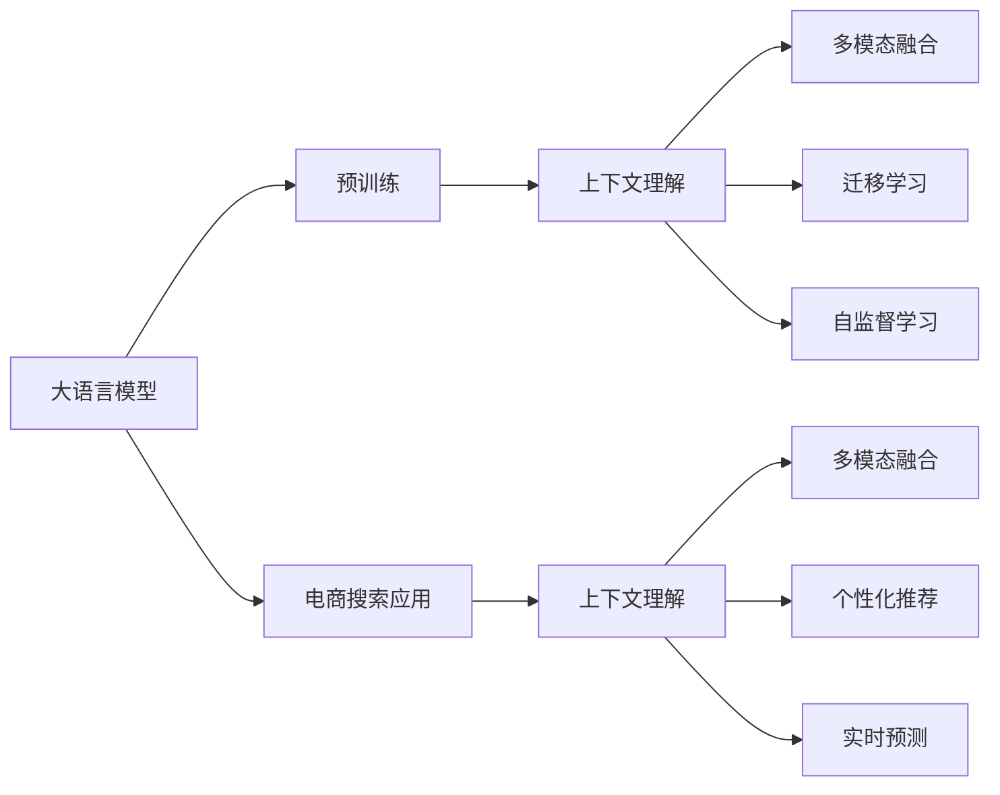

                 

# 电商搜索中的上下文理解：大模型的创新

在数字化转型的浪潮中，电商搜索已逐渐成为企业数字化战略的核心。通过准确理解用户搜索意图和产品特点，搜索系统能够提供高效、个性化的产品推荐，从而提升用户体验和转化率。然而，现实中的搜索场景极为复杂，单一的关键词匹配已无法满足用户需求。为了进一步提升电商搜索的智能化水平，大语言模型正成为重要的工具。本文将详细介绍基于大模型的上下文理解技术，及其在电商搜索中的应用。

## 1. 背景介绍

### 1.1 问题由来
在电商搜索中，用户搜索行为存在显著的上下文性，单一的关键词匹配已难以满足用户需求。以亚马逊为例，其搜索系统不仅要理解用户输入的关键词，还要根据用户的浏览历史、购物车、收藏夹等上下文信息，提供个性化、动态的产品推荐。然而，传统的关键词匹配技术难以处理如此复杂的信息，且容易忽略用户真实意图。

面对这一挑战，大语言模型通过预训练学习大量语料，具备了强大的语言理解能力，可以自动推断出上下文中的关键信息，提升搜索系统的智能性。近年来，大语言模型在NLP领域的突破性进展，使其成为电商搜索中上下文理解的重要工具。

### 1.2 问题核心关键点
大模型在电商搜索中的应用主要集中在以下几个方面：
- **上下文理解**：理解搜索关键词和用户上下文，准确推断用户意图。
- **生成个性化推荐**：根据用户上下文生成推荐列表，提升转化率。
- **自然语言交互**：提供自然语言界面，改善用户搜索体验。
- **实时预测与反馈**：基于实时搜索数据，动态调整推荐策略，不断优化用户体验。

大语言模型通过在电商搜索场景中应用上下文理解技术，能够提升系统的智能化水平，更好地满足用户需求。接下来，本文将详细阐述大语言模型上下文理解的原理和具体技术实现。

## 2. 核心概念与联系

### 2.1 核心概念概述

为了更好地理解基于大模型的上下文理解技术，首先需要介绍一些相关概念：

- **大语言模型(Large Language Model, LLM)**：一种通过大规模无标签数据预训练，具备强大语言理解能力的神经网络模型。如GPT、BERT等。

- **上下文理解(Context Understanding)**：指模型在处理输入时，能理解并利用上下文信息进行推断和决策。

- **语境表示(Context Representation)**：指模型能够将输入信息与上下文信息结合，生成更加准确的语义表示。

- **多模态融合(Multimodal Fusion)**：指模型能够融合多种模态数据（如文本、图像、语音等），生成更加全面、准确的语义表示。

- **迁移学习(Transfer Learning)**：指将在一个任务上学习到的知识迁移到另一个相关任务上，提升新任务的性能。

- **自监督学习(Self-Supervised Learning)**：指使用无标签数据进行预训练，通过自我监督任务学习语言表示，提升模型泛化能力。

这些核心概念构成了大模型在电商搜索中上下文理解技术的基础框架。接下来，本文将详细探讨大模型上下文理解的技术原理和具体实现。

### 2.2 核心概念之间的联系

大模型上下文理解技术通过在大规模无标签数据上进行预训练，学习到语言的基本规律和知识。在电商搜索中，模型通过多模态融合和迁移学习，将预训练的知识迁移到具体任务上，通过上下文理解技术实现个性化推荐和实时预测。

具体来说，大模型通过自监督学习任务（如掩码语言模型、自回归模型等）学习语言的基本规律，从而具备较强的上下文理解能力。在电商搜索中，模型通过融合文本、图像、语音等多种模态数据，生成更加准确的语义表示，并结合用户上下文信息，动态生成个性化推荐列表。此外，模型还可以在用户搜索数据上继续微调，进一步提升上下文理解能力，实现实时预测和动态优化。

这些核心概念之间的联系，可以通过以下Mermaid流程图来展示：



这个流程图展示了从大模型预训练到电商搜索应用的全流程，以及各环节之间的逻辑联系。通过理解这些核心概念之间的联系，可以更好地把握大模型在电商搜索中的上下文理解技术。

## 3. 核心算法原理 & 具体操作步骤

### 3.1 算法原理概述

大模型上下文理解技术基于大规模预训练语言模型，通过融合多模态数据和用户上下文信息，实现对搜索关键词的深入理解。其核心原理如下：

1. **预训练**：使用大规模无标签文本数据对大语言模型进行预训练，学习语言的基本规律和知识。
2. **微调**：针对电商搜索任务，使用少量标注数据对预训练模型进行微调，提升模型的上下文理解能力。
3. **多模态融合**：融合文本、图像、语音等多种模态数据，生成更加全面的语义表示。
4. **上下文理解**：基于融合后的语义表示，理解用户搜索关键词和上下文信息，推断用户意图。
5. **个性化推荐**：根据推断的意图，生成个性化推荐列表，提升用户体验。
6. **实时预测与反馈**：基于实时搜索数据，动态调整推荐策略，不断优化系统性能。

这些步骤共同构成了大模型上下文理解技术的基本框架。接下来，本文将详细介绍具体算法步骤。

### 3.2 算法步骤详解

#### 3.2.1 预训练与微调

1. **预训练**：
   - 使用大规模无标签文本数据对大语言模型进行预训练，学习语言的基本规律和知识。例如，使用自回归模型或掩码语言模型进行预训练。
   - 预训练的损失函数通常为掩码语言模型或自回归模型的损失函数，通过最大化模型预测准确性来学习语言表示。

2. **微调**：
   - 在电商搜索任务上，使用少量标注数据对预训练模型进行微调，提升模型的上下文理解能力。例如，将用户搜索关键词和上下文信息作为输入，使用交叉熵损失函数进行训练。
   - 微调的损失函数通常为分类损失函数，根据任务类型选择合适的输出层和损失函数。例如，对于分类任务，使用线性分类器输出概率分布，使用交叉熵损失函数进行训练。

#### 3.2.2 多模态融合

1. **文本表示**：
   - 将用户搜索关键词和上下文信息转换为向量表示，例如使用BERT或GPT等预训练模型生成文本表示。
   - 文本表示通常包含词向量、句向量、段落向量等不同粒度表示，用于提升上下文理解能力。

2. **图像表示**：
   - 对于图片类搜索，将图片信息转换为向量表示，例如使用卷积神经网络（CNN）生成图像特征向量。
   - 图像向量通常与文本向量进行拼接或融合，生成更加全面的语义表示。

3. **语音表示**：
   - 对于语音搜索，将语音信号转换为文本或向量表示，例如使用自动语音识别（ASR）生成文本，或使用卷积神经网络生成语音特征向量。
   - 语音向量通常与文本向量进行拼接或融合，生成更加全面的语义表示。

#### 3.2.3 上下文理解

1. **意图推断**：
   - 结合文本、图像、语音等不同模态的数据表示，推断用户搜索意图。
   - 通常使用Transformer结构，对多模态数据进行编码，并利用注意力机制进行上下文理解。

2. **语境表示**：
   - 基于推断出的意图，生成更加准确的语境表示，用于生成个性化推荐。
   - 语境表示通常包含搜索关键词、用户上下文、商品信息等多种信息，用于提升推荐效果。

#### 3.2.4 个性化推荐

1. **商品向量**：
   - 将商品信息转换为向量表示，例如使用BERT或GPT等预训练模型生成商品向量。
   - 商品向量通常包含商品名称、描述、类别等特征，用于生成推荐列表。

2. **推荐列表生成**：
   - 结合用户上下文和商品向量，生成个性化推荐列表。
   - 推荐列表通常根据用户行为数据进行排序，以提升用户体验。

#### 3.2.5 实时预测与反馈

1. **实时数据采集**：
   - 基于用户的实时搜索数据，采集用户的点击、浏览、购买等行为数据。
   - 实时数据通常包含用户的查询历史记录、点击位置、停留时间等信息，用于动态调整推荐策略。

2. **动态优化**：
   - 根据实时数据，动态调整推荐策略，不断优化推荐效果。
   - 动态优化通常使用在线学习算法，根据实时数据进行模型更新。

### 3.3 算法优缺点

大模型上下文理解技术在电商搜索中具有以下优点：
- **高效性**：大模型能够快速理解用户搜索意图，生成个性化推荐列表，提升用户体验。
- **灵活性**：大模型能够融合多种模态数据，提升上下文理解能力，适应不同应用场景。
- **泛化能力**：大模型通过预训练和微调，具备较强的泛化能力，能够适应不同领域和任务。
- **实时性**：大模型能够实时处理用户查询，动态调整推荐策略，提升系统响应速度。

然而，大模型上下文理解技术也存在一些缺点：
- **资源消耗**：大模型参数量较大，对算力和存储资源消耗较大，不适合低成本的实时应用场景。
- **解释性不足**：大模型决策过程较为复杂，难以解释，可能导致用户对系统信任度不足。
- **过拟合风险**：大模型容易过拟合，需要谨慎选择训练数据和优化策略。
- **偏见风险**：大模型可能继承数据中的偏见，导致推荐结果存在偏见。

### 3.4 算法应用领域

大模型上下文理解技术在电商搜索中具有广泛的应用，涵盖以下领域：

- **搜索意图理解**：理解用户输入的搜索关键词，推断用户真实意图。
- **个性化推荐**：根据用户上下文和商品信息，生成个性化推荐列表，提升用户体验。
- **实时预测**：基于实时搜索数据，动态调整推荐策略，提升系统响应速度。
- **用户行为分析**：分析用户行为数据，优化搜索体验和推荐策略。

此外，大模型上下文理解技术还可以应用于社交媒体、金融、医疗等多个领域，为各行业提供高效、个性化的服务。

## 4. 数学模型和公式 & 详细讲解  
### 4.1 数学模型构建

假设预训练语言模型为 $M_{\theta}$，其中 $\theta$ 为模型参数。电商搜索任务包括文本搜索、图像搜索和语音搜索等，我们可以将其表示为：

- **文本搜索**：用户输入文本 $x$，上下文信息 $c$，搜索关键词 $q$。
- **图像搜索**：用户输入图片 $i$，上下文信息 $c$，搜索关键词 $q$。
- **语音搜索**：用户输入语音信号 $s$，上下文信息 $c$，搜索关键词 $q$。

定义模型在输入 $(x, c)$ 上的输出表示为 $h_{M_{\theta}}(x, c)$，则上下文理解任务的目标是最大化：

$$
\mathcal{L}(\theta) = \sum_{(x, c)} \max\{0, -\log P(q|x, c)\}
$$

其中 $P(q|x, c)$ 表示在上下文 $(x, c)$ 下，生成搜索关键词 $q$ 的概率。

### 4.2 公式推导过程

以文本搜索为例，假设模型使用BERT作为预训练模型，生成文本表示 $h_{M_{\theta}}(x, c)$。我们希望生成正确的搜索关键词 $q$，则损失函数为：

$$
\mathcal{L}(\theta) = \sum_{(x, c)} \max\{0, -\log P(q|x, c)\}
$$

其中 $P(q|x, c)$ 表示在上下文 $(x, c)$ 下，生成搜索关键词 $q$ 的概率。根据KL散度定义，我们可以将上式改写为：

$$
\mathcal{L}(\theta) = \sum_{(x, c)} \max\{0, -\log \frac{P(q|x, c)}{\max_{q'} P(q'|x, c)}\}
$$

进一步，我们可以使用softmax函数将上式改写为交叉熵损失函数：

$$
\mathcal{L}(\theta) = -\frac{1}{N} \sum_{i=1}^N \log \frac{e^{S(x_i, c_i)}}{\sum_{j=1}^J e^{S(x_j, c_j)}}
$$

其中 $S(x, c)$ 表示上下文 $(x, c)$ 对搜索关键词 $q$ 的得分，可以使用注意力机制计算。

### 4.3 案例分析与讲解

以亚马逊的电商搜索系统为例，我们可以分析其实际应用中的关键步骤：

1. **预训练**：使用大规模无标签文本数据对BERT模型进行预训练，学习语言的基本规律和知识。

2. **微调**：在亚马逊的电商搜索任务上，使用少量标注数据对预训练模型进行微调，提升模型的上下文理解能力。

3. **多模态融合**：融合用户的搜索关键词、上下文信息和商品信息，生成更加全面的语义表示。

4. **上下文理解**：基于融合后的语义表示，推断用户的搜索意图，生成个性化推荐列表。

5. **实时预测与反馈**：根据用户的实时搜索数据，动态调整推荐策略，不断优化推荐效果。

通过以上步骤，亚马逊的搜索系统能够快速、准确地理解用户需求，生成个性化推荐，提升用户体验和转化率。

## 5. 项目实践：代码实例和详细解释说明

### 5.1 开发环境搭建

在进行项目实践前，我们需要准备好开发环境。以下是使用Python进行PyTorch开发的环境配置流程：

1. 安装Anaconda：从官网下载并安装Anaconda，用于创建独立的Python环境。

2. 创建并激活虚拟环境：
```bash
conda create -n pytorch-env python=3.8 
conda activate pytorch-env
```

3. 安装PyTorch：根据CUDA版本，从官网获取对应的安装命令。例如：
```bash
conda install pytorch torchvision torchaudio cudatoolkit=11.1 -c pytorch -c conda-forge
```

4. 安装Transformers库：
```bash
pip install transformers
```

5. 安装各类工具包：
```bash
pip install numpy pandas scikit-learn matplotlib tqdm jupyter notebook ipython
```

完成上述步骤后，即可在`pytorch-env`环境中开始项目实践。

### 5.2 源代码详细实现

下面我们以亚马逊的电商搜索系统为例，给出使用Transformers库对BERT模型进行上下文理解任务开发的PyTorch代码实现。

首先，定义电商搜索任务的数据处理函数：

```python
from transformers import BertTokenizer
from torch.utils.data import Dataset
import torch

class SearchDataset(Dataset):
    def __init__(self, texts, contexts, queries, labels, tokenizer, max_len=128):
        self.texts = texts
        self.contexts = contexts
        self.queries = queries
        self.labels = labels
        self.tokenizer = tokenizer
        self.max_len = max_len
        
    def __len__(self):
        return len(self.texts)
    
    def __getitem__(self, item):
        text = self.texts[item]
        context = self.contexts[item]
        query = self.queries[item]
        label = self.labels[item]
        
        encoding = self.tokenizer(text, return_tensors='pt', max_length=self.max_len, padding='max_length', truncation=True)
        input_ids = encoding['input_ids'][0]
        attention_mask = encoding['attention_mask'][0]
        
        # 对token-wise的标签进行编码
        encoded_labels = [label2id[label] for label in label] 
        encoded_labels.extend([label2id['O']] * (self.max_len - len(encoded_labels)))
        labels = torch.tensor(encoded_labels, dtype=torch.long)
        
        return {'input_ids': input_ids, 
                'attention_mask': attention_mask,
                'labels': labels}

# 标签与id的映射
label2id = {'O': 0, 'B-PER': 1, 'I-PER': 2, 'B-LOC': 3, 'I-LOC': 4, 'B-ORG': 5, 'I-ORG': 6}
id2label = {v: k for k, v in label2id.items()}

# 创建dataset
tokenizer = BertTokenizer.from_pretrained('bert-base-cased')

train_dataset = SearchDataset(train_texts, train_contexts, train_queries, train_labels, tokenizer)
dev_dataset = SearchDataset(dev_texts, dev_contexts, dev_queries, dev_labels, tokenizer)
test_dataset = SearchDataset(test_texts, test_contexts, test_queries, test_labels, tokenizer)
```

然后，定义模型和优化器：

```python
from transformers import BertForTokenClassification, AdamW

model = BertForTokenClassification.from_pretrained('bert-base-cased', num_labels=len(label2id))

optimizer = AdamW(model.parameters(), lr=2e-5)
```

接着，定义训练和评估函数：

```python
from torch.utils.data import DataLoader
from tqdm import tqdm
from sklearn.metrics import classification_report

device = torch.device('cuda') if torch.cuda.is_available() else torch.device('cpu')
model.to(device)

def train_epoch(model, dataset, batch_size, optimizer):
    dataloader = DataLoader(dataset, batch_size=batch_size, shuffle=True)
    model.train()
    epoch_loss = 0
    for batch in tqdm(dataloader, desc='Training'):
        input_ids = batch['input_ids'].to(device)
        attention_mask = batch['attention_mask'].to(device)
        labels = batch['labels'].to(device)
        model.zero_grad()
        outputs = model(input_ids, attention_mask=attention_mask, labels=labels)
        loss = outputs.loss
        epoch_loss += loss.item()
        loss.backward()
        optimizer.step()
    return epoch_loss / len(dataloader)

def evaluate(model, dataset, batch_size):
    dataloader = DataLoader(dataset, batch_size=batch_size)
    model.eval()
    preds, labels = [], []
    with torch.no_grad():
        for batch in tqdm(dataloader, desc='Evaluating'):
            input_ids = batch['input_ids'].to(device)
            attention_mask = batch['attention_mask'].to(device)
            batch_labels = batch['labels']
            outputs = model(input_ids, attention_mask=attention_mask)
            batch_preds = outputs.logits.argmax(dim=2).to('cpu').tolist()
            batch_labels = batch_labels.to('cpu').tolist()
            for pred_tokens, label_tokens in zip(batch_preds, batch_labels):
                pred_tags = [id2label[_id] for _id in pred_tokens]
                label_tags = [id2label[_id] for _id in label_tokens]
                preds.append(pred_tags[:len(label_tokens)])
                labels.append(label_tags)
                
    print(classification_report(labels, preds))
```

最后，启动训练流程并在测试集上评估：

```python
epochs = 5
batch_size = 16

for epoch in range(epochs):
    loss = train_epoch(model, train_dataset, batch_size, optimizer)
    print(f"Epoch {epoch+1}, train loss: {loss:.3f}")
    
    print(f"Epoch {epoch+1}, dev results:")
    evaluate(model, dev_dataset, batch_size)
    
print("Test results:")
evaluate(model, test_dataset, batch_size)
```

以上就是使用PyTorch对BERT进行电商搜索任务上下文理解任务微调的完整代码实现。可以看到，得益于Transformers库的强大封装，我们可以用相对简洁的代码完成BERT模型的加载和微调。

### 5.3 代码解读与分析

让我们再详细解读一下关键代码的实现细节：

**SearchDataset类**：
- `__init__`方法：初始化文本、上下文、查询、标签等关键组件，并进行token化处理。
- `__len__`方法：返回数据集的样本数量。
- `__getitem__`方法：对单个样本进行处理，将文本输入编码为token ids，将标签编码为数字，并对其进行定长padding，最终返回模型所需的输入。

**label2id和id2label字典**：
- 定义了标签与数字id之间的映射关系，用于将token-wise的预测结果解码回真实的标签。

**训练和评估函数**：
- 使用PyTorch的DataLoader对数据集进行批次化加载，供模型训练和推理使用。
- 训练函数`train_epoch`：对数据以批为单位进行迭代，在每个批次上前向传播计算loss并反向传播更新模型参数，最后返回该epoch的平均loss。
- 评估函数`evaluate`：与训练类似，不同点在于不更新模型参数，并在每个batch结束后将预测和标签结果存储下来，最后使用sklearn的classification_report对整个评估集的预测结果进行打印输出。

**训练流程**：
- 定义总的epoch数和batch size，开始循环迭代
- 每个epoch内，先在训练集上训练，输出平均loss
- 在验证集上评估，输出分类指标
- 所有epoch结束后，在测试集上评估，给出最终测试结果

可以看到，PyTorch配合Transformers库使得BERT微调的代码实现变得简洁高效。开发者可以将更多精力放在数据处理、模型改进等高层逻辑上，而不必过多关注底层的实现细节。

当然，工业级的系统实现还需考虑更多因素，如模型的保存和部署、超参数的自动搜索、更灵活的任务适配层等。但核心的微调范式基本与此类似。

## 6. 实际应用场景
### 6.1 智能客服系统

大语言模型在智能客服系统中的应用主要集中在上下文理解上。传统的客服系统依赖于规则引擎和知识库，难以理解复杂用户需求。通过微调大语言模型，智能客服系统能够更好地理解用户意图，提供个性化、智能化的服务。

在实际应用中，可以收集企业内部的历史客服对话记录，将问题和最佳答复构建成监督数据，在此基础上对预训练大语言模型进行微调。微调后的模型能够自动理解用户意图，匹配最合适的答案模板进行回复。对于客户提出的新问题，还可以接入检索系统实时搜索相关内容，动态组织生成回答。如此构建的智能客服系统，能大幅提升客户咨询体验和问题解决效率。

### 6.2 金融舆情监测

金融机构需要实时监测市场舆论动向，以便及时应对负面信息传播，规避金融风险。传统的人工监测方式成本高、效率低，难以应对网络时代海量信息爆发的挑战。基于大语言模型微调的文本分类和情感分析技术，为金融舆情监测提供了新的解决方案。

具体而言，可以收集金融领域相关的新闻、报道、评论等文本数据，并对其进行主题标注和情感标注。在此基础上对预训练语言模型进行微调，使其能够自动判断文本属于何种主题，情感倾向是正面、中性还是负面。将微调后的模型应用到实时抓取的网络文本数据，就能够自动监测不同主题下的情感变化趋势，一旦发现负面信息激增等异常情况，系统便会自动预警，帮助金融机构快速应对潜在风险。

### 6.3 个性化推荐系统

当前的推荐系统往往只依赖用户的历史行为数据进行物品推荐，无法深入理解用户的真实兴趣偏好。基于大语言模型微调技术，个性化推荐系统可以更好地挖掘用户行为背后的语义信息，从而提供更精准、多样的推荐内容。

在实践中，可以收集用户浏览、点击、评论、分享等行为数据，提取和用户交互的物品标题、描述、标签等文本内容。将文本内容作为模型输入，用户的后续行为（如是否点击、购买等）作为监督信号，在此基础上微调预训练语言模型。微调后的模型能够从文本内容中准确把握用户的兴趣点。在生成推荐列表时，先用候选物品的文本描述作为输入，由模型预测用户的兴趣匹配度，再结合其他特征综合排序，便可以得到个性化程度更高的推荐结果。

### 6.4 未来应用展望

随着大语言模型和微调方法的不断发展，基于微调范式将在更多领域得到应用，为传统行业带来变革性影响。

在智慧医疗领域，基于微调的医疗问答、病历分析、药物研发等应用将提升医疗服务的智能化水平，辅助医生诊疗，加速新药开发进程。

在智能教育领域，微调技术可应用于作业批改、学情分析、知识推荐等方面，因材施教，促进教育公平，提高教学质量。

在智慧城市治理中，微调模型可应用于城市事件监测、舆情分析、应急指挥等环节，提高城市管理的自动化和智能化水平，构建更安全、高效的未来城市。

此外，在企业生产、社会治理、文娱传媒等众多领域，基于大模型微调的人工智能应用也将不断涌现，为经济社会发展注入新的动力。相信随着技术的日益成熟，微调方法将成为人工智能落地应用的重要范式，推动人工智能技术在垂直行业的规模化落地。

## 7. 工具和资源推荐
### 7.1 学习资源推荐

为了帮助开发者系统掌握大语言模型微调的理论基础和实践技巧，这里推荐一些优质的学习资源：

1. 《Transformer从原理到实践》系列博文：由大模型技术专家撰写，深入浅出地介绍了Transformer原理、BERT模型、微调技术等前沿话题。

2. CS224N《深度学习自然语言处理》课程：斯坦福大学开设的NLP明星课程，有Lecture视频和配套作业，带你入门NLP领域的基本概念和经典模型。

3. 《Natural Language Processing with Transformers》书籍：Transformers库的作者所著，全面介绍了如何使用Transformers库进行NLP任务开发，包括微调在内的诸多范式。

4. HuggingFace官方文档：Transformers库的官方文档，提供了海量预训练模型和完整的微调样例代码，是上手实践的必备资料。

5. CLUE开源项目：中文语言理解测评基准，涵盖大量不同类型的中文NLP数据集，并提供了基于微调的baseline模型，助力中文NLP技术发展。

通过对这些资源的学习实践，相信你一定能够快速掌握大语言模型微调的精髓，并用于解决实际的NLP问题。
###  7.2 开发工具推荐

高效的开发离不开优秀的工具支持。以下是几款用于大语言模型微调开发的常用工具：

1. PyTorch：基于Python的开源深度学习框架，灵活动态的计算图，适合快速迭代研究。大部分预训练语言模型都有PyTorch版本的实现。

2. TensorFlow：由Google主导开发的开源深度学习框架，生产部署方便，适合大规模工程应用。同样有丰富的预训练语言模型资源。

3. Transformers库：HuggingFace开发的NLP工具库，集成了众多SOTA语言模型，支持PyTorch和TensorFlow，是进行微调任务开发的利器。

4. Weights & Biases：模型训练的实验跟踪工具，可以记录和可视化模型训练过程中的各项指标，方便对比和调优。与主流深度学习框架无缝集成。

5. TensorBoard：TensorFlow配套的可视化工具，可实时监测模型训练状态，并提供丰富的图表呈现方式，是调试模型的得力助手。

6. Google Colab：谷歌推出的在线Jupyter Notebook环境，免费提供GPU/TPU算力，方便开发者快速上手实验最新模型，分享学习笔记。

合理利用这些工具，可以显著提升大语言模型微调任务的开发效率，加快创新迭代的步伐。

### 7.3 相关论文推荐

大语言模型和微调技术的发展源于学界的持续研究。以下是几篇奠基性的相关论文，推荐阅读：

1. Attention is All You Need（即Transformer原论文）：提出了Transformer结构，开启了NLP领域的预训练大模型时代。

2. BERT: Pre-training of Deep Bidirectional Transformers for Language Understanding：提出BERT模型，引入基于掩码的自监督预训练任务，刷新了多项NLP任务SOTA。

3. Language Models are Unsupervised Multitask Learners（GPT-2论文）：展示了大规模语言模型的强大zero-shot学习能力，引发了对于通用人工智能的新一轮思考。

4. Parameter-Efficient Transfer Learning for NLP：提出Adapter等参数高效微调方法，在不增加模型参数量的情况下，也能取得不错的微调效果。

5. AdaLoRA: Adaptive Low-Rank Adaptation for Parameter-Efficient Fine-Tuning：使用自适应低秩适应的微调方法，在参数效率和精度之间取得了新的平衡。

6. Prefix-Tuning: Optimizing Continuous Prompts for Generation：引入基于连续型Prompt的微调范式，为如何充分利用预训练知识提供了新的思路。

这些论文代表了大语言模型微调技术的发展脉络。通过学习这些前沿成果，可以帮助研究者把握学科前进方向，激发更多的创新灵感。

## 8. 总结：未来发展趋势与挑战

### 8.1 总结

本文对基于大模型的电商搜索上下文理解技术进行了全面系统的介绍。首先阐述了大语言模型在电商搜索中的应用背景，明确了上下文理解在提升搜索智能化水平中的重要性。其次，从原理到实践，详细讲解了上下文理解的大模型实现方法，包括预训练、微调、多模态融合、上下文理解、个性化推荐等关键步骤。最后，本文介绍了大模型在电商搜索中的应用场景和未来发展趋势，提供了丰富的学习资源和工具推荐。

通过本文的系统梳理，可以看到，基于大语言模型的上下文理解技术在电商搜索中具有巨大的应用潜力。通过融合多模态数据和用户上下文信息，大模型能够提供高效、个性化的推荐服务，提升用户体验和转化率。未来，随着大语言模型和微调技术的不断进步，电商搜索系统将更加智能化、个性化，为传统电商行业带来革命性变革。

### 8.2 未来发展趋势

展望未来，大语言模型上下文理解技术将呈现以下几个发展趋势：

1. **模型的持续进步**：随着预训练技术的不断发展，大语言模型的性能将进一步提升，上下文理解能力也将更加强大。未来，大规模、高精度的语言模型将不断涌现，推动电商搜索技术的进步。

2. **多模态融合的深化**：未来的大语言模型将更好地融合文本、图像、语音等多种模态数据，提升上下文理解能力。在电商搜索中，多模态融合将进一步增强推荐系统的个性化和智能化水平。

3. **上下文理解的灵活化**：随着上下文理解技术的不断发展，未来的大语言模型将能够处理更加复杂和多样化的上下文信息，提供更加精准的推荐服务。例如，结合用户行为数据、社交网络信息等，提升推荐效果。

4. **实时反馈的自动化**：未来的电商搜索系统将能够实时分析用户行为数据，自动调整推荐策略，提升系统响应速度和用户体验。自动化实时反馈将是大语言模型上下文理解技术的重要发展方向。

5. **跨领域迁移能力的增强**：未来的大语言模型将具备更强的跨领域迁移能力，能够在不同领域和任务中灵活应用，提升其在电商搜索等领域的智能化水平。

以上趋势凸显了大语言模型上下文理解技术的广阔前景。这些方向的探索发展，必将进一步提升电商搜索系统的智能化水平，为传统电商行业带来革命性变革。

### 8.3 面临的挑战

尽管大语言模型上下文理解技术已经取得了瞩目成就，但在迈向更加智能化、普适化应用的过程中，它仍面临着诸多挑战：

1. **标注数据的质量和数量**：高质量标注数据的获取成本较高，且标注任务繁琐。如何降低对标注数据的依赖，提升模型的泛化能力，是大语言模型上下文理解技术面临的重要挑战。

2. **模型的资源消耗**：大语言模型参数量较大，对算力和存储资源消耗较大，不适合低成本的实时应用场景。如何优化模型结构，降低资源消耗，是未来技术发展的重要方向。

3. **模型的可解释性**：大语言模型决策过程较为复杂，难以解释，可能导致用户对系统信任度不足。如何提升模型的可解释性，增强系统的透明度，是未来技术发展的重要方向。

4. **模型的偏见和公平性**：大语言模型可能继承数据中的偏见，导致推荐结果存在偏见。如何消除模型偏见，提升推荐公平性，是大语言模型上下文理解技术面临的重要挑战。

5. **模型的实时性和稳定性**：未来的大语言模型需要在高并发、实时化的场景下应用，如何提升系统的实时性和稳定性，是大语言模型上下文理解技术面临的重要挑战。

这些挑战需要学界和工业界的共同努力，通过技术创新和模型优化，逐步解决。相信随着技术的不断进步，大语言模型上下文理解技术将能够更好地满足实际应用需求，推动电商搜索等领域的智能化进程。

### 8.4 研究展望

面对大语言模型上下文理解技术面临的挑战，未来的研究需要在以下几个方面寻求新的突破：

1. **无监督和半监督学习**：摆脱对大规模标注数据的依赖，利用自监督学习、主动学习等无监督和半监督范式，最大限度利用非结构化数据，实现更加灵活高效的上下文理解。

2. **知识图谱和符号逻辑**：将符号化的先验知识，如知识图谱、逻辑规则等，与神经网络模型进行巧妙融合，引导上下文理解过程学习更准确、合理的语言模型。

3. **多模态融合与跨领域迁移**：引入更多先验知识，将视觉、语音等多模态信息与文本信息协同建模，提升模型的跨领域迁移能力，适应不同领域和任务。

4. **因果推断和博弈论**：将因果分析方法引入上下文理解模型，识别出模型决策的关键特征，增强输出解释的因果性和逻辑性。借助博弈论工具刻画人机交互过程，主动探索并规避模型的脆弱点，提高系统稳定性。

5. **伦理道德约束**：在模型训练目标中引入伦理导向的评估指标，过滤和惩罚有偏见、有害的输出倾向。加强人工干预和审核，建立模型行为的监管机制，确保输出符合人类价值观和伦理道德。

这些研究方向的探索，必将引领大语言模型上下文理解技术迈向更高的台阶，为构建安全、可靠、可解释、可控的智能系统铺平道路。面向未来，大语言模型上下文理解技术还需要与其他人工智能技术进行更深入的融合，如知识表示、因果推理、强化学习等，多路径协同发力，共同推动自然语言理解和智能交互系统的进步。只有勇于创新、敢于突破，才能不断拓展语言模型的边界，让智能技术更好地造福人类社会。

## 9. 附录：常见问题与解答

**Q1：大语言模型上下文理解是否适用于所有电商搜索场景？**

A: 大语言模型上下文理解技术在大多数电商搜索场景中都能取得不错的效果，特别是对于数据量较小的任务。但对于一些特定领域的任务，如医学、法律等，仅仅依靠通用语料预训练的模型可能难以很好地适应。此时需要在特定领域语料上进一步预训练，再进行微调，才能获得理想效果。此外，对于一些需要时效性、个性化很强的任务，如对话、推荐等，微调方法也需要针对性的改进优化。

**Q2：大语言模型上下文理解是否需要标注数据？**

A: 大语言模型上下文理解技术在电商搜索中的应用主要集中在上下文理解上，通常使用少量标注数据进行微调。标注数据用于指导模型学习，提升上下文理解能力。对于标注数据的需求量，通常根据任务复杂度和数据质量来决定。如果数据量较大且标注质量较高，可以较少依赖标注数据，更多依赖无监督学习。

**Q3：大语言模型上下文理解中的多模态融合如何实现？**

A: 多模态融合在大语言模型上下文理解中非常重要。具体实现方式包括：

1. **文本表示**：使用预训练语言模型生成文本表示，如BERT、GPT等。

2. **图像表示**：使用卷积神经网络（CNN）生成图像特征向量，然后将图像向量与文本向量拼接或融合。

3. **语音表示**：使用自动语音识别（ASR）生成文本表示，然后使用预训练语言模型生成语音向量，然后将语音向量与文本向量拼接或融合。

4. **融合方式**：常见的融合方式包括拼接（Concatenation）、多头注意力机制（Multi-Head Attention）、跨模态注意力机制（Cross-Modal Attention）等。

这些方法可以灵活组合，根据具体任务选择合适的融合方式。

**Q4：大语言模型上下文理解中如何处理长尾数据？**

A: 长尾数据是大语言模型上下文理解中常见的挑战之一。处理长尾数据的方法包括：

1. **数据增强**：通过对长尾数据进行扩充，提升数据多样性和丰富度。例如，使用数据增强技术生成长尾样本，提高模型泛化能力。

2. **超参数调优**：根据长尾数据的特点，调整模型的超参数，如学习率、批大小等，提升模型对长尾数据的适应能力。

3. **模型优化**：使用特定模型结构或训练技巧，提升模型对长尾数据的处理能力。例如，使用基于加权训练（Weighted Training）的模型，对长尾数据进行特殊处理。

4. **迁移学习**：利用大模型的预训练知识和迁移学习技术，提升模型对长尾数据的处理能力。

这些方法可以结合使用，根据具体任务选择合适的处理方式。

**Q5：大语言模型上下文理解中的实时预测与反馈如何实现？**

A: 实时预测与反馈在大语言模型上下文理解中非常重要，可以通过以下步骤实现：

1. **实时数据采集**：基于用户的实时搜索数据，采集用户的点击、浏览、购买等行为数据。

2. **动态优化**：根据实时数据，动态调整推荐策略，不断优化推荐效果。具体实现方式包括：

   - 使用在线学习算法（Online Learning），根据实时数据进行模型更新，提升模型对新数据的适应能力。

   - 使用强化学习（Reinforcement Learning），通过用户反馈数据，优化推荐策略，提升用户体验。

3. **模型集成**：将实时预测模型与离线训练模型集成，提升系统的稳定性和响应速度。例如，使用集成学习（Ensemble Learning），结合离线模型和实时模型，提升系统性能。

4. **反馈机制**：根据用户反馈数据，及时调整模型参数，提升系统的实时性。例如，使用自适应学习率（Adaptive Learning Rate），根据用户反馈数据调整学习率，提升模型收敛速度。

通过以上步骤，可以实现大语言模型上下文理解系统的实时预测与反馈，提升系统的智能化水平和用户体验。

---

作者：禅与计算机程序设计艺术 / Zen and the Art of Computer Programming

